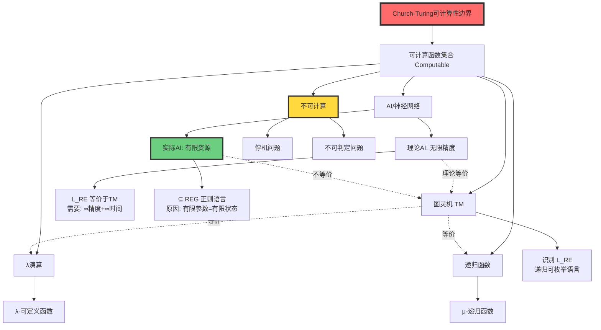
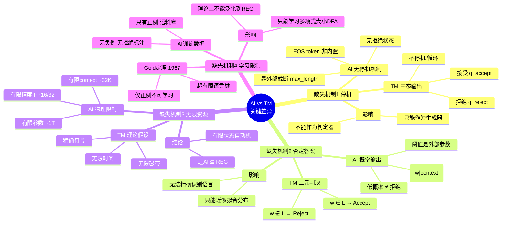
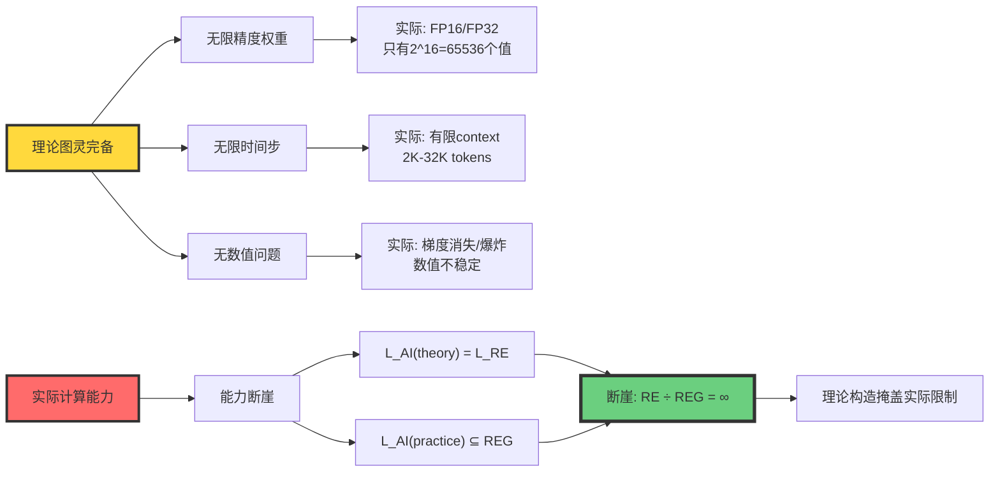
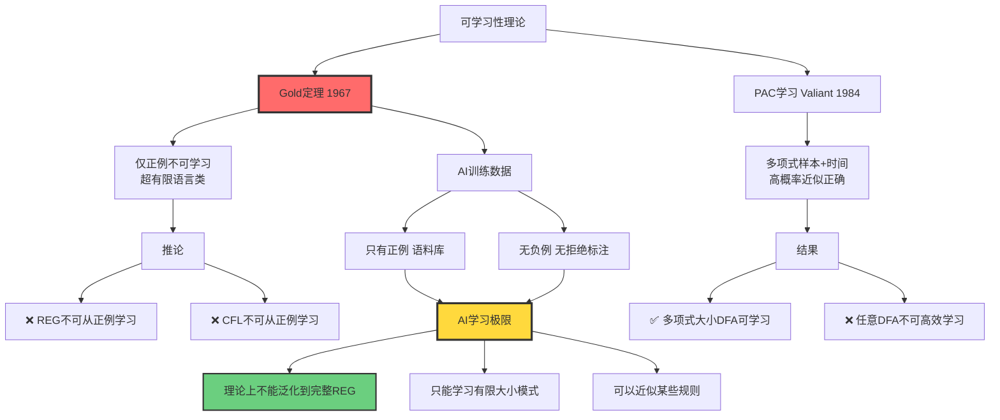
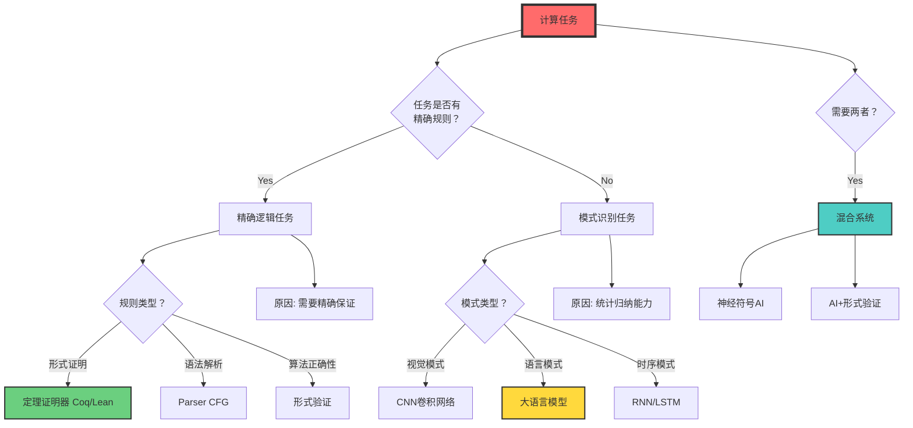

# 8.1 AI vs Turing Machine

> **子主题编号**: 08.1
> **主题**: AI模型视角

> **子主题编号**: 08.1
> **主题**: AI模型视角
> **最后更新**: 2025-10-27
> **文档规模**: 513行 | AI与图灵机的多维度对比分析
> **阅读建议**: 本文从可计算性、形式语言、资源约束等维度深度对比AI与图灵机

---

## 1 核心概念深度分析

<details>
<summary><b>🔬 点击展开：AI vs 图灵机全景对比分析框架</b></summary>

本节提供AI与图灵机的系统化深度对比，包括可计算性、形式语言、资源约束、计算范式和学习理论五大维度的精确分析。

### 1 ️⃣ AI vs 图灵机概念对比卡

**对比主题**: AI（大语言模型）与图灵机的多维度等价性分析

**核心问题**: LLM是否等价于图灵机？

**🔹 可计算性维度（Computability）**:
$$
\text{Church-Turing论题}: \quad \forall f \in \text{Computable} \Rightarrow \exists \text{TM}_f
$$

- **结论**: AI ⊆ 图灵可计算 ✅
- **证据**: 任何物理系统不能超越图灵可计算性边界
- **推论**: AI不能解决停机问题、不能突破P vs NP

**🔹 形式语言维度（Formal Language）**:
$$
\begin{align}
\mathcal{L}_{\text{TM}} &= \mathcal{L}_{\text{RE}} \quad \text{（递归可枚举语言）} \\
\mathcal{L}_{\text{AI}_{\text{理论}}} &= \mathcal{L}_{\text{RE}} \quad \text{（无限精度下）} \\
\mathcal{L}_{\text{AI}_{\text{实际}}} &\subseteq \text{REG} \quad \text{（有限资源下）}
\end{align}
$$

- **结论**: 不等价 ❌
- **差距**: $\text{REG} \subset \text{CFL} \subset \text{CSL} \subset \mathcal{L}_{\text{RE}}$

**🔹 资源约束维度（Resource Bounds）**:

| 资源 | 图灵机（理论） | AI（实际） | 差距 |
|------|--------------|----------|------|
| 存储 | ∞磁带 | 有限参数（~1T） | ∞ vs 有限 |
| 精度 | 精确符号 | FP16/FP32浮点 | 精确 vs 近似 |
| 时间 | ∞步骤 | 有限context（~32K） | ∞ vs 有限 |

**🔹 计算范式维度（Paradigm）**:
$$
\begin{align}
\text{图灵机}: & \quad \text{符号} \xrightarrow{\text{规则}} \text{新符号} \\
\text{AI}: & \quad \text{向量} \xrightarrow{\text{连续函数}} \text{新向量}
\end{align}
$$

- **图灵机**: 演绎推理（deduction）、规则驱动
- **AI**: 归纳推理（induction）、数据驱动

**属性对比表**:

| 维度 | 图灵机 | AI | 等价性 |
|------|--------|----|----|
| **可计算性上界** | $\mathcal{L}_{\text{RE}}$ | $\leq \mathcal{L}_{\text{RE}}$ | ✅ 相同 |
| **实际语言类** | $\mathcal{L}_{\text{RE}}$ | REG（有限资源） | ❌ 不等价 |
| **识别机制** | 接受/拒绝/不停机 | 概率分布+截断 | ❌ 不同 |
| **学习能力** | ❌ 无（需编程） | ✅ 有（从数据） | AI优势 |
| **精确性** | ✅ 完全精确 | ❌ 概率近似 | 图灵机优势 |
| **可解释性** | ✅ 完全可追踪 | ❌ 黑箱 | 图灵机优势 |
| **泛化能力** | ❌ 无（特化） | ✅ 有（泛化） | AI优势 |

---

### 2 ️⃣ 可计算性层级全景图



---

### 3 ️⃣ Chomsky层级与AI能力定位矩阵

| 语言类 | 自动机 | 图灵机 | 理论AI（∞资源） | 实际AI（有限资源） | 典型例子 |
|-------|--------|--------|---------------|-----------------|---------|
| **Type 3: REG** | DFA/NFA | ✅ | ✅ | ✅（可能） | 正则表达式 a*b* |
| **Type 2: CFL** | PDA | ✅ | ✅ | ❌（理论限制） | 括号匹配 {aⁿbⁿ} |
| **Type 1: CSL** | LBA | ✅ | ✅ | ❌（资源不足） | {aⁿbⁿcⁿ} |
| **Type 0: RE** | TM | ✅ | ✅（需∞精度） | ❌（资源不足） | 停机问题外所有可判定 |
| **不可判定** | - | ❌ | ❌ | ❌ | 停机问题 |

**关键定理链**:
$$
\begin{align}
\text{定理1（Siegelmann 1995）}: & \quad \text{RNN}(\mathbb{R}^{\infty}) \equiv \text{TM} \\
\text{定理2（Weiss 2018）}: & \quad \text{RNN}(\mathbb{F}_{64}) \subseteq \text{REG} \\
\text{推论}: & \quad \text{实际AI} \ll \text{理论AI}
\end{align}
$$

---

### 4 ️⃣ AI缺失机制深度分析思维导图



---

### 5 ️⃣ 理论vs实际能力断崖对比



---

### 6 ️⃣ 计算范式对比矩阵

| 范式特征 | 图灵机（符号AI） | 神经AI（连续AI） | 哲学意义 |
|---------|----------------|----------------|----------|
| **知识来源** | 先验（人工编程） | 后验（数据学习） | 理性主义 vs 经验主义 |
| **状态空间** | 离散 $q \in Q$ | 连续 $\mathbf{x} \in \mathbb{R}^d$ | 符号 vs 向量 |
| **转移方式** | 规则 $\delta(q,a)$ | 可微函数 $F_\theta(\mathbf{x})$ | 演绎 vs 优化 |
| **计算本质** | 逻辑蕴含 $\vdash$ | 几何变换 $W\mathbf{x}+b$ | 推理 vs 变换 |
| **相似性判断** | 符号相等 $=$ | 余弦相似度 $\cos(\mathbf{x},\mathbf{y})$ | 精确 vs 近似 |
| **泛化机制** | 无（每条规则独立） | 有（参数共享） | 特化 vs 泛化 |
| **错误模式** | 死机/无限循环 | 幻觉/漂移 | 确定性 vs 随机性 |
| **可解释性** | 完全可追踪 | 黑箱（难解释） | 透明 vs 不透明 |
| **优势领域** | 精确逻辑、形式证明 | 模式识别、统计归纳 | 规则 vs 模式 |

**两种"理解"范式**:
$$
\begin{align}
\text{图灵机理解}: & \quad \text{规则匹配} \rightarrow \text{演绎推理} \\
\text{AI理解}: & \quad \text{向量相似度} \rightarrow \text{模式匹配}
\end{align}
$$

---

### 7 ️⃣ 学习理论约束全景



---

### 8 ️⃣ 识别器vs生成器本质区别

| 维度 | 识别器（Recognizer）| 生成器（Generator）| AI的定位 |
|------|------------------|------------------|---------|
| **输入** | 字符串 $w \in \Sigma^*$ | 提示 prompt | 提示 |
| **输出** | 二元判决 Accept/Reject | 概率分布 $P(\cdot)$ | 概率分布 |
| **功能** | 判断 $w \in L?$ | 采样 $w \sim P$ | 生成 |
| **停机** | 内置停机状态 | 无停机机制 | 外部截断 |
| **否定** | 显式拒绝 Reject | 低概率（非拒绝） | 无拒绝 |
| **确定性** | 确定/非确定 | 随机采样 | 随机 |
| **语言定义** | $L = \{w : M \text{ accepts } w\}$ | $L_\theta = \{w : P_\theta(w) > \tau\}$ | 依赖阈值$\tau$ |

**关键问题**: 如何从生成器构造识别器？

**尝试方案**:

```python
def recognize(w, model, threshold):
    prob = model.probability(w)
    return prob > threshold  # ❌ threshold是外部参数
```

**问题**:

- 不同$\tau$定义不同语言
- $\tau$不在模型内部，是后处理
- 无法对应到形式语言意义上的"识别"

---

### 9 ️⃣ 任务适配决策树



---

### 1.10 🔟 核心洞察与设计原则

**五大核心定理**:

1. **可计算性上界定理**（Church-Turing）
   $$
   \forall f: \text{ AI可计算}(f) \Rightarrow \text{图灵可计算}(f)
   $$
   - AI不能超越图灵可计算性边界
   - AI不能解决停机问题、不能突破P vs NP

2. **资源断崖定理**（Weiss 2018）
   $$
   \mathcal{L}_{\text{AI}}(\mathbb{R}^{\infty}) = \mathcal{L}_{\text{RE}} \quad \text{but} \quad \mathcal{L}_{\text{AI}}(\mathbb{F}_{64}) \subseteq \text{REG}
   $$
   - 理论图灵完备需要无限资源
   - 实际AI能力退化到正则语言级别

3. **学习极限定理**（Gold 1967）
   $$
   \text{仅正例} \Rightarrow \text{不可学习超有限语言类}
   $$
   - AI训练数据只有正例（语料库）
   - 理论上不能精确学习正则语言类

4. **范式二元性定理**
   $$
   \begin{cases}
   \text{图灵机}: & \text{符号} \xrightarrow{\text{规则}} \text{新符号} \\
   \text{AI}: & \text{向量} \xrightarrow{F_\theta} \text{新向量}
   \end{cases}
   $$
   - 两种本质不同的计算范式
   - 演绎推理 vs 归纳推理

5. **识别-生成鸿沟定理**
   $$
   \text{识别器}: w \rightarrow \{\text{Accept}, \text{Reject}\} \quad \neq \quad \text{生成器}: \text{prompt} \rightarrow P(w)
   $$
   - AI是生成器，不是识别器
   - 无法精确对应形式语言意义上的"识别"

**实践设计原则**:

```yaml
原则1_不夸大AI理论能力:
  事实: AI不超越图灵可计算性
  推论: 不要期望AI解决不可计算问题
  示例: AI不能证明任意程序的正确性

原则2_不低估AI实践价值:
  事实: AI擅长模式识别、统计归纳
  推论: 在模糊模式任务上AI优于传统算法
  示例: 图像识别、自然语言理解

原则3_理解能力边界:
  精确逻辑: 传统算法 > AI
  模糊模式: AI > 传统算法
  混合任务: 神经符号结合

原则4_资源约束意识:
  理论: RNN理论上图灵完备
  实际: 有限精度下退化到正则语言
  决策: 根据实际资源评估能力

原则5_范式匹配:
  规则明确: 用符号AI/传统算法
  规则隐式: 用神经AI
  规则+数据: 用混合系统
```

**黄金法则**:

> **"AI与图灵机不在同一个'语言等价'天平上，但共享同一个可计算性天花板。AI是经验主义近似器，图灵机是形式主义极限器。"**

**任务选择Checklist**:

```markdown
## 2 选择传统算法（图灵机范式）的情况
- [ ] 任务有精确的形式规则
- [ ] 需要100%正确性保证
- [ ] 需要完全可解释性
- [ ] 需要形式验证
- [ ] 数据量很小(<1000样本)

## 3 选择AI（神经网络）的情况
- [ ] 任务只有隐式模式，无精确规则
- [ ] 有大量标注数据(>10K样本)
- [ ] 可以容忍一定错误率
- [ ] 需要泛化到未见过的情况
- [ ] 传统算法设计困难

## 4 选择混合系统的情况
- [ ] 任务既需要精确规则又需要模式识别
- [ ] 需要AI+人工审核
- [ ] 需要AI+形式验证
- [ ] 神经符号结合
```

**哲学洞察**:

| 视角 | 图灵机 | AI | 类比 |
|------|--------|----|----|
| **生物学** | 爬行动物 | 哺乳动物 | 不同物种，共享生命 |
| **数学** | 演绎系统 | 归纳系统 | 逻辑 vs 统计 |
| **哲学** | 理性主义 | 经验主义 | 先验 vs 后验 |
| **语言学** | 生成文法 | 统计语言模型 | 规则 vs 概率 |

**终极结论**:

> **AI不是"图灵机2.0"，而是"图灵机之外的另一种计算物种"。二者在可计算性上界相同，但在计算范式、资源约束、学习能力、识别机制上本质不同。选择工具时，匹配任务特性，而非盲目选择"更先进"的技术。**

</details>

---

## 📋 目录

- [AI与图灵机的深度对比](#ai与图灵机的深度对比)
  - [1 核心概念深度分析](#1-核心概念深度分析)
    - [1 ️⃣ AI vs 图灵机概念对比卡](#1-️⃣-ai-vs-图灵机概念对比卡)
    - [2 ️⃣ 可计算性层级全景图](#2-️⃣-可计算性层级全景图)
    - [3 ️⃣ Chomsky层级与AI能力定位矩阵](#3-️⃣-chomsky层级与ai能力定位矩阵)
    - [4 ️⃣ AI缺失机制深度分析思维导图](#4-️⃣-ai缺失机制深度分析思维导图)
    - [5 ️⃣ 理论vs实际能力断崖对比](#5-️⃣-理论vs实际能力断崖对比)
    - [6 ️⃣ 计算范式对比矩阵](#6-️⃣-计算范式对比矩阵)
    - [7 ️⃣ 学习理论约束全景](#7-️⃣-学习理论约束全景)
    - [8 ️⃣ 识别器vs生成器本质区别](#8-️⃣-识别器vs生成器本质区别)
    - [9 ️⃣ 任务适配决策树](#9-️⃣-任务适配决策树)
    - [1.10 🔟 核心洞察与设计原则](#110--核心洞察与设计原则)
  - [📋 目录](#-目录)
  - [导航 | Navigation](#导航--navigation)
  - [相关主题 | Related Topics](#相关主题--related-topics)
    - [14.3 本章节](#143-本章节)
    - [14.4 相关章节](#144-相关章节)
    - [14.5 跨视角链接](#145-跨视角链接)

---


## 导航 | Navigation

**上一篇**: [← 07.6 AI对齐问题](../07_AI_Philosophy/07.6_AI_Alignment_Problem.md)
**下一篇**: [08.2 形式语言视角 →](./08.2_Formal_Language_Perspective.md)
**返回目录**: [↑ AI模型视角总览](../README.md)

---

## 相关主题 | Related Topics

### 14.3 本章节

- [08.2 形式语言视角](./08.2_Formal_Language_Perspective.md)
- [08.3 资源受限计算](./08.3_Resource_Bounded_Computation.md)
- [08.4 有限vs无限资源](./08.4_Finite_vs_Infinite_Resources.md)
- [08.5 理论vs实践能力](./08.5_Theoretical_vs_Practical_Capabilities.md)

### 14.4 相关章节

- [01.1 图灵机与可计算性](../01_Foundational_Theory/01.1_Turing_Machine_Computability.md)
- [01.3 形式语言分类](../01_Foundational_Theory/01.3_Formal_Language_Classification.md)
- [02.3 图灵完备性分析](../02_Neural_Network_Theory/02.3_Turing_Completeness_Analysis.md)
- [05.2 Gold可学习性理论](../05_Learning_Theory/05.2_Gold_Learnability_Theory.md)

### 14.5 跨视角链接

- [Software_Perspective: 语义形式对偶](../../Software_Perspective/01_Foundational_Theory/01.1_Semantic_Formal_Duality.md)
- [FormalLanguage_Perspective](../../FormalLanguage_Perspective/README.md)
- [概念交叉索引（七视角版）](../../CONCEPT_CROSS_INDEX.md) - 查看相关概念的七视角分析：
  - [图灵完备性](../../CONCEPT_CROSS_INDEX.md#191-图灵完备性-turing-completeness-七视角) - AI与图灵机的计算能力对比
  - [Church-Turing论题](../../CONCEPT_CROSS_INDEX.md#57-church-turing论题-church-turing-thesis-七视角) - 计算能力的理论基础
  - [停机问题](../../CONCEPT_CROSS_INDEX.md#102-停机问题-halting-problem-七视角) - AI与图灵机的共同限制
