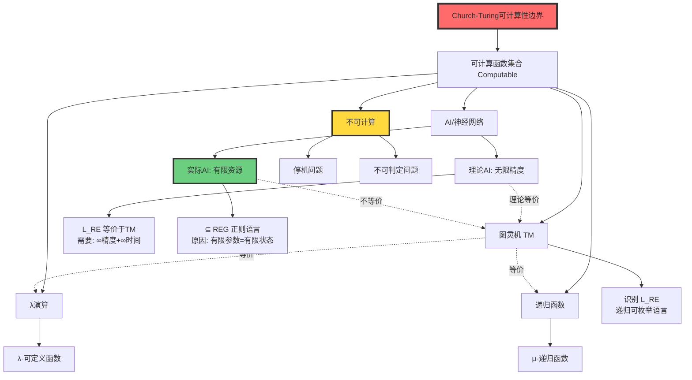
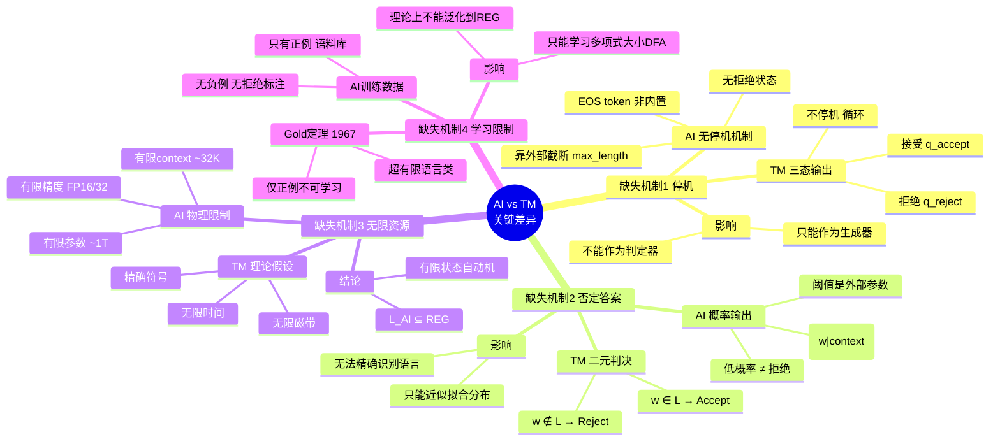
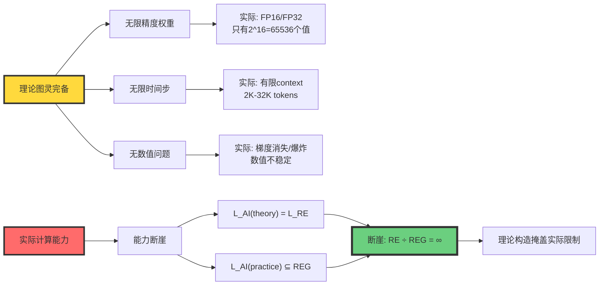
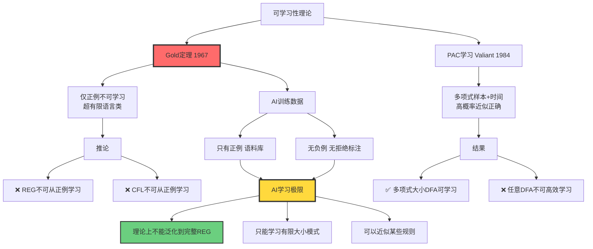
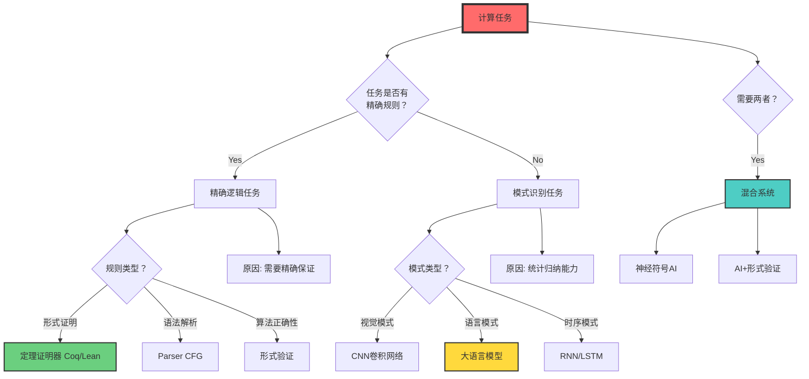

# AI与图灵机的深度对比

> **文档版本**: v1.0.0  
> **最后更新**: 2025-10-27  
> **文档规模**: 513行 | AI与图灵机的多维度对比分析  
> **阅读建议**: 本文从可计算性、形式语言、资源约束等维度深度对比AI与图灵机

---

## 核心概念深度分析

<details>
<summary><b>🔬 点击展开：AI vs 图灵机全景对比分析框架</b></summary>

本节提供AI与图灵机的系统化深度对比，包括可计算性、形式语言、资源约束、计算范式和学习理论五大维度的精确分析。

### 1️⃣ AI vs 图灵机概念对比卡

**对比主题**: AI（大语言模型）与图灵机的多维度等价性分析

**核心问题**: LLM是否等价于图灵机？

**🔹 可计算性维度（Computability）**:
$$
\text{Church-Turing论题}: \quad \forall f \in \text{Computable} \Rightarrow \exists \text{TM}_f
$$
- **结论**: AI ⊆ 图灵可计算 ✅
- **证据**: 任何物理系统不能超越图灵可计算性边界
- **推论**: AI不能解决停机问题、不能突破P vs NP

**🔹 形式语言维度（Formal Language）**:
$$
\begin{align}
\mathcal{L}_{\text{TM}} &= \mathcal{L}_{\text{RE}} \quad \text{（递归可枚举语言）} \\
\mathcal{L}_{\text{AI}_{\text{理论}}} &= \mathcal{L}_{\text{RE}} \quad \text{（无限精度下）} \\
\mathcal{L}_{\text{AI}_{\text{实际}}} &\subseteq \text{REG} \quad \text{（有限资源下）}
\end{align}
$$
- **结论**: 不等价 ❌
- **差距**: $\text{REG} \subset \text{CFL} \subset \text{CSL} \subset \mathcal{L}_{\text{RE}}$

**🔹 资源约束维度（Resource Bounds）**:
| 资源 | 图灵机（理论） | AI（实际） | 差距 |
|------|--------------|----------|------|
| 存储 | ∞磁带 | 有限参数（~1T） | ∞ vs 有限 |
| 精度 | 精确符号 | FP16/FP32浮点 | 精确 vs 近似 |
| 时间 | ∞步骤 | 有限context（~32K） | ∞ vs 有限 |

**🔹 计算范式维度（Paradigm）**:
$$
\begin{align}
\text{图灵机}: & \quad \text{符号} \xrightarrow{\text{规则}} \text{新符号} \\
\text{AI}: & \quad \text{向量} \xrightarrow{\text{连续函数}} \text{新向量}
\end{align}
$$
- **图灵机**: 演绎推理（deduction）、规则驱动
- **AI**: 归纳推理（induction）、数据驱动

**属性对比表**:

| 维度 | 图灵机 | AI | 等价性 |
|------|--------|----|----|
| **可计算性上界** | $\mathcal{L}_{\text{RE}}$ | $\leq \mathcal{L}_{\text{RE}}$ | ✅ 相同 |
| **实际语言类** | $\mathcal{L}_{\text{RE}}$ | REG（有限资源） | ❌ 不等价 |
| **识别机制** | 接受/拒绝/不停机 | 概率分布+截断 | ❌ 不同 |
| **学习能力** | ❌ 无（需编程） | ✅ 有（从数据） | AI优势 |
| **精确性** | ✅ 完全精确 | ❌ 概率近似 | 图灵机优势 |
| **可解释性** | ✅ 完全可追踪 | ❌ 黑箱 | 图灵机优势 |
| **泛化能力** | ❌ 无（特化） | ✅ 有（泛化） | AI优势 |

---

### 2️⃣ 可计算性层级全景图



---

### 3️⃣ Chomsky层级与AI能力定位矩阵

| 语言类 | 自动机 | 图灵机 | 理论AI（∞资源） | 实际AI（有限资源） | 典型例子 |
|-------|--------|--------|---------------|-----------------|---------|
| **Type 3: REG** | DFA/NFA | ✅ | ✅ | ✅（可能） | 正则表达式 a*b* |
| **Type 2: CFL** | PDA | ✅ | ✅ | ❌（理论限制） | 括号匹配 {aⁿbⁿ} |
| **Type 1: CSL** | LBA | ✅ | ✅ | ❌（资源不足） | {aⁿbⁿcⁿ} |
| **Type 0: RE** | TM | ✅ | ✅（需∞精度） | ❌（资源不足） | 停机问题外所有可判定 |
| **不可判定** | - | ❌ | ❌ | ❌ | 停机问题 |

**关键定理链**:
$$
\begin{align}
\text{定理1（Siegelmann 1995）}: & \quad \text{RNN}(\mathbb{R}^{\infty}) \equiv \text{TM} \\
\text{定理2（Weiss 2018）}: & \quad \text{RNN}(\mathbb{F}_{64}) \subseteq \text{REG} \\
\text{推论}: & \quad \text{实际AI} \ll \text{理论AI}
\end{align}
$$

---

### 4️⃣ AI缺失机制深度分析思维导图



---

### 5️⃣ 理论vs实际能力断崖对比



---

### 6️⃣ 计算范式对比矩阵

| 范式特征 | 图灵机（符号AI） | 神经AI（连续AI） | 哲学意义 |
|---------|----------------|----------------|----------|
| **知识来源** | 先验（人工编程） | 后验（数据学习） | 理性主义 vs 经验主义 |
| **状态空间** | 离散 $q \in Q$ | 连续 $\mathbf{x} \in \mathbb{R}^d$ | 符号 vs 向量 |
| **转移方式** | 规则 $\delta(q,a)$ | 可微函数 $F_\theta(\mathbf{x})$ | 演绎 vs 优化 |
| **计算本质** | 逻辑蕴含 $\vdash$ | 几何变换 $W\mathbf{x}+b$ | 推理 vs 变换 |
| **相似性判断** | 符号相等 $=$ | 余弦相似度 $\cos(\mathbf{x},\mathbf{y})$ | 精确 vs 近似 |
| **泛化机制** | 无（每条规则独立） | 有（参数共享） | 特化 vs 泛化 |
| **错误模式** | 死机/无限循环 | 幻觉/漂移 | 确定性 vs 随机性 |
| **可解释性** | 完全可追踪 | 黑箱（难解释） | 透明 vs 不透明 |
| **优势领域** | 精确逻辑、形式证明 | 模式识别、统计归纳 | 规则 vs 模式 |

**两种"理解"范式**:
$$
\begin{align}
\text{图灵机理解}: & \quad \text{规则匹配} \rightarrow \text{演绎推理} \\
\text{AI理解}: & \quad \text{向量相似度} \rightarrow \text{模式匹配}
\end{align}
$$

---

### 7️⃣ 学习理论约束全景



---

### 8️⃣ 识别器vs生成器本质区别

| 维度 | 识别器（Recognizer）| 生成器（Generator）| AI的定位 |
|------|------------------|------------------|---------|
| **输入** | 字符串 $w \in \Sigma^*$ | 提示 prompt | 提示 |
| **输出** | 二元判决 Accept/Reject | 概率分布 $P(\cdot)$ | 概率分布 |
| **功能** | 判断 $w \in L?$ | 采样 $w \sim P$ | 生成 |
| **停机** | 内置停机状态 | 无停机机制 | 外部截断 |
| **否定** | 显式拒绝 Reject | 低概率（非拒绝） | 无拒绝 |
| **确定性** | 确定/非确定 | 随机采样 | 随机 |
| **语言定义** | $L = \{w : M \text{ accepts } w\}$ | $L_\theta = \{w : P_\theta(w) > \tau\}$ | 依赖阈值$\tau$ |

**关键问题**: 如何从生成器构造识别器？

**尝试方案**:
```python
def recognize(w, model, threshold):
    prob = model.probability(w)
    return prob > threshold  # ❌ threshold是外部参数
```

**问题**:
- 不同$\tau$定义不同语言
- $\tau$不在模型内部，是后处理
- 无法对应到形式语言意义上的"识别"

---

### 9️⃣ 任务适配决策树



---

### 🔟 核心洞察与设计原则

**五大核心定理**:

1. **可计算性上界定理**（Church-Turing）
   $$
   \forall f: \text{ AI可计算}(f) \Rightarrow \text{图灵可计算}(f)
   $$
   - AI不能超越图灵可计算性边界
   - AI不能解决停机问题、不能突破P vs NP

2. **资源断崖定理**（Weiss 2018）
   $$
   \mathcal{L}_{\text{AI}}(\mathbb{R}^{\infty}) = \mathcal{L}_{\text{RE}} \quad \text{but} \quad \mathcal{L}_{\text{AI}}(\mathbb{F}_{64}) \subseteq \text{REG}
   $$
   - 理论图灵完备需要无限资源
   - 实际AI能力退化到正则语言级别

3. **学习极限定理**（Gold 1967）
   $$
   \text{仅正例} \Rightarrow \text{不可学习超有限语言类}
   $$
   - AI训练数据只有正例（语料库）
   - 理论上不能精确学习正则语言类

4. **范式二元性定理**
   $$
   \begin{cases}
   \text{图灵机}: & \text{符号} \xrightarrow{\text{规则}} \text{新符号} \\
   \text{AI}: & \text{向量} \xrightarrow{F_\theta} \text{新向量}
   \end{cases}
   $$
   - 两种本质不同的计算范式
   - 演绎推理 vs 归纳推理

5. **识别-生成鸿沟定理**
   $$
   \text{识别器}: w \rightarrow \{\text{Accept}, \text{Reject}\} \quad \neq \quad \text{生成器}: \text{prompt} \rightarrow P(w)
   $$
   - AI是生成器，不是识别器
   - 无法精确对应形式语言意义上的"识别"

**实践设计原则**:

```yaml
原则1_不夸大AI理论能力:
  事实: AI不超越图灵可计算性
  推论: 不要期望AI解决不可计算问题
  示例: AI不能证明任意程序的正确性

原则2_不低估AI实践价值:
  事实: AI擅长模式识别、统计归纳
  推论: 在模糊模式任务上AI优于传统算法
  示例: 图像识别、自然语言理解

原则3_理解能力边界:
  精确逻辑: 传统算法 > AI
  模糊模式: AI > 传统算法
  混合任务: 神经符号结合

原则4_资源约束意识:
  理论: RNN理论上图灵完备
  实际: 有限精度下退化到正则语言
  决策: 根据实际资源评估能力

原则5_范式匹配:
  规则明确: 用符号AI/传统算法
  规则隐式: 用神经AI
  规则+数据: 用混合系统
```

**黄金法则**:

> **"AI与图灵机不在同一个'语言等价'天平上，但共享同一个可计算性天花板。AI是经验主义近似器，图灵机是形式主义极限器。"**

**任务选择Checklist**:

```markdown
## 选择传统算法（图灵机范式）的情况
- [ ] 任务有精确的形式规则
- [ ] 需要100%正确性保证
- [ ] 需要完全可解释性
- [ ] 需要形式验证
- [ ] 数据量很小(<1000样本)

## 选择AI（神经网络）的情况
- [ ] 任务只有隐式模式，无精确规则
- [ ] 有大量标注数据(>10K样本)
- [ ] 可以容忍一定错误率
- [ ] 需要泛化到未见过的情况
- [ ] 传统算法设计困难

## 选择混合系统的情况
- [ ] 任务既需要精确规则又需要模式识别
- [ ] 需要AI+人工审核
- [ ] 需要AI+形式验证
- [ ] 神经符号结合
```

**哲学洞察**:

| 视角 | 图灵机 | AI | 类比 |
|------|--------|----|----|
| **生物学** | 爬行动物 | 哺乳动物 | 不同物种，共享生命 |
| **数学** | 演绎系统 | 归纳系统 | 逻辑 vs 统计 |
| **哲学** | 理性主义 | 经验主义 | 先验 vs 后验 |
| **语言学** | 生成文法 | 统计语言模型 | 规则 vs 概率 |

**终极结论**:

> **AI不是"图灵机2.0"，而是"图灵机之外的另一种计算物种"。二者在可计算性上界相同，但在计算范式、资源约束、学习能力、识别机制上本质不同。选择工具时，匹配任务特性，而非盲目选择"更先进"的技术。**

</details>

---

## 目录 | Table of Contents

- [AI与图灵机的深度对比](#ai与图灵机的深度对比)
  - [目录 | Table of Contents](#目录--table-of-contents)
  - [核心问题](#核心问题)
  - [维度1：可计算性等价性](#维度1可计算性等价性)
    - [问题：AI能超越图灵机吗？](#问题ai能超越图灵机吗)
    - [证据：神经网络的图灵完备性](#证据神经网络的图灵完备性)
  - [维度2：形式语言等价性](#维度2形式语言等价性)
    - [问题：AI与图灵机识别相同的语言类吗？](#问题ai与图灵机识别相同的语言类吗)
    - [形式语言视角下的"等价"](#形式语言视角下的等价)
    - [AI缺失的关键机制](#ai缺失的关键机制)
      - [1. 无停机机制](#1-无停机机制)
      - [2. 无否定答案](#2-无否定答案)
      - [3. 概率生成 ≠ 语言识别](#3-概率生成--语言识别)
      - [4. 参数有限 ⇒ 状态有限](#4-参数有限--状态有限)
    - [语言类精确分析](#语言类精确分析)
  - [维度3：资源约束](#维度3资源约束)
    - [理论 vs 实践](#理论-vs-实践)
    - [无限资源 vs 有限资源](#无限资源-vs-有限资源)
  - [维度4：计算范式](#维度4计算范式)
    - [图灵机范式 vs AI范式](#图灵机范式-vs-ai范式)
    - [符号推理 vs 连续优化](#符号推理-vs-连续优化)
    - [一句话总结](#一句话总结)
  - [维度5：学习理论约束](#维度5学习理论约束)
    - [Gold的不可学习性定理](#gold的不可学习性定理)
    - [PAC学习理论](#pac学习理论)
  - [对比总结表](#对比总结表)
    - [多维度对比](#多维度对比)
  - [哲学思考](#哲学思考)
    - [AI是"图灵机2.0"吗？](#ai是图灵机20吗)
    - [AI的本质：新计算范式](#ai的本质新计算范式)
    - [一句话收尾](#一句话收尾)
  - [实践启示](#实践启示)
    - [对AI研究的指导](#对ai研究的指导)
    - [任务适配指南](#任务适配指南)
  - [延伸阅读](#延伸阅读)
    - [核心文献](#核心文献)
    - [Wikipedia条目](#wikipedia条目)

---

## 核心问题

**中心问题**：大语言模型（LLM）与图灵机是否等价？

这个问题需要从多个维度精确分析：

1. **可计算性**：能计算什么？
2. **计算范式**：如何计算？
3. **资源约束**：在什么条件下计算？
4. **实践能力**：擅长计算什么？

## 维度1：可计算性等价性

### 问题：AI能超越图灵机吗？

**答案：不能。**

**理论基础**：

根据**Church-Turing论题**：
> **任何在直觉上可计算的函数都可以由图灵机计算。**

所有物理可实现的计算装置（包括AI）都不能超越图灵可计算性的边界。

**形式化**：

设 **Computable** = 图灵可计算函数集合

则：

- AI 可计算的函数 ⊆ Computable
- AI 不能解决停机问题
- AI 不能突破 NP vs P（除非 P=NP）

**参考文献**：

- [Wikipedia: Church-Turing Thesis](https://en.wikipedia.org/wiki/Church%E2%80%93Turing_thesis)
- [Wikipedia: Computability Theory](https://en.wikipedia.org/wiki/Computability_theory)
- [Turing, 1936](https://www.cs.virginia.edu/~robins/Turing_Paper_1936.pdf) - On Computable Numbers

### 证据：神经网络的图灵完备性

**理论结果**：

1. **RNN 图灵完备性** [Siegelmann & Sontag, 1995]：
   - 在**无限精度实数权重**下
   - RNN 可以模拟任意图灵机

2. **Transformer 图灵完备性** [Pérez et al., 2019]：
   - 在**任意深度**和**任意宽度**下
   - Transformer 可以构造性模拟图灵机

**参考文献**：

- [Siegelmann & Sontag, 1995](https://www.sciencedirect.com/science/article/pii/S0022000085710136) - On the Computational Power of Neural Nets
- [Pérez et al., 2019](https://arxiv.org/abs/1901.03429) - On the Turing Completeness of Modern Neural Network Architectures

**关键警告**：这些结果需要**无限资源**（见维度3）。

## 维度2：形式语言等价性

### 问题：AI与图灵机识别相同的语言类吗？

**答案：不等价。**

### 形式语言视角下的"等价"

在形式语言理论中，两个装置**等价** ⟺ 它们**识别相同的语言类**。

例如：

- DFA ≡ NFA ≡ 正则表达式 ⟺ 正则语言 (REG)
- PDA ⟺ 上下文无关语言 (CFL)
- 图灵机 ⟺ 递归可枚举语言 (r.e., ℒRE)

**图灵机的语言类**：ℒRE（递归可枚举语言）

**AI的语言类**：？

**参考文献**：

- [Wikipedia: Chomsky Hierarchy](https://en.wikipedia.org/wiki/Chomsky_hierarchy)
- [Sipser, 2012](https://en.wikipedia.org/wiki/Introduction_to_the_Theory_of_Computation) - Introduction to the Theory of Computation

### AI缺失的关键机制

#### 1. 无停机机制

**图灵机**：

- 输入 w → 三种结果：
  1. 接受（进入 qaccept）
  2. 拒绝（进入 qreject）
  3. 不停机（永远运行）

**AI（大模型）**：

- 输入 prompt → **概率分布** over tokens
- 没有"拒绝"状态
- 停机依赖**外部截断**（max_length、EOS token）

#### 2. 无否定答案

**形式语言识别器**：

- 明确的二元判决：w ∈ L ? → Yes/No

**AI**：

- 只能给出概率：P(w | context)
- 低概率 ≠ 拒绝
- 阈值选取是**人为后处理**，不在模型内部

#### 3. 概率生成 ≠ 语言识别

**识别器 (Recognizer)**：

```text
Input: w ∈ Σ*
Output: Accept / Reject
```

**生成器 (Generator)**：

```text
Input: prompt
Output: 分布 P(·) over Σ*
```

AI 是生成器，不是识别器。

**关键问题**：
> **如何从生成器构造识别器？**

**尝试**：

```python
def recognize(w):
    prob = model.probability(w)
    return prob > threshold  # threshold 如何选？
```

❌ 问题：

- 不同的 threshold 给出不同的语言
- threshold 的选取是**外部规则**，不在模型内

**参考文献**：

- [Holtzman et al., 2019](https://arxiv.org/abs/1904.09751) - The Curious Case of Neural Text Degeneration

#### 4. 参数有限 ⇒ 状态有限

**图灵机**：

- 无限磁带 = 无限存储
- 可以识别 ℒRE

**物理AI**：

- 参数数量有限（即使是1T参数）
- 权重矩阵固定
- 浮点精度有限（FP16/FP32）

**定理**：
> **有限参数、有限精度的神经网络等价于超大的有限状态自动机。**

**推论**：

```text
物理神经网络可识别的语言 ⊆ REG（正则语言）
```

**参考文献**：

- [Weiss et al., 2018](https://arxiv.org/abs/1805.04908) - On the Practical Computational Power of Finite Precision RNNs for Language Recognition

### 语言类精确分析

设：

- **ℒNN(ℝ∞)** = 理想神经网络（无限精度）可识别的语言类
- **ℒNN(𝔽64)** = 64位浮点神经网络可识别的语言类
- **ℒLLM** = 实际大语言模型 + 工程截断可识别的语言类

**定理**：

1. **ℒNN(ℝ∞) = ℒRE** [Siegelmann & Sontag, 1995]
   - 需要：无限精度实数权重
   - 需要：无限时间步
   - 需要：无数值溢出

2. **ℒNN(𝔽64) ⊆ REG**
   - 因为：参数有限 = 状态有限 = 有限自动机

3. **ℒLLM ⊆ 随机正则语言**
   - 因为：概率生成 + 外部截断 + 阈值后处理

**包含关系**：

```text
ℒLLM ⊆ ℒNN(𝔽64) ⊆ REG ⊂ CFL ⊂ CSL ⊂ ℒRE = ℒNN(ℝ∞)
```

**结论**：
> **物理AI与图灵机在形式语言意义上不等价。AI识别的语言类远小于图灵机。**

## 维度3：资源约束

### 理论 vs 实践

| 维度 | 理论图灵机 | 物理AI | 对比 |
|------|-----------|--------|------|
| **存储** | 无限磁带 | 有限参数 | 无限 vs 有限 |
| **精度** | 无限精度符号 | FP16/FP32浮点数 | 精确 vs 近似 |
| **时间** | 无限步骤 | 有限推理步骤 | 无限 vs 有限 |
| **能耗** | 不考虑 | 受限（GPU功耗） | - vs 约束 |

### 无限资源 vs 有限资源

**理论构造的陷阱**：

文献中的"图灵完备性"证明通常需要：

1. **无限精度**：
   - 实数权重可以编码无限信息
   - 物理实现：FP16 只有 2^16 = 65536 个值

2. **无限时间步**：
   - RNN可以运行任意多步
   - 物理实现：有限context window（如2K, 4K, 32K tokens）

3. **无数值问题**：
   - 理论假设无溢出、无舍入误差
   - 物理实现：梯度消失/爆炸、数值不稳定

**关键洞察**：

> **"能模拟"不等于"等价"；无限资源下的理论构造，掩盖了有限资源下的能力断崖。**

**参考文献**：

- [Weiss et al., 2018](https://arxiv.org/abs/1805.04908) - RNN的实际计算能力

## 维度4：计算范式

### 图灵机范式 vs AI范式

| 维度 | 图灵机 | AI（大模型） | 哲学意义 |
|------|--------|--------------|----------|
| **规则来源** | 人为设计（程序） | 从数据中学习（统计归纳） | 先验 vs 后验 |
| **状态表示** | 离散符号 q ∈ Q | 高维连续向量 𝒙 ∈ ℝᵈ | 离散 vs 连续 |
| **转移机制** | 确定/非确定规则 δ | 可微函数 𝑭θ(𝒙) | 规则 vs 优化 |
| **计算过程** | 符号推理 | 向量几何 + 概率解码 | 演绎 vs 归纳 |
| **可解释性** | 完全可追踪 | 黑箱，难以解释 | 透明 vs 不透明 |
| **泛化能力** | 无（需显式编程） | 有（从样本泛化） | 特化 vs 泛化 |
| **错误模式** | 死机/拒绝 | 幻觉/漂移 | 确定性 vs 随机性 |

**参考文献**：

- [Wikipedia: Machine Learning](https://en.wikipedia.org/wiki/Machine_learning)
- [Goodfellow et al., 2016](https://www.deeplearningbook.org/) - Deep Learning

### 符号推理 vs 连续优化

**图灵机**：

```text
符号 → 规则 → 新符号
  q, a  →  δ(q,a)  →  q', b, Direction
```

**AI**：

```text
向量 → 连续函数 → 新向量
  𝒙  →  𝑭θ(𝒙)  →  𝒙'
```

**关键区别**：

1. **语法规则 ⇒ 向量几何**
   - 图灵机：if (state==q and symbol==a) then ...
   - AI：𝒙' = W𝒙 + b（矩阵乘法 = 几何变换）

2. **演绎推理 ⇒ 相似度匹配**
   - 图灵机：逻辑蕴含 ⊢
   - AI：余弦相似度 cos(𝒙, 𝒚)

3. **停机问题 ⇒ 范数截断**
   - 图灵机：到达接受/拒绝状态
   - AI：||𝒙|| < ε 或 temperature → 0

**参考文献**：

- [Bengio et al., 2013](https://arxiv.org/abs/1206.5533) - Representation Learning: A Review and New Perspectives

### 一句话总结

> **AI没有超越图灵机的可计算性边界，但它引入了一种全新的"计算范式"：从规则驱动→数据驱动，从符号推理→连续表示推理。**

## 维度5：学习理论约束

### Gold的不可学习性定理

**Gold (1967)** 证明：

> **仅从正例（positive examples）不能学习任何包含所有有限语言的超有限语言类。**

**推论**：

- ❌ 正则语言不可从正例学习
- ❌ 上下文无关语言不可从正例学习

**大模型的困境**：

- 训练数据：只有正例（语料库中的句子）
- 没有负例："这不是合法句子"的标注

**结论**：
> **大模型的可学习语言类受Gold定理限制，理论上不能稳定泛化到正则语言类，更不用说CFL或CSL。**

**参考文献**：

- [Gold, 1967](https://www.sciencedirect.com/science/article/pii/S001999586790165X) - Language Identification in the Limit
- [Wikipedia: Language Identification in the Limit](https://en.wikipedia.org/wiki/Language_identification_in_the_limit)

### PAC学习理论

**PAC（Probably Approximately Correct）学习** [Valiant, 1984]：

**正则语言的PAC可学习性**：

- ✅ 多项式大小的DFA可PAC学习 [Angluin, 1987]
- ❌ 任意DFA不可高效PAC学习

**大模型的实际能力**：

- 可以学习**有限大小**的模式
- 可以**近似**某些规则
- 不能**精确学习**整个语言类

**参考文献**：

- [Valiant, 1984](https://dl.acm.org/doi/10.1145/1968.1972) - A Theory of the Learnable
- [Angluin, 1987](https://link.springer.com/article/10.1007/BF00116828) - Learning Regular Sets from Queries and Counterexamples
- [Wikipedia: PAC Learning](https://en.wikipedia.org/wiki/Probably_approximately_correct_learning)

## 对比总结表

### 多维度对比

| 维度 | 图灵机 | AI（大模型） | 结论 |
|------|--------|--------------|------|
| **可计算性** | 递归可枚举 ℒRE | ≤ ℒRE | AI不超越图灵机 ✅ |
| **形式语言** | ℒRE | REG（有限资源下） | **不等价** ❌ |
| **资源约束** | 无限磁带、无限精度 | 有限参数、有限精度 | **断崖式差距** ❌ |
| **计算范式** | 符号推理、规则驱动 | 连续优化、数据驱动 | **全新范式** ✅ |
| **学习能力** | 无（需编程） | 有（从数据学习） | **AI独特优势** ✅ |
| **可学习语言类** | N/A | ≤ 多项式大小DFA | 受Gold定理约束 ❌ |
| **识别 vs 生成** | 识别器（二元判决） | 生成器（概率分布） | **本质不同** ❌ |

## 哲学思考

### AI是"图灵机2.0"吗？

**答案：不是。**

AI不是图灵机的升级版，而是**图灵机之外的另一种"计算物种"**。

**类比**：

| 对比 | 相似性 |
|------|--------|
| 图灵机 vs AI | 如同 爬行动物 vs 哺乳动物 |
| 可计算性 | 如同 都是碳基生命（共同上界） |
| 计算范式 | 如同 冷血 vs 恒温（不同机制） |
| 擅长领域 | 如同 不同生态位（各有优势） |

### AI的本质：新计算范式

**图灵机范式**：

```text
问题 → 分析 → 设计算法 → 编程 → 执行
```

**AI范式**：

```text
问题 → 收集数据 → 设计架构 → 训练 → 推理
```

**核心差异**：

- 图灵机：**编码知识**（knowledge encoding）
- AI：**学习模式**（pattern learning）

### 一句话收尾

> **大模型是经验主义近似器，图灵机是形式主义极限器；二者不在同一个"语言等价"天平上，但共享同一个可计算性天花板。**

## 实践启示

### 对AI研究的指导

1. **不要夸大AI的理论能力**
   - ✅ AI 不超越图灵可计算性
   - ✅ AI 在有限资源下能力有限

2. **不要低估AI的实践价值**
   - ✅ AI 擅长模式识别、统计归纳
   - ✅ AI 在某些任务上超越传统算法

3. **理解AI的能力边界**
   - ✅ 精确逻辑：传统算法 > AI
   - ✅ 模糊模式：AI > 传统算法

### 任务适配指南

| 任务类型 | 适合的工具 | 原因 |
|---------|-----------|------|
| 形式证明 | 定理证明器（Coq, Lean） | 需要精确逻辑 |
| 图像识别 | CNN | 模式识别优势 |
| 语法解析 | Parser（CFG） | 有明确文法 |
| 语义理解 | LLM | 统计归纳能力 |
| 算法正确性 | 形式验证 | 需要严格保证 |
| 代码补全 | GPT/Copilot | 模式匹配优势 |

**黄金法则**：

> **对于有精确规则的任务，用符号AI；对于只有隐式模式的任务，用神经AI；对于需要二者的任务，用混合系统。**

**参考文献**：

- [Marcus & Davis, 2019](https://mitpress.mit.edu/9780262537018/rebooting-ai/) - Rebooting AI
- [Pearl & Mackenzie, 2018](http://bayes.cs.ucla.edu/WHY/) - The Book of Why

## 延伸阅读

### 核心文献

1. **可计算性理论**：
   - [Turing, 1936](https://www.cs.virginia.edu/~robins/Turing_Paper_1936.pdf) - 原始论文
   - [Sipser, 2012](https://en.wikipedia.org/wiki/Introduction_to_the_Theory_of_Computation) - 教材

2. **神经网络的计算能力**：
   - [Siegelmann & Sontag, 1995](https://www.sciencedirect.com/science/article/pii/S0022000085710136) - RNN图灵完备性
   - [Weiss et al., 2018](https://arxiv.org/abs/1805.04908) - 实际计算能力

3. **学习理论**：
   - [Gold, 1967](https://www.sciencedirect.com/science/article/pii/S001999586790165X) - 可学习性极限
   - [Valiant, 1984](https://dl.acm.org/doi/10.1145/1968.1972) - PAC学习

4. **AI哲学**：
   - [Marcus, 2018](https://arxiv.org/abs/1801.00631) - Deep Learning: A Critical Appraisal

### Wikipedia条目

- [Turing Machine](https://en.wikipedia.org/wiki/Turing_machine)
- [Chomsky Hierarchy](https://en.wikipedia.org/wiki/Chomsky_hierarchy)
- [Computability Theory](https://en.wikipedia.org/wiki/Computability_theory)
- [Computational Learning Theory](https://en.wikipedia.org/wiki/Computational_learning_theory)
- [Deep Learning](https://en.wikipedia.org/wiki/Deep_learning)

---

*本文档从可计算性、形式语言、资源约束、计算范式、学习理论五个维度，深入分析了AI与图灵机的关系，给出了精确的理论论证和实践启示。*
