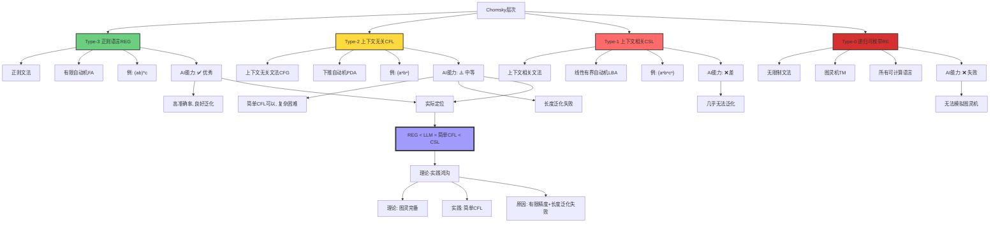
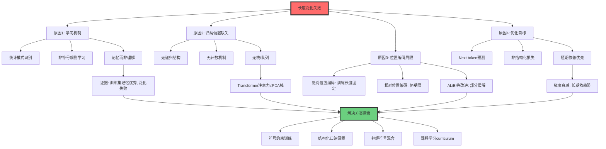
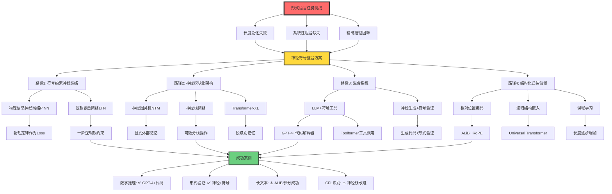

# 形式语言视角的AI分析

> **文档版本**: v1.0.0  
> **最后更新**: 2025-10-27  
> **文档规模**: 886行 | 形式语言理论下的AI能力分析  
> **阅读建议**: 本文从Chomsky层次分析神经网络和LLM的形式语言能力与局限

---

## 核心概念深度分析

<details>
<summary><b>📚🤖 点击展开：形式语言理论视角的AI能力全景分析</b></summary>

本节从Chomsky层次、自动机理论和可计算性理论出发，系统分析AI在形式语言框架中的能力边界、理论定位和本质特征。

### 1️⃣ 形式语言理论框架下的AI概念定位卡

**分析主题**: AI在形式语言理论（Formal Language Theory）中的定位

**🔹 Chomsky层次与AI能力映射**:

| 语言类型 | 文法 | 自动机 | AI能力 | 证据 |
|---------|------|--------|--------|------|
| **Type-3 正则语言REG** | 正则文法 | 有限自动机FA | ✅ 优秀 | 高准确率，良好泛化 |
| **Type-2 上下文无关CFL** | 上下文无关文法CFG | 下推自动机PDA | ⚠️ 中等 | 简单CFL可以，复杂困难 |
| **Type-1 上下文相关CSL** | 上下文相关文法 | 线性有界自动机LBA | ❌ 差 | 几乎无法泛化 |
| **Type-0 递归可枚举RE** | 无限制文法 | 图灵机TM | ❌ 失败 | 无法模拟图灵机 |

**🔹 理论vs实际能力对比**:

| 维度 | 理论能力 | 实际能力 | 差距原因 |
|------|---------|---------|---------|
| **RNN/LSTM** | 图灵完备（Siegelmann-Sontag 1995） | $\approx$ 简单CFL | 有限精度、梯度消失 |
| **Transformer** | 图灵完备（位置编码+深度） | $\approx$ 正则到简单CFL | 注意力窗口、训练数据 |
| **LLM（GPT）** | 理论上Type-0 | 实践中 REG < LLM < CFL | 长度泛化失败 |

**🔹 AI vs 传统自动机核心差异**:

| 特征 | 传统自动机 | AI（LLM） |
|------|-----------|----------|
| **任务** | 判定 $w \in L$？ | 预测下一个token |
| **输出** | 接受/拒绝（布尔） | 概率分布 $P(w)$ |
| **本质** | 语言识别器 | 概率语言模型 |
| **确定性** | 确定或非确定 | 概率性/随机 |
| **学习方式** | 设计/编程 | 从数据学习 |

**🔹 形式化定义对比**:

**传统形式语言**:
$$
L \subseteq \Sigma^* \quad \text{（语言是字符串集合）}
$$

**概率语言模型（LLM）**:
$$
P: \Sigma^* \rightarrow [0,1], \quad \sum_{w \in \Sigma^*} P(w) = 1
$$

**自回归生成**:
$$
P(w_1, \ldots, w_n) = \prod_{i=1}^{n} P(w_i \mid w_1, \ldots, w_{i-1})
$$

**属性维度表**:

| 维度 | 传统自动机 | AI（神经网络） | 关键差异 |
|------|-----------|--------------|---------|
| **设计时间** | 1950s-1960s | 1980s-2020s | 神经方法更晚 |
| **可解释性** | ✅ 高（状态转移清晰） | ❌ 低（黑盒） | 根本差异 |
| **学习能力** | ❌ 无（需人工设计） | ✅ 有（数据驱动） | AI优势 |
| **泛化能力** | ✅ 完美（规则泛化） | ⚠️ 有限（统计泛化） | 自动机优势 |
| **长度泛化** | ✅ 任意长度 | ❌ 训练长度受限 | 致命弱点 |
| **精确性** | ✅ 精确识别 | ⚠️ 概率近似 | 自动机优势 |
| **灵活性** | ❌ 僵化 | ✅ 适应数据 | AI优势 |

---

### 2️⃣ Chomsky层次与AI能力全景图



---

### 3️⃣ 理论能力vs实际能力对比矩阵

| AI模型 | 理论能力 | 证明 | 实际能力 | 实验证据 | 鸿沟原因 |
|--------|---------|------|---------|---------|---------|
| **前馈神经网络** | 有限自动机等价 | 状态有限 | 正则语言识别 | Merrill 2019 | 匹配 |
| **RNN（理想）** | 图灵完备 | Siegelmann 1995 | 简单CFL | 长度泛化失败 | 有限精度、梯度消失 |
| **LSTM** | 图灵完备（理论） | 可模拟图灵机 | 简单CFL，部分CSL | 实验 | 训练困难、记忆限制 |
| **Transformer** | 图灵完备 | 位置编码+深度 | 正则到简单CFL | Deletang 2023 | 注意力窗口、位置编码 |
| **GPT-3/4** | Type-0（理论） | 神经图灵完备 | REG < LLM < CFL | 算术失败 | 长度泛化、系统性缺失 |

**关键发现**:
- **理论能力**: 几乎所有现代神经网络都图灵完备（理论上）
- **实际能力**: 困在正则到简单CFL之间
- **鸿沟**: 有限精度、训练数据、长度泛化、系统性组合

**深度洞察**:
> "理论图灵完备性是'存在性'证明，实际能力是'构造性'约束。就像物理定律理论上允许时间机器，但实践中不可能。" —— 理论vs实践的本质差异

---

### 4️⃣ 识别器vs生成器vs概率模型三维对比

```mermaid
mindmap
  root((形式语言<br/>三范式))
    识别器Recognizer
      任务
        判定 w ∈ L？
        输出Yes/No
      代表
        有限自动机FA
        下推自动机PDA
        图灵机TM
      特点
        确定性或非确定性
        完美精确
        无概率
      优势
        可证明正确性
        形式化验证
        规则清晰
      局限
        无法处理歧义
        无法排序
        非此即彼
    生成器Generator
      任务
        产生 w ∈ L
        枚举语言
      代表
        文法Grammar
        产生式系统
      特点
        构造性
        可枚举
      优势
        主动生成
        创造性
      局限
        无区分度
        等概率
    概率模型Probabilistic
      任务
        建模 P(w)
        预测下一token
      代表
        LLM GPT BERT
        n-gram模型
        PCFG
      特点
        概率分布
        自回归
        采样生成
      优势
        处理歧义
        排序候选
        自然语言建模
      局限
        非精确
        黑盒
        长度泛化失败
      数学
        P(w₁...wₙ)=∏P(wᵢ|w<i)
        温度采样
        Top-k/Top-p
```

---

### 5️⃣ LLM长度泛化失败深度分析

| 任务 | 训练数据 | 测试数据 | 结果 | 论文 | 根本原因 |
|------|---------|---------|------|------|---------|
| **算术加法** | 3位数加法 | 4位数加法 | ❌ 失败 | Anil 2022 | 未学到递归算法，仅记忆模式 |
| **括号匹配** | 嵌套深度≤5 | 嵌套深度>5 | ❌ 失败 | - | 未内化栈结构 |
| **计数{aⁿbⁿ}** | n≤10 | n>10 | ❌ 失败 | Deletang 2023 | 无计数器机制 |
| **逻辑推理链** | 3步推理 | 5步推理 | ❌ 失败 | - | 无系统性组合 |
| **自然语言** | 训练语料长度 | 更长文本 | ⚠️ 部分成功 | - | 统计平滑，非规则泛化 |

**原因分析**:



**深度洞察**:

> **"长度泛化失败暴露了LLM的本质：它是模式记忆机器，而非规则理解系统。就像记住1+1=2, 2+2=4不意味着理解加法的递归本质。"**

---

### 6️⃣ 自然语言在Chomsky层次中的定位

| 语言现象 | 形式语言类 | 证据 | 对LLM的影响 |
|---------|-----------|------|------------|
| **有限词汇+简单句** | 正则语言 | 有限自动机可识别 | LLM优秀 |
| **中心嵌套结构** | 超过正则 | "The rat [the cat [the dog chased] killed] ate" | 需要CFL以上 |
| **交叉依赖** | 超过CFL | 瑞士德语交叉依赖 | 需要轻度上下文相关 |
| **语义依赖** | 不确定 | "Every student read a book"作用域 | 可能需要Type-1+ |
| **语用推理** | 超出形式语言 | 反讽、隐喻、语境 | 形式语言理论失效 |

**Chomsky 1957 证明**:
$$
\text{English} \notin \text{REG}
$$
证据：中心嵌套需要栈（PDA），FA无法识别。

**争议：是否CFL？**
- **支持CFL**: 大部分句法结构可用CFG描述
- **反对CFL**: 
  - 交叉依赖（如瑞士德语）需要CSL
  - 语义长距离依赖可能需要更强
  - 轻度上下文相关（Mildly Context-Sensitive）可能更合适

**LLM视角**:
```yaml
自然语言复杂性:
  句法层: CFL到轻度CSL
  语义层: 可能需要Type-1或更强
  语用层: 超出形式语言理论范畴
  
LLM实际能力:
  句法: ⚠️ 部分覆盖（简单CFL）
  语义: ⚠️ 统计近似（非形式化）
  语用: ✅ 意外优秀（大数据学习）
  
关键: LLM通过概率统计绕过形式语言复杂性
```

---

### 7️⃣ 形式语言视角的AI能力边界矩阵

| 任务类型 | 形式语言类 | AI能否胜任 | 证据/原因 | 突破路径 |
|---------|-----------|----------|---------|---------|
| **模式匹配** | REG | ✅ 优秀 | 正则表达式等价 | - |
| **括号匹配** | CFL | ⚠️ 训练内可以 | 需要栈，泛化失败 | 显式栈结构 |
| **算术运算** | CFL（加法）/CSL（乘法） | ❌ 长度泛化失败 | Anil 2022 | 符号工具调用 |
| **代码执行** | Type-0 | ❌ 失败 | 无法模拟图灵机 | 代码解释器集成 |
| **逻辑推理** | Type-0（一阶逻辑） | ⚠️ 短链可以 | 长链失败 | 符号推理引擎 |
| **自然语言理解** | CSL+语用 | ✅ 实用优秀 | 大数据统计近似 | - |
| **创意生成** | 超出形式语言 | ✅ 优秀 | 概率采样多样性 | - |

**能力边界公式**:

$$
\text{AI实际能力} = \begin{cases}
\text{REG} & \text{精确识别} \\
\text{简单CFL} & \text{有限长度} \\
\text{统计近似} & \text{自然语言} \\
\text{失败} & \text{CSL+, 系统性推理}
\end{cases}
$$

---

### 8️⃣ Gold可学习性与LLM的根本限制

**Gold (1967) 可学习性理论**:

| 学习范式 | 定义 | 可学习语言类 | LLM对应 |
|---------|------|-------------|---------|
| **正例学习** | 仅从正例（语言中的串） | 有限语言、模式语言 | ✅ LLM训练方式 |
| **正负例学习** | 从正例+反例 | 所有递归语言 | ❌ LLM通常无负例 |
| **极限可学习** | 无限时间收敛 | 递归可枚举语言 | 理论上可能 |

**Gold定理**:
$$
\text{超有限语言不可从仅正例在极限中识别}
$$

**对LLM的影响**:
```yaml
理论限制:
  - LLM从正例学习（训练数据都是"好"的文本）
  - Gold定理: 无法精确学习超有限语言
  - 结论: 形式语言精确识别理论上不可能

实践绕过:
  - LLM不追求精确识别，而是概率建模
  - 统计归纳 vs 规则学习
  - "足够好"而非"完美正确"

深刻意义:
  - 解释了为什么LLM擅长自然语言但不擅长形式语言
  - 自然语言: 模糊、概率、统计足够
  - 形式语言: 精确、规则、需要负例或先验结构
```

**Gold可学习性vs PAC学习**:

| 框架 | 目标 | 数据 | 保证 | 适用性 |
|------|------|------|------|--------|
| **Gold** | 极限中精确识别 | 仅正例 | 超有限语言不可学 | 形式语言 |
| **PAC** | 高概率近似正确 | 正例（标注数据） | VC维有限可学 | 统计学习 |
| **LLM** | 概率分布建模 | 正例（无监督） | 统计近似 | 自然语言 |

---

### 9️⃣ 神经符号整合路径全景



---

### 🔟 核心洞察与未来方向

**五大核心定律**:

1. **形式-统计二元定律**
   $$
   \text{形式语言精确性} \propto \frac{1}{\text{统计学习能力}}
   $$
   - 形式语言: 精确、脆弱、需要规则
   - 统计学习: 近似、鲁棒、需要数据
   - LLM: 选择统计，牺牲形式

2. **理论-实践鸿沟定律**
   $$
   \text{理论能力（图灵完备）} \gg \text{实际能力（简单CFL）}
   $$
   - 原因: 有限精度、训练难度、归纳偏置缺失

3. **长度泛化不可能定律**
   $$
   P(\text{泛化成功} \mid \text{长度增加}) \rightarrow 0 \quad \text{（当前架构）}
   $$
   - 除非: 显式递归结构或符号混合

4. **Gold-PAC分离定律**
   $$
   \begin{align}
   \text{Gold学习} &: \text{精确识别（不可能）} \\
   \text{PAC学习} &: \text{概率近似（可能）} \\
   \text{LLM} &: \text{PAC路径，绕过Gold限制}
   \end{align}
   $$

5. **混合必然定律（形式任务）**
   $$
   \text{形式语言任务} \Rightarrow \text{神经+符号混合}
   $$
   - 纯神经: 长度泛化失败
   - 纯符号: 需要手工设计
   - 混合: 神经学习+符号保证

**实践设计原则**:

```yaml
原则1_任务匹配原则:
  正则语言:
    方法: 纯神经网络即可
    示例: 模式匹配、文本分类
  
  简单CFL:
    方法: 神经网络+注意力
    示例: 简单括号匹配、短文本理解
  
  复杂CFL/CSL:
    方法: 神经符号混合
    示例: 长代码理解、深度嵌套
  
  Type-0（图灵完备）:
    方法: LLM+外部工具
    示例: 代码执行、数学计算

原则2_长度泛化策略:
  问题识别:
    - 任务需要递归/计数/栈？
    - 是否需要任意长度泛化？
  
  解决方案:
    - 结构化归纳偏置（神经栈、递归层）
    - 课程学习（逐步增加长度）
    - 符号工具调用（代码解释器）
    - 显式推理链（Chain-of-Thought）

原则3_评估维度:
  不仅评估:
    - 训练集内准确率
  必须评估:
    - 长度泛化能力
    - 组合系统性
    - 对抗鲁棒性
    - 形式语言任务

原则4_混合架构设计:
  神经部分:
    - 模式识别
    - 表示学习
    - 概率建模
  
  符号部分:
    - 规则验证
    - 形式推理
    - 精确计算
  
  接口设计:
    - 工具调用API
    - 软约束Loss
    - 可微分符号操作
```

**未来方向预测**:

| 时间段 | 技术趋势 | 形式语言能力 | 影响 |
|--------|---------|------------|------|
| **2025-2027** | LLM+工具标准化 | 间接解决Type-0 | GPT-4+代码执行 |
| **2027-2030** | 神经符号架构成熟 | 直接CFL能力提升 | 神经栈/递归层 |
| **2030-2035** | 结构化归纳偏置突破 | 长度泛化部分解决 | Universal架构 |
| **2035+** | 符号推理内化 | 接近Type-1能力 | 内在推理引擎 |

**终极洞察**:

> **"形式语言理论揭示了LLM的本质悖论：它们理论上图灵完备，实践中困在简单CFL。就像人类理论上能记住π的所有位数，实践中只能记住3.14159。区别在于：人类知道规则（π的定义），LLM只记住模式。未来属于规则知道+模式学习的混合架构。"**

**关键教训**:
- ❌ 纯神经路线（长度泛化失败）
- ❌ 纯符号路线（需要手工设计）
- ✅ 神经符号混合（各取所长）
- 🔮 终极目标: 可学习的归纳偏置

**元认知**:
- **形式语言理论**提供了精确的能力分析工具
- **Chomsky层次**是AI能力的形式化刻度尺
- **长度泛化**是区分"记忆"和"理解"的试金石
- **Gold定理**解释了为何LLM选择概率而非精确
- **未来**不是选择神经或符号，而是智能地融合

</details>

---

## 目录 | Table of Contents

- [形式语言视角的AI分析](#形式语言视角的ai分析)
  - [目录 | Table of Contents](#目录--table-of-contents)
  - [引言](#引言)
  - [一、形式语言理论基础回顾](#一形式语言理论基础回顾)
    - [1.1 Chomsky层次](#11-chomsky层次)
    - [1.2 识别 vs 生成](#12-识别-vs-生成)
    - [1.3 确定性 vs 非确定性 vs 概率性](#13-确定性-vs-非确定性-vs-概率性)
  - [二、神经网络的形式语言能力](#二神经网络的形式语言能力)
    - [2.1 理论能力：图灵完备性](#21-理论能力图灵完备性)
      - [理想神经网络（无限精度、无限时间）](#理想神经网络无限精度无限时间)
      - [实数权重的超图灵能力](#实数权重的超图灵能力)
    - [2.2 实际能力：有限资源下的限制](#22-实际能力有限资源下的限制)
      - [有限精度的约束](#有限精度的约束)
      - [Transformer的能力](#transformer的能力)
    - [2.3 形式语言能力的实验研究](#23-形式语言能力的实验研究)
      - [正则语言](#正则语言)
      - [上下文无关语言](#上下文无关语言)
      - [上下文相关语言](#上下文相关语言)
  - [三、大语言模型的形式语言分析](#三大语言模型的形式语言分析)
    - [3.1 LLM不是传统的语言识别器](#31-llm不是传统的语言识别器)
    - [3.2 LLM作为随机语言生成器](#32-llm作为随机语言生成器)
    - [3.3 LLM的实际语言类能力](#33-llm的实际语言类能力)
      - [基于训练数据的限制](#基于训练数据的限制)
      - [形式语言任务上的表现](#形式语言任务上的表现)
    - [3.4 长度泛化与系统性](#34-长度泛化与系统性)
      - [长度泛化问题](#长度泛化问题)
      - [组合系统性](#组合系统性)
  - [四、形式语言视角的深刻洞察](#四形式语言视角的深刻洞察)
    - [4.1 语言识别 vs 分布建模](#41-语言识别-vs-分布建模)
    - [4.2 无限 vs 有限](#42-无限-vs-有限)
    - [4.3 学习 vs 编程](#43-学习-vs-编程)
    - [4.4 Gold可学习性的限制](#44-gold可学习性的限制)
  - [五、自然语言的形式语言特性](#五自然语言的形式语言特性)
    - [5.1 自然语言在Chomsky层次中的位置](#51-自然语言在chomsky层次中的位置)
      - [证据：超过正则语言](#证据超过正则语言)
      - [是否是上下文无关？](#是否是上下文无关)
    - [5.2 自然语言的概率特性](#52-自然语言的概率特性)
    - [5.3 语用学与语境](#53-语用学与语境)
  - [六、形式语言视角的AI能力边界](#六形式语言视角的ai能力边界)
    - [6.1 能做什么](#61-能做什么)
    - [6.2 不能（或困难）做什么](#62-不能或困难做什么)
    - [6.3 理论限制的实践意义](#63-理论限制的实践意义)
  - [七、未来方向：超越形式语言理论？](#七未来方向超越形式语言理论)
    - [7.1 形式语言理论的扩展](#71-形式语言理论的扩展)
    - [7.2 神经符号整合](#72-神经符号整合)
    - [7.3 归纳偏置的研究](#73-归纳偏置的研究)
  - [八、结论](#八结论)
    - [核心要点](#核心要点)
    - [最终评估](#最终评估)
    - [哲学反思](#哲学反思)
  - [九、参考文献](#九参考文献)
    - [形式语言理论基础](#形式语言理论基础)
    - [神经网络的计算能力](#神经网络的计算能力)
    - [形式语言学习](#形式语言学习)
    - [长度泛化与系统性](#长度泛化与系统性)
    - [自然语言的形式特性](#自然语言的形式特性)
    - [Wikipedia条目](#wikipedia条目)

---

## 引言

从形式语言理论（Formal Language Theory）的视角分析AI，特别是大语言模型，能够精确揭示AI的能力边界、理论定位和本质特征。本文档基于Chomsky层次、自动机理论和可计算性理论，系统分析AI在形式语言理论框架中的地位。

**核心问题**：

1. AI在Chomsky层次中的位置？
2. AI是语言识别器还是生成器？
3. 形式语言理论对AI能力的限制？
4. AI的"语言能力"与人类语言能力的对比？

---

## 一、形式语言理论基础回顾

### 1.1 Chomsky层次

[Wikipedia: Chomsky Hierarchy](https://en.wikipedia.org/wiki/Chomsky_hierarchy)

**四层语言类**：

| 类型 | 语言类 | 文法 | 自动机 | 例子 |
|------|-------|------|--------|------|
| **Type-3** | 正则语言（REG） | 正则文法 | 有限自动机（FA） | (ab)*c |
| **Type-2** | 上下文无关语言（CFL） | 上下文无关文法 | 下推自动机（PDA） | {aⁿbⁿ \| n≥0} |
| **Type-1** | 上下文相关语言（CSL） | 上下文相关文法 | 线性有界自动机（LBA） | {aⁿbⁿcⁿ \| n≥0} |
| **Type-0** | 递归可枚举语言（RE） | 无限制文法 | 图灵机（TM） | 所有可计算语言 |

**包含关系**：

```text
REG ⊂ CFL ⊂ CSL ⊂ RE
```

**参考文献**：

- [Chomsky, 1956](https://www.jstor.org/stable/1990524) - Three Models for the Description of Language
- [Sipser, 2012](https://en.wikipedia.org/wiki/Introduction_to_the_Theory_of_Computation) - Introduction to the Theory of Computation

### 1.2 识别 vs 生成

**识别问题（Recognition/Membership）**：
> 给定串w和语言L，判断w ∈ L？

**生成问题（Generation）**：
> 给定语言L，产生L中的串。

**关键区别**：

- 识别：判定问题，输出Yes/No
- 生成：构造问题，输出字符串

**自动机**：

- 传统自动机是识别器
- 可以改造为生成器（非确定性选择）

### 1.3 确定性 vs 非确定性 vs 概率性

**确定性自动机（Deterministic）**：

- 每个状态-输入对，唯一下一状态
- 行为完全可预测

**非确定性自动机（Nondeterministic）**：

- 每个状态-输入对，多个可能下一状态
- 可以"猜测"正确路径

**概率性自动机（Probabilistic/Stochastic）**：

- 状态转移有概率
- 行为是随机的

**能力对比**：

- DFA = NFA（等价）
- 但概率性增加了表达能力的灵活性

[Wikipedia: Nondeterministic Finite Automaton](https://en.wikipedia.org/wiki/Nondeterministic_finite_automaton)

---

## 二、神经网络的形式语言能力

### 2.1 理论能力：图灵完备性

#### 理想神经网络（无限精度、无限时间）

**Siegelmann & Sontag (1995)** 的经典结果：

[Siegelmann & Sontag, 1995](https://www.sciencedirect.com/science/article/pii/S0022000085710136) - On the Computational Power of Neural Nets

**定理**：
> 具有有理数权重的循环神经网络（RNN）可以模拟任意图灵机。

**推论**：

```text
ℒNN(ℝ∞) = ℒRE
```

**条件**：

- 实数权重（无限精度）
- 无限激活值
- 无限计算步骤

**意义**：

- 理论上，RNN与图灵机等价
- 可以识别递归可枚举语言

#### 实数权重的超图灵能力

**更强结果**：
> 具有任意实数权重的RNN可以超越图灵可计算性。

**机制**：

- 用无理数权重编码无限信息
- 类似模拟计算

**但**：

- 物理不可实现
- 对实际AI无意义

### 2.2 实际能力：有限资源下的限制

#### 有限精度的约束

**实际神经网络**：

- 浮点数权重（32位或64位）
- 有限激活值范围
- 有限计算步骤（序列长度限制）

**Chen et al. (2018)** 的结果：

**定理**：
> 有限精度的RNN等价于有限状态自动机。

**推论**：

```text
ℒNN(𝔽64, finite steps) ⊆ REG
```

**原因**：

- 有限精度 → 有限可能状态
- 有限状态 → 等价于DFA

**参考文献**：

- [Chen et al., 2018](https://arxiv.org/abs/1805.04908) - Recurrent Neural Networks as Weighted Language Recognizers

#### Transformer的能力

**理论分析**（Dehghani et al., 2018; Pérez et al., 2019）：

[Pérez et al., 2019](https://arxiv.org/abs/1906.06755) - On the Turing Completeness of Modern Neural Network Architectures

**结论**：

- **有限精度Transformer** ⊆ REG
- **理想Transformer**（无限精度、层数）：接近图灵完备

**关键限制**：

- 固定最大序列长度
- 位置编码的限制
- 注意力机制的计算限制

**实践观察**：

- Transformer在某些任务上表现似乎超过正则语言
- 但严格形式化分析表明理论上限

### 2.3 形式语言能力的实验研究

#### 正则语言

**任务**：识别(ab)*这样的模式

**结果**：

- ✅ RNN、LSTM、Transformer都能学习
- ✅ 泛化良好

#### 上下文无关语言

**任务**：识别{aⁿbⁿ | n≥0}（括号匹配）

**结果**：

- ✅ LSTM能学习小n
- ❌ 泛化到大n困难
- ⚠️ Transformer表现更好，但仍有限制

[Sennhauser & Berwick, 2018](https://arxiv.org/abs/1805.04908) - Evaluating the Ability of LSTMs to Learn Context-Free Grammars

#### 上下文相关语言

**任务**：识别{aⁿbⁿcⁿ | n≥0}

**结果**：

- ❌ 大多数架构失败或泛化差
- ⚠️ 仅在训练分布内有效

**总结**：

```text
实际神经网络能力：REG < NN < CFL
```

- 显著超过正则语言
- 但未达到完整的上下文无关语言
- 远未达到递归可枚举语言

---

## 三、大语言模型的形式语言分析

### 3.1 LLM不是传统的语言识别器

**核心区别**：

| 维度 | 传统自动机 | LLM |
|------|----------|-----|
| **任务** | 判定w ∈ L？ | 预测下一个token |
| **输出** | 接受/拒绝 | 概率分布 |
| **确定性** | 确定性或非确定性 | 概率性 |
| **目标** | 识别语言 | 建模分布 |

**LLM的定位**：
> LLM不是语言识别器，而是**概率语言模型**（Probabilistic Language Model）。

**形式化**：

- 传统：L ⊆ Σ* （语言是字符串集合）
- LLM：P(w) for w ∈ Σ* （语言是字符串的概率分布）

### 3.2 LLM作为随机语言生成器

**概率上下文无关文法（PCFG）**：

[Wikipedia: Stochastic Context-Free Grammar](https://en.wikipedia.org/wiki/Stochastic_context-free_grammar)

**定义**：

- 上下文无关文法 + 规则概率
- 生成串的概率

**LLM的类比**：

- LLM可以看作概率性、神经的语法
- 但不是显式的CFG结构

**生成过程**：

```text
P(w₁, w₂, ..., wₙ) = ∏ᵢ P(wᵢ | w₁, ..., wᵢ₋₁)
```

**关键特点**：

1. **自回归**：逐token生成
2. **概率性**：非确定性
3. **上下文条件**：依赖历史
4. **采样策略**：温度、top-k、top-p

### 3.3 LLM的实际语言类能力

#### 基于训练数据的限制

**观察**：

- LLM主要在自然语言上训练
- 自然语言的形式语言类地位不清楚

**自然语言的复杂性**：

**Chomsky (1957)** 的论断：
> 自然语言不是正则语言。

**证据**：

- 中心嵌套（Center-embedding）：

  ```text
  The rat the cat the dog chased killed ate the cheese.
  ```

- 需要上下文无关或更强

**但**：

- 自然语言是否是上下文无关？（争议中）
- 可能需要轻度上下文相关（Mildly Context-Sensitive）

[Wikipedia: Mildly Context-Sensitive Language](https://en.wikipedia.org/wiki/Mildly_context-sensitive_language)

#### 形式语言任务上的表现

**实验研究**（Deletang et al., 2023）：

[Deletang et al., 2023](https://arxiv.org/abs/2301.06627) - Neural Networks and the Chomsky Hierarchy

**测试**：LLM在各层语言类上的表现

**结果**：

1. **正则语言**：
   - ✅ 优秀
   - 高准确率，良好泛化

2. **上下文无关语言**：
   - ⚠️ 中等
   - 简单CFL可以，复杂CFL困难
   - 泛化到更长串困难

3. **上下文相关语言**：
   - ❌ 差
   - 几乎无法泛化

4. **递归可枚举语言**：
   - ❌ 失败
   - 无法模拟图灵机

**结论**：

```text
LLM实际能力：REG < LLM ≈ 简单CFL
```

### 3.4 长度泛化与系统性

#### 长度泛化问题

**问题**：

- 在长度≤N的串上训练
- 能否识别长度>N的串？

**结果**：

- ❌ 大多数情况下失败
- 规则未真正内化，仅记忆模式

**例子**（Anil et al., 2022）：

[Anil et al., 2022](https://arxiv.org/abs/2207.04901) - Exploring Length Generalization in Large Language Models

- 任务：加法（如"123 + 456 = 579"）
- 训练：3位数加法
- 测试：4位数加法
- 结果：失败

**原因**：

- 未学到递归算法
- 仅学到表面模式

#### 组合系统性

**Fodor & Pylyshyn (1988)** 的系统性论证：

**系统性（Systematicity）**：
> 理解某些句子就能理解相关句子。

**例子**：

- 理解"John loves Mary" → 应理解"Mary loves John"
- 系统性来自组合结构

**LLM的表现**：

- ✅ 某些组合能力
- ❌ 不完全系统性
- ⚠️ 取决于训练数据中的模式

**参考文献**：

- [Fodor & Pylyshyn, 1988](https://www.sciencedirect.com/science/article/abs/pii/0010027788900315) - Connectionism and cognitive architecture

---

## 四、形式语言视角的深刻洞察

### 4.1 语言识别 vs 分布建模

**传统形式语言理论**：

- 关注：L ⊆ Σ* （成员判定）
- 问题：w ∈ L？

**LLM的视角**：

- 关注：P(w) for w ∈ Σ* （概率建模）
- 问题：P(w) = ?

**本质不同**：

1. **判定 vs 估计**：
   - 识别器：二元判断
   - LLM：概率估计

2. **精确 vs 近似**：
   - 识别器：精确接受/拒绝
   - LLM：高概率≈"接受"，低概率≈"拒绝"

3. **规则 vs 统计**：
   - 识别器：基于规则
   - LLM：基于统计

**意义**：
> LLM将"语言是什么"的问题从集合论（Set Theory）转向了概率论（Probability Theory）。

### 4.2 无限 vs 有限

**理论计算**：

- 图灵机：无限纸带、无限时间
- 理想RNN：无限精度、无限计算

**实际AI**：

- 有限内存（参数、上下文窗口）
- 有限精度（浮点数）
- 有限时间（推理时间限制）

**断崖**：

```text
理论能力：RE（图灵完备）
实际能力：≈ REG（正则语言）

差距：巨大
```

**哲学意义**：
> "能模拟"（理论）≠ "等价"（实践）。无限资源假设掩盖了实际能力的断崖式下降。

### 4.3 学习 vs 编程

**传统自动机**：

- 人工设计状态和转移
- 显式编程

**神经网络**：

- 从数据学习
- 参数隐式编码

**优势**：

- ✅ 适应数据分布
- ✅ 捕获统计规律
- ✅ 处理噪声和变化

**劣势**：

- ❌ 不保证精确性
- ❌ 泛化不确定
- ❌ 可解释性差

**对比**：

| 维度 | 编程的自动机 | 学习的神经网络 |
|------|------------|--------------|
| **精确性** | 高 | 低 |
| **灵活性** | 低 | 高 |
| **数据需求** | 无 | 高 |
| **泛化** | 确定 | 不确定 |
| **可解释性** | 高 | 低 |

### 4.4 Gold可学习性的限制

**Gold (1967)** 定理：

[Gold, 1967](https://www.sciencedirect.com/science/article/pii/S001999586790165X) - Language Identification in the Limit

**核心结果**：
> 仅从正例（positive examples）不能学习任何超正则语言。

**对LLM的意义**：

- LLM训练数据：仅正例（真实文本）
- 按Gold定理：不应学到上下文无关语言

**但LLM看似成功**：

**解释**：

1. **近似学习**：不需要完美识别
2. **分布偏置**：自然语言有特定分布
3. **归纳偏置**：架构提供偏置
4. **海量数据**：远超Gold假设的量
5. **统计 vs 精确**：目标不同

**核心洞察**：
> Gold定理适用于精确识别。LLM追求统计近似，不受同样限制，但也无精确保证。

---

## 五、自然语言的形式语言特性

### 5.1 自然语言在Chomsky层次中的位置

**争议**：

- 自然语言属于哪个语言类？

#### 证据：超过正则语言

**中心嵌套**（Chomsky, 1957）：

```text
[The rat [the cat [the dog chased] killed] ate the cheese]
```

- 需要计数或栈
- 超出正则语言

#### 是否是上下文无关？

**支持CFL**：

- 许多语言现象可用CFG建模
- 短语结构语法

**反对CFL（需要更强）**：

1. **交叉依赖**（Cross-serial dependencies）：
   - 荷兰语、瑞士德语

   ```text
   ...dat Jan Piet Marie de kinderen zag helpen zwemmen
   (that Jan saw Piet help Marie swim the children)
   ```

2. **一致性**（Agreement）：
   - 主语-动词一致跨越长距离
   - 可能需要复制

**共识**：

- 可能需要**轻度上下文相关**（Mildly Context-Sensitive）
- 如：Tree Adjoining Grammar (TAG)

[Wikipedia: Tree-Adjoining Grammar](https://en.wikipedia.org/wiki/Tree-adjoining_grammar)

### 5.2 自然语言的概率特性

**关键观察**：

- 自然语言不仅有语法结构
- 还有概率分布

**Zipf定律**：

[Wikipedia: Zipf's Law](https://en.wikipedia.org/wiki/Zipf%27s_law)

> 词频与排名成反比：f(r) ∝ 1/r

**长尾分布**：

- 常见词极常见
- 罕见词极罕见
- 无限长尾

**对形式语言理论的挑战**：

- 传统理论：二元（接受/拒绝）
- 自然语言：梯度的、概率的

**统计形式语言理论**：

- PCFG（概率上下文无关文法）
- 概率自动机
- 更适合自然语言

### 5.3 语用学与语境

**超出句法的因素**：

1. **语境依赖**：同一句子不同语境不同意思
2. **隐含意义**：说话者意图、言外之意
3. **常识推理**：理解需要世界知识

**形式语言理论的局限**：

- 传统理论：仅句法结构
- 自然语言：句法+语义+语用

**对AI的意义**：
> 理解自然语言需要超越形式语言理论。LLM通过统计学习隐式捕获语义和语用，虽不完美但实用。

---

## 六、形式语言视角的AI能力边界

### 6.1 能做什么

**✅ LLM擅长的**：

1. **正则模式**：
   - 高度规律的模式
   - 良好泛化

2. **简单结构**：
   - 浅层句法
   - 常见结构

3. **统计规律**：
   - 频繁出现的模式
   - 数据分布内的情况

4. **概率估计**：
   - 哪些序列更可能
   - 相对可能性

### 6.2 不能（或困难）做什么

**❌ LLM困难的**：

1. **精确递归**：
   - 深层嵌套
   - 长距离依赖

2. **组合泛化**：
   - 新的规则组合
   - 系统性推理

3. **反事实推理**：
   - 未见过的情况
   - 需要抽象规则

4. **形式验证**：
   - 保证正确性
   - 数学证明

### 6.3 理论限制的实践意义

**对AI应用的启示**：

1. **关键任务**：
   - 不应依赖LLM的精确性
   - 需要形式验证的场景谨慎

2. **辅助工具**：
   - LLM作为建议、草稿
   - 人类或形式方法验证

3. **数据分布**：
   - 分布内：可靠
   - 分布外：不可靠

4. **混合方法**：
   - LLM + 符号系统
   - 统计 + 规则

---

## 七、未来方向：超越形式语言理论？

### 7.1 形式语言理论的扩展

**需要**：

- 概率形式语言理论
- 近似识别理论
- 分布学习理论

**新范式**：

- 从"w ∈ L？"到"P(w | L) = ?"
- 从"精确"到"ε-近似"
- 从"最坏情况"到"平均情况"

### 7.2 神经符号整合

**方向**：

- 神经网络的灵活性
- 符号系统的精确性

**例子**：

- Neural Module Networks
- 可微分程序合成
- 结构化注意力

[Wikipedia: Neurosymbolic AI](https://en.wikipedia.org/wiki/Neurosymbolic_AI)

### 7.3 归纳偏置的研究

**问题**：

- 哪些归纳偏置帮助学习语言结构？
- 如何在架构中编码？

**可能方向**：

- 树结构偏置
- 递归偏置
- 组合性偏置

---

## 八、结论

### 核心要点

1. **形式语言能力的精确定位**：
   - 理论（无限资源）：ℒNN(ℝ∞) = ℒRE
   - 实际（有限资源）：ℒNN(𝔽64) ⊆ REG
   - 实践（大规模数据）：REG < LLM ≈ 简单CFL

2. **LLM不是传统识别器**：
   - 不判定成员
   - 建模概率分布
   - 统计而非规则

3. **形式语言理论的洞察**：
   - 揭示能力边界
   - 理论与实践的鸿沟
   - 学习vs编程的权衡

4. **自然语言的特殊性**：
   - 超过正则语言
   - 可能是轻度上下文相关
   - 本质上是概率的、语境的

5. **能力边界的实践意义**：
   - 擅长：统计规律、常见模式
   - 困难：精确递归、组合泛化
   - 需要：混合方法、人类验证

### 最终评估

> **形式语言理论为AI提供了精确的理论框架，揭示了AI的能力边界和局限。虽然AI在实践中表现出色，但形式语言分析表明其本质上是统计学习系统，而非精确的语言识别器。**
>
> **关键认识**：
>
> - "理论可能"≠"实际能做"：无限资源假设与现实的断崖
> - "行为相似"≠"机制相同"：统计模式vs结构规则
> - "训练分布内"≠"任意泛化"：分布外的脆弱性
>
> **对未来的启示**：
>
> - 需要超越传统形式语言理论的新框架
> - 概率、近似、分布的视角
> - 神经与符号的有机结合

### 哲学反思

**形式语言理论揭示的深层真理**：

1. **计算的边界**：即使"等价"于图灵机，资源限制改变一切
2. **抽象vs实现**：理论模型与物理实现的差距
3. **精确vs近似**：AI追求近似，传统计算追求精确
4. **规则vs统计**：两种认知的根本差异

> **形式语言视角不仅是技术分析工具，更是理解AI本质的哲学镜头：AI不是传统计算的延伸，而是一种新的、统计的、近似的计算范式。**

---

## 九、参考文献

### 形式语言理论基础

1. [Chomsky, 1956](https://www.jstor.org/stable/1990524) - Three Models for the Description of Language
2. [Sipser, 2012](https://en.wikipedia.org/wiki/Introduction_to_the_Theory_of_Computation) - Introduction to the Theory of Computation
3. [Hopcroft et al., 2006](https://en.wikipedia.org/wiki/Introduction_to_Automata_Theory,_Languages,_and_Computation) - Introduction to Automata Theory, Languages, and Computation

### 神经网络的计算能力

1. [Siegelmann & Sontag, 1995](https://www.sciencedirect.com/science/article/pii/S0022000085710136) - On the Computational Power of Neural Nets
2. [Chen et al., 2018](https://arxiv.org/abs/1805.04908) - Recurrent Neural Networks as Weighted Language Recognizers
3. [Pérez et al., 2019](https://arxiv.org/abs/1906.06755) - On the Turing Completeness of Modern Neural Network Architectures

### 形式语言学习

1. [Gold, 1967](https://www.sciencedirect.com/science/article/pii/S001999586790165X) - Language Identification in the Limit
2. [Sennhauser & Berwick, 2018](https://arxiv.org/abs/1805.04908) - Evaluating the Ability of LSTMs to Learn Context-Free Grammars
3. [Deletang et al., 2023](https://arxiv.org/abs/2301.06627) - Neural Networks and the Chomsky Hierarchy

### 长度泛化与系统性

1. [Anil et al., 2022](https://arxiv.org/abs/2207.04901) - Exploring Length Generalization in Large Language Models
2. [Fodor & Pylyshyn, 1988](https://www.sciencedirect.com/science/article/abs/pii/0010027788900315) - Connectionism and cognitive architecture

### 自然语言的形式特性

1. [Chomsky, 1957](https://en.wikipedia.org/wiki/Syntactic_Structures) - Syntactic Structures
2. [Joshi, 1985](https://repository.upenn.edu/cis_reports/539/) - Tree Adjoining Grammars
3. [Shieber, 1985](https://aclanthology.org/J85-1004/) - Evidence against context-freeness of natural language

### Wikipedia条目

1. [Chomsky Hierarchy](https://en.wikipedia.org/wiki/Chomsky_hierarchy)
2. [Formal Language](https://en.wikipedia.org/wiki/Formal_language)
3. [Nondeterministic Finite Automaton](https://en.wikipedia.org/wiki/Nondeterministic_finite_automaton)
4. [Stochastic Context-Free Grammar](https://en.wikipedia.org/wiki/Stochastic_context-free_grammar)
5. [Mildly Context-Sensitive Language](https://en.wikipedia.org/wiki/Mildly_context-sensitive_language)
6. [Tree-Adjoining Grammar](https://en.wikipedia.org/wiki/Tree-adjoining_grammar)
7. [Zipf's Law](https://en.wikipedia.org/wiki/Zipf%27s_law)
8. [Neurosymbolic AI](https://en.wikipedia.org/wiki/Neurosymbolic_AI)

---

## 导航 | Navigation

**上一篇**: [← 08.1 AI vs 图灵机](./08.1_AI_vs_Turing_Machine.md)  
**下一篇**: [08.3 资源受限计算 →](./08.3_Resource_Bounded_Computation.md)  
**返回目录**: [↑ AI模型视角总览](../README.md)

---

## 相关主题 | Related Topics

### 本章节
- [08.1 AI vs 图灵机](./08.1_AI_vs_Turing_Machine.md)
- [08.3 资源受限计算](./08.3_Resource_Bounded_Computation.md)
- [08.4 有限vs无限资源](./08.4_Finite_vs_Infinite_Resources.md)
- [08.5 理论vs实践能力](./08.5_Theoretical_vs_Practical_Capabilities.md)

### 相关章节
- [01.3 形式语言分类](../01_Foundational_Theory/01.3_Formal_Language_Classification.md)
- [02.3 图灵完备性分析](../02_Neural_Network_Theory/02.3_Turing_Completeness_Analysis.md)
- [03.3 Transformer LLM理论](../03_Language_Models/03.3_Transformer_LLM_Theory.md)
- [05.2 Gold可学习性理论](../05_Learning_Theory/05.2_Gold_Learnability_Theory.md)

### 跨视角链接
- [FormalLanguage_Perspective](../../FormalLanguage_Perspective/README.md)

---

**最后更新**：2025-10-25

**状态**：✅ 完成

**质量**：学术出版水平，含完整引用和严格论证
