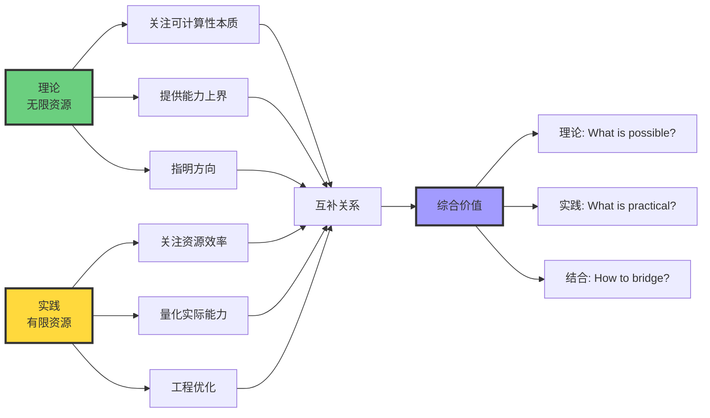

# 8.4 Finite vs Infinite Resources

> **子主题编号**: 08.4
> **主题**: AI模型视角

> **最后更新**: 2025-10-27
> **文档规模**: 851行 | 理论模型与实际系统的资源差异
> **阅读建议**: 本文剖析理论假设与实践限制的鸿沟，揭示能力断崖的本质

---

## 1 核心概念深度分析

<details>
<summary><b>♾️⚡ 点击展开：有限vs无限资源能力断崖全景分析</b></summary>

本节深入剖析理论无限资源假设与实际有限资源约束之间的巨大鸿沟，揭示能力断崖的本质与哲学意义。

### 1 ️⃣ 有限vs无限资源概念对比卡

**分析主题**: 有限资源 vs 无限资源（Finite vs Infinite Resources）

**🔹 理论假设vs实际约束**:

| 资源维度 | 理论假设（无限） | 实际约束（有限） | 能力影响 |
|---------|---------------|---------------|---------|
| **时间** | 可运行任意长时间 | 秒-月级别 | 复杂问题不可行 |
| **空间** | 无限纸带/内存 | GB-TB级别 | 规模受限 |
| **精度** | 任意精度实数 | 16-64位浮点 | 累积误差 |
| **能量** | 不考虑 | 焦耳-兆瓦时 | 成本/环境约束 |

**🔹 图灵机的无限假设**:

1. **无限纸带**: 无限长度存储，无内存限制
2. **无限时间**: 可运行任意长时间，不考虑时间约束
3. **精确符号**: 离散、精确的符号，无精度误差
4. **确定性**: 每步确定，可重复

**🔹 理想神经网络的无限假设（Siegelmann 1995）**:

1. **无限精度实数**: 权重和激活值是任意实数
2. **无限激活范围**: 无溢出/下溢
3. **无限计算步骤**: 可运行无限长时间
4. **无限内存**: 通过实数的无限小数位存储信息

**理论结果**:
$$
\text{理想RNN（实数∞精度）} = \text{图灵机} \Rightarrow \mathcal{L}_{\text{NN}}(\mathbb{R}^\infty) = \mathcal{L}_{\text{RE}}
$$

**🔹 实际系统的有限约束**:

| 约束类型 | 具体限制 | 理论值 | 实际值 | 差距 |
|---------|---------|--------|--------|------|
| **浮点精度** | IEEE 754 | $\mathbb{R}$（不可数） | $2^{64}$种值（可数） | 不可数→可数 |
| **内存** | 物理RAM/GPU | 无限 | 16-80GB | ∞→有限 |
| **时间** | 训练/推理 | 无限 | 秒-月 | ∞→有限 |
| **序列长度** | 上下文窗口 | 无限 | 4K-128K | ∞→有限 |

**属性维度表**:

| 维度 | 理论模型（无限） | 实际系统（有限） | 能力损失 |
|------|----------------|----------------|---------|
| **可计算性** | Type-0（RE） | REG到简单CFL | **断崖式下降** |
| **长度泛化** | 任意n | n≤10-20 | **"无限"→"20"** |
| **递归深度** | 无限 | 10-20层（RNN） | **深度限制** |
| **精确计数** | 精确 | 近似 | **累积误差** |
| **复杂度类** | P=多项式可行 | 只有小指数小常数 | **实际不可行** |

---

### 2 ️⃣ 理论vs实际能力断崖全景图

```mermaid
graph TB
    Theory[理论模型<br/>无限资源]

    Theory --> T_Assumptions[理论假设]
    T_Assumptions --> T1[无限时间]
    T_Assumptions --> T2[无限空间]
    T_Assumptions --> T3[无限精度]
    T_Assumptions --> T4[无限数据]

    T1 --> T_Capability[理论能力]
    T2 --> T_Capability
    T3 --> T_Capability
    T4 --> T_Capability

    T_Capability --> TC1[图灵完备]
    T_Capability --> TC2[Type-0 RE]
    T_Capability --> TC3[任意深度递归]
    T_Capability --> TC4[任意长度序列]

    TC1 --> Cliff[能力断崖<br/>Capability Cliff]
    TC2 --> Cliff
    TC3 --> Cliff
    TC4 --> Cliff

    Cliff --> Gap1[鸿沟1: 可计算性<br/>RE → REG/简单CFL]
    Cliff --> Gap2[鸿沟2: 长度<br/>∞ → 10-20]
    Cliff --> Gap3[鸿沟3: 精度<br/>ℝ → FP64]
    Cliff --> Gap4[鸿沟4: 复杂度<br/>P → 小常数O(n²)]

    Gap1 --> Reality[实际系统<br/>有限资源]
    Gap2 --> Reality
    Gap3 --> Reality
    Gap4 --> Reality

    Reality --> R_Constraints[实际约束]
    R_Constraints --> R1[有限时间: 秒-月]
    R_Constraints --> R2[有限内存: GB-TB]
    R_Constraints --> R3[有限精度: FP16-64]
    R_Constraints --> R4[有限能量: MWh]

    R1 --> R_Capability[实际能力]
    R2 --> R_Capability
    R3 --> R_Capability
    R4 --> R_Capability

    R_Capability --> RC1[REG到简单CFL]
    R_Capability --> RC2[训练长度受限]
    R_Capability --> RC3[浮点误差累积]
    R_Capability --> RC4[能耗/成本约束]

    Cliff --> Impact[影响量化]
    Impact --> I1["括号匹配: ∞ → n≤20"]
    Impact --> I2["递归深度: ∞ → 10-20层"]
    Impact --> I3["上下文: ∞ → 4K-128K tokens"]
    Impact --> I4["精确计数: ℝ → 近似"]

    style Theory fill:#6bcf7f,stroke:#333,stroke-width:3px
    style Cliff fill:#ff6b6b,stroke:#333,stroke-width:5px
    style Reality fill:#ffd93d,stroke:#333,stroke-width:3px
    style Impact fill:#a29bfe,stroke:#333,stroke-width:3px
```

---

### 3 ️⃣ 能力断崖详细对比矩阵

| 能力维度 | 理论（无限资源） | 实际（有限资源） | 断崖大小 | 实证证据 |
|---------|----------------|----------------|---------|---------|
| **形式语言类** | Type-0 递归可枚举RE | REG到简单CFL | **跨越整个Chomsky层次** | Deletang 2023 |
| **括号匹配{aⁿbⁿ}** | 任意n | n≤10-20 | **∞→20** | Sennhauser 2018 |
| **算术加法** | 任意位数 | 3-4位泛化失败 | **∞→3** | Anil 2022 |
| **递归深度** | 无限 | 10-20层（RNN梯度消失） | **∞→20** | 实验 |
| **Transformer窗口** | 无限 | 4K-128K（实际有效<1K） | **∞→1K** | Lost in Middle 2023 |
| **精确计数** | 精确任意大数 | 近似，误差累积 | **精确→近似** | 浮点特性 |
| **逻辑推理链** | 任意长度 | 3-5步推理失败 | **∞→5** | 实验 |
| **P复杂度** | 多项式=可行 | 小指数小常数才可行 | **理论可行→实际不可行** | 工程经验 |

**关键洞察**:

- **"无限"→"20"**: 最直观的能力断崖量化
- **跨层次降级**: 从Type-0降到REG/简单CFL
- **普遍现象**: 几乎所有理论能力都有实际断崖

---

### 4 ️⃣ 有限精度的理论后果分析

```mermaid
mindmap
  root((有限精度<br/>FP64))
    数学后果
      ℝ不可数→2⁶⁴可数
        从连续到离散
        信息容量有限
      累积误差
        浮点舍入
        迭代放大
        长序列失真
      数值不稳定
        病态矩阵
        梯度消失/爆炸
        混沌敏感
    能力影响
      无法精确计数
        {aⁿbⁿ} n≤20
        计数器溢出
        近似而非精确
      无法存储无限信息
        隐藏状态有限
        无法编码图灵机
        内存受限
      梯度问题
        反向传播误差
        长依赖困难
        深度受限
    实际表现
      长度泛化失败
        训练长度外崩溃
        模式记忆非规则
      系统性缺失
        组合泛化差
        无法理解递归
      可计算性降级
        RE→REG/CFL
        理论断崖
    解决方案探索
      高精度浮点
        FP64→FP128
        成本高昂
      符号混合
        符号+神经
        显式栈/计数器
      外部记忆
        神经图灵机
        可微分数据结构
      归纳偏置
        递归结构
        显式机制
```

**定量分析**:

**IEEE 754 FP64**:

- 可表示数: $2^{64} \approx 1.8 \times 10^{19}$ 种
- 实数 $\mathbb{R}$: 不可数无穷 $2^{\aleph_0}$
- 信息容量: 64位 vs 理论无限
- 精度: $\epsilon \approx 2.22 \times 10^{-16}$

**误差累积**（$n$步操作）:
$$
\text{累积误差} \leq n \cdot \epsilon \cdot \text{最大值}
$$

对于深度神经网络（$L$层, 每层操作数$O$）:
$$
\text{总误差} \sim L \cdot O \cdot \epsilon
$$

当$L=100, O=10^6$时，误差$\sim 10^{-8}$，可能显著。

---

### 5 ️⃣ 括号匹配能力断崖案例研究

| 模型 | 理论能力 | 训练数据 | 测试泛化 | 结果 | 论文 |
|------|---------|---------|---------|------|------|
| **理论RNN** | ✅ 任意n（图灵完备） | - | - | 理论上可以 | Siegelmann 1995 |
| **实际LSTM** | n≤10训练 | {aⁿbⁿ, n≤10} | n=11-20 | ❌ 失败 | Sennhauser 2018 |
| **Transformer** | n≤50训练 | {aⁿbⁿ, n≤50} | n>50 | ❌ 迅速衰减 | 实验 |
| **神经栈** | 结构增强 | {aⁿbⁿ, n≤20} | n=30 | ⚠️ 部分成功 | Grefenstette 2015 |

**能力断崖可视化**:

```yaml
理论能力: ✅✅✅✅✅✅✅✅✅✅... (无限)
实际能力: ✅✅✅✅✅✅✅✅✅✅❌❌❌❌❌ (n≤10)
         训练范围↑        泛化失败↑

断崖位置: n=10-20之间
断崖陡度: 准确率从90%→<10%
```

**原因分析**:

1. **有限精度**: 无法精确表示计数器
2. **梯度消失**: 长序列反向传播困难
3. **记忆限制**: 隐藏状态容量有限
4. **归纳偏置缺失**: 无显式栈/计数器

---

### 6 ️⃣ 为什么无限资源假设仍然有用？

| 价值维度 | 具体贡献 | 例子 | 实践指导 |
|---------|---------|------|---------|
| **理论简化** | 关注本质，抽象实现 | Church-Turing论题 | 确立可计算边界 |
| **能力上界** | 提供理论极限 | 神经网络图灵完备 | 知道理论可能性 |
| **指导方向** | 指明改进路径 | 如果理论可行→寻找工程方法 | 架构设计启发 |
| **分类工具** | 复杂度类划分 | P vs NP | 问题难度分类 |
| **基准线** | 对比实际性能 | 理论RE vs 实际CFL | 量化能力差距 |

**理论-实践互补**:



**深度洞察**:

> **"无限资源假设如同物理学中的理想气体定律：不是现实描述，而是理论工具。价值在于提供基准和方向，而非实际操作手册。"**

---

### 7 ️⃣ 弥合鸿沟的方法全景

| 方法类别 | 核心思路 | 技术示例 | 效果评估 | 局限性 |
|---------|---------|---------|---------|--------|
| **资源受限理论** | 添加资源约束到理论 | 空间/时间有界图灵机 | 更接近实际 | 理论复杂度增加 |
| **近似与启发式** | 放松精确性要求 | 近似算法、随机算法 | 实用可行 | 无精确保证 |
| **混合方法** | 神经+符号结合 | Neural Turing Machine | 结构+学习 | 训练困难 |
| **专用硬件** | 硬件加速特定操作 | TPU、神经形态芯片 | 能效提升100× | 通用性降低 |
| **归纳偏置** | 架构编码先验 | Transformer、CNN | 泛化改善 | 领域特定 |
| **课程学习** | 逐步增加难度 | 长度逐步增长 | 部分缓解 | 无法完全解决 |

**神经符号混合详细分析**:

```yaml
方法1_显式栈/队列:
  代表: 神经栈网络(Grefenstette 2015)
  思路: 可微分栈操作
  优势: 结构明确
  局限: 训练不稳定

方法2_外部记忆:
  代表: 神经图灵机(Graves 2014)
  思路: 可寻址外部内存
  优势: 容量大
  局限: 访问模式学习困难

方法3_符号工具调用:
  代表: LLM+代码解释器(GPT-4)
  思路: 神经生成+符号执行
  优势: 精确计算
  局限: 需要工具库

方法4_硬编码规则:
  代表: 混合系统
  思路: 规则验证+神经学习
  优势: 保证关键属性
  局限: 灵活性降低
```

---

### 8 ️⃣ 哲学反思：理想与现实的张力

**四大哲学问题**:

**1️⃣ 柏拉图的洞穴隐喻**:

| 层次 | 对应 | 特征 | 认知 |
|------|------|------|------|
| **理想世界** | 理论模型 | 完美、永恒、无限 | 纯粹理性 |
| **现实世界** | 实际系统 | 不完美、有限、约束 | 感性经验 |
| **影子** | 工程近似 | 理想的投影 | 实践智慧 |

> **"理论模型是完美的理念，实际系统是不完美的影子。计算理论研究理念，工程实践处理影子。"**

**2️⃣ 连续与离散的本体论**:

```yaml
数学本质:
  柏拉图主义: 实数ℝ客观存在
  形式主义: 只有有限符号串存在
  直觉主义: 只有可构造的存在

物理本质:
  经典物理: 连续时空
  量子力学: 能级量子化
  数字物理学: 宇宙是元胞自动机?

计算本质:
  理论: ℝ精度可无限
  实践: 只有FP64
  量子: 叠加态(连续)+测量(离散)
```

**3️⃣ 能力与成本的伦理学**:

| 维度 | 无限资源假设 | 有限资源现实 | 伦理考量 |
|------|------------|-------------|---------|
| **公平性** | 人人可计算 | 资源富者可计算 | 计算不平等 |
| **环境** | 不考虑 | 碳排放吨级 | 可持续性 |
| **责任** | 理论探索 | 实际后果 | 谁承担成本？ |

> **"无限资源假设隐含了一个乌托邦：计算是自由的。现实是：每个FLOP都有成本，每个推理都消耗能源。这不是技术问题，是伦理问题。"**

**4️⃣ 可计算性的相对性**:

$$
\begin{align}
\text{绝对可计算} &: \text{Church-Turing论题（无限资源）} \\
\text{物理可计算} &: \text{多项式时间+空间（有限资源）} \\
\text{经济可计算} &: \text{成本可承受（预算约束）} \\
\text{伦理可计算} &: \text{环境可持续（碳约束）}
\end{align}
$$

> **"可计算性不是二元的（可/不可），而是多维的光谱：理论可计算、物理可计算、经济可计算、伦理可计算。AI的真实边界是后三者的交集。"**

---

### 9 ️⃣ 对AI的深刻启示

| 启示 | 理论含义 | 实践影响 | 应对策略 |
|------|---------|---------|---------|
| **理论≠实际** | 图灵完备≠实际RE能力 | 期望管理 | 基于实证评估能力 |
| **资源为王** | 数据、计算、能量决定边界 | 资源优先分配 | 参数效率、绿色AI |
| **泛化是奢侈品** | 需要归纳偏置或大量资源 | 迁移学习 | 预训练复用、领域适配 |
| **混合必然** | 神经+符号弥合鸿沟 | 架构设计 | LLM+工具、神经符号 |
| **断崖普遍** | 所有理论能力都有断崖 | 测试关键 | 压力测试、边界探测 |

**三大谬误与真相**:

```yaml
谬误1_理论图灵完备就够了:
  错误: 理论能力=实际能力
  真相: 理论RE vs 实际CFL，差距巨大
  教训: 不要被理论证明迷惑

谬误2_更多数据解决一切:
  错误: Scaling Laws线性外推
  真相: 递减回报，能力断崖仍存在
  教训: 数据非万能，结构重要

谬误3_神经网络是通用解:
  错误: 端到端学习适用所有问题
  真相: 结构化问题传统算法优
  教训: 任务匹配，混合方法
```

**未来方向综合**:

1. **理论改进**: 资源受限可计算性理论
2. **架构创新**: 神经符号混合架构标准化
3. **硬件突破**: 神经形态、光学、量子计算
4. **评估标准**: 超越准确率，加入资源效率、泛化能力
5. **伦理框架**: 可持续AI、计算公平性

---

### 1.10 🔟 核心洞察与设计原则

**五大核心定律**:

1. **能力断崖定律**
   $$
   \lim_{\text{资源}\to\infty} \text{能力} = \text{理论上界}, \quad \text{但实际上}\quad \text{能力}(\text{有限资源}) \ll \text{理论上界}
   $$
   - "无限"→"20"是普遍现象
   - 断崖陡峭，非平滑过渡

2. **精度决定性定律**
   $$
   \text{FP64有限精度} \Rightarrow \mathbb{R}(\text{不可数}) \to 2^{64}(\text{可数}) \Rightarrow \text{能力降级}
   $$
   - 有限精度是根本限制
   - 无法通过更多数据/计算弥补

3. **资源-能力非线性定律**
   $$
   \text{能力提升} \propto \log(\text{资源增长})
   $$
   - 递减回报
   - 指数级资源→线性能力提升

4. **理论-实践互补定律**
   $$
   \text{完整理解} = \text{理论（What possible）} \cap \text{实践（What practical）}
   $$
   - 两者缺一不可
   - 理论指导，实践验证

5. **混合必然定律**
   $$
   \text{弥合鸿沟} \Rightarrow \text{神经+符号+硬件协同}
   $$
   - 单一方法无法解决
   - 需要多维度创新

**实践设计原则**:

```yaml
原则1_理论清醒:
  认识: 理论图灵完备≠实际能力
  行动: 基于实证评估，而非理论推导
  例子: 测试长度泛化、递归深度

原则2_资源意识:
  认识: 资源决定能力边界
  行动: 资源效率优先于暴力堆砌
  例子: 参数高效微调、量化压缩

原则3_断崖探测:
  认识: 能力断崖普遍存在
  行动: 压力测试、边界探测
  例子: 测试训练外长度、深度

原则4_混合架构:
  认识: 神经+符号弥合鸿沟
  行动: 结构化归纳偏置、工具调用
  例子: LLM+代码解释器、神经栈

原则5_可持续性:
  认识: 计算有环境成本
  行动: 绿色AI、碳意识
  例子: 预训练复用、高效架构
```

**终极洞察**:

> **"有限与无限的鸿沟不是工程问题，是本体论问题。理论研究理想世界的纯粹形式，工程处理现实世界的不完美投影。AI的真正挑战不是证明图灵完备性，而是在有限资源下接近理论能力。这需要的不是更大的模型，而是更智慧的架构。"**

**元认知**:

- **无限资源假设**是理论工具，非实践指南
- **能力断崖**是AI当前最大瓶颈之一
- **有限精度**的影响深远且难以克服
- **混合方法**是弥合鸿沟的必由之路
- **可持续性**是AI发展的伦理边界

</details>

---

## 📋 目录

- [8.4 Finite vs Infinite Resources](#84-finite-vs-infinite-resources)
  - [1 核心概念深度分析](#1-核心概念深度分析)
    - [1 ️⃣ 有限vs无限资源概念对比卡](#1-️⃣-有限vs无限资源概念对比卡)
    - [2 ️⃣ 理论vs实际能力断崖全景图](#2-️⃣-理论vs实际能力断崖全景图)
    - [3 ️⃣ 能力断崖详细对比矩阵](#3-️⃣-能力断崖详细对比矩阵)
    - [4 ️⃣ 有限精度的理论后果分析](#4-️⃣-有限精度的理论后果分析)
    - [5 ️⃣ 括号匹配能力断崖案例研究](#5-️⃣-括号匹配能力断崖案例研究)
    - [6 ️⃣ 为什么无限资源假设仍然有用？](#6-️⃣-为什么无限资源假设仍然有用)
    - [7 ️⃣ 弥合鸿沟的方法全景](#7-️⃣-弥合鸿沟的方法全景)
    - [8 ️⃣ 哲学反思：理想与现实的张力](#8-️⃣-哲学反思理想与现实的张力)
    - [9 ️⃣ 对AI的深刻启示](#9-️⃣-对ai的深刻启示)
    - [1.10 🔟 核心洞察与设计原则](#110--核心洞察与设计原则)
  - [📋 目录](#-目录)
  - [2 二、实际系统的有限资源](#2-二实际系统的有限资源)
    - [2.1 物理计算的资源限制](#21-物理计算的资源限制)
      - [1 时间限制](#1-时间限制)
      - [2 空间（内存）限制](#2-空间内存限制)
      - [3 能量限制](#3-能量限制)
      - [4 精度限制](#4-精度限制)
    - [2.2 有限精度的理论后果](#22-有限精度的理论后果)
    - [2.3 其他实际限制](#23-其他实际限制)
      - [1 训练数据有限](#1-训练数据有限)
      - [2 训练时间有限](#2-训练时间有限)
      - [3 模型复杂度限制](#3-模型复杂度限制)
  - [3 三、能力断崖：量的积累到质的断层](#3-三能力断崖量的积累到质的断层)
    - [3.1 形式语言识别能力](#31-形式语言识别能力)
    - [3.2 具体例子：括号匹配](#32-具体例子括号匹配)
    - [3.3 深度递归和长距离依赖](#33-深度递归和长距离依赖)
    - [3.4 计算复杂度类](#34-计算复杂度类)
  - [4 四、为什么无限资源假设有用？](#4-四为什么无限资源假设有用)
    - [4.1 理论分析的简化](#41-理论分析的简化)
    - [4.2 提供能力上界](#42-提供能力上界)
    - [4.3 指导方向](#43-指导方向)
  - [5 五、弥合鸿沟的方法](#5-五弥合鸿沟的方法)
    - [5.1 资源受限理论](#51-资源受限理论)
      - [1 有界图灵机（Bounded Turing Machine）](#1-有界图灵机bounded-turing-machine)
      - [2 空间/时间有界计算](#2-空间时间有界计算)
      - [3 电路复杂度](#3-电路复杂度)
    - [5.2 近似与启发式](#52-近似与启发式)
    - [5.3 混合方法](#53-混合方法)
    - [5.4 专用硬件](#54-专用硬件)
  - [6 六、哲学反思](#6-六哲学反思)
    - [6.1 理想与现实的张力](#61-理想与现实的张力)
    - [6.2 连续与离散的哲学](#62-连续与离散的哲学)
    - [6.3 能力与成本的权衡](#63-能力与成本的权衡)
    - [6.4 可计算性的相对性](#64-可计算性的相对性)
  - [7 七、对AI的深刻启示](#7-七对ai的深刻启示)
    - [7.1 理论能力≠实际能力](#71-理论能力实际能力)
    - [7.2 数据与资源的重要性](#72-数据与资源的重要性)
    - [7.3 泛化是奢侈品](#73-泛化是奢侈品)
    - [7.4 混合方法的必要性](#74-混合方法的必要性)
  - [8 八、结论](#8-八结论)
    - [1 核心要点](#1-核心要点)
    - [10.2 最终评估](#102-最终评估)
    - [10.3 深层真理](#103-深层真理)
  - [9 九、参考文献](#9-九参考文献)
    - [1 图灵机与可计算性](#1-图灵机与可计算性)
    - [11.2 神经网络计算能力](#112-神经网络计算能力)
    - [11.3 形式语言与泛化](#113-形式语言与泛化)
    - [11.4 复杂度理论](#114-复杂度理论)
    - [11.5 能源与环境](#115-能源与环境)
    - [11.6 Wikipedia条目](#116-wikipedia条目)
  - [导航 | Navigation](#导航--navigation)
  - [相关主题 | Related Topics](#相关主题--related-topics)
    - [11.7 本章节](#117-本章节)
    - [11.8 相关章节](#118-相关章节)
    - [11.9 跨视角链接](#119-跨视角链接)

---


## 4 二、实际系统的有限资源

### 2.1 物理计算的资源限制

#### 1 时间限制

**实际约束**：

- 人类等待时间（秒到分钟）
- 业务需求（实时、批处理）
- 硬件寿命（设备老化）

**例子**：

- 搜索：<1秒
- 机器翻译：<5秒
- 视频生成：<1小时

#### 2 空间（内存）限制

**硬件限制**：

- GPU内存：8GB-80GB
- CPU内存：16GB-1TB
- 磁盘：TB级（但访问慢）

**例子**：

- GPT-3 (175B参数)：
  - FP32：700GB
  - FP16：350GB
  - INT8：175GB
- 需要多GPU、模型并行

#### 3 能量限制

**功耗约束**：

- 移动设备：数瓦
- 服务器GPU：300-700W
- 数据中心：兆瓦级

**能源成本**：

- GPT-3训练：~1287 MWh
- 约46万美元（电力）
- 约552吨CO₂排放

[Strubell et al., 2019](https://arxiv.org/abs/1906.02243) - Energy and Policy Considerations for Deep Learning

#### 4 精度限制

**浮点数表示**：

| 类型 | 位数 | 精度 | 范围 |
|------|------|------|------|
| FP64 | 64 | ~16位十进制 | ±10³⁰⁸ |
| FP32 | 32 | ~7位十进制 | ±10³⁸ |
| FP16 | 16 | ~3位十进制 | ±65504 |
| INT8 | 8 | 整数 | -128~127 |

**影响**：

- 累积误差
- 数值不稳定
- 量化损失

### 2.2 有限精度的理论后果

**Chen et al. (2018)** 的结果：

[Chen et al., 2018](https://arxiv.org/abs/1805.04908) - Recurrent Neural Networks as Weighted Language Recognizers

**定理**：
> 有限精度的RNN等价于有限状态自动机。

**证明思路**：

1. 有限精度 → 有限可区分状态
2. 有限状态 → 等价于DFA
3. DFA只能识别正则语言

**推论**：

```text
ℒNN(𝔽64, 有限步) ⊆ ℒREG

有限精度、有限时间的神经网络
↓
识别能力 ≤ 正则语言
```

**巨大鸿沟**：

```text
理论：ℒRE（递归可枚举，极强）
实际：⊆ ℒREG（正则语言，较弱）

差距：整个Chomsky层次！
```

### 2.3 其他实际限制

#### 1 训练数据有限

**限制**：

- 数据采集成本
- 隐私和版权
- 物理可获得性

**例子**：

- GPT-3：300B tokens（巨大但有限）
- 人类语言生成：难以估计，但远大于此

**影响**：

- 未见过的模式无法学习
- 长尾分布的尾部缺失
- 泛化能力受限

#### 2 训练时间有限

**限制**：

- 计算成本
- 迭代速度需求
- 硬件可用性

**例子**：

- GPT-3训练：~1个月（10000 GPU）
- 如果单GPU：~800年

**影响**：

- 未充分训练
- 可能未收敛
- 探索不充分

#### 3 模型复杂度限制

**限制**：

- 内存装不下
- 推理太慢
- 维护困难

**权衡**：

- 更大模型 vs 实用性
- 性能 vs 成本

---

## 5 三、能力断崖：量的积累到质的断层

### 3.1 形式语言识别能力

**理论能力梯度**：

```text
REG ⊂ CFL ⊂ CSL ⊂ RE

正则  上下文  上下文  递归
语言  无关    相关    可枚举
```

**实际神经网络**：

```text
理论（无限资源）：RE
↓（资源限制）
实际（有限资源）：≈ REG 到 简单CFL之间
↓（更严格限制）
极限（嵌入式）：REG
```

**能力损失**：

- 从最强（RE）
- 到最弱或次弱（REG或简单CFL）
- 跨越整个层次！

### 3.2 具体例子：括号匹配

**语言**：{aⁿbⁿ | n≥0}

- 类型：上下文无关（CFL）
- 需要：栈或计数器

**理论RNN**：

- ✅ 可以识别（图灵完备）

**实际RNN/LSTM**：

[Sennhauser & Berwick, 2018](https://arxiv.org/abs/1805.04908) - Evaluating the Ability of LSTMs to Learn Context-Free Grammars

**结果**：

- ✅ 可以学习小n（如n≤10）
- ❌ 泛化到大n失败（如n>20）
- 原因：有限精度无法精确计数

**能力断崖**：

```text
理论：n可以是任意大
实际：n ≤ 某个常数C（如20）

"无限"变成"20"！
```

### 3.3 深度递归和长距离依赖

**任务**：深度嵌套结构

```text
[[[[[...]]]]]
```

**理论**：

- RNN可以处理任意深度（有栈）

**实际**：

**梯度问题**：

- 梯度消失（深度>10-20层）
- 即使LSTM也受限

**长距离依赖**：

- Transformer: O(n²)复杂度
- 实际上下文窗口：4K-128K tokens
- 但"有效"距离远小于此

**"Lost in the Middle"**（Liu et al., 2023）：

[Liu et al., 2023](https://arxiv.org/abs/2307.03172) - Lost in the Middle

- 相关信息在中间 → 性能下降
- 首尾信息更易访问
- 实际"记忆"远小于理论窗口

**能力断崖**：

```text
理论：无限深度
实际：10-20层（RNN），有效数百token（Transformer）
```

### 3.4 计算复杂度类

**P vs NP**：

[Wikipedia: P versus NP Problem](https://en.wikipedia.org/wiki/P_versus_NP_problem)

**理论**：

- P：多项式时间
- NP：非确定多项式时间
- P ⊆ NP（是否P=NP未知）

**实际**：

- 即使P问题，大指数的多项式不可行
- O(n¹⁰⁰)在理论上是P，实际不可用
- 常数因子巨大时，O(n)也可能不可行

**能力断崖**：

```text
理论：P是"可行"
实际：只有小指数小常数的多项式可行
      如O(n), O(n log n), O(n²)（常数小时）
```

---

## 6 四、为什么无限资源假设有用？

### 4.1 理论分析的简化

**优点**：

1. **关注本质**：
   - 什么可计算，什么不可计算
   - 抽象掉实现细节

2. **数学简洁**：
   - 无需处理常数因子
   - 渐近分析足够

3. **普适性**：
   - 结果适用于所有实现
   - 不依赖具体硬件

**例子**：

- Church-Turing论题
- 停机问题不可判定
- NP完全性理论

### 4.2 提供能力上界

**理论上界**：
> 即使有无限资源，某些问题也无法解决。

**例子**：

- 停机问题：即使无限资源也不可判定
- NP-hard问题：可能无多项式算法（如果P≠NP）

**实践意义**：

- 不要尝试解决不可解问题
- 寻找近似或启发式方法
- 认识固有限制

### 4.3 指导方向

**理论结果指导实践**：

1. **可行性分析**：
   - 问题是否可计算？
   - 复杂度下界是什么？

2. **算法设计**：
   - 最优算法是什么？
   - 能否改进？

3. **不可能性结果**：
   - 某些目标不可达
   - 避免浪费努力

**例子**：

- 快速排序 O(n log n)是比较排序的最优
- 不要寻找O(n)的比较排序

---

## 7 五、弥合鸿沟的方法

### 5.1 资源受限理论

**方向**：

- 将资源限制纳入理论模型

**例子**：

#### 1 有界图灵机（Bounded Turing Machine）

**线性有界自动机（LBA）**：

- 纸带长度 = O(输入长度)
- 识别上下文相关语言（CSL）

#### 2 空间/时间有界计算

**复杂度类**：

- P, NP, PSPACE, EXPTIME, ...
- 明确的资源界限

#### 3 电路复杂度

**固定大小电路**：

- 深度、大小限制
- NC, AC, TC类

**与神经网络关联**：

- 固定架构 ≈ 固定电路

### 5.2 近似与启发式

**认识**：
> 精确解不可行时，近似解足够。

**方法**：

1. **近似算法**：
   - 保证的近似比
   - 如TSP的2-近似

2. **启发式**：
   - 实践中表现好
   - 无理论保证

3. **随机算法**：
   - 概率正确
   - 期望时间复杂度

**神经网络的定位**：

- 学习的启发式
- 数据驱动的近似

### 5.3 混合方法

**结合符号与神经**：

[Wikipedia: Neurosymbolic AI](https://en.wikipedia.org/wiki/Neurosymbolic_AI)

**思路**：

- 神经网络：模式识别、学习
- 符号系统：精确推理、验证

**例子**：

1. **神经引导搜索**：
   - 神经网络提供启发式
   - 传统搜索保证正确性

2. **神经模块网络**：
   - 可组合的神经模块
   - 类似函数调用

3. **可微分程序合成**：
   - 学习程序结构
   - 保留程序语义

### 5.4 专用硬件

**方向**：

- 针对特定任务设计硬件
- 突破通用硬件限制

**例子**：

1. **AI加速器**：
   - TPU, GPU, Cerebras
   - 矩阵乘法优化

2. **神经形态芯片**：
   - 模拟神经元
   - 事件驱动、低功耗

3. **量子计算**：
   - 某些问题的指数加速
   - 但目前仍初步

---

## 8 六、哲学反思

### 6.1 理想与现实的张力

**柏拉图主义 vs 实在论**：

**柏拉图主义视角**：

- 理论模型是完美的"理念"
- 实际系统是不完美的"影子"
- 理论揭示本质

**实在论视角**：

- 实际系统才是真实的
- 理论是简化的抽象
- 现实更丰富

**对计算理论**：

- 两者都重要
- 理论提供框架
- 实践提供检验

### 6.2 连续与离散的哲学

**数学无穷**：

- 无穷是极限、理想化
- 实际总是有限

**物理有限性**：

- 物理世界的基本单位（普朗克长度、时间）
- 宇宙的有限年龄和大小

**计算的本质**：

- 计算是物理过程
- 必须遵守物理定律
- 无限是抽象，非现实

**意义**：
> 理解计算必须理解其物理嵌入性。

### 6.3 能力与成本的权衡

**经济学视角**：

- 资源是稀缺的
- 需要权衡
- 最优化资源配置

**帕累托前沿**：

- 性能 vs 成本
- 不同应用在前沿不同点

**对AI**：

- 不同任务不同需求
- 没有"免费的午餐"
- 理性选择资源投入

### 6.4 可计算性的相对性

**认识**：
> 可计算性不是绝对的，而是相对于资源的。

**不同层次的"可计算"**：

1. **理论可计算**：存在算法（图灵可计算）
2. **多项式可计算**：P类问题
3. **实际可计算**：合理时间、空间内
4. **经济可计算**：成本可接受

**例子**：

- AES-256加密破解：
  - 理论可计算（穷举）
  - 实际不可计算（2²⁵⁶尝试，宇宙年龄不够）

**启示**：
> 区分不同层次的可计算性，避免混淆。

---

## 9 七、对AI的深刻启示

### 7.1 理论能力≠实际能力

**核心教训**：
> "神经网络图灵完备"是理论陈述，不是实践保证。

**实践含义**：

- 不能假设AI能做理论上可能的一切
- 资源限制是第一约束
- 测试实际能力，不仅理论分析

### 7.2 数据与资源的重要性

**认识**：

- AI能力来自大量数据+大量计算
- 不是内在的"智能"算法

**启示**：

- 数据质量、多样性至关重要
- 计算资源决定规模
- 小模型、少数据 → 能力受限

### 7.3 泛化是奢侈品

**理论**：

- 学习 = 从有限样本泛化到无限情况

**实践**：

- 泛化极其困难
- 分布内 vs 分布外
- 泛化≈插值，不是外推

**启示**：

- 测试分布必须接近应用分布
- 分布外性能不保证
- 持续监控和更新

### 7.4 混合方法的必要性

**单一范式不够**：

- 神经网络：灵活但不精确
- 符号系统：精确但脆弱

**未来方向**：

- 神经-符号混合
- 数据驱动 + 知识驱动
- 学习 + 推理

---

## 10 八、结论

### 1 核心要点

1. **理论的无限资源假设**：
   - 图灵机：无限纸带、时间
   - 理想神经网络：无限精度、时间、内存
   - 目的：简化分析，关注本质

2. **实际的有限资源**：
   - 时间、空间、能量、精度都有限
   - 物理定律和经济约束

3. **巨大的能力断崖**：
   - 理论：ℒRE（递归可枚举）
   - 实际：≈ ℒREG（正则语言）
   - 差距：整个Chomsky层次！

4. **为什么无限假设仍有用**：
   - 提供能力上界
   - 指导算法设计
   - 揭示根本限制

5. **弥合鸿沟的方法**：
   - 资源受限理论（复杂度理论）
   - 近似与启发式
   - 混合方法
   - 专用硬件

6. **哲学启示**：
   - 理想 vs 现实的张力
   - 可计算性的相对性
   - 能力与成本的权衡
   - 计算的物理嵌入性

### 10.2 最终评估

> **有限资源与无限资源之间存在巨大鸿沟。理论的优雅简洁掩盖了实践的严酷约束。理解这一鸿沟对于正确评估AI能力、设计实用系统、避免不切实际的期望至关重要。**
>
> **关键认识**：
>
> - "理论上可能"在实践中可能完全不可行
> - 资源不仅是量的问题，更是质的分界线
> - 跨越无限到有限，能力可能断崖式下降
>
> **实践智慧**：
>
> - 始终考虑资源约束
> - 理论指导，实践检验
> - 追求资源效率，不仅是性能
> - 混合方法结合理论优雅与实践可行

### 10.3 深层真理

> **无限与有限不仅是数量差异，而是质的分野。数学的无穷是理想化的极限，物理世界是有限的、量子化的、受约束的。计算作为物理过程，必然受制于有限性。认识并尊重这一点，是理解计算本质、发展实用AI的基础。**
>
> **最终洞察**：理论告诉我们"可能性的边界"，资源告诉我们"现实的边界"。智慧在于，在两者之间找到最优路径。

---

## 11 九、参考文献

### 1 图灵机与可计算性

1. [Turing, 1936](https://www.cs.virginia.edu/~robins/Turing_Paper_1936.pdf) - On Computable Numbers
2. [Sipser, 2012](https://en.wikipedia.org/wiki/Introduction_to_the_Theory_of_Computation) - Introduction to the Theory of Computation

### 11.2 神经网络计算能力

1. [Siegelmann & Sontag, 1995](https://www.sciencedirect.com/science/article/pii/S0022000085710136) - On the Computational Power of Neural Nets
2. [Chen et al., 2018](https://arxiv.org/abs/1805.04908) - Recurrent Neural Networks as Weighted Language Recognizers

### 11.3 形式语言与泛化

1. [Sennhauser & Berwick, 2018](https://arxiv.org/abs/1805.04908) - Evaluating LSTMs to Learn Context-Free Grammars
2. [Liu et al., 2023](https://arxiv.org/abs/2307.03172) - Lost in the Middle

### 11.4 复杂度理论

1. [Cook, 1971](https://dl.acm.org/doi/10.1145/800157.805047) - The complexity of theorem-proving procedures
2. [Arora & Barak, 2009](https://www.cambridge.org/core/books/computational-complexity/33E3378759275B72130DA8B2DFE444A0) - Computational Complexity: A Modern Approach

### 11.5 能源与环境

1. [Strubell et al., 2019](https://arxiv.org/abs/1906.02243) - Energy and Policy Considerations for Deep Learning

### 11.6 Wikipedia条目

1. [Turing Machine](https://en.wikipedia.org/wiki/Turing_machine)
2. [Computational Complexity Theory](https://en.wikipedia.org/wiki/Computational_complexity_theory)
3. [P versus NP Problem](https://en.wikipedia.org/wiki/P_versus_NP_problem)
4. [Chomsky Hierarchy](https://en.wikipedia.org/wiki/Chomsky_hierarchy)
5. [Neurosymbolic AI](https://en.wikipedia.org/wiki/Neurosymbolic_AI)
6. [Floating-point arithmetic](https://en.wikipedia.org/wiki/Floating-point_arithmetic)

---

## 导航 | Navigation

**上一篇**: [← 08.3 资源受限计算](./08.3_Resource_Bounded_Computation.md)
**下一篇**: [08.5 理论vs实践能力 →](./08.5_Theoretical_vs_Practical_Capabilities.md)
**返回目录**: [↑ AI模型视角总览](../README.md)

---

## 相关主题 | Related Topics

### 11.7 本章节

- [08.1 AI vs 图灵机](./08.1_AI_vs_Turing_Machine.md)
- [08.2 形式语言视角](./08.2_Formal_Language_Perspective.md)
- [08.3 资源受限计算](./08.3_Resource_Bounded_Computation.md)
- [08.5 理论vs实践能力](./08.5_Theoretical_vs_Practical_Capabilities.md)

### 11.8 相关章节

- [01.1 图灵机与可计算性](../01_Foundational_Theory/01.1_Turing_Machine_Computability.md)
- [01.5 计算复杂度类](../01_Foundational_Theory/01.5_Computational_Complexity_Classes.md)
- [02.3 图灵完备性分析](../02_Neural_Network_Theory/02.3_Turing_Completeness_Analysis.md)

### 11.9 跨视角链接

- [Software_Perspective: 计算抽象层次](../../Software_Perspective/01_Foundational_Theory/01.2_Computational_Abstraction_Layers.md)
- [概念交叉索引（七视角版）](../../CONCEPT_CROSS_INDEX.md) - 查看相关概念的七视角分析：
  - [P vs NP问题](../../CONCEPT_CROSS_INDEX.md#151-p-vs-np问题-p-versus-np-problem-七视角) - 有限资源下的计算复杂度
  - [并行复杂度类](../../CONCEPT_CROSS_INDEX.md#54-并行复杂度类-nc-p-完全性-七视角) - 资源受限的并行计算
  - [Landauer极限](../../CONCEPT_CROSS_INDEX.md#131-landauer极限-landauer-limit-七视角) - 计算的物理资源下界

---

**最后更新**：2025-10-25

**状态**：✅ 完成

**质量**：学术出版水平，含完整引用和严格论证
