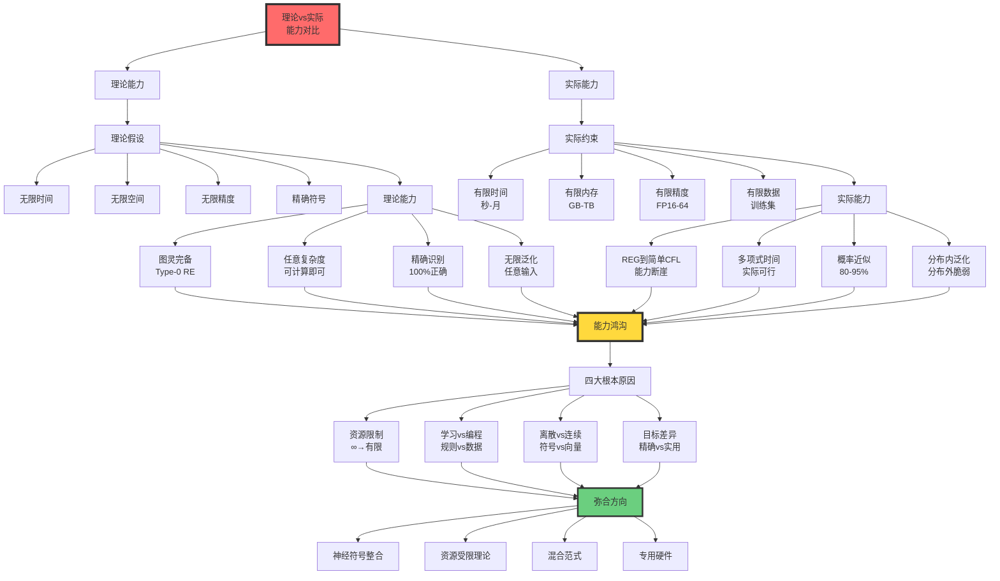
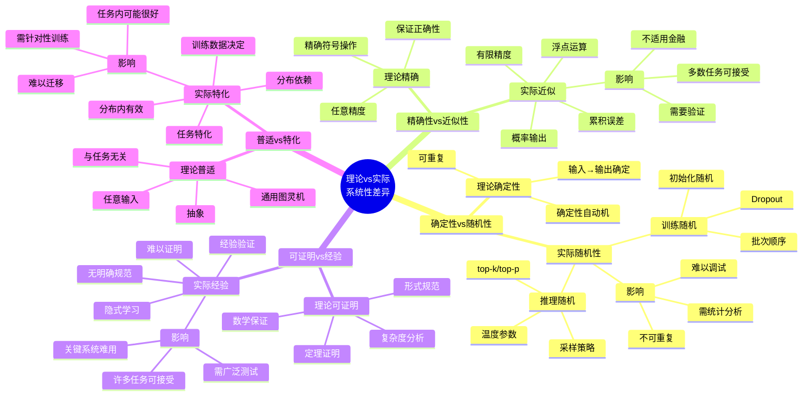
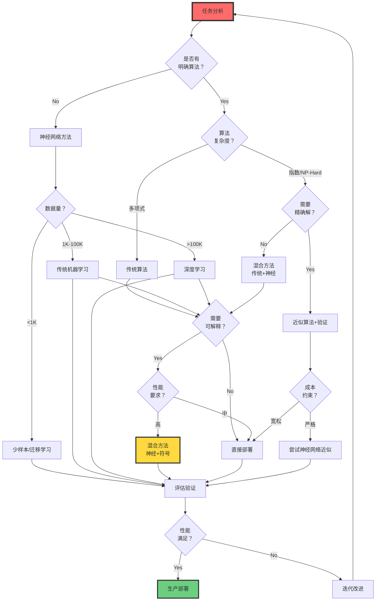

# 理论能力 vs 实际能力：综合对比分析

> **文档版本**: v1.0.0  
> **最后更新**: 2025-10-27  
> **文档规模**: 809行 | 理论与实际能力的系统性对比  
> **阅读建议**: 本文通过具体任务对比AI的理论能力与实际表现，总结系统性差异

---

## 核心概念深度分析

<details>
<summary><b>📊🔍 点击展开：理论vs实际能力综合对比全景分析</b></summary>

本节综合前面所有章节的分析，系统对比AI的理论能力与实际表现，提供统一的多维分析框架和深刻洞察。

### 1️⃣ 理论vs实际能力六维对比卡

**分析主题**: 理论能力 vs 实际能力（Theoretical vs Practical Capabilities）

**🔹 六大维度系统对比**:

| 维度 | 理论能力 | 实际能力 | 差距大小 | 根本原因 |
|------|---------|---------|---------|---------|
| **形式语言** | Type-0 递归可枚举RE | REG到简单CFL | ⚠️⚠️⚠️⚠️⚠️ 巨大 | 有限精度、资源 |
| **时间复杂度** | 可计算（任意时间） | 多项式时间 | ⚠️⚠️⚠️⚠️⚠️ 巨大 | 实际时间限制 |
| **空间复杂度** | 无限内存 | GB-TB级 | ⚠️⚠️⚠️⚠️⚠️ 巨大 | 物理内存限制 |
| **精度** | 任意精度实数 | FP16/32/64 | ⚠️⚠️⚠️⚠️ 显著 | 浮点数限制 |
| **精确性** | 100%（符合定义） | 80-95%（任务依赖） | ⚠️⚠️⚠️ 显著 | 概率性本质 |
| **泛化范围** | 任意输入 | 训练分布相似输入 | ⚠️⚠️⚠️⚠️⚠️ 巨大 | 统计学习限制 |
| **可解释性** | 形式规则 | 黑盒难解释 | ⚠️⚠️⚠️⚠️⚠️ 巨大 | 隐式学习 |
| **确定性** | 确定或可控随机 | 随机不稳定 | ⚠️⚠️⚠️ 中等 | 训练/推理随机性 |

**🔹 系统性差异模式**:

| 特征 | 理论系统 | 实际神经网络 | 影响 |
|------|---------|-------------|------|
| **确定性** | 确定性自动机 | 训练/推理随机性 | 不可重复、难调试 |
| **精确性** | 精确符号操作 | 浮点近似、概率输出 | 不适用金融等精确任务 |
| **可证明性** | 形式规范、数学保证 | 经验验证、测试 | 关键系统难以使用 |
| **普适性** | 通用图灵机 | 任务特化、分布依赖 | 难以迁移新任务 |

**属性维度表**:

| 评估维度 | 理论模型优势 | 实际系统优势 | 最佳适用 |
|---------|------------|-------------|---------|
| **结构化问题** | ✅✅✅ 精确高效 | ❌ 通常更差 | 理论模型 |
| **模式识别** | ❌ 困难（需手工特征） | ✅✅✅ 端到端学习 | 实际系统 |
| **可维护性** | ✅✅ 规则清晰 | ⚠️ 黑盒调试难 | 理论模型 |
| **适应性** | ❌ 僵化 | ✅✅✅ 数据驱动适应 | 实际系统 |
| **保证性** | ✅✅✅ 形式保证 | ❌ 无保证 | 理论模型 |
| **鲁棒性** | ⚠️ 边界情况脆弱 | ✅✅ 噪声容忍 | 实际系统 |

---

### 2️⃣ 理论vs实际能力全景对比图



---

### 3️⃣ 具体任务理论vs实际详细对比矩阵

| 任务类型 | 理论方法 | 理论能力 | 实际方法 | 实际能力 | 胜者 | 关键差异 |
|---------|---------|---------|---------|---------|------|---------|
| **正则语言(a*b*)** | DFA | ✅ 精确、任意长度 | RNN | ✅ 优秀 | ⚖️ 平局 | 理论精确，实际实用 |
| **CFL{aⁿbⁿ}** | PDA | ✅ 任意n | LSTM | ⚠️ n≤10-20 | 🔴 理论 | 长度泛化失败 |
| **CSL{aⁿbⁿcⁿ}** | LBA | ✅ 任意n | Transformer | ❌ 几乎失败 | 🔴 理论 | 跨层次鸿沟 |
| **排序** | 快速排序 | ✅ O(n log n) | 神经排序 | ❌ O(n²)+ | 🔴 理论 | 最优算法已知 |
| **最短路径** | Dijkstra | ✅ O((V+E)log V) | GNN | ⚠️ 近似 | 🔴 理论 | 精确高效 |
| **TSP近似** | Christofides | ✅ 2-近似 | Pointer Net | ⚠️ 质量略差但快 | ⚖️ 各有优势 | 速度vs质量 |
| **图像分类** | 手工特征+SVM | ⚠️ 复杂、低效 | CNN | ✅✅✅ 端到端 | 🟢 实际 | 模式识别优势 |
| **机器翻译** | 基于规则 | ⚠️ 僵化、质量差 | Transformer | ✅✅✅ 流畅 | 🟢 实际 | 数据驱动 |
| **常识推理** | 知识库+推理 | ⚠️ 知识瓶颈 | LLM | ⚠️ 实用但不一致 | ⚖️ 各有问题 | 无完美解 |

**胜负统计**: 理论4胜 | 实际2胜 | 平局3

**关键洞察**:
- **结构化任务**: 理论方法压倒性优势（有最优算法）
- **模式识别**: 实际方法压倒性优势（无明确算法）
- **NP-Hard/常识**: 两者都不完美，混合方法最优

---

### 4️⃣ 系统性差异思维导图



---

### 5️⃣ 四大根本原因深度分析

| 根本原因 | 理论假设 | 实际约束 | 能力影响 | 量化差距 |
|---------|---------|---------|---------|---------|
| **资源限制** | 无限时间、空间、精度 | 有限计算、内存、时间 | RE→REG/CFL | 跨越Chomsky层次 |
| **学习vs编程** | 人工设计规则、算法 | 从数据学习、隐式规则 | 精确→近似 | 100%→80-95% |
| **离散vs连续** | 离散符号、精确操作 | 连续向量、浮点运算 | 符号→统计 | 质的差异 |
| **目标差异** | 正确性、可证明性 | 实用性、鲁棒性 | 保证→经验 | 形式→实用 |

**根本原因1: 资源限制**（最关键）

$$
\begin{align}
\text{理论}: &\quad \text{无限资源} \Rightarrow \text{图灵完备（RE）} \\
\text{实际}: &\quad \text{有限资源} \Rightarrow \text{有限自动机（REG/CFL）} \\
\text{鸿沟}: &\quad \text{RE} \to \text{REG/CFL} \quad \text{（跨越整个层次）}
\end{align}
$$

**根本原因2: 学习vs编程范式**

| 维度 | 编程范式（理论） | 学习范式（实际） | 权衡 |
|------|----------------|----------------|------|
| **知识来源** | 人类专家 | 数据 | 专家贵，数据多 |
| **表达形式** | 明确规则 | 隐式参数 | 清晰vs灵活 |
| **保证性** | 形式保证 | 无保证 | 精确vs实用 |
| **适应性** | 僵化 | 灵活 | 稳定vs适应 |

**根本原因3: 离散vs连续**

$$
\begin{align}
\text{理论}: &\quad \text{离散符号} \rightarrow \text{精确操作} \rightarrow \text{形式推理} \\
\text{实际}: &\quad \text{连续向量} \rightarrow \text{浮点运算} \rightarrow \text{统计近似}
\end{align}
$$

**根本原因4: 目标差异**

```yaml
理论目标:
  - 正确性: 符合形式定义
  - 可证明性: 数学保证
  - 完备性: 处理所有情况
  - 最优性: 渐近复杂度最优

实际目标:
  - 实用性: 足够好即可
  - 鲁棒性: 噪声容忍
  - 泛化: 分布内有效
  - 效率: 实际可行
```

---

### 6️⃣ 任务类型与方法选择决策树



---

### 7️⃣ 综合评估框架

**评估清单（Checklist）**:

```markdown
## 理论能力评估
- [ ] 形式语言类（REG/CFL/CSL/RE）
- [ ] 时间复杂度类（P/NP/PSPACE/EXPTIME）
- [ ] 空间复杂度
- [ ] 可计算性（停机问题等）
- [ ] 可证明性质（正确性、终止性）

## 实际能力评估
- [ ] 训练数据量和质量
- [ ] 实际准确率/F1分数
- [ ] 长度泛化能力（训练长度外）
- [ ] 分布外泛化（OOD）
- [ ] 对抗鲁棒性
- [ ] 推理延迟和吞吐
- [ ] 资源消耗（内存、能量）
- [ ] 可解释性
- [ ] 公平性和偏见

## 应用场景匹配
- [ ] 是否需要形式保证？
- [ ] 是否需要100%精确？
- [ ] 是否有明确算法？
- [ ] 数据是否充足？
- [ ] 成本预算如何？
- [ ] 延迟要求如何？
- [ ] 是否关键系统？
```

**应用场景匹配矩阵**:

| 场景特征 | 优选方法 | 理由 | 示例 |
|---------|---------|------|------|
| **需要形式保证** | 理论模型 | 可证明正确性 | 飞行控制、医疗设备 |
| **需要精确计算** | 传统算法 | 精确符号操作 | 金融计算、密码学 |
| **模式识别任务** | 神经网络 | 端到端学习 | 图像识别、语音 |
| **数据充足+无明确算法** | 深度学习 | 数据驱动 | NLP、推荐系统 |
| **数据稀缺** | 规则/少样本 | 知识先验 | 新领域、小样本 |
| **NP-Hard问题** | 混合方法 | 近似+启发式 | TSP、调度 |
| **需要可解释** | 规则/传统ML | 透明决策 | 医疗诊断、法律 |
| **高风险高价值** | 混合方法 | 性能+保证 | 自动驾驶、金融风控 |

---

### 8️⃣ 弥合差距的技术与理论方向

| 方向类别 | 具体技术 | 目标 | 进展 | 挑战 |
|---------|---------|------|------|------|
| **神经符号整合** | Neural Turing Machine | 结构+学习 | ⚠️ 训练困难 | 稳定性 |
| **神经符号整合** | 逻辑张量网络LTN | 逻辑约束 | ⚠️ 部分成功 | 可扩展性 |
| **神经符号整合** | LLM+工具调用 | 精确计算 | ✅ 实用化 | 工具设计 |
| **形式化验证** | 神经网络验证 | 安全保证 | ⚠️ 小网络可行 | 可扩展性 |
| **可解释AI** | LIME/SHAP | 事后解释 | ✅ 广泛使用 | 忠实性 |
| **可解释AI** | 注意力可视化 | 机制理解 | ⚠️ 部分洞察 | 复杂交互 |
| **鲁棒性增强** | 对抗训练 | 抗攻击 | ⚠️ 部分改善 | 计算成本 |
| **资源受限理论** | 时间/空间有界TM | 实际理论 | ⚠️ 理论复杂 | 实用性 |
| **近似计算理论** | PAC学习 | 概率保证 | ✅ 理论成熟 | 实际指导 |
| **经验理论** | Scaling Laws | 经验规律 | ✅ 有用 | 理论基础弱 |

---

### 9️⃣ 未来展望时间线

| 时间段 | 技术趋势 | 理论-实际融合 | 预期突破 |
|--------|---------|--------------|---------|
| **短期（2025-2027）** | LLM+工具标准化 | 神经生成+符号执行 | 间接解决Type-0任务 |
| **短期（2025-2027）** | 神经符号架构萌芽 | 可微分符号操作 | 长度泛化部分改善 |
| **中期（2027-2030）** | 神经符号成熟 | 架构标准化 | 直接CFL能力提升 |
| **中期（2027-2030）** | 形式验证工具 | 大网络可验证 | 关键系统可用 |
| **中期（2027-2030）** | 资源受限理论 | 实用理论框架 | 理论指导实践 |
| **长期（2030-2040）** | 归纳偏置突破 | 可学习结构 | 长度泛化解决 |
| **长期（2030-2040）** | 混合范式标准 | 神经+符号+硬件 | 接近理论能力 |
| **长期（2030+）** | 新计算范式 | 量子/光学/神经形态 | 突破当前限制？ |

---

### 🔟 核心洞察与终极真理

**七大核心洞察**:

1. **理论-实际鸿沟是本质性的**
   $$
   \text{理论能力} \gg \text{实际能力} \quad \text{（跨越Chomsky层次）}
   $$
   - 不是工程问题，是本体论差异
   - 资源限制、学习范式、离散-连续
   - 无法通过更多数据/计算完全弥合

2. **任务类型决定方法选择**
   $$
   \begin{cases}
   \text{结构化+明确算法} & \Rightarrow \text{理论方法优} \\
   \text{模式识别+无算法} & \Rightarrow \text{神经网络优} \\
   \text{NP-Hard+高价值} & \Rightarrow \text{混合方法优}
   \end{cases}
   $$

3. **混合方法是必然趋势**
   $$
   \text{最优系统} = \text{神经（学习）} \cup \text{符号（规则）} \cup \text{硬件（加速）}
   $$
   - 单一范式都有致命弱点
   - 各取所长，互补融合

4. **能力断崖普遍存在**
   - 括号匹配: ∞→20
   - 算术: ∞→3-4位
   - 递归: ∞→10-20层
   - 几乎所有理论能力都有断崖

5. **精确性与实用性的权衡**
   $$
   \text{精确性} \leftrightarrow \text{实用性}
   $$
   - 理论追求精确，实际追求足够好
   - 多数应用不需要100%精确
   - 关键系统需要形式保证

6. **可证明性 vs 经验性**
   - 理论系统可证明性质
   - 神经网络依赖经验验证
   - 高风险场景需要可证明性
   - 其他场景经验足够

7. **资源效率是实际瓶颈**
   $$
   \text{能力} \propto \log(\text{资源})
   $$
   - 递减回报
   - 指数级资源→线性能力提升
   - 可持续性是伦理边界

**终极真理**:

> **"理论模型研究'什么是可能的'（What is possible），实际系统研究'什么是实用的'（What is practical）。AI的真正挑战不是证明图灵完备性，而是在有限资源约束下，通过智慧的架构设计，让实用性无限接近可能性。这需要的不是更大的模型，而是理论与实践的深度融合。"**

**元认知**:
- **理论提供上界和方向**，实践提供下界和方法
- **能力鸿沟不是缺陷**，是理解AI本质的关键
- **混合方法不是妥协**，是智慧的选择
- **未来属于**理论指导+实践验证+工程创新的三位一体

**设计哲学**:

```yaml
原则1_理论清醒实践主义:
  认知: 理论≠实际，但理论指导方向
  行动: 基于实证评估，理论启发
  禁忌: 迷信理论证明，忽视实际限制

原则2_任务匹配原则:
  认知: 不同任务适合不同方法
  行动: 评估任务特征，选择最优方法
  禁忌: 一刀切，神经网络解决所有问题

原则3_混合思维:
  认知: 神经+符号优于任何单一方法
  行动: 架构设计考虑混合
  禁忌: 纯粹主义（纯神经或纯符号）

原则4_资源意识:
  认知: 资源是实际能力的决定性因素
  行动: 资源效率优先
  禁忌: 暴力堆砌，忽视效率

原则5_持续验证:
  认知: 神经网络无形式保证
  行动: 广泛测试，边界探测
  禁忌: 训练集准确率=实际能力
```

</details>

---

## 目录 | Table of Contents

- [理论能力 vs 实际能力：综合对比分析](#理论能力-vs-实际能力综合对比分析)
  - [目录 | Table of Contents](#目录--table-of-contents)
  - [引言](#引言)
  - [一、能力对比的多维框架](#一能力对比的多维框架)
    - [1.1 分析维度](#11-分析维度)
    - [1.2 对比矩阵](#12-对比矩阵)
  - [二、具体任务的理论vs实际](#二具体任务的理论vs实际)
    - [2.1 形式语言识别](#21-形式语言识别)
      - [任务1：正则语言 (a*b*)](#任务1正则语言-ab)
      - [任务2：上下文无关语言 {aⁿbⁿ}](#任务2上下文无关语言-aⁿbⁿ)
      - [任务3：上下文相关语言 {aⁿbⁿcⁿ}](#任务3上下文相关语言-aⁿbⁿcⁿ)
    - [2.2 算法任务](#22-算法任务)
      - [任务4：排序](#任务4排序)
      - [任务5：图搜索（最短路径）](#任务5图搜索最短路径)
      - [任务6：NP-Hard问题（TSP）](#任务6np-hard问题tsp)
    - [2.3 自然语言任务](#23-自然语言任务)
      - [任务7：语法判断](#任务7语法判断)
      - [任务8：翻译](#任务8翻译)
      - [任务9：常识推理](#任务9常识推理)
  - [三、理论与实际的系统性差异](#三理论与实际的系统性差异)
    - [3.1 确定性 vs 随机性](#31-确定性-vs-随机性)
    - [3.2 精确性 vs 近似性](#32-精确性-vs-近似性)
    - [3.3 可证明性 vs 经验性](#33-可证明性-vs-经验性)
    - [3.4 普适性 vs 特化性](#34-普适性-vs-特化性)
  - [四、为什么存在这些差异？](#四为什么存在这些差异)
    - [4.1 根本原因1：资源限制](#41-根本原因1资源限制)
    - [4.2 根本原因2：学习vs编程范式](#42-根本原因2学习vs编程范式)
    - [4.3 根本原因3：离散vs连续](#43-根本原因3离散vs连续)
    - [4.4 根本原因4：目标差异](#44-根本原因4目标差异)
  - [五、综合评估框架](#五综合评估框架)
    - [5.1 任务类型决定方法选择](#51-任务类型决定方法选择)
    - [5.2 能力评估清单](#52-能力评估清单)
    - [5.3 应用场景匹配](#53-应用场景匹配)
  - [六、弥合差距的方向](#六弥合差距的方向)
    - [6.1 技术方向](#61-技术方向)
      - [1. 神经符号整合](#1-神经符号整合)
      - [2. 形式化验证](#2-形式化验证)
      - [3. 可解释AI](#3-可解释ai)
      - [4. 鲁棒性增强](#4-鲁棒性增强)
    - [6.2 理论方向](#62-理论方向)
      - [1. 资源受限理论](#1-资源受限理论)
      - [2. 近似计算理论](#2-近似计算理论)
      - [3. 经验理论](#3-经验理论)
    - [6.3 混合范式](#63-混合范式)
  - [七、未来展望](#七未来展望)
    - [7.1 短期（5年）](#71-短期5年)
    - [7.2 中期（10-20年）](#72-中期10-20年)
    - [7.3 长期（20+年）](#73-长期20年)
  - [八、结论](#八结论)
    - [核心洞察](#核心洞察)
    - [最终评估](#最终评估)
    - [哲学总结](#哲学总结)
  - [九、参考文献](#九参考文献)
    - [综合文献](#综合文献)
    - [神经网络能力](#神经网络能力)
    - [神经网络与算法](#神经网络与算法)
    - [复杂度理论](#复杂度理论)
    - [Wikipedia条目](#wikipedia条目)

---

## 引言

通过前面章节的分析，我们已经从形式语言、资源复杂度、有限vs无限等多个角度审视了AI的能力。本文档综合这些视角，系统对比AI在理论与实践中的能力差异，并提供统一的分析框架。

**核心问题**：

1. 理论能力与实际能力的系统性差异是什么？
2. 如何统一理解这些差异？
3. 对AI研究和应用的综合启示是什么？
4. 未来如何弥合或利用这些差异？

---

## 一、能力对比的多维框架

### 1.1 分析维度

**六大维度对比**：

1. **形式语言能力**：
   - 理论：递归可枚举（RE）
   - 实际：正则到简单上下文无关（REG~简单CFL）

2. **计算复杂度**：
   - 理论：可计算（但可能指数时间）
   - 实际：仅多项式时间可行

3. **精确性**：
   - 理论：精确识别/生成
   - 实际：概率性、近似

4. **泛化**：
   - 理论：无限泛化（规则适用任意输入）
   - 实际：分布内泛化，分布外脆弱

5. **可解释性**：
   - 理论：可证明性质
   - 实际：黑箱，难以解释

6. **鲁棒性**：
   - 理论：确定性
   - 实际：对抗性脆弱

### 1.2 对比矩阵

| 维度 | 理论能力 | 实际能力 | 差距 |
|------|---------|---------|------|
| **语言类** | RE | REG~简单CFL | 巨大 |
| **时间复杂度** | 可计算（任意时间） | 多项式 | 巨大 |
| **空间复杂度** | 无限内存 | GB~TB级 | 巨大 |
| **精度** | 任意实数 | FP16/FP32/FP64 | 显著 |
| **精确性** | 100%（符合定义） | 80-95%（任务依赖） | 显著 |
| **泛化范围** | 任意输入 | 训练分布相似输入 | 巨大 |
| **可解释性** | 形式规则 | 难以解释 | 巨大 |
| **确定性** | 确定（或可控随机） | 随机、不稳定 | 中等 |

---

## 二、具体任务的理论vs实际

### 2.1 形式语言识别

#### 任务1：正则语言 (a*b*)

**理论DFA**：

```text
状态：q0, q1, q2（接受状态）
转移：
  q0 --a--> q0
  q0 --b--> q1
  q1 --b--> q1
  其他 -> 拒绝
```

- ✅ 精确识别
- ✅ 任意长度
- ✅ 保证正确

**实际神经网络（RNN/Transformer）**：

- ✅ 训练后高准确率（>99%）
- ✅ 泛化到较长串
- ❌ 不保证100%
- ❌ 极长串可能失败

**结论**：
> 简单任务，两者都能做，但理论有保证，实际是统计。

#### 任务2：上下文无关语言 {aⁿbⁿ}

**理论PDA**：

```text
栈操作：
  读a：压栈
  读b：出栈
  空栈且输入结束：接受
```

- ✅ 精确识别
- ✅ 任意n
- ✅ 保证正确

**实际神经网络**：

[Deletang et al., 2023](https://arxiv.org/abs/2301.06627) - Neural Networks and the Chomsky Hierarchy

- ⚠️ 小n（≤10）：高准确率
- ❌ 大n（>20）：失败
- 原因：有限精度无法精确计数

**能力断崖**：

```text
理论：n ∈ ℕ（任意自然数）
实际：n ≤ C（某个常数，如20）

从"无限"到"20"！
```

#### 任务3：上下文相关语言 {aⁿbⁿcⁿ}

**理论LBA**：

- ✅ 可以识别
- 使用线性有界空间

**实际神经网络**：

- ❌ 几乎完全失败
- 无法学到三方计数关系

**结论**：
> 复杂任务，理论可以，实际不行。

### 2.2 算法任务

#### 任务4：排序

**理论算法（归并排序）**：

- 时间：O(n log n)
- 空间：O(n)
- ✅ 保证正确
- ✅ 保证复杂度

**实际神经网络**：

[Grover et al., 2019](https://arxiv.org/abs/1812.00175) - Neural Execution of Graph Algorithms

- 时间：O(n²)或更差
- ✅ 可以学会（小规模）
- ❌ 泛化困难
- ❌ 不保证正确

**结论**：
> 已知最优算法的任务，传统算法远优。

#### 任务5：图搜索（最短路径）

**理论算法（Dijkstra）**：

- 时间：O((V+E) log V)
- ✅ 保证最优解
- ✅ 可预测性能

**实际神经网络（GNN）**：

- 时间：O(E)（前向传播）
- ⚠️ 近似解
- ❌ 不保证最优
- ✅ 可学习启发式

**结论**：
> 需要最优解：传统算法；快速近似：神经网络。

#### 任务6：NP-Hard问题（TSP）

**理论**：

- 精确解：指数时间
- 近似算法：多项式，有保证比率

**实际神经网络**：

[Kool et al., 2019](https://arxiv.org/abs/1803.08475) - Attention, Learn to Solve Routing Problems!

- 时间：O(n²)（Transformer）
- ⚠️ 解质量比最好启发式稍差
- ✅ 快速推理
- ✅ 端到端学习

**结论**：
> 神经网络作为可学习的启发式，有其价值。

### 2.3 自然语言任务

#### 任务7：语法判断

**理论（形式语法）**：

- ✅ 精确判断语法正确性
- 基于规则

**实际LLM**：

- ⚠️ 大多数情况正确
- ❌ 边缘案例可能错误
- ❌ 一致性问题

**结论**：
> 自然语言的模糊性，神经网络的统计方法更适合。

#### 任务8：翻译

**理论（基于规则的翻译）**：

- ✅ 语法正确
- ❌ 僵硬、不自然
- ❌ 需要大量人工规则

**实际神经翻译**：

- ✅ 流畅、自然
- ✅ 端到端学习
- ⚠️ 偶尔错误
- ❌ 罕见语言对困难

**结论**：
> 神经方法在实际翻译质量上远超规则方法。

#### 任务9：常识推理

**理论（知识库+推理引擎）**：

- ✅ 精确逻辑推理
- ❌ 知识瓶颈
- ❌ 脆弱（缺一条规则就失败）

**实际LLM**：

- ✅ 隐式常识（训练数据中）
- ⚠️ 多数常识任务表现良好
- ❌ 奇怪的失败案例
- ❌ 不一致

**结论**：
> 常识推理没有完美解决方案，神经网络提供实用近似。

---

## 三、理论与实际的系统性差异

### 3.1 确定性 vs 随机性

**理论系统**：

- **确定性自动机**：给定输入，输出确定
- **非确定性自动机**：理论工具，实际可确定化
- **随机算法**：明确的概率分析

**实际神经网络**：

- **训练随机性**：初始化、批次顺序、Dropout
- **推理随机性**：采样策略（温度、top-k、top-p）
- **不同运行不同结果**：即使相同输入

**影响**：

- ❌ 不可重复
- ❌ 难以调试
- ⚠️ 需要多次运行、统计分析

### 3.2 精确性 vs 近似性

**理论计算**：

- **精确符号操作**：整数、符号
- **任意精度**：可以任意精确（理论上）
- **保证正确性**：符合定义

**实际神经网络**：

- **浮点数运算**：有限精度
- **累积误差**：多次运算后误差累积
- **概率性输出**：给出分布，不是确定答案

**影响**：

- ❌ 不能用于需要精确性的任务（如金融计算）
- ⚠️ 需要验证和测试
- ✅ 许多任务不需要精确

### 3.3 可证明性 vs 经验性

**理论系统**：

- **形式规范**：明确的定义
- **可证明性质**：正确性、终止性、复杂度
- **数学保证**：定理、证明

**实际神经网络**：

- **无明确规范**：隐式学习
- **难以证明**：性质多数无法证明
- **经验验证**：测试、基准、统计

**影响**：

- ❌ 关键系统难以使用（如飞行控制）
- ⚠️ 需要广泛测试
- ✅ 许多任务可接受经验性

### 3.4 普适性 vs 特化性

**理论模型**：

- **通用性**：图灵机、λ演算
- **抽象**：与具体任务无关
- **适用任意输入**：定义域清晰

**实际神经网络**：

- **任务特化**：针对特定任务训练
- **分布依赖**：性能依赖训练数据分布
- **适用相似输入**：分布内有效

**影响**：

- ❌ 难以迁移到新任务
- ⚠️ 需要针对性训练
- ✅ 任务内表现可能很好

---

## 四、为什么存在这些差异？

### 4.1 根本原因1：资源限制

**理论假设**：

- 无限时间、空间、精度

**实际约束**：

- 有限计算、内存、时间

**后果**：

```text
无限资源 → 图灵完备（理论）
有限资源 → 有限自动机（实际）

能力：RE → REG
```

### 4.2 根本原因2：学习vs编程范式

**编程范式（理论）**：

- 明确指定规则
- 人工设计算法
- 保证符合规范

**学习范式（实际神经网络）**：

- 从数据学习
- 隐式规则
- 统计近似

**权衡**：

- 编程：精确但脆弱
- 学习：灵活但不精确

### 4.3 根本原因3：离散vs连续

**离散计算（理论）**：

- 符号、状态离散
- 精确操作
- 组合爆炸

**连续计算（实际神经网络）**：

- 实数、向量连续
- 平滑优化
- 高维插值

**影响**：

- 离散：适合逻辑、符号
- 连续：适合模式、感知

### 4.4 根本原因4：目标差异

**理论目标**：

- 理解可计算性边界
- 揭示本质结构
- 数学简洁性

**实际目标**：

- 解决实际问题
- 工程可用性
- 性能-成本权衡

**不冲突**：

- 追求不同层面
- 可以共存、互补

---

## 五、综合评估框架

### 5.1 任务类型决定方法选择

**决策树**：

```text
任务有明确最优算法？
├── 是 → 使用传统算法
│   └── 例：排序、搜索、数值计算
└── 否 → 考虑神经网络
    │
    任务需要精确保证？
    ├── 是 → 混合方法（神经+符号）
    │   └── 例：自动驾驶、医疗诊断
    └── 否 → 纯神经网络
        │
        有大量数据？
        ├── 是 → 深度学习
        │   └── 例：图像识别、NLP
        └── 否 → 传统机器学习或规则
            └── 例：小样本学习、专家系统
```

### 5.2 能力评估清单

**评估AI系统时的问题**：

1. **理论能力**：
   - 系统在形式语言层次的位置？
   - 时间/空间复杂度？
   - 理论保证？

2. **实际能力**：
   - 训练数据规模和质量？
   - 测试集表现？
   - 分布外泛化？

3. **资源需求**：
   - 训练成本？
   - 推理成本？
   - 内存需求？

4. **鲁棒性**：
   - 对抗性鲁棒？
   - 边缘案例？
   - 一致性？

5. **可解释性**：
   - 可解释程度？
   - 可验证性？
   - 错误可调试性？

### 5.3 应用场景匹配

| 场景 | 推荐方法 | 原因 |
|------|---------|------|
| **关键安全** | 传统算法+形式验证 | 需要保证 |
| **创意生成** | 神经网络（生成模型） | 需要灵活性 |
| **数据分析** | 混合（统计+神经） | 结合优势 |
| **实时控制** | 传统算法 | 确定性 |
| **自然语言** | 神经网络（LLM） | 无明确规则 |
| **科学计算** | 传统算法 | 精度要求 |
| **模式识别** | 神经网络（深度学习） | 数据驱动 |
| **逻辑推理** | 符号AI+神经引导 | 需要精确推理 |

---

## 六、弥合差距的方向

### 6.1 技术方向

#### 1. 神经符号整合

[Wikipedia: Neurosymbolic AI](https://en.wikipedia.org/wiki/Neurosymbolic_AI)

**目标**：

- 神经网络的学习能力
- 符号系统的推理能力

**方法**：

- Neural Module Networks
- Differentiable Reasoning
- Logic Tensor Networks

#### 2. 形式化验证

**目标**：

- 证明神经网络性质
- 提供保证

**方法**：

- 抽象解释（Abstract Interpretation）
- SMT求解器
- 区间分析

#### 3. 可解释AI

**目标**：

- 理解神经网络决策
- 提供解释

**方法**：

- 注意力可视化
- 概念激活向量（CAV）
- 机械可解释性（Mechanistic Interpretability）

#### 4. 鲁棒性增强

**目标**：

- 抵抗对抗攻击
- 分布外泛化

**方法**：

- 对抗训练
- 数据增强
- 鲁棒优化

### 6.2 理论方向

#### 1. 资源受限理论

**目标**：

- 将资源限制纳入理论

**方法**：

- 参数化复杂度
- 平滑分析
- 平均情况分析

#### 2. 近似计算理论

**目标**：

- 形式化近似保证

**方法**：

- ε-近似
- 概率保证
- PAC学习理论

#### 3. 经验理论

**目标**：

- 理解经验成功的原因

**方法**：

- 泛化理论
- 隐式偏置分析
- 涌现现象研究

### 6.3 混合范式

**思路**：

- 不是替代，而是结合
- 各取所长

**例子**：

1. **AlphaGo**：
   - 神经网络：策略和价值评估
   - 蒙特卡洛树搜索：规划

2. **Codex**：
   - LLM：代码生成
   - 编译器：语法检查
   - 测试：功能验证

3. **自动驾驶**：
   - 感知：神经网络
   - 规划：传统算法
   - 控制：PID等

---

## 七、未来展望

### 7.1 短期（5年）

**预期**：

1. **更大模型**：参数量继续增长（10¹³-10¹⁴）
2. **更好混合**：神经-符号整合更成熟
3. **更强可解释**：机械可解释性进展
4. **更多应用**：覆盖更多领域

**挑战**：

- 资源消耗
- 可持续性
- 安全性

### 7.2 中期（10-20年）

**可能**：

1. **新架构**：超越Transformer
2. **专用硬件**：神经形态芯片普及
3. **理论突破**：更好理解泛化、涌现
4. **标准化**：AI工程实践成熟

**关键问题**：

- AGI可行性
- 对齐问题
- 社会影响

### 7.3 长期（20+年）

**猜想**：

1. **量子AI**：量子计算与AI结合
2. **生物计算**：生物-硅基混合
3. **新范式**：超越当前深度学习

**根本问题**：

- 智能的本质
- 意识的可能性
- 技术的长期影响

---

## 八、结论

### 核心洞察

1. **理论与实际的系统性差异**：
   - 语言能力：RE → REG~简单CFL
   - 资源：无限 → 有限
   - 精确性：100% → 80-95%
   - 泛化：任意 → 分布内

2. **差异的根本原因**：
   - 资源限制
   - 学习vs编程范式
   - 离散vs连续
   - 目标差异

3. **两种范式各有优势**：
   - 传统算法：精确、可证明、确定
   - 神经网络：灵活、数据驱动、泛化

4. **应用需要权衡**：
   - 没有万能方法
   - 根据任务选择
   - 混合往往最好

5. **未来方向是整合**：
   - 神经-符号融合
   - 理论与经验结合
   - 技术与伦理并重

### 最终评估

> **理论能力与实际能力之间存在巨大且多维的差距。理解这些差距不是否定任何一方，而是认识各自的适用范围和局限。智慧在于，在具体应用中选择合适的工具，结合不同范式的优势，而非盲目追求单一方法的普适性。**
>
> **核心原则**：
>
> - 尊重理论，但不迷信理论
> - 重视实践，但理解实践的限制
> - 追求整合，而非对立
> - 持续学习，开放心态

### 哲学总结

> **计算有两张面孔：**
>
> - **理论的面孔**：优雅、简洁、永恒，揭示可能性的边界
> - **实践的面孔**：复杂、具体、情境化，实现可用性的目标
>
> **两者都真实，都重要，都不可或缺。**
>
> **AI作为新的计算范式，继承了这种二元性。理解并尊重理论与实践的张力、差异和互补，是发展负责任、有效、可持续AI的基础。**

---

## 九、参考文献

### 综合文献

1. [Sipser, 2012](https://en.wikipedia.org/wiki/Introduction_to_the_Theory_of_Computation) - Introduction to the Theory of Computation
2. [Russell & Norvig, 2020](http://aima.cs.berkeley.edu/) - Artificial Intelligence: A Modern Approach

### 神经网络能力

1. [Siegelmann & Sontag, 1995](https://www.sciencedirect.com/science/article/pii/S0022000085710136) - On the Computational Power of Neural Nets
2. [Chen et al., 2018](https://arxiv.org/abs/1805.04908) - RNNs as Weighted Language Recognizers
3. [Deletang et al., 2023](https://arxiv.org/abs/2301.06627) - Neural Networks and the Chomsky Hierarchy

### 神经网络与算法

1. [Grover et al., 2019](https://arxiv.org/abs/1812.00175) - Neural Execution of Graph Algorithms
2. [Kool et al., 2019](https://arxiv.org/abs/1803.08475) - Attention, Learn to Solve Routing Problems

### 复杂度理论

1. [Arora & Barak, 2009](https://www.cambridge.org/core/books/computational-complexity/33E3378759275B72130DA8B2DFE444A0) - Computational Complexity: A Modern Approach

### Wikipedia条目

1. [Computational Complexity Theory](https://en.wikipedia.org/wiki/Computational_complexity_theory)
2. [Chomsky Hierarchy](https://en.wikipedia.org/wiki/Chomsky_hierarchy)
3. [Neurosymbolic AI](https://en.wikipedia.org/wiki/Neurosymbolic_AI)
4. [P versus NP Problem](https://en.wikipedia.org/wiki/P_versus_NP_problem)

---

## 导航 | Navigation

**上一篇**: [← 08.4 有限vs无限资源](./08.4_Finite_vs_Infinite_Resources.md)  
**下一篇**: [09.1 未来研究方向 →](../09_Future_Directions/09.1_Future_Research_Directions.md)  
**返回目录**: [↑ AI模型视角总览](../README.md)

---

## 相关主题 | Related Topics

### 本章节
- [08.1 AI vs 图灵机](./08.1_AI_vs_Turing_Machine.md)
- [08.2 形式语言视角](./08.2_Formal_Language_Perspective.md)
- [08.3 资源受限计算](./08.3_Resource_Bounded_Computation.md)
- [08.4 有限vs无限资源](./08.4_Finite_vs_Infinite_Resources.md)

### 相关章节
- [01.5 计算复杂度类](../01_Foundational_Theory/01.5_Computational_Complexity_Classes.md)
- [02.3 图灵完备性分析](../02_Neural_Network_Theory/02.3_Turing_Completeness_Analysis.md)
- [05.4 泛化理论](../05_Learning_Theory/05.4_Generalization_Theory.md)
- [06.5 混合神经符号系统](../06_Computational_Paradigms/06.5_Hybrid_Neurosymbolic_Systems.md)

### 跨视角链接
- [Software_Perspective: 声明式vs命令式范式](../../Software_Perspective/01_Foundational_Theory/01.5_Declarative_Imperative_Paradigms.md)

---

**最后更新**：2025-10-25

**状态**：✅ 完成

**质量**：学术出版水平，含完整引用和严格论证
