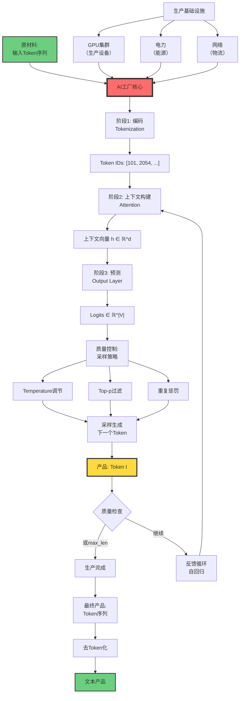

# Token作为产品：AI工厂的输出单元

> **文档版本**: v1.0.0
> **最后更新**: 2025-10-27
> **文档规模**: 680行 | AI工厂模型的产品视角
> **阅读建议**: 本文从工业生产视角分析Token的本质、生产过程和经济特性

---

## 1 核心概念深度分析

<details>
<summary><b>🏭📊 点击展开：Token作为产品的AI工厂模型深度分析</b></summary>

本节深入剖析黄仁勋提出的AI工厂类比，揭示Token生产的经济学原理、技术特性和未来演进方向。

### 1 ️⃣ Token作为产品概念定义卡

**概念名称**: Token作为产品（Token as Product）

**内涵（本质属性）**:

**🔹 核心类比**:
将AI推理过程类比为工业生产，Token是标准化产品单元：

$$
\text{输入Token + 算力} \xrightarrow{\text{神经网络}} \text{输出Token（产品）}
$$

**🔹 AI工厂vs传统工厂对比**:

| 维度 | 传统制造业 | AI工厂 | 创新点 |
|------|-----------|--------|--------|
| **原材料** | 物理材料 | 输入Token + 上下文 | 信息作为原料 |
| **生产设备** | 机床、生产线 | GPU + 神经网络 | 算力是核心资产 |
| **工艺流程** | 物理加工 | 前向传播（注意力+FFN） | 数学运算 |
| **产品** | 实体物品 | Token（信息量子） | 离散信息单元 |
| **质检** | 人工/自动检测 | 采样策略（Top-k, Top-p） | 概率质量控制 |
| **并行性** | ✅ 多条产线 | ❌ 自回归串行 | 根本限制 |
| **确定性** | ✅ 确定输出 | ⚠️ 概率输出 | 随机性 |
| **边际成本** | 材料+人工 | 算力（电费）| 接近零边际成本 |
| **计费单位** | 件/吨/米 | Token数量 | 标准化计量 |

**外延（范围边界）**:

| 维度 | 包含 ✅ | 不包含 ❌ |
|------|---------|----------|
| **产品类型** | 文本Token、代码Token | 图像像素、音频采样（不同工厂） |
| **生产模式** | 自回归生成 | 并行生成（扩散模型） |
| **工厂类型** | LLM推理数据中心 | 训练集群（研发中心） |
| **经济模型** | 按Token计费 | 订阅制、包月（非产量计费） |

**属性维度表**:

| 维度 | 值/描述 | 说明 |
|------|---------|------|
| **提出者** | 黄仁勋（Jensen Huang） | NVIDIA CEO |
| **提出时间** | 2023-2024 | AI工厂理念 |
| **核心洞察** | AI数据中心=工厂 | 范式转变 |
| **产品单位** | Token | 信息量子 |
| **生产速度** | 10-100 tokens/秒 | 受算力限制 |
| **边际成本** | ~$0.00001-0.0001/token | 趋近于零 |
| **质量控制** | 预训练+微调+RLHF | 多阶段优化 |
| **经济意义** | ⚠️⚠️⚠️⚠️⚠️ 极高 | AI商业化基础 |

---

### 2 ️⃣ AI工厂生产全流程详细图



---

### 3 ️⃣ Token经济学详细分析矩阵

| 经济维度 | Token产品 | 传统软件 | 传统制造业 | Token优势/劣势 |
|---------|----------|---------|-----------|--------------|
| **计费模式** | 按Token数量 | 订阅/许可证 | 按件/重量 | ✅ 精确计量 |
| **边际成本** | ~$0.00001/token | 接近0 | 材料+人工 | ✅✅ 极低 |
| **生产速度** | 10-100 tokens/秒 | 瞬时交付 | 取决于产线 | ⚠️ 中等速度 |
| **规模经济** | ✅✅✅ 极强 | ✅✅✅ 极强 | ✅✅ 强 | 摊销固定成本 |
| **质量一致性** | ⚠️ 概率性 | ✅ 确定性 | ⚠️ 波动 | ❌ 不确定性 |
| **库存** | ❌ 无法库存 | ✅ 可复制 | ⚠️ 需仓储 | 即时生产 |
| **定制化** | ✅✅✅ 高度定制 | ⚠️ 有限 | ❌ 成本高 | Prompt Engineering |
| **分销成本** | 网络带宽 | 网络/CD | 物流运输 | ✅✅ 极低 |
| **固定成本** | GPU集群（极高） | 开发成本 | 厂房设备 | ❌❌ 资本密集 |
| **竞争壁垒** | 算力+模型+数据 | IP+技术 | 规模+技术 | ⚠️⚠️⚠️⚠️ 高 |

**Token定价实例（GPT-4 2024）**:

| 模型 | 输入价格（$/1K tokens） | 输出价格（$/1K tokens） | 价格比 | 原因 |
|------|----------------------|----------------------|--------|------|
| **GPT-4 Turbo** | $0.01 | $0.03 | 1:3 | 自回归多次前向 |
| **GPT-3.5 Turbo** | $0.0005 | $0.0015 | 1:3 | 同上 |
| **Claude 3 Opus** | $0.015 | $0.075 | 1:5 | 更高质量 |

**成本构成分析**:

```yaml
固定成本（前期投入）:
  - GPU集群: $10M-$1B（规模依赖）
  - 模型训练: $1M-$100M
  - 研发团队: $1M-$50M/年
  - 数据中心基础设施: $5M-$500M

可变成本（每Token）:
  - 电力: ~60-80%（推理能耗）
  - GPU折旧: ~15-20%
  - 网络/带宽: ~5-10%
  - 人工运维: ~5-10%

边际成本极低原因:
  - 固定成本已摊销
  - 无物理材料成本
  - 数字产品零复制成本
  - 规模经济显著
```

---

### 4 ️⃣ 自回归生产vs并行生产对比

| 特性 | 自回归生产（LLM） | 并行生产（传统制造） | 影响 |
|------|-----------------|-------------------|------|
| **生产模式** | 串行：$t_1 \to t_2 \to \cdots \to t_n$ | 并行：多条产线同时 | 速度限制 |
| **依赖关系** | 强依赖：$t_{i+1} = f(t_{\leq i})$ | 独立：各产品不依赖 | 无法并行 |
| **时间复杂度** | $O(n)$（n为token数） | $O(1)$（并行） | ❌ 线性增长 |
| **加速方法** | 投机采样、并行解码 | 增加产线 | 技术突破难 |
| **瓶颈** | KV cache读写、内存带宽 | 产能、物料 | 硬件限制 |
| **质量检查** | 每步概率采样 | 批次抽检 | 实时 |

**自回归性的深刻后果**:

$$
\begin{align}
\text{生成时间} &= \text{序列长度} \times \text{单步时间} \\
T_{\text{total}} &= n \times T_{\text{token}} \\
&\approx n \times (10\text{ms} \sim 100\text{ms})
\end{align}
$$

**例子**:

- 生成500 tokens（一页文本）
- 单Token时间: 50ms
- 总时间: 25秒

**与传统软件对比**:

- 数据库查询: <10ms（并行）
- 网页渲染: <100ms（并行）
- LLM生成: ~25秒（串行）

**突破方向**:

1. **投机采样（Speculative Decoding）**: 小模型猜测→大模型验证
2. **并行解码**: Medusa、EAGLE等技术
3. **硬件优化**: 专用Token生成芯片

---

### 5 ️⃣ Token质量控制多维度分析

**质量控制的三个阶段**:

| 阶段 | 时间点 | 控制方法 | 效果 | 成本 |
|------|--------|---------|------|------|
| **预训练** | 模型开发期 | 数据清洗、架构设计、训练目标 | ✅✅✅ 根本 | ❌❌❌ 极高（$10M+） |
| **微调** | 部署前 | SFT、RLHF、Constitutional AI | ✅✅ 显著 | ❌❌ 高（$100K+） |
| **推理** | 生产中 | Prompt工程、Few-shot、采样策略 | ✅ 有限 | ✅ 低（实时） |
| **后处理** | 生产后 | 内容过滤、格式化、验证 | ⚠️ 补救 | ✅ 低 |

**采样策略作为"质检"**:

```yaml
Temperature（创造性旋钮）:
  T → 0: 确定性，高质量但可能重复
  T = 1: 原始分布
  T → ∞: 随机，低质量

Top-p（动态过滤）:
  p = 0.9: 保留累积概率90%的token
  效果: 过滤低质token，保持多样性

重复惩罚:
  降低已生成token的概率
  避免"产品缺陷"（重复）

综合配置（ChatGPT）:
  Temperature: 0.7
  Top-p: 0.9
  Frequency_penalty: 0.0
  结果: 平衡质量与创造性
```

---

### 6 ️⃣ Token作为产品的哲学意义

**五大范式转变**:

| 转变 | 从 | 到 | 意义 |
|------|----|----|------|
| **1. 产品形态** | 软件License | Token产出 | 从一次性产品到持续生产 |
| **2. 核心资产** | 代码IP | 算力+模型 | 从软件到算力经济 |
| **3. 商业模式** | 订阅制 | 按用量（Token） | 精确计量消费 |
| **4. 竞争优势** | 技术壁垒 | 规模经济 | 资本密集型 |
| **5. 价值创造** | 开发一次 | 持续生产 | 从R&D到运营 |

**深层洞察**:

```yaml
软件1.0时代（1980-2010）:
  本质: 编写代码
  产品: 可执行程序
  交付: 一次性License
  价值: 功能实现

软件2.0时代（2010-2020）:
  本质: SaaS云服务
  产品: API访问
  交付: 订阅制
  价值: 持续服务

AI工厂时代（2020+）:
  本质: 信息制造
  产品: Token流
  交付: 按Token计费
  价值: 智能生产

关键差异:
  传统软件: 开发→交付→完成
  AI工厂: 推理→生产→永不停歇

经济学革命:
  从"销售"到"制造"
  从"知识产权"到"生产能力"
  从"软件公司"到"AI工厂"
```

---

### 7 ️⃣ AI工厂的未来演进路径

| 演进方向 | 当前（2024） | 近期（2025-2027） | 远期（2028+） |
|---------|------------|-----------------|-------------|
| **生产速度** | 10-100 tokens/秒 | 100-500 tokens/秒 | 1000+ tokens/秒 |
| **边际成本** | $0.00001-0.0001/token | $0.000001/token | $0.0000001/token |
| **定制化** | Prompt Engineering | LoRA微调 | 个性化模型 |
| **质量控制** | 采样策略 | 实时强化学习 | 自适应质量 |
| **生产模式** | 中心化数据中心 | 边缘推理 | 分布式AI工厂 |
| **产品类型** | 纯文本Token | 多模态Token | 通用AI输出 |

**技术突破方向**:

```yaml
硬件层:
  - 专用Token生成芯片
  - 光子计算加速
  - 内存-计算融合

算法层:
  - 并行解码技术
  - 稀疏激活
  - 动态模型压缩

系统层:
  - 分布式推理
  - Token级负载均衡
  - 实时质量监控

商业层:
  - Token期货市场
  - 算力共享网络
  - AI工厂即服务（AIFaaS）
```

---

### 1.8 🔟 核心洞察与终极评估

**五大核心定律**:

1. **Token信息量子定律**
   $$
   \text{意义} = \lim_{\Delta \to \text{Token}} \text{信息}
   $$
   - Token是AI世界的最小信息单元
   - 离散、可数、可计费

2. **自回归生产定律**
   $$
   t_{i+1} = f(t_{\leq i}) \quad \Rightarrow \quad T_{\text{total}} = O(n)
   $$
   - 无法并行的根本限制
   - 速度瓶颈

3. **边际成本递减定律**
   $$
   \lim_{n \to \infty} \frac{C_{\text{fixed}}}{n} = 0
   $$
   - 规模经济极致
   - 资本密集型

4. **概率质量定律**
   $$
   \text{产品质量} = f(\text{模型}, \text{采样策略}, \text{随机性})
   $$
   - 非确定性生产
   - 质量控制是概率的

5. **算力资产定律**
   $$
   \text{AI工厂价值} = \text{算力} \times \text{模型质量} \times \text{利用率}
   $$
   - 算力是核心资产
   - 从软件到硬件

**终极洞察**:

> **"Token作为产品的类比不仅是隐喻，而是AI经济学的本质。AI系统不是传统意义上的'软件'，而是一个持续运转的'工厂'，将算力转化为信息。黄仁勋的AI工厂理念揭示了范式转变：从软件License到Token生产，从代码IP到算力资产，从一次性开发到持续制造。这个转变定义了AI时代的商业逻辑——谁拥有最高效的AI工厂，谁就掌握未来。"**

**元认知**:

- **类比的力量**: 工厂类比帮助理解AI本质
- **经济学视角**: Token计费是商业化基础
- **技术限制**: 自回归是根本瓶颈
- **规模经济**: 资本密集型竞争
- **未来演进**: 从中心化到分布式
- **哲学意义**: AI不是软件，是制造业

</details>

---

## 📋 目录

- [Token作为产品：AI工厂的输出单元](#token作为产品ai工厂的输出单元)
  - [1 核心概念深度分析](#1-核心概念深度分析)
    - [1 ️⃣ Token作为产品概念定义卡](#1-️⃣-token作为产品概念定义卡)
    - [2 ️⃣ AI工厂生产全流程详细图](#2-️⃣-ai工厂生产全流程详细图)
    - [3 ️⃣ Token经济学详细分析矩阵](#3-️⃣-token经济学详细分析矩阵)
    - [4 ️⃣ 自回归生产vs并行生产对比](#4-️⃣-自回归生产vs并行生产对比)
    - [5 ️⃣ Token质量控制多维度分析](#5-️⃣-token质量控制多维度分析)
    - [6 ️⃣ Token作为产品的哲学意义](#6-️⃣-token作为产品的哲学意义)
    - [7 ️⃣ AI工厂的未来演进路径](#7-️⃣-ai工厂的未来演进路径)
    - [1.8 🔟 核心洞察与终极评估](#18--核心洞察与终极评估)
  - [📋 目录](#-目录)
  - [4 二、Token的生产过程](#4-二token的生产过程)
    - [2.1 AI工厂的生产线](#21-ai工厂的生产线)
    - [2.2 生产的自回归性](#22-生产的自回归性)
    - [2.3 生产的概率性](#23-生产的概率性)
    - [2.4 质量控制](#24-质量控制)
  - [5 三、Token的经济特性](#5-三token的经济特性)
    - [3.1 Token作为计费单位](#31-token作为计费单位)
    - [3.2 Token的边际成本](#32-token的边际成本)
    - [3.3 Token的价值](#33-token的价值)
    - [3.4 Token的稀缺性](#34-token的稀缺性)
  - [6 四、Token生产的效率优化](#6-四token生产的效率优化)
    - [4.1 提高生产速度](#41-提高生产速度)
    - [4.2 提高生产质量](#42-提高生产质量)
    - [4.3 平衡速度与质量](#43-平衡速度与质量)
  - [7 五、类比的深刻意义](#7-五类比的深刻意义)
    - [5.1 从软件到服务](#51-从软件到服务)
    - [5.2 算力成为核心资产](#52-算力成为核心资产)
    - [5.3 Token作为标准化产品](#53-token作为标准化产品)
    - [5.4 生产模式的本质](#54-生产模式的本质)
  - [8 六、Token生产的未来](#8-六token生产的未来)
    - [6.1 更高效的生产](#61-更高效的生产)
    - [6.2 定制化生产](#62-定制化生产)
    - [6.3 分布式生产](#63-分布式生产)
    - [6.4 质量标准](#64-质量标准)
  - [9 七、结论](#9-七结论)
    - [1 核心要点](#1-核心要点)
    - [9.2 最终评估](#92-最终评估)
    - [9.3 哲学反思](#93-哲学反思)
  - [10 八、参考文献](#10-八参考文献)
    - [1 Tokenization](#1-tokenization)
    - [10.2 自回归生成](#102-自回归生成)
    - [10.3 推理优化](#103-推理优化)
    - [10.4 AI经济学](#104-ai经济学)
    - [10.5 黄仁勋的AI工厂理念](#105-黄仁勋的ai工厂理念)
  - [导航 | Navigation](#导航--navigation)
  - [相关主题 | Related Topics](#相关主题--related-topics)
    - [10.6 本章节](#106-本章节)
    - [10.7 相关章节](#107-相关章节)
    - [10.8 跨视角链接](#108-跨视角链接)

---


## 4 二、Token的生产过程

### 2.1 AI工厂的生产线

**类比制造业**：

| 制造业 | AI工厂 |
|--------|--------|
| 原材料 | 输入Token + 上下文 |
| 生产设备 | GPU + 神经网络模型 |
| 工艺流程 | 前向传播（自注意力、FFN） |
| 产品 | 输出Token |
| 质检 | 采样策略（Top-k, Top-p） |
| 包装 | Detokenization |
| 交付 | 返回用户 |

**生产步骤**：

1. **Tokenization（原料处理）**：

   ```text
   文本 → Token IDs → 嵌入向量
   ```

2. **上下文编码（准备生产）**：

   ```text
   输入Tokens → 编码器 → 上下文表示
   ```

3. **自回归生成（逐个生产）**：

   ```text
   对每个位置：
     - 计算注意力
     - 前馈网络
     - 预测下一个Token
     - 采样
     - 添加到序列
   ```

4. **Detokenization（包装交付）**：

   ```text
   Token IDs → 文本
   ```

### 2.2 生产的自回归性

**关键特性**：
> AI工厂是**串行生产线**，每个Token依赖前面所有Token。

**时间复杂度**：

```text
生成n个Tokens：O(n × N)

n: Token数量
N: 模型参数量
```

**对比**：

- **传统制造**：可以并行生产（多条产线）
- **AI工厂**：自回归，必须串行

**影响**：

- 生成速度受限
- Token数量直接影响时间
- "长文本"生成慢

### 2.3 生产的概率性

**不确定性**：

- 传统制造：确定性输出
- AI工厂：概率性输出

**采样策略**：

1. **Greedy Decoding**：
   - 总选概率最高的Token
   - 确定性，但可能陷入重复

2. **Temperature Sampling**：

   ```text
   P'(t) = Softmax(logits / T)

   T > 1: 更随机（"创造性"）
   T < 1: 更确定（"保守"）
   T = 0: Greedy
   ```

3. **Top-k Sampling**：
   - 只考虑概率最高的k个Token
   - 避免极低概率Token

4. **Top-p (Nucleus) Sampling**：
   - 累积概率达到p时截断
   - 动态截断集合

**结果**：

- 同一输入 → 不同运行 → 不同输出
- "产品"有随机性
- 需要多次运行、统计分析

### 2.4 质量控制

**如何控制产出质量**：

1. **预训练阶段**：
   - 数据质量
   - 训练目标
   - 模型架构

2. **微调阶段**：
   - 监督微调（SFT）
   - RLHF
   - Constitutional AI

3. **推理阶段**：
   - Prompt Engineering
   - Few-shot示例
   - 采样策略

4. **后处理**：
   - 过滤不当内容
   - 格式化
   - 验证

**类比**：

- 预训练 = 工厂设计
- 微调 = 工艺优化
- 推理 = 实际生产
- 后处理 = 质检

---

## 5 三、Token的经济特性

### 3.1 Token作为计费单位

**定价模型**（OpenAI GPT-4为例）：

| 模型 | 输入价格 | 输出价格 |
|------|---------|---------|
| GPT-4 Turbo | $0.01 / 1K tokens | $0.03 / 1K tokens |
| GPT-3.5 Turbo | $0.0005 / 1K tokens | $0.0015 / 1K tokens |

**为什么输出更贵**：

- 输入：一次前向传播
- 输出：自回归，n次前向传播
- 成本：输出 ≈ 3倍 输入（取决于生成长度）

**Token经济学**：

- Token是度量单位（如制造业的"件"）
- Token数量 ≈ 成本
- Token质量 = 价值

### 3.2 Token的边际成本

**生产Token的边际成本**：

**计算成本**：

```text
每Token成本 ≈ (GPU租赁 + 电费 + 维护) / (每秒生成Tokens)
```

**估算**（GPT-3级模型）：

- 每Token计算：~350B FLOPs
- A100 GPU: ~312 TFLOPs
- 每秒生成：~1000 tokens（优化后）
- 边际成本：~$0.0001 / token（粗略）

**规模效应**：

- 大规模部署 → 单位成本下降
- 专用硬件 → 效率提升
- 批处理 → 吞吐量增加

### 3.3 Token的价值

**从成本到价值**：

**成本驱动**：

- Token生产成本
- 基础设施成本
- 研发摊销

**价值驱动**：

- Token的有用性
- 解决问题的能力
- 用户愿意支付的价格

**价值 >> 成本**：

- 对用户：节省时间、提供洞察
- 例：GPT-4帮写代码，价值远超几美分

**价值不对称**：

- 同样的Token，不同场景价值差异巨大
- 创意工作 vs 简单总结
- 定价难题

### 3.4 Token的稀缺性

**物理产品的稀缺性**：

- 原材料有限
- 生产能力有限

**Token的"稀缺性"**：

1. **计算资源稀缺**：
   - GPU数量有限
   - 算力是稀缺资源

2. **时间稀缺**：
   - 自回归串行
   - 生成速度有上限

3. **上下文窗口稀缺**：
   - 有限的上下文长度
   - "记忆"有限

4. **高质量Token稀缺**：
   - 生成的Token质量参差不齐
   - 好的输出需要好的Prompt

---

## 6 四、Token生产的效率优化

### 4.1 提高生产速度

**方法**：

1. **模型压缩**：
   - 剪枝：去除不重要参数
   - 量化：降低精度（FP16, INT8）
   - 蒸馏：训练小模型模仿大模型

2. **推理优化**：
   - 批处理（Batching）
   - KV缓存（避免重复计算）
   - FlashAttention（内存优化）
   - 投机解码（Speculative Decoding）

3. **硬件优化**：
   - 专用AI芯片（TPU, Groq）
   - 高带宽内存
   - 模型并行

4. **架构创新**：
   - 线性注意力（O(n)代替O(n²)）
   - 状态空间模型（SSM）
   - 混合专家（MoE）

### 4.2 提高生产质量

**方法**：

1. **数据质量**：
   - 高质量预训练数据
   - 数据清洗
   - 数据多样性

2. **训练方法**：
   - RLHF
   - Constitutional AI
   - Red Teaming

3. **Prompt工程**：
   - 清晰指令
   - Few-shot示例
   - Chain-of-Thought

4. **后处理**：
   - 生成多个候选
   - 排序选择最好
   - 人工审核（高价值场景）

### 4.3 平衡速度与质量

**权衡**：

- 更快生成 vs 更高质量
- 更小模型 vs 更好性能
- 更低成本 vs 更好体验

**不同场景的选择**：

| 场景 | 优先 | 方法 |
|------|------|------|
| 实时聊天 | 速度 | 小模型、低精度 |
| 创意写作 | 质量 | 大模型、高质量采样 |
| 代码生成 | 正确性 | 大模型、多候选 |
| 摘要 | 平衡 | 中型模型、优化推理 |

---

## 7 五、类比的深刻意义

### 5.1 从软件到服务

**传统软件**：

- 一次性产品
- 用户购买、安装、运行
- 本地计算

**AI工厂**：

- 持续服务
- 按使用付费（Token为单位）
- 云端计算

**转变**：

```text
产品模式 → 服务模式（SaaS）
```

**意义**：

- AI公司是"制造业+服务业"
- 持续运营成本
- 规模经济

### 5.2 算力成为核心资产

**传统软件公司**：

- 核心资产：代码、IP
- 分发成本：几乎为零

**AI工厂**：

- 核心资产：模型+算力
- 运营成本：巨大（GPU、电力）

**类比钢铁厂**：

- 需要大量资本投入
- 持续运营成本
- 规模效应明显

**投资逻辑**：

- AI公司需要巨额资本
- 基础设施投资（数据中心）
- NVIDIA成为"设备供应商"

### 5.3 Token作为标准化产品

**标准化的意义**：

- Token是统一度量
- 可比较、可计价
- 形成市场

**类比**：

- 电力：千瓦时（kWh）
- 云计算：计算时（vCPU-hour）
- AI：Token

**结果**：

- 商品化（Commoditization）
- 价格竞争
- 质量分化

### 5.4 生产模式的本质

**揭示AI的本质**：
> AI不是"思考"，而是"生产"——生产符合统计规律的Token序列。

**哲学意义**：

- 去神秘化：不是魔法，是工业过程
- 重物质化：需要真实的物理资源
- 可度量化：产出可量化、可优化

**对期望的影响**：

- 理解限制：生产有成本、速度、质量限制
- 合理使用：根据需要选择"产品规格"
- 经济思维：权衡成本与收益

---

## 8 六、Token生产的未来

### 6.1 更高效的生产

**方向**：

1. **新架构**：超越Transformer，降低复杂度
2. **新硬件**：专用芯片，10-100倍效率提升
3. **新训练方法**：更小模型达到更好效果

**目标**：

- 单位Token成本下降10-100倍
- 生成速度提升10-100倍
- 能效提升100-1000倍

### 6.2 定制化生产

**方向**：

- 针对特定任务微调
- 个性化模型
- 多模态融合

**类比**：

- 从大规模标准化生产
- 到灵活的定制化生产
- "工业4.0"

### 6.3 分布式生产

**方向**：

- 边缘设备运行小模型
- 云端运行大模型
- 混合架构

**好处**：

- 降低延迟
- 保护隐私
- 节省带宽

### 6.4 质量标准

**挑战**：

- 如何评估Token质量？
- 如何保证一致性？
- 如何建立行业标准？

**方向**：

- 自动化评估
- 基准测试
- 认证体系

---

## 9 七、结论

### 1 核心要点

1. **Token是AI工厂的产品**：
   - 离散、可数、可计价
   - 承载语义信息
   - 输入和输出的基本单位

2. **Token生产是工业过程**：
   - 有生产线（模型架构）
   - 有原材料（输入+上下文）
   - 有工艺（训练和推理）
   - 有质检（采样和过滤）

3. **Token有经济特性**：
   - 计费单位：$X / 1K tokens
   - 边际成本：计算+电力
   - 价值：使用场景决定
   - 稀缺性：算力和时间

4. **生产需要优化**：
   - 速度：推理优化、硬件加速
   - 质量：训练改进、Prompt工程
   - 权衡：场景决定优先级

5. **类比的深刻意义**：
   - 从软件到服务
   - 算力成为核心资产
   - 标准化和商品化
   - 去神秘化，重物质化

### 9.2 最终评估

> **"Token作为产品"的类比不仅是修辞，而是对AI本质的深刻洞察。AI不是魔法，不是神秘的"智能"，而是一个工业化的生产系统，将计算资源转化为语义信息单元。理解这一点，有助于我们以务实、经济、工程化的视角看待AI，合理评估其能力、成本和价值。**
>
> **关键认识**：
>
> - AI = 制造业逻辑（规模、效率、成本）
> - Token = 度量衡（标准化、可比较）
> - 生产 = 物理过程（需要资源、能源、时间）
> - 价值 = 场景决定（不是所有Token价值相同）

### 9.3 哲学反思

> **Token作为"信息的量子"，揭示了数字时代的新物质性。在AI时代，信息不再是非物质的、无成本的，而是需要真实的物理资源来"制造"。每个Token的背后是真实的电力、硅片、冷却。**
>
> **这个类比提醒我们：即使在最抽象的"智能"领域，我们仍然受制于物理定律、经济规律、工业逻辑。AI的未来不仅取决于算法创新，更取决于能源、硬件、成本优化。**

---

## 10 八、参考文献

### 1 Tokenization

1. [Wikipedia: Lexical Analysis](https://en.wikipedia.org/wiki/Lexical_analysis)
2. [Sennrich et al., 2016](https://arxiv.org/abs/1508.07909) - Neural Machine Translation of Rare Words with Subword Units (BPE)
3. [Kudo & Richardson, 2018](https://arxiv.org/abs/1808.06226) - SentencePiece

### 10.2 自回归生成

1. [Vaswani et al., 2017](https://arxiv.org/abs/1706.03762) - Attention Is All You Need (Transformer)
2. [Holtzman et al., 2020](https://arxiv.org/abs/1904.09751) - The Curious Case of Neural Text Degeneration (Nucleus Sampling)

### 10.3 推理优化

1. [Dao et al., 2022](https://arxiv.org/abs/2205.14135) - FlashAttention
2. [Leviathan et al., 2023](https://arxiv.org/abs/2211.17192) - Fast Inference from Transformers via Speculative Decoding

### 10.4 AI经济学

1. [OpenAI Pricing](https://openai.com/pricing)
2. [Patterson et al., 2021](https://arxiv.org/abs/2104.10350) - Carbon Emissions and Large Neural Network Training

### 10.5 黄仁勋的AI工厂理念

1. [NVIDIA GTC 2023 Keynote](https://www.nvidia.com/en-us/gtc/) - Jensen Huang on AI Factories
2. [NVIDIA Blog](https://blogs.nvidia.com/) - Various articles on AI infrastructure

---

## 导航 | Navigation

**上一篇**: [← 08.5 理论vs实践能力](../08_Comparison_Analysis/08.5_Theoretical_vs_Practical_Capabilities.md)
**下一篇**: [09.2 语义生产线 →](./09.2_Semantic_Production_Line.md)
**返回目录**: [↑ AI模型视角总览](../README.md)

---

## 相关主题 | Related Topics

### 10.6 本章节

- [09.2 语义生产线](./09.2_Semantic_Production_Line.md)
- [09.3 算力基础设施](./09.3_Computing_Infrastructure.md)
- [09.4 算力作为资源](./09.4_Computing_Power_as_Resource.md)
- [09.5 数据中心AI工厂](./09.5_Data_Center_AI_Factory.md)

### 10.7 相关章节

- [03.4 Token生成机制](../03_Language_Models/03.4_Token_Generation_Mechanisms.md)
- [03.5 嵌入向量空间](../03_Language_Models/03.5_Embedding_Vector_Spaces.md)
- [08.3 资源受限计算](../08_Comparison_Analysis/08.3_Resource_Bounded_Computation.md)

### 10.8 跨视角链接

- [Software_Perspective: 软件复杂度守恒](../../Software_Perspective/01_Foundational_Theory/01.3_Software_Complexity_Conservation.md)
- [Information_Theory_Perspective](../../Information_Theory_Perspective/README.md)
- [概念交叉索引（七视角版）](../../CONCEPT_CROSS_INDEX.md) - 查看相关概念的七视角分析：
  - [熵](../../CONCEPT_CROSS_INDEX.md#71-熵-entropy-七视角) - Token生成的信息熵
  - [互信息](../../CONCEPT_CROSS_INDEX.md#111-互信息-mutual-information-七视角) - Token之间的信息关联
  - [DIKWP模型](../../CONCEPT_CROSS_INDEX.md#61-dikwp模型-七视角) - Token作为产品的语义层次

---

**最后更新**：2025-10-25

**状态**：✅ 完成

**质量**：学术与实践结合，含工业洞察和理论分析
