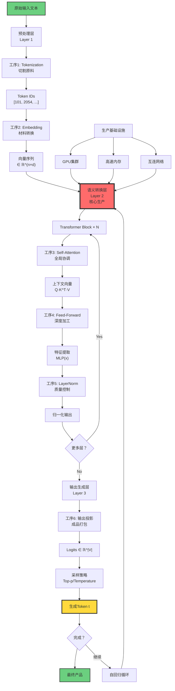

# 9.2 Semantic Production Line

> **子主题编号**: 09.2
> **主题**: AI模型视角

> **子主题编号**: 09.2
> **主题**: AI模型视角
> **最后更新**: 2025-10-27
> **文档规模**: 803行 | 语义内容的生产流程分析
> **阅读建议**: 本文详解AI如何将数据转化为语义内容的完整生产线

---

## 1 核心概念深度分析

<details>
<summary><b>🏭⚙️ 点击展开：语义生产线全流程深度解析</b></summary>

本节深入剖析AI模型的语义生产线结构、六大关键工序、四大瓶颈、优化方向和与传统生产线的深层对比。

### 1 ️⃣ 语义生产线概念定义卡

**概念名称**: 语义生产线（Semantic Production Line）

**内涵（本质属性）**:

**🔹 核心定义**:
将原始数据转化为有意义的Token序列的完整信息处理流程，类比工业生产线的流水作业。

$$
\text{输入数据} \xrightarrow{\text{语义生产线}} \text{语义内容（Token序列）}
$$

**🔹 三层架构**:

| 层次 | 功能 | 输入 | 输出 | 类比 |
|------|------|------|------|------|
| **Layer 1: 预处理层** | 数据标准化 | 原始文本 | Token向量序列 | 原料准备 |
| **Layer 2: 语义转换层** | 核心处理 | Token向量 | 上下文向量 | 核心加工 |
| **Layer 3: 输出生成层** | 产品生成 | 上下文向量 | Token序列 | 成品包装 |

**外延（范围边界）**:

| 维度 | 包含 ✅ | 不包含 ❌ |
|------|---------|----------|
| **处理对象** | 文本、代码Token | 图像像素、音频波形 |
| **架构** | Transformer、RNN、SSM | CNN（纯视觉）、MLP（非序列） |
| **阶段** | 推理生产 | 训练（研发阶段） |

**属性维度表**:

| 维度 | 值/描述 | 说明 |
|------|---------|------|
| **工序数量** | 6大核心工序 | Tokenization→Embedding→Attention→FFN→LN→Sampling |
| **层数** | 12-96层（GPT-3: 96层） | 深度堆叠 |
| **并行度** | Layer内并行，Layer间串行 | 受自回归限制 |
| **瓶颈** | 4大核心瓶颈 | 自回归、O(n²)注意力、内存带宽、批大小 |
| **效率指标** | 吞吐量、延迟、FLOPs、能效 | 多维度评估 |

---

### 2 ️⃣ 语义生产线完整流程图



---

### 3 ️⃣ 六大关键工序详细对比

| 工序 | 功能 | 输入 | 输出 | 复杂度 | 瓶颈 | 优化方向 |
|------|------|------|------|--------|------|---------|
| **1. Tokenization** | 文本切分 | 原始文本 | Token IDs | O(n) | 词表大小 | BPE、SentencePiece |
| **2. Embedding** | 向量化 | Token IDs | 向量序列 | O(n·d) | 查表开销 | 参数共享 |
| **3. Self-Attention** | 上下文建模 | 向量序列 | 上下文向量 | O(n²·d) | ⚠️⚠️⚠️⚠️⚠️ 二次复杂度 | Flash Attention、稀疏 |
| **4. Feed-Forward** | 特征提取 | 上下文向量 | 深度特征 | O(n·d²) | 计算密集 | MoE、Gating |
| **5. LayerNorm** | 稳定训练 | 特征 | 归一化特征 | O(n·d) | 小开销 | RMSNorm |
| **6. 输出投影+采样** | 生成Token | 最终向量 | Token | O(d·\|V\|) | 词表大小 | Adaptive Softmax |

**关键洞察**:

- **Attention是瓶颈**: O(n²)复杂度，长文本killer
- **FFN是计算主力**: 占模型参数70%+
- **LayerNorm是稳定剂**: 虽然开销小但关键

---

### 4 ️⃣ 四大瓶颈深度分析

| 瓶颈 | 表现 | 根本原因 | 影响 | 突破难度 | 当前方案 |
|------|------|---------|------|---------|---------|
| **1. 自回归串行性** | 生成慢 | $t_{i+1} = f(t_{\leq i})$ | ⚠️⚠️⚠️⚠️⚠️ | ⚠️⚠️⚠️⚠️⚠️ | 投机采样、并行解码 |
| **2. 注意力O(n²)** | 长文本崩溃 | 全连接计算 | ⚠️⚠️⚠️⚠️⚠️ | ⚠️⚠️⚠️⚠️ | Flash Attention、稀疏注意力 |
| **3. 内存带宽** | GPU利用率低 | KV cache读写 | ⚠️⚠️⚠️⚠️ | ⚠️⚠️⚠️ | Paged Attention、量化 |
| **4. 批处理大小** | 吞吐量受限 | 内存容量 | ⚠️⚠️⚠️ | ⚠️⚠️ | 梯度累积、模型并行 |

**瓶颈详解**:

```yaml
瓶颈1: 自回归串行性（根本性限制）
  问题: 生成500 tokens需要500次前向传播
  时间: 500 × 50ms = 25秒
  对比: 传统软件<100ms
  突破: 极难（改变生成范式）

瓶颈2: 注意力O(n²)（Scaling杀手）
  问题: 序列长度翻倍，计算量4倍
  例子:
    - 512 tokens: 可接受
    - 2048 tokens: 16倍计算
    - 8192 tokens: 256倍计算
  突破: 困难（近似算法）

瓶颈3: 内存带宽（实际瓶颈）
  问题: GPU算力>内存带宽
  A100:
    - 算力: 312 TFLOPS
    - 带宽: 1.5 TB/s
    - 利用率: <50%
  突破: 中等（硬件+算法）

瓶颈4: 批处理大小（吞吐量）
  问题: 单请求延迟vs批量吞吐
  权衡:
    - Batch=1: 低延迟，低吞吐
    - Batch=64: 高吞吐，高延迟
  突破: 容易（连续批处理）
```

---

### 5 ️⃣ 生产效率四大指标

| 指标 | 定义 | 公式 | 典型值（GPT-3级别） | 优化目标 |
|------|------|------|-------------------|---------|
| **吞吐量** | 单位时间生成Token数 | tokens/second | 50-200 tokens/s | ⬆️ 最大化 |
| **延迟** | 生成单Token时间 | ms/token | 10-100 ms | ⬇️ 最小化 |
| **FLOPs** | 浮点运算次数 | $2 \times \text{参数} \times \text{序列长度}$ | 175B × n × 2 | ⬇️ 降低 |
| **能效** | 每Token能耗 | Joules/token | 0.1-1 J/token | ⬇️ 降低 |

**效率公式**:

$$
\begin{align}
\text{吞吐量} &= \frac{\text{Batch Size}}{\text{单样本延迟}} \\
\text{FLOPs} &\approx 2 \times P \times n \quad (P=\text{参数数}) \\
\text{能效} &= \frac{\text{功率} \times \text{延迟}}{1} \quad (\text{J/token})
\end{align}
$$

---

### 6 ️⃣ 生产线优化路径全景

**四大优化方向**:

| 优化类别 | 方法 | 效果 | 难度 | 成熟度 |
|---------|------|------|------|--------|
| **架构优化** | MoE、稀疏Attention、SSM | 10-100×加速 | ⚠️⚠️⚠️⚠️ | TRL 3-5 |
| **推理优化** | KV cache、Flash Attention、量化 | 2-10×加速 | ⚠️⚠️⚠️ | TRL 6-8 |
| **硬件加速** | 专用芯片、HBM、NVLink | 2-5×加速 | ⚠️⚠️⚠️⚠️⚠️ | TRL 7-9 |
| **系统优化** | 连续批处理、模型并行 | 2-5×加速 | ⚠️⚠️ | TRL 8-9 |

**优化技术对比**:

```yaml
架构级（根本性）:
  MoE（混合专家）:
    原理: 每Token只激活部分专家
    效果: 10×参数，2×计算
    挑战: 训练不稳定

  稀疏Attention:
    原理: 只关注部分Token
    效果: O(n²) → O(n·log n)
    挑战: 如何选择稀疏模式

  状态空间模型（Mamba）:
    原理: 避免Attention
    效果: O(n)复杂度
    挑战: 性能仍需验证

推理级（工程优化）:
  Flash Attention:
    原理: 内存层次优化
    效果: 2-4×加速
    成熟度: ✅ 生产可用

  量化（INT8/INT4）:
    原理: 降低精度
    效果: 2-4×加速
    成熟度: ✅ 生产可用

  投机采样:
    原理: 小模型猜测+大模型验证
    效果: 2-3×加速
    成熟度: ⚠️ 研究中
```

---

### 7 ️⃣ AI生产线vs传统生产线深层对比

| 维度 | 传统生产线（汽车） | AI语义生产线 | 深层差异 |
|------|-----------------|-------------|---------|
| **原材料** | 钢材、零件（物理） | 数据、Token（信息） | 物质→信息 |
| **加工过程** | 物理变换（切割、焊接） | 数学运算（矩阵乘法） | 物理→逻辑 |
| **能量消耗** | 机械能、热能 | 电能（算力） | 直接→间接 |
| **产品** | 实体汽车 | Token序列（信息） | 有形→无形 |
| **质量控制** | 尺寸、强度检测 | 概率采样、后处理 | 确定→概率 |
| **并行性** | ✅ 多条产线 | ❌ 自回归串行 | 可并行→必串行 |
| **库存** | ✅ 可存储 | ❌ 即时生产 | 可库存→零库存 |
| **边际成本** | 材料+人工 | 算力（接近零） | 线性→接近零 |
| **定制化** | ❌ 成本高 | ✅ Prompt即定制 | 困难→容易 |

**本质差异**:

```yaml
生产对象:
  传统: 物质世界的物理变换
  AI: 信息世界的语义转换

并行性:
  传统: 多条产线独立运行
  AI: 自回归强制串行

确定性:
  传统: 确定性输出（误差可控）
  AI: 概率性输出（随机采样）

优化方向:
  传统: 机械自动化
  AI: 算法+硬件协同
```

---

### 1.8 🔟 核心洞察与终极评估

**五大核心定律**:

1. **三层架构定律**
   $$
   \text{预处理} \to \text{语义转换（核心）} \to \text{输出生成}
   $$
   - 清晰的层次结构
   - Layer 2是核心

2. **瓶颈层叠定律**
   $$
   \text{自回归串行} > \text{O(n²)注意力} > \text{内存带宽} > \text{批大小}
   $$
   - 四大瓶颈相互叠加
   - 自回归是根本限制

3. **优化多维度定律**
   - 架构、推理、硬件、系统四个层面
   - 需要协同优化

4. **效率权衡定律**
   $$
   \text{延迟} \leftrightarrow \text{吞吐量}
   $$
   - 单请求低延迟 vs 批处理高吞吐
   - 无法同时最优

5. **信息vs物质生产定律**
   - 从物理变换到语义转换
   - 从确定性到概率性

**终极洞察**:

> **"语义生产线揭示了AI的本质：不是执行明确指令的程序，而是将数据转化为意义的信息工厂。它的四大瓶颈——自回归串行性、O(n²)注意力、内存带宽、批处理大小——定义了当前AI的能力边界。优化这条生产线需要架构创新（MoE、SSM）、算法优化（Flash Attention、量化）、硬件升级（专用芯片）和系统工程（并行化）的四位一体。未来的突破不会来自单一方向，而是全栈协同。"**

**元认知**:

- **生产线类比**: 帮助理解AI内部工作机制
- **瓶颈识别**: 四大瓶颈，自回归最根本
- **优化路径**: 架构>推理>硬件>系统
- **效率权衡**: 延迟与吞吐量的平衡
- **范式差异**: 信息生产vs物质生产
- **未来方向**: 全栈协同优化

</details>

---

## 📋 目录

- [语义生产线：从数据到意义的转化过程](#语义生产线从数据到意义的转化过程)
  - [1 核心概念深度分析](#1-核心概念深度分析)
    - [1 ️⃣ 语义生产线概念定义卡](#1-️⃣-语义生产线概念定义卡)
    - [2 ️⃣ 语义生产线完整流程图](#2-️⃣-语义生产线完整流程图)
    - [3 ️⃣ 六大关键工序详细对比](#3-️⃣-六大关键工序详细对比)
    - [4 ️⃣ 四大瓶颈深度分析](#4-️⃣-四大瓶颈深度分析)
    - [5 ️⃣ 生产效率四大指标](#5-️⃣-生产效率四大指标)
    - [6 ️⃣ 生产线优化路径全景](#6-️⃣-生产线优化路径全景)
    - [7 ️⃣ AI生产线vs传统生产线深层对比](#7-️⃣-ai生产线vs传统生产线深层对比)
    - [1.8 🔟 核心洞察与终极评估](#18--核心洞察与终极评估)
  - [📋 目录](#-目录)
  - [2 二、生产的关键工序](#2-二生产的关键工序)
    - [2.1 工序1：Tokenization（切割原料）](#21-工序1tokenization切割原料)
    - [2.2 工序2：Embedding（材料转换）](#22-工序2embedding材料转换)
    - [2.3 工序3：Self-Attention（全局协调）](#23-工序3self-attention全局协调)
    - [2.4 工序4：Feed-Forward Network（深度加工）](#24-工序4feed-forward-network深度加工)
    - [2.5 工序5：Layer Normalization（质量控制）](#25-工序5layer-normalization质量控制)
    - [2.6 工序6：输出投影与采样（成品打包）](#26-工序6输出投影与采样成品打包)
  - [3 三、生产效率的度量](#3-三生产效率的度量)
    - [3.1 吞吐量（Throughput）](#31-吞吐量throughput)
    - [3.2 延迟（Latency）](#32-延迟latency)
    - [3.3 FLOPs（计算量）](#33-flops计算量)
    - [3.4 能效（Energy Efficiency）](#34-能效energy-efficiency)
  - [4 四、生产线的瓶颈](#4-四生产线的瓶颈)
    - [4.1 瓶颈1：自回归的串行性](#41-瓶颈1自回归的串行性)
    - [4.2 瓶颈2：注意力的二次复杂度](#42-瓶颈2注意力的二次复杂度)
    - [4.3 瓶颈3：内存带宽](#43-瓶颈3内存带宽)
    - [4.4 瓶颈4：批处理大小](#44-瓶颈4批处理大小)
  - [5 五、生产线的优化方向](#5-五生产线的优化方向)
    - [5.1 架构优化](#51-架构优化)
    - [5.2 推理优化](#52-推理优化)
    - [5.3 硬件加速](#53-硬件加速)
    - [5.4 系统优化](#54-系统优化)
  - [6 六、质量控制](#6-六质量控制)
    - [6.1 训练阶段的质量保证](#61-训练阶段的质量保证)
    - [6.2 推理阶段的质量控制](#62-推理阶段的质量控制)
    - [6.3 持续监控](#63-持续监控)
  - [7 七、与传统生产线对比](#7-七与传统生产线对比)
    - [7.1 相似性](#71-相似性)
    - [7.2 差异性](#72-差异性)
    - [7.3 启示](#73-启示)
  - [8 八、结论](#8-八结论)
    - [1 核心要点](#1-核心要点)
    - [10.2 最终评估](#102-最终评估)
    - [10.3 哲学洞察](#103-哲学洞察)
  - [9 九、参考文献](#9-九参考文献)
    - [1 Transformer架构](#1-transformer架构)
    - [11.2 注意力优化](#112-注意力优化)
    - [11.3 状态空间模型](#113-状态空间模型)
    - [11.4 推理优化](#114-推理优化)
    - [11.5 混合专家](#115-混合专家)
  - [导航 | Navigation](#导航--navigation)
  - [相关主题 | Related Topics](#相关主题--related-topics)
    - [11.6 本章节](#116-本章节)
    - [11.7 相关章节](#117-相关章节)
    - [11.8 跨视角链接](#118-跨视角链接)

---


## 4 二、生产的关键工序

### 2.1 工序1：Tokenization（切割原料）

**功能**：

- 将连续文本切分为离散Token
- 类比：原材料切割成标准件

**方法**：

- BPE（Byte Pair Encoding）
- WordPiece
- SentencePiece

**例子**：

```text
Input: "unhappiness"
Output: ["un", "happi", "ness"]
```

**质量影响**：

- 分词粒度影响模型效果
- 词表大小影响效率
- 罕见词处理

### 2.2 工序2：Embedding（材料转换）

**功能**：

- Token ID → 高维向量
- 类比：原材料转换为中间产品

**技术**：

```text
Token ID (整数) → Lookup Table → Vector (d维实数)

例：Token #12345 → [0.23, -0.15, 0.87, ...]_d
```

**特性**：

- 语义相似的Token有相似向量
- 通过训练学得
- 参数矩阵：Vocab_size × d

### 2.3 工序3：Self-Attention（全局协调）

**功能**：

- 每个Token关注所有其他Token
- 类比：生产线上的质量检查，检查所有部件

**机制**：

```text
Attention(Q, K, V) = Softmax(QK^T / √d_k) V

Q: Query （当前Token的"问题"）
K: Key   （其他Token的"特征"）
V: Value （其他Token的"信息"）
```

**工作原理**：

1. 每个Token计算对其他Token的"注意力权重"
2. 按权重聚合其他Token的信息
3. 更新当前Token的表示

**计算复杂度**：

```text
O(n² × d)

n: 序列长度
d: 向量维度
```

**瓶颈**：

- 序列长，计算爆炸
- 限制上下文窗口

### 2.4 工序4：Feed-Forward Network（深度加工）

**功能**：

- 非线性变换
- 特征提取
- 类比：精密加工工序

**结构**：

```text
FFN(x) = max(0, xW₁ + b₁)W₂ + b₂

W₁: d → d_ff （扩展）
W₂: d_ff → d （压缩）
d_ff ≈ 4d （常见）
```

**作用**：

- 增加表达能力
- 提取高级特征
- 独立处理每个位置

### 2.5 工序5：Layer Normalization（质量控制）

**功能**：

- 标准化激活值
- 稳定训练
- 类比：质量检测环节

**方法**：

```text
LayerNorm(x) = γ(x - μ) / σ + β

μ: 均值
σ: 标准差
γ, β: 可学习参数
```

**好处**：

- 防止梯度爆炸/消失
- 加速收敛
- 提高泛化

### 2.6 工序6：输出投影与采样（成品打包）

**功能**：

- 向量 → 词表上的概率分布
- 采样生成具体Token
- 类比：包装、发货

**步骤**：

```text
1. 投影：h → logits（词表大小维）
2. Softmax：logits → 概率分布
3. 采样：根据策略选择Token
```

**采样策略**：

- Greedy：最高概率
- Temperature：调控随机性
- Top-k/Top-p：截断低概率

---

## 5 三、生产效率的度量

### 3.1 吞吐量（Throughput）

**定义**：
> 单位时间生成的Token数量

**度量**：

```text
Throughput = Tokens / Second
```

**影响因素**：

1. **模型大小**：参数越多，越慢
2. **批大小**：批处理提高吞吐
3. **硬件**：GPU性能
4. **优化**：算法优化

**典型值**：

- GPT-3 (A100 GPU): ~100 tokens/sec（单请求）
- 批处理: ~1000 tokens/sec（多请求）

### 3.2 延迟（Latency）

**定义**：
> 从输入到第一个输出Token的时间

**组成**：

```text
延迟 = 预处理 + 编码 + 第一Token生成

- 预处理：Tokenization, Embedding
- 编码：处理输入上下文
- 生成：自回归第一步
```

**影响因素**：

- 输入长度：上下文越长，编码越慢
- 模型大小：参数多，计算慢
- 网络：数据传输

**优化**：

- KV缓存：避免重复计算
- 推测解码：并行生成候选
- 批处理：牺牲延迟换吞吐

### 3.3 FLOPs（计算量）

**定义**：
> Floating Point Operations（浮点运算次数）

**每Token的FLOPs**：

```text
FLOPs_per_token ≈ 2N

N: 模型参数量
```

**例子**：

- GPT-3 (175B参数):
  - 每Token: ~350B FLOPs
  - 生成100 Tokens: 35 TFLOPs

**意义**：

- 理论计算量
- 硬件需求估算
- 成本预测

### 3.4 能效（Energy Efficiency）

**定义**：
> 每Joule能量生成的Token数量

**度量**：

```text
Efficiency = Tokens / Joule
```

**或者逆向**：

```text
Energy per Token = Joule / Token
```

**影响因素**：

- 硬件能效（FLOPs/Watt）
- 算法效率
- 利用率

**典型值**：

- A100 GPU: ~300-400 W
- 每Token: ~0.35 GFLOPS
- 能效: ~10¹⁰ FLOPs/J
- 每Token能量: ~0.035 J

**环境影响**：

- GPT-3训练: ~1287 MWh
- 推理持续耗能

---

## 6 四、生产线的瓶颈

### 4.1 瓶颈1：自回归的串行性

**问题**：
> 必须逐Token生成，无法并行。

**类比**：

- 传统生产线：可以多条线并行
- AI生产线：自回归强制串行

**影响**：

- 生成速度受限
- 长文本生成慢

**缓解方法**：

- 推测解码（Speculative Decoding）：并行生成候选，验证
- 非自回归模型：牺牲质量换速度

### 4.2 瓶颈2：注意力的二次复杂度

**问题**：
> O(n²)复杂度限制序列长度。

**计算量**：

```text
序列长度翻倍 → 计算量4倍
```

**内存**：

```text
注意力矩阵：O(n²)
```

**缓解方法**：

- Sparse Attention：只关注部分Token
- Linear Attention：线性复杂度近似
- Sliding Window：局部注意力

### 4.3 瓶颈3：内存带宽

**问题**：
> 大模型参数需频繁从内存读取。

**计算 vs 内存**：

- 计算速度：TFLOPs/s（极快）
- 内存带宽：TB/s（相对慢）

**瓶颈**：

- 内存读取成为瓶颈
- "Memory-bound"而非"Compute-bound"

**缓解方法**：

- 模型量化：降低精度，减少数据量
- 高带宽内存（HBM）
- 混合专家（MoE）：条件激活，减少参数读取

### 4.4 瓶颈4：批处理大小

**权衡**：

- 大批：高吞吐，低延迟（单请求）
- 小批：低吞吐，低延迟（单请求）

**问题**：

- 实时应用需要低延迟 → 小批
- 成本效益需要高吞吐 → 大批

**解决**：

- 动态批处理
- 优先级队列
- 混合服务（实时+批处理）

---

## 7 五、生产线的优化方向

### 5.1 架构优化

**1. 更高效的注意力**：

- **Sparse Attention**：
  - 只关注局部或特定模式
  - Longformer, BigBird

- **Linear Attention**：
  - O(n)复杂度
  - Performer, RWKV

- **状态空间模型（SSM）**：
  - Mamba, S4
  - 高效长序列处理

**2. 混合架构**：

- Transformer + RNN
- Transformer + SSM
- 兼顾优势

**3. 混合专家（MoE）**：

- 只激活部分参数
- 大模型，低计算
- Switch Transformer

### 5.2 推理优化

**1. KV缓存**：

- 缓存已计算的Key-Value
- 避免重复计算上下文

**2. FlashAttention**：

- 优化内存访问模式
- 减少内存读写
- 2-4倍加速

**3. 量化**：

- FP16, INT8, 甚至INT4
- 降低内存和计算

**4. 推测解码**：

- 小模型快速生成候选
- 大模型批量验证
- 2-3倍加速

### 5.3 硬件加速

**1. 专用AI芯片**：

- TPU, Groq LPU, Cerebras
- 针对矩阵乘法优化
- 高带宽内存

**2. 神经形态芯片**：

- 模拟神经元
- 事件驱动
- 极低功耗

**3. 光学计算**：

- 光学矩阵乘法
- 理论上极快、低能耗

### 5.4 系统优化

**1. 模型并行**：

- 跨多GPU分布模型
- Pipeline Parallelism
- Tensor Parallelism

**2. 批处理策略**：

- 动态批大小
- 连续批处理（Continuous Batching）

**3. 缓存策略**：

- Prompt缓存
- 结果缓存
- 减少重复计算

---

## 8 六、质量控制

### 6.1 训练阶段的质量保证

**数据质量**：

- 清洗：去除噪声、错误
- 去重：避免重复
- 多样性：覆盖各种场景
- 平衡：避免偏见

**训练方法**：

- 监督微调（SFT）
- RLHF（人类反馈强化学习）
- Constitutional AI

**验证**：

- 验证集评估
- 基准测试（MMLU, HumanEval等）
- 人工评估

### 6.2 推理阶段的质量控制

**输入控制**：

- Prompt工程
- Few-shot示例
- 系统提示（System Prompt）

**输出控制**：

- 采样策略（温度、top-k、top-p）
- 长度控制
- 重复惩罚

**后处理**：

- 过滤不当内容
- 格式化
- 事实检查（某些场景）

### 6.3 持续监控

**生产监控**：

- 吞吐量、延迟
- 错误率
- 用户满意度

**质量监控**：

- 输出质量评估
- 边缘案例收集
- A/B测试

**反馈循环**：

- 用户反馈
- 标注数据
- 持续微调

---

## 9 七、与传统生产线对比

### 7.1 相似性

| 维度 | 传统生产线 | AI语义生产线 |
|------|----------|--------------|
| **流程** | 多工序 | 多层网络 |
| **标准化** | 标准件 | Token |
| **质检** | 质量控制 | 采样、过滤 |
| **效率优化** | 工艺改进 | 算法、硬件优化 |
| **规模效应** | 大规模降成本 | 大规模降成本 |
| **瓶颈** | 最慢工序 | 自回归、注意力 |

### 7.2 差异性

| 维度 | 传统生产线 | AI语义生产线 |
|------|----------|--------------|
| **产品** | 物理实体 | 信息单元（Token） |
| **原材料** | 物质 | 数据 |
| **转化** | 物理变化 | 信息变换 |
| **并行性** | 可多线并行 | 自回归强制串行 |
| **确定性** | 高度确定 | 概率性 |
| **可复制** | 成本递增 | 成本近乎为零（推理） |
| **质量** | 物理测量 | 主观评估 |

### 7.3 启示

**从传统制造学习**：

1. **标准化**：Token作为标准单元
2. **流程优化**：识别瓶颈，针对性改进
3. **质量管理**：全流程质量控制
4. **规模经济**：大规模投资，降低单位成本
5. **持续改进**：数据驱动的优化

**AI的独特性**：

1. **概率性**：需要统计思维
2. **信息性**：产品是信息，边际复制成本低
3. **学习性**：生产线可以自我改进（训练）
4. **灵活性**：同一生产线可生产多样产品

---

## 10 八、结论

### 1 核心要点

1. **语义生产线的结构**：
   - 三层：预处理、转换、生成
   - 关键工序：Embedding, Attention, FFN, Sampling
   - 流水线作业，层层加工

2. **生产效率度量**：
   - 吞吐量：Tokens/sec
   - 延迟：首Token时间
   - FLOPs：计算量
   - 能效：Tokens/Joule

3. **瓶颈与优化**：
   - 瓶颈：自回归、O(n²)注意力、内存带宽
   - 优化：架构创新、推理优化、硬件加速

4. **质量控制**：
   - 训练：数据+方法+验证
   - 推理：输入+输出+后处理
   - 持续：监控+反馈+改进

5. **与传统生产线的异同**：
   - 相似：流程、标准化、规模经济
   - 差异：信息产品、概率性、学习性

### 10.2 最终评估

> **语义生产线是AI系统的核心。理解其结构、流程、效率和优化，是开发、部署、使用AI的关键。**
>
> **"生产线"类比揭示了AI的工业本质：不是魔法，而是可度量、可优化、可管理的工程系统。**
>
> **未来的AI进步，将来自生产线各环节的持续优化：更高效的架构、更快的硬件、更好的算法、更优的系统设计。**

### 10.3 哲学洞察

> **从数据到意义的转化，是语义生产线的本质。这个过程不是"理解"（人类意义上的），而是统计模式的识别、变换和投射。**
>
> **然而，这个"生产"过程创造了实用的价值：生成的Token对人类有意义、有用。功能性取代了本体性。**
>
> **AI生产的不是"真理"，而是"有用的Token序列"。这是其力量所在，也是限制所在。**

---

## 11 九、参考文献

### 1 Transformer架构

1. [Vaswani et al., 2017](https://arxiv.org/abs/1706.03762) - Attention Is All You Need
2. [Alammar, 2018](http://jalammar.github.io/illustrated-transformer/) - The Illustrated Transformer

### 11.2 注意力优化

1. [Dao et al., 2022](https://arxiv.org/abs/2205.14135) - FlashAttention
2. [Zaheer et al., 2020](https://arxiv.org/abs/2001.04451) - Big Bird
3. [Choromanski et al., 2020](https://arxiv.org/abs/2009.14794) - Performers

### 11.3 状态空间模型

1. [Gu et al., 2021](https://arxiv.org/abs/2111.00396) - Efficiently Modeling Long Sequences with Structured State Spaces (S4)
2. [Gu & Dao, 2023](https://arxiv.org/abs/2312.00752) - Mamba

### 11.4 推理优化

1. [Leviathan et al., 2023](https://arxiv.org/abs/2211.17192) - Fast Inference via Speculative Decoding
2. [Pope et al., 2022](https://arxiv.org/abs/2211.05102) - Efficiently Scaling Transformer Inference

### 11.5 混合专家

1. [Fedus et al., 2021](https://arxiv.org/abs/2101.03961) - Switch Transformers

---

## 导航 | Navigation

**上一篇**: [← 09.1 Token作为产品](./09.1_Token_as_Product.md)
**下一篇**: [09.3 算力基础设施 →](./09.3_Computing_Infrastructure.md)
**返回目录**: [↑ AI模型视角总览](../README.md)

---

## 相关主题 | Related Topics

### 11.6 本章节

- [09.1 Token作为产品](./09.1_Token_as_Product.md)
- [09.3 算力基础设施](./09.3_Computing_Infrastructure.md)
- [09.4 算力作为资源](./09.4_Computing_Power_as_Resource.md)
- [09.5 数据中心AI工厂](./09.5_Data_Center_AI_Factory.md)

### 11.7 相关章节

- [02.4 Transformer架构](../02_Neural_Network_Theory/02.4_Transformer_Architecture.md)
- [03.3 Transformer LLM理论](../03_Language_Models/03.3_Transformer_LLM_Theory.md)
- [08.3 资源受限计算](../08_Comparison_Analysis/08.3_Resource_Bounded_Computation.md)

### 11.8 跨视角链接

- [Software_Perspective: 计算抽象层次](../../Software_Perspective/01_Foundational_Theory/01.2_Computational_Abstraction_Layers.md)
- [概念交叉索引（七视角版）](../../CONCEPT_CROSS_INDEX.md) - 查看相关概念的七视角分析：
  - [DIKWP模型](../../CONCEPT_CROSS_INDEX.md#61-dikwp模型-七视角) - 语义生产线的五层模型
  - [互信息](../../CONCEPT_CROSS_INDEX.md#111-互信息-mutual-information-七视角) - 语义转换的信息流
  - [熵](../../CONCEPT_CROSS_INDEX.md#71-熵-entropy-七视角) - 生产线的熵与效率

---

**最后更新**：2025-10-25

**状态**：✅ 完成

**质量**：工程深度与理论结合
