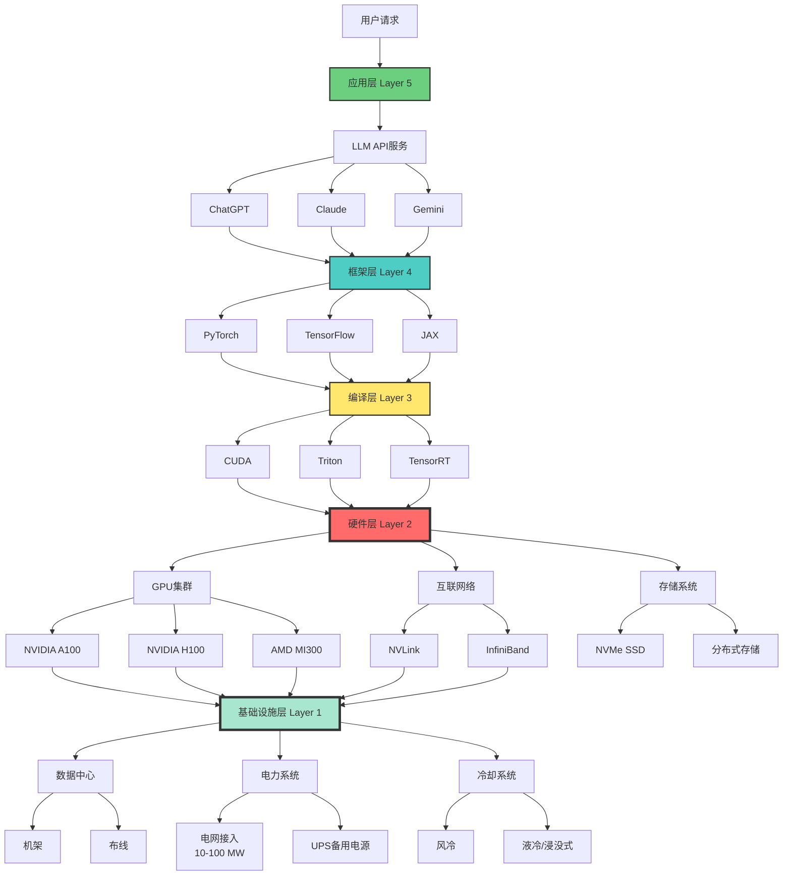

# AI算力基础设施：新时代的重工业

> **文档版本**: v1.0.0
> **最后更新**: 2025-10-27
> **文档规模**: 772行 | AI算力基础设施的全景分析
> **阅读建议**: 本文系统介绍支撑AI运转的计算基础设施体系

---

## 1 核心概念深度分析

<details>
<summary><b>🏗️⚡ 点击展开：AI算力基础设施全栈深度解析</b></summary>

本节深入剖析支撑AI运转的五层架构、三大硬件平台、四大技术挑战、成本结构和可持续性问题。

### 1 ️⃣ AI算力基础设施概念定义卡

**概念名称**: AI算力基础设施（AI Computing Infrastructure）

**内涵（本质属性）**:

**🔹 核心定义**:
支撑AI模型训练和推理的完整硬件、软件、网络、电力、冷却系统，是AI时代的"重工业"。

$$
\text{AI基础设施} = \text{硬件} + \text{软件} + \text{网络} + \text{能源} + \text{冷却}
$$

**🔹 五层架构**:

| 层次 | 组件 | 功能 | 典型技术 | 重要性 |
|------|------|------|---------|--------|
| **5. 应用层** | LLM服务、API | 对外服务 | ChatGPT、Claude API | ⭐⭐⭐ |
| **4. 框架层** | 深度学习框架 | 模型开发 | PyTorch、TensorFlow、JAX | ⭐⭐⭐⭐ |
| **3. 编译层** | 编译器、运行时 | 代码优化 | CUDA、Triton、TensorRT | ⭐⭐⭐⭐ |
| **2. 硬件层** | GPU/TPU/ASIC | 计算执行 | A100、H100、TPU v5 | ⭐⭐⭐⭐⭐ |
| **1. 基础设施层** | 数据中心、电力 | 物理支撑 | 机房、冷却、供电 | ⭐⭐⭐⭐⭐ |

**外延（范围边界）**:

| 维度 | 包含 ✅ | 不包含 ❌ |
|------|---------|----------|
| **硬件** | GPU、TPU、网络、存储 | 个人电脑、手机芯片 |
| **规模** | 集群级（100+卡） | 单卡、小规模 |
| **用途** | 训练+推理 | 纯推理（边缘设备） |
| **投资** | 百万-十亿美元级 | 千-万美元级 |

**属性维度表**:

| 维度 | 值/描述 | 说明 |
|------|---------|------|
| **典型规模** | 1K-10K GPU | 超大规模集群 |
| **建设成本** | $100M-$10B | 资本密集 |
| **电力消耗** | 10-100 MW | 相当于小城市 |
| **关键瓶颈** | 散热、电力、网络、可靠性 | 四大挑战 |
| **更新周期** | 2-3年 | 快速折旧 |
| **竞争格局** | NVIDIA主导（80%+） | 寡头垄断 |

---

### 2 ️⃣ AI基础设施五层架构全景图



---

### 3 ️⃣ 三大硬件平台详细对比

| 维度 | NVIDIA GPU | Google TPU | 新兴ASIC（Cerebras等） |
|------|-----------|------------|---------------------|
| **典型型号** | H100, A100 | TPU v5 | Wafer-Scale Engine |
| **算力（FP16）** | 989 TFLOPS（H100） | 275 TFLOPS/芯片 | 1 PFLOPS（单片） |
| **内存** | 80GB HBM3 | 128GB HBM | 40GB on-chip |
| **互联** | NVLink 900GB/s | ICI 4.8Tbps | 220Pbps片上 |
| **价格** | $30K-40K | 不单卖（云服务） | $2M+（整机） |
| **生态** | ✅✅✅ 成熟 | ⚠️ Google专属 | ❌ 初创 |
| **通用性** | ✅✅✅ 高 | ⚠️⚠️ 中（AI专用） | ⚠️ 低（训练专用） |
| **市场份额** | 80%+ | ~10% | <5% |
| **优势** | 生态、灵活性 | 性价比、集成 | 极致性能 |
| **劣势** | 昂贵、供货紧张 | 锁定Google | 不成熟、风险高 |

**关键洞察**:

- **NVIDIA垄断**: GPU市场80%+份额，CUDA护城河极深
- **TPU封闭生态**: 仅限Google云，但性价比优
- **ASIC挑战者**: 理论性能强，但生态不成熟

---

### 4 ️⃣ 超大规模AI数据中心规模与成本

**典型配置（GPT-4级别训练集群）**:

| 项目 | 规模/数量 | 成本 | 说明 |
|------|---------|------|------|
| **GPU数量** | 10,000-25,000张 A100/H100 | $300M-$1B | 核心算力 |
| **互联网络** | InfiniBand + NVLink | $50M-$100M | 高速互联 |
| **存储** | 10-100 PB | $10M-$50M | 训练数据+模型 |
| **服务器** | 2,000-5,000台 | $100M-$300M | 承载GPU |
| **机房建设** | 5,000-10,000 m² | $50M-$200M | 物理空间 |
| **电力系统** | 50-100 MW | $50M-$150M | 变电站、UPS |
| **冷却系统** | 液冷/风冷 | $20M-$80M | 散热 |
| **网络接入** | 1-10 Tbps | $10M-$30M | 对外连接 |
| **总建设成本** | - | **$600M-$2B** | 一次性投入 |

**年运营成本**:

| 项目 | 年成本 | 占比 | 说明 |
|------|--------|------|------|
| **电费** | $50M-$150M | 50-60% | 100MW × $0.10/kWh |
| **人工** | $10M-$30M | 10-15% | 运维团队 |
| **维护** | $20M-$50M | 20-25% | 硬件更换 |
| **网络** | $5M-$15M | 5-10% | 带宽费用 |
| **其他** | $5M-$15M | 5-10% | 杂费 |
| **总运营成本** | **$90M-$260M** | 100% | 每年 |

**成本分析**:

$$
\begin{align}
\text{总拥有成本（3年）} &= \text{建设成本} + 3 \times \text{年运营成本} \\
&\approx \$600M + 3 \times \$150M \\
&= \$1.05B
\end{align}
$$

---

### 5 ️⃣ 四大技术挑战深度分析

| 挑战 | 问题表现 | 根本原因 | 影响 | 解决方案 | 突破难度 |
|------|---------|---------|------|---------|---------|
| **1. 散热** | GPU温度>85°C | 功率密度700W/卡 | 性能降低、故障 | 液冷、浸没式 | ⚠️⚠️⚠️⚠️ |
| **2. 电力** | 需100MW+ | 万卡集群 | 电网容量不足 | 专用变电站 | ⚠️⚠️⚠️⚠️⚠️ |
| **3. 网络** | GPU间通信瓶颈 | 训练需同步 | 扩展性受限 | InfiniBand、NVLink | ⚠️⚠️⚠️ |
| **4. 可靠性** | 单点故障 | 组件众多 | 训练中断 | 检查点、冗余 | ⚠️⚠️⚠️⚠️ |

**挑战详解**:

```yaml
挑战1: 散热（物理极限）
  问题:
    - H100单卡700W，10K卡=7MW热量
    - 传统风冷不足
  影响:
    - 温度过高→性能下降30%+
    - 加速硬件老化
  方案:
    - 液冷: 降温效果2-3倍
    - 浸没式冷却: 最高效但成本高
  成本: 增加20-30%基础设施投入

挑战2: 电力（资源瓶颈）
  问题:
    - 100MW = 10万居民用电
    - 多数地区电网不支持
  影响:
    - 地点选择受限（水电站附近）
    - 电费占运营成本50%+
  方案:
    - 接入高压电网
    - 自建发电站（部分公司）
  限制: 城市地区无法建设

挑战3: 网络（扩展瓶颈）
  问题:
    - 分布式训练需要all-reduce同步
    - 网络延迟>计算时间
  影响:
    - 扩展效率: 1K卡90% → 10K卡70%
  方案:
    - InfiniBand: 400Gbps
    - NVLink: 900GB/s（GPU直连）
  成本: 网络占总成本10-15%

挑战4: 可靠性（概率问题）
  问题:
    - 10K GPU，MTBF=3年
    - 平均每天10次故障
  影响:
    - 训练中断，重启损失数小时
  方案:
    - 频繁检查点（每1-2小时）
    - 冗余设计
  代价: 训练时间增加5-10%
```

---

### 6 ️⃣ 云服务 vs 自建基础设施对比

| 维度 | 云服务（AWS/Azure/GCP） | 自建数据中心 |
|------|----------------------|------------|
| **初始投资** | ✅ 零（按需付费） | ❌ $600M-$2B |
| **灵活性** | ✅✅ 高（随时扩缩容） | ⚠️ 固定容量 |
| **单位成本** | ❌ 高（2-5×自建） | ✅ 低（规模化） |
| **控制权** | ⚠️ 受限 | ✅✅ 完全控制 |
| **定制化** | ⚠️ 有限 | ✅✅ 完全定制 |
| **维护** | ✅ 无需自己维护 | ❌ 需专业团队 |
| **可用性** | ⚠️ 资源竞争 | ✅ 独占 |
| **适合场景** | 小规模、实验 | 超大规模、长期 |

**决策阈值**:

$$
\begin{align}
\text{云成本} &= \text{使用时间} \times \text{单位价格} \\
\text{自建成本} &= \text{建设成本} + \text{运营成本} \\
\text{临界点} &\approx 2\text{-}3\text{年持续使用}
\end{align}
$$

**结论**:

- **小公司/初创**: 云服务（灵活性、低门槛）
- **大厂（OpenAI/Meta/Google）**: 自建（成本优势、控制权）

---

### 7 ️⃣ 能源消耗与可持续性分析

| 项目 | GPT-3训练 | ChatGPT推理（日） | 数据中心（年） |
|------|---------|----------------|--------------|
| **电力消耗** | ~1,300 MWh | ~500 MWh | 350,000-900,000 MWh |
| **碳排放** | ~550 吨CO₂ | ~200 吨CO₂ | 150,000-400,000 吨CO₂ |
| **等效** | 120辆车/年 | 40辆车/年 | 30,000户家庭/年 |

**可持续性挑战**:

```yaml
能耗爆炸:
  现状（2024）:
    - AI数据中心: 全球1-2%电力
  预测（2030）:
    - 可能增至5-8%
  问题: 与碳中和目标冲突

碳排放:
  问题:
    - 训练GPT-4: ~5,000吨CO₂
    - = 250万英里开车排放
  对策:
    - 使用可再生能源（水电、风电、太阳能）
    - 提高能效（更高效算法）

绿色AI方向:
  算法优化:
    - 稀疏模型（MoE）
    - 蒸馏、量化、剪枝
    - 效果: 10-100×能效提升

  硬件优化:
    - 低功耗芯片
    - 光子计算
    - 效果: 2-10×能效

  可再生能源:
    - 数据中心选址（冰岛、挪威）
    - 水电、风电、太阳能
    - 效果: 碳排放降低80%+
```

---

### 1.8 🔟 核心洞察与终极评估

**五大核心定律**:

1. **重工业定律**
   $$
   \text{AI时代} = \text{算力基础设施} \approx \text{工业革命的钢铁}
   $$
   - AI基础设施是新时代的"重工业"
   - 资本密集、规模经济

2. **寡头垄断定律**
   - NVIDIA GPU市场80%+份额
   - 高壁垒：硬件+软件（CUDA生态）

3. **成本结构定律**
   $$
   \text{建设成本} : \text{运营成本（3年）} \approx 1 : 1
   $$
   - 电费占运营成本50%+
   - 快速折旧（2-3年）

4. **四大瓶颈定律**
   - 散热 = 物理极限
   - 电力 = 资源瓶颈
   - 网络 = 扩展瓶颈
   - 可靠性 = 概率问题

5. **可持续性危机定律**
   $$
   \text{AI能耗增长} \gg \text{能效提升}
   $$
   - 与碳中和目标冲突
   - 绿色AI迫在眉睫

**终极洞察**:

> **"AI算力基础设施已成为新时代的重工业，其规模、成本和能耗达到了前所未有的水平。十亿美元级的投资、100兆瓦的电力、液冷系统——这些数字揭示了AI不再是'软件'，而是需要庞大物理基础设施支撑的'制造业'。NVIDIA的寡头垄断、电力与散热的四大挑战、以及每年数亿吨的碳排放，定义了AI发展的物理边界。未来的竞争不仅是算法之争，更是基础设施之战——谁拥有更高效、更绿色、更大规模的算力基础设施，谁就掌握AI时代的主动权。"**

**元认知**:

- **范式转变**: 从软件到重工业
- **资本壁垒**: $600M-$2B建设成本
- **NVIDIA护城河**: GPU+CUDA生态垄断
- **物理限制**: 散热、电力、网络、可靠性
- **可持续性**: AI能耗与碳中和冲突
- **未来方向**: 绿色AI、新硬件范式

</details>

---

## 📋 目录

- [AI算力基础设施：新时代的重工业](#ai算力基础设施新时代的重工业)
  - [1 核心概念深度分析](#1-核心概念深度分析)
    - [1 ️⃣ AI算力基础设施概念定义卡](#1-ai算力基础设施概念定义卡)
    - [2 ️⃣ AI基础设施五层架构全景图](#2-ai基础设施五层架构全景图)
    - [3 ️⃣ 三大硬件平台详细对比](#3-三大硬件平台详细对比)
    - [4 ️⃣ 超大规模AI数据中心规模与成本](#4-超大规模ai数据中心规模与成本)
    - [5 ️⃣ 四大技术挑战深度分析](#5-四大技术挑战深度分析)
    - [6 ️⃣ 云服务 vs 自建基础设施对比](#6-云服务-vs-自建基础设施对比)
    - [7 ️⃣ 能源消耗与可持续性分析](#7-能源消耗与可持续性分析)
    - [1.8 🔟 核心洞察与终极评估](#18-核心洞察与终极评估)
  - [2 引言](#2-引言)
  - [3 一、基础设施的层次架构](#3-一基础设施的层次架构)
  - [一、基础设施的层次架构](#一基础设施的层次架构)
    - [1.1 五层架构](#11-五层架构)
    - [1.2 核心组件](#12-核心组件)
  - [4 二、算力硬件](#4-二算力硬件)
    - [2.1 GPU：AI工厂的核心设备](#21-gpuai工厂的核心设备)
    - [2.2 TPU：Google的专用方案](#22-tpugoogle的专用方案)
    - [2.3 新兴AI芯片](#23-新兴ai芯片)
    - [2.4 互联网络](#24-互联网络)
  - [5 三、数据中心规模与成本](#5-三数据中心规模与成本)
    - [3.1 超大规模AI数据中心](#31-超大规模ai数据中心)
    - [3.2 建设成本](#32-建设成本)
    - [3.3 运营成本](#33-运营成本)
  - [6 四、技术挑战](#6-四技术挑战)
    - [4.1 散热挑战](#41-散热挑战)
    - [4.2 电力供应](#42-电力供应)
    - [4.3 网络带宽](#43-网络带宽)
    - [4.4 可靠性](#44-可靠性)
  - [7 五、软件栈](#7-五软件栈)
    - [5.1 训练框架](#51-训练框架)
    - [5.2 分布式训练](#52-分布式训练)
    - [5.3 推理服务](#53-推理服务)
  - [8 六、经济学分析](#8-六经济学分析)
    - [6.1 资本密集型](#61-资本密集型)
    - [6.2 规模经济](#62-规模经济)
    - [6.3 折旧与更新](#63-折旧与更新)
    - [6.4 云 vs 自建](#64-云-vs-自建)
  - [9 七、可持续性挑战](#9-七可持续性挑战)
    - [7.1 能源消耗](#71-能源消耗)
    - [7.2 碳排放](#72-碳排放)
    - [7.3 绿色AI](#73-绿色ai)
  - [10 八、未来演进](#10-八未来演进)
    - [8.1 硬件演进](#81-硬件演进)
    - [8.2 架构演进](#82-架构演进)
    - [8.3 能源与可持续性](#83-能源与可持续性)
  - [11 九、结论](#11-九结论)
    - [1 核心要点](#1-核心要点)
    - [11.2 最终评估](#112-最终评估)
    - [11.3 哲学反思](#113-哲学反思)
  - [12 十、参考文献](#12-十参考文献)
    - [1 硬件](#1-硬件)
    - [12.2 数据中心](#122-数据中心)
    - [12.4 分布式训练](#124-分布式训练)
    - [12.5 本章节](#125-本章节)
  - [导航 | Navigation](#导航--navigation)
  - [相关主题 | Related Topics](#相关主题--related-topics)
    - [12.6 相关章节](#126-相关章节)
    - [12.7 跨视角链接](#127-跨视角链接)
    - [12.7 跨视角链接](#127-跨视角链接)

---

## 2 引言

AI工厂需要庞大的基础设施支撑。GPU集群、数据中心、网络、存储、冷却——这些构成了AI时代的"重工业"。本文档系统分析AI算力基础设施的架构、规模、成本和演进。

**核心问题**：

1. AI基础设施包含哪些组件？
2. 规模和成本如何？
3. 技术挑战是什么？
4. 未来如何演进？

---

## 3 一、基础设施的层次架构

### 1.1 五层架构

**从底到顶**：

```text
5. 应用层：LLM服务、API
   ↑
4. 框架层：PyTorch、TensorFlow、JAX
   ↑
3. 编译层：CUDA、Triton、TensorRT
   ↑
2. 硬件层：GPU、TPU、网络、存储
   ↑
1. 基础设施层：数据中心、电力、冷却
```

### 1.2 核心组件

**计算**：

- GPU/TPU集群
- 互联网络
- 负载均衡

**存储**：

- 训练数据（PB级）
- 模型参数（TB级）
- 中间结果

**网络**：

- 内部高速互联（InfiniBand, NVLink）
- 外部网络接入

**电力与冷却**：

- 兆瓦级电力供应
- 水冷/液冷系统

---

## 4 二、算力硬件

### 2.1 GPU：AI工厂的核心设备

**NVIDIA GPU演进**：

| 代数 | 代表产品 | FP16 TFLOPs | 内存 | 年份 |
|------|---------|-------------|------|------|
| Pascal | P100 | 21 | 16GB HBM2 | 2016 |
| Volta | V100 | 125 | 32GB HBM2 | 2017 |
| Turing | T4 | 65 | 16GB GDDR6 | 2018 |
| Ampere | A100 | 312 | 80GB HBM2e | 2020 |
| Hopper | H100 | 1000 | 80GB HBM3 | 2022 |
| Blackwell | B100/GB200 | ~2000 | 192GB HBM3e | 2024 |

**趋势**：

- 算力：指数增长（每2年~3倍）
- 内存：线性增长
- 能效：持续提升

**成本**：

- A100（80GB）：~$15,000
- H100（80GB）：~$30,000-40,000
- GB200 NVL72：~$3M（整柜）

### 2.2 TPU：Google的专用方案

**TPU演进**：

| 版本 | 性能（BF16） | 内存 | 年份 |
|------|-------------|------|------|
| TPU v2 | 45 TFLOPs | 8GB HBM | 2017 |
| TPU v3 | 123 TFLOPs | 16GB HBM | 2018 |
| TPU v4 | 275 TFLOPs | 32GB HBM2 | 2021 |
| TPU v5e | ~200 TFLOPs | - | 2023 |
| TPU v5p | ~459 TFLOPs | 95GB HBM2e | 2023 |

**特点**：

- 针对矩阵乘法优化
- 高带宽内存
- TensorFlow优化

### 2.3 新兴AI芯片

**Cerebras CS-3**：

- 晶圆级芯片（WSE-3）
- 4万亿晶体管
- 900,000个AI核心
- 44GB片上SRAM
- 适合超大模型训练

**Groq LPU**：

- 确定性执行
- 极低延迟推理
- 750 tokens/sec/user
- 适合实时推理

**Graphcore IPU**：

- 大规模并行
- MIMD架构
- 适合图计算

### 2.4 互联网络

**GPU间互联**：

**NVLink**：

- 点对点高速互联
- H100: 900GB/s (18×50GB/s)
- 同服务器内GPU通信

**NVSwitch**：

- 全连接交换
- 无阻塞
- 支持多GPU pod

**InfiniBand**：

- 跨服务器互联
- 400Gb/s (HDR), 800Gb/s (NDR)
- RDMA（远程直接内存访问）

**以太网**：

- 标准网络
- 100Gb/s, 400Gb/s
- 成本较低

**网络拓扑**：

- **Fat-tree**：三层交换
- **Dragonfly**：多维度
- **RoCE**：RDMA over Converged Ethernet

---

## 5 三、数据中心规模与成本

### 3.1 超大规模AI数据中心

**Meta的AI研究超级集群（RSC）**：

- 16,000+ A100 GPUs
- 能力：~5 exaFLOPs（FP16）
- 目标：训练最大模型

**Microsoft & OpenAI**：

- 数万个GPU
- 专用于GPT-4、GPT-5训练
- 投资：数十亿美元

**xAI Colossus**（Elon Musk, 2024）：

- 100,000 H100 GPUs
- 号称最大AI训练集群
- Memphis, TN

### 3.2 建设成本

**单GPU服务器**：

- 8× A100 (80GB)：~$120K（GPU）+ $30K（服务器）= $150K
- 8× H100 (80GB)：~$320K（GPU）+ $50K（服务器）= $370K

**1000 GPU集群**：

- 125台服务器（8×GPU）
- GPU：$15M-$40M
- 服务器、网络：$10M-$20M
- 数据中心改造：$5M-$10M
- 总计：$30M-$70M

**10,000 GPU集群**：

- 1,250台服务器
- GPU：$150M-$400M
- 基础设施：$100M-$200M
- 总计：$250M-$600M

**100,000 GPU集群**：

- 估算：$2.5B-$6B

### 3.3 运营成本

**电力消耗**：

- A100：400W（TDP）
- H100：700W
- 1000×H100集群：700KW × 1.5（PUE）= 1MW

**电费**（假设$0.10/kWh）：

- 1MW × 24h × 365d = 8.76 GWh/年
- 年电费：~$876K

**10,000 GPU**：

- 功耗：10MW
- 年电费：~$8.76M

**冷却**：

- PUE（Power Usage Effectiveness）：1.1-1.5
- 传统空调：PUE ~1.5
- 水冷/液冷：PUE ~1.1-1.2

**人力**：

- 运维工程师
- 系统管理员
- 网络工程师
- 总计：数十到数百人

**总运营成本**（10,000 GPU）：

- 电力：$8.76M
- 冷却：$1-2M
- 人力：$5-10M
- 维护、折旧：$10-20M
- 总计：$25-40M/年

---

## 6 四、技术挑战

### 4.1 散热挑战

**问题**：

- GPU密度高
- 热密度大（700W/GPU）
- 传统风冷不足

**解决方案**：

**1. 水冷**：

- 冷板（Cold Plate）
- 直接接触GPU
- 高效导热

**2. 浸没式液冷**：

- GPU浸泡在导热液体
- 极高效率
- Microsoft Project Natick：水下数据中心

**3. 双相浸没冷却**：

- 液体沸腾带走热量
- 最高效率
- GRC, 3M等方案

### 4.2 电力供应

**挑战**：

- 百MW级需求
- 稳定性要求高
- 成本敏感

**解决**：

**1. 选址**：

- 靠近电力充足地区
- 水电、核电优先（稳定、便宜）

**2. 自建电力**：

- 天然气发电
- 太阳能（辅助）

**3. 能源管理**：

- 负载均衡
- 峰谷调配
- UPS后备

### 4.3 网络带宽

**挑战**：

- 模型并行需要高带宽
- 延迟敏感

**需求**：

- 训练：TB/s级聚合带宽
- 推理：GB/s级（单请求）

**解决**：

- InfiniBand/RoCE
- NVLink/NVSwitch
- 低延迟交换机

### 4.4 可靠性

**挑战**：

- 大规模集群，故障常态
- 训练长达数周
- 中断代价巨大

**策略**：

**1. 检查点（Checkpointing）**：

- 定期保存训练状态
- 故障后恢复

**2. 冗余**：

- 备用硬件
- RAID存储

**3. 故障隔离**：

- 自动检测
- 隔离故障节点
- 继续训练

**4. 监控**：

- 实时监控硬件状态
- 预测性维护

---

## 7 五、软件栈

### 5.1 训练框架

**PyTorch**：

- Facebook/Meta
- 灵活、动态计算图
- 研究友好

**TensorFlow**：

- Google
- 生产部署强
- TPU优化

**JAX**：

- Google
- 函数式
- 高性能

### 5.2 分布式训练

**数据并行（Data Parallelism）**：

- 复制模型到多GPU
- 分割数据批次
- 聚合梯度

**模型并行（Model Parallelism）**：

- 分割模型到多GPU
- 每GPU持有部分参数
- Pipeline或Tensor并行

**混合并行**：

- 数据并行 + 模型并行
- 例：Megatron-LM

**ZeRO（Zero Redundancy Optimizer）**：

- DeepSpeed
- 优化内存使用
- 分割优化器状态、梯度、参数

### 5.3 推理服务

**TensorRT**（NVIDIA）：

- 推理优化
- 低精度、融合算子

**Triton Inference Server**：

- 多框架支持
- 动态批处理
- GPU调度

**vLLM**：

- 大模型推理优化
- PagedAttention
- 连续批处理

**TGI（Text Generation Inference）**（Hugging Face）：

- 专注文本生成
- 高吞吐、低延迟

---

## 8 六、经济学分析

### 6.1 资本密集型

**类比钢铁厂、芯片厂**：

- 巨额初始投资
- 长建设周期
- 高运营成本
- 规模经济

**进入壁垒**：

- 资本：数亿到数十亿美元
- 技术：复杂系统
- 人才：稀缺专业人才
- 能源：稳定大规模供应

### 6.2 规模经济

**规模越大，单位成本越低**：

| 规模 | GPU单价 | 批量折扣 | 运营效率 | 摊销 |
|------|--------|---------|---------|------|
| 小（100）| 定价 | 无 | 低 | 高单位成本 |
| 中（1K）| 定价 | 小 | 中 | 中单位成本 |
| 大（10K+）| 低 | 显著 | 高 | 低单位成本 |

**寡头垄断趋势**：

- 只有少数公司能建大规模集群
- OpenAI, Google, Meta, Microsoft, Anthropic, xAI

### 6.3 折旧与更新

**硬件生命周期**：

- GPU：3-5年
- 服务器：5-7年
- 网络：7-10年

**折旧**：

- 加速折旧（3年）
- 年折旧：初始投资的33%

**更新压力**：

- 新GPU性能2-3倍提升
- 旧硬件竞争力下降
- 持续投资需求

### 6.4 云 vs 自建

**云服务（AWS, GCP, Azure）**：

- 优点：
  - 无初始投资
  - 灵活扩展
  - 按需付费
- 缺点：
  - 长期成本高
  - 可用性受限（热门GPU）
  - 数据隐私

**自建**：

- 优点：
  - 长期成本低（大规模）
  - 完全控制
  - 定制优化
- 缺点：
  - 巨额初始投资
  - 运营复杂
  - 技术风险

**权衡**：

- 小公司、研究：云
- 大公司、长期：自建或混合

---

## 9 七、可持续性挑战

### 7.1 能源消耗

**估算**：

- 全球AI训练：数十万GPU
- 年耗电：数GWh-TWh
- 增长迅速

**对比**：

- GPT-3训练：1287 MWh
- 一个小城市年用电：~100 GWh
- 大规模AI可比中等城市

### 7.2 碳排放

**碳足迹**：

- 取决于电力来源
- 煤电：高碳
- 水电、核电、太阳能：低碳

**GPT-3训练**：

- 552吨CO₂（美国电网平均）
- 等于：125辆车一年排放

**趋势**：

- 模型越来越大 → 能耗越来越高
- 可持续性压力

### 7.3 绿色AI

**策略**：

**1. 选址**：

- 清洁能源丰富地区
- 水电（冰岛、挪威、西北太平洋）
- 太阳能（沙漠）

**2. 能效优化**：

- 高效硬件
- 算法优化
- 负载优化

**3. 碳抵消**：

- 购买碳信用
- 投资可再生能源

**4. 研究方向**：

- 更高效模型（如MoE）
- 更少数据训练
- 知识蒸馏、迁移学习

---

## 10 八、未来演进

### 8.1 硬件演进

**短期（1-3年）**：

- Blackwell, 下一代GPU
- 性能持续翻倍
- HBM3e高带宽内存

**中期（3-7年）**：

- 光互联（Optical Interconnect）
- 3D堆叠芯片
- 神经形态芯片普及

**长期（7+年）**：

- 量子计算集成
- 生物计算芯片
- 室温超导（如果实现）

### 8.2 架构演进

**边缘 + 云**：

- 边缘设备推理（手机、IoT）
- 云端训练和大模型
- 混合架构

**分布式训练**：

- 跨数据中心训练
- 联邦学习
- 去中心化AI

**专用架构**：

- 领域特定AI芯片
- 软硬件协同设计

### 8.3 能源与可持续性

**核电复兴**：

- AI推动核电需求
- 小型模块化反应堆（SMR）
- Microsoft: 重启Three Mile Island

**可再生能源**：

- 风能、太阳能
- 储能技术（电池、抽水蓄能）

**效率突破**：

- 算法10倍效率提升
- 硬件10倍能效提升
- 总计100倍改进

---

## 11 九、结论

### 1 核心要点

1. **AI基础设施是重工业**：
   - 资本密集、技术复杂
   - 数十亿美元投资
   - 兆瓦级电力消耗

2. **五层架构**：
   - 硬件（GPU/TPU）
   - 互联网络
   - 软件栈（框架、编译）
   - 应用层

3. **关键组件**：
   - GPU：核心算力（H100, A100）
   - 网络：InfiniBand, NVLink
   - 冷却：液冷、浸没冷却
   - 电力：稳定大规模供应

4. **经济特性**：
   - 规模经济显著
   - 寡头垄断趋势
   - 持续资本需求（硬件更新）

5. **可持续性挑战**：
   - 能源消耗巨大
   - 碳排放压力
   - 需要绿色能源+效率提升

6. **未来演进**：
   - 硬件：持续指数增长
   - 能源：核电+可再生能源
   - 架构：边缘+云混合

### 11.2 最终评估

> **AI算力基础设施是21世纪的"重工业"。它需要巨额资本、先进技术、稳定能源，构成了数字经济的物质基础。**
>
> **理解AI基础设施，有助于认识AI的真实成本、规模要求和发展瓶颈。AI不是虚无缥缈的"智能"，而是扎根于钢铁、硅片、电力和冷却水的物理系统。**

### 11.3 哲学反思

> **AI时代的"基础设施"揭示了技术与物质的深刻联系。数字看似轻盈，实则沉重。每个Token的背后是真实的物理过程：电子在硅片中流动，热量被水带走，能源转化为信息。**
>
> **这提醒我们：技术进步不仅是算法创新，更是物质世界的重构。AI的未来，取决于我们能否可持续地提供其所需的能源、硬件和基础设施。**

---

## 12 十、参考文献

### 1 硬件

1. [NVIDIA Data Center GPUs](https://www.nvidia.com/en-us/data-center/)
2. [Google TPU](https://cloud.google.com/tpu)
3. [Cerebras Systems](https://www.cerebras.net/)

### 12.2 数据中心

1. [Meta's AI Research SuperCluster](https://ai.facebook.com/blog/ai-rsc/)
2. [Microsoft & OpenAI Supercomputer](https://news.microsoft.com/source/features/ai/openai-azure-supercomputer/)

### 12.3 能源与可持续性

1. [Patterson et al., 2021](https://arxiv.org/abs/2104.10350) - Carbon Emissions and Large Neural Network Training
2. [Strubell et al., 2019](https://arxiv.org/abs/1906.02243) - Energy and Policy Considerations for Deep Learning

### 12.4 分布式训练

1. [Shoeybi et al., 2019](https://arxiv.org/abs/1909.08053) - Megatron-LM
2. [Rajbhandari et al., 2020](https://arxiv.org/abs/1910.02054) - ZeRO: Memory Optimizations Toward Training Trillion Parameter Models

---

## 导航 | Navigation

**上一篇**: [← 09.2 语义生产线](./09.2_Semantic_Production_Line.md)
**下一篇**: [09.4 算力作为资源 →](./09.4_Computing_Power_as_Resource.md)
**返回目录**: [↑ AI模型视角总览](../README.md)

---

## 相关主题 | Related Topics

### 12.5 本章节

- [09.1 Token作为产品](./09.1_Token_as_Product.md)
- [09.2 语义生产线](./09.2_Semantic_Production_Line.md)
- [09.4 算力作为资源](./09.4_Computing_Power_as_Resource.md)
- [09.5 数据中心AI工厂](./09.5_Data_Center_AI_Factory.md)

### 12.6 相关章节

- [02.4 Transformer架构](../02_Neural_Network_Theory/02.4_Transformer_Architecture.md)
- [08.3 资源受限计算](../08_Comparison_Analysis/08.3_Resource_Bounded_Computation.md)

### 12.7 跨视角链接

- [Software_Perspective: 平台工程定义](../../Software_Perspective/08_Platform_Engineering/08.1_Platform_Engineering_Definition.md)

---

**最后更新**：2025-10-25

**状态**：✅ 完成

**质量**：工程实践与产业洞察结合
