# 算力作为资源：新时代的石油

> **文档版本**: v1.0.0  
> **最后更新**: 2025-10-27  
> **文档规模**: 830行 | 算力资源的战略意义  
> **阅读建议**: 本文从资源经济学角度分析算力的战略价值和竞争格局

---

## 核心概念深度分析

<details>
<summary><b>⚡🛢️ 点击展开：算力作为战略资源的深度经济学分析</b></summary>

本节深入剖析算力作为新时代石油的本质、度量、供需、市场、地缘政治和战略意义。

### 1️⃣ 算力作为资源概念定义卡

**概念名称**: 算力作为资源（Computing Power as Resource）

**内涵（本质属性）**:

**🔹 核心定义**:
单位时间内可执行的计算操作数量，是AI时代的核心战略资源，类比工业时代的石油。

$$
\text{算力} = \frac{\text{计算操作数}}{\text{时间}} \quad (\text{FLOPS})
$$

**🔹 算力 vs 传统资源对比**:

| 维度 | 石油（工业时代） | 算力（AI时代） | 相似性 | 差异性 |
|------|----------------|--------------|--------|--------|
| **稀缺性** | ✅ 有限储量 | ✅ 生产受限（芯片） | 都稀缺 | 算力可持续生产 |
| **可再生** | ❌ 不可再生 | ✅ 可持续投资 | 关键差异 | 算力更可持续 |
| **存储性** | ✅ 可储存 | ❌ 即时消耗 | 关键差异 | 算力无库存 |
| **运输** | ⚠️ 物流成本高 | ✅ 网络传输 | 不同 | 算力传输快 |
| **地理分布** | ⚠️ 不均匀（中东） | ⚠️ 不均匀（美国、中国） | 都不均 | 相似 |
| **垄断性** | ⚠️⚠️ OPEC | ⚠️⚠️⚠️ NVIDIA 80%+ | 都寡头 | 算力更垄断 |
| **战略意义** | ⚠️⚠️⚠️⚠️⚠️ | ⚠️⚠️⚠️⚠️⚠️ | 都极高 | 相似 |
| **价格波动** | ✅ 期货交易 | ⚠️ 云定价 | 不同 | 算力市场初级 |

**外延（范围边界）**:

| 维度 | 包含 ✅ | 不包含 ❌ |
|------|---------|----------|
| **类型** | 训练算力、推理算力 | 个人电脑、手机算力 |
| **规模** | 集群级（100+ GPU） | 单卡、小规模 |
| **度量** | FLOPs、GPU-Hours、Tokens/s | 笼统的"性能" |
| **市场** | 云服务、专用数据中心 | 消费级硬件 |

**属性维度表**:

| 维度 | 值/描述 | 说明 |
|------|---------|------|
| **度量单位** | FLOPS、GPU-Hours | FP16/FP32性能 |
| **训练需求** | GPT-4: ~10²⁵ FLOPs | 指数增长 |
| **全球供给** | ~500 EFLOPs/s（估计） | 受芯片产能限制 |
| **价格** | A100云：$2-4/小时 | 按时计费 |
| **稀缺性** | ⚠️⚠️⚠️⚠️⚠️ 极高 | H100供不应求 |
| **垄断程度** | NVIDIA 80%+市场 | 寡头垄断 |
| **地缘政治** | 美国出口管制 | 战略资源 |

---

### 2️⃣ 算力供需全景图

```mermaid
graph TB
    Supply[算力供给]
    
    Supply --> Chip[芯片制造]
    Chip --> NVIDIA[NVIDIA<br/>80%+ 市场]
    Chip --> AMD[AMD<br/>10%]
    Chip --> Google[Google TPU<br/>内部]
    Chip --> Others[其他<br/>5%]
    
    NVIDIA --> H100[H100: 989 TFLOPS]
    NVIDIA --> A100[A100: 312 TFLOPS]
    
    Supply --> DC[数据中心部署]
    DC --> Cloud[云服务商]
    DC --> InHouse[自建]
    
    Cloud --> AWS[AWS]
    Cloud --> Azure[Azure]
    Cloud --> GCP[GCP]
    
    InHouse --> OpenAI[OpenAI]
    InHouse --> Meta[Meta]
    InHouse --> Google2[Google]
    
    Demand[算力需求]
    
    Demand --> Training[训练需求<br/>指数增长]
    Training --> T1[GPT-4: ~10²⁵ FLOPs]
    Training --> T2[未来模型: 10²⁶+ FLOPs]
    
    Demand --> Inference[推理需求<br/>持续使用]
    Inference --> I1[ChatGPT: 500 MWh/日]
    Inference --> I2[全球LLM推理]
    
    Bottleneck[瓶颈]
    
    Chip --> Bottleneck
    Bottleneck --> B1[芯片产能有限]
    Bottleneck --> B2[美国出口管制]
    Bottleneck --> B3[成本极高<br/>$30K-40K/卡]
    Bottleneck --> B4[电力受限<br/>100MW级需求]
    
    Market[算力市场]
    
    Supply --> Market
    Demand --> Market
    
    Market --> Price[定价机制]
    Price --> P1[云服务: $2-4/GPU-小时]
    Price --> P2[波动: 供不应求时10×]
    
    style Supply fill:#6bcf7f,stroke:#333,stroke-width:2px
    style Demand fill:#ff6b6b,stroke:#333,stroke-width:2px
    style Bottleneck fill:#ffd93d,stroke:#333,stroke-width:4px
    style Market fill:#4ecdc4,stroke:#333,stroke-width:2px
```



---

### 3️⃣ 训练算力 vs 推理算力详细对比

| 维度 | 训练算力 | 推理算力 | 比例 | 关键差异 |
|------|---------|---------|------|---------|
| **计算量** | GPT-3: ~3.14×10²³ FLOPs | ~280 GFLOPs/token | 1:10¹² | 训练极大 |
| **时间跨度** | 数周-数月 | 毫秒-秒 | - | 训练长期 |
| **并行度** | 10K GPU并行 | 单请求串行 | - | 训练高并行 |
| **硬件需求** | H100/A100必需 | V100/T4可用 | - | 训练要求高 |
| **成本** | $1M-$100M | $0.0001-$0.01/请求 | 1:10⁹ | 训练极贵 |
| **频率** | 一次性（或少量） | 持续、高频 | - | 推理持续 |
| **市场** | 内部或专用 | 云服务主流 | - | 不同市场 |
| **优化目标** | 吞吐量最大化 | 延迟最小化 | - | 目标不同 |

**关键洞察**:

```yaml
训练算力（资本支出CAPEX）:
  特点:
    - 一次性大额投资
    - 类似"勘探+建厂"
    - GPT-4训练: ~$10M-100M算力成本
  
  瓶颈:
    - 获取足够GPU（供应链）
    - 电力（100MW级）
    - 网络（InfiniBand）

推理算力（运营支出OPEX）:
  特点:
    - 持续、按需消耗
    - 类似"油井开采"
    - ChatGPT日推理: ~$500K
  
  挑战:
    - 自回归串行性
    - 延迟敏感
    - 成本控制

经济学启示:
  训练 = 研发投资（R&D）
  推理 = 生产运营（Production）
  关系: 训练一次，推理百万次
```

---

### 4️⃣ 全球算力分布与地缘政治

**全球算力分布（2024估计）**:

| 国家/地区 | AI算力占比 | 关键厂商/机构 | GPU数量（估计） | 战略地位 |
|---------|-----------|-------------|---------------|---------|
| **美国** | 50-60% | NVIDIA, OpenAI, Meta, Google, Amazon | 100K-200K H100/A100 | ⚠️⚠️⚠️⚠️⚠️ 主导 |
| **中国** | 15-20% | Huawei, Alibaba, Tencent, Baidu | 50K-100K | ⚠️⚠️⚠️⚠️ 追赶 |
| **欧盟** | 5-10% | CERN, EuroHPC | 10K-30K | ⚠️⚠️ 落后 |
| **其他** | 10-15% | 多国分散 | 20K-50K | ⚠️ 分散 |

**美国出口管制（2022-2024）**:

| 管制措施 | 目标 | 影响 | 中国应对 |
|---------|------|------|---------|
| **禁止H100/A100出口中国** | 限制中国AI发展 | ⚠️⚠️⚠️⚠️⚠️ 极大 | 华为昇腾、走私 |
| **限制算力上限** | 互联密度<600GB/s | 阻止大规模训练 | 分布式集群 |
| **芯片设计工具管制** | EDA软件 | 长期发展受限 | 自研替代 |

**算力军备竞赛**:

```yaml
美国策略:
  - 技术领先: NVIDIA、AMD垄断
  - 出口管制: 遏制对手
  - 盟友合作: 与欧盟、日本
  
中国策略:
  - 芯片自研: 华为昇腾910、海思
  - 替代方案: 国产GPU（寒武纪、壁仞）
  - 算法优化: 更高效训练
  
欧盟策略:
  - 依赖美国芯片
  - 监管主导（AI Act）
  - 主权算力（EuroHPC）

结论:
  算力 = 21世纪的战略资源
  控制算力 = 控制AI发展
  地缘政治竞争加剧
```

---

### 5️⃣ 算力市场与定价机制

**云算力定价（2024）**:

| 云服务商 | GPU型号 | 按需价格（$/小时） | 包月折扣 | 竞争策略 |
|---------|--------|-----------------|---------|---------|
| **AWS** | A100 80GB | $32.77 | 40% off | 高价、生态好 |
| **Azure** | A100 80GB | $27.20 | 35% off | 微软集成 |
| **GCP** | A100 80GB | $29.39 | 30% off | TPU替代 |
| **Lambda Labs** | A100 40GB | $1.10 | - | ✅ 低价、专注AI |
| **CoreWeave** | H100 | $4.76 | 20% off | 新兴、H100优势 |

**算力期货与金融化**:

```yaml
当前现状（2024）:
  - 无标准化期货市场
  - 云服务商按需定价
  - 价格波动大（供不应求时10×）

未来可能（2025+）:
  算力期货交易所:
    - 标准化合约（如"1 A100-小时"）
    - 远期锁定价格
    - 对冲风险
  
  算力衍生品:
    - 算力期权
    - 算力互换
    - 算力指数基金
  
  类比:
    算力期货 ≈ 原油期货（WTI、Brent）
    算力现货 ≈ 石油现货市场

启示:
  算力金融化是必然趋势
  算力将成为可交易的标准化商品
```

---

### 6️⃣ 算力效率与浪费分析

| 效率维度 | 理想值 | 实际值 | 浪费原因 | 优化方向 |
|---------|-------|--------|---------|---------|
| **GPU利用率** | 100% | 40-70% | 内存带宽、批大小 | Flash Attention、量化 |
| **训练效率** | 100% | 50-80% | 通信开销、负载不均 | Pipeline并行、ZeRO |
| **推理效率** | 100% | 30-60% | 自回归串行、KV cache | 投机采样、批处理 |
| **能源效率** | 理论极限 | 10-20% | 散热损失、空闲时间 | 液冷、调度优化 |

**算力浪费的三大来源**:

```yaml
1. 架构瓶颈（30-50%浪费）:
   - 自回归串行性: 无法并行
   - O(n²)注意力: 长文本killer
   - 内存带宽: GPU算力>内存速度
   
   解决: 架构创新（MoE、SSM、并行解码）

2. 系统低效（20-30%浪费）:
   - 负载不均: 部分GPU闲置
   - 通信开销: all-reduce同步慢
   - 检查点: 频繁保存
   
   解决: 调度优化、高速网络、增量检查点

3. 人为因素（10-20%浪费）:
   - 实验失败: 超参调优
   - 代码bug: 训练中断
   - 过度保守: 资源预留过多
   
   解决: AutoML、持续监控、弹性调度

总结:
  当前算力利用率: 40-70%
  浪费占比: 30-60%
  优化空间: 2-3×效率提升
```

---

### 🔟 核心洞察与终极评估

**五大核心定律**:

1. **战略资源定律**
   $$
   \text{算力} \approx \text{21世纪的石油}
   $$
   - 稀缺、战略、垄断、地缘政治
   - 控制算力=控制AI发展

2. **供不应求定律**
   $$
   \frac{d(\text{需求})}{dt} \gg \frac{d(\text{供给})}{dt}
   $$
   - 需求指数增长（模型Scaling）
   - 供给线性增长（芯片产能）
   - 缺口持续扩大

3. **训练/推理二元定律**
   - 训练=CAPEX（资本支出）、一次性、极贵
   - 推理=OPEX（运营支出）、持续、积少成多
   - 关系：训练一次，推理百万次

4. **地缘垄断定律**
   - 美国：NVIDIA 80%+垄断
   - 出口管制：算力武器化
   - 军备竞赛：算力主权之争

5. **效率悖论定律**
   $$
   \text{算力浪费} = 30\text{-}60\%
   $$
   - 架构瓶颈、系统低效、人为因素
   - 优化潜力巨大

**终极洞察**:

> **"算力已成为21世纪最关键的战略资源——新时代的石油。它的稀缺性（H100供不应求）、垄断性（NVIDIA 80%+）、地缘政治意义（美国出口管制）与石油如出一辙。但算力有三大独特性：1）不可存储（即时消耗）；2）网络传输（无物流成本）；3）可持续生产（非耗竭资源）。当前全球算力分布极度不均（美国50-60%），供需严重失衡（需求指数增长vs供给线性增长），且效率仅40-70%（30-60%浪费）。未来的AI竞争本质是算力之战——谁拥有更多、更高效的算力，谁就掌握AI时代的制高点。算力金融化（期货、衍生品）和算力主权之争（出口管制、自研芯片）将定义未来十年的全球格局。"**

**元认知**:
- **石油类比**: 高度相似——稀缺、战略、垄断
- **独特性**: 不可存储、网络传输、可持续
- **供需失衡**: 需求指数增长，供给受限
- **地缘政治**: 美国主导，中国追赶，欧盟落后
- **效率问题**: 30-60%浪费，优化空间巨大
- **未来趋势**: 金融化、主权化、竞争加剧

</details>

---

## 📋 目录

- [核心概念深度分析](#核心概念深度分析)
- [📋 目录](#-目录)
- [引言](#引言)
- [一、算力的本质](#一算力的本质)
  - [1.1 什么是算力？](#11-什么是算力)
  - [1.2 算力的类型](#12-算力的类型)
  - [1.3 算力与其他资源的类比](#13-算力与其他资源的类比)
- [二、算力的供给](#二算力的供给)
  - [2.1 算力的生产](#21-算力的生产)
  - [2.2 全球算力分布](#22-全球算力分布)
  - [2.3 算力的稀缺性](#23-算力的稀缺性)
- [三、算力的需求](#三算力的需求)
  - [3.1 训练需求](#31-训练需求)
  - [3.2 推理需求](#32-推理需求)
  - [3.3 需求增长](#33-需求增长)
- [四、算力的交易与定价](#四算力的交易与定价)
  - [4.1 算力市场](#41-算力市场)
  - [4.2 算力定价](#42-算力定价)
  - [4.3 算力期货与衍生品](#43-算力期货与衍生品)
- [五、算力的分配与调度](#五算力的分配与调度)
  - [5.1 优先级分配](#51-优先级分配)
  - [5.2 任务调度](#52-任务调度)
  - [5.3 负载均衡](#53-负载均衡)
- [六、算力的效率与浪费](#六算力的效率与浪费)
  - [6.1 利用率](#61-利用率)
  - [6.2 效率优化](#62-效率优化)
  - [6.3 浪费的来源](#63-浪费的来源)
- [七、算力的地缘政治](#七算力的地缘政治)
  - [7.1 算力主权](#71-算力主权)
  - [7.2 出口管制](#72-出口管制)
  - [7.3 算力军备竞赛](#73-算力军备竞赛)
- [八、算力的未来](#八算力的未来)
  - [8.1 需求预测](#81-需求预测)
  - [8.2 技术突破](#82-技术突破)
  - [8.3 算力民主化](#83-算力民主化)
- [九、结论](#九结论)
  - [核心要点](#核心要点)
  - [最终评估](#最终评估)
  - [哲学洞察](#哲学洞察)
- [十、参考文献](#十参考文献)
  - [算力度量与分析](#算力度量与分析)
  - [云算力市场](#云算力市场)
  - [地缘政治](#地缘政治)
  - [算力效率](#算力效率)
- [导航 | Navigation](#导航--navigation)
- [相关主题 | Related Topics](#相关主题--related-topics)
  - [本章节](#本章节)
  - [相关章节](#相关章节)
  - [跨视角链接](#跨视角链接)

---

## 引言

在AI时代，**算力（Computing Power）**成为核心战略资源，如同工业时代的石油、钢铁。本文档深入分析算力作为资源的特性、度量、分配、交易和地缘政治意义。

**核心问题**：

1. 算力作为资源有什么特性？
2. 如何度量和交易算力？
3. 算力的稀缺性和分配机制？
4. 算力的地缘政治意义？

---

## 一、算力的本质

### 1.1 什么是算力？

**定义**：
> 算力（Computing Power）是单位时间内可执行的计算操作数量。

**度量单位**：

1. **FLOPs（Floating Point Operations）**：
   - 单个浮点运算
   - 基本单位

2. **FLOPS（FLOPs per Second）**：
   - 每秒浮点运算次数
   - TFLOPs = 10¹² FLOPs/s
   - PFLOPs = 10¹⁵ FLOPs/s
   - EFLOPs = 10¹⁸ FLOPs/s

3. **GPU-Hours**：
   - 一个GPU运行一小时
   - 实用度量单位
   - 例：8×A100 运行24小时 = 192 A100-hours

**AI特定度量**：

- **Tokens/Second**：推理吞吐量
- **Training FLOPs**：训练总计算量
- **Inference FLOPs/Token**：每Token推理计算量

### 1.2 算力的类型

**训练算力 vs 推理算力**：

| 维度 | 训练 | 推理 |
|------|------|------|
| **计算量** | 巨大（PFLOPs-days） | 相对小（GFLOPs） |
| **时间跨度** | 长（天-周-月） | 短（ms-s） |
| **并行性** | 高度并行 | 单请求串行 |
| **硬件需求** | 高端GPU/TPU | 可用中低端 |
| **成本** | 数百万-数千万美元 | 数美分-美元 |
| **一次性** | 一次训练 | 持续使用 |

**通用算力 vs 专用算力**：

- **通用**：CPU, GPU（可用于多种任务）
- **专用**：TPU（TensorFlow优化），Groq LPU（推理），Cerebras（大模型训练）

### 1.3 算力与其他资源的类比

**石油**：

- 工业时代的能源
- 稀缺、地理不均
- 地缘政治核心

**算力**：

- AI时代的能源
- 稀缺、技术垄断
- 新的地缘政治焦点

**相似性**：

- 可耗尽（电力）
- 可度量（TFLOPs vs 桶）
- 可交易
- 战略重要性

**差异**：

- 算力可"制造"（建数据中心）
- 石油是有限自然资源
- 算力更依赖技术

---

## 二、算力的供给

### 2.1 算力的生产

**硬件制造**：

1. **GPU/TPU生产**：
   - NVIDIA, AMD, Intel, Google
   - 芯片制造（TSMC, Samsung）
   - 长供应链（6-12个月）

2. **数据中心建设**：
   - 服务器集成
   - 网络部署
   - 电力、冷却
   - 建设周期：1-3年

**算力供应链**：

```text
硅晶圆 → 芯片制造 → GPU生产 → 服务器组装 → 数据中心部署 → 算力服务
```

**瓶颈**：

- 先进制程芯片产能（TSMC 4nm/5nm）
- 高端GPU供应（NVIDIA垄断）
- 电力供应（MW级需求）
- 冷却能力

### 2.2 全球算力分布

**主要算力中心**：

1. **美国**：
   - 最大AI算力
   - 云服务商（AWS, Azure, GCP）
   - AI公司（OpenAI, Meta, Google, Anthropic）

2. **中国**：
   - 快速增长
   - 政府支持
   - 阿里云、腾讯云、华为
   - 美国出口管制影响

3. **欧洲**：
   - 相对落后
   - 主权算力计划
   - 监管约束

4. **其他**：
   - 中东（投资算力）
   - 日本、韩国

**不均衡**：

- 算力高度集中
- 地理不均
- 技术垄断

### 2.3 算力的稀缺性

**为什么算力稀缺**：

1. **需求爆炸**：
   - AI模型越来越大
   - 应用越来越多
   - 训练+推理双重需求

2. **供应受限**：
   - 芯片产能有限
   - 建设周期长
   - 资本密集

3. **垄断性**：
   - NVIDIA占GPU市场80%+
   - 先进芯片（A100, H100）供不应求
   - 排队数月

**结果**：

- 价格高昂
- 配给制（云厂商限额）
- 黑市交易

---

## 三、算力的需求

### 3.1 训练需求

**大模型训练计算量**：

| 模型 | 参数量 | 训练FLOPs | GPU-days（A100）|
|------|--------|-----------|----------------|
| GPT-2 | 1.5B | ~10²² | ~10 |
| GPT-3 | 175B | ~3×10²³ | ~3,640 |
| PaLM | 540B | ~2.5×10²⁴ | ~26,000 |
| GPT-4 (估) | ~1.8T | ~10²⁵ | ~100,000 |

**趋势**：

- 指数增长
- 每2年增长10-100倍

**训练成本**（主要是算力）：

- GPT-3：~$4.6M（训练）
- GPT-4（估）：$100M+

### 3.2 推理需求

**ChatGPT推理需求（估算）**：

假设：

- 每天100M请求
- 每请求平均50 tokens生成
- 每token ~350B FLOPs（GPT-3.5级）

计算：

```text
每天FLOPs = 100M × 50 × 350B = 1.75×10²¹ FLOPs

需要算力：
= 1.75×10²¹ / (86400 sec/day)
= 2×10¹⁶ FLOPs/sec
= 20 PFLOPs

所需A100 GPU（312 TFLOPs）：
≈ 64,000 GPUs（理论，实际更多）
```

**推理成本**：

- 远超训练（长期）
- OpenAI推理成本：数千万美元/年（估）

### 3.3 需求增长

**驱动因素**：

1. **模型更大**：
   - 参数10-100倍增长
   - 需要更多算力

2. **应用更多**：
   - 从研究到产品
   - 数亿用户

3. **多模态**：
   - 图像、视频、音频
   - 计算量更大

4. **实时性**：
   - 低延迟需求
   - 需要更多GPU（减少批处理）

**预测**：

- 未来5年，全球AI算力需求增长100-1000倍

---

## 四、算力的交易与定价

### 4.1 算力市场

**云计算市场**：

**主要提供商**：

1. **AWS**：市场领导者
2. **Azure**：微软
3. **GCP**：Google
4. **阿里云、腾讯云**：中国

**服务类型**：

- IaaS（租GPU）
- PaaS（托管训练）
- SaaS（API调用）

**专用AI云**：

- CoreWeave：GPU专用云
- Lambda Labs
- Paperspace

### 4.2 算力定价

**GPU租赁价格**（小时）：

| GPU | On-Demand | Reserved（1年） | Spot（竞价）|
|-----|-----------|----------------|------------|
| A100 (80GB) | $3-5 | $1.5-3 | $0.5-2 |
| H100 (80GB) | $8-12 | $4-8 | $2-5 |
| V100 | $2-3 | $1-1.5 | $0.3-1 |

**影响因素**：

- 硬件成本
- 电力成本
- 供需关系
- 地理位置

**成本结构**：

```text
云价格 = 硬件折旧 + 电力 + 网络 + 人力 + 利润
```

**批量折扣**：

- 大客户：30-50%折扣
- 长期承诺：更大折扣

### 4.3 算力期货与衍生品

**新兴市场**：

**算力期货**：

- 提前预定未来算力
- 锁定价格
- 降低不确定性

**算力池（Compute Pools）**：

- 共享算力资源
- 类似矿池
- 提高利用率

**算力代币（Compute Tokens）**：

- 区块链基础
- 去中心化算力市场
- 例：Golem, Akash Network

**算力指数**：

- 跟踪算力价格
- 投资工具

---

## 五、算力的分配与调度

### 5.1 优先级分配

**场景**：

- 算力有限
- 需求超供给
- 如何分配？

**策略**：

1. **先到先服务（FCFS）**：
   - 公平，但不高效
   - 小任务被大任务阻塞

2. **优先级队列**：
   - 付费用户优先
   - VIP > 普通

3. **价格拍卖**：
   - 出价高者得
   - 市场机制

4. **配额制**：
   - 每用户限额
   - 防止垄断

### 5.2 任务调度

**目标**：

- 最大化吞吐量
- 最小化延迟
- 公平性

**算法**：

**1. 批处理（Batching）**：

- 合并多个请求
- 提高吞吐
- 增加延迟

**2. 抢占式调度**：

- 高优先级任务可打断低优先级
- 训练可抢占，推理难

**3. 弹性调度**：

- 动态分配资源
- 根据负载调整

**4. 多租户隔离**：

- GPU虚拟化（MIG）
- 时间分片
- 空间分片

### 5.3 负载均衡

**跨数据中心**：

- 地理分布
- 就近服务
- 降低延迟

**跨GPU**：

- 负载均衡
- 避免热点
- 提高利用率

**动态伸缩**：

- 根据流量自动扩展
- Kubernetes等

---

## 六、算力的效率与浪费

### 6.1 利用率

**GPU利用率**：

**训练**：

- 理想：80-100%
- 实际：50-80%（通信开销、I/O等）

**推理**：

- 批处理：60-90%
- 实时单请求：10-30%（严重浪费）

**闲置**：

- 开发/调试：大量闲置
- 周末/夜间：需求下降

**成本**：

- 低利用率 = 浪费金钱
- $5/小时 × 24小时 × 30天 = $3,600/月（单GPU）
- 利用率30% → $2,520/月浪费

### 6.2 效率优化

**技术方法**：

1. **模型量化**：
   - FP16, INT8
   - 同样算力，更多任务

2. **批处理**：
   - 合并请求
   - 提高吞吐

3. **模型压缩**：
   - 剪枝、蒸馏
   - 小模型 = 少算力

4. **算法优化**：
   - FlashAttention
   - 减少计算量

**经济方法**：

1. **Spot实例**：
   - 低优先级任务
   - 便宜50-80%

2. **负载转移**：
   - 高峰期 → 低峰期
   - 不同时区

3. **混合部署**：
   - 高频任务自建
   - 低频任务云租

### 6.3 浪费的来源

**过度配置**：

- "以防万一"心态
- 实际需求远低于配置

**闲置资源**：

- 训练完成后未释放
- 开发环境长期运行

**低效算法**：

- 未优化代码
- 重复计算

**测试与调试**：

- 大量试错
- 必要但昂贵

**解决**：

- 监控与可见性
- 自动关闭闲置资源
- 成本意识文化

---

## 七、算力的地缘政治

### 7.1 算力主权

**概念**：
> 一个国家独立生产、控制和使用算力的能力。

**组成**：

1. **芯片制造**：
   - 先进制程（3nm, 5nm）
   - 设备（ASML光刻机）
   - 材料、人才

2. **硬件供应**：
   - GPU/TPU
   - 服务器
   - 网络设备

3. **数据中心**：
   - 土地、电力
   - 建设能力

4. **软件栈**：
   - 框架、编译器
   - 系统软件

**脆弱性**：

- 依赖NVIDIA → 受美国控制
- 依赖TSMC → 受台海局势影响
- 依赖国外云 → 数据主权风险

### 7.2 出口管制

**美国对华出口管制**：

**2022年10月新规**：

- 禁止向中国出口A100, H100等高端GPU
- 限制算力密度、互联速度
- 目标：阻止中国AI发展

**影响**：

**中国**：

- 高端算力短缺
- 转向国产（华为昇腾、寒武纪）
- 性能差距（2-3代）

**全球**：

- 算力市场分裂
- 技术冷战

**NVIDIA**：

- 推出"�阉割版"（A800, H800）
- 2023年进一步限制

### 7.3 算力军备竞赛

**国家战略**：

**美国**：

- 保持领先
- CHIPS法案：$52B补贴半导体
- NSF AI研究

**中国**：

- 自主可控
- "东数西算"工程
- 国产芯片研发

**欧盟**：

- 数字主权
- 欧洲云计划
- AI法案

**结果**：

- 算力成为国家竞争力
- 巨额投资
- 技术竞赛

---

## 八、算力的未来

### 8.1 需求预测

**短期（1-3年）**：

- 需求持续爆炸增长
- 供给逐步跟上
- 价格可能下降（规模经济）

**中期（3-7年）**：

- 算力需求放缓（算法效率提升）
- 供给充足
- 价格大幅下降

**长期（7+年）**：

- 新计算范式（量子、神经形态）
- 算力商品化
- 算力不再是瓶颈（？）

### 8.2 技术突破

**算力提升**：

1. **摩尔定律延续**：
   - 先进制程（1nm, GAA）
   - 3D堆叠
   - 新材料（碳纳米管）

2. **架构创新**：
   - 专用AI芯片
   - 光学计算
   - 神经形态

3. **量子计算**：
   - 特定问题指数加速
   - 与经典计算协同

**效率提升**：

1. **算法**：
   - 更高效架构（非Transformer）
   - 稀疏化、低秩
   - 神经架构搜索

2. **训练方法**：
   - 少样本学习
   - 迁移学习
   - 持续学习

**综合效应**：

- 硬件100倍提升
- 算法100倍效率
- 总计10,000倍改进

### 8.3 算力民主化

**趋势**：

- 从稀缺 → 充足
- 从垄断 → 分散
- 从昂贵 → 廉价

**途径**：

1. **云服务普及**：
   - 按需使用
   - 降低门槛

2. **边缘算力**：
   - 手机、IoT设备运行小模型
   - 降低中心依赖

3. **开源硬件**：
   - RISC-V
   - 打破垄断

4. **去中心化算力**：
   - 区块链激励
   - 全球算力共享

**愿景**：

- AI算力像电力一样普及
- 人人可用
- 创新门槛降低

---

## 九、结论

### 核心要点

1. **算力是新时代核心资源**：
   - 类比石油、电力
   - AI发展的瓶颈
   - 战略重要性

2. **算力的度量**：
   - FLOPs, FLOPS, GPU-hours
   - 训练 vs 推理
   - 通用 vs 专用

3. **供需动态**：
   - 供给：芯片制造、数据中心建设
   - 需求：训练+推理，指数增长
   - 稀缺性：供不应求

4. **交易与定价**：
   - 云市场：AWS, Azure, GCP
   - 价格：$1-12/GPU-hour
   - 新兴：算力期货、代币

5. **分配与调度**：
   - 优先级、配额
   - 负载均衡
   - 效率优化

6. **地缘政治**：
   - 算力主权
   - 出口管制
   - 军备竞赛

7. **未来演进**：
   - 技术突破：硬件+算法
   - 需求可能放缓
   - 算力民主化

### 最终评估

> **算力是AI时代的"新石油"。它决定了谁能训练大模型、谁能提供服务、谁能在AI竞争中领先。**
>
> **理解算力的供需、定价、分配和地缘政治，是理解AI产业和AI未来的关键。**

### 哲学洞察

> **算力将计算能力商品化、资源化，揭示了数字时代的物质基础。**
>
> **在"智能"的表象下，是真实的硅片、电力、和地缘政治。算力的分配决定了AI红利的分配，进而影响全球权力格局。**
>
> **未来的问题不仅是"我们能创造多强的AI"，更是"谁拥有算力，谁控制AI"。**

---

## 十、参考文献

### 算力度量与分析

1. [OpenAI, 2018](https://openai.com/research/ai-and-compute) - AI and Compute
2. [Kaplan et al., 2020](https://arxiv.org/abs/2001.08361) - Scaling Laws for Neural Language Models
3. [Patterson et al., 2021](https://arxiv.org/abs/2104.10350) - Carbon Emissions and Large Neural Network Training

### 云算力市场

1. [AWS EC2 GPU Instances](https://aws.amazon.com/ec2/instance-types/p4/)
2. [Azure NC-series](https://azure.microsoft.com/en-us/pricing/details/virtual-machines/linux/)
3. [GCP A2 Instances](https://cloud.google.com/compute/docs/gpus)

### 地缘政治

1. [Gregory Allen, 2022](https://www.cnas.org/publications/reports/choking-off-chinas-access-to-the-future-of-ai) - Choking Off China's Access to AI
2. [CHIPS and Science Act](https://www.congress.gov/bill/117th-congress/house-bill/4346)

### 算力效率

1. [Strubell et al., 2019](https://arxiv.org/abs/1906.02243) - Energy and Policy Considerations for Deep Learning
2. [Schwartz et al., 2020](https://arxiv.org/abs/1907.10597) - Green AI

---

## 导航 | Navigation

**上一篇**: [← 09.3 算力基础设施](./09.3_Computing_Infrastructure.md)  
**下一篇**: [09.5 数据中心AI工厂 →](./09.5_Data_Center_AI_Factory.md)  
**返回目录**: [↑ AI模型视角总览](../README.md)

---

## 相关主题 | Related Topics

### 本章节
- [09.1 Token作为产品](./09.1_Token_as_Product.md)
- [09.2 语义生产线](./09.2_Semantic_Production_Line.md)
- [09.3 算力基础设施](./09.3_Computing_Infrastructure.md)
- [09.5 数据中心AI工厂](./09.5_Data_Center_AI_Factory.md)

### 相关章节
- [01.5 计算复杂度类](../01_Foundational_Theory/01.5_Computational_Complexity_Classes.md)
- [08.3 资源受限计算](../08_Comparison_Analysis/08.3_Resource_Bounded_Computation.md)
- [08.4 有限vs无限资源](../08_Comparison_Analysis/08.4_Finite_vs_Infinite_Resources.md)

### 跨视角链接
- [Information_Theory_Perspective](../../Information_Theory_Perspective/README.md)

---

**最后更新**：2025-10-25

**状态**：✅ 完成

**质量**：战略分析与技术洞察结合
