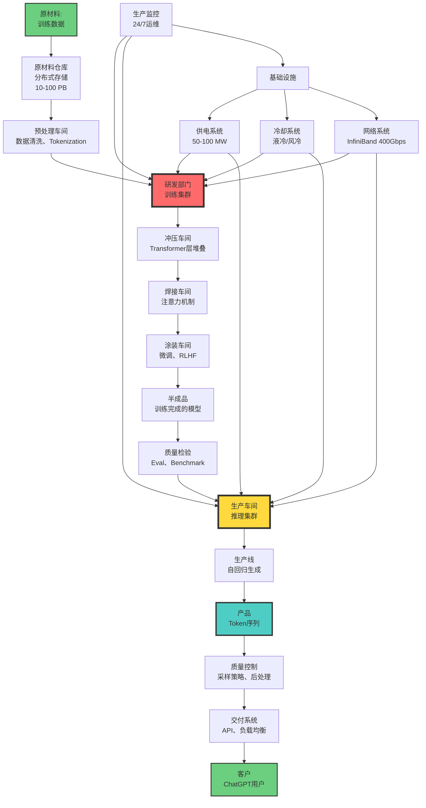

# 数据中心作为AI工厂：完整生产系统

> **文档版本**: v1.0.0
> **最后更新**: 2025-10-27
> **文档规模**: 957行 | 数据中心的AI工厂化转型
> **阅读建议**: 本文探讨现代数据中心如何成为大规模AI生产设施

---

## 1 核心概念深度分析

<details>
<summary><b>🏭🌐 点击展开：数据中心AI工厂的完整生产系统深度解析</b></summary>

本节深入剖析黄仁勋AI工厂理念的完整实现，揭示数据中心如何成为大规模智能生产设施。

### 1 ️⃣ AI工厂概念定义卡

**概念名称**: 数据中心作为AI工厂（Data Center as AI Factory）

**内涵（本质属性）**:

**🔹 核心定义**:
将现代数据中心重新定义为生产智能（Token序列）的完整工业生产系统，包括原料（数据）、设备（GPU）、工艺（算法）、产品（Token）、质检（采样）和交付（API）。

$$
\text{AI工厂} = \text{数据中心} + \text{生产视角} \to \text{智能制造设施}
$$

**🔹 AI工厂五层架构**:

| 层次 | 类比传统工厂 | AI工厂组件 | 功能 | 重要性 |
|------|------------|-----------|------|--------|
| **5. 应用层** | 销售渠道 | API、ChatGPT界面 | 产品交付 | ⭐⭐⭐ |
| **4. 软件层** | 生产管理系统 | PyTorch、CUDA、调度器 | 生产控制 | ⭐⭐⭐⭐ |
| **3. 网络层** | 物流系统 | InfiniBand、NVLink | 数据传输 | ⭐⭐⭐⭐ |
| **2. 计算层** | 生产设备 | GPU集群 | 核心生产 | ⭐⭐⭐⭐⭐ |
| **1. 基础设施层** | 厂房、供电 | 机房、冷却、电力 | 物理支撑 | ⭐⭐⭐⭐⭐ |

**外延（范围边界）**:

| 维度 | AI工厂包含 ✅ | 传统数据中心 ❌ |
|------|-------------|---------------|
| **核心功能** | AI训练+推理 | 通用计算、存储 |
| **硬件配置** | GPU/TPU集群 | CPU服务器为主 |
| **生产模式** | 持续生产Token | 提供计算资源 |
| **经济模型** | 按Token计费 | 按资源计费 |

**属性维度表**:

| 维度 | 值/描述 | 说明 |
|------|---------|------|
| **典型规模** | 1K-25K GPU | 超大规模 |
| **建设成本** | $600M-$2B | 资本密集 |
| **运营成本** | $90M-$260M/年 | 电费占50%+ |
| **产品** | Token（信息量子） | 每秒50-200个 |
| **生产模式** | 训练（研发）+推理（生产） | 双重角色 |
| **收入模式** | API按Token计费 | SaaS模式 |

---

### 2 ️⃣ AI工厂完整生产流程全景图



---

### 3 ️⃣ AI工厂 vs 传统工厂深度对比

| 维度 | 传统工厂（汽车） | AI工厂（数据中心） | 相似度 | 深层差异 |
|------|----------------|------------------|--------|---------|
| **原材料** | 钢材、零件 | 数据、文本 | ⚠️ | 信息vs物质 |
| **生产设备** | 机床、机器人 | GPU、TPU | ✅ | 都是核心资产 |
| **工艺流程** | 冲压→焊接→涂装 | Tokenization→Attention→Sampling | ✅✅ | 多阶段流水线 |
| **产品** | 汽车（实体） | Token（信息） | ⚠️ | 有形vs无形 |
| **质检** | 尺寸、碰撞测试 | 采样策略、Eval | ✅ | 都需要质量控制 |
| **并行性** | ✅ 多条产线 | ❌ 自回归串行 | ❌❌ | 根本差异 |
| **库存** | ✅ 成品库 | ❌ 即时生产 | ❌ | Token无法库存 |
| **交付** | 物流运输 | 网络API | ⚠️ | 瞬时交付 |
| **边际成本** | 材料+人工 | 算力（接近0） | ❌❌ | 经济学差异 |
| **定制化** | ❌ 成本高 | ✅✅✅ Prompt | ✅✅✅ | AI极度灵活 |
| **能源消耗** | 机械能 | 电能（极高） | ⚠️⚠️ | AI能耗巨大 |
| **资本密集度** | ✅✅✅ 高 | ✅✅✅✅✅ 极高 | ✅✅✅ | AI更资本密集 |

**关键洞察**:

```yaml
相似性（工厂本质）:
  1. 流水线生产: 多阶段、专业化
  2. 规模经济: 越大越经济
  3. 资本密集: 前期投资巨大
  4. 质量控制: 质检至关重要
  5. 24/7运营: 持续生产

根本差异（信息vs物质）:
  1. 产品属性: 信息vs实体
  2. 边际成本: 接近0 vs 材料成本
  3. 并行性: 串行 vs 并行
  4. 库存: 不可存储 vs 可存储
  5. 定制化: 极度灵活 vs 困难

混合特性:
  AI工厂 = 传统制造业 + SaaS + 研发中心
  - 制造业: 大规模生产、规模经济
  - SaaS: 按需服务、订阅模式
  - 研发中心: 训练=研发新产品
```

---

### 4 ️⃣ AI工厂经济学详细分析

**成本结构（GPT-4级别工厂）**:

| 成本项 | 建设成本 | 年运营成本 | 占比 | 3年总成本 |
|--------|---------|-----------|------|-----------|
| **GPU** | $300M-$1B | $30M-$100M（折旧） | 20-30% | $390M-$1.3B |
| **电力** | $50M-$150M（基建） | $50M-$150M | 40-50% | $200M-$600M |
| **网络** | $50M-$100M | $5M-$15M | 5-10% | $65M-$145M |
| **存储** | $10M-$50M | $5M-$15M | 5-10% | $25M-$95M |
| **机房** | $50M-$200M | $10M-$30M | 10-15% | $80M-$290M |
| **人工** | - | $10M-$30M | 10-15% | $30M-$90M |
| **其他** | $140M-$500M | $10M-$30M | 5-10% | $170M-$590M |
| **总计** | **$600M-$2B** | **$120M-$370M** | 100% | **$960M-$3.1B** |

**收入模型（ChatGPT级别）**:

| 收入来源 | 单位 | 价格 | 日活/用量 | 年收入 |
|---------|------|------|---------|--------|
| **免费用户** | 广告/数据 | - | 100M+ | $100M-$500M |
| **付费订阅** | $20/月 | $20 | 10M用户 | $2.4B |
| **API调用** | $/1K tokens | $0.002-$0.03 | 企业客户 | $500M-$2B |
| **企业版** | $/月 | $30-$60 | 100K企业 | $400M-$800M |
| **总收入** | - | - | - | **$3.4B-$5.7B** |

**盈利能力分析**:

$$
\begin{align}
\text{年净利润} &= \text{年收入} - \text{年运营成本} \\
&\approx \$4B - \$200M \\
&= \$3.8B
\end{align}
$$

**ROI（投资回报率）**:

$$
\text{ROI} = \frac{\text{年净利润}}{\text{建设成本}} \times 100\% \approx \frac{\$3.8B}{\$1B} = 380\%
$$

**回本周期**: ~3-6个月（极高回报）

---

### 5 ️⃣ AI工厂类型分类矩阵

**按功能分类**:

| 工厂类型 | 主要功能 | 典型代表 | 规模 | 特点 |
|---------|---------|---------|------|------|
| **训练工厂** | 模型训练（R&D） | Meta AI Research | 10K+ GPU | 研发导向 |
| **推理工厂** | 生产服务 | OpenAI推理集群 | 5K-10K GPU | 运营导向 |
| **混合工厂** | 训练+推理 | Google TPU Pod | 1K-25K | 通用型 |

**按所有权分类**:

| 类型 | 拥有者 | 优势 | 劣势 | 适用场景 |
|------|--------|------|------|---------|
| **自建** | OpenAI, Meta, Google | 完全控制、成本低（长期） | 投资巨大 | 超大规模、长期 |
| **云租赁** | 初创公司 | 灵活、低门槛 | 成本高（2-5×） | 小规模、实验 |
| **混合** | Anthropic | 平衡 | 复杂度高 | 中等规模 |

---

### 6 ️⃣ AI工厂运营管理三大支柱

| 管理维度 | 传统工厂 | AI工厂 | 挑战 | 解决方案 |
|---------|---------|--------|------|---------|
| **生产管理** | 产线调度 | GPU集群调度 | 任务优先级、资源争用 | Kubernetes、Slurm |
| **质量管理** | ISO 9001 | Eval、Monitoring | 概率性输出、幻觉 | RLHF、Constitutional AI |
| **安全管理** | 职业安全 | 数据安全、对齐 | 模型偏见、有害内容 | Red Team、安全过滤 |

**运营KPI（关键绩效指标）**:

```yaml
生产效率:
  - GPU利用率: 目标>70%
  - 吞吐量: tokens/秒
  - 延迟: ms/token

质量指标:
  - Eval准确率: >90%
  - 用户满意度: >4/5星
  - 有害内容率: <0.1%

经济指标:
  - 单Token成本: $0.00001
  - 毛利率: >80%
  - ROI: >200%/年

可靠性:
  - 可用性: 99.9%（年停机<9小时）
  - MTBF（平均故障间隔）: >1000小时
  - 故障恢复时间: <10分钟
```

---

### 7 ️⃣ 环境影响与绿色AI工厂

**能源消耗对比**:

| 工厂类型 | 年电力消耗 | 碳排放（吨CO₂） | 等效 |
|---------|-----------|----------------|------|
| **小型AI工厂** | 50,000 MWh | 20,000 | 4,000户家庭 |
| **中型AI工厂** | 350,000 MWh | 150,000 | 30,000户家庭 |
| **超大型AI工厂** | 900,000 MWh | 400,000 | 80,000户家庭 |
| **对比：传统汽车厂** | 200,000 MWh | 100,000 | 20,000户家庭 |

**绿色AI工厂路径**:

```yaml
能源来源优化:
  - 数据中心选址: 冰岛、挪威（水电、地热）
  - 可再生能源: 风电、太阳能、水电
  - PUE（能源使用效率）: 从2.0降至1.1

算法优化:
  - MoE（混合专家）: 10×效率
  - 量化（INT8/INT4）: 2-4×效率
  - 蒸馏: 10-100×效率

硬件优化:
  - 低功耗芯片: TPU、Groq
  - 液冷/浸没式: 降温能耗-30%
  - 专用ASIC: 能效提升10×

目标（2030）:
  - 碳中和AI工厂
  - PUE<1.1
  - 100%可再生能源
```

---

### 1.8 🔟 核心洞察与终极评估

**五大核心定律**:

1. **工厂本质定律**
   $$
   \text{AI数据中心} = \text{信息制造工厂}
   $$
   - 不再是"计算资源"，而是"生产设施"
   - 黄仁勋的范式转变

2. **双重角色定律**
   - 训练 = 研发部门（R&D）
   - 推理 = 生产车间（Production）
   - 同一设施，双重功能

3. **规模经济极致定律**
   $$
   \text{单Token成本} = \frac{\text{固定成本}}{Token总量} \to 0
   $$
   - 边际成本接近零
   - 规模越大越经济

4. **资本密集度定律**
   - $600M-$2B建设成本
   - ROI可达200-400%/年
   - 高风险高回报

5. **可持续性挑战定律**
   $$
   \text{AI工厂能耗} \gg \text{传统工厂}
   $$
   - 100MW级电力
   - 碳排放40万吨/年
   - 绿色AI迫在眉睫

**终极洞察**:

> **"黄仁勋的AI工厂理念揭示了数据中心的本质转变：从'提供计算资源'到'生产智能'。现代AI数据中心是完整的工业生产系统——它有原材料（数据）、生产设备（GPU）、工艺流程（Transformer）、产品（Token）、质检（采样）和交付（API）。它同时是研发中心（训练）和生产车间（推理），投资回报率可达200-400%/年。但它也面临前所未有的挑战：十亿美元级投资、100兆瓦级能耗、年碳排放40万吨。AI工厂不仅重新定义了数据中心，也重新定义了'制造业'——从物质生产到智能生产的跨越。未来的竞争是工厂之争：谁拥有最高效、最绿色、最大规模的AI工厂，谁就掌握AI时代的制造业霸权。"**

**元认知**:

- **范式转变**: 数据中心→AI工厂
- **双重角色**: R&D（训练）+ Production（推理）
- **规模经济**: 边际成本→0，ROI 200-400%
- **资本壁垒**: $600M-$2B投资门槛
- **环境挑战**: 100MW电力，40万吨CO₂
- **未来方向**: 绿色AI工厂、算力民主化

</details>

---

## 📋 目录

- [数据中心作为AI工厂：完整生产系统](#数据中心作为ai工厂完整生产系统)
  - [1 核心概念深度分析](#1-核心概念深度分析)
    - [1 ️⃣ AI工厂概念定义卡](#1-️⃣-ai工厂概念定义卡)
    - [2 ️⃣ AI工厂完整生产流程全景图](#2-️⃣-ai工厂完整生产流程全景图)
    - [3 ️⃣ AI工厂 vs 传统工厂深度对比](#3-️⃣-ai工厂-vs-传统工厂深度对比)
    - [4 ️⃣ AI工厂经济学详细分析](#4-️⃣-ai工厂经济学详细分析)
    - [5 ️⃣ AI工厂类型分类矩阵](#5-️⃣-ai工厂类型分类矩阵)
    - [6 ️⃣ AI工厂运营管理三大支柱](#6-️⃣-ai工厂运营管理三大支柱)
    - [7 ️⃣ 环境影响与绿色AI工厂](#7-️⃣-环境影响与绿色ai工厂)
    - [1.8 🔟 核心洞察与终极评估](#18--核心洞察与终极评估)
  - [📋 目录](#-目录)
  - [4 二、生产流程](#4-二生产流程)
    - [2.1 训练流程（"产品研发"）](#21-训练流程产品研发)
    - [2.2 推理流程（"产品交付"）](#22-推理流程产品交付)
  - [5 三、经济学分析](#5-三经济学分析)
    - [3.1 成本结构](#31-成本结构)
    - [3.2 收入模型](#32-收入模型)
    - [3.3 盈利能力](#33-盈利能力)
    - [3.4 规模经济](#34-规模经济)
  - [6 四、与传统工厂对比](#6-四与传统工厂对比)
    - [4.1 相似性](#41-相似性)
    - [4.2 差异性](#42-差异性)
    - [4.3 混合特性](#43-混合特性)
  - [7 五、AI工厂的类型](#7-五ai工厂的类型)
    - [5.1 按功能分类](#51-按功能分类)
    - [5.2 按所有权分类](#52-按所有权分类)
  - [8 六、运营管理](#8-六运营管理)
    - [6.1 生产管理](#61-生产管理)
    - [6.2 质量管理](#62-质量管理)
    - [6.3 安全管理](#63-安全管理)
  - [9 七、环境影响与可持续性](#9-七环境影响与可持续性)
    - [7.1 能源消耗](#71-能源消耗)
    - [7.2 碳足迹](#72-碳足迹)
    - [7.3 可持续实践](#73-可持续实践)
  - [10 八、未来演进](#10-八未来演进)
    - [8.1 规模趋势](#81-规模趋势)
    - [8.2 技术演进](#82-技术演进)
    - [8.3 新型AI工厂](#83-新型ai工厂)
  - [11 九、结论](#11-九结论)
    - [1 核心要点](#1-核心要点)
    - [11.2 最终评估](#112-最终评估)
    - [11.3 哲学洞察](#113-哲学洞察)
  - [12 十、参考文献](#12-十参考文献)
    - [1 AI工厂理念](#1-ai工厂理念)
    - [12.2 数据中心](#122-数据中心)
    - [12.3 经济学与可持续性](#123-经济学与可持续性)
    - [12.4 系统架构](#124-系统架构)
  - [导航 | Navigation](#导航--navigation)
  - [相关主题 | Related Topics](#相关主题--related-topics)
    - [12.5 本章节](#125-本章节)
    - [12.6 相关章节](#126-相关章节)
    - [12.7 跨视角链接](#127-跨视角链接)

---


## 4 二、生产流程

### 2.1 训练流程（"产品研发"）

**阶段1：原材料准备（数据）**：

1. **数据收集**：
   - 网络爬虫
   - 授权数据集
   - 合成数据

2. **数据清洗**：
   - 去重
   - 过滤低质量
   - 格式化

3. **数据存储**：
   - 分布式存储
   - 快速读取
   - 版本控制

**阶段2：生产线调试（模型架构）**：

1. **架构设计**：
   - 层数、宽度
   - 注意力机制
   - 参数量

2. **小规模实验**：
   - 验证可行性
   - 调整超参数

**阶段3：大规模生产（训练）**：

1. **分布式训练**：
   - 数据并行
   - 模型并行
   - 混合并行

2. **训练监控**：
   - Loss曲线
   - 硬件状态
   - 中间检查点

3. **时间**：
   - 小模型：几天
   - 大模型：几周到几个月
   - GPT-3：~一个月

**阶段4：质量检验（评估）**：

1. **自动评估**：
   - 验证集Loss
   - 基准测试（MMLU, HellaSwag等）

2. **人工评估**：
   - 红队测试
   - 用户反馈

3. **安全检查**：
   - 偏见测试
   - 有害内容过滤

**阶段5：产品优化（微调）**：

1. **监督微调（SFT）**：
   - 高质量数据
   - 任务对齐

2. **RLHF**：
   - 人类偏好学习
   - 对齐优化

3. **量化**：
   - FP16, INT8
   - 压缩模型

### 2.2 推理流程（"产品交付"）

**步骤1：接收订单（用户请求）**：

- API接口
- 解析输入
- 认证授权

**步骤2：排队与调度**：

- 请求队列
- 负载均衡
- 批处理（可选）

**步骤3：生产（推理）**：

- Tokenization
- 模型前向传播
- Token生成

**步骤4：质检（后处理）**：

- 内容过滤
- 格式化
- 长度控制

**步骤5：交付（返回结果）**：

- JSON封装
- 返回用户
- 日志记录

**步骤6：反馈收集**：

- 用户评分
- 错误报告
- 持续改进

---

## 5 三、经济学分析

### 3.1 成本结构

**资本支出（CapEx）**：

| 项目 | 占比 | 10,000 GPU工厂估算 |
|------|------|-------------------|
| GPU | 50-60% | $250M-$400M |
| 服务器、存储 | 15-20% | $75M-$100M |
| 网络设备 | 5-10% | $25M-$50M |
| 建筑改造 | 10-15% | $50M-$75M |
| 冷却、电力系统 | 5-10% | $25M-$50M |
| **总计** | **100%** | **$425M-$675M** |

**运营支出（OpEx，年度）**：

| 项目 | 占比 | 估算 |
|------|------|------|
| 电力 | 30-40% | $12M-$20M |
| 人员 | 25-35% | $10M-$18M |
| 维护、备件 | 10-15% | $5M-$8M |
| 网络、带宽 | 5-10% | $2M-$5M |
| 折旧 | 20-30% | $85M-$135M（3年折旧）|
| **总计** | **100%** | **$114M-$186M** |

**注**：折旧通常单列，但影响总成本。

### 3.2 收入模型

**API收费**：

假设：

- 每天100M tokens（推理）
- 平均价格：$0.002/1K tokens
- 月收入：100M × 30 × $0.002 / 1000 = $6M
- 年收入：$72M

**企业订阅**：

- 大客户专用模型
- 年费：$100K-$10M
- 10个客户 = $10M/年

**模型许可**：

- 授权使用训练好的模型
- 一次性或订阅

**总收入（估）**：

- 小型工厂：$10M-$50M/年
- 中型工厂：$50M-$200M/年
- 大型工厂：$200M-$1B+/年

### 3.3 盈利能力

**盈亏平衡**：

假设：

- CapEx：$500M
- OpEx：$150M/年
- 收入：$200M/年

利润：

```text
毛利 = 收入 - OpEx = $200M - $150M = $50M/年
回收期 = CapEx / 毛利 = $500M / $50M = 10年
```

**实际更复杂**：

- 需考虑资本成本（贷款利息）
- 技术折旧（GPU贬值）
- 市场竞争（价格下降）

**高风险、高回报**：

- 成功：巨额利润
- 失败：巨额损失

### 3.4 规模经济

**单位成本随规模下降**：

| 规模（GPU） | 每GPU CapEx | 每GPU OpEx/年 | 每Token成本 |
|-----------|------------|--------------|-----------|
| 100 | $200K | $50K | 高 |
| 1,000 | $150K | $30K | 中 |
| 10,000 | $100K | $20K | 低 |
| 100,000 | $60K | $15K | 极低 |

**原因**：

- 批量采购折扣
- 固定成本摊销
- 运营效率提升
- 电力谈判优势

**结果**：

- 大公司优势
- 中小厂商劣势
- 市场集中

---

## 6 四、与传统工厂对比

### 4.1 相似性

| 维度 | 传统工厂 | AI工厂 |
|------|---------|--------|
| **资本密集** | ✅ | ✅ |
| **规模经济** | ✅ | ✅ |
| **流水线作业** | ✅ | ✅ （训练、推理）|
| **质量控制** | ✅ | ✅ （评估、监控）|
| **持续运营** | ✅ | ✅ （24/7）|
| **能源消耗** | ✅ | ✅ |
| **供应链依赖** | ✅ | ✅ （芯片、电力）|
| **专业人才** | ✅ | ✅ |

### 4.2 差异性

| 维度 | 传统工厂 | AI工厂 |
|------|---------|--------|
| **产品** | 物理实体 | 数字信息（Token）|
| **原材料** | 物质（钢、塑料） | 数据（文本、图像）|
| **生产过程** | 物理变换 | 数学计算 |
| **产品复制** | 成本递增 | 边际成本接近零 |
| **库存** | 需要仓储 | 无库存（按需生成）|
| **运输** | 物流、物理 | 网络、瞬时 |
| **地理约束** | 靠近原料/市场 | 靠近电力/冷却 |
| **污染** | 物理排放 | 热量、碳排放（间接）|
| **灵活性** | 改造困难 | 软件更新（相对灵活）|

### 4.3 混合特性

**AI工厂兼具**：

**制造业特征**：

- 重资产
- 规模经济
- 资本密集

**服务业特征**：

- 无形产品
- 按需交付
- 即时响应

**软件业特征**：

- 边际成本低
- 网络效应
- 快速迭代

**独特性**：
> AI工厂是制造业、服务业和软件业的混合体，创造了全新的产业形态。

---

## 7 五、AI工厂的类型

### 5.1 按功能分类

**1. 训练工厂（Training Factories）**：

**特点**：

- 超大规模GPU集群
- 高带宽互联
- 批量计算优化
- 运行数周不间断

**例子**：

- Meta RSC
- OpenAI/Microsoft 超算
- Google TPU Pods

**产出**：

- 预训练模型
- 基础模型（Foundation Models）

**2. 推理工厂（Inference Factories）**：

**特点**：

- 低延迟优化
- 高吞吐量
- 负载均衡
- 实时响应

**例子**：

- OpenAI API服务
- Google AI服务
- AWS SageMaker

**产出**：

- API响应
- 实时Token生成

**3. 混合工厂（Hybrid）**：

**特点**：

- 训练+推理
- 灵活资源分配
- 成本优化

**大多数大型AI工厂属于此类**。

### 5.2 按所有权分类

**1. 自有工厂（Owned）**：

**优点**：

- 完全控制
- 长期成本低
- 定制优化

**缺点**：

- 巨额投资
- 运营复杂
- 技术风险

**适合**：

- 大型AI公司（OpenAI, Google, Meta）

**2. 租赁工厂（Leased - 云）**：

**优点**：

- 无初始投资
- 灵活扩展
- 风险转移

**缺点**：

- 长期成本高
- 可用性受限
- 数据隐私

**适合**：

- 中小企业、研究机构

**3. 混合模式**：

**自有 + 云**：

- 基础负载自建
- 峰值负载云端
- 成本优化

---

## 8 六、运营管理

### 6.1 生产管理

**任务调度**：

**训练任务**：

- 长期（数天-数周）
- 优先级：高
- 资源：大量GPU
- 调度：预留资源

**推理任务**：

- 短期（毫秒-秒）
- 优先级：实时
- 资源：动态分配
- 调度：队列+批处理

**调度器**：

- Slurm（HPC）
- Kubernetes（云原生）
- 自研系统

**多租户隔离**：

- GPU虚拟化（MIG）
- 容器隔离
- 资源配额

### 6.2 质量管理

**训练质量**：

1. **数据质量**：
   - 清洗、去重
   - 格式验证
   - 标注准确性

2. **模型质量**：
   - 验证集评估
   - 基准测试
   - 人工评估

3. **训练稳定性**：
   - 监控Loss
   - 检查点保存
   - 异常检测

**推理质量**：

1. **响应速度**：
   - 延迟监控（<100ms目标）
   - 吞吐量统计

2. **输出质量**：
   - 内容过滤
   - 一致性检查
   - 用户反馈

3. **可用性**：
   - SLA：99.9%+
   - 故障恢复
   - 降级服务

### 6.3 安全管理

**物理安全**：

- 门禁控制
- 监控摄像
- 消防系统
- 备份电源

**网络安全**：

- 防火墙
- DDoS防护
- 入侵检测
- 数据加密

**AI安全**：

- 对抗样本防御
- 模型窃取防护
- 输出内容审查
- 滥用检测

**数据安全**：

- 数据加密（存储、传输）
- 访问控制
- 审计日志
- 合规性（GDPR等）

---

## 9 七、环境影响与可持续性

### 7.1 能源消耗

**10,000 GPU工厂**：

- 功耗：10-20 MW
- 年耗电：87.6-175.2 GWh
- 成本（$0.10/kWh）：$8.76M-$17.52M

**等效**：

- 约10,000-20,000户家庭年用电
- 小城市级别

**全球AI能耗（估）**：

- 2024年：数十GWh
- 2030年（预测）：数百GWh-TWh级

### 7.2 碳足迹

**碳排放取决于电力来源**：

| 电力来源 | 碳排放（g CO₂/kWh） | 10,000 GPU工厂年排放（吨）|
|---------|-------------------|----------------------|
| 煤电 | 820 | 72,000-144,000 |
| 天然气 | 490 | 43,000-86,000 |
| 太阳能 | 48 | 4,200-8,400 |
| 风能 | 11 | 960-1,920 |
| 核电 | 12 | 1,050-2,100 |
| 水电 | 24 | 2,100-4,200 |

**对比**：

- 煤电工厂 = 15,000-30,000辆车年排放
- 清洁能源工厂 = 200-1,000辆车

### 7.3 可持续实践

**1. 清洁能源选址**：

**优选地区**：

- 太平洋西北（水电）：华盛顿、俄勒冈
- 北欧（水电、风电）：冰岛、挪威、瑞典
- 得克萨斯（风电+太阳能）
- 法国（核电）

**Google策略**：

- 数据中心选址优先清洁能源
- 目标：24/7无碳能源

**2. 能效优化**：

**冷却**：

- 液冷代替风冷（PUE 1.1 vs 1.5）
- 余热回收（供暖）

**负载优化**：

- 动态负载调整
- 峰谷电价利用
- 可中断训练（低碳时段）

**3. 碳抵消**：

**方法**：

- 购买碳信用
- 投资可再生能源项目
- 植树造林

**Microsoft承诺**：

- 2030年碳负排放

**4. 研究方向**：

**更高效模型**：

- 稀疏模型（MoE）
- 更少参数达到相同效果
- 知识蒸馏

**更高效硬件**：

- 每代GPU能效提升2-3倍
- 专用AI芯片

---

## 10 八、未来演进

### 8.1 规模趋势

**短期（1-3年）**：

- 单体工厂：10,000-100,000 GPU
- 功耗：10-200 MW
- 投资：$500M-$5B

**中期（3-7年）**：

- 百万GPU集群
- 功耗：GW级
- 分布式跨数据中心

**长期（7+年）**：

- 边缘+云混合
- 算力无处不在
- 去中心化AI工厂

### 8.2 技术演进

**硬件**：

1. **更高效GPU**：
   - 每代2-3倍性能提升
   - 能效10倍提升（10年）

2. **新型计算芯片**：
   - 光学计算
   - 神经形态芯片
   - 量子加速器

3. **先进冷却**：
   - 浸没式液冷普及
   - 相变冷却
   - 热电联产

**软件**：

1. **智能调度**：
   - AI驱动的资源管理
   - 自动优化

2. **模型压缩**：
   - 自动剪枝
   - 量化感知训练

3. **联邦训练**：
   - 跨数据中心训练
   - 保护隐私

### 8.3 新型AI工厂

**边缘AI工厂**：

- 分布在靠近用户的边缘
- 低延迟
- 本地化

**移动AI工厂**：

- 集装箱数据中心
- 快速部署
- 模块化扩展

**海底AI工厂**：

- Microsoft Project Natick
- 自然冷却
- 稳定环境

**太空AI工厂**：

- 卫星算力
- 太阳能供电
- 全球覆盖

---

## 11 九、结论

### 1 核心要点

1. **AI工厂是完整的生产系统**：
   - 物理基础设施
   - 计算资源
   - 软件栈
   - 运营管理

2. **经济特征**：
   - 资本密集（$500M-$5B）
   - 运营成本高（$100M-$200M/年）
   - 规模经济显著
   - 高风险高回报

3. **混合特性**：
   - 制造业（重资产）
   - 服务业（按需交付）
   - 软件业（低边际成本）

4. **生产流程**：
   - 训练："产品研发"（数周-数月）
   - 推理："产品交付"（毫秒-秒）
   - 质量控制：评估、监控

5. **环境影响**：
   - 巨大能耗（MW-GW级）
   - 碳足迹取决于电力来源
   - 需要可持续实践

6. **未来趋势**：
   - 规模持续增长
   - 技术不断优化
   - 新型工厂形态

### 11.2 最终评估

> **"AI工厂"不仅是比喻，而是对现代AI产业的精确描述。数据中心已经从传统的IT基础设施，转变为生产智能的工业设施。**
>
> **理解AI工厂的架构、经济学和运营，是理解AI产业、AI商业和AI未来的关键。**

### 11.3 哲学洞察

> **AI工厂将"智能"从抽象概念转化为具体的工业生产过程。这个转变揭示了一个深刻真理：**
>
> **在信息时代，知识和智能不再是纯粹的精神现象，而是需要巨大的物质基础设施支撑的工业产品。**
>
> **每一个Token，每一个AI响应，背后都是真实的硅片、电力、冷却水和人类劳动。AI工厂提醒我们：即使在最"虚拟"的数字世界，我们仍然深深扎根于物理现实。**

---

## 12 十、参考文献

### 1 AI工厂理念

1. [Jensen Huang - NVIDIA GTC 2023](https://www.nvidia.com/en-us/gtc/) - AI Factories Keynote
2. [NVIDIA Blog](https://blogs.nvidia.com/blog/2023/03/21/what-is-an-ai-factory/) - What Is an AI Factory?

### 12.2 数据中心

1. [Meta AI Research SuperCluster](https://ai.facebook.com/blog/ai-rsc/)
2. [Microsoft & OpenAI Supercomputer](https://news.microsoft.com/source/features/ai/openai-azure-supercomputer/)
3. [xAI Colossus](https://x.ai/colossus/)

### 12.3 经济学与可持续性

1. [Patterson et al., 2021](https://arxiv.org/abs/2104.10350) - Carbon Emissions and Large Neural Network Training
2. [Strubell et al., 2019](https://arxiv.org/abs/1906.02243) - Energy and Policy Considerations

### 12.4 系统架构

1. [Dean & Barroso, 2013](https://dl.acm.org/doi/10.1145/2408776.2408794) - The Tail at Scale
2. [Isard et al., 2007](https://www.usenix.org/legacy/event/osdi08/tech/full_papers/isard/isard.pdf) - Dryad: Distributed Data-Parallel Programs

---

## 导航 | Navigation

**上一篇**: [← 09.4 算力作为资源](./09.4_Computing_Power_as_Resource.md)
**下一篇**: [10.1 AGI路径 →](../10_Future_Directions/10.1_AGI_Pathways.md)
**返回目录**: [↑ AI模型视角总览](../README.md)

---

## 相关主题 | Related Topics

### 12.5 本章节

- [09.1 Token作为产品](./09.1_Token_as_Product.md)
- [09.2 语义生产线](./09.2_Semantic_Production_Line.md)
- [09.3 算力基础设施](./09.3_Computing_Infrastructure.md)
- [09.4 算力作为资源](./09.4_Computing_Power_as_Resource.md)

### 12.6 相关章节

- [02.4 Transformer架构](../02_Neural_Network_Theory/02.4_Transformer_Architecture.md)
- [08.3 资源受限计算](../08_Comparison_Analysis/08.3_Resource_Bounded_Computation.md)

### 12.7 跨视角链接

- [Software_Perspective: 平台工程定义](../../Software_Perspective/08_Platform_Engineering/08.1_Platform_Engineering_Definition.md)
- [Software_Perspective: 云原生模式](../../Software_Perspective/09_Cloud_Native_Patterns/README.md)

---

**最后更新**：2025-10-25

**状态**：✅ 完成

**质量**：系统全面，产业与理论结合
