# 通用人工智能（AGI）路径：从ANI到AGI

> **文档版本**: v1.0.0
> **最后更新**: 2025-10-27
> **文档规模**: 944行 | AGI实现路径的系统分析
> **阅读建议**: 本文探讨从专用AI到通用AI的可能路径、技术挑战和时间线

---

## 1 核心概念深度分析

<details>
<summary><b>🌟🚀 点击展开：AGI路径全景深度分析与时间线预测</b></summary>

本节深入剖析从专用AI（ANI）到通用AI（AGI）的六大可能路径、七大关键差距、技术挑战和时间线预测。

### 1 ️⃣ AGI概念定义卡与智能层次

**概念名称**: 通用人工智能（Artificial General Intelligence, AGI）

**内涵（本质属性）**:

**🔹 核心定义（OpenAI 2023经济学定义）**:
> 在大多数经济价值工作上，能够超越人类的高度自主系统。

**🔹 智能层次金字塔**:

| 层次 | 定义 | 能力 | 现状 | 时间线预测 |
|------|------|------|------|-----------|
| **ANI**（狭义AI） | 单一任务专家 | 特定领域超人 | ✅ 已实现 | 2012-2024 |
| **AGI**（通用AI） | 人类级通用智能 | 跨领域学习迁移 | ⚠️ 进行中 | 2025-2045？ |
| **ASI**（超级AI） | 超越人类所有领域 | 全面超越人类 | ❌ 未实现 | 2045+？ |

**外延（范围边界）**:

| 维度 | AGI包含 ✅ | AGI不包含 ❌ |
|------|----------|-------------|
| **任务范围** | 跨领域通用任务 | 单一领域专家系统 |
| **学习能力** | 持续学习、迁移学习 | 固定参数推理 |
| **理解深度** | 因果推理、世界模型 | 纯统计相关 |
| **自主性** | 自主目标、主动探索 | 被动响应 |

**属性维度表**:

| 维度 | 值/描述 | 说明 |
|------|---------|------|
| **定义多样性** | 4+种主流定义 | 无共识标准 |
| **关键差距** | 7大核心能力差距 | 世界模型、因果推理等 |
| **实现路径** | 6条可能路径 | Scaling、混合、世界模型等 |
| **时间线预测** | 2030-2060（专家中位数） | 极度不确定 |
| **技术就绪度** | TRL 3-4（概念验证） | 距离实用化远 |
| **风险等级** | ⚠️⚠️⚠️⚠️⚠️ 极高 | 存在性风险 |

---

### 2 ️⃣ 当前AI vs AGI差距全景图

```mermaid
graph TB
    Current[当前AI<br/>2024 GPT-4级别]

    Current --> Gap1[差距1: 世界模型 ❌]
    Current --> Gap2[差距2: 因果推理 ❌]
    Current --> Gap3[差距3: 持续学习 ❌]
    Current --> Gap4[差距4: 迁移泛化 ⚠️]
    Current --> Gap5[差距5: 自主性 ❌]
    Current --> Gap6[差距6: 具身交互 ⚠️]
    Current --> Gap7[差距7: 效率 ❌]

    Gap1 --> G1[纯统计相关<br/>无物理直觉]
    Gap2 --> G2[Pearl层次1<br/>无反事实推理]
    Gap3 --> G3[灾难性遗忘<br/>参数冻结]
    Gap4 --> G4[长度泛化失败<br/>域外数据崩溃]
    Gap5 --> G5[被动响应<br/>无自主目标]
    Gap6 --> G6[纯文本<br/>无真实交互]
    Gap7 --> G7[千亿参数<br/>vs人脑86亿神经元]

    AGI[AGI目标<br/>人类级通用智能]

    AGI --> Need1[✅ 世界模型]
    AGI --> Need2[✅ 因果推理]
    AGI --> Need3[✅ 持续学习]
    AGI --> Need4[✅ 真正泛化]
    AGI --> Need5[✅ 自主性]
    AGI --> Need6[✅ 具身智能]
    AGI --> Need7[✅ 高效率]

    style Current fill:#ffd93d,stroke:#333,stroke-width:2px
    style AGI fill:#6bcf7f,stroke:#333,stroke-width:4px
    style Gap1 fill:#ff6b6b,stroke:#333,stroke-width:2px
    style Gap2 fill:#ff6b6b,stroke:#333,stroke-width:2px
    style Gap3 fill:#ff6b6b,stroke:#333,stroke-width:2px
    style Gap5 fill:#ff6b6b,stroke:#333,stroke-width:2px
    style Gap7 fill:#ff6b6b,stroke:#333,stroke-width:2px
```



---

### 3 ️⃣ 六大AGI实现路径详细对比

| 路径 | 核心思想 | 代表人物/组织 | 可行性 | 时间线 | 风险 | 优势 | 劣势 |
|------|---------|--------------|--------|--------|------|------|------|
| **1. Scaling** | 模型更大数据更多 | OpenAI, Anthropic | ⚠️⚠️⚠️ 中 | 2025-2030 | 成本、能耗 | 已验证有效 | 收益递减 |
| **2. 混合架构** | 神经+符号融合 | DeepMind, MIT | ⚠️⚠️⚠️⚠️ 高 | 2027-2035 | 工程复杂 | 优势互补 | 整合困难 |
| **3. 世界模型** | 学习物理规律 | Yann LeCun | ⚠️⚠️⚠️ 中高 | 2030-2040 | 理论不成熟 | 真正理解 | 训练困难 |
| **4. 具身智能** | 机器人+真实交互 | Boston Dynamics | ⚠️⚠️ 中 | 2035-2050 | 硬件瓶颈 | 真实接地 | 成本极高 |
| **5. 脑启发** | 模拟大脑 | Neuromorphic团队 | ⚠️⚠️ 中低 | 2040-2060 | 理解不足 | 生物原理 | 工程巨大 |
| **6. 元学习** | 学习如何学习 | FAIR, OpenAI | ⚠️⚠️⚠️ 中高 | 2030-2045 | 自我改进风险 | 自我进化 | 对齐困难 |

**关键洞察**:

- **Scaling路径**: 最直接但面临瓶颈（数据耗尽、成本爆炸）
- **混合架构**: 理论最优但工程最难
- **世界模型**: Yann LeCun押注，但训练范式未定
- **元学习**: 最危险路径（FOOM风险）

---

### 4 ️⃣ AGI时间线专家预测汇总

**2023年专家调查（Metaculus, AI Impacts）**:

| 预测来源 | 10%概率 | 50%概率（中位数） | 90%概率 | 方法 |
|---------|---------|-----------------|---------|------|
| **AI研究者调查** | 2028 | 2042 | 2075 | 问卷 |
| **Metaculus社区** | 2029 | 2043 | 2070 | 预测市场 |
| **OpenAI** | 2025-2030 | - | - | 内部评估 |
| **DeepMind** | 2030-2040 | - | - | 技术路线图 |
| **Gary Marcus** | 2045+ | 2060+ | 2100+ | 悲观派 |
| **Ray Kurzweil** | 2029 | 2029 | - | 乐观派 |

**三种场景**:

```yaml
乐观场景（Scaling持续有效）:
  时间: 2027-2032
  触发: GPT-5/6突破涌现
  概率: 20%
  特征: 持续Scaling + 算法突破

基线场景（需要新范式）:
  时间: 2035-2045
  触发: 世界模型+混合架构
  概率: 50%
  特征: 多路径融合

悲观场景（根本限制）:
  时间: 2050-2100+
  触发: 遇到理论障碍
  概率: 30%
  特征: 当前范式不足
```

---

### 5 ️⃣ AGI技术挑战矩阵

| 挑战类型 | 具体挑战 | 难度 | 当前进展 | 突破关键 |
|---------|---------|------|---------|---------|
| **算法** | 世界模型学习 | ⚠️⚠️⚠️⚠️⚠️ | TRL 2-3 | 新训练范式 |
| **算法** | 因果推理 | ⚠️⚠️⚠️⚠️ | TRL 3-4 | Pearl框架整合 |
| **算法** | 持续学习 | ⚠️⚠️⚠️⚠️ | TRL 3 | 避免遗忘 |
| **工程** | 算力需求 | ⚠️⚠️⚠️⚠️⚠️ | 指数增长 | 新硬件范式 |
| **工程** | 能耗 | ⚠️⚠️⚠️⚠️ | 训练GPT-4: ~1GWh | 能源突破 |
| **安全** | 对齐问题 | ⚠️⚠️⚠️⚠️⚠️ | TRL 2 | 理论框架 |
| **安全** | 可控性 | ⚠️⚠️⚠️⚠️⚠️ | 未解决 | 形式化保证 |
| **社会** | 就业冲击 | ⚠️⚠️⚠️⚠️⚠️ | 已开始 | 社会适应 |
| **伦理** | 意识问题 | ⚠️⚠️⚠️ | 哲学争议 | 避免盲目突破 |

**关键瓶颈**: 安全与对齐 > 算法突破 > 工程实现

---

### 1.6 🔟 核心洞察与终极评估

**五大核心定律**:

1. **AGI定义模糊定律**
   - 无共识定义
   - "移动的目标"现象
   - 标准随技术进步而提高

2. **差距七层定律**
   $$
   \text{AGI} = \text{世界模型} + \text{因果推理} + \text{持续学习} + \cdots
   $$
   - 七大关键差距
   - 任何一项未解决都不是AGI

3. **路径多元性定律**
   - 6+条可能路径
   - 无单一最优解
   - 可能需要融合

4. **时间不确定性定律**
   $$
   P(\text{AGI by } 2040) \approx 50\% \quad (\pm 30\%)
   $$
   - 预测跨度20-80年
   - 极度不确定

5. **风险优先定律**
   $$
   \text{安全} > \text{能力}
   $$
   - 对齐问题优先级最高
   - 能力越强风险越大

**终极洞察**:

> **"AGI不是一个技术问题，而是一系列相互关联的难题的总和。Scaling路径让我们看到了希望，但七大差距提醒我们距离真正的AGI还很远。时间线预测从5年到80年不等，这种不确定性本身就说明了问题的复杂性。最关键的是：我们必须在实现AGI之前解决对齐问题——因为一旦AGI实现，可能就没有第二次机会了。"**

**元认知**:

- **AGI定义**: 仍在演化中
- **当前进展**: GPT-4是ANI巅峰，非AGI起点
- **Scaling限制**: 数据耗尽、成本爆炸
- **真正挑战**: 世界模型、因果推理
- **安全第一**: 对齐比能力更紧迫
- **时间线**: 2040年中位数，但±20年都可能

</details>

---

## 📋 目录

- [通用人工智能（AGI）路径：从ANI到AGI](#通用人工智能agi路径从ani到agi)
  - [1 核心概念深度分析](#1-核心概念深度分析)
    - [1 ️⃣ AGI概念定义卡与智能层次](#1-️⃣-agi概念定义卡与智能层次)
    - [2 ️⃣ 当前AI vs AGI差距全景图](#2-️⃣-当前ai-vs-agi差距全景图)
    - [3 ️⃣ 六大AGI实现路径详细对比](#3-️⃣-六大agi实现路径详细对比)
    - [4 ️⃣ AGI时间线专家预测汇总](#4-️⃣-agi时间线专家预测汇总)
    - [5 ️⃣ AGI技术挑战矩阵](#5-️⃣-agi技术挑战矩阵)
    - [1.6 🔟 核心洞察与终极评估](#16--核心洞察与终极评估)
  - [📋 目录](#-目录)
  - [2 二、当前AI与AGI的差距](#2-二当前ai与agi的差距)
    - [2.1 当前大模型的能力](#21-当前大模型的能力)
    - [2.2 关键差距](#22-关键差距)
      - [1 . 世界模型（World Model）](#1--世界模型world-model)
      - [2 . 因果推理](#2--因果推理)
      - [3 . 持续学习](#3--持续学习)
      - [4 . 迁移与泛化](#4--迁移与泛化)
      - [5 . 自主性与主动性](#5--自主性与主动性)
      - [6 . 具身与交互](#6--具身与交互)
      - [7 . 效率](#7--效率)
  - [3 三、通向AGI的可能路径](#3-三通向agi的可能路径)
    - [3.1 路径1：扩展（Scaling）](#31-路径1扩展scaling)
    - [3.2 路径2：混合架构（Hybrid）](#32-路径2混合架构hybrid)
    - [3.3 路径3：世界模型（World Models）](#33-路径3世界模型world-models)
    - [3.4 路径4：具身智能（Embodied AI）](#34-路径4具身智能embodied-ai)
    - [3.5 路径5：脑启发（Brain-Inspired）](#35-路径5脑启发brain-inspired)
    - [3.6 路径6：元学习与自我改进](#36-路径6元学习与自我改进)
  - [4 四、技术挑战](#4-四技术挑战)
    - [4.1 算法挑战](#41-算法挑战)
    - [4.2 工程挑战](#42-工程挑战)
    - [4.3 安全与对齐挑战](#43-安全与对齐挑战)
    - [4.4 社会与伦理挑战](#44-社会与伦理挑战)
  - [5 五、时间线预测](#5-五时间线预测)
    - [5.1 专家预测](#51-专家预测)
    - [5.2 关键人物预测](#52-关键人物预测)
    - [5.3 场景分析](#53-场景分析)
  - [6 六、AGI的影响](#6-六agi的影响)
    - [6.1 积极影响](#61-积极影响)
    - [6.2 风险与挑战](#62-风险与挑战)
    - [6.3 缓解策略](#63-缓解策略)
  - [7 七、结论](#7-七结论)
    - [1 核心要点](#1-核心要点)
    - [9.2 最终评估](#92-最终评估)
    - [9.3 哲学洞察](#93-哲学洞察)
  - [8 八、参考文献](#8-八参考文献)
    - [1 AGI定义与理论](#1-agi定义与理论)
    - [10.2 Scaling路径](#102-scaling路径)
    - [10.3 混合架构](#103-混合架构)
    - [10.4 世界模型](#104-世界模型)
    - [10.5 安全与对齐](#105-安全与对齐)
    - [10.6 时间线预测](#106-时间线预测)
  - [导航 | Navigation](#导航--navigation)
  - [相关主题 | Related Topics](#相关主题--related-topics)
    - [10.7 本章节](#107-本章节)
    - [10.8 相关章节](#108-相关章节)
    - [10.9 跨视角链接](#109-跨视角链接)

---


## 4 二、当前AI与AGI的差距

### 2.1 当前大模型的能力

**GPT-4, Claude 3.5等的成就**：

✅ **已实现**：

- 广泛知识
- 多任务能力（语言、代码、数学、推理）
- 少样本学习（In-context Learning）
- 类人对话
- 初步推理

**但仍属ANI**：

- 无真正理解（统计模式）
- 严重依赖训练数据
- 无自主目标
- 无持续学习

### 2.2 关键差距

#### 1 . 世界模型（World Model）

**人类**：

- 内在世界模型
- 物理直觉
- 因果理解

**当前AI**：

- 无世界模型
- 纯统计相关
- 常识推理失败

**例子**：

```text
问题："如果我把一个杯子倒过来，水会怎样？"

人类：水会洒出来（物理直觉）
GPT：可能答对（记住了类似例子），但无真正理解
```

#### 2 . 因果推理

**人类**：

- 因果 vs 相关
- 反事实推理（"如果...会怎样？"）
- 干预预测

**当前AI**：

- 仅相关性
- 因果推理困难
- Pearl因果层次理论：AI停留在Level 1（关联）

#### 3 . 持续学习

**人类**：

- 终身学习
- 不遗忘旧知识
- 增量更新

**当前AI**：

- 灾难性遗忘
- 重新训练成本巨大
- 参数冻结（推理时）

#### 4 . 迁移与泛化

**人类**：

- 零样本学习（真正的）
- 类比推理
- 跨领域迁移

**当前AI**：

- 有限泛化
- 域外数据失败
- 长度泛化问题（形式语言）

#### 5 . 自主性与主动性

**人类**：

- 自主目标
- 好奇心驱动
- 主动探索

**当前AI**：

- 被动响应
- 无内在动机
- 训练目标固定

#### 6 . 具身与交互

**人类**：

- 具身认知
- 与环境交互
- 感知-行动循环

**当前LLM**：

- 纯文本
- 无物理交互
- 无感知-行动

#### 7 . 效率

**人类婴儿**：

- 数年达到基本智能
- 有限数据（视觉、听觉）
- 高效学习

**当前AI**：

- 需要海量数据（TB级）
- 巨额计算（PFLOPs-days）
- 低效学习

---

## 5 三、通向AGI的可能路径

### 3.1 路径1：扩展（Scaling）

**理念**：
> 继续扩大模型规模、数据和计算，自然涌现AGI。

**OpenAI路线**：

- GPT-3 → GPT-4 → GPT-5 → ... → AGI
- 参数：千亿 → 万亿 → 十万亿
- 涌现能力（Emergent Abilities）

**支持论据**：

1. **Scaling Laws**：
   - 性能随规模对数增长
   - 未见饱和

2. **涌现能力**：
   - 推理、代码、数学
   - 从规模中涌现

3. **In-context Learning**：
   - 少样本学习
   - 接近零样本

**质疑**：

1. **数据墙**：
   - 高质量数据有限
   - 互联网数据快耗尽

2. **计算墙**：
   - 能耗、成本
   - 物理极限

3. **"更大 ≠ 更聪明"**：
   - 质变需要架构突破
   - 涌现不可预测

**时间线**：

- 乐观：5-10年（Sam Altman: 2029）
- 保守：15-30年

### 3.2 路径2：混合架构（Hybrid）

**理念**：
> 神经网络 + 符号推理 = AGI

**神经符号AI（Neurosymbolic AI）**：

**组件**：

1. **神经网络**：
   - 感知、模式识别
   - 学习表示

2. **符号系统**：
   - 逻辑推理
   - 知识表示
   - 因果推理

**例子**：

**AlphaGo**：

- 神经网络：评估、策略
- 符号：蒙特卡洛树搜索

**Codex/Copilot**：

- 神经网络：代码生成
- 符号：编译器、类型系统

**优势**：

- 结合两者优势
- 可解释性
- 因果推理

**挑战**：

- 集成困难
- 设计复杂
- 规模化难

**时间线**：

- 10-20年

### 3.3 路径3：世界模型（World Models）

**理念**：
> 构建内在世界模型，实现真正理解。

**方法**：

1. **预测性学习**（Yann LeCun）：
   - 预测未来状态
   - 学习世界动力学
   - 自监督学习

2. **因果模型**：
   - Pearl因果框架
   - 结构因果模型
   - 干预学习

3. **物理仿真**：
   - 物理引擎集成
   - 直觉物理学习

**例子**：

- DreamerV3（DeepMind）
- Gato（DeepMind）
- Gemini多模态

**优势**：

- 真正理解
- 因果推理
- 泛化能力

**挑战**：

- 建模复杂世界困难
- 计算需求
- 验证困难

**时间线**：

- 15-30年

### 3.4 路径4：具身智能（Embodied AI）

**理念**：
> 智能需要具身，与环境交互。

**认知科学基础**：

- 具身认知理论
- 感知-行动循环
- "思想需要身体"

**方法**：

1. **机器人学习**：
   - 物理机器人
   - 与真实环境交互
   - 学习操作、导航

2. **虚拟环境**：
   - 仿真环境（Habitat, AI2-THOR）
   - 大规模模拟
   - 多样化任务

3. **多模态融合**：
   - 视觉、听觉、触觉
   - 语言接地（Grounding）
   - 感知-语言-行动

**例子**：

- Tesla Optimus（人形机器人）
- RT-2（Google机器人Transformer）
- PaLM-E（具身多模态）

**优势**：

- 语言接地
- 常识学习
- 物理直觉

**挑战**：

- 机器人硬件昂贵
- 数据收集慢
- 安全性

**时间线**：

- 20-40年

### 3.5 路径5：脑启发（Brain-Inspired）

**理念**：
> 模拟生物大脑架构和机制。

**方向**：

1. **神经形态计算**：
   - 脉冲神经网络（SNN）
   - 低功耗
   - 事件驱动

2. **大脑模拟**：
   - Blue Brain Project
   - 神经元级模拟

3. **认知架构**：
   - SOAR, ACT-R
   - 心理学启发

**优势**：

- 生物可行性
- 能效
- 持续学习

**挑战**：

- 大脑理解不足
- 计算需求巨大
- 未必最优（进化约束）

**时间线**：

- 30-50年

### 3.6 路径6：元学习与自我改进

**理念**：
> 学会学习，递归自我提升。

**方法**：

1. **元学习（Meta-Learning）**：
   - "学习如何学习"
   - 少样本学习
   - 快速适应

2. **自我改进**：
   - AI改进自身代码
   - 架构搜索
   - 递归提升

3. **课程学习**：
   - 从简单到复杂
   - 渐进式学习

**风险**：

- 失控风险
- 对齐挑战
- 可预测性

**时间线**：

- 如果成功，可能快速到达AGI/ASI
- 15-30年（高风险）

---

## 6 四、技术挑战

### 4.1 算法挑战

**1. 因果推理**：

- 超越相关性
- 反事实推理
- 干预建模

**2. 常识推理**：

- 物理常识
- 社会常识
- 心理理论（Theory of Mind）

**3. 持续学习**：

- 避免遗忘
- 增量更新
- 终身学习

**4. 迁移学习**：

- 零样本泛化
- 跨领域
- 元学习

### 4.2 工程挑战

**1. 计算需求**：

- 算力需求指数增长
- 能耗限制
- 成本

**2. 数据需求**：

- 高质量数据稀缺
- 数据隐私
- 标注成本

**3. 系统复杂性**：

- 大规模系统
- 可靠性
- 可维护性

### 4.3 安全与对齐挑战

**1. 目标对齐**：

- 确保AGI目标与人类价值一致
- 价值复杂性
- 规范不确定性

**2. 可控性**：

- 防止失控
- 紧急停止
- 可撤销

**3. 可解释性**：

- 理解AGI决策
- 审计
- 调试

**4. 安全性**：

- 鲁棒性
- 对抗攻击
- 滥用防范

### 4.4 社会与伦理挑战

**1. 失业**：

- 广泛自动化
- 经济转型
- 社会安全网

**2. 权力集中**：

- AGI控制权
- 寡头垄断
- 民主监督

**3. 军事应用**：

- 自主武器
- 军备竞赛
- 国际管控

**4. 存在风险**：

- ASI风险
- 人类灭绝风险
- 预防措施

---

## 7 五、时间线预测

### 5.1 专家预测

**调查结果**（多次调查综合）：

| 时间线 | 概率（中位数）|
|--------|-------------|
| 2030年前 | 10-20% |
| 2030-2040 | 30-40% |
| 2040-2050 | 20-30% |
| 2050-2070 | 10-20% |
| 2070年后 | 5-15% |
| 永不实现 | 1-5% |

**中位数预测**：~2040-2050

**不确定性极大**：

- 标准差：几十年
- 取决于定义
- 技术突破不可预测

### 5.2 关键人物预测

**乐观派**：

1. **Sam Altman (OpenAI CEO)**：
   - 2029年实现AGI
   - 基于Scaling路线

2. **Demis Hassabis (DeepMind CEO)**：
   - "几年到十几年"
   - 强调安全

3. **Ray Kurzweil (Google)**：
   - 2029年（早在2005年预测）
   - 基于指数增长

**谨慎派**：

1. **Yann LeCun (Meta AI)**：
   - "还需要几十年"
   - 当前方法不足
   - 需要新范式

2. **Gary Marcus**：
   - 当前方法无法达到AGI
   - 需要混合架构
   - 时间线：几十年+

3. **Yoshua Bengio**：
   - 谨慎乐观
   - 强调安全对齐
   - 时间线：15-40年

**悲观派**：

- 部分研究者认为AGI可能永远无法实现
- 或需要百年以上

### 5.3 场景分析

**场景1：快速到达（2030前）**：

**条件**：

- Scaling持续有效
- 涌现能力覆盖所有任务
- 无重大障碍

**概率**：10-15%

**风险**：

- 准备不足
- 对齐问题
- 社会冲击

**场景2：渐进到达（2030-2050）**：

**条件**：

- 多路径并进
- 技术稳步突破
- 有足够时间准备

**概率**：50-60%

**特点**：

- 可控发展
- 充分准备
- 社会适应

**场景3：延迟到达（2050-2100）**：

**条件**：

- 遇到根本性障碍
- 需要新理论突破
- 社会选择放缓

**概率**：25-30%

**特点**：

- 长期研究
- 更成熟理论
- 更好准备

**场景4：永不到达**：

**原因**：

- 理论上不可能（？）
- 计算/物理限制
- 社会选择停止

**概率**：<5%

---

## 8 六、AGI的影响

### 6.1 积极影响

**经济**：

- 生产力爆炸
- 解决复杂问题
- 新产业、就业

**科学**：

- 加速科学发现
- 医疗突破
- 气候解决方案

**社会**：

- 教育个性化
- 创意辅助
- 生活质量提升

### 6.2 风险与挑战

**近期**：

- 失业与不平等
- 隐私侵犯
- 操纵与滥用

**长期**：

- 失控风险
- 权力集中
- 存在风险（ASI）

### 6.3 缓解策略

**技术**：

- 对齐研究
- 可控性
- 透明性

**政策**：

- 国际协调
- 监管框架
- 伦理指南

**社会**：

- 教育与培训
- 社会安全网
- 公众参与

---

## 9 七、结论

### 1 核心要点

1. **AGI定义**：
   - 人类级通用智能
   - 跨任务学习与迁移
   - 多种定义，无统一标准

2. **当前差距**：
   - 世界模型、因果推理
   - 持续学习、真正迁移
   - 自主性、效率
   - 仍为ANI，非AGI

3. **可能路径**：
   - Scaling（5-30年）
   - 混合架构（10-20年）
   - 世界模型（15-30年）
   - 具身智能（20-40年）
   - 脑启发（30-50年）
   - 元学习（15-30年）

4. **技术挑战**：
   - 算法：因果、常识、持续学习
   - 工程：计算、数据、系统
   - 安全：对齐、可控、解释
   - 社会：失业、权力、伦理

5. **时间线**：
   - 专家中位数：2040-2050
   - 巨大不确定性
   - 取决于路径和定义

6. **影响**：
   - 正面：生产力、科学、生活质量
   - 负面：失业、失控、存在风险
   - 需要准备和管控

### 9.2 最终评估

> **AGI是AI研究的终极目标，但通向AGI的路径不明确，时间线高度不确定。**
>
> **当前大模型展现了令人印象深刻的能力，但仍存在根本性差距。实现AGI可能需要架构突破、理论创新和多路径融合。**
>
> **AGI将深刻改变人类文明，带来巨大机遇和严峻挑战。确保AGI安全、可控、与人类价值对齐，是我们这一代人的责任。**

### 9.3 哲学洞察

> **追求AGI，本质上是人类试图理解和复制自身智能。这个过程不仅是技术挑战，更是哲学探索：什么是智能？什么是理解？什么是意识？**
>
> **AGI的实现（如果实现）将标志着地球生命史上的奇点——首次，智能不再是生物进化的专利，而成为可设计、可制造的技术产品。**
>
> **这将是人类文明的终极成就，或终极危机。答案取决于我们的智慧、谨慎和道德选择。**

---

## 10 八、参考文献

### 1 AGI定义与理论

1. [Wikipedia: Artificial General Intelligence](https://en.wikipedia.org/wiki/Artificial_general_intelligence)
2. [Goertzel & Pennachin, 2007](https://www.springer.com/gp/book/9783540237334) - Artificial General Intelligence
3. [Legg & Hutter, 2007](https://arxiv.org/abs/0712.3329) - Universal Intelligence: A Definition

### 10.2 Scaling路径

1. [Kaplan et al., 2020](https://arxiv.org/abs/2001.08361) - Scaling Laws
2. [Wei et al., 2022](https://arxiv.org/abs/2206.07682) - Emergent Abilities of Large Language Models
3. [Hoffmann et al., 2022](https://arxiv.org/abs/2203.15556) - Chinchilla Scaling

### 10.3 混合架构

1. [Marcus & Davis, 2019](https://mitpress.mit.edu/books/rebooting-ai) - Rebooting AI
2. [Kautz, 2022](https://cacm.acm.org/magazines/2022/2/258231-the-third-ai-summer/fulltext) - The Third AI Summer

### 10.4 世界模型

1. [LeCun, 2022](https://openreview.net/forum?id=BZ5a1r-kVsf) - A Path Towards Autonomous Machine Intelligence
2. [Ha & Schmidhuber, 2018](https://arxiv.org/abs/1803.10122) - World Models

### 10.5 安全与对齐

1. [Bostrom, 2014](https://en.wikipedia.org/wiki/Superintelligence:_Paths,_Dangers,_Strategies) - Superintelligence
2. [Russell, 2019](https://en.wikipedia.org/wiki/Human_Compatible) - Human Compatible
3. [Hendrycks et al., 2021](https://arxiv.org/abs/2109.13916) - Unsolved Problems in ML Safety

### 10.6 时间线预测

1. [Grace et al., 2018](https://arxiv.org/abs/1705.08807) - When Will AI Exceed Human Performance?
2. [Metaculus AGI Forecast](https://www.metaculus.com/questions/5121/date-of-artificial-general-intelligence/)

---

## 导航 | Navigation

**上一篇**: [← 09.5 数据中心AI工厂](../09_AI_Factory_Model/09.5_Data_Center_AI_Factory.md)
**下一篇**: [10.2 量子AI计算 →](./10.2_Quantum_AI_Computing.md)
**返回目录**: [↑ AI模型视角总览](../README.md)

---

## 相关主题 | Related Topics

### 10.7 本章节

- [10.2 量子AI计算](./10.2_Quantum_AI_Computing.md)
- [10.3 神经形态计算](./10.3_Neuromorphic_Computing.md)
- [10.4 AI意识研究](./10.4_AI_Consciousness_Research.md)
- [10.5 下一代架构](./10.5_Next_Generation_Architectures.md)

### 10.8 相关章节

- [01.1 图灵机与可计算性](../01_Foundational_Theory/01.1_Turing_Machine_Computability.md)
- [02.5 通用逼近定理](../02_Neural_Network_Theory/02.5_Universal_Approximation_Theorem.md)
- [05.1 PAC学习框架](../05_Learning_Theory/05.1_PAC_Learning_Framework.md)
- [06.5 混合神经符号系统](../06_Computational_Paradigms/06.5_Hybrid_Neurosymbolic_Systems.md)
- [07.6 AI对齐问题](../07_AI_Philosophy/07.6_AI_Alignment_Problem.md)

### 10.9 跨视角链接

- [Software_Perspective: 语义形式对偶](../../Software_Perspective/01_Foundational_Theory/01.1_Semantic_Formal_Duality.md)
- [Software_Perspective: 意图驱动编程](../../Software_Perspective/10_Future_Directions/10.1_Intent_Driven_Programming.md)
- [概念交叉索引（七视角版）](../../CONCEPT_CROSS_INDEX.md) - 查看相关概念的七视角分析：
  - [DIKWP模型](../../CONCEPT_CROSS_INDEX.md#61-dikwp模型-七视角) - AGI需要达到W-P层的认知能力
  - [反身性](../../CONCEPT_CROSS_INDEX.md#31-反身性-reflexivity-七视角) - AGI的元层级操作能力
  - [图灵完备性](../../CONCEPT_CROSS_INDEX.md#191-图灵完备性-turing-completeness-七视角) - AGI的计算能力基础

---

**最后更新**：2025-10-25

**状态**：✅ 完成

**质量**：系统全面，理论与前沿结合
