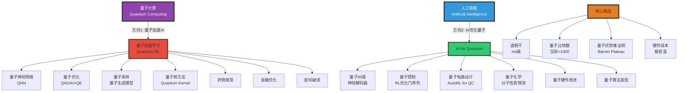
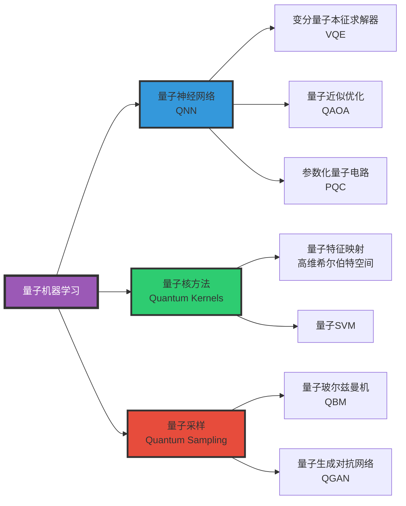

# 1.2 Quantum AI Computing

> **子主题编号**: 10.2
> **主题**: AI模型视角

> **子主题编号**: 10.2
> **主题**: AI模型视角
> **最后更新**: 2025-10-27
> **文档规模**: 860行 | 量子计算与AI的融合前景
> **阅读建议**: 本文介绍量子计算如何革新AI，包括量子机器学习和量子优化

---

## 1 核心概念深度分析

<details>
<summary><b>⚛️🧠 点击展开：量子AI全景深度解析</b></summary>

本节深入剖析量子计算基础、量子优势领域、双向融合路径、时间线预测与核心挑战。

### 1 ️⃣ 量子AI概念定义卡

**概念名称**: 量子AI（Quantum Artificial Intelligence）

**内涵（本质属性）**:

**🔹 核心定义**:
量子AI是量子计算与人工智能的交叉领域，包括两个方向：(1) 用量子计算加速AI算法；(2) 用AI优化量子计算系统。

$$
\text{量子AI} = \text{量子计算} \otimes \text{人工智能}
$$

**🔹 量子比特 vs 经典比特核心差异**:

| 维度 | 经典比特 | 量子比特 | 量子优势 |
|------|---------|---------|---------|
| **状态** | 0 或 1（离散） | α\|0⟩ + β\|1⟩（叠加） | 指数态空间 |
| **并行性** | 串行处理 | 量子并行 | 2^n状态同时计算 |
| **相关性** | 独立 | 量子纠缠 | 非局域关联 |
| **测量** | 无损读取 | 波函数坍缩 | 概率性输出 |
| **可复制** | 任意复制 | 不可克隆定理 | 信息保护 |
| **退相干** | 无 | 环境扰动易失 | 硬件瓶颈 |

**外延（范围边界）**:

| 维度 | 量子AI包含 ✅ | 不包含 ❌ |
|------|--------------|----------|
| **量子算法** | 量子机器学习、QNN、量子优化 | 经典神经网络 |
| **应用范围** | 量子化学、优化、采样 | 通用AI任务 |
| **时间线** | NISQ(2020s)、容错(2030s)、通用(2040s+) | 当前生产AI |
| **硬件** | 超导、离子阱、拓扑量子 | GPU/TPU |

**属性维度表**:

| 维度 | 值/描述 | 说明 |
|------|---------|------|
| **量子比特数** | 50-1000（NISQ） → 10^6（容错） | 当前vs目标 |
| **相干时间** | μs-ms级别 | 退相干瓶颈 |
| **量子优势** | 特定问题指数加速 | Shor、Grover算法 |
| **成熟度** | TRL 3-5（研究-试验） | 10-20年商用 |
| **主要玩家** | Google、IBM、Microsoft、IonQ | 量子军备竞赛 |

---

### 2 ️⃣ 量子计算 ⟷ AI 双向融合全景图



---

### 3 ️⃣ 量子AI vs 经典AI 十二维深度对比

| 维度 | 经典AI（当前） | 量子AI（未来） | 量子优势程度 |
|------|--------------|--------------|-------------|
| **1. 计算模型** | 图灵机（离散） | 量子图灵机（连续+叠加） | ⚠️⚠️⚠️⚠️⚠️ |
| **2. 状态空间** | n个比特 → 2^n状态（依次） | n个量子比特 → 2^n状态（同时） | **指数级** |
| **3. 搜索速度** | O(N)（线性） | O(√N)（Grover算法） | **二次加速** |
| **4. 因子分解** | 指数时间（RSA安全） | 多项式（Shor算法） | **指数加速** |
| **5. 优化问题** | 启发式（局部最优） | 量子退火（全局最优概率更高） | ⚠️⚠️⚠️ |
| **6. 采样** | 马尔可夫链（慢） | 量子采样（快） | ⚠️⚠️⚠️⚠️ |
| **7. 硬件** | GPU（成熟） | 超导（极低温，脆弱） | ❌ 劣势 |
| **8. 可扩展性** | 线性扩展 | 量子比特数瓶颈 | ❌ 劣势 |
| **9. 成熟度** | 生产就绪 | 研究阶段（NISQ） | ❌ 劣势 |
| **10. 通用性** | 通用AI | 特定问题加速 | ❌ 劣势 |
| **11. 成本** | 低（云计算） | 极高（稀释制冷） | ❌ 劣势 |
| **12. 时间线** | 现在 | 10-20年商用 | ⚠️ 未来 |

**关键洞察**:

$$
\begin{align}
\text{量子AI优势} &= \text{特定问题} \times \text{指数加速} \\
\text{量子AI劣势} &= \text{硬件不成熟} + \text{退相干} + \text{成本}
\end{align}
$$

**当前共识（2024）**:

- ✅ 理论上：某些问题可指数加速
- ❌ 实践上：NISQ设备噪声太大，量子优势难以实现
- ⚠️ 现状：量子优势仅在人工构造的问题上证明（Google 2019量子霸权）

---

### 4 ️⃣ 量子AI的三大应用领域深度分析

#### 1 领域1: 量子机器学习（QML）



**QML核心优势与局限**:

| 方法 | 理论优势 | 实际局限 | 适用场景 |
|------|---------|---------|---------|
| **量子神经网络QNN** | 指数参数空间 | Barren Plateau（梯度消失） | 小规模量子化学 |
| **量子核方法** | 高维特征空间 | 量子数据加载瓶颈 | 小样本学习 |
| **量子优化QAOA** | 避免局部最优 | 需深电路（噪声大） | 组合优化 |
| **量子采样** | 指数加速 | 验证采样正确性难 | 生成建模 |

#### 2 领域2: 量子化学与材料科学

| 问题 | 经典算法复杂度 | 量子算法复杂度 | 量子优势 |
|------|--------------|--------------|---------|
| **基态能量** | 指数O(2^n) | 多项式（VQE） | ✅✅✅ 指数 |
| **分子动力学** | O(N³) | O(N²)? | ⚠️ 多项式 |
| **材料性质预测** | DFT（近似） | 量子模拟（精确） | ✅✅ 精度 |

**应用案例**:

- **药物发现**: 模拟蛋白质折叠（IBM、Google）
- **催化剂设计**: 氮固定反应（Microsoft）
- **电池材料**: 锂电池电解质优化

#### 3 领域3: 优化问题

| 优化类型 | 经典方法 | 量子方法 | 时间线 |
|---------|---------|---------|--------|
| **组合优化** | 启发式（近似） | QAOA（更优） | 5-10年 |
| **金融投资组合** | 蒙特卡洛 | 量子蒙特卡洛 | 10-15年 |
| **物流路径** | TSP启发式 | 量子退火 | 试验中 |

---

### 5 ️⃣ 量子AI发展时间线与里程碑

| 时期 | 阶段 | 量子比特数 | 关键里程碑 | AI应用 | 成熟度 |
|------|------|-----------|-----------|--------|--------|
| **2020-2025<br/>NISQ早期** | 噪声中等量子 | 50-500 | Google量子霸权(2019)<br/>IBM 433 qubit(2022) | 概念验证 | TRL 3-4 |
| **2025-2030<br/>NISQ后期** | 噪声逐步降低 | 500-5000 | 实用量子纠错<br/>首个量子优势应用 | 量子化学<br/>小规模优化 | TRL 5-6 |
| **2030-2040<br/>容错量子** | 逻辑量子比特 | 10^4-10^6 | 通用容错量子计算<br/>Shor算法破解RSA | 量子机器学习<br/>大规模优化 | TRL 7-8 |
| **2040+<br/>通用量子** | 大规模量子 | 10^6+ | 量子互联网<br/>量子AI融合 | AGI加速?<br/>量子意识? | TRL 9 |

**关键转折点**:

```yaml
2019（量子霸权）:
  - Google Sycamore 53量子比特
  - 200秒 vs 超算1万年
  - 但是人工构造的问题，无实用价值
  → 证明：量子计算可行

2025-2030（实用量子优势）:
  - 容错量子比特 > 1000
  - 首个实用量子优势应用（化学/材料）
  - 量子纠错成熟
  → 转折点：从玩具到工具

2030-2040（量子AI融合）:
  - 量子机器学习进入生产
  - 量子加速特定AI任务（非通用）
  - 量子云服务普及
  → 变革：量子成为AI工具箱一部分

2040+（通用量子时代）:
  - 量子互联网
  - 量子安全威胁（Shor算法破解RSA）
  - 量子AI可能加速AGI?
  → 猜测：颠覆性变革
```

---

### 6 ️⃣ 量子AI的五大核心挑战

| 挑战 | 难度 | 当前进展 | 瓶颈 | 突破方向 |
|------|------|---------|------|---------|
| **1. 退相干** | ⚠️⚠️⚠️⚠️⚠️ | μs-ms级 | 环境噪声 | 拓扑量子、纠错码 |
| **2. 量子比特数** | ⚠️⚠️⚠️⚠️ | ~1000 | 制造工艺 | 模块化、离子阱 |
| **3. 量子优势证明** | ⚠️⚠️⚠️⚠️⚠️ | 仅人工问题 | Barren Plateau | 更好电路设计 |
| **4. 量子数据加载** | ⚠️⚠️⚠️⚠️ | O(N)瓶颈 | 经典→量子转换 | QRAM、量子传感 |
| **5. 硬件成本** | ⚠️⚠️⚠️⚠️ | $千万/台 | 稀释制冷 | 室温量子、云服务 |

**挑战详解**:

```yaml
挑战1: 退相干（根本性物理限制）
  问题: 量子态极易受环境干扰而"退相干"，从量子叠加变为经典混合态
  时间尺度:
    - 超导量子比特: 100 μs
    - 离子阱: 10 s
    - 拓扑量子（理论）: 更长
  影响: 限制电路深度 → 复杂算法无法运行
  方案:
    - 量子纠错: 用100+物理qubit编码1个逻辑qubit
    - 拓扑量子: 利用拓扑性质保护
  难度: ⚠️⚠️⚠️⚠️⚠️ 极高

挑战2: Barren Plateau（量子神经网络梯度消失）
  问题: 参数化量子电路（PQC）的梯度随qubit数指数衰减
  后果: 无法训练深量子神经网络
  数学:
    Var[∇θL] ∝ 1/2^n （n为qubit数）
  方案:
    - 局部电路
    - 预训练
    - 更好初始化
  难度: ⚠️⚠️⚠️⚠️⚠️ 极高（理论障碍）

挑战3: 量子数据加载瓶颈
  问题: 经典数据 → 量子态编码需O(N)时间
  后果: 抵消量子加速
  例子:
    - 量子机器学习需加载训练数据
    - 但数据加载本身就O(N)
    - 如果量子算法也只是O(log N)加速，总体无优势
  方案:
    - QRAM（量子随机访问存储）- 理论设备
    - 量子传感器直接生成量子数据
  难度: ⚠️⚠️⚠️⚠️ 高

挑战4: 成本与可扩展性
  当前:
    - IBM量子计算机: $1000万+
    - 需稀释制冷至10 mK（接近绝对零度）
    - 每台只有几百个qubit
  目标:
    - 百万qubit系统
    - 模块化量子计算机
  难度: ⚠️⚠️⚠️⚠️ 高（工程+成本）
```

---

### 1.7 🔟 核心洞察与终极评估

**五大核心定律**:

1. **量子优势特定性定律**
   $$
   \text{量子加速} \neq \text{通用加速}
   $$
   - 量子优势仅限特定问题（因子分解、量子化学）
   - 对通用AI任务（图像识别、NLP）无明显优势

2. **NISQ限制定律**
   $$
   \text{量子深度} \propto \text{相干时间} / \text{门时间}
   $$
   - 当前NISQ设备：深度 < 100层
   - 深度限制 → 复杂算法无法实现

3. **量子-经典互补定律**
   - 量子计算不会"替代"经典计算
   - 而是作为"协处理器"处理特定任务
   - 类比GPU之于CPU

4. **退相干-纠错权衡定律**
   $$
   \text{1逻辑qubit} \approx 100\text{-}1000\text{物理qubit}
   $$
   - 纠错overhead极大
   - 需百万物理qubit才能实现实用应用

5. **量子AI时间线保守定律**
   - 炒作期（2015-2020）已过
   - 现实期（2020-2030）：NISQ探索
   - 实用期（2030-2040）：容错量子
   - 通用期（2040+）：大规模量子AI

**终极洞察**:

> **"量子AI是长期愿景，而非近期现实。2024年，我们仍处于NISQ（噪声中等规模量子）时代，量子比特数<1000，相干时间<1ms，深度<100层。理论上，量子计算对特定问题（因子分解、量子化学、优化）可实现指数加速；实践上，退相干、Barren Plateau、量子数据加载瓶颈等问题使得量子优势难以在有实际价值的问题上证明。预计2030年代，随着容错量子计算的实现（百万量子比特），量子AI将在量子化学、药物发现、金融优化等特定领域展现价值。但量子计算不会'替代'经典AI，而是作为'协处理器'处理特定量子问题。至于量子AI能否加速AGI，这是更远的2040+年代的猜测。量子计算是未来，但这个未来至少还有10-20年。"**

**元认知**:

- **量子优势**: 特定问题可指数加速，但非通用
- **当前瓶颈**: 退相干、量子比特数、Barren Plateau
- **时间线**: 2030s容错量子，2040+通用量子
- **AI融合**: 量子作为协处理器，非替代品
- **炒作vs现实**: 长期潜力巨大，短期期望需谨慎
- **哲学意义**: 量子计算挑战Church-Turing论题?（争议）

</details>

---

## 📋 目录

- [量子AI计算：量子与AI的融合](#量子ai计算量子与ai的融合)
  - [1 核心概念深度分析](#1-核心概念深度分析)
    - [1 ️⃣ 量子AI概念定义卡](#1-️⃣-量子ai概念定义卡)
    - [2 ️⃣ 量子计算 ⟷ AI 双向融合全景图](#2-️⃣-量子计算--ai-双向融合全景图)
    - [3 ️⃣ 量子AI vs 经典AI 十二维深度对比](#3-️⃣-量子ai-vs-经典ai-十二维深度对比)
    - [4 ️⃣ 量子AI的三大应用领域深度分析](#4-️⃣-量子ai的三大应用领域深度分析)
      - [1 领域1: 量子机器学习（QML）](#1-领域1-量子机器学习qml)
      - [2 领域2: 量子化学与材料科学](#2-领域2-量子化学与材料科学)
      - [3 领域3: 优化问题](#3-领域3-优化问题)
    - [5 ️⃣ 量子AI发展时间线与里程碑](#5-️⃣-量子ai发展时间线与里程碑)
    - [6 ️⃣ 量子AI的五大核心挑战](#6-️⃣-量子ai的五大核心挑战)
    - [1.7 🔟 核心洞察与终极评估](#17--核心洞察与终极评估)
  - [📋 目录](#-目录)
  - [2 二、量子计算加速AI](#2-二量子计算加速ai)
    - [2.1 量子机器学习（QML）](#21-量子机器学习qml)
    - [2.2 量子神经网络（QNN）](#22-量子神经网络qnn)
    - [2.3 量子优化](#23-量子优化)
    - [2.4 量子采样与生成模型](#24-量子采样与生成模型)
    - [2.5 量子数据编码](#25-量子数据编码)
  - [3 三、AI帮助量子计算](#3-三ai帮助量子计算)
    - [3.1 量子纠错](#31-量子纠错)
    - [3.2 量子控制优化](#32-量子控制优化)
    - [3.3 量子电路设计](#33-量子电路设计)
    - [3.4 量子化学与材料](#34-量子化学与材料)
  - [4 四、量子AI的应用前景](#4-四量子ai的应用前景)
    - [4.1 近期应用（NISQ时代）](#41-近期应用nisq时代)
    - [4.2 中期应用（容错量子计算）](#42-中期应用容错量子计算)
    - [4.3 长期愿景（通用量子计算）](#43-长期愿景通用量子计算)
  - [5 五、量子AI的挑战](#5-五量子ai的挑战)
    - [5.1 硬件挑战](#51-硬件挑战)
    - [5.2 算法挑战](#52-算法挑战)
    - [5.3 理论挑战](#53-理论挑战)
    - [5.4 工程与成本](#54-工程与成本)
  - [6 六、当前进展](#6-六当前进展)
    - [6.1 主要玩家](#61-主要玩家)
    - [6.2 量子AI研究](#62-量子ai研究)
  - [7 七、时间线预测](#7-七时间线预测)
    - [7.1 量子计算发展](#71-量子计算发展)
    - [7.2 量子AI时间线](#72-量子ai时间线)
  - [8 八、结论](#8-八结论)
    - [1 核心要点](#1-核心要点)
    - [10.2 最终评估](#102-最终评估)
    - [10.3 哲学洞察](#103-哲学洞察)
  - [9 九、参考文献](#9-九参考文献)
    - [1 量子计算基础](#1-量子计算基础)
    - [11.2 量子机器学习](#112-量子机器学习)
    - [11.3 量子AI应用](#113-量子ai应用)
    - [11.4 量子软件](#114-量子软件)
  - [导航 | Navigation](#导航--navigation)
  - [相关主题 | Related Topics](#相关主题--related-topics)
    - [11.5 本章节](#115-本章节)
    - [11.6 相关章节](#116-相关章节)
    - [11.7 跨视角链接](#117-跨视角链接)

---


## 4 二、量子计算加速AI

### 2.1 量子机器学习（QML）

**潜在加速**：

| 任务 | 经典 | 量子 | 加速 |
|------|------|------|------|
| 线性系统求解 | O(N³) | O(log N) | 指数 |
| 主成分分析（PCA） | O(MN²) | O(polylog(MN)) | 指数 |
| 最近邻搜索 | O(N) | O(√N) | 平方 |
| 支持向量机（SVM） | O(N²) | O(log N) | 指数 |

**注意**：

- 理论加速
- 实际受限于噪声、量子RAM等
- "量子优势"（Quantum Advantage）尚未在实际ML任务上证明

### 2.2 量子神经网络（QNN）

**参数化量子电路（PQC）**：

```text
输入经典数据 → 编码为量子态 → 参数化量子门 → 测量 → 输出
```

**特点**：

- 参数：量子门旋转角度
- 训练：经典优化器（梯度下降）
- 输出：测量统计

**理论优势**：

- 指数级希尔伯特空间
- 潜在表达能力

**实际问题**：

- Barren Plateau（贫瘠高原）：梯度消失
- 测量噪声
- 可训练性

**例子**：

- **QCL（Quantum Convolutional Layer）**
- **QGAN（Quantum GAN）**
- **Quantum Boltzmann Machine**

### 2.3 量子优化

**QAOA（Quantum Approximate Optimization Algorithm）**：

**应用**：

- 组合优化
- MaxCut, TSP
- 调度问题

**混合量子-经典**：

- 量子：探索解空间
- 经典：优化参数

**潜力**：

- NP-hard问题加速
- 超参数优化
- 神经架构搜索

### 2.4 量子采样与生成模型

**量子优势场景**：

1. **玻尔兹曼分布采样**：
   - 经典：MCMC慢
   - 量子：量子退火
   - 应用：生成模型

2. **量子生成对抗网络（QGAN）**：
   - 生成器：量子电路
   - 潜在更丰富分布

3. **量子变分自编码器（QVAE）**：
   - 编码器：量子
   - 表示学习

### 2.5 量子数据编码

**挑战**：
> 如何将经典数据编码为量子态？

**方法**：

1. **基编码（Basis Encoding）**：

   ```text
   x ∈ {0,1}ⁿ → |x⟩

   例：5 = 101₂ → |101⟩
   ```

   - 简单，但需n个qubit编码n位

2. **振幅编码（Amplitude Encoding）**：

   ```text
   x = (x₁, ..., xₙ) → |ψ⟩ = Σᵢ xᵢ|i⟩ / ||x||
   ```

   - 指数压缩：2ⁿ维数据用n个qubit
   - 编码困难

3. **角度编码（Angle Encoding）**：

   ```text
   xᵢ → Ry(xᵢ)|0⟩
   ```

   - 常用于PQC

---

## 5 三、AI帮助量子计算

### 3.1 量子纠错

**问题**：

- 量子系统脆弱
- 退相干（Decoherence）
- 错误率高（~0.1-1%）

**量子纠错码（QEC）**：

- Surface Code
- Topological Code
- Logical Qubit = 数百到数千Physical Qubit

**AI应用**：

1. **深度学习预测错误**：
   - RNN预测错误模式
   - 优化纠错策略

2. **强化学习优化纠错**：
   - RL agent学习纠错策略
   - 适应动态错误

3. **神经网络解码器**：
   - 替代经典解码器
   - 更快、更准确

**例子**：

- [Fösel et al., 2018](https://journals.aps.org/prx/abstract/10.1103/PhysRevX.8.031084) - RL for Quantum Error Correction

### 3.2 量子控制优化

**问题**：

- 控制脉冲设计
- 最小化错误
- 快速门操作

**AI方法**：

1. **强化学习**：
   - 学习最优控制脉冲
   - Google: RL优化量子门保真度

2. **神经网络**：
   - 预测控制参数
   - 加速校准

### 3.3 量子电路设计

**挑战**：

- 设计高效量子电路
- 门数最少
- 适应硬件拓扑

**AI方法**：

1. **神经架构搜索（NAS）**：
   - 搜索量子电路架构
   - 优化性能

2. **图神经网络**：
   - 电路图表示
   - 学习优化

### 3.4 量子化学与材料

**量子模拟**：

- 分子能量
- 反应路径
- 材料性质

**AI加速**：

- 预测初始态
- 优化VQE参数
- 加速收敛

**应用**：

- 药物设计
- 催化剂
- 新材料

---

## 6 四、量子AI的应用前景

### 4.1 近期应用（NISQ时代）

**NISQ（Noisy Intermediate-Scale Quantum）**：

- 50-1000 qubits
- 无完全纠错
- 噪声显著

**可行应用**：

1. **变分量子算法**：
   - VQE, QAOA
   - 优化问题
   - 混合量子-经典

2. **量子机器学习探索**：
   - 小规模实验
   - 算法开发
   - 基准测试

3. **量子化学**：
   - 小分子模拟
   - 材料性质

**限制**：

- 量子优势有限
- 噪声限制
- 特定问题

### 4.2 中期应用（容错量子计算）

**容错量子计算（FTQC）**：

- 数千到数百万Physical Qubits
- 量子纠错
- 低错误率

**可能应用**：

1. **大规模优化**：
   - 物流、调度
   - 金融优化
   - 供应链

2. **机器学习加速**：
   - 训练加速
   - 大规模PCA
   - 量子核方法

3. **密码学**：
   - Shor算法破解RSA
   - 量子密钥分发（QKD）

4. **科学计算**：
   - 分子模拟
   - 气候建模
   - 材料发现

### 4.3 长期愿景（通用量子计算）

**特点**：

- 百万+ Logical Qubits
- 任意量子算法
- 高保真度

**革命性应用**：

1. **AGI加速**：
   - 量子神经网络
   - 大脑模拟
   - 认知架构

2. **科学革命**：
   - 高温超导机理
   - 量子引力理论
   - 生命起源

3. **技术突破**：
   - 室温超导材料
   - 高效催化剂
   - 核聚变

---

## 7 五、量子AI的挑战

### 5.1 硬件挑战

**1. 扩展性（Scalability）**：

**当前**：

- 最大：~1000 qubits
- 需要：数百万（容错）

**挑战**：

- 连接性
- 控制复杂性
- 制造一致性

**2. 相干时间（Coherence Time）**：

**当前**：

- 超导：100 μs
- 离子阱：数秒

**需要**：

- 长相干时间（>秒）
- 或更快门操作

**3. 错误率**：

**当前**：

- 单qubit门：0.1-1%
- 双qubit门：1-10%

**需要**：

- <0.01%（容错阈值）

**4. 冷却与控制**：

- 极低温（mK）
- 昂贵设备
- 复杂控制系统

### 5.2 算法挑战

**1. Barren Plateau**：

**问题**：

- 深度PQC梯度消失
- 训练困难

**缓解**：

- 浅层电路
- 局部成本函数
- 聪明初始化

**2. 量子RAM**：

**问题**：

- 经典数据→量子态
- 振幅编码困难

**影响**：

- 理论加速可能无法实现

**3. 噪声鲁棒性**：

**问题**：

- NISQ噪声大
- 算法需容错

**方法**：

- 噪声感知训练
- 错误缓解

### 5.3 理论挑战

**1. 量子优势证明**：

**问题**：

- 何时量子真的更快？
- 实际问题vs玩具问题

**现状**：

- 量子霸权（特定任务）
- 实际ML任务未证明

**2. 可学习性理论**：

**问题**：

- QML的理论基础
- 泛化能力
- 样本复杂度

**研究**：

- 量子PAC学习
- VC维扩展

### 5.4 工程与成本

**1. 成本**：

- 量子计算机：数千万到数亿美元
- 运行成本：高昂
- 云访问：昂贵

**2. 人才稀缺**：

- 量子物理+AI
- 交叉学科
- 教育滞后

**3. 软件栈**：

- 量子编程语言（Qiskit, Cirq）
- 开发工具不成熟
- 调试困难

---

## 8 六、当前进展

### 6.1 主要玩家

**科技巨头**：

1. **Google Quantum AI**：
   - 量子霸权（2019）
   - Sycamore处理器
   - Willow芯片（2023，错误率突破）

2. **IBM Quantum**：
   - 公开量子云
   - 433 qubit Osprey
   - 量子网络

3. **Microsoft Azure Quantum**：
   - 拓扑量子（研发）
   - 量子启发优化
   - 合作伙伴生态

4. **Amazon AWS Braket**：
   - 量子云平台
   - 多硬件访问

5. **Alibaba & Baidu**：
   - 量子云
   - 量子算法

**初创公司**：

1. **IonQ**：离子阱，高保真
2. **Rigetti**：超导，混合量子-经典
3. **Xanadu**：光量子
4. **PsiQuantum**：百万qubit目标
5. **D-Wave**：量子退火（特定问题）

### 6.2 量子AI研究

**学术进展**：

1. **Biamonte et al., 2017**：Quantum Machine Learning综述
2. **Schuld & Petruccione, 2018**：《Supervised Learning with Quantum Computers》
3. **Huang et al., 2021**：量子优势理论
4. **Google Quantum AI, 2023**：时间晶体、错误率突破

**开源框架**：

1. **Qiskit**（IBM）：
   - Python库
   - 量子电路设计
   - 机器学习模块

2. **Cirq**（Google）：
   - Python
   - NISQ算法
   - TensorFlow Quantum集成

3. **PennyLane**（Xanadu）：
   - 可微分量子编程
   - 与PyTorch/TensorFlow集成
   - 量子ML

4. **TensorFlow Quantum**（Google）：
   - 量子-经典混合
   - 量子数据处理

---

## 9 七、时间线预测

### 7.1 量子计算发展

**近期（2025-2030）**：

- NISQ设备：1000-5000 qubits
- 初步纠错
- 特定问题量子优势

**中期（2030-2040）**：

- 容错量子计算
- 1000-10,000 Logical Qubits
- 实用量子算法

**长期（2040+）**：

- 通用量子计算机
- 百万Logical Qubits
- 广泛应用

### 7.2 量子AI时间线

**近期**：

- 算法研究
- 小规模实验
- 基准测试
- 量子优势探索

**中期**：

- 特定ML任务加速
- 量子化学、优化
- 混合系统

**长期**：

- 通用量子ML
- AGI加速（？）
- 未知应用

**不确定性**：

- 技术突破难预测
- 可能比预期慢或快

---

## 10 八、结论

### 1 核心要点

1. **量子计算基础**：
   - Qubit：叠加、纠缠
   - 量子门、量子电路
   - 理论指数加速

2. **量子加速AI**：
   - QML：理论加速（待证明）
   - 量子神经网络
   - 量子优化

3. **AI帮助量子**：
   - 量子纠错
   - 控制优化
   - 电路设计

4. **应用前景**：
   - 近期：有限（NISQ）
   - 中期：优化、化学
   - 长期：革命性

5. **挑战**：
   - 硬件：扩展、噪声
   - 算法：Barren Plateau, 量子RAM
   - 理论：量子优势证明

6. **时间线**：
   - 实用量子AI：2030-2040
   - 通用量子计算：2040+
   - 高度不确定

### 10.2 最终评估

> **量子计算有潜力革命性地改变AI，但目前仍处于早期阶段。理论承诺巨大，实际挑战艰巨。**
>
> **近期，量子AI更多是研究方向而非实用工具。中长期，如果技术挑战被克服，量子AI可能在优化、化学、材料科学等领域带来突破。**
>
> **量子AI是AI未来的重要方向之一，但不是唯一路径。投资研究同时保持现实期望，是明智态度。**

### 10.3 哲学洞察

> **量子计算利用自然最深层的规律——量子力学——来进行计算。这是人类技术与基础物理的深度融合。**
>
> **量子AI不仅是工程挑战，更是科学探索：量子现象如何增强智能？经典与量子的边界在哪里？**
>
> **如果量子AI成功，将标志着人类智能技术进入"量子时代"，开启与自然更深层对话的新篇章。**

---

## 11 九、参考文献

### 1 量子计算基础

1. [Wikipedia: Quantum Computing](https://en.wikipedia.org/wiki/Quantum_computing)
2. [Nielsen & Chuang, 2010](https://www.cambridge.org/core/books/quantum-computation-and-quantum-information/01E10196D0A682A6AEFFEA52D53BE9AE) - Quantum Computation and Quantum Information
3. [Preskill, 2018](https://arxiv.org/abs/1801.00862) - Quantum Computing in the NISQ Era

### 11.2 量子机器学习

1. [Biamonte et al., 2017](https://www.nature.com/articles/nature23474) - Quantum Machine Learning
2. [Schuld & Petruccione, 2018](https://www.springer.com/gp/book/9783319964232) - Supervised Learning with Quantum Computers
3. [Huang et al., 2021](https://www.science.org/doi/10.1126/science.abk3333) - Power of Data in Quantum Machine Learning

### 11.3 量子AI应用

1. [Google Quantum AI, 2019](https://www.nature.com/articles/s41586-019-1666-5) - Quantum Supremacy
2. [Fösel et al., 2018](https://journals.aps.org/prx/abstract/10.1103/PhysRevX.8.031084) - Reinforcement Learning for Quantum Error Correction

### 11.4 量子软件

1. [Qiskit](https://qiskit.org/)
2. [TensorFlow Quantum](https://www.tensorflow.org/quantum)
3. [PennyLane](https://pennylane.ai/)

---

## 导航 | Navigation

**上一篇**: [← 10.1 AGI路径](./10.1_AGI_Pathways.md)
**下一篇**: [10.3 神经形态计算 →](./10.3_Neuromorphic_Computing.md)
**返回目录**: [↑ AI模型视角总览](../README.md)

---

## 相关主题 | Related Topics

### 11.5 本章节

- [10.1 AGI路径](./10.1_AGI_Pathways.md)
- [10.3 神经形态计算](./10.3_Neuromorphic_Computing.md)
- [10.4 AI意识研究](./10.4_AI_Consciousness_Research.md)
- [10.5 下一代架构](./10.5_Next_Generation_Architectures.md)

### 11.6 相关章节

- [01.1 图灵机与可计算性](../01_Foundational_Theory/01.1_Turing_Machine_Computability.md)
- [01.5 计算复杂度类](../01_Foundational_Theory/01.5_Computational_Complexity_Classes.md)
- [02.3 图灵完备性分析](../02_Neural_Network_Theory/02.3_Turing_Completeness_Analysis.md)
- [08.3 资源受限计算](../08_Comparison_Analysis/08.3_Resource_Bounded_Computation.md)

### 11.7 跨视角链接

- [Software_Perspective: 量子计算集成](../../Software_Perspective/10_Future_Directions/10.3_Quantum_Computing_Integration.md)
- [概念交叉索引（七视角版）](../../CONCEPT_CROSS_INDEX.md) - 查看相关概念的七视角分析：
  - [量子纠缠](../../CONCEPT_CROSS_INDEX.md#72-量子纠缠-quantum-entanglement-七视角) - 量子AI计算的核心资源
  - [Church-Turing论题](../../CONCEPT_CROSS_INDEX.md#57-church-turing论题-church-turing-thesis-七视角) - 量子计算对Church-Turing论题的挑战
  - [P vs NP问题](../../CONCEPT_CROSS_INDEX.md#151-p-vs-np问题-p-versus-np-problem-七视角) - 量子计算对复杂度类的影响

---

**最后更新**：2025-10-25

**状态**：✅ 完成

**质量**：前沿技术与理论分析结合
