# 10.3 Neuromorphic Computing

> **子主题编号**: 10.3
> **主题**: AI模型视角

> **最后更新**: 2025-10-27
> **文档规模**: 875行 | 类脑计算架构探索
> **阅读建议**: 本文探讨模仿生物神经系统的新型计算硬件和算法

---

## 1 核心概念深度分析

<details>
<summary><b>🧠⚡ 点击展开：神经形态计算全景深度解析</b></summary>

本节深入剖析类脑计算的原理、冯诺依曼瓶颈、SNN vs ANN、七大神经形态芯片与应用前景。

### 1 ️⃣ 神经形态计算概念定义卡

**概念名称**: 神经形态计算（Neuromorphic Computing）

**内涵（本质属性）**:

**🔹 核心定义**:
神经形态计算是模拟生物神经系统的结构（神经元、突触）和机制（脉冲、可塑性）的新型计算范式，通过事件驱动、内存计算一体化实现高能效智能。

$$
\text{神经形态计算} = \text{脉冲神经网络(SNN)} + \text{专用硬件} + \text{事件驱动}
$$

**🔹 冯诺依曼架构 vs 神经形态架构**:

| 维度 | 冯诺依曼（传统） | 神经形态（类脑） | 改进程度 |
|------|---------------|---------------|---------|
| **计算-存储** | 分离（CPU vs RAM） | 融合（突触=权重存储） | **质变** |
| **通信** | 总线（顺序） | 互联网络（并行） | 100-1000× |
| **精度** | 64位浮点 | 低精度/二值脉冲 | ⚠️ 劣化 |
| **功耗** | 100-300W（GPU） | **mW-W级** | 100-1000× |
| **计算模式** | 时钟驱动（同步） | 事件驱动（异步） | 质变 |
| **并行度** | 数千核（GPU） | 百万神经元 | 100-1000× |
| **学习** | 反向传播（离线） | 突触可塑性（在线） | 质变 |
| **带宽瓶颈** | ⚠️⚠️⚠️ 严重 | ✅ 本地计算 | 质变 |

**外延（范围边界）**:

| 维度 | 神经形态计算包含 ✅ | 不包含 ❌ |
|------|------------------|----------|
| **硬件** | TrueNorth、Loihi、Tianjic | GPU、TPU、传统CPU |
| **神经网络** | 脉冲神经网络(SNN) | ANN、CNN、Transformer |
| **应用** | 边缘AI、机器人、DVS | 云端训练、通用计算 |
| **时间线** | 2010s研究 → 2020s试验 | 主流AI（当前） |

**属性维度表**:

| 维度 | 值/描述 | 说明 |
|------|---------|------|
| **能效优势** | 100-1000× vs GPU | 人脑20W，GPU 300W |
| **神经元数量** | 10^6-10^9（芯片） | vs 人脑10^11 |
| **延迟** | μs-ms级 | 实时响应 |
| **成熟度** | TRL 4-6（试验-原型） | 距离生产5-10年 |
| **主要玩家** | IBM、Intel、清华、华为 | 学术+工业并行 |

---

### 2 ️⃣ 神经形态计算 vs 传统计算 vs 人脑 三维对比全景

```mermaid
graph TB
    VonNeumann[冯诺依曼架构<br/>1945-现在]
    Neuromorphic[神经形态计算<br/>2010s-未来]
    Brain[生物大脑<br/>终极目标]

    VonNeumann --> VN1[CPU+内存分离]
    VonNeumann --> VN2[时钟驱动<br/>同步计算]
    VonNeumann --> VN3[高精度<br/>64位浮点]
    VonNeumann --> VN4[高功耗<br/>100-300W]
    VonNeumann --> VN5[顺序总线<br/>带宽瓶颈]

    Neuromorphic --> NM1[内存计算一体<br/>突触=权重]
    Neuromorphic --> NM2[事件驱动<br/>异步脉冲]
    Neuromorphic --> NM3[低精度<br/>1-8位]
    Neuromorphic --> NM4[超低功耗<br/>mW-W级]
    Neuromorphic --> NM5[并行互联<br/>百万神经元]

    Brain --> B1[突触10^15<br/>神经元10^11]
    Brain --> B2[脉冲通信<br/>~100Hz]
    Brain --> B3[模拟+数字<br/>混合信号]
    Brain --> B4[极低功耗<br/>20W]
    Brain --> B5[可塑性<br/>终身学习]

    Gap1[差距1: 精度<br/>神经形态牺牲精度换能效]
    Gap2[差距2: 规模<br/>10^6 vs 10^11神经元]
    Gap3[差距3: 软件生态<br/>PyTorch vs SNN框架]

    style VonNeumann fill:#e74c3c,stroke:#333,stroke-width:4px
    style Neuromorphic fill:#3498db,stroke:#333,stroke-width:4px
    style Brain fill:#2ecc71,stroke:#333,stroke-width:4px
    style Gap1 fill:#e67e22,stroke:#333,stroke-width:3px
    style Gap2 fill:#e67e22,stroke:#333,stroke-width:3px
    style Gap3 fill:#e67e22,stroke:#333,stroke-width:3px
```



---

### 3 ️⃣ 七大神经形态芯片深度对比矩阵

| 芯片 | 机构 | 年份 | 神经元数 | 突触数 | 功耗 | 特点 | 成熟度 |
|------|------|------|---------|-------|------|------|--------|
| **TrueNorth** | IBM | 2014 | 1M | 256M | **70mW** | 完全异步、事件驱动 | TRL 6 |
| **Loihi 2** | Intel | 2021 | 1M | 120M | <100mW | 在线学习、14nm | TRL 6 |
| **SpiNNaker** | Manchester | 2013 | 1M | 1B | 1W | 通用ARM核、大规模 | TRL 6 |
| **BrainScaleS-2** | Heidelberg | 2019 | 512 | 128K | ~1W | 1000×加速、模拟 | TRL 4-5 |
| **Tianjic（天机）** | 清华 | 2019 | 40K | 10M | <1W | ANN+SNN混合 | TRL 5 |
| **Darwin** | 浙大 | 2012 | 2K | 4M | ~1W | 早期探索 | TRL 4 |
| **Akida** | BrainChip | 2021 | ? | ? | <1W | 商用芯片 | TRL 7 |

**关键洞察**:

```yaml
第一梯队（已商用/接近商用）:
  1. Loihi 2（Intel, 2021）:
     - 1M神经元，在线学习
     - 14nm工艺，<100mW
     - 软件生态Lava（Python）
     - 最成熟的研究平台

  2. TrueNorth（IBM, 2014）:
     - 首个百万神经元芯片
     - 70mW功耗（最低）
     - 完全异步、事件驱动
     - 但已停止更新

  3. Akida（BrainChip, 2021）:
     - 首个商用神经形态芯片
     - 面向边缘AI
     - TRL 7（生产就绪）

第二梯队（研究原型）:
  - SpiNNaker: 大规模模拟（百万神经元）
  - BrainScaleS: 超快模拟（1000×实时）
  - Tianjic: 中国首个ANN+SNN混合芯片

技术路线分歧:
  - 数字 vs 模拟 vs 混合
  - 同步 vs 异步
  - 通用 vs 专用
  - SNN纯粹 vs ANN混合

共同挑战:
  - 软件生态不成熟
  - SNN训练困难（无梯度）
  - 规模受限（vs人脑10^11神经元）
  - 商业应用场景有限
```

---

### 4 ️⃣ 脉冲神经网络(SNN) vs 人工神经网络(ANN) 十二维对比

| 维度 | ANN（传统） | SNN（神经形态） | 优劣对比 |
|------|-----------|----------------|---------|
| **1. 信息编码** | 实数激活值 | 二值脉冲序列 | SNN更生物 |
| **2. 时间特性** | 无时间维度 | 显式时间动态 | ✅ SNN时序建模 |
| **3. 能效** | 每次前向传播全激活 | 稀疏脉冲事件 | ✅✅ SNN 100×能效 |
| **4. 训练** | 反向传播（梯度） | STDP/代理梯度 | ❌ SNN训练难 |
| **5. 精度** | 32/64位浮点 | 1位脉冲 | ❌ SNN精度低 |
| **6. 性能** | SOTA（ImageNet 90%） | 70-80% | ❌ SNN性能差距 |
| **7. 硬件** | GPU/TPU（通用） | 专用神经形态芯片 | ⚠️ SNN硬件稀少 |
| **8. 软件生态** | PyTorch/TF（成熟） | snnTorch/Norse（初期） | ❌ SNN生态弱 |
| **9. 延迟** | ms-s级（批处理） | μs-ms级（事件驱动） | ✅ SNN低延迟 |
| **10. 在线学习** | 困难（需重训练） | 自然（突触可塑性） | ✅ SNN终身学习 |
| **11. 应用** | 云端、通用AI | 边缘、机器人、DVS | 互补 |
| **12. 生物可信度** | 低 | 高 | SNN更接近大脑 |

**关键权衡**:

$$
\begin{align}
\text{ANN} &= \text{性能最佳} + \text{生态成熟} - \text{高功耗} \\
\text{SNN} &= \text{超低功耗} + \text{低延迟} - \text{训练难} - \text{性能差距}
\end{align}
$$

**深度分析**:

```yaml
SNN的核心优势（无可替代）:
  1. 能效（100-1000×）:
     - ANN: 每次前向传播所有神经元激活
     - SNN: 只有脉冲神经元消耗能量（稀疏性）
     - 类比: ANN=广播，SNN=点对点

  2. 时序建模（天然优势）:
     - ANN: RNN/LSTM勉强处理时序
     - SNN: 脉冲时间编码、延迟敏感
     - 适用: 音频、视频、运动控制

  3. 低延迟（μs级）:
     - ANN: 需完成整批处理
     - SNN: 事件驱动，即时响应
     - 适用: 机器人、自动驾驶

SNN的致命劣势（阻碍推广）:
  1. 训练困难（根本性障碍）:
     - 脉冲不可微 → 无法反向传播
     - 代理梯度（surrogate gradient）: 近似方法
     - ANN-to-SNN转换: 性能损失10-20%

  2. 性能差距（10-20%）:
     - ImageNet: ANN 90%, SNN 70-80%
     - 原因: 低精度、训练困难
     - 趋势: 差距逐渐缩小

  3. 软件生态（鸡蛋问题）:
     - PyTorch: 数百万用户
     - snnTorch: 数千用户
     - 硬件稀缺 → 软件不成熟 → 应用少

当前共识（2024）:
  - SNN不会"替代"ANN
  - 而是"互补"：边缘AI、机器人等特定场景
  - 类比: SNN vs ANN ≈ RISC vs x86
```

---

### 5 ️⃣ 神经形态计算的五大应用领域

| 应用领域 | 适配度 | 关键优势 | 代表案例 | 时间线 |
|---------|-------|---------|---------|--------|
| **1. 边缘AI** | ✅✅✅✅✅ | 超低功耗、小体积 | 智能摄像头、IoT | 2025-2030 |
| **2. 动态视觉(DVS)** | ✅✅✅✅✅ | 事件驱动天然匹配 | DAVIS相机 | 已商用 |
| **3. 机器人** | ✅✅✅✅ | 低延迟、实时控制 | 无人机、四足机器人 | 2025-2030 |
| **4. 自动驾驶** | ✅✅✅ | 低功耗、低延迟 | 感知系统 | 2030+ |
| **5. 脑机接口** | ✅✅✅✅ | 生物兼容性 | 神经假肢 | 2030+ |

**杀手级应用：动态视觉传感器(DVS)**

```yaml
DVS工作原理:
  - 传统相机: 固定帧率（30/60 fps），每帧完整图像
  - DVS: 像素级事件驱动，仅报告亮度变化

  优势:
    - 超高时间分辨率（μs级 vs 30ms）
    - 超低功耗（mW vs W）
    - 高动态范围（120dB vs 60dB）
    - 无运动模糊

  SNN天然匹配:
    - DVS输出=脉冲序列
    - 直接输入SNN（无需转换）
    - 端到端事件驱动

  应用:
    - 高速机器人（捕捉、避障）
    - 自动驾驶（夜间、强光）
    - 手势识别
    - 星空导航

商业化:
  - iniVation（奥地利）: DAVIS相机
  - Prophesee（法国）: Metavision平台
  - Samsung: 已集成DVS到智能手机原型

成熟度: TRL 7-8（生产就绪）
```

**边缘AI应用矩阵**:

| 设备类型 | 功耗预算 | 延迟要求 | 神经形态适配度 | 示例 |
|---------|---------|---------|--------------|------|
| **IoT传感器** | <10mW | 秒级 | ✅✅✅✅✅ | 智能门锁、烟雾检测 |
| **可穿戴设备** | <100mW | 100ms | ✅✅✅✅ | 智能手表、助听器 |
| **智能摄像头** | <1W | 10ms | ✅✅✅✅ | 监控、安防 |
| **无人机** | <10W | 1ms | ✅✅✅ | 避障、导航 |
| **机器人** | <50W | 1ms | ✅✅✅ | 工业、服务机器人 |

---

### 6 ️⃣ 神经形态计算发展时间线与里程碑

| 时期 | 阶段 | 关键里程碑 | 代表芯片 | 成熟度 |
|------|------|-----------|---------|--------|
| **1980s-2000s<br/>理论萌芽** | Carver Mead提出 | 模拟VLSI神经形态 | 原型芯片 | TRL 1-2 |
| **2010-2015<br/>数字化突破** | 百万神经元芯片 | TrueNorth、SpiNNaker | 1M神经元 | TRL 5-6 |
| **2015-2020<br/>在线学习** | 可塑性、学习能力 | Loihi 1、BrainScaleS | STDP学习 | TRL 5-6 |
| **2020-2025<br/>商用试验** | 商用芯片、应用探索 | Loihi 2、Akida、Tianjic | 边缘AI | TRL 6-7 |
| **2025-2030<br/>规模化应用?** | 大规模部署、生态成熟? | 下一代芯片? | 智能设备普及? | TRL 8-9? |

**关键转折点**:

```yaml
2014（TrueNorth）:
  - IBM首个百万神经元芯片
  - 70mW功耗
  - 证明: 大规模数字神经形态可行
  → 转折点: 从理论到实用

2017-2021（Loihi 1→2）:
  - Intel在线学习能力
  - 软件生态Lava
  - 开放研究平台
  → 转折点: 从专用到通用

2021（Akida商用）:
  - BrainChip首个商用芯片
  - 面向边缘AI市场
  - 实际产品（非研究原型）
  → 转折点: 从研究到商业

2023-2024（停滞期）:
  - 大模型热潮（GPU为王）
  - 神经形态投资降温
  - 杀手级应用缺失
  → 挑战: 如何突破小众困境?

2025-2030（关键期）:
  - 若无突破性应用 → 小众市场
  - 若边缘AI爆发 → 主流技术
  - 预测: 70%概率仍小众，30%概率突破
```

---

### 1.7 🔟 核心洞察与终极评估

**五大核心定律**:

1. **能效-性能权衡定律**
   $$
   \text{能效} \propto \frac{1}{\text{精度}^2}
   $$
   - SNN牺牲精度换取100-1000×能效
   - 不可能同时高性能+超低功耗

2. **稀疏性定律**
   $$
   \text{能耗} \propto \text{活跃神经元比例}
   $$
   - 人脑同时活跃率<5%
   - SNN事件驱动实现稀疏激活
   - 关键: 信息稀疏编码

3. **应用适配定律**
   - SNN ≠ 通用AI（不如GPU）
   - SNN = 特定场景杀手（边缘、DVS、机器人）
   - 类比: GPU vs FPGA

4. **软硬件共生定律**
   - 硬件先行 → 软件跟不上
   - 软件不成熟 → 应用少 → 硬件需求低
   - 鸡蛋问题困扰10年

5. **生物启发渐进定律**
   - 当前SNN << 人脑复杂度
   - 突触10^6 vs 人脑10^15（差10^9倍）
   - 需数十年演进

**终极洞察**:

> **"神经形态计算代表了计算范式的根本性转变——从冯诺依曼的'时钟驱动、计算存储分离'到类脑的'事件驱动、内存计算一体'。其100-1000×能效优势是无可替代的，但10-20%的性能差距和训练困难是致命弱点。2024年，神经形态仍处于商用试验期（TRL 6-7），距离大规模部署还有5-10年。杀手级应用是动态视觉传感器(DVS)+边缘AI，而非通用云端AI。预测未来：神经形态不会'替代'GPU/TPU，而是'互补'——就像GPU未替代CPU，而是各司其职。神经形态的终极愿景是'类脑计算'，但当前实现与人脑差距仍有10^9倍（突触数量）。这不是5年的问题，而是50年的马拉松。"**

**元认知**:

- **核心优势**: 100-1000×能效、μs延迟、事件驱动
- **致命劣势**: 训练困难、性能差距、生态弱
- **杀手应用**: DVS、边缘AI、机器人
- **时间线**: 2025-2030规模化应用？仍不确定
- **与主流AI**: 互补而非替代（GPU仍主导）
- **哲学意义**: 计算范式的根本转变（vs冯诺依曼）

</details>

---

## 📋 目录

- [10.3 Neuromorphic Computing](#103-neuromorphic-computing)
  - [1 核心概念深度分析](#1-核心概念深度分析)
    - [1 ️⃣ 神经形态计算概念定义卡](#1-️⃣-神经形态计算概念定义卡)
    - [2 ️⃣ 神经形态计算 vs 传统计算 vs 人脑 三维对比全景](#2-️⃣-神经形态计算-vs-传统计算-vs-人脑-三维对比全景)
    - [3 ️⃣ 七大神经形态芯片深度对比矩阵](#3-️⃣-七大神经形态芯片深度对比矩阵)
    - [4 ️⃣ 脉冲神经网络(SNN) vs 人工神经网络(ANN) 十二维对比](#4-️⃣-脉冲神经网络snn-vs-人工神经网络ann-十二维对比)
    - [5 ️⃣ 神经形态计算的五大应用领域](#5-️⃣-神经形态计算的五大应用领域)
    - [6 ️⃣ 神经形态计算发展时间线与里程碑](#6-️⃣-神经形态计算发展时间线与里程碑)
    - [1.7 🔟 核心洞察与终极评估](#17--核心洞察与终极评估)
  - [📋 目录](#-目录)
  - [2 二、神经形态计算的基本原理](#2-二神经形态计算的基本原理)
    - [2.1 脉冲神经网络（SNN）](#21-脉冲神经网络snn)
    - [2.2 信息编码](#22-信息编码)
    - [2.3 突触可塑性](#23-突触可塑性)
  - [3 三、神经形态硬件](#3-三神经形态硬件)
    - [3.1 设计原则](#31-设计原则)
    - [3.2 主要神经形态芯片](#32-主要神经形态芯片)
      - [1 TrueNorth（IBM, 2014）](#1-truenorthibm-2014)
      - [2 Loihi 1/2（Intel, 2017/2021）](#2-loihi-12intel-20172021)
      - [3 SpiNNaker（Manchester, 2013）](#3-spinnakermanchester-2013)
      - [4 BrainScaleS（Heidelberg, 2011）](#4-brainscalesheidelberg-2011)
      - [5 Darwin（中国浙江大学, 2012）](#5-darwin中国浙江大学-2012)
      - [6 Tianjic（天机芯，清华大学, 2019）](#6-tianjic天机芯清华大学-2019)
      - [7 Akida（BrainChip, 2021）](#7-akidabrainchip-2021)
    - [3.3 新兴技术](#33-新兴技术)
  - [4 四、编程与软件栈](#4-四编程与软件栈)
    - [4.1 SNN训练挑战](#41-snn训练挑战)
    - [4.2 软件框架](#42-软件框架)
    - [4.3 应用开发](#43-应用开发)
  - [5 五、应用领域](#5-五应用领域)
    - [5.1 边缘AI](#51-边缘ai)
    - [5.2 动态视觉传感器（DVS）](#52-动态视觉传感器dvs)
    - [5.3 机器人与自主系统](#53-机器人与自主系统)
    - [5.4 神经科学与脑机接口](#54-神经科学与脑机接口)
    - [5.5 优化与搜索](#55-优化与搜索)
    - [5.6 其他应用](#56-其他应用)
  - [6 六、优势与挑战](#6-六优势与挑战)
    - [6.1 优势](#61-优势)
    - [6.2 挑战](#62-挑战)
  - [7 七、与传统AI的对比](#7-七与传统ai的对比)
    - [7.1 互补性](#71-互补性)
    - [7.2 融合趋势](#72-融合趋势)
  - [8 八、未来展望](#8-八未来展望)
    - [8.1 技术演进](#81-技术演进)
    - [8.2 应用前景](#82-应用前景)
    - [8.3 与AGI的关系](#83-与agi的关系)
  - [9 九、结论](#9-九结论)
    - [1 核心要点](#1-核心要点)
    - [11.2 最终评估](#112-最终评估)
    - [11.3 哲学洞察](#113-哲学洞察)
  - [10 十、参考文献](#10-十参考文献)
    - [1 综述与教材](#1-综述与教材)
    - [12.2 硬件](#122-硬件)
    - [12.3 SNN训练](#123-snn训练)
    - [12.4 软件](#124-软件)
  - [导航 | Navigation](#导航--navigation)
  - [相关主题 | Related Topics](#相关主题--related-topics)
    - [12.5 本章节](#125-本章节)
    - [12.6 相关章节](#126-相关章节)
    - [12.7 跨视角链接](#127-跨视角链接)

---


## 4 二、神经形态计算的基本原理

### 2.1 脉冲神经网络（SNN）

**与传统ANN的对比**：

| 特性 | 人工神经网络（ANN） | 脉冲神经网络（SNN） |
|------|------------------|------------------|
| **信号** | 实数（激活值） | 脉冲（Spike，0/1） |
| **时间** | 离散步 | 连续时间 |
| **信息编码** | 激活值大小 | 脉冲时间/频率 |
| **计算** | 加权和+激活 | 整合脉冲，阈值发放 |
| **能效** | 低 | 高（稀疏、事件驱动） |
| **生物真实性** | 低 | 高 |

**LIF（Leaky Integrate-and-Fire）神经元**：

```text
膜电位动力学：
τ dV/dt = -(V - V_rest) + R·I(t)

当 V ≥ V_threshold：
  - 发放脉冲
  - V 重置为 V_reset
  - 不应期（refractory period）

参数：
  τ: 时间常数
  V_rest: 静息电位
  V_threshold: 阈值
  R: 电阻
  I(t): 输入电流
```

**更复杂模型**：

- Hodgkin-Huxley：生物精确，计算昂贵
- Izhikevich：生物真实+计算高效平衡
- AdEx（Adaptive Exponential）

### 2.2 信息编码

**脉冲如何编码信息？**

1. **速率编码（Rate Coding）**：
   - 信息 = 脉冲频率
   - 高激活 → 高频脉冲
   - 简单，但慢

2. **时间编码（Temporal Coding）**：
   - 信息 = 脉冲精确时间
   - 快速
   - Time-to-First-Spike

3. **相位编码（Phase Coding）**：
   - 脉冲相对于参考振荡的相位
   - 高效

4. **群体编码（Population Coding）**：
   - 多个神经元编码一个变量
   - 鲁棒性

### 2.3 突触可塑性

**STDP（Spike-Timing-Dependent Plasticity）**：

```text
突触权重变化取决于突触前后脉冲时序：

Δw = A⁺ exp(-Δt/τ⁺)  若 Δt > 0（后脉冲在前脉冲后）  【增强】
Δw = -A⁻ exp(Δt/τ⁻)   若 Δt < 0（后脉冲在前脉冲前）  【抑制】

Δt = t_post - t_pre
```

**生物启发**：

- "同时激活的神经元，连接增强"（Hebb法则）
- 因果关系

**应用**：

- 在线学习
- 无需反向传播
- 局部学习规则

---

## 5 三、神经形态硬件

### 3.1 设计原则

**核心特性**：

1. **存内计算（In-Memory Computing）**：
   - 权重存储在内存/突触位置
   - 计算就地进行
   - 避免数据搬运

2. **事件驱动（Event-Driven）**：
   - 仅在有脉冲时计算
   - 稀疏活动（~1-10%神经元激活）
   - 低功耗

3. **异步并行**：
   - 无全局时钟
   - 神经元独立异步工作
   - 大规模并行

4. **模拟/数字/混合**：
   - 模拟：低功耗，但噪声、变异
   - 数字：精确，但功耗高
   - 混合：平衡

### 3.2 主要神经形态芯片

#### 1 TrueNorth（IBM, 2014）

**架构**：

- 1百万神经元
- 2.56亿突触
- 4096核心
- 70 mW功耗

**特点**：

- 全数字
- 事件驱动
- 实时视觉处理

**应用**：

- 图像识别
- 异常检测

#### 2 Loihi 1/2（Intel, 2017/2021）

**Loihi 2（2021）**：

- 1百万神经元
- 可编程
- 异步事件驱动
- 三态突触（Graded Spikes）

**特点**：

- 片上学习（STDP）
- 灵活可编程
- 研究平台

**应用**：

- 机器人控制
- 约束优化
- 嗅觉识别

#### 3 SpiNNaker（Manchester, 2013）

**架构**：

- 100万ARM核心
- 模拟10亿神经元
- 大脑模拟

**特点**：

- 数字
- 大规模并行
- 灵活

**应用**：

- 大脑建模
- 神经科学研究

#### 4 BrainScaleS（Heidelberg, 2011）

**特点**：

- 混合模拟-数字
- 加速运行（比生物快10⁴倍）
- 物理神经元模拟

**应用**：

- 神经科学
- 快速实验

#### 5 Darwin（中国浙江大学, 2012）

- 神经形态芯片
- 2048神经元
- 40万突触

#### 6 Tianjic（天机芯，清华大学, 2019）

**特点**：

- 混合架构（ANN + SNN）
- 156核心
- 自动驾驶demo

**意义**：

- 中国神经形态研究

#### 7 Akida（BrainChip, 2021）

**商业化**：

- 边缘AI
- 超低功耗
- SNN推理

### 3.3 新兴技术

**忆阻器（Memristor）**：

**特性**：

- 阻值"记忆"历史电流
- 非易失性
- 模拟突触

**优势**：

- 极高密度
- 低功耗
- 存内计算天然支持

**挑战**：

- 制造一致性
- 耐久性
- 编程精度

**公司**：

- Hewlett Packard Enterprise
- Crossbar
- 多家研究机构

**相变存储器（PCM）、自旋电子器件**：

- 类似忆阻器优势
- 研发中

---

## 6 四、编程与软件栈

### 4.1 SNN训练挑战

**问题**：

- 脉冲不可微（离散）
- 反向传播困难
- 时间动力学复杂

**方法**：

1. **代理梯度（Surrogate Gradient）**：
   - 用平滑函数近似脉冲
   - 允许梯度反传
   - 常用方法

2. **BPTT（Backpropagation Through Time）**：
   - 展开时间维度
   - 计算梯度
   - 内存密集

3. **ANN-to-SNN转换**：
   - 训练ANN
   - 转换为SNN
   - 精度损失

4. **直接SNN训练**：
   - SLAYER, DECOLLE等
   - 时空反向传播

5. **进化算法、强化学习**：
   - 无梯度
   - 适用于硬件在环

### 4.2 软件框架

**主要框架**：

1. **Brian2**（Python）：
   - 神经模拟
   - 灵活定义模型
   - 研究工具

2. **NEST**：
   - 大规模神经网络模拟
   - 神经科学

3. **BindsNET**（Python）：
   - SNN库
   - PyTorch集成

4. **Norse**（Python）：
   - PyTorch SNN
   - GPU加速

5. **Nengo**：
   - 神经建模
   - 支持多种硬件

6. **Intel Lava**（Loihi软件栈）：
   - Python
   - Loihi芯片编程

7. **Sinabs**：
   - PyTorch SNN
   - Akida集成

### 4.3 应用开发

**流程**：

```text
1. 模型设计
   ↓
2. 软件模拟（Brian, Norse）
   ↓
3. 训练（代理梯度, ANN转换）
   ↓
4. 部署到神经形态硬件
   ↓
5. 评估与优化
```

**挑战**：

- 工具链不成熟
- 学习曲线陡峭
- 调试困难

---

## 7 五、应用领域

### 5.1 边缘AI

**动机**：

- 边缘设备（IoT, 可穿戴）功耗受限
- 神经形态：μW-mW级功耗

**应用**：

1. **智能传感器**：
   - 视觉传感器（DVS）
   - 声音识别
   - 振动监测

2. **可穿戴设备**：
   - 健康监测（ECG, EEG分析）
   - 手势识别
   - 超低功耗

3. **无人机、机器人**：
   - 实时导航
   - 碰撞避免
   - 功耗敏感

### 5.2 动态视觉传感器（DVS）

**Event Camera（事件相机）**：

**原理**：

- 像素独立检测亮度变化
- 仅输出变化事件
- 异步、高时间分辨率（μs）

**优势**：

- 高动态范围
- 无运动模糊
- 低功耗、低带宽

**与SNN结合**：

- 天然匹配（都是事件驱动）
- 实时处理
- 极低延迟

**应用**：

- 高速机器人视觉
- 自动驾驶
- 监控

### 5.3 机器人与自主系统

**优势**：

- 实时性
- 低功耗
- 适应性学习

**应用**：

1. **感知-运动控制**：
   - SNN处理感知
   - 输出电机控制
   - 闭环实时

2. **导航**：
   - SLAM
   - 路径规划
   - 避障

3. **学习与适应**：
   - 在线学习（STDP）
   - 适应环境变化

**例子**：

- Loihi控制机械臂
- SpiNNaker机器人控制

### 5.4 神经科学与脑机接口

**脑仿真**：

- SpiNNaker, BrainScaleS
- 大规模神经网络模拟
- 理解大脑机制

**脑机接口（BCI）**：

- 神经信号处理
- 实时解码
- 低功耗（可植入）

**疾病建模**：

- 癫痫、帕金森
- 药物测试
- 治疗策略

### 5.5 优化与搜索

**组合优化**：

- 利用SNN动力学
- 约束满足问题
- TSP, 图着色

**Loihi LASSO**：

- 稀疏编码
- 优化问题

### 5.6 其他应用

1. **语音识别**：
   - 事件驱动音频
   - 低功耗关键词检测

2. **异常检测**：
   - 工业监控
   - 网络安全

3. **嗅觉识别**：
   - 电子鼻
   - 化学传感

---

## 8 六、优势与挑战

### 6.1 优势

**1. 极高能效**：

- 事件驱动 + 稀疏
- mW级推理（vs GPU数十W）
- 边缘设备理想

**2. 实时性**：

- 异步并行
- 低延迟（μs-ms）
- 适合控制任务

**3. 在线学习**：

- STDP等局部规则
- 持续适应
- 无需重新训练

**4. 生物真实性**：

- 理解大脑
- 神经科学研究

### 6.2 挑战

**1. 训练困难**：

- 不可微
- 算法不成熟
- 精度低于ANN

**2. 生态系统**：

- 工具链不完善
- 开发者少
- 学习资源少

**3. 硬件成本**：

- 专用芯片昂贵
- 规模小（相比GPU市场）
- 商业化难

**4. 性能证明**：

- 多数任务ANN + GPU仍占优
- Killer App未出现

**5. 标准化**：

- 缺乏统一标准
- 互操作性差

**6. 制造**：

- 模拟电路变异
- 忆阻器等新器件不成熟

---

## 9 七、与传统AI的对比

### 7.1 互补性

**传统ANN（GPU）**：

✅ **优势**：

- 训练成熟
- 生态完善
- 精度高
- 大规模模型

❌ **劣势**：

- 功耗高
- 推理成本高
- 无在线学习

**神经形态（SNN）**：

✅ **优势**：

- 功耗极低
- 实时性
- 在线学习
- 边缘友好

❌ **劣势**：

- 训练难
- 生态弱
- 精度待提升

### 7.2 融合趋势

**混合系统**：

- ANN训练，SNN推理
- ANN高层决策，SNN低层控制
- 各取所长

**例子**：

- Tianjic（ANN+SNN混合芯片）
- ANN-to-SNN转换

---

## 10 八、未来展望

### 8.1 技术演进

**近期（1-3年）**：

- 工具链成熟
- 更多商业芯片
- 边缘AI应用扩展

**中期（3-7年）**：

- 大规模神经形态系统（数十亿神经元）
- 忆阻器等新器件商用
- Killer App出现

**长期（7-15年）**：

- 神经形态成为主流（边缘、机器人）
- 与量子、光子计算融合
- 接近大脑规模仿真

### 8.2 应用前景

**最有希望**：

1. **边缘AI**：
   - IoT设备
   - 可穿戴
   - 智能传感器

2. **机器人**：
   - 实时控制
   - 感知-运动
   - 自主系统

3. **BCI**：
   - 医疗植入
   - 神经假体

4. **特定领域**：
   - DVS处理
   - 嗅觉、触觉

**挑战领域**：

- 大规模语言模型（ANN仍占优）
- 复杂推理（符号AI更合适）

### 8.3 与AGI的关系

**神经形态能否助力AGI？**

**可能贡献**：

- 高效推理（降低AGI运行成本）
- 在线学习（持续改进）
- 具身智能（机器人）

**限制**：

- 当前SNN表达能力不及Transformer
- 训练大模型仍需传统硬件
- AGI可能不需要完全模拟大脑

**结论**：

- 神经形态是AGI拼图的一部分
- 可能用于AGI的特定组件（感知、控制）
- 但非唯一路径

---

## 11 九、结论

### 1 核心要点

1. **神经形态计算模拟大脑**：
   - SNN（脉冲神经网络）
   - 事件驱动、稀疏
   - 存内计算

2. **主要优势**：
   - 极高能效（mW级）
   - 实时性（μs延迟）
   - 在线学习
   - 边缘友好

3. **主要挑战**：
   - 训练困难
   - 生态不成熟
   - 精度待提升
   - 商业化初期

4. **应用领域**：
   - 边缘AI（最有希望）
   - 机器人控制
   - DVS处理
   - BCI、神经科学

5. **与传统AI互补**：
   - 非替代关系
   - 混合系统
   - 各有所长

6. **未来展望**：
   - 边缘AI主流（5-10年）
   - 大规模系统（10-15年）
   - AGI组件（可能）

### 11.2 最终评估

> **神经形态计算是AI硬件的重要方向，特别是边缘AI和实时控制领域。它不会取代传统GPU，但将在特定场景下展现独特优势。**
>
> **近期看，神经形态仍是小众技术。中长期，随着工具链成熟、应用拓展，可能成为边缘AI的标准解决方案。**
>
> **神经形态提醒我们：大脑用20W达到的智能，我们用MW的GPU仍难以企及。向大脑学习，是AI效率提升的重要路径。**

### 11.3 哲学洞察

> **神经形态计算体现了"形式追随功能"的设计哲学。不是强行用硅片模拟神经元，而是理解大脑计算原理，用工程方法实现类似功能。**
>
> **这种方法提醒我们：生物演化的解决方案，经过亿万年优化，往往有深刻道理。工程师的谦卑，是向自然学习。**
>
> **最终，神经形态计算可能不会完全复制大脑，但会创造出"类脑"的新计算范式——既有生物启发，又有工程优化。这是人类智慧与自然智慧的对话。**

---

## 12 十、参考文献

### 1 综述与教材

1. [Wikipedia: Neuromorphic Engineering](https://en.wikipedia.org/wiki/Neuromorphic_engineering)
2. [Indiveri & Liu, 2015](https://ieeexplore.ieee.org/document/7347704) - Memory and Information Processing in Neuromorphic Systems
3. [Roy et al., 2019](https://www.nature.com/articles/s41586-019-1677-2) - Towards Spike-Based Machine Intelligence

### 12.2 硬件

1. [Merolla et al., 2014](https://www.science.org/doi/10.1126/science.1254642) - TrueNorth (IBM)
2. [Davies et al., 2018](https://ieeexplore.ieee.org/document/8259423) - Loihi (Intel)
3. [Pei et al., 2019](https://www.nature.com/articles/s41586-019-1424-8) - Tianjic (清华)

### 12.3 SNN训练

1. [Neftci et al., 2019](https://ieeexplore.ieee.org/document/8891809) - Surrogate Gradient Learning
2. [Diehl & Cook, 2015](https://www.frontiersin.org/articles/10.3389/fncom.2015.00099/full) - Unsupervised Learning with STDP

### 12.4 软件

1. [Stimberg et al., 2019](https://elifesciences.org/articles/47314) - Brian2
2. [Hazan et al., 2018](https://www.frontiersin.org/articles/10.3389/fninf.2018.00089/full) - BindsNET

---

## 导航 | Navigation

**上一篇**: [← 10.2 量子AI计算](./10.2_Quantum_AI_Computing.md)
**下一篇**: [10.4 AI意识研究 →](./10.4_AI_Consciousness_Research.md)
**返回目录**: [↑ AI模型视角总览](../README.md)

---

## 相关主题 | Related Topics

### 12.5 本章节

- [10.1 AGI路径](./10.1_AGI_Pathways.md)
- [10.2 量子AI计算](./10.2_Quantum_AI_Computing.md)
- [10.4 AI意识研究](./10.4_AI_Consciousness_Research.md)
- [10.5 下一代架构](./10.5_Next_Generation_Architectures.md)

### 12.6 相关章节

- [02.1 神经网络基础](../02_Neural_Network_Theory/02.1_Neural_Network_Foundations.md)
- [08.3 资源受限计算](../08_Comparison_Analysis/08.3_Resource_Bounded_Computation.md)
- [09.3 算力基础设施](../09_AI_Factory_Model/09.3_Computing_Infrastructure.md)

### 12.7 跨视角链接

- [Software_Perspective: 计算抽象层次](../../Software_Perspective/01_Foundational_Theory/01.2_Computational_Abstraction_Layers.md)
- [概念交叉索引（七视角版）](../../CONCEPT_CROSS_INDEX.md) - 查看相关概念的七视角分析：
  - [图灵完备性](../../CONCEPT_CROSS_INDEX.md#191-图灵完备性-turing-completeness-七视角) - 神经形态计算的计算能力
  - [Church-Turing论题](../../CONCEPT_CROSS_INDEX.md#57-church-turing论题-church-turing-thesis-七视角) - 神经形态计算的计算模型
  - [Landauer极限](../../CONCEPT_CROSS_INDEX.md#131-landauer极限-landauer-limit-七视角) - 神经形态计算的能耗优势

---

**最后更新**：2025-10-25

**状态**：✅ 完成

**质量**：技术深度与应用前景结合
