# 下一代AI架构：超越Transformer

> **文档版本**: v1.0.0  
> **最后更新**: 2025-10-27  
> **文档规模**: 926行 | 未来AI架构的探索方向  
> **阅读建议**: 本文展望Transformer之后的新一代神经网络架构创新

---

## 核心概念深度分析

<details>
<summary><b>🚀🔮 点击展开：下一代AI架构全景深度解析</b></summary>

本节深入剖析Transformer的六大局限、七大候选架构方向、五大技术挑战和未来演进时间线。

### 1️⃣ 下一代AI架构概念定义卡

**概念名称**: 下一代AI架构（Next-Generation AI Architectures）

**内涵（本质属性）**:

**🔹 核心定义**:
超越Transformer局限的新一代神经网络架构，目标是解决O(n²)复杂度、长上下文、持续学习、能效等核心问题。

$$
\text{下一代架构} = \text{Transformer优势} + \text{解决局限} + \text{新能力}
$$

**🔹 Transformer的六大局限**:

| 局限 | 表现 | 根本原因 | 影响 | 突破难度 |
|------|------|---------|------|---------|
| **1. O(n²)复杂度** | 长文本崩溃 | 全连接注意力 | ⚠️⚠️⚠️⚠️⚠️ | ⚠️⚠️⚠️⚠️ |
| **2. 固定上下文** | 超出窗口失效 | 位置编码限制 | ⚠️⚠️⚠️⚠️ | ⚠️⚠️⚠️ |
| **3. 无长期记忆** | 无法累积知识 | 无状态设计 | ⚠️⚠️⚠️⚠️ | ⚠️⚠️⚠️⚠️ |
| **4. 推理低效** | 自回归串行 | 逐token生成 | ⚠️⚠️⚠️⚠️⚠️ | ⚠️⚠️⚠️⚠️⚠️ |
| **5. 难建模层次** | 扁平表示 | 无层次结构 | ⚠️⚠️⚠️ | ⚠️⚠️⚠️ |
| **6. 能效低** | 计算密集 | 大规模矩阵运算 | ⚠️⚠️⚠️⚠️ | ⚠️⚠️⚠️⚠️ |

**外延（范围边界）**:

| 维度 | 下一代架构包含 ✅ | 不包含 ❌ |
|------|-----------------|----------|
| **架构类型** | SSM、MoE、混合架构、记忆增强 | 纯CNN、传统RNN |
| **设计目标** | 线性复杂度、长上下文、持续学习 | 仅优化现有Transformer |
| **时间线** | 2023-2030年研究 | 已成熟的2017 Transformer |

**属性维度表**:

| 维度 | 值/描述 | 说明 |
|------|---------|------|
| **候选数量** | 7+大方向 | SSM、MoE、混合等 |
| **成熟度** | TRL 2-5（研究到试验） | 多数未生产化 |
| **关键突破** | Mamba、Gemini 1M上下文 | 2023-2024重大进展 |
| **复杂度目标** | O(n) vs O(n²) | 线性vs二次 |
| **时间线** | 2025-2030主流化 | 逐步替代Transformer |

---

### 2️⃣ 七大候选架构全景对比

```mermaid
graph TB
    Transformer[Transformer 2017<br/>O&#40;n²&#41;复杂度]
    
    Transformer --> Path1[路径1: 高效注意力]
    Transformer --> Path2[路径2: 状态空间模型]
    Transformer --> Path3[路径3: 混合架构]
    Transformer --> Path4[路径4: 混合专家]
    Transformer --> Path5[路径5: 记忆增强]
    Transformer --> Path6[路径6: 层次结构]
    Transformer --> Path7[路径7: 新兴架构]
    
    Path1 --> Linear[线性注意力<br/>O&#40;n&#41;]
    Path1 --> Sparse[稀疏注意力<br/>O&#40;n·log n&#41;]
    Path1 --> LowRank[低秩注意力<br/>Linformer]
    
    Path2 --> S4[S4<br/>Gu et al. 2021]
    Path2 --> Mamba[Mamba<br/>Gu & Dao 2023]
    Path2 --> H3[H3<br/>Hungry Hungry Hippos]
    
    Path3 --> TransRNN[Transformer+RNN<br/>RWKV]
    Path3 --> TransSSM[Transformer+SSM<br/>混合]
    Path3 --> TransSym[Transformer+符号<br/>神经符号]
    
    Path4 --> MoE[混合专家<br/>Sparse Activation]
    MoE --> Switch[Switch Transformer]
    MoE --> GLaM[GLaM Google]
    
    Path5 --> NTM[Neural Turing Machine]
    Path5 --> DNC[Differentiable Computer]
    Path5 --> MemNet[Memory Networks]
    
    Path6 --> Tree[Tree Transformer]
    Path6 --> Graph[Graph Networks]
    
    Path7 --> RetNet[RetNet<br/>Microsoft 2023]
    Path7 --> Hyena[StripedHyena<br/>Together AI]
    Path7 --> Flash[Flash Decoding]
    
    Goal[下一代架构目标]
    
    Goal --> G1[O&#40;n&#41;复杂度 ✅]
    Goal --> G2[无限上下文 ✅]
    Goal --> G3[长期记忆 ✅]
    Goal --> G4[并行推理 ⚠️]
    Goal --> G5[层次建模 ✅]
    Goal --> G6[10×能效 ✅]
    
    style Transformer fill:#ff6b6b,stroke:#333,stroke-width:4px
    style Path2 fill:#ffd93d,stroke:#333,stroke-width:3px
    style Mamba fill:#6bcf7f,stroke:#333,stroke-width:3px
    style Goal fill:#4ecdc4,stroke:#333,stroke-width:4px
```



---

### 3️⃣ 七大候选架构详细对比矩阵

| 架构 | 复杂度 | 成熟度 | 优势 | 劣势 | 代表模型 | 商业化 |
|------|-------|--------|------|------|---------|--------|
| **1. 线性注意力** | O(n) | TRL 4-5 | 线性复杂度 | 性能略低 | Linformer, Performer | ⚠️ 试验 |
| **2. 稀疏注意力** | O(n·log n) | TRL 5-6 | 性能好 | 稀疏模式难设计 | Longformer, BigBird | ✅ 实用 |
| **3. 状态空间模型** | **O(n)** | TRL 4-6 | 线性+并行训练 | 理论复杂 | **Mamba, S4** | ⚠️⚠️ 崛起 |
| **4. 混合架构** | 混合 | TRL 4-5 | 优势互补 | 工程复杂 | RWKV, Jamba | ⚠️ 探索 |
| **5. 混合专家MoE** | O(n²) | TRL 7-8 | 10×参数2×计算 | 训练不稳定 | Switch-T, GPT-4 | ✅✅ 生产 |
| **6. 记忆增强** | O(n+m) | TRL 3-4 | 显式记忆 | 训练困难 | NTM, DNC | ❌ 研究 |
| **7. 层次结构** | 变化 | TRL 3-4 | 建模层次 | 不成熟 | Tree-T | ❌ 研究 |

**关键洞察**:

```yaml
最有前景（2024-2025）:
  1. Mamba（SSM）:
     - 线性复杂度O(n)
     - 性能逼近Transformer
     - 训练并行，推理高效
     - 挑战: 长期依赖、理论理解
  
  2. MoE（混合专家）:
     - 已生产化（GPT-4）
     - 10×参数，2×计算
     - 挑战: 负载均衡、通信开销
  
  3. 稀疏注意力:
     - 工程成熟
     - 128K上下文（Gemini）
     - 挑战: 仍是O(n·log n)

激进探索:
  - Transformer+SSM混合
  - 神经符号融合
  - 记忆增强（长期潜力）

保守优化:
  - Flash Attention（系统优化）
  - 低秩分解（工程技巧）
```

---

### 4️⃣ Transformer vs 下一代架构核心指标对比

| 指标 | Transformer（2017-2024） | Mamba（SSM, 2023） | 混合架构（未来） |
|------|------------------------|------------------|---------------|
| **训练复杂度** | O(n²·d) | O(n·d) | O(n·d) |
| **推理复杂度** | O(n²·d) | **O(d)** | O(d) |
| **最大上下文** | 2K-128K（工程优化） | 理论无限 | 理论无限 |
| **并行训练** | ✅✅✅ 极好 | ✅✅✅ 极好 | ✅✅ 好 |
| **推理速度** | 慢（自回归） | **快（O(1)生成）** | ⚠️ 依赖设计 |
| **长期依赖** | ✅✅ 好 | ⚠️ 中等 | ✅✅ 好 |
| **生态成熟度** | ✅✅✅ 极成熟 | ⚠️ 初期 | ❌ 无 |
| **能效** | 低（大矩阵） | **高（线性）** | 高 |
| **性能（PPL）** | **最佳** | 接近（90-95%） | ⚠️ 未知 |

**关键权衡**:

$$
\begin{align}
\text{Transformer} &: \text{性能最佳} + \text{生态成熟} - \text{O(n²)瓶颈} \\
\text{Mamba (SSM)} &: \text{线性复杂度} + \text{O(1)推理} - \text{长依赖问题} \\
\text{混合架构} &: \text{优势互补} - \text{工程复杂}
\end{align}
$$

---

### 5️⃣ 下一代架构时间线预测

| 时期 | 技术进展 | 代表里程碑 | 商业化 | 主流采用 |
|------|---------|-----------|--------|---------|
| **2023-2025<br/>短期** | SSM崛起、MoE生产化 | Mamba、Gemini 1M上下文 | MoE已用 | Transformer主导 |
| **2025-2028<br/>中期** | 混合架构成熟 | Transformer+SSM融合 | 混合架构 | 50% Transformer, 30% 混合, 20% SSM |
| **2028-2032<br/>长期** | 新范式确立 | 无限上下文、持续学习 | 全面转型 | 新架构主导 |

**关键转折点**:

```yaml
2024（当前）:
  - Mamba证明SSM可行性
  - GPT-4使用MoE
  - Gemini 1M上下文
  → Transformer仍主导，但裂痕出现

2025-2026（临界点）:
  - SSM性能追平Transformer
  - 混合架构大规模试验
  - 1M+上下文成标配
  → 多架构并存

2027-2030（新纪元）:
  - 新架构性能超越Transformer
  - 线性复杂度成标准
  - 持续学习突破
  → Transformer成"传统架构"

类比:
  Transformer (2017) → SSM/混合 (2027) 
  ≈ 
  RNN (2010) → Transformer (2017)
  时间跨度: ~10年一代
```

---

### 6️⃣ 五大技术挑战深度分析

| 挑战 | 难度 | 当前进展 | 关键瓶颈 | 突破方向 |
|------|------|---------|---------|---------|
| **1. 长上下文** | ⚠️⚠️⚠️⚠️ | 128K已实现 | 注意力O(n²)、KV cache | SSM、稀疏注意力 |
| **2. 持续学习** | ⚠️⚠️⚠️⚠️⚠️ | 灾难性遗忘 | 参数冻结、稳定性 | 动态架构、元学习 |
| **3. 因果推理** | ⚠️⚠️⚠️⚠️⚠️ | 纯相关学习 | 缺乏因果机制 | 神经符号、结构化 |
| **4. 多模态融合** | ⚠️⚠️⚠️ | 简单拼接 | 深度融合机制 | 统一Tokenization |
| **5. 可解释性** | ⚠️⚠️⚠️⚠️ | 黑盒 | 内部机制不明 | 机械解释、探针 |

**挑战详解**:

```yaml
挑战1: 长上下文（技术突破中）
  目标: 百万级token上下文
  现状:
    - Gemini: 1M tokens
    - Claude: 200K tokens
  问题:
    - 注意力O(n²): 计算爆炸
    - KV cache: 内存爆炸
  方案:
    - 稀疏注意力: O(n·log n)
    - SSM: O(n)
    - 压缩记忆

挑战2: 持续学习（根本性难题）
  目标: 像人类一样终身学习
  现状: 灾难性遗忘
  问题:
    - 新知识覆盖旧知识
    - 参数冻结（推理时）
  方案:
    - 弹性权重巩固
    - 记忆重放
    - 模块化架构
  难度: ⚠️⚠️⚠️⚠️⚠️ 极高

挑战3: 因果推理（理论障碍）
  目标: Pearl因果层次Level 2-3
  现状: Level 1（关联）
  问题:
    - 纯统计相关
    - 无反事实推理
  方案:
    - 神经符号融合
    - 因果图注入
    - 结构化归纳偏置
  难度: ⚠️⚠️⚠️⚠️⚠️ 极高

挑战4: 多模态融合（工程优化）
  目标: 统一表示
  现状: 模态分离处理
  方案:
    - 统一Tokenization
    - 跨模态注意力
  难度: ⚠️⚠️⚠️ 中高

挑战5: 可解释性（认知鸿沟）
  目标: 理解模型内部
  现状: 黑盒
  方案:
    - 机械解释性
    - 电路分析
  难度: ⚠️⚠️⚠️⚠️ 高
```

---

### 🔟 核心洞察与终极评估

**五大核心定律**:

1. **架构周期定律**
   $$
   \text{架构迭代周期} \approx 10\text{年}
   $$
   - RNN (2010) → Transformer (2017) → 下一代 (2027)
   - Transformer统治期: 2017-2027

2. **复杂度突破定律**
   $$
   O(n^2) \to O(n \cdot \log n) \to O(n)
   $$
   - 从二次到线性的必然演进
   - Mamba/SSM是关键突破

3. **性能-效率权衡定律**
   - 新架构初期: 性能90-95% Transformer
   - 但效率提升10-100×
   - 权衡逐步优化

4. **生态锁定定律**
   - Transformer生态极成熟
   - 新架构面临生态重建
   - 需3-5年生态成熟期

5. **多路径探索定律**
   - 无单一最优解
   - SSM、MoE、混合多路径并行
   - 最终可能融合

**终极洞察**:

> **"Transformer不是终点，而是AI架构演进的一个里程碑。2023-2024年Mamba（SSM）的崛起、Gemini的1M上下文、GPT-4的MoE架构，标志着下一代架构时代的到来。未来3-5年将是多架构并存、激烈竞争的时期——Transformer凭借成熟生态坚守阵地，SSM以线性复杂度挑战，MoE以稀疏激活扩展规模，混合架构探索优势融合。预计2027-2030年，新一代架构将主导AI领域，就像Transformer在2017年取代RNN一样。但与其说'超越Transformer'，不如说'站在Transformer的肩膀上'——Self-Attention的核心洞察（全局上下文建模）将以不同形式延续到下一代架构中。"**

**元认知**:
- **Transformer局限**: O(n²)、无状态、低能效
- **关键突破**: Mamba/SSM线性复杂度
- **时间线**: 2027-2030新架构主导
- **技术挑战**: 持续学习、因果推理最难
- **演进模式**: 10年一代架构周期
- **未来方向**: 多路径探索，最终融合

</details>

---

## 目录 | Table of Contents

- [下一代AI架构：超越Transformer](#下一代ai架构超越transformer)
  - [目录 | Table of Contents](#目录--table-of-contents)
  - [引言](#引言)
  - [一、Transformer的成功与局限](#一transformer的成功与局限)
    - [1.1 Transformer的成功](#11-transformer的成功)
    - [1.2 Transformer的局限](#12-transformer的局限)
      - [1. 二次复杂度（O(n²)）](#1-二次复杂度on)
      - [2. 固定上下文窗口](#2-固定上下文窗口)
      - [3. 无原生长期记忆](#3-无原生长期记忆)
      - [4. 推理效率低](#4-推理效率低)
      - [5. 难以建模层次结构](#5-难以建模层次结构)
      - [6. 能效低](#6-能效低)
  - [二、下一代架构的设计目标](#二下一代架构的设计目标)
    - [2.1 效率目标](#21-效率目标)
    - [2.2 能力目标](#22-能力目标)
    - [2.3 实用目标](#23-实用目标)
  - [三、候选架构](#三候选架构)
    - [3.1 高效注意力变体](#31-高效注意力变体)
      - [1. 线性注意力（Linear Attention）](#1-线性注意力linear-attention)
      - [2. 稀疏注意力（Sparse Attention）](#2-稀疏注意力sparse-attention)
      - [3. 低秩注意力（Low-Rank Attention）](#3-低秩注意力low-rank-attention)
    - [3.2 状态空间模型（SSM）](#32-状态空间模型ssm)
    - [3.3 混合架构](#33-混合架构)
      - [1. Transformer + RNN](#1-transformer--rnn)
      - [2. Transformer + SSM](#2-transformer--ssm)
      - [3. Transformer + 符号](#3-transformer--符号)
    - [3.4 混合专家（MoE）](#34-混合专家moe)
    - [3.5 记忆增强](#35-记忆增强)
      - [1. Neural Turing Machine (NTM)](#1-neural-turing-machine-ntm)
      - [2. Differentiable Neural Computer (DNC)](#2-differentiable-neural-computer-dnc)
      - [3. Memory Networks](#3-memory-networks)
    - [3.6 层次与结构化](#36-层次与结构化)
    - [3.7 其他新兴架构](#37-其他新兴架构)
      - [1. Retentive Network (RetNet, Microsoft, 2023)](#1-retentive-network-retnet-microsoft-2023)
      - [2. StripedHyena (Together AI, 2023)](#2-stripedhyena-together-ai-2023)
      - [3. Flash Decoding](#3-flash-decoding)
      - [4. Diffusion Transformer (DiT)](#4-diffusion-transformer-dit)
  - [四、关键技术方向](#四关键技术方向)
    - [4.1 长上下文建模](#41-长上下文建模)
    - [4.2 多模态融合](#42-多模态融合)
    - [4.3 因果与推理](#43-因果与推理)
    - [4.4 持续学习](#44-持续学习)
    - [4.5 可解释性](#45-可解释性)
  - [五、工程与系统挑战](#五工程与系统挑战)
    - [5.1 训练挑战](#51-训练挑战)
    - [5.2 优化挑战](#52-优化挑战)
    - [5.3 生态系统](#53-生态系统)
  - [六、时间线预测](#六时间线预测)
    - [6.1 短期（1-3年）](#61-短期1-3年)
    - [6.2 中期（3-7年）](#62-中期3-7年)
    - [6.3 长期（7-15年）](#63-长期7-15年)
  - [七、开放问题与研究方向](#七开放问题与研究方向)
    - [7.1 理论问题](#71-理论问题)
    - [7.2 实践问题](#72-实践问题)
    - [7.3 跨学科问题](#73-跨学科问题)
  - [八、结论](#八结论)
    - [核心要点](#核心要点)
    - [最终评估](#最终评估)
    - [哲学洞察](#哲学洞察)
  - [九、参考文献](#九参考文献)
    - [Transformer基础](#transformer基础)
    - [高效注意力](#高效注意力)
    - [状态空间模型](#状态空间模型)
    - [混合专家](#混合专家)
    - [记忆增强](#记忆增强)
    - [新兴架构](#新兴架构)

---

## 引言

**Transformer（2017）**革命性地改变了AI，但不是终点。本文档探讨下一代AI架构的研究方向、候选架构、技术挑战和未来展望，系统分析如何超越Transformer的局限。

**核心问题**：

1. Transformer的局限是什么？
2. 下一代架构需要解决什么问题？
3. 有哪些候选架构？
4. 技术挑战是什么？
5. 未来架构的发展方向？

---

## 一、Transformer的成功与局限

### 1.1 Transformer的成功

**革命性贡献**：

1. **自注意力机制**：
   - 捕获长程依赖
   - 全局感受野
   - 并行化训练

2. **规模定律**：
   - 性能随参数、数据指数增长
   - 涌现能力

3. **通用性**：
   - 语言、视觉、多模态
   - 统一架构

**应用**：

- GPT系列、BERT、T5
- Vision Transformer (ViT)
- Multimodal（CLIP, Flamingo）

### 1.2 Transformer的局限

#### 1. 二次复杂度（O(n²)）

**问题**：

```text
自注意力复杂度：O(n² × d)

n: 序列长度
d: 隐藏维度
```

**影响**：

- 长序列计算爆炸
- 内存占用巨大
- 限制上下文窗口

**当前缓解**：

- Sparse Attention
- Flash Attention（优化实现）
- 滑动窗口

#### 2. 固定上下文窗口

**问题**：

- GPT-4: 128K tokens
- Claude: 200K tokens
- 仍有限

**影响**：

- 长文档、代码库处理
- 无法真正"无限"上下文

#### 3. 无原生长期记忆

**问题**：

- 参数 = 隐式记忆
- 无显式、可扩展记忆
- 无法持续学习（静态参数）

**影响**：

- 知识截止日期
- 无法记住用户偏好（除非重新训练）

#### 4. 推理效率低

**问题**：

- 自回归：串行生成
- 每个token需完整前向传播
- 无投机、跳跃

**影响**：

- 生成速度慢
- 推理成本高

#### 5. 难以建模层次结构

**问题**：

- 平坦注意力
- 无显式层次
- 句子、段落、章节

**影响**：

- 长文本理解
- 结构化推理

#### 6. 能效低

**问题**：

- 计算密集
- 参数冗余
- 每次推理激活所有参数

**影响**：

- 能耗高
- 移动/边缘设备难

---

## 二、下一代架构的设计目标

### 2.1 效率目标

**1. 降低计算复杂度**：

- 从O(n²) → O(n) 或 O(n log n)
- 线性注意力

**2. 提高推理速度**：

- 并行生成
- 投机解码
- 早停机制

**3. 降低能耗**：

- 稀疏激活
- 混合专家（MoE）
- 神经形态

### 2.2 能力目标

**1. 无限上下文**：

- 真正长序列（百万tokens+）
- 可扩展记忆

**2. 持续学习**：

- 在线更新
- 无灾难性遗忘
- 终身学习

**3. 层次建模**：

- 显式层次结构
- 从词→句→段→文档

**4. 多模态融合**：

- 统一表示
- 跨模态推理

**5. 因果推理**：

- 超越相关性
- 反事实推理

### 2.3 实用目标

**1. 易训练**：

- 稳定训练
- 无Barren Plateau
- 低超参数敏感

**2. 易部署**：

- 压缩友好
- 量化友好
- 边缘设备可用

**3. 可解释**：

- 决策透明
- 可审计
- 可调试

---

## 三、候选架构

### 3.1 高效注意力变体

#### 1. 线性注意力（Linear Attention）

**目标**：O(n) 复杂度

**Performer（Choromanski et al., 2020）**：

```text
核方法近似：
Attention(Q, K, V) ≈ φ(Q) (φ(K)ᵀ V)

φ: 特征映射（Random Fourier Features）

复杂度：O(n × d²)（当d较小时接近线性）
```

**FNet（Lee-Thorp et al., 2021）**：

- 用傅里叶变换替代注意力
- O(n log n)
- 性能损失小

**RWKV（Peng et al., 2023）**：

- 结合RNN与Transformer优势
- 线性复杂度
- 推理快

#### 2. 稀疏注意力（Sparse Attention）

**Longformer（Beltagy et al., 2020）**：

- 滑动窗口 + 全局注意力
- O(n × w)，w = 窗口大小

**BigBird（Zaheer et al., 2020）**：

- 局部 + 全局 + 随机
- 图论启发

**Sparse Transformer（Child et al., 2019）**：

- 固定稀疏模式
- O(n√n)

#### 3. 低秩注意力（Low-Rank Attention）

**Linformer（Wang et al., 2020）**：

- 低秩分解K, V
- O(n)
- 近似误差

### 3.2 状态空间模型（SSM）

**核心思想**：
> 用连续时间状态空间模型替代注意力

**S4（Structured State Spaces, Gu et al., 2021）**：

**方程**：

```text
连续：
  ẋ(t) = Ax(t) + Bu(t)
  y(t) = Cx(t) + Du(t)

离散化 → 递归：
  xₜ = Āxₜ₋₁ + B̄uₜ
  yₜ = Cxₜ + Duₜ

复杂度：O(n)
```

**优势**：

- 线性复杂度
- 长序列（100K+）
- 卷积视角（训练并行）+ 递归视角（推理快）

**Mamba（Gu & Dao, 2023）**：

**改进S4**：

- 选择性状态空间
- 参数依赖输入
- 更好性能

**性能**：

- 在语言建模上接近Transformer
- 更高效

**挑战**：

- 训练技巧
- 超参数敏感

### 3.3 混合架构

#### 1. Transformer + RNN

**TransformerXL（Dai et al., 2019）**：

- 递归机制
- 相对位置编码
- 扩展上下文

**Universal Transformer（Dehghani et al., 2018）**：

- 递归深度（动态层数）
- 图灵完备（理论）

#### 2. Transformer + SSM

**H3（Hungry Hungry Hippos, Fu et al., 2023）**：

- SSM + 注意力
- 层次结构

**Hyena（Poli et al., 2023）**：

- 隐式参数化卷积
- O(n log n)
- 接近Transformer性能

#### 3. Transformer + 符号

**神经符号（Neurosymbolic）**：

- 神经网络感知
- 符号推理
- 结合优势

**例子**：

- Neural Theorem Provers
- Program Synthesis

### 3.4 混合专家（MoE）

**核心思想**：
> 大模型，稀疏激活

**架构**：

```text
输入 → Router（门控网络）→ 选择K个专家 → 聚合输出
```

**Switch Transformer（Fedus et al., 2021）**：

- 1.6T参数
- 每次只激活一个专家
- 训练快于稠密模型

**GLaM（Google, 2021）**：

- 1.2T参数
- MoE架构
- 高效

**优势**：

- 参数多，计算少
- 专家专业化

**挑战**：

- 负载均衡
- 通信开销（分布式）
- 训练不稳定

### 3.5 记忆增强

**显式外部记忆**：

#### 1. Neural Turing Machine (NTM)

**Graves et al., 2014**-

**组件**：

- 控制器（神经网络）
- 外部内存（矩阵）
- 读写头

**操作**：

- 基于内容寻址
- 可微分
- 可训练

#### 2. Differentiable Neural Computer (DNC)

**Graves et al., 2016**-

**改进NTM**：

- 动态内存分配
- 时间链接

**应用**：

- 问答
- 路径规划

#### 3. Memory Networks

**Weston et al., 2014**-

**组件**：

- 输入模块
- 记忆模块
- 泛化模块
- 输出模块

**应用**：

- 长文本QA
- 对话

**当前**：

- 向量数据库（RAG）
- 外挂记忆

### 3.6 层次与结构化

**层次Transformer**：

**Hierarchical Transformer（Liu et al., 2018）**：

- 多层次注意力
- 句子级 → 文档级

**分块（Chunking）**：

- 将长序列分块
- 块内Transformer + 块间聚合

**树结构**：

- Tree Transformer
- 递归网络
- 句法引导

### 3.7 其他新兴架构

#### 1. Retentive Network (RetNet, Microsoft, 2023)

**特点**：

- 保留机制
- 并行训练 + 递归推理
- O(1) 推理复杂度

**性能**：

- 接近Transformer
- 推理更快

#### 2. StripedHyena (Together AI, 2023)

**混合**：

- Attention + SSM + gating
- 长上下文（128K+）

#### 3. Flash Decoding

**算法优化**：

- 非架构，但重要
- 并行化解码
- 2-4倍加速

#### 4. Diffusion Transformer (DiT)

**生成模型**：

- Diffusion + Transformer
- 图像、视频生成

---

## 四、关键技术方向

### 4.1 长上下文建模

**目标**：百万tokens+

**方法**：

1. **高效注意力**：
   - 线性、稀疏、低秩

2. **记忆系统**：
   - 外部向量DB
   - 层次化压缩

3. **递归机制**：
   - RNN、SSM
   - 状态传递

4. **检索增强（RAG）**：
   - 动态检索相关内容
   - 扩展有效上下文

### 4.2 多模态融合

**目标**：统一视觉、语言、音频等

**方法**：

1. **统一tokenizer**：
   - 所有模态→统一token空间
   - 例：Gemini

2. **跨模态注意力**：
   - 模态间交互

3. **对齐学习**：
   - CLIP风格
   - 对比学习

**挑战**：

- 模态不平衡
- 融合策略

### 4.3 因果与推理

**目标**：超越关联，建模因果

**方法**：

1. **结构因果模型**：
   - Pearl因果框架
   - 图模型

2. **反事实推理**：
   - "如果...会怎样"
   - 干预建模

3. **符号整合**：
   - 神经符号
   - 逻辑推理

### 4.4 持续学习

**目标**：终身学习，无遗忘

**方法**：

1. **弹性权重巩固（EWC）**：
   - 重要参数保护

2. **渐进神经网络**：
   - 新任务新模块

3. **记忆回放**：
   - 存储旧样本
   - 定期重训

**挑战**：

- 灾难性遗忘
- 容量限制

### 4.5 可解释性

**目标**：理解模型决策

**方法**：

1. **注意力可视化**：
   - 看模型"关注"什么

2. **探针（Probing）**：
   - 检查内部表示

3. **因果干预**：
   - 修改激活，看影响

4. **稀疏模型**：
   - MoE天然可解释性

---

## 五、工程与系统挑战

### 5.1 训练挑战

**1. 新架构训练不稳定**：

- 超参数敏感
- 需要新技巧
- 经验积累不足

**2. 数据需求**：

- 新架构可能需要不同数据
- 课程学习

**3. 计算资源**：

- 实验新架构昂贵
- 需大规模验证

### 5.2 优化挑战

**1. 量化**：

- Transformer量化成熟
- 新架构量化研究少

**2. 推理优化**：

- 需要新的内核（Kernel）
- 硬件支持

**3. 分布式训练**：

- 新架构的并行策略
- 通信模式

### 5.3 生态系统

**1. 框架支持**：

- PyTorch, TensorFlow需集成
- 自定义算子

**2. 开发者教育**：

- 新架构学习曲线
- 文档、教程

**3. 社区采纳**：

- 需要killer应用
- 证明优势

---

## 六、时间线预测

### 6.1 短期（1-3年）

**渐进改进**：

- Flash Attention 3.0+
- 更好MoE
- 混合架构（Transformer + SSM）

**部分采纳**：

- 特定任务采用新架构（长上下文）
- Transformer仍主流

### 6.2 中期（3-7年）

**范式转移**：

- 新架构可能超越Transformer
- Mamba、RetNet等成熟
- 长上下文标配（百万tokens）

**混合时代**：

- 多种架构共存
- 任务特定选择

### 6.3 长期（7-15年）

**下下代架构**：

- 超越当前所有
- 可能融合量子、神经形态
- AGI级架构

**完全新范式**：

- 非神经网络？
- 未知技术

---

## 七、开放问题与研究方向

### 7.1 理论问题

**1. 架构的表达能力**：

- 不同架构的理论能力边界
- 通用逼近定理扩展

**2. 可学习性理论**：

- 哪些架构更易学习？
- 样本复杂度

**3. 涌现能力**：

- 能否预测涌现？
- 哪些架构更易涌现？

### 7.2 实践问题

**1. 训练稳定性**：

- 新架构训练技巧
- 超参数搜索

**2. 缩放定律**：

- 新架构的缩放规律
- 最优配置

**3. 基准测试**：

- 标准化评估
- 公平对比

### 7.3 跨学科问题

**1. 神经科学启发**：

- 大脑架构借鉴
- 注意力、记忆机制

**2. 认知科学**：

- 人类推理模式
- 层次处理

**3. 数学与物理**：

- 新的数学工具
- 物理启发（热力学、量子）

---

## 八、结论

### 核心要点

1. **Transformer局限**：
   - O(n²)复杂度
   - 固定上下文
   - 无长期记忆
   - 推理效率低

2. **设计目标**：
   - 效率：线性复杂度、低能耗
   - 能力：长上下文、持续学习、因果推理
   - 实用：易训练、可部署

3. **候选架构**：
   - 高效注意力（Linear, Sparse）
   - SSM（S4, Mamba）
   - 混合架构（Transformer + RNN/SSM）
   - MoE
   - 记忆增强
   - 层次结构

4. **关键方向**：
   - 长上下文
   - 多模态
   - 因果推理
   - 持续学习
   - 可解释性

5. **时间线**：
   - 短期：渐进改进
   - 中期：范式转移（可能）
   - 长期：完全新范式

6. **挑战**：
   - 训练稳定性
   - 生态系统
   - 理论理解

### 最终评估

> **Transformer是伟大架构，但不是终点。下一代架构将解决其局限，带来更高效、更强大、更通用的AI系统。**
>
> **近期看，Transformer仍占主导，但新架构（Mamba, RetNet等）正快速追赶。中期，我们可能见证范式转移。**
>
> **架构创新是AI进步的核心动力。下一代架构将决定AI的未来边界。**

### 哲学洞察

> **每一代AI架构反映了我们对智能本质的理解。从前馈网络到RNN，到Transformer，每次跃迁都源于新的洞察。**
>
> **Transformer揭示了"注意力"的力量——选择性关注是智能的核心。下一代架构将揭示什么？记忆？层次？因果？**
>
> **架构不仅是工程选择，更是智能理论的具体化。追求更好架构，本质是追问：智能的结构应该是什么样的？**
>
> **答案可能不止一个。未来的AI生态，可能是多种架构并存，各司其职——如生物界的多样性，而非单一范式的统治。**

---

## 九、参考文献

### Transformer基础

1. [Vaswani et al., 2017](https://arxiv.org/abs/1706.03762) - Attention Is All You Need

### 高效注意力

1. [Choromanski et al., 2020](https://arxiv.org/abs/2009.14794) - Performer
2. [Beltagy et al., 2020](https://arxiv.org/abs/2004.05150) - Longformer
3. [Zaheer et al., 2020](https://arxiv.org/abs/2007.14062) - BigBird

### 状态空间模型

1. [Gu et al., 2021](https://arxiv.org/abs/2111.00396) - S4 (Structured State Spaces)
2. [Gu & Dao, 2023](https://arxiv.org/abs/2312.00752) - Mamba
3. [Fu et al., 2023](https://arxiv.org/abs/2212.14052) - Hungry Hungry Hippos (H3)

### 混合专家

1. [Fedus et al., 2021](https://arxiv.org/abs/2101.03961) - Switch Transformers

### 记忆增强

1. [Graves et al., 2014](https://arxiv.org/abs/1410.5401) - Neural Turing Machine
2. [Graves et al., 2016](https://www.nature.com/articles/nature20101) - Differentiable Neural Computer

### 新兴架构

1. [Peng et al., 2023](https://arxiv.org/abs/2305.13048) - RWKV
2. [Sun et al., 2023](https://arxiv.org/abs/2307.08621) - Retentive Network (RetNet)

---

## 导航 | Navigation

**上一篇**: [← 10.4 AI意识研究](./10.4_AI_Consciousness_Research.md)  
**下一篇**: [AI模型视角总览 →](../README.md)  
**返回目录**: [↑ AI模型视角总览](../README.md)

---

## 相关主题 | Related Topics

### 本章节
- [10.1 AGI路径](./10.1_AGI_Pathways.md)
- [10.2 量子AI计算](./10.2_Quantum_AI_Computing.md)
- [10.3 神经形态计算](./10.3_Neuromorphic_Computing.md)
- [10.4 AI意识研究](./10.4_AI_Consciousness_Research.md)

### 相关章节
- [02.3 图灵完备性分析](../02_Neural_Network_Theory/02.3_Turing_Completeness_Analysis.md)
- [02.4 Transformer架构](../02_Neural_Network_Theory/02.4_Transformer_Architecture.md)
- [02.5 通用逼近定理](../02_Neural_Network_Theory/02.5_Universal_Approximation_Theorem.md)
- [03.3 Transformer LLM理论](../03_Language_Models/03.3_Transformer_LLM_Theory.md)
- [05.4 泛化理论](../05_Learning_Theory/05.4_Generalization_Theory.md)
- [06.5 混合神经符号系统](../06_Computational_Paradigms/06.5_Hybrid_Neurosymbolic_Systems.md)

### 跨视角链接
- [Software_Perspective: 计算抽象层次](../../Software_Perspective/01_Foundational_Theory/01.2_Computational_Abstraction_Layers.md)
- [Software_Perspective: 声明式vs命令式范式](../../Software_Perspective/01_Foundational_Theory/01.5_Declarative_Imperative_Paradigms.md)

---

**最后更新**：2025-10-25

**状态**：✅ 完成

**质量**：前沿技术综述与展望
