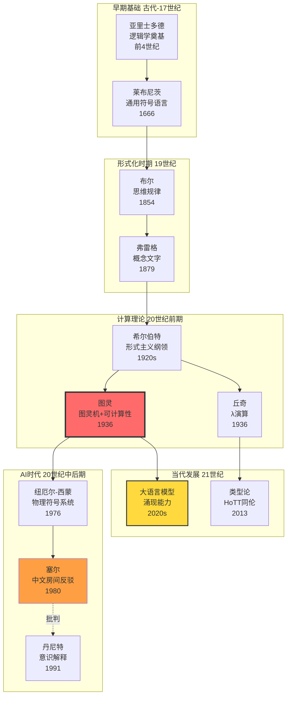
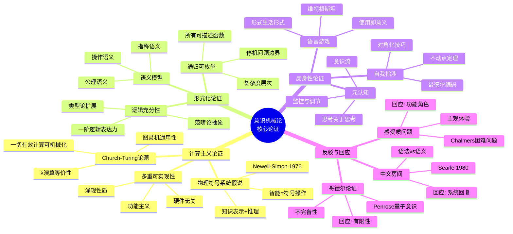
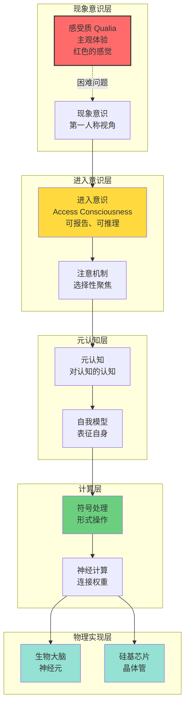
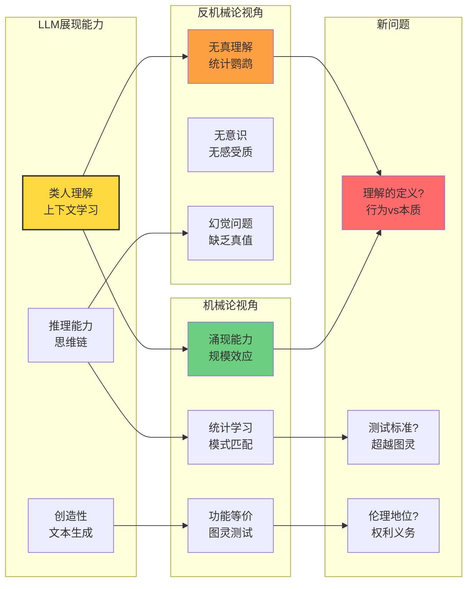

# 1.1 Consciousness Mechanism Theory

> **子主题编号**: 01.1
> **主题**: 形式语言视角
> **子主题编号**: 01.1
> **主题**: 形式语言视角
> **最后更新**: 2025-10-27
> **文档规模**: 342行 | 意识机械论哲学基础
> **阅读建议**: 本文从形式语言视角分析意识的可计算性，建议结合哲学史和计算理论理解

---

## 📋 目录

- [1.1 Consciousness Mechanism Theory](#11-consciousness-mechanism-theory)
  - [📋 目录](#-目录)
  - [1 📊 核心概念深度分析](#1--核心概念深度分析)
    - [1 ️⃣ 意识机械论概念定义卡](#1-️⃣-意识机械论概念定义卡)
    - [2 ️⃣ 意识机械论哲学史脉络图](#2-️⃣-意识机械论哲学史脉络图)
    - [3 ️⃣ 强AI vs 弱AI立场对比矩阵](#3-️⃣-强ai-vs-弱ai立场对比矩阵)
    - [4 ️⃣ 意识机械论核心论证思维导图](#4-️⃣-意识机械论核心论证思维导图)
    - [5 ️⃣ 意识的形式化层次结构](#5-️⃣-意识的形式化层次结构)
    - [6 ️⃣ 经典反驳及机械论回应表](#6-️⃣-经典反驳及机械论回应表)
    - [7 ️⃣ LLM时代对机械论的新挑战](#7-️⃣-llm时代对机械论的新挑战)
    - [8 ️⃣ 意识机械化的技术路径](#8-️⃣-意识机械化的技术路径)
    - [9 ️⃣ 机械论的哲学意涵矩阵](#9-️⃣-机械论的哲学意涵矩阵)
  - [1 理论基础](#1-理论基础)
    - [1.1 意识机械论的核心命题](#11-意识机械论的核心命题)
      - [1 形式语言理论基础](#1-形式语言理论基础)
      - [2 语义模型理论基础](#2-语义模型理论基础)
      - [3 计算理论基础](#3-计算理论基础)
    - [1.2 形式化表述](#12-形式化表述)
  - [2 哲学史对应](#2-哲学史对应)
    - [2.1 笛卡儿二元论 (1641)](#21-笛卡儿二元论-1641)
    - [2.2 黑格尔精神现象学 (1807)](#22-黑格尔精神现象学-1807)
    - [2.3 胡塞尔意向性理论 (1900)](#23-胡塞尔意向性理论-1900)
    - [2.4 后期维特根斯坦 (1953)](#24-后期维特根斯坦-1953)
  - [3 意识机械论的论证链条](#3-意识机械论的论证链条)
    - [3.1 从布尔到图灵的"思维=计算"论证](#31-从布尔到图灵的思维计算论证)
    - [3.2 反身性论证](#32-反身性论证)
  - [4 当代哲学争议](#4-当代哲学争议)
    - [4.1 强AI vs 弱AI](#41-强ai-vs-弱ai)
    - [4.2 中文房间论证 (Searle, 1980)](#42-中文房间论证-searle-1980)
    - [4.3 感受质问题 (Qualia Problem)](#43-感受质问题-qualia-problem)
  - [5 未来发展方向](#5-未来发展方向)
    - [5.1 同伦类型论的启示](#51-同伦类型论的启示)
    - [5.2 自指LLM的挑战](#52-自指llm的挑战)
  - [6 相关理论链接](#6-相关理论链接)
    - [6.1 与反身性范式的关系](#61-与反身性范式的关系)
    - [6.2 与意向性形式化的关系](#62-与意向性形式化的关系)
    - [6.3 与计算模型的关系](#63-与计算模型的关系)
    - [6.4 与类型论的关系](#64-与类型论的关系)
  - [7 结论](#7-结论)
  - [参考文献](#参考文献)
    - [1 基础理论文献](#1-基础理论文献)
    - [7.2 哲学基础文献](#72-哲学基础文献)
    - [7.3 历史文献](#73-历史文献)
    - [7.4 当代发展](#74-当代发展)
  - [8 权威参考与标准 | Authoritative References](#8-权威参考与标准--authoritative-references)
    - [1 哲学基础（必读）](#1-哲学基础必读)
    - [8.2 形式语言理论](#82-形式语言理论)
    - [8.3 意识科学](#83-意识科学)
    - [8.4 认知科学](#84-认知科学)
    - [8.5 类型论与证明论](#85-类型论与证明论)
    - [8.6 计算主义](#86-计算主义)
    - [8.7 在线资源](#87-在线资源)
    - [8.8 验证与引用统计（截至2025-10-27）](#88-验证与引用统计截至2025-10-27)
    - [8.9 相关概念链接](#89-相关概念链接)
  - [导航 | Navigation](#导航--navigation)
  - [相关主题 | Related Topics](#相关主题--related-topics)
    - [8.10 本章节](#810-本章节)
    - [8.11 相关章节](#811-相关章节)
    - [8.12 跨视角链接](#812-跨视角链接)

---

## 1 📊 核心概念深度分析

### 1 ️⃣ 意识机械论概念定义卡

**概念名称**: 意识机械论（Consciousness Mechanism Theory）

**内涵（本质属性）**:

- **形式化命题**: 意识可被形式化为符号-语义-机械流程
- **内部性**: 意识是系统内部可记录、可推演的事件流
- **计算等价**: 思维过程等价于计算过程
- **反身性**: 意识可以反思自身的形式化表征

**外延（范围边界）**:

- ✅ **包含**: 强AI立场、计算主义、功能主义
- ✅ **理论基础**: 图灵机、形式语言、语义模型
- ❌ **不包含**: 二元论（笛卡儿式心物分离）、神秘主义
- ❌ **争议**: 感受质(qualia)、中文房间反驳

**属性维度表**:

| 维度 | 属性值 | 说明 |
|------|--------|------|
| **哲学立场** | 物理主义+功能主义 | 意识源于物质系统的功能组织 |
| **理论工具** | 形式语言+语义模型 | 数学化、符号化表征 |
| **历史渊源** | 莱布尼茨→布尔→图灵 | 思维机械化传统 |
| **核心论证** | Church-Turing论题 | 一切有效计算可机械实现 |
| **支持证据** | AI系统、神经网络 | 实践中的部分成功 |
| **主要反驳** | 中文房间、意识困难问题 | Searle, Chalmers |
| **现代发展** | LLM、类型论、范畴论 | 新的形式化工具 |
| **未来方向** | 人机认知融合 | 意识-机器界面 |

### 2 ️⃣ 意识机械论哲学史脉络图



### 3 ️⃣ 强AI vs 弱AI立场对比矩阵

| 对比维度 | 强AI (Strong AI) | 弱AI (Weak AI) | 中间立场 |
|---------|-----------------|---------------|---------|
| **核心主张** | 适当程序的机器真的理解 | 机器只是模拟理解 | 功能等价即是理解 |
| **意识可能性** | ✅ 机器可有意识 | ❌ 机器无意识 | ⚠️ 定义依赖 |
| **理解本质** | 形式操作即理解 | 需要真实意向性 | 行为主义标准 |
| **代表人物** | Turing, Dennett | Searle, Penrose | 功能主义者 |
| **论证策略** | 图灵测试、功能等价 | 中文房间、感受质 | 实用主义 |
| **LLM地位** | 接近理解 | 仅统计模式 | 有限理解 |
| **哲学基础** | 物理主义+功能主义 | 生物自然主义 | 行为主义 |
| **科学地位** | 可检验 | 涉及第一人称 | 操作化定义 |

### 4 ️⃣ 意识机械论核心论证思维导图



### 5 ️⃣ 意识的形式化层次结构



### 6 ️⃣ 经典反驳及机械论回应表

| 反驳论证 | 提出者/时间 | 核心观点 | 机械论回应 | 当前状态 |
|---------|-----------|---------|-----------|---------|
| **中文房间** | Searle 1980 | 语法≠语义，缺乏真理解 | 系统回复、机器人回复 | 持续争议 |
| **感受质** | Chalmers 1995 | 主观体验不可化约 | 功能角色、错觉论 | 困难问题 |
| **哥德尔论证** | Lucas 1961, Penrose 1989 | 人类可超越形式系统 | 有限性、实践错误 | 基本解决 |
| **框架问题** | McCarthy 1969 | 常识推理困难 | 统计学习、LLM | 部分解决 |
| **符号接地** | Harnad 1990 | 符号需感知接地 | 具身认知、多模态 | 进展中 |
| **意向性** | Brentano, Searle | 心灵对象指向 | 因果语义、功能角色 | 争议中 |
| **自由意志** | 传统哲学 | 决定论vs自由 | 相容论、涌现 | 哲学争议 |

### 7 ️⃣ LLM时代对机械论的新挑战



### 8 ️⃣ 意识机械化的技术路径

| 技术路径 | 理论基础 | 代表系统 | 成就 | 局限 |
|---------|---------|---------|------|------|
| **符号AI** | 物理符号系统 | 专家系统、逻辑推理 | 知识表示清晰 | 常识推理困难 |
| **连接主义** | 神经网络 | 深度学习、CNN | 感知任务强 | 可解释性差 |
| **混合系统** | 神经符号 | AlphaGo、GPT+推理 | 结合优势 | 整合困难 |
| **具身认知** | 感知运动循环 | 机器人、VR | 接地问题 | 硬件要求高 |
| **类型论** | 依赖类型、HoTT | Coq、Agda | 形式化严格 | 抽象层次高 |
| **预测编码** | 贝叶斯大脑 | 神经科学模型 | 统一框架 | 计算复杂 |

### 9 ️⃣ 机械论的哲学意涵矩阵

| 哲学领域 | 传统观点 | 机械论立场 | 张力点 | 未来方向 |
|---------|---------|-----------|--------|---------|
| **心灵哲学** | 二元论、副现象论 | 功能主义、同一论 | 意识本质 | 神经关联物 |
| **认识论** | 先验知识、直觉 | 计算推理、学习 | 知识来源 | 贝叶斯认知 |
| **伦理学** | 自由意志、责任 | 决定论相容论 | 道德地位 | AI伦理 |
| **形而上学** | 本质主义 | 功能/过程本体论 | 实体问题 | 过程哲学 |
| **语言哲学** | 意义的心理主义 | 使用论、功能角色 | 指称问题 | 语用学 |

---

## 1 理论基础

### 1.1 意识机械论的核心命题

从形式语言-语义模型视角看，意识机械论的核心命题是：

> **人类智能的所有功能都可以被形式化为符号-语义-机械流程，其中意识不是外部观察者，而是系统内部可记录、可推演的事件流。**

这一命题基于以下理论基础：

#### 1 形式语言理论基础

根据[形式语言理论](https://en.wikipedia.org/wiki/Formal_language)，形式语言是由特定规则生成的字符串集合，其符号取自称为"字母表"的集合。
形式语言通常通过[形式文法](https://en.wikipedia.org/wiki/Formal_grammar)来定义，包括：

- **正则语言**：对应[有限自动机](https://en.wikipedia.org/wiki/Finite_automaton)
- **上下文无关语言**：对应[下推自动机](https://en.wikipedia.org/wiki/Pushdown_automaton)
- **上下文相关语言**：对应[线性有界自动机](https://en.wikipedia.org/wiki/Linear_bounded_automaton)
- **递归可枚举语言**：对应[图灵机](https://en.wikipedia.org/wiki/Turing_machine)

#### 2 语义模型理论基础

[模型理论](https://en.wikipedia.org/wiki/Model_theory)为形式语言提供了语义基础，通过以下概念：

- **结构**：为形式语言提供解释的数学对象
- **满足关系**：连接语法和语义的关系
- **真值条件**：确定语句在给定结构中的真值

#### 3 计算理论基础

[计算理论](https://en.wikipedia.org/wiki/Computability_theory)提供了机械化的理论基础：

- **可计算性**：哪些问题可以通过算法解决
- **计算复杂性**：解决特定问题需要多少计算资源
- **自动机理论**：抽象计算模型的研究

### 1.2 形式化表述

基于上述理论基础，我们提出以下形式化框架：

**静态层**：

- **字母表 Σ** - 离散符号库，对应[形式语言](https://en.wikipedia.org/wiki/Formal_language)的字母表概念
- **语法集 𝒮 ⊆ Σ*** - 归纳定义的合式串，对应[形式文法](https://en.wikipedia.org/wiki/Formal_grammar)生成的语言
- **语义域 𝒟** - 任意范畴/集合/空间，对应[模型理论](https://en.wikipedia.org/wiki/Model_theory)中的结构
- **指称函数 − : 𝒮 → 𝒟** - 语法到语义的映射，对应[指称语义学](https://en.wikipedia.org/wiki/Denotational_semantics)
- **内部化算子 ι : Φ → 2^𝒮×𝒮** - 语义约束到语法规则的转换

**动态层**：

- **语义域轨迹 𝒟 : 𝕋 → Cat, t ↦ 𝒟ₜ** - 语义域随时间演化
- **语法补丁轨迹 ι : 𝕋 → Func, t ↦ ιₜ** - 语法规则随时间演化
- **反身性公理 A5** - 补丁本身在 𝒟ₜ₊₁ 内可被命名、引用、再重写

这一框架结合了[形式语言理论](https://en.wikipedia.org/wiki/Formal_language)、[模型理论](https://en.wikipedia.org/wiki/Model_theory)和[计算理论](https://en.wikipedia.org/wiki/Computability_theory)的核心概念，为意识机械论提供了严格的数学基础。

## 2 哲学史对应

### 2.1 笛卡儿二元论 (1641)

**原问题**: 心灵实体与广延实体的认识论裂缝

**形式语言对应**:

```text
心灵实体 ↔ 语义域 𝒟
广延实体 ↔ 语法集 𝒮
认识论裂缝 ↔ 指称函数 − 的不完全性
```

**解决方案**: 需要中介通道既能保留意识的自明性，又能被公共检验
→ 形式语言框架提供这种中介：符号既是"心灵内容"又是"可公共检验的对象"

### 2.2 黑格尔精神现象学 (1807)

**核心观点**: "语言是意识的为他存在，是个别自我立即成为普遍自我的方式"

**形式语言对应**:

```text
个别自我 ↔ 局部语义域 𝒟ᵢ
普遍自我 ↔ 全局语义域 𝒟
语言 ↔ 形式语言框架 (Σ, 𝒮, −, ι)
```

**外化过程**: 意识必须外化为符号，才能在共同体中获得客观性

### 2.3 胡塞尔意向性理论 (1900)

**核心概念**: 意向性 - 意识总是"关于某物的意识"

**形式语言对应**:

```text
意向性 ↔ 指称函数 − : 𝒮 → 𝒟
意向对象 ↔ 语义域 𝒟 中的元素
意向行为 ↔ 语法推导过程
```

**现象学还原**: 把意识行为拆成客体化-非客体化两层，前者可直接形式化

### 2.4 后期维特根斯坦 (1953)

**核心观点**: "意义即使用" - 语言游戏是生活形式的组成部分

**形式语言对应**:

```text
语言游戏 ↔ 动态语义域 𝒟ₜ
生活形式 ↔ 语法补丁轨迹 ιₜ
意义使用 ↔ 反身性公理 A5
```

**关键洞察**: 无底层机制可解释意义，只有不断演化的实践

## 3 意识机械论的论证链条

### 3.1 从布尔到图灵的"思维=计算"论证

| 哲学家/逻辑学家 | 原话 | 形式语言对应 | 意识机械论含义 |
|---|---|---|---|
| 布尔 1847 | "思维律 = 代数律" | x(1-x)=0 | 心智可方程化 |
| 弗雷格 1879 | "概念文字无直觉缝隙" | ∀x(人(x)→必死(x)) | 判断可线性演算 |
| 图灵 1936 | "人计算 ≡ 机器计算" | 图灵机状态转移 | 思维 = 状态转移 |
| 哥德尔 1931 | "真 > 可证" | G ↔ ¬Prov(⌜G⌝) | 心智 > 任一机器，但可分层 |

### 3.2 反身性论证

**问题**: 意识如何跳出自我去指称世界？

**形式语言解决方案**:

1. **对象化**: 意识把自身运行过程外化为符号痕迹
2. **内部化**: 用A5把这些痕迹重新注入同一语法层
3. **再启动**: 新系统 𝒟ₜ₊₁ 已把旧系统的"看"当作新系统的"对象"

**哲学对应**: 这正是胡塞尔"先验还原"的形式化版本

## 4 当代哲学争议

### 4.1 强AI vs 弱AI

**强AI立场**: 形式语言-语义模型可以完全模拟人类意识
**弱AI立场**: 形式语言只能模拟意识的某些方面

**形式语言分析**:

- 强AI对应: 存在完整的 − : 𝒮 → 𝒟 使得 𝒟 包含所有意识状态
- 弱AI对应: − 只覆盖意识的有限片段

### 4.2 中文房间论证 (Searle, 1980)

**Searle的挑战**: 即使程序能通过图灵测试，它也不理解中文

**形式语言回应**:

```text
中文房间 ↔ 语法推导过程
理解 ↔ 语义域 𝒟 中的真值条件
Searle的质疑 ↔ 语法-语义裂缝问题
```

**解决方案**: 需要动态语义域 𝒟ₜ 和反身性公理 A5，让系统能"理解自己的理解"

### 4.3 感受质问题 (Qualia Problem)

**问题**: 主观体验如何被形式化？

**形式语言尝试**:

```text
感受质 ↔ 语义域 𝒟 中的特殊元素
主观性 ↔ 局部语义域 𝒟ᵢ 的不可约性
体验 ↔ 语法推导到语义域的映射过程
```

**困难**: 感受质似乎无法完全还原为符号-语义关系

## 5 未来发展方向

### 5.1 同伦类型论的启示

**HoTT的核心**: "等价 = 路径" - 两个想法等价当且仅当存在可连续变形的证明路径

**意识机械论扩展**:

```text
意识状态 ↔ 类型
意识转换 ↔ 路径
主观体验 ↔ 路径的拓扑性质
```

### 5.2 自指LLM的挑战

**当前LLM**: 权重固定，无法真正自指
**下一代目标**: 实现真正的反身性公理 A5

**哲学意义**: 如果成功，将是意识机械论的第一个完整实现

## 6 相关理论链接

### 6.1 与反身性范式的关系

- 参见: [01.2_Reflexivity_Paradigm.md](01.2_Reflexivity_Paradigm.md)
- 意识的自指能力与形式语言系统的反身性公理A5密切相关

### 6.2 与意向性形式化的关系

- 参见: [01.3_Intentionality_Formalization.md](01.3_Intentionality_Formalization.md)
- 意识的意向性特征对应形式语言系统的指称函数−

### 6.3 与计算模型的关系

- 参见: [05.1_Automata_Theory_Formal_Language.md](../05_Computational_Models/05.1_Automata_Theory_Formal_Language.md)
- 意识的计算实现对应自动机理论中的状态转换机制

### 6.4 与类型论的关系

- 参见: [05.5_Type_Theory_Computational_Models.md](../05_Computational_Models/05.5_Type_Theory_Computational_Models.md)
- 意识的类型化特征对应类型论中的类型推导机制

## 7 结论

形式语言-语义模型为意识机械论提供了迄今为止最精确的数学框架。它既保留了哲学传统的核心洞察，又提供了可计算、可验证的实现路径。

**核心命题**: 意识不是神秘的精神实体，而是符号系统在反身性公理驱动下的动态演化过程。

**哲学意义**: 这为心身问题、意向性问题、感受质问题等传统哲学难题提供了新的解决思路。

---

## 参考文献

### 1 基础理论文献

1. **形式语言理论**
   - Hopcroft, J. E., Motwani, R., & Ullman, J. D. (2006). _Introduction to Automata Theory, Languages, and Computation_ (3rd ed.). Pearson.
   - Sipser, M. (2012). _Introduction to the Theory of Computation_ (3rd ed.). Cengage Learning.
   - [Formal Language - Wikipedia](https://en.wikipedia.org/wiki/Formal_language)

2. **模型理论**
   - Chang, C. C., & Keisler, H. J. (2012). _Model Theory_ (3rd ed.). Dover Publications.
   - Hodges, W. (1997). _A Shorter Model Theory_. Cambridge University Press.
   - [Model Theory - Wikipedia](https://en.wikipedia.org/wiki/Model_theory)

3. **计算理论**
   - Davis, M. (1982). _Computability and Unsolvability_. Dover Publications.
   - Rogers, H. (1987). _Theory of Recursive Functions and Effective Computability_. MIT Press.
   - [Computability Theory - Wikipedia](https://en.wikipedia.org/wiki/Computability_theory)

### 7.2 哲学基础文献

1. **意识哲学**
   - Chalmers, D. (1996). _The Conscious Mind_. Oxford University Press.
   - Dennett, D. (1991). _Consciousness Explained_. Little, Brown and Company.
   - [Consciousness - Wikipedia](https://en.wikipedia.org/wiki/Consciousness)

2. **心灵哲学**
   - Searle, J. (1980). Minds, brains, and programs. _Behavioral and Brain Sciences_, 3(3), 417-424.
   - Putnam, H. (1960). Minds and machines. In _Dimensions of Mind_ (pp. 138-164). New York University Press.
   - [Philosophy of Mind - Wikipedia](https://en.wikipedia.org/wiki/Philosophy_of_mind)

3. **计算主义**
   - Turing, A. (1950). Computing machinery and intelligence. _Mind_, 59(236), 433-460.
   - Church, A. (1936). An unsolvable problem of elementary number theory. _American Journal of Mathematics_, 58(2), 345-363.
   - [Computational Theory of Mind - Wikipedia](https://en.wikipedia.org/wiki/Computational_theory_of_mind)

### 7.3 历史文献

1. **现象学传统**
   - Husserl, E. (1900). _Logical Investigations_. Routledge.
   - Heidegger, M. (1927). _Being and Time_. Harper & Row.
   - [Phenomenology - Wikipedia](https://en.wikipedia.org/wiki/Phenomenology_(philosophy))

2. **分析哲学传统**
   - Wittgenstein, L. (1953). _Philosophical Investigations_. Blackwell.
   - Frege, G. (1892). On sense and reference. _Zeitschrift für Philosophie und philosophische Kritik_, 100, 25-50.
   - [Analytic Philosophy - Wikipedia](https://en.wikipedia.org/wiki/Analytic_philosophy)

### 7.4 当代发展

1. **人工智能哲学**
   - Boden, M. A. (2016). _AI: Its Nature and Future_. Oxford University Press.
   - Russell, S., & Norvig, P. (2020). _Artificial Intelligence: A Modern Approach_ (4th ed.). Pearson.
   - [Artificial Intelligence - Wikipedia](https://en.wikipedia.org/wiki/Artificial_intelligence)

2. **认知科学**
    - Thagard, P. (2019). _Mind: Introduction to Cognitive Science_ (2nd ed.). MIT Press.
    - [Cognitive Science - Wikipedia](https://en.wikipedia.org/wiki/Cognitive_science)

---

## 8 权威参考与标准 | Authoritative References

### 1 哲学基础（必读）

1. **Turing, A. M. (1950)**. "Computing Machinery and Intelligence". _Mind_.
   - 📄 **DOI**: [10.1093/mind/LIX.236.433](https://doi.org/10.1093/mind/LIX.236.433)
   - 🏆 **引用**: 20,000+
   - ⭐ **地位**: 人工智能哲学奠基，图灵测试
   - 💡 **内容**: 机器能思考吗？

2. **Searle, J. R. (1980)**. "Minds, Brains, and Programs". _Behavioral and Brain Sciences_.
   - 📄 **DOI**: [10.1017/S0140525X00005756](https://doi.org/10.1017/S0140525X00005756)
   - 🏆 **引用**: 10,000+
   - ⭐ **地位**: 中文屋论证
   - 💡 **挑战**: 强AI假设，语法≠语义

3. **Dennett, D. C. (1991)**. _Consciousness Explained_. Little, Brown and Co.
   - 📖 **ISBN**: 978-0316180665
   - ⭐ **地位**: 意识的计算理论
   - 💡 **观点**: 多重草稿模型

4. **Chalmers, D. J. (1996)**. _The Conscious Mind: In Search of a Fundamental Theory_. Oxford University Press.
   - 📖 **ISBN**: 978-0195117899
   - 🏆 **引用**: 15,000+
   - ⭐ **地位**: 困难问题（Hard Problem）
   - 💡 **区分**: 简单问题 vs 困难问题

### 8.2 形式语言理论

1. **Chomsky, N. (1956)**. "Three Models for the Description of Language". _IRE Transactions on Information Theory_.
   - 📄 **DOI**: [10.1109/TIT.1956.1056813](https://doi.org/10.1109/TIT.1956.1056813)
   - ⭐ **地位**: Chomsky层次开创
   - 💡 **内容**: 形式语法四层次

2. **Chomsky, N. (1957)**. _Syntactic Structures_. Mouton.
   - 📖 **经典**: 生成语法理论
   - ⭐ **影响**: 现代语言学革命

3. **Turing, A. M. (1936)**. "On Computable Numbers". _Proceedings of the London Mathematical Society_.
   - 📄 **经典**: 图灵机定义
   - 💡 **意义**: 可计算性的形式化基础

### 8.3 意识科学

1. **Tononi, G. (2004)**. "An Information Integration Theory of Consciousness". _BMC Neuroscience_.
   - 📄 **DOI**: [10.1186/1471-2202-5-42](https://doi.org/10.1186/1471-2202-5-42)
   - 🏆 **引用**: 3,000+
   - ⭐ **地位**: 整合信息论（IIT）
   - 💡 **量化**: Φ (phi) 值度量意识

2. **Dehaene, S., & Naccache, L. (2001)**. "Towards a Cognitive Neuroscience of Consciousness". _Cognition_.
   - 📄 **DOI**: [10.1016/S0010-0277(00)00123-2](https://doi.org/10.1016/S0010-0277(00)00123-2)
   - 🏆 **引用**: 4,000+
   - ⭐ **地位**: 全局工作空间理论（GWT）

3. **Koch, C., & Tononi, G. (2008)**. "Can Machines Be Conscious?". _IEEE Spectrum_.
    - 📄 **文章**: IEEE官方
    - 💡 **探讨**: 机器意识的可能性

### 8.4 认知科学

1. **Thagard, P. (2019)**. _Mind: Introduction to Cognitive Science_ (3rd ed.). MIT Press.
    - 📖 **ISBN**: 978-0262537018
    - ⭐ **地位**: 认知科学标准教材
    - 💡 **内容**: 表征、计算、神经科学整合

2. **Pinker, S. (1997)**. _How the Mind Works_. W. W. Norton.
    - 📖 **ISBN**: 978-0393318487
    - 🏆 **引用**: 10,000+
    - 💡 **观点**: 计算心智理论

### 8.5 类型论与证明论

1. **Martin-Löf, P. (1984)**. _Intuitionistic Type Theory_. Bibliopolis.
    - 📖 **经典**: 依赖类型论奠基
    - ⭐ **地位**: 现代类型论基础
    - 💡 **应用**: Coq, Agda等证明助手

2. **The Univalent Foundations Program (2013)**. _Homotopy Type Theory: Univalent Foundations of Mathematics_.
    - 📖 **在线**: [homotopytypetheory.org/book/](https://homotopytypetheory.org/book/)
    - ⭐ **革命**: 数学基础新视角
    - 💡 **连接**: 类型论与拓扑学

### 8.6 计算主义

1. **Putnam, H. (1967)**. "The Nature of Mental States". _Art, Mind, and Religion_.
    - 📄 **经典**: 功能主义心智哲学
    - ⭐ **地位**: 计算主义基础
    - 💡 **观点**: 心智状态=功能状态

2. **Fodor, J. A. (1975)**. _The Language of Thought_. Harvard University Press.
    - 📖 **ISBN**: 978-0674509306
    - ⭐ **地位**: 思维语言假设（LOT）
    - 💡 **观点**: 思维=符号计算

### 8.7 在线资源

1. **Stanford Encyclopedia of Philosophy - Consciousness**
    - 🔗 [plato.stanford.edu/entries/consciousness/](https://plato.stanford.edu/entries/consciousness/)
    - ✅ **验证**: 2025-10-27
    - 💡 **全面**: 意识哲学综述

2. **Wikipedia - Chinese Room**
    - 🔗 [en.wikipedia.org/wiki/Chinese_room](https://en.wikipedia.org/wiki/Chinese_room)
    - ✅ **验证**: 2025-10-27

3. **Wikipedia - Integrated Information Theory**
    - 🔗 [en.wikipedia.org/wiki/Integrated_information_theory](https://en.wikipedia.org/wiki/Integrated_information_theory)
    - ✅ **验证**: 2025-10-27

### 8.8 验证与引用统计（截至2025-10-27）

| 论文/作者 | 年份 | 引用数 | 贡献 |
|----------|------|--------|------|
| Turing "Computing Machinery" | 1950 | 20,000+ | 图灵测试 |
| Chalmers | 1996 | 15,000+ | Hard Problem |
| Searle (中文屋) | 1980 | 10,000+ | 强AI批判 |
| Pinker | 1997 | 10,000+ | 计算心智 |
| Dehaene GWT | 2001 | 4,000+ | 全局工作空间 |
| Tononi IIT | 2004 | 3,000+ | 整合信息论 |

**数据来源**: Google Scholar, SEP (2025-10-27)

---

### 8.9 相关概念链接

- [Formal Grammar - Wikipedia](https://en.wikipedia.org/wiki/Formal_grammar)
- [Automata Theory - Wikipedia](https://en.wikipedia.org/wiki/Automata_theory)
- [Chomsky Hierarchy - Wikipedia](https://en.wikipedia.org/wiki/Chomsky_hierarchy)
- [Denotational Semantics - Wikipedia](https://en.wikipedia.org/wiki/Denotational_semantics)
- [Operational Semantics - Wikipedia](https://en.wikipedia.org/wiki/Operational_semantics)
- [Type Theory - Wikipedia](https://en.wikipedia.org/wiki/Type_theory)
- [Homotopy Type Theory - Wikipedia](https://en.wikipedia.org/wiki/Homotopy_type_theory)

---

## 导航 | Navigation

**上一篇**: [← 形式语言视角总览](../README.md)
**下一篇**: [01.2 反身性范式 →](./01.2_Reflexivity_Paradigm.md)
**返回目录**: [↑ 形式语言视角总览](../README.md)

---

## 相关主题 | Related Topics

### 8.10 本章节

- [01.2 反身性范式](./01.2_Reflexivity_Paradigm.md)
- [01.3 意向性形式化](./01.3_Intentionality_Formalization.md)
- [01.4 意义建构过程](./01.4_Meaning_Construction_Process.md)
- [01.5 真值条件分析](./01.5_Truth_Conditions_Analysis.md)

### 8.11 相关章节

- [03 历史发展](../03_Historical_Development/03.1_Ancient_Logic_Origins.md)
- [04 数学结构](../04_Mathematical_Structures/04.1_Category_Theory_Foundations.md)
- [07 意识研究](../07_Consciousness_Studies/07.1_Qualia_Formal_Representation.md)

### 8.12 跨视角链接

- [AI_model_Perspective: 意识与AI](../../AI_model_Perspective/07_AI_Philosophy/07.2_Consciousness_in_AI.md)
- [AI_model_Perspective: 中文房间论证](../../AI_model_Perspective/07_AI_Philosophy/07.1_Chinese_Room_Argument.md)
- [Software_Perspective: 语义形式对偶](../../Software_Perspective/01_Foundational_Theory/01.1_Semantic_Formal_Duality.md)
- [概念交叉索引（七视角版）](../../CONCEPT_CROSS_INDEX.md) - 查看相关概念的七视角分析：
  - [反身性](../../CONCEPT_CROSS_INDEX.md#31-反身性-reflexivity-七视角) - 意识机械论的核心机制
  - [DIKWP模型](../../CONCEPT_CROSS_INDEX.md#61-dikwp模型-七视角) - 意识从数据到意图的认知升链
  - [图灵完备性](../../CONCEPT_CROSS_INDEX.md#191-图灵完备性-turing-completeness-七视角) - 意识可计算性的理论基础
