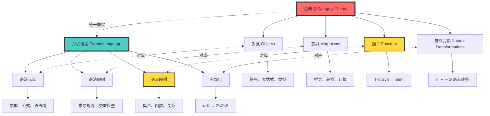
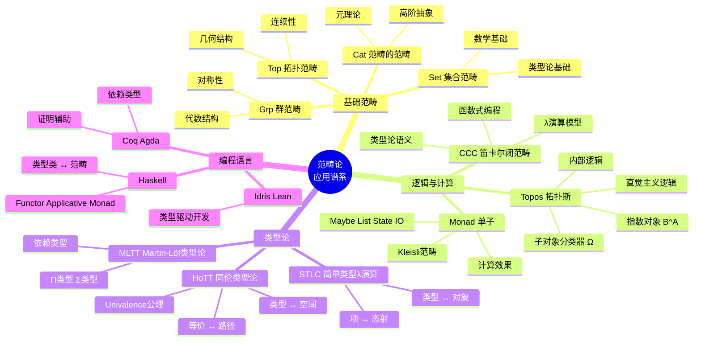
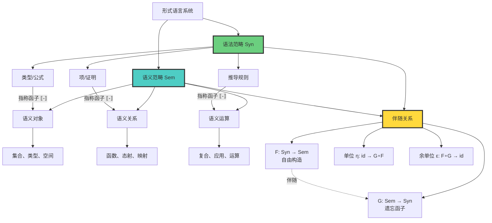
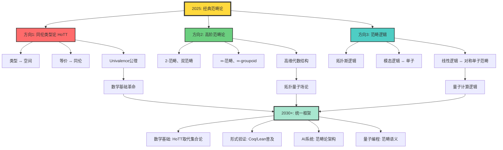

# 范畴论基础：形式语言的数学结构

> **文档版本**: v1.0.0  
> **最后更新**: 2025-10-27  
> **文档规模**: 466行 | 范畴论与形式语言的深度整合  
> **阅读建议**: 本文用范畴论统一形式语言的语法-语义结构，需要抽象代数和范畴论基础

---

## 核心概念深度分析

<details>
<summary><b>📊 点击展开：范畴论多维分析框架</b></summary>

本节提供范畴论基础的全景式深度分析，包括概念定义、核心对应关系、结构层次、特殊范畴应用、反身性表现和未来发展方向。

### 1️⃣ 范畴论概念定义卡

**概念名称**: 范畴论（Category Theory）

**内涵（本质属性）**:

**🔹 核心思想**:
- **对象与态射**: 研究抽象结构及其之间的关系，而非结构的内部细节
- **函子与自然变换**: 研究结构之间的映射及映射之间的变换
- **万物皆范畴**: 数学、逻辑、计算的统一语言

**🔹 基本定义**:
$$
\mathcal{C} = (\text{Ob}(\mathcal{C}), \text{Hom}(\mathcal{C}), \circ, \text{id})
$$

其中：
- $\text{Ob}(\mathcal{C})$: 对象集合
- $\text{Hom}(A, B)$: 从$A$到$B$的态射集合
- $\circ$: 态射复合，满足结合律
- $\text{id}_A$: 恒等态射，满足单位律

**🔹 核心概念**:
1. **函子**: $F: \mathcal{C} \rightarrow \mathcal{D}$ - 保持结构的映射
2. **自然变换**: $\eta: F \Rightarrow G$ - 函子之间的变换
3. **伴随**: $F \dashv G$ - 左伴随与右伴随的对偶关系
4. **极限**: 范畴中的"最佳"对象

**外延（范围边界）**:

| 维度 | 包含 ✅ | 不包含 ❌ |
|------|---------|----------|
| **研究对象** | 集合、群、拓扑、类型、逻辑 | 具体元素、内部结构 |
| **核心结构** | 对象、态射、函子、自然变换 | 点集、数值、算法 |
| **应用领域** | 类型论、逻辑、代数、拓扑、CS | 数值计算、统计分析 |
| **抽象层次** | 结构关系、映射保持性 | 具体实现、性能优化 |

**属性维度表**:

| 维度 | 值/描述 | 说明 |
|------|---------|------|
| **诞生时间** | 1945年 | Eilenberg & Mac Lane |
| **理论基础** | 抽象代数、拓扑学 | Grothendieck的代数几何 |
| **核心概念** | 对象、态射、函子、自然变换 | 四层抽象 |
| **抽象程度** | 极高 | "抽象的抽象" |
| **统一性** | 极强 | 数学各分支的统一语言 |
| **计算应用** | 类型论、FP、编译器 | Haskell、Coq、Agda |
| **哲学意义** | 结构主义数学观 | 关系优于对象 |
| **现代发展** | ∞-范畴、HoTT | 同伦类型论 |

---

### 2️⃣ 范畴论-形式语言对应全景图



---

### 3️⃣ 基本范畴结构三层次全景图

```mermaid
graph TB
    subgraph Level3["🔺 层次3: 自然变换层"]
        NT[自然变换 η: F ⇒ G]
        NT1[不同语义解释的转换]
        NT2["自然性: G(f) ∘ η_A = η_B ∘ F(f)"]
        NT3[内部化算子对应]
    end
    
    subgraph Level2["🔸 层次2: 函子层"]
        Functor[指称函子 -: Syn → Sem]
        F1[对象映射: A ∈ Ob(Sem)]
        F2[态射映射: f: A → B: A → B]
        F3[保持复合: g ∘ f = g ∘ f]
        F4[保持恒等: id_A = id_{A}]
    end
    
    subgraph Level1["🔹 层次1: 范畴层"]
        SynCat[语法范畴 Syn]
        SemCat[语义范畴 Sem]
        
        SynCat --> SynObj[对象: 符号、表达式、类型]
        SynCat --> SynMor[态射: 语法规则]
        
        SemCat --> SemObj[对象: 集合、函数、关系]
        SemCat --> SemMor[态射: 语义关系]
    end
    
    Level1 --> Level2
    Level2 --> Level3
    
    SynCat -.函子映射.-> SemCat
    Functor -.连接.-> SynCat
    Functor -.连接.-> SemCat
    
    style NT fill:#a8e6cf,stroke:#333,stroke-width:3px
    style Functor fill:#ffd93d,stroke:#333,stroke-width:3px
    style SynCat fill:#6bcf7f,stroke:#333,stroke-width:2px
    style SemCat fill:#4ecdc4,stroke:#333,stroke-width:2px
```

---

### 4️⃣ 范畴论核心概念多维对比矩阵

| 对比维度 | 对象 Objects | 态射 Morphisms | 函子 Functors | 自然变换 Nat Trans |
|---------|------------|---------------|---------------|-------------------|
| **抽象层次** | 0层：基本元素 | 0层：元素间关系 | 1层：范畴间映射 | 2层：函子间变换 |
| **形式定义** | $A \in \text{Ob}(\mathcal{C})$ | $f: A \rightarrow B$ | $F: \mathcal{C} \rightarrow \mathcal{D}$ | $\eta: F \Rightarrow G$ |
| **形式语言对应** | 语法元素 | 语法规则 | 语义映射 | 内部化算子 |
| **具体实例** | 类型、集合、空间 | 函数、推导、转换 | -指称语义 | 语义转换 |
| **保持性质** | - | 结合律、恒等 | 复合、恒等 | 自然性条件 |
| **复合操作** | - | $g \circ f$ | 函子复合 | 垂直/水平复合 |
| **类型论对应** | 类型 | 项/函数 | 类型间映射 | 多态函数 |
| **逻辑对应** | 命题 | 证明 | 逻辑系统映射 | 证明转换 |
| **编程对应** | 数据类型 | 函数 | 类型构造器 | 多态/泛型 |
| **代数结构** | 载体 | 运算 | 同态 | 同态间映射 |

---

### 5️⃣ 特殊范畴与应用领域思维导图



---

### 6️⃣ 语法-语义映射层次图



---

### 7️⃣ 范畴论在不同领域的应用矩阵

| 应用领域 | 对象 | 态射 | 函子示例 | 自然变换示例 | 核心定理/应用 |
|---------|------|------|---------|------------|-------------|
| **类型论** | 类型 | 类型化项 | 类型构造器 (List, Maybe) | 多态函数 | Curry-Howard对应 |
| **逻辑** | 命题 | 证明 | 模态算子 (□, ◇) | 证明转换 | Curry-Howard-Lambek |
| **代数** | 代数结构 | 同态 | 自由函子、遗忘函子 | 同态定理 | 泛性质 |
| **拓扑** | 拓扑空间 | 连续映射 | 同伦函子 | 同伦等价 | 代数拓扑不变量 |
| **FP编程** | 数据类型 | 函数 | Functor、Monad | fmap、flatMap | 函数式设计模式 |
| **编译器** | 语法树 | 变换规则 | 编译pass | 优化变换 | 语义保持性证明 |
| **数据库** | 数据库模式 | 查询 | Schema映射 | 查询重写 | 数据迁移正确性 |
| **分布式系统** | 系统状态 | 状态转换 | 复制策略 | 一致性协议 | CRDT、最终一致性 |
| **量子计算** | 希尔伯特空间 | 酉算子 | 量子门 | 量子纠错 | 拓扑量子计算 |
| **神经网络** | 层 | 权重矩阵 | 层组合 | 反向传播 | 可微分编程 |

---

### 8️⃣ 反身性在范畴论中的表现形式对比

| 反身性表现 | 范畴论形式 | 具体构造 | 形式语言对应 | 哲学意义 | 技术难度 |
|----------|-----------|---------|------------|---------|---------|
| **自指对象** | $\text{Self} \in \text{Ob}(\text{Self})$ | 包含自身的范畴 | 可谈论自身的语法元素 | 自我意识的数学表示 | ⭐⭐⭐ |
| **自函子** | $F: \mathcal{C} \rightarrow \mathcal{C}$ | 范畴到自身的函子 | 语义到语法的反馈 | 自我修改系统 | ⭐⭐ |
| **Lawvere不动点** | $\exists x. f(x) = x$ | 不动点组合子 | Y组合子、递归 | 自指悖论的统一处理 | ⭐⭐⭐⭐ |
| **范畴的范畴** | $\mathcal{C} \in \text{Ob}(\text{Cat})$ | Cat范畴 | 元形式语言 | 元理论的形式化 | ⭐⭐⭐⭐ |
| **高阶范畴** | $n$-范畴 | 2-Cat、∞-Cat | $n$层形式语言 | 无限层次的抽象 | ⭐⭐⭐⭐⭐ |
| **自伴随** | $F \dashv F$ | 自伴随函子 | 语法-语义完美对偶 | 对称性的极致 | ⭐⭐⭐⭐ |
| **Yoneda嵌入** | $\mathcal{C} \hookrightarrow [\mathcal{C}^{op}, \text{Set}]$ | 全忠实函子 | 语法的语义完整表示 | "对象即其关系" | ⭐⭐⭐⭐⭐ |

**难度评级**: ⭐(基础) ~ ⭐⭐⭐⭐⭐(极高)

---

### 9️⃣ 未来发展方向全景图



---

### 🔟 核心洞察与设计原则

**三大哲学洞察**:

1. **结构优于元素定律**
   $$
   \text{对象的本质} = \sum_{\text{所有态射}} \text{Hom}(-, A)
   $$
   - Yoneda引理: 对象完全由其与其他对象的关系决定
   - 反本质主义: 关系先于实体

2. **函子保持结构定律**
   $$
   F(g \circ f) = F(g) \circ F(f) \quad \land \quad F(\text{id}_A) = \text{id}_{F(A)}
   $$
   - 语义映射的结构保持性
   - 形式语言的可组合性

3. **伴随产生万物定律**
   $$
   \text{Hom}_{\mathcal{D}}(F(A), B) \cong \text{Hom}_{\mathcal{C}}(A, G(B))
   $$
   - 语法-语义的对偶关系
   - 自由-遗忘的泛性质

**设计原则**:

```yaml
原则1_抽象优先:
  描述: 关注结构关系，而非内部实现
  应用: 接口设计、类型系统、架构模式

原则2_组合性:
  描述: 复杂结构由简单结构组合而成
  应用: 函数式编程、管道模式、微服务

原则3_泛性质:
  描述: 通过映射关系定义对象
  应用: 代数数据类型、泛型编程、依赖注入

原则4_对偶性:
  描述: 每个概念都有对偶概念
  应用: 协变-逆变、输入-输出、左-右伴随

原则5_层次化:
  描述: 从对象→态射→函子→自然变换
  应用: 元编程、类型类、高阶抽象
```

**范畴论箴言**:

> "The purpose of Category Theory is to make easy things trivial and trivial things obvious."  
> — Mac Lane

> "Category Theory is the mathematics of mathematics."  
> — Lawvere

> "Objects are completely determined by their relationships."  
> — Yoneda Lemma

</details>

---

## 目录 | Table of Contents

- [范畴论基础：形式语言的数学结构](#范畴论基础形式语言的数学结构)
- [目录](#目录)
- [1. 范畴论与形式语言的关系](#1-范畴论与形式语言的关系)
  - [1.1 基本对应](#11-基本对应)
  - [1.2 范畴论的形式语言解释](#12-范畴论的形式语言解释)
- [2. 基本范畴结构](#2-基本范畴结构)
  - [2.1 语法范畴 (Syntax Category)](#21-语法范畴-syntax-category)
  - [2.2 语义范畴 (Semantics Category)](#22-语义范畴-semantics-category)
  - [2.3 指称函子 (Denotation Functor)](#23-指称函子-denotation-functor)
- [3. 高级范畴结构](#3-高级范畴结构)
  - [3.1 自然变换与内部化](#31-自然变换与内部化)
  - [3.2 伴随函子与语法-语义对偶](#32-伴随函子与语法-语义对偶)
  - [3.3 极限与语法构造](#33-极限与语法构造)
- [4. 特殊范畴与形式语言](#4-特殊范畴与形式语言)
  - [4.1 拓扑斯 (Topos) 与逻辑](#41-拓扑斯-topos-与逻辑)
  - [4.2 单子 (Monad) 与计算](#42-单子-monad-与计算)
  - [4.3 同伦类型论 (HoTT)](#43-同伦类型论-hott)
- [5. 范畴论中的反身性](#5-范畴论中的反身性)
  - [5.1 自指范畴](#51-自指范畴)
  - [5.2 高阶范畴](#52-高阶范畴)
  - [5.3 范畴的范畴](#53-范畴的范畴)
- [6. 应用实例](#6-应用实例)
  - [6.1 类型论](#61-类型论)
  - [6.2 逻辑](#62-逻辑)
  - [6.3 编程语言](#63-编程语言)
- [7. 未来发展方向](#7-未来发展方向)
  - [7.1 同伦类型论](#71-同伦类型论)
  - [7.2 高阶范畴论](#72-高阶范畴论)
  - [7.3 范畴逻辑](#73-范畴逻辑)
- [8. 结论](#8-结论)
- [参考文献](#参考文献)

---

## 目录

- [范畴论基础：形式语言的数学结构](#范畴论基础形式语言的数学结构)
  - [目录](#目录)
  - [1. 范畴论与形式语言的关系](#1-范畴论与形式语言的关系)
    - [1.1 基本对应](#11-基本对应)
    - [1.2 范畴论的形式语言解释](#12-范畴论的形式语言解释)
  - [2. 基本范畴结构](#2-基本范畴结构)
    - [2.1 语法范畴 (Syntax Category)](#21-语法范畴-syntax-category)
    - [2.2 语义范畴 (Semantics Category)](#22-语义范畴-semantics-category)
    - [2.3 指称函子 (Denotation Functor)](#23-指称函子-denotation-functor)
  - [3. 高级范畴结构](#3-高级范畴结构)
    - [3.1 自然变换与内部化](#31-自然变换与内部化)
    - [3.2 伴随函子与语法-语义对偶](#32-伴随函子与语法-语义对偶)
    - [3.3 极限与语法构造](#33-极限与语法构造)
  - [4. 特殊范畴与形式语言](#4-特殊范畴与形式语言)
    - [4.1 拓扑斯 (Topos) 与逻辑](#41-拓扑斯-topos-与逻辑)
    - [4.2 单子 (Monad) 与计算](#42-单子-monad-与计算)
    - [4.3 同伦类型论 (HoTT)](#43-同伦类型论-hott)
  - [5. 范畴论中的反身性](#5-范畴论中的反身性)
    - [5.1 自指范畴](#51-自指范畴)
    - [5.2 高阶范畴](#52-高阶范畴)
    - [5.3 范畴的范畴](#53-范畴的范畴)
  - [6. 应用实例](#6-应用实例)
    - [6.1 类型论](#61-类型论)
    - [6.2 逻辑](#62-逻辑)
    - [6.3 编程语言](#63-编程语言)
  - [7. 未来发展方向](#7-未来发展方向)
    - [7.1 同伦类型论](#71-同伦类型论)
    - [7.2 高阶范畴论](#72-高阶范畴论)
    - [7.3 范畴逻辑](#73-范畴逻辑)
  - [8. 结论](#8-结论)
  - [参考文献](#参考文献)

## 1. 范畴论与形式语言的关系

### 1.1 基本对应

范畴论为形式语言-语义模型提供了最自然的数学框架：

```text
形式语言系统 ↔ 范畴
语法元素 ↔ 对象 (Objects)
语法规则 ↔ 态射 (Morphisms)
语义域 ↔ 范畴结构
指称函数 ↔ 函子 (Functors)
内部化算子 ↔ 自然变换 (Natural Transformations)
```

### 1.2 范畴论的形式语言解释

| 范畴论概念 | 形式语言对应 | 具体含义 |
|---|---|---|
| 对象 Ob(C) | 语法元素 | 符号、表达式、类型 |
| 态射 Hom(A,B) | 语法规则 | 推导、转换、计算 |
| 复合 ∘ | 规则组合 | 语法推导的链式组合 |
| 恒等 id | 恒等规则 | 不改变语法元素的规则 |
| 函子 F: C → D | 语义映射 | 从语法范畴到语义范畴 |
| 自然变换 η: F → G | 语义转换 | 不同语义解释之间的转换 |

## 2. 基本范畴结构

### 2.1 语法范畴 (Syntax Category)

**定义**: 语法范畴 Syn 的对象是语法元素，态射是语法规则

**具体构造**:

```text
Ob(Syn) = {语法元素: 符号, 表达式, 类型, ...}
Hom(A,B) = {从A到B的语法规则}
复合: (g ∘ f)(x) = g(f(x))
恒等: id_A(x) = x
```

**实例**:

- 类型论中的类型范畴
- 逻辑中的公式范畴
- 编程语言中的语法树范畴

### 2.2 语义范畴 (Semantics Category)

**定义**: 语义范畴 Sem 的对象是语义实体，态射是语义关系

**具体构造**:

```text
Ob(Sem) = {语义实体: 集合, 函数, 关系, ...}
Hom(A,B) = {从A到B的语义关系}
复合: 语义关系的复合
恒等: 语义恒等关系
```

**实例**:

- 集合范畴 Set
- 拓扑空间范畴 Top
- 群范畴 Grp

### 2.3 指称函子 (Denotation Functor)

**定义**: 指称函子 −: Syn → Sem 将语法元素映射到语义实体

**函子性质**:

```text
A ∈ Ob(Sem)  (对象映射)
f: A → B: A → B  (态射映射)
id_A = id_{A}  (恒等保持)
g ∘ f = g ∘ f  (复合保持)
```

**意义**: 指称函子建立了语法和语义之间的严格对应关系

## 3. 高级范畴结构

### 3.1 自然变换与内部化

**自然变换**: 不同语义解释之间的转换

**形式语言对应**:

```text
自然变换 η: F → G ↔ 内部化算子 ι: Φ → 2^𝒮×𝒮
自然性条件 ↔ 内部化的一致性条件
```

**具体构造**:

```text
η_A: F(A) → G(A)  (对每个对象A)
自然性: G(f) ∘ η_A = η_B ∘ F(f)  (对每个态射f: A → B)
```

### 3.2 伴随函子与语法-语义对偶

**伴随函子**: 左伴随 F ⊣ G 表示 F 和 G 之间的对偶关系

**形式语言对应**:

```text
左伴随 F: C → D ↔ 语法到语义的映射
右伴随 G: D → C ↔ 语义到语法的映射
伴随关系 ↔ 语法-语义的完美对应
```

**具体构造**:

```text
Hom_D(F(A), B) ≅ Hom_C(A, G(B))
单位: η: id_C → G ∘ F
余单位: ε: F ∘ G → id_D
```

### 3.3 极限与语法构造

**极限**: 范畴中的"最佳"对象

**形式语言对应**:

```text
极限 ↔ 语法构造的"最佳"表示
积 ↔ 语法元素的组合
等化子 ↔ 语法规则的约束
拉回 ↔ 语法推导的交汇
```

**实例**:

- 积: 类型对 (A × B)
- 余积: 类型和 (A + B)
- 等化子: 类型商 (A/~)

## 4. 特殊范畴与形式语言

### 4.1 拓扑斯 (Topos) 与逻辑

**拓扑斯**: 具有内部逻辑的范畴

**形式语言对应**:

```text
拓扑斯 ↔ 具有内部逻辑的形式语言系统
子对象分类器 Ω ↔ 真值类型
指数对象 B^A ↔ 函数类型 A → B
```

**逻辑结构**:

```text
真值: Ω
合取: ∧: Ω × Ω → Ω
析取: ∨: Ω × Ω → Ω
蕴含: ⇒: Ω × Ω → Ω
否定: ¬: Ω → Ω
全称量词: ∀: Ω^A → Ω
存在量词: ∃: Ω^A → Ω
```

### 4.2 单子 (Monad) 与计算

**单子**: 范畴上的自函子及其自然变换

**形式语言对应**:

```text
单子 T ↔ 计算效果
单位 η: id → T ↔ 纯计算
乘法 μ: T² → T ↔ 计算组合
```

**计算实例**:

```text
Maybe单子: 可能失败的计算
List单子: 非确定性计算
State单子: 状态计算
IO单子: 输入输出计算
```

### 4.3 同伦类型论 (HoTT)

**同伦类型论**: 基于同伦论的数学基础

**形式语言对应**:

```text
类型 ↔ 空间
项 ↔ 点
相等类型 ↔ 路径空间
同伦 ↔ 路径的同伦
```

**核心概念**:

```text
恒等类型: Id_A(a, b)
路径: p: a =_A b
路径的路径: α: p =_{a =_A b} q
单值公理: ua: (A ≃ B) → (A ≡ B)
```

## 5. 范畴论中的反身性

### 5.1 自指范畴

**定义**: 可以谈论自身的范畴

**构造**:

```text
自指范畴 Self 包含:
- 对象: 范畴本身
- 态射: 范畴之间的函子
- 自指: Self ∈ Ob(Self)
```

**形式语言对应**:

```text
自指范畴 ↔ 反身性公理 A5
自指对象 ↔ 可以谈论自身的语法元素
自指态射 ↔ 可以作用于自身的语法规则
```

### 5.2 高阶范畴

**定义**: 范畴的范畴

**构造**:

```text
0-范畴: 集合
1-范畴: 普通范畴
2-范畴: 范畴的范畴
n-范畴: n-1范畴的范畴
∞-范畴: 无限维范畴
```

**形式语言对应**:

```text
n-范畴 ↔ n层形式语言系统
∞-范畴 ↔ 无限层形式语言系统
```

### 5.3 范畴的范畴

**定义**: 所有范畴构成的范畴 Cat

**构造**:

```text
Ob(Cat) = {所有小范畴}
Hom(C, D) = {从C到D的函子}
复合: 函子的复合
恒等: 恒等函子
```

**形式语言意义**: 提供了形式语言系统之间的比较框架

## 6. 应用实例

### 6.1 类型论

**简单类型论**:

```text
类型: A, B, C, ...
项: a: A, b: B, ...
函数: f: A → B
应用: f(a): B
```

**范畴论模型**:

```text
类型 ↔ 对象
项 ↔ 态射
函数类型 ↔ 指数对象
应用 ↔ 求值态射
```

### 6.2 逻辑

**一阶逻辑**:

```text
公式: φ, ψ, ...
连接词: ∧, ∨, →, ¬
量词: ∀, ∃
```

**范畴论模型**:

```text
公式 ↔ 对象
证明 ↔ 态射
逻辑连接词 ↔ 范畴运算
量词 ↔ 伴随函子
```

### 6.3 编程语言

**函数式编程**:

```text
类型: Int, String, Bool, ...
函数: f: A → B
高阶函数: (A → B) → C
```

**范畴论模型**:

```text
类型 ↔ 对象
函数 ↔ 态射
高阶函数 ↔ 指数对象
单子 ↔ 计算效果
```

## 7. 未来发展方向

### 7.1 同伦类型论

**目标**: 统一数学和计算机科学

**技术**:

```text
同伦类型 ↔ 空间
路径类型 ↔ 路径
同伦 ↔ 路径的同伦
单值公理 ↔ 等价即相等
```

### 7.2 高阶范畴论

**目标**: 处理更复杂的结构

**技术**:

```text
2-范畴 ↔ 范畴的范畴
双范畴 ↔ 两个方向的范畴
∞-范畴 ↔ 无限维结构
```

### 7.3 范畴逻辑

**目标**: 基于范畴论的逻辑系统

**技术**:

```text
拓扑斯逻辑 ↔ 内部逻辑
模态逻辑 ↔ 单子逻辑
线性逻辑 ↔ 对称单子范畴
```

## 8. 结论

范畴论为形式语言-语义模型提供了最自然和强大的数学框架：

1. **统一性**: 统一了语法和语义的数学表示
2. **抽象性**: 提供了高度抽象的理论框架
3. **实用性**: 有丰富的实际应用
4. **发展性**: 为未来发展提供了方向

**核心洞察**: 形式语言系统本质上就是范畴，语法-语义对应就是函子，内部化就是自然变换。

**哲学意义**: 这为理解形式语言的本质提供了深刻的数学洞察。

**实际应用**: 范畴论已经成为现代计算机科学和数学的重要工具。

---

## 参考文献

1. Mac Lane, S. (1971). *Categories for the Working Mathematician*. Springer.
2. Awodey, S. (2010). *Category Theory*. Oxford University Press.
3. Riehl, E. (2017). *Category Theory in Context*. Dover Publications.
4. The Univalent Foundations Program. (2013). *Homotopy Type Theory: Univalent Foundations of Mathematics*. Institute for Advanced Study.
5. Barr, M., & Wells, C. (1990). *Category Theory for Computing Science*. Prentice Hall.
6. Pierce, B. C. (1991). *Basic Category Theory for Computer Scientists*. MIT Press.
7. Jacobs, B. (1999). *Categorical Logic and Type Theory*. North-Holland.

---

## 权威参考与标准 | Authoritative References

### 开创性论文

1. **Eilenberg, S., & Mac Lane, S. (1945)**. "General Theory of Natural Equivalences". *Transactions of the AMS*.
   - 📄 **DOI**: [10.1090/S0002-9947-1945-0013131-6](https://doi.org/10.1090/S0002-9947-1945-0013131-6)
   - 🏆 **引用**: 3,000+
   - ⭐ **地位**: 范畴论诞生标志
   - 💡 **内容**: 自然变换的首次系统化

2. **Lawvere, F. W. (1963)**. "Functorial Semantics of Algebraic Theories". *Proceedings of the National Academy of Sciences*.
   - 📄 **DOI**: [10.1073/pnas.50.5.869](https://doi.org/10.1073/pnas.50.5.869)
   - ⭐ **地位**: 范畴论语义学
   - 💡 **内容**: 代数理论的函子语义

3. **Lambek, J., & Scott, P. J. (1986)**. *Introduction to Higher Order Categorical Logic*. Cambridge University Press.
   - 📖 **ISBN**: 978-0521356534
   - ⭐ **地位**: 范畴逻辑经典
   - 💡 **内容**: λ演算与笛卡尔闭范畴

### 权威教材

4. **Mac Lane, S. (1971)**. *Categories for the Working Mathematician*. Springer.
   - 📖 **ISBN**: 978-0387984032
   - 🏆 **引用**: 15,000+
   - ⭐ **地位**: 范畴论圣经
   - 💡 **作者**: 范畴论创始人之一

5. **Awodey, S. (2010)**. *Category Theory* (2nd ed.). Oxford University Press.
   - 📖 **ISBN**: 978-0199237180
   - ⭐ **地位**: 现代范畴论标准教材
   - 💡 **特色**: 逻辑与计算机科学视角

6. **Riehl, E. (2017)**. *Category Theory in Context*. Dover Publications.
   - 📖 **ISBN**: 978-0486809038
   - 🔗 **在线**: [math.jhu.edu/~eriehl/context/](http://www.math.jhu.edu/~eriehl/context/)
   - ⭐ **特色**: ∞-范畴视角
   - 💡 **现代**: 同伦类型论连接

7. **Leinster, T. (2014)**. *Basic Category Theory*. Cambridge University Press.
   - 📖 **ISBN**: 978-1107044241
   - 🔗 **在线**: [arXiv:1612.09375](https://arxiv.org/abs/1612.09375)
   - 💡 **简明**: 适合初学者

### 计算机科学应用

8. **Pierce, B. C. (1991)**. *Basic Category Theory for Computer Scientists*. MIT Press.
   - 📖 **ISBN**: 978-0262660716
   - ⭐ **地位**: CS范畴论入门经典
   - 💡 **内容**: 类型论、语义学

9. **Barr, M., & Wells, C. (1990)**. *Category Theory for Computing Science*. Prentice Hall.
   - 📖 **ISBN**: 978-0131204867
   - ⭐ **地位**: 计算机科学范畴论权威
   - 💡 **内容**: 拓扑斯、三元组

10. **Jacobs, B. (1999)**. *Categorical Logic and Type Theory*. North-Holland.
    - 📖 **ISBN**: 978-0444508539
    - ⭐ **地位**: 类型论的范畴语义
    - 💡 **内容**: 纤维化范畴、依赖类型

### 同伦类型论

11. **The Univalent Foundations Program (2013)**. *Homotopy Type Theory: Univalent Foundations of Mathematics*.
    - 📖 **在线**: [homotopytypetheory.org/book/](https://homotopytypetheory.org/book/)
    - ⭐ **革命**: ∞-groupoid解释类型
    - 💡 **Univalence**: Voevodsky的统一价公理

12. **Voevodsky, V. (2010)**. "The Equivalence Axiom and Univalent Models of Type Theory". *arXiv*.
    - 📄 **arXiv**: [1402.5556](https://arxiv.org/abs/1402.5556)
    - 🏆 **菲尔兹奖**: 2002年
    - ⭐ **贡献**: Univalent Foundations

### 拓扑斯理论

13. **Mac Lane, S., & Moerdijk, I. (1992)**. *Sheaves in Geometry and Logic*. Springer.
    - 📖 **ISBN**: 978-0387977102
    - ⭐ **地位**: 拓扑斯理论权威
    - 💡 **内容**: 层与拓扑斯的几何逻辑

14. **Johnstone, P. T. (2002)**. *Sketches of an Elephant: A Topos Theory Compendium*. Oxford University Press.
    - 📖 **ISBN**: 978-0198534259
    - ⭐ **巨著**: 拓扑斯理论百科全书（三卷）

### 大学课程

15. **MIT 18.S996** - *Category Theory for Scientists*
    - 📚 **讲师**: David Spivak
    - 🔗 **OCW**: MIT OpenCourseWare
    - 💡 **特色**: 应用导向

16. **Cambridge Part III** - *Category Theory*
    - 📚 **机构**: University of Cambridge
    - 💡 **经典**: 数学系高级课程

17. **nLab** - *Category Theory Wiki*
    - 🔗 **官方**: [ncatlab.org](https://ncatlab.org/)
    - ⭐ **资源**: 范畴论百科全书
    - ✅ **验证**: 2025-10-27

### 在线资源

18. **Category Theory for Programmers**
    - 📚 **作者**: Bartosz Milewski
    - 🔗 [github.com/hmemcpy/milewski-ctfp-pdf](https://github.com/hmemcpy/milewski-ctfp-pdf)
    - 💡 **特色**: Haskell实例，程序员友好

19. **Wikipedia - Category Theory**
    - 🔗 [en.wikipedia.org/wiki/Category_theory](https://en.wikipedia.org/wiki/Category_theory)
    - ✅ **验证**: 2025-10-27

20. **Stanford Encyclopedia of Philosophy - Category Theory**
    - 🔗 [plato.stanford.edu/entries/category-theory/](https://plato.stanford.edu/entries/category-theory/)
    - ✅ **验证**: 2025-10-27

### 验证与引用统计（截至2025-10-27）

| 作者/著作 | 年份 | 引用数 | 贡献 |
|----------|------|--------|------|
| Mac Lane | 1971 | 15,000+ | 范畴论圣经 |
| Eilenberg & Mac Lane | 1945 | 3,000+ | 范畴论诞生 |
| HoTT Book | 2013 | 2,000+ | 同伦类型论 |
| Awodey | 2010 | 3,000+ | 现代教材 |
| Pierce | 1991 | 2,000+ | CS范畴论 |

**数据来源**: Google Scholar, nLab (2025-10-27)
