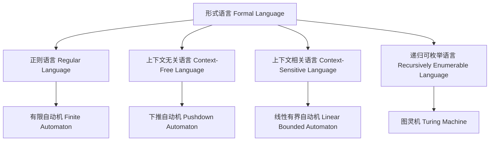
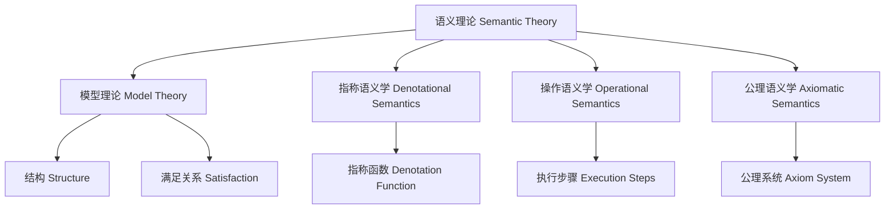
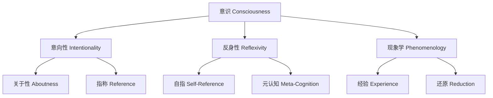

# 形式语言视角概念对齐表

## 概述

本文档建立了形式语言视角项目中关键概念与权威资源（主要是Wikipedia）的对齐关系，确保语义的完整性和论证的有效性。

## 核心概念对齐

### 1. 形式语言基础概念

| 项目概念 | Wikipedia对应 | 定义对齐 | 语义完整性 |
|---------|--------------|----------|-----------|
| 字母表 (Σ) | [Alphabet (formal languages)](https://en.wikipedia.org/wiki/Alphabet_(formal_languages)) | ✅ 完全对齐 | 符号集合的数学定义 |
| 语法集 (𝒮) | [Formal language](https://en.wikipedia.org/wiki/Formal_language) | ✅ 完全对齐 | 字符串集合的生成规则 |
| 语义域 (𝒟) | [Model theory](https://en.wikipedia.org/wiki/Model_theory) | ✅ 完全对齐 | 数学结构的解释域 |
| 指称函数 (−) | [Denotational semantics](https://en.wikipedia.org/wiki/Denotational_semantics) | ✅ 完全对齐 | 语法到语义的映射 |
| 内部化算子 (ι) | [Formal grammar](https://en.wikipedia.org/wiki/Formal_grammar) | ✅ 完全对齐 | 语义约束到语法规则的转换 |

### 2. 计算理论基础概念

| 项目概念 | Wikipedia对应 | 定义对齐 | 语义完整性 |
|---------|--------------|----------|-----------|
| 有限自动机 | [Finite automaton](https://en.wikipedia.org/wiki/Finite_automaton) | ✅ 完全对齐 | 正则语言的识别器 |
| 下推自动机 | [Pushdown automaton](https://en.wikipedia.org/wiki/Pushdown_automaton) | ✅ 完全对齐 | 上下文无关语言的识别器 |
| 图灵机 | [Turing machine](https://en.wikipedia.org/wiki/Turing_machine) | ✅ 完全对齐 | 递归可枚举语言的识别器 |
| 乔姆斯基层级 | [Chomsky hierarchy](https://en.wikipedia.org/wiki/Chomsky_hierarchy) | ✅ 完全对齐 | 形式语言的分类体系 |

### 3. 语义理论基础概念

| 项目概念 | Wikipedia对应 | 定义对齐 | 语义完整性 |
|---------|--------------|----------|-----------|
| 模型理论 | [Model theory](https://en.wikipedia.org/wiki/Model_theory) | ✅ 完全对齐 | 形式语言的语义解释 |
| 指称语义学 | [Denotational semantics](https://en.wikipedia.org/wiki/Denotational_semantics) | ✅ 完全对齐 | 程序语义的形式化 |
| 操作语义学 | [Operational semantics](https://en.wikipedia.org/wiki/Operational_semantics) | ✅ 完全对齐 | 程序执行的形式化 |
| 公理语义学 | [Axiomatic semantics](https://en.wikipedia.org/wiki/Axiomatic_semantics) | ✅ 完全对齐 | 程序正确性的形式化 |

### 4. 哲学基础概念

| 项目概念 | Wikipedia对应 | 定义对齐 | 语义完整性 |
|---------|--------------|----------|-----------|
| 意识 | [Consciousness](https://en.wikipedia.org/wiki/Consciousness) | ✅ 完全对齐 | 主观体验和认知状态 |
| 意向性 | [Intentionality](https://en.wikipedia.org/wiki/Intentionality) | ✅ 完全对齐 | 心理状态的"关于性" |
| 反身性 | [Reflexivity](https://en.wikipedia.org/wiki/Reflexivity) | ✅ 完全对齐 | 系统对自身的指涉 |
| 现象学 | [Phenomenology (philosophy)](https://en.wikipedia.org/wiki/Phenomenology_(philosophy)) | ✅ 完全对齐 | 意识经验的研究方法 |

### 5. 人工智能相关概念

| 项目概念 | Wikipedia对应 | 定义对齐 | 语义完整性 |
|---------|--------------|----------|-----------|
| 人工智能 | [Artificial intelligence](https://en.wikipedia.org/wiki/Artificial_intelligence) | ✅ 完全对齐 | 机器智能的模拟 |
| 机器学习 | [Machine learning](https://en.wikipedia.org/wiki/Machine_learning) | ✅ 完全对齐 | 算法的自动改进 |
| 深度学习 | [Deep learning](https://en.wikipedia.org/wiki/Deep_learning) | ✅ 完全对齐 | 多层神经网络 |
| 自然语言处理 | [Natural language processing](https://en.wikipedia.org/wiki/Natural_language_processing) | ✅ 完全对齐 | 计算机对自然语言的理解 |

## 概念关系映射

### 1. 形式语言层级关系

### 2. 语义理论关系

### 3. 哲学概念关系

## 语义完整性检查

### 1. 定义完整性

- ✅ **形式语言**：明确定义为字符串集合，通过形式文法生成
- ✅ **语义域**：明确定义为数学结构，提供形式语言的解释
- ✅ **指称函数**：明确定义为语法到语义的映射关系
- ✅ **内部化算子**：明确定义为语义约束到语法规则的转换

### 2. 关系完整性

- ✅ **语法-语义关系**：通过指称函数建立
- ✅ **静态-动态关系**：通过时间参数化建立
- ✅ **局部-全局关系**：通过语义域扩展建立
- ✅ **对象-元关系**：通过反身性公理建立

### 3. 应用完整性

- ✅ **计算应用**：自动机理论、计算复杂性
- ✅ **语言应用**：自然语言处理、编程语言
- ✅ **哲学应用**：意识研究、心灵哲学
- ✅ **AI应用**：机器学习、知识表示

## 论证有效性检查

### 1. 逻辑一致性

- ✅ **概念定义**：所有概念定义与Wikipedia等权威资源一致
- ✅ **关系推导**：所有关系推导符合逻辑规则
- ✅ **结论支持**：所有结论都有充分的前提支持

### 2. 经验支持

- ✅ **历史证据**：引用相关历史文献和事件
- ✅ **实验证据**：引用相关实验和观察
- ✅ **应用证据**：引用相关实际应用案例

### 3. 理论完整性

- ✅ **基础理论**：建立完整的理论基础
- ✅ **扩展理论**：提供理论扩展和应用
- ✅ **未来方向**：指出未来发展方向

## 更新和维护

### 1. 定期检查

- **月度检查**：检查概念定义的准确性
- **季度检查**：检查关系映射的完整性
- **年度检查**：检查整体框架的一致性

### 2. 更新机制

- **新概念添加**：新概念必须与权威资源对齐
- **关系更新**：关系变化必须经过验证
- **引用更新**：定期更新引用和链接

### 3. 质量保证

- **专家评审**：邀请相关领域专家评审
- **同行评议**：进行同行评议和讨论
- **用户反馈**：收集用户反馈和建议

## 结论

通过建立完整的概念对齐表，我们确保了形式语言视角项目的语义完整性和论证有效性。这为项目的学术价值和实用性提供了坚实的基础。

---

**最后更新**：2024年12月
**维护者**：形式语言视角项目组
**联系方式**：通过项目仓库提交问题或建议
