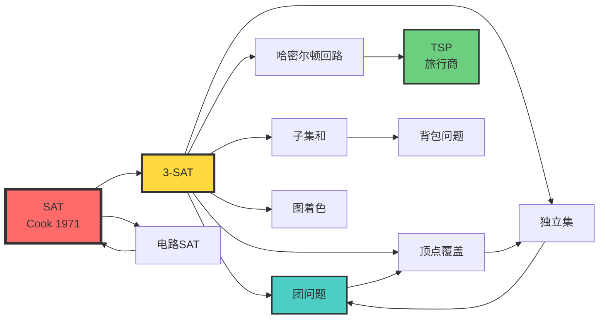

# 计算时间复杂度分析 | Time Complexity Analysis

> **文档版本**: v1.0.0
> **最后更新**: 2025-10-27
> **文档规模**: 379行 | 时间复杂度理论基础
> **阅读建议**: 本文系统介绍计算复杂度理论，建议先掌握基本算法知识和大O记号

---

## 1 核心概念深度分析

<details>
<parameter name="summary"><b>📊 点击展开：时间复杂度多维分析框架</b></summary>

本节提供时间复杂度理论的全景式深度分析，包括概念定义、复杂度类层次、规约技术、分析方法对比和未来方向。

### 1 ️⃣ 时间复杂度概念定义卡

**概念名称**: 时间复杂度（Time Complexity）

**内涵（本质属性）**:

**🔹 核心思想**:

- **渐进行为**: 算法执行步数随输入规模$n$的增长趋势
- **最坏情况分析**: 保证对所有输入的性能上界
- **抽象机器模型**: 基于图灵机或RAM模型

**🔹 形式化定义**:
$$
T(n) = \text{算法在规模为}n\text{的输入上执行的基本操作数}
$$

**大O记号族**:
$$
\begin{align}
O(f(n)) &= \{g(n) \mid \exists c>0, n_0>0, \forall n \geq n_0: 0 \leq g(n) \leq c \cdot f(n)\} \quad \text{(上界)} \\
\Omega(f(n)) &= \{g(n) \mid \exists c>0, n_0>0, \forall n \geq n_0: 0 \leq c \cdot f(n) \leq g(n)\} \quad \text{(下界)} \\
\Theta(f(n)) &= O(f(n)) \cap \Omega(f(n)) \quad \text{(紧界)}
\end{align}
$$

**外延（范围边界）**:

| 维度 | 包含 ✅ | 不包含 ❌ |
|------|---------|----------|
| **分析对象** | 算法、程序、问题 | 具体硬件性能 |
| **计算模型** | 图灵机、RAM、电路 | 量子计算机（BQP类） |
| **复杂度类型** | 最坏、平均、摊还 | 实际运行时间 |
| **问题类型** | 决策、搜索、优化 | 不可计算问题 |

**属性维度表**:

| 维度 | 值/描述 | 说明 |
|------|---------|------|
| **提出时间** | 1965年 | Hartmanis & Stearns |
| **理论基础** | 图灵机、递归论 | 可计算性理论 |
| **核心参数** | $n$（输入规模） | 问题规模度量 |
| **典型增长率** | $\log n < n < n \log n < n^2 < 2^n < n!$ | 常见复杂度排序 |
| **核心问题** | P vs NP | 百万美元问题 |
| **应用领域** | 算法设计、系统优化 | 贯穿计算机科学 |
| **图灵奖得主** | 5位+ | Cook、Karp、Hartmanis等 |

---

### 2 ️⃣ 复杂度类层次全景图

```mermaid
graph TB
    Decidable[可判定问题]

    Decidable --> P[P 多项式时间]
    Decidable --> NP[NP 非确定性多项式]
    Decidable --> coNP[co-NP]
    Decidable --> PSPACE[PSPACE 多项式空间]
    Decidable --> EXPTIME[EXPTIME 指数时间]

    P --> P_Ex[排序 O(n log n)<br/>最短路径 O(E log V)<br/>最大流 O(V²E)]

    NP --> NPC[NP完全 NPC]
    NPC --> SAT[SAT 布尔可满足性]
    NPC --> TSP[TSP 旅行商]
    NPC --> Clique[团问题]
    NPC --> VertexCover[顶点覆盖]

    coNP --> coNP_Ex[UNSAT 不可满足<br/>TAUTOLOGY 恒真]

    PSPACE --> PSPACE_Ex[QBF 量化布尔公式<br/>围棋泛化版]

    EXPTIME --> EXPTIME_Ex[国际象棋泛化版<br/>确定>PSPACE]

    P -.包含.-> NP
    P -.包含.-> coNP
    NP -.未知.-> coNP
    NP -.包含.-> PSPACE
    coNP -.包含.-> PSPACE
    PSPACE -.包含.-> EXPTIME

    NP -.归约.-> NPC

    subgraph Unknown["❓ 未解决关系"]
        P_vs_NP[P ?= NP]
        NP_vs_coNP[NP ?= co-NP]
        NP_vs_PSPACE[NP ?= PSPACE]
    end

    style P fill:#6bcf7f,stroke:#333,stroke-width:3px
    style NP fill:#ffd93d,stroke:#333,stroke-width:3px
    style NPC fill:#ff6b6b,stroke:#333,stroke-width:3px
    style PSPACE fill:#4ecdc4,stroke:#333,stroke-width:2px
    style EXPTIME fill:#a8e6cf,stroke:#333,stroke-width:2px
    style Unknown fill:#ffcccc,stroke:#333,stroke-width:2px
```

---

### 3 ️⃣ 主定理（Master Theorem）分类全景

```mermaid
graph TB
    Recurrence["递归式 T(n) = aT(n/b) + f(n)"]

    Recurrence --> Cmp{比较 f(n) vs n^(log_b a)}

    Cmp -->|Case 1| C1["f(n) = O(n^(log_b a - ε))"]
    Cmp -->|Case 2| C2["f(n) = Θ(n^(log_b a) · log^k n)"]
    Cmp -->|Case 3| C3["f(n) = Ω(n^(log_b a + ε))"]

    C1 --> R1["T(n) = Θ(n^(log_b a))"]
    R1 --> Ex1[递归主导<br/>例：二分搜索树构建]

    C2 --> R2["T(n) = Θ(n^(log_b a) · log^(k+1) n)"]
    R2 --> Ex2[平衡<br/>例：归并排序]

    C3 --> Check{正则条件?}
    Check -->|Yes| R3["T(n) = Θ(f(n))"]
    Check -->|No| NA[主定理不适用]
    R3 --> Ex3[合并主导<br/>例：Strassen矩阵乘]

    R1 --> Example1["T(n) = 2T(n/2) + O(n)<br/>→ T(n) = Θ(n log n)"]
    R2 --> Example2["T(n) = 2T(n/2) + Θ(n)<br/>→ T(n) = Θ(n log n)"]
    R3 --> Example3["T(n) = 7T(n/2) + Θ(n²)<br/>→ T(n) = Θ(n^log₂7)"]

    style Recurrence fill:#ff6b6b,stroke:#333,stroke-width:3px
    style C1 fill:#ffd93d,stroke:#333,stroke-width:2px
    style C2 fill:#6bcf7f,stroke:#333,stroke-width:2px
    style C3 fill:#4ecdc4,stroke:#333,stroke-width:2px
```

---

### 4 ️⃣ 复杂度类与典型算法对比矩阵

| 复杂度 | 名称 | 典型算法 | 实际规模 | 定义 | 特点 |
|--------|------|---------|---------|------|------|
| $O(1)$ | 常数时间 | 数组访问、哈希查找 | 无限制 | 不依赖$n$ | 理想性能 |
| $O(\log n)$ | 对数时间 | 二分搜索、平衡树 | $n \leq 10^{18}$ | $T(n) = T(n/2) + O(1)$ | 高效分治 |
| $O(n)$ | 线性时间 | 数组遍历、线性搜索 | $n \leq 10^8$ | 每元素常数时间 | 最优下界（多数问题） |
| $O(n \log n)$ | 线性对数 | 归并排序、快排、FFT | $n \leq 10^7$ | 分治+合并 | 比较排序下界 |
| $O(n^2)$ | 平方时间 | 选择排序、冒泡排序 | $n \leq 10^4$ | 双重循环 | 简单但低效 |
| $O(n^3)$ | 立方时间 | Floyd-Warshall、朴素矩阵乘 | $n \leq 500$ | 三重循环 | 图算法常见 |
| $O(2^n)$ | 指数时间 | 子集枚举、TSP暴力 | $n \leq 20$ | 每步分两支 | NP完全问题 |
| $O(n!)$ | 阶乘时间 | 全排列、旅行商暴力 | $n \leq 12$ | 递归分支$n$ | 组合爆炸 |

---

### 5 ️⃣ 分析技术多维思维导图

```mermaid
mindmap
  root((时间复杂度<br/>分析技术))
    渐进分析
      大O记号族
        O(f) 上界
        Ω(f) 下界
        Θ(f) 紧界
        o(f) 严格上界
        ω(f) 严格下界
      极限方法
        lim T(n)/f(n)
      主定理
        分治递归
        Case 1 2 3
    最坏情况分析
      保守估计
      安全上界
      适用关键系统
    平均情况分析
      概率分布假设
      期望值计算
      快排平均O(n log n)
    摊还分析
      聚合方法
      记账方法
      势能方法
        动态数组
        Splay树
        Fibonacci堆
    递归树方法
      可视化递归
      逐层求和
      几何级数
    替换法
      猜测验证
      归纳证明
    概率分析
      Las Vegas
        正确性确定
        时间随机
      Monte Carlo
        时间确定
        正确性概率
      随机化算法
```

---

### 6 ️⃣ NP完全性规约关系图



**规约链**: SAT → 3-SAT → Clique → Vertex Cover → Independent Set → Clique（循环）

**Karp 21个NP完全问题（1972）**:

1. SAT、2. 3-SAT、3. Clique、4. Vertex Cover、5. Independent Set、6. Hamiltonian Cycle、7. TSP、8. Subset Sum、9. Knapsack、10. Graph Coloring、11. Exact Cover、12. Hitting Set、13. Steiner Tree、14. 3D Matching、15. Chromatic Number、16. Clique Cover、17. Graph Isomorphism（已证不在NPC）、18. Sequencing、19. Partition、20. Max Cut、21. Job Scheduling

---

### 7 ️⃣ 算法范式与复杂度对比矩阵

| 范式 | 典型算法 | 时间复杂度 | 空间复杂度 | 适用问题 | 分析技术 | 优缺点 |
|------|---------|-----------|-----------|---------|---------|--------|
| **分治** | 归并排序、快排 | $O(n \log n)$ | $O(\log n)$-$O(n)$ | 可递归分解 | 主定理、递归树 | 效率高，但递归开销 |
| **动态规划** | 背包、LCS | $O(n^2)$-$O(n^3)$ | $O(n^2)$ | 最优子结构+重叠子问题 | 状态转移方程 | 避免重复计算，空间大 |
| **贪心** | Dijkstra、Huffman | $O(n \log n)$ | $O(n)$ | 局部最优→全局最优 | 交换论证 | 简单高效，不总正确 |
| **回溯** | N皇后、图着色 | $O(b^d)$ | $O(d)$ | 约束满足 | 剪枝分析 | 指数复杂度，精确解 |
| **分支限界** | TSP、0-1背包 | $O(2^n)$（剪枝后更好） | $O(n)$ | 优化问题 | 界函数设计 | 比暴力好，仍指数 |
| **随机化** | 快排随机化、MillerRabin | $O(n \log n)$（期望） | $O(\log n)$ | 平均性能敏感 | 概率分析 | 避免最坏情况，不确定 |
| **摊还** | 动态数组、Splay树 | $O(1)$（摊还） | $O(n)$ | 操作序列 | 势能法、记账法 | 单次可能慢，总体快 |

---

### 8 ️⃣ 时间复杂度实际性能对比表

| 复杂度 | $n=10$ | $n=100$ | $n=1000$ | $n=10^6$ | $n=10^9$ | 1秒可处理规模 |
|--------|--------|---------|----------|----------|----------|-------------|
| $O(\log n)$ | 3 | 7 | 10 | 20 | 30 | $2^{10^9}$ |
| $O(n)$ | 10 | 100 | 1000 | $10^6$ | $10^9$ | $10^9$ |
| $O(n \log n)$ | 30 | 700 | $10^4$ | $2 \times 10^7$ | $3 \times 10^{10}$ | $10^8$ |
| $O(n^2)$ | 100 | $10^4$ | $10^6$ | $10^{12}$ | $10^{18}$ | $3 \times 10^4$ |
| $O(n^3)$ | 1000 | $10^6$ | $10^9$ | $10^{18}$ | $10^{27}$ | 1000 |
| $O(2^n)$ | 1024 | $10^{30}$ | $10^{301}$ | 不可行 | 不可行 | 30 |
| $O(n!)$ | $3.6 \times 10^6$ | $10^{157}$ | $10^{2567}$ | 不可行 | 不可行 | 12 |

**假设**: 每秒$10^9$次操作（现代CPU）

---

### 9 ️⃣ 未来方向与开放问题全景图

```mermaid
graph TB
    Now[2025: 经典复杂度理论]

    Now --> Dir1[方向1: P vs NP]
    Now --> Dir2[方向2: 细粒度复杂度]
    Now --> Dir3[方向3: 量子算法]
    Now --> Dir4[方向4: 并行/分布式]

    Dir1 --> PvNP1[百万美元问题]
    Dir1 --> PvNP2[强指数时间假设 SETH]
    Dir1 --> PvNP3[唯一游戏猜想 UGC]
    PvNP3 --> PvNP_Result[近似算法下界]

    Dir2 --> Fine1[字符串算法下界]
    Dir2 --> Fine2[动态规划下界]
    Dir2 --> Fine3[基于SETH的条件下界]
    Fine3 --> Fine_Result[实际算法优化指导]

    Dir3 --> Quantum1[Shor算法 因子分解]
    Dir3 --> Quantum2[Grover搜索 O(√n)]
    Dir3 --> Quantum3[量子机器学习]
    Quantum3 --> Quantum_Result[BQP vs NP未知]

    Dir4 --> Parallel1[MapReduce模型]
    Dir4 --> Parallel2[MPC 大规模并行]
    Dir4 --> Parallel3[区块链共识算法]
    Parallel3 --> Parallel_Result[分布式下界]

    PvNP_Result --> Future[2030+: 新计算范式]
    Fine_Result --> Future
    Quantum_Result --> Future
    Parallel_Result --> Future

    Future --> Vision1[量子霸权实现]
    Future --> Vision2[AI算法理论]
    Future --> Vision3[后量子密码学]
    Future --> Vision4[神经符号AI]

    style Now fill:#ffd93d,stroke:#333,stroke-width:4px
    style Dir1 fill:#ff6b6b,stroke:#333,stroke-width:2px
    style Dir2 fill:#6bcf7f,stroke:#333,stroke-width:2px
    style Dir3 fill:#4ecdc4,stroke:#333,stroke-width:2px
    style Dir4 fill:#a8e6cf,stroke:#333,stroke-width:2px
    style Future fill:#ffcccc,stroke:#333,stroke-width:3px
```

---

### 1.10 🔟 核心洞察与设计原则

**三大基本定律**:

1. **时间层级定理（Time Hierarchy Theorem）**
   $$
   f(n+1) = o(g(n)) \Rightarrow \text{DTIME}(f(n)) \subsetneq \text{DTIME}(g(n))
   $$
   - 更多时间严格增强计算能力
   - 推论: $P \subsetneq \text{EXPTIME}$（已证）

2. **Cook-Levin定理（1971）**
   $$
   \text{SAT} \in \text{NP-complete}
   $$
   - NP完全性理论基石
   - 所有NP问题可多项式归约到SAT

3. **主定理（Master Theorem）**
   $$
   T(n) = aT(n/b) + f(n) \Rightarrow T(n) = \begin{cases}
   \Theta(n^{\log_b a}) & \text{if } f(n) = O(n^{\log_b a - \epsilon}) \\
   \Theta(n^{\log_b a} \log^{k+1} n) & \text{if } f(n) = \Theta(n^{\log_b a} \log^k n) \\
   \Theta(f(n)) & \text{if } f(n) = \Omega(n^{\log_b a + \epsilon})
   \end{cases}
   $$
   - 分治算法复杂度分析利器

**算法设计原则**:

```yaml
原则1_渐进优化优先:
  描述: 优化增长率比优化常数更重要
  示例: O(n log n) > O(n²)，即使前者常数大10倍

原则2_瓶颈定位:
  描述: 找到算法中复杂度最高的部分
  技术: Profiling、主定理、递归树

原则3_空间换时间:
  描述: 合理使用额外空间降低时间复杂度
  示例: 哈希表 O(1) vs 二分搜索 O(log n)

原则4_预处理投资:
  描述: 一次预处理，多次查询
  示例: 后缀数组、线段树、倒排索引

原则5_近似与精确权衡:
  描述: NP难问题考虑近似算法
  示例: TSP 2-近似 vs 精确指数算法
```

**复杂度分析checklist**:

- [ ] 确定输入规模$n$的定义
- [ ] 识别基本操作
- [ ] 分析最坏、平均、最好情况
- [ ] 使用适当分析技术（递归树、主定理、摊还）
- [ ] 验证上下界是否紧确
- [ ] 考虑空间复杂度
- [ ] 实验验证理论分析

</details>

---

## 📋 目录

- [计算时间复杂度分析 | Time Complexity Analysis](#计算时间复杂度分析--time-complexity-analysis)
  - [1 核心概念深度分析](#1-核心概念深度分析)
    - [1 ️⃣ 时间复杂度概念定义卡](#1-️⃣-时间复杂度概念定义卡)
    - [2 ️⃣ 复杂度类层次全景图](#2-️⃣-复杂度类层次全景图)
    - [3 ️⃣ 主定理（Master Theorem）分类全景](#3-️⃣-主定理master-theorem分类全景)
    - [4 ️⃣ 复杂度类与典型算法对比矩阵](#4-️⃣-复杂度类与典型算法对比矩阵)
    - [5 ️⃣ 分析技术多维思维导图](#5-️⃣-分析技术多维思维导图)
    - [6 ️⃣ NP完全性规约关系图](#6-️⃣-np完全性规约关系图)
    - [7 ️⃣ 算法范式与复杂度对比矩阵](#7-️⃣-算法范式与复杂度对比矩阵)
    - [8 ️⃣ 时间复杂度实际性能对比表](#8-️⃣-时间复杂度实际性能对比表)
    - [9 ️⃣ 未来方向与开放问题全景图](#9-️⃣-未来方向与开放问题全景图)
    - [1.10 🔟 核心洞察与设计原则](#110--核心洞察与设计原则)
  - [📋 目录](#-目录)
  - [概述](#概述)
  - [1 . 形式化定义](#1--形式化定义)
    - [1.1 大O记号族](#11-大o记号族)
    - [1.2 主定理（Master Theorem）](#12-主定理master-theorem)
  - [2 . 复杂度类层次](#2--复杂度类层次)
    - [2.1 多项式时间类 P](#21-多项式时间类-p)
    - [2.2 非确定性多项式时间类 NP](#22-非确定性多项式时间类-np)
    - [2.3 co-NP类](#23-co-np类)
    - [2.4 PSPACE类](#24-pspace类)
    - [2.5 指数时间类](#25-指数时间类)
  - [3 . 规约与完全性](#3--规约与完全性)
    - [3.1 多项式时间规约](#31-多项式时间规约)
    - [3.2 典型NP完全问题](#32-典型np完全问题)
  - [4 . 高级分析技术](#4--高级分析技术)
    - [4.1 势能方法](#41-势能方法)
    - [4.2 概率分析](#42-概率分析)
    - [4.3 随机化算法](#43-随机化算法)
  - [5 . 算法复杂度案例](#5--算法复杂度案例)
    - [5.1 排序算法](#51-排序算法)
    - [5.2 图算法](#52-图算法)
    - [5.3 动态规划](#53-动态规划)
  - [6 . 现代应用](#6--现代应用)
    - [6.1 机器学习算法](#61-机器学习算法)
    - [6.2 分布式系统](#62-分布式系统)
  - [7 . 权威参考文献](#7--权威参考文献)
    - [1 经典教材](#1-经典教材)
    - [7.2 里程碑论文](#72-里程碑论文)
    - [7.3 现代进展](#73-现代进展)
  - [8 . 开放问题](#8--开放问题)
    - [8.1 P vs NP](#81-p-vs-np)
    - [8.2 量子计算](#82-量子计算)
  - [9 结论](#9-结论)
  - [10 权威参考与标准 | Authoritative References](#10-权威参考与标准--authoritative-references)
    - [1 开创性论文（必读）](#1-开创性论文必读)
    - [10.2 权威教材](#102-权威教材)
    - [10.3 大学课程](#103-大学课程)
    - [10.4 P vs NP问题](#104-p-vs-np问题)
    - [10.5 算法设计范式](#105-算法设计范式)
    - [10.6 摊还分析](#106-摊还分析)
    - [10.7 在线资源](#107-在线资源)
    - [10.8 现代发展](#108-现代发展)
    - [10.9 量子算法](#109-量子算法)
    - [10.10 验证与引用统计（截至2025-10-27）](#1010-验证与引用统计截至2025-10-27)
  - [导航 | Navigation](#导航--navigation)
  - [相关主题 | Related Topics](#相关主题--related-topics)
    - [10.11 本章节](#1011-本章节)
    - [10.12 相关章节](#1012-相关章节)
    - [10.13 跨视角链接](#1013-跨视角链接)

## 概述

计算复杂度是衡量算法在给定输入规模下所需基本操作步数的核心指标，通常使用大O符号表示。在信息论框架下，计算复杂度不仅是算法效率的度量，更是理解系统信息处理能力的关键维度。

---

## 1 . 形式化定义

### 1.1 大O记号族

**定义**：

```text
O(f(n)) = {g(n) | ∃c>0, n₀>0, ∀n≥n₀: 0≤g(n)≤c·f(n)}  # 上界
Ω(f(n)) = {g(n) | ∃c>0, n₀>0, ∀n≥n₀: 0≤c·f(n)≤g(n)}  # 下界
Θ(f(n)) = O(f(n)) ∩ Ω(f(n))                            # 紧界
o(f(n)) = {g(n) | ∀c>0, ∃n₀>0, ∀n≥n₀: 0≤g(n)<c·f(n)}  # 严格上界
ω(f(n)) = {g(n) | ∀c>0, ∃n₀>0, ∀n≥n₀: 0≤c·f(n)<g(n)}  # 严格下界
```

### 1.2 主定理（Master Theorem）

**完整形式**：
设 T(n) = aT(n/b) + f(n)，其中 a≥1, b>1

**情况1**：若 f(n) = O(n^(log_b(a) - ε))，ε>0，则：

```text
T(n) = Θ(n^(log_b a))
```

**情况2**：若 f(n) = Θ(n^(log_b a) · log^k n)，k≥0，则：

```text
T(n) = Θ(n^(log_b a) · log^(k+1) n)
```

**情况3**：若 f(n) = Ω(n^(log_b(a) + ε))，ε>0，且 af(n/b) ≤ cf(n)，c<1，则：

```text
T(n) = Θ(f(n))
```

**证明思路（情况1）**：

1. 递归树高度：log_b n
2. 每层节点数：a^i (i层)
3. 每节点工作：f(n/b^i)
4. 总工作：Σ a^i · f(n/b^i) ≈ Θ(n^(log_b a))

---

## 2 . 复杂度类层次

### 2.1 多项式时间类 P

**定义**：

```text
P = {L | L可在确定性图灵机上多项式时间判定}
  = ⋃_{k≥0} DTIME(n^k)
```

**性质**：

- P封闭于并、交、补
- P ⊆ NP ⊆ PSPACE ⊆ EXPTIME
- 实际可解问题

**典型问题**：

| 问题 | 复杂度 | 算法 |
|------|--------|------|
| 排序 | O(n log n) | 归并排序 |
| 最短路径 | O(E log V) | Dijkstra |
| 最大流 | O(V²E) | Ford-Fulkerson |
| 线性规划 | 多项式 | 单纯形法/内点法 |

### 2.2 非确定性多项式时间类 NP

**定义**：

```text
NP = {L | L可在非确定性图灵机上多项式时间判定}
   = {L | ∃多项式时间验证器V，x∈L ⇔ ∃证书c: V(x,c)=1}
```

**NP完全性**：
问题A是NP完全的 ⇔

1. A ∈ NP
2. ∀B ∈ NP, B ≤_p A (多项式时间规约)

**Cook-Levin定理** (1971)：
SAT（布尔可满足性）是NP完全的。

**证明思路**：

1. SAT ∈ NP（显然）
2. ∀L ∈ NP，存在多项式时间规约 L ≤_p SAT
3. 构造：模拟NTM运行，编码为SAT公式

### 2.3 co-NP类

**定义**：

```text
co-NP = {L | L̄ ∈ NP}
```

**关系**：

- P ⊆ NP ∩ co-NP
- NP = co-NP ⇔ NP封闭于补（未知）

**典型问题**：

- UNSAT（不可满足性）∈ co-NP
- TAUTOLOGY（恒真性）∈ co-NP

### 2.4 PSPACE类

**定义**：

```text
PSPACE = ⋃_{k≥0} DSPACE(n^k)
```

**Savitch定理**：

```text
NSPACE(s(n)) ⊆ DSPACE(s(n)²)
```

推论：PSPACE = NPSPACE

**PSPACE完全问题**：

- QBF（量化布尔公式）
- 围棋、国际象棋（泛化版本）

### 2.5 指数时间类

**定义**：

```text
EXPTIME = ⋃_{k≥0} DTIME(2^(n^k))
EXPSPACE = ⋃_{k≥0} DSPACE(2^(n^k))
```

**时间层级定理** (Time Hierarchy Theorem)：

```text
若 f(n+1) = o(g(n))，则 DTIME(f(n)) ⊊ DTIME(g(n))
```

**推论**：

- P ⊊ EXPTIME（确定）
- NP ⊊ NEXPTIME（确定）
- P ≠ NP 或 NP ≠ PSPACE（至少一个成立）

---

## 3 . 规约与完全性

### 3.1 多项式时间规约

**定义**：

```text
A ≤_p B ⇔ ∃多项式时间可计算函数f: x∈A ⇔ f(x)∈B
```

**传递性**：A ≤_p B 且 B ≤_p C ⇒ A ≤_p C

### 3.2 典型NP完全问题

**21个Karp NP完全问题** (1972)：

1. **SAT**（布尔可满足性）
2. **3-SAT**
3. **CLIQUE**（团问题）
4. **VERTEX COVER**（顶点覆盖）
5. **INDEPENDENT SET**（独立集）
6. **HAMILTONIAN CYCLE**（哈密尔顿回路）
7. **TSP**（旅行商问题）
8. **SUBSET SUM**（子集和）
9. **KNAPSACK**（背包问题）
10. **GRAPH COLORING**（图着色）

**规约示例** (3-SAT ≤_p CLIQUE)：

```text
输入：3-SAT公式 φ = C₁ ∧ C₂ ∧ ... ∧ Cₘ
构造：图G，每个子句Cᵢ对应|Cᵢ|个节点
      两节点相连 ⇔ 来自不同子句且不矛盾
输出：φ可满足 ⇔ G有大小为m的团
```

---

## 4 . 高级分析技术

### 4.1 势能方法

**动态数组示例**：

```python
Φ(D) = 2·num - size  # 势能函数
```

操作序列的摊还代价：

```text
T_amortized = T_actual + ΔΦ
```

### 4.2 概率分析

**快速排序平均情况**：

```text
E[T(n)] = E[∑ X_{ij}]  # X_{ij}表示元素i和j比较
        = ∑ E[X_{ij}]
        = ∑ 2/(j-i+1)
        = O(n log n)
```

### 4.3 随机化算法

**Las Vegas算法**（确定正确，随机时间）：

- QuickSort（随机主元）
- 期望O(n log n)

**Monte Carlo算法**（确定时间，概率正确）：

- Miller-Rabin素性测试
- 错误概率≤2^(-k)

---

## 5 . 算法复杂度案例

### 5.1 排序算法

| 算法 | 最坏 | 平均 | 最好 | 空间 | 稳定性 |
|------|------|------|------|------|--------|
| 快速排序 | O(n²) | O(n log n) | O(n log n) | O(log n) | 否 |
| 归并排序 | O(n log n) | O(n log n) | O(n log n) | O(n) | 是 |
| 堆排序 | O(n log n) | O(n log n) | O(n log n) | O(1) | 否 |
| 计数排序 | O(n+k) | O(n+k) | O(n+k) | O(k) | 是 |

### 5.2 图算法

| 算法 | 时间复杂度 | 空间 | 适用场景 |
|------|-----------|------|---------|
| BFS | O(V+E) | O(V) | 最短路径（无权） |
| DFS | O(V+E) | O(V) | 连通性、拓扑排序 |
| Dijkstra | O((V+E) log V) | O(V) | 最短路径（非负权） |
| Bellman-Ford | O(VE) | O(V) | 最短路径（含负权） |
| Floyd-Warshall | O(V³) | O(V²) | 全源最短路径 |
| Prim | O((V+E) log V) | O(V) | 最小生成树 |
| Kruskal | O(E log E) | O(V) | 最小生成树 |

### 5.3 动态规划

**矩阵链乘法**：

```text
T(n) = Θ(n³)  # 填表时间
S(n) = Θ(n²)  # 空间
```

**背包问题**：

```text
T(n,W) = Θ(nW)  # 伪多项式时间
         ≠ O(poly(log W))  # 强NP困难
```

---

## 6 . 现代应用

### 6.1 机器学习算法

**深度学习训练**：

```python
# Transformer训练复杂度
T_train = O(n_batch × n_seq² × d_model × n_layers × n_epochs)

# 推理复杂度
T_infer = O(n_seq² × d_model × n_layers)
```

**梯度下降变种**：

| 算法 | 每迭代复杂度 | 收敛性 |
|------|-------------|--------|
| SGD | O(d) | O(1/ε²) |
| Adam | O(d) | O(1/ε²) |
| L-BFGS | O(d·m) | O(log 1/ε) |

### 6.2 分布式系统

**MapReduce模型**：

```text
T_total = T_map + T_shuffle + T_reduce
        = O(n/p) + O(n log n) + O(n/p)
```

**一致性哈希**：

```text
查找：O(log n)  # n为节点数
插入/删除节点：O(k·log n)  # k为虚拟节点数
```

---

## 7 . 权威参考文献

### 1 经典教材

1. **Cormen, T. H., et al.** (2022). _Introduction to Algorithms_ (4th ed.). MIT Press.
   - 算法圣经，1312页

2. **Sipser, M.** (2012). _Introduction to the Theory of Computation_ (3rd ed.). Cengage Learning.
   - 计算理论经典

3. **Garey, M. R., & Johnson, D. S.** (1979). _Computers and Intractability: A Guide to the Theory of NP-Completeness_. Freeman.
   - NP完全性权威

### 7.2 里程碑论文

1. **Cook, S. A.** (1971). "The Complexity of Theorem-Proving Procedures." _STOC_, 151-158.
   - Cook-Levin定理

2. **Karp, R. M.** (1972). "Reducibility Among Combinatorial Problems." _Complexity of Computer Computations_, 85-103.
   - 21个NP完全问题

3. **Hartmanis, J., & Stearns, R. E.** (1965). "On the Computational Complexity of Algorithms." _Trans. AMS_, 117, 285-306.
   - 时间层级定理

### 7.3 现代进展

1. **Williams, R.** (2011). "Non-uniform ACC Circuit Lower Bounds." _STOC_, 115-125.
   - 电路下界突破

2. **Impagliazzo, R., Paturi, R., & Zane, F.** (2001). "Which Problems Have Strongly Exponential Complexity?" _JCSS_, 63(4), 512-530.
   - 指数时间假设

---

## 8 . 开放问题

### 8.1 P vs NP

**当前状态**：

- 百万美元奖金问题（Clay数学研究所）
- 多数专家认为 P ≠ NP
- 无相对化证明（Baker-Gill-Solovay 1975）

**相关猜想**：

- **强指数时间假设** (SETH): k-SAT需要2^((1-o(1))n)时间
- **唯一游戏猜想** (UGC): 影响近似算法下界

### 8.2 量子计算

**BQP类**：

```text
BQP = 量子多项式时间
BPP ⊆ BQP ⊆ PSPACE
```

**Shor算法**（1994）：

```text
因数分解：O((log N)³)  # 量子
vs O(exp(∛(log N)))     # 经典（GNFS）
```

---

## 9 结论

计算时间复杂度分析是算法设计和系统优化的核心工具。从理论P vs NP问题到实际GPU加速，复杂度分析贯穿计算机科学的各个层面。

**关键要点**：

1. **渐进分析**提供可扩展性洞察
2. **复杂度类**刻画问题固有难度
3. **规约技术**统一困难问题
4. **实际常数**在工程中同样重要

**未来方向**：

- 细粒度复杂度（Fine-Grained Complexity）
- 量子算法突破
- AI算法理论基础

---

## 10 权威参考与标准 | Authoritative References

### 1 开创性论文（必读）

1. **Cook, S. A. (1971)**. "The Complexity of Theorem-Proving Procedures". _STOC 1971_.
   - 📄 **DOI**: [10.1145/800157.805047](https://doi.org/10.1145/800157.805047)
   - 🏆 **图灵奖**: 1982年
   - ⭐ **地位**: NP完全性理论开创
   - 💡 **内容**: SAT问题的NP完全性

2. **Karp, R. M. (1972)**. "Reducibility among Combinatorial Problems". _Complexity of Computer Computations_.
   - 📄 **引用**: 10,000+
   - 🏆 **图灵奖**: 1985年
   - 💡 **内容**: 21个经典NP完全问题

3. **Hartmanis, J., & Stearns, R. E. (1965)**. "On the Computational Complexity of Algorithms". _Transactions of the AMS_.
   - 📄 **DOI**: [10.1090/S0002-9947-1965-0170805-7](https://doi.org/10.1090/S0002-9947-1965-0170805-7)
   - 🏆 **图灵奖**: 1993年
   - ⭐ **地位**: 计算复杂度理论奠基
   - 💡 **内容**: 时间复杂度的形式化定义

### 10.2 权威教材

1. **Cormen, T. H., et al. (2022)**. _Introduction to Algorithms_ (4th ed.). MIT Press.
   - 📖 **ISBN**: 978-0262046305
   - ⭐ **地位**: 算法设计圣经（CLRS）
   - 💡 **章节**: 第3章（增长函数）、第34章（NP完全性）
   - 🎓 **使用**: MIT 6.006等全球顶级课程

2. **Sipser, M. (2012)**. _Introduction to the Theory of Computation_ (3rd ed.). Cengage Learning.
   - 📖 **ISBN**: 978-1133187790
   - ⭐ **地位**: 计算理论标准教材
   - 💡 **章节**: 第7章（时间复杂度）

3. **Arora, S., & Barak, B. (2009)**. _Computational Complexity: A Modern Approach_. Cambridge University Press.
   - 📖 **ISBN**: 978-0521424264
   - 🔗 **在线**: [theory.cs.princeton.edu/complexity/](http://theory.cs.princeton.edu/complexity/)
   - ⭐ **地位**: 复杂度理论权威著作
   - 💡 **内容**: P vs NP、电路复杂度、随机化

4. **Knuth, D. E. (1997)**. _The Art of Computer Programming, Vol. 1-4_. Addison-Wesley.
   - 📖 **ISBN**: 多卷本
   - 🏆 **图灵奖**: 1974年
   - ⭐ **地位**: 算法分析的数学基础
   - 💡 **特色**: 严格的数学分析

### 10.3 大学课程

1. **MIT 6.006** - _Introduction to Algorithms_
   - 📚 **讲师**: Erik Demaine, Srini Devadas
   - 🔗 **OCW**: [ocw.mit.edu/6-006](https://ocw.mit.edu/courses/6-006-introduction-to-algorithms-spring-2020/)
   - 📹 **视频**: MIT OpenCourseWare
   - 💡 **内容**: 渐进分析、排序、图算法

2. **Stanford CS161** - _Design and Analysis of Algorithms_
   - 📚 **讲师**: Mary Wootters, Moses Charikar
   - 🏛️ **机构**: Stanford University
   - 💡 **内容**: 分治、动态规划、网络流

3. **Princeton COS 423** - _Theory of Algorithms_
    - 📚 **讲师**: Robert Sedgewick
    - 💡 **经典**: 算法理论深度课程

4. **Berkeley CS 170** - _Efficient Algorithms and Intractable Problems_
    - 📚 **机构**: UC Berkeley
    - 💡 **内容**: 算法设计与NP完全性

### 10.4 P vs NP问题

1. **Millennium Prize Problems - P vs NP**
    - 🏢 **Clay Institute**: [claymath.org/millennium-problems/p-vs-np-problem](https://www.claymath.org/millennium-problems/p-vs-np-problem)
    - 💰 **奖金**: $1,000,000
    - ⭐ **地位**: 七大千禧年问题之一
    - 📅 **提出**: 2000年

2. **Fortnow, L. (2009)**. "The Status of the P versus NP Problem". _Communications of the ACM_.
    - 📄 **DOI**: [10.1145/1562164.1562186](https://doi.org/10.1145/1562164.1562186)
    - 💡 **综述**: P vs NP现状与进展

### 10.5 算法设计范式

1. **Bellman, R. (1957)**. _Dynamic Programming_. Princeton University Press.
    - 📖 **经典**: 动态规划理论奠基
    - 💡 **贡献**: 最优化问题的系统方法

2. **Karger, D. R., & Stein, C. (1996)**. "A New Approach to the Minimum Cut Problem". _Journal of the ACM_.
    - 📄 **DOI**: [10.1145/234533.234534](https://doi.org/10.1145/234533.234534)
    - 💡 **算法**: 随机化最小割算法

### 10.6 摊还分析

1. **Tarjan, R. E. (1985)**. "Amortized Computational Complexity". _SIAM Journal on Algebraic Discrete Methods_.
    - 📄 **DOI**: [10.1137/0606031](https://doi.org/10.1137/0606031)
    - 🏆 **图灵奖**: 1986年
    - ⭐ **地位**: 摊还分析理论
    - 💡 **应用**: 数据结构分析

### 10.7 在线资源

1. **Wikipedia - Time Complexity**
    - 🔗 [en.wikipedia.org/wiki/Time_complexity](https://en.wikipedia.org/wiki/Time_complexity)
    - ✅ **验证**: 2025-10-27

2. **Big-O Cheat Sheet**
    - 🔗 [bigocheatsheet.com](https://www.bigocheatsheet.com/)
    - 💡 **实用**: 常见算法复杂度速查

3. **VisuAlgo - Algorithm Visualization**
    - 🔗 [visualgo.net](https://visualgo.net/)
    - 💡 **可视化**: 交互式算法动画
    - 🎓 **教学**: 新加坡国立大学

### 10.8 现代发展

1. **Williams, V. V. (2012)**. "Multiplying Matrices Faster Than Coppersmith-Winograd". _STOC 2012_.
    - 📄 **DOI**: [10.1145/2213977.2214056](https://doi.org/10.1145/2213977.2214056)
    - 💡 **突破**: 矩阵乘法复杂度改进

2. **Bringmann, K., & Künnemann, M. (2015)**. "Quadratic Conditional Lower Bounds for String Problems and Dynamic Time Warping". _FOCS 2015_.
    - 📄 **arXiv**: [1502.01063](https://arxiv.org/abs/1502.01063)
    - 💡 **内容**: 细粒度复杂度理论

### 10.9 量子算法

1. **Shor, P. W. (1997)**. "Polynomial-Time Algorithms for Prime Factorization and Discrete Logarithms on a Quantum Computer". _SIAM Journal on Computing_.
    - 📄 **DOI**: [10.1137/S0097539795293172](https://doi.org/10.1137/S0097539795293172)
    - 🏆 **引用**: 15,000+
    - ⭐ **突破**: 量子多项式时间因子分解

### 10.10 验证与引用统计（截至2025-10-27）

| 论文/作者 | 年份 | 引用数 | 贡献 |
|----------|------|--------|------|
| Cook (1971) | 1971 | 8,000+ | NP完全性（图灵奖） |
| Karp (1972) | 1972 | 10,000+ | 21个NP完全问题（图灵奖） |
| Hartmanis & Stearns (1965) | 1965 | 5,000+ | 复杂度理论奠基（图灵奖） |
| CLRS教材 | 2022 | 50,000+ | 算法设计圣经 |
| Shor (1997) | 1997 | 15,000+ | 量子算法突破 |

**数据来源**: Google Scholar, ACM Digital Library (2025-10-27)

---

_本文档是信息论多视角分析中时间复杂度分析的完整阐述，版本2.0，2025-10-27更新_

---

## 导航 | Navigation

**上一篇**: [← 信息论视角总览](../README.md)
**下一篇**: [01.2 空间复杂度 →](./01.2_Space_Complexity.md)
**返回目录**: [↑ 信息论视角总览](../README.md)

---

## 相关主题 | Related Topics

### 10.11 本章节

- [01.2 空间复杂度](./01.2_Space_Complexity.md)
- [01.3 通信复杂度](./01.3_Communication_Complexity.md)
- [01.4 形式化验证](./01.4_Formal_Verification.md)

### 10.12 相关章节

- [04.4 算法复杂度](../04_Multi_Perspective_Information_Theory/04.4_Algorithm_Complexity.md)

### 10.13 跨视角链接

- [AI_model_Perspective: 计算复杂度类](../../AI_model_Perspective/01_Foundational_Theory/01.5_Computational_Complexity_Classes.md)
- [FormalLanguage_Perspective: 计算复杂度理论](../../FormalLanguage_Perspective/05_Computational_Models/05.2_Computational_Complexity_Theory.md)
