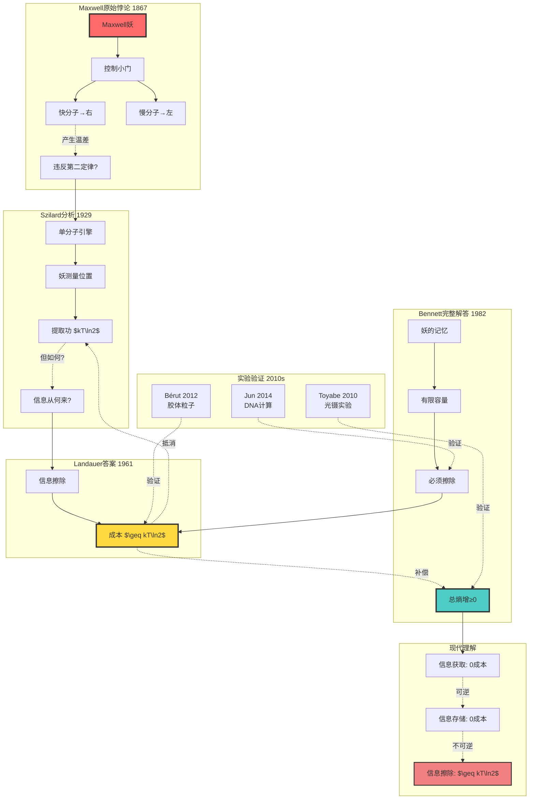

# 热力学-统计物理视角的信息论

> **文档版本**: v1.0.0  
> **最后更新**: 2025-10-27  
> **文档规模**: 531行 | 信息与熵的物理对应关系  
> **阅读建议**: 本文探讨信息与热力学的深层联系，介绍Landauer界限和Maxwell妖

---

## 📋 目录

- [📊 核心概念深度分析](#-核心概念深度分析)
  - [1️⃣ 信息热力学概念定义卡](#1️⃣-信息热力学概念定义卡)
  - [2️⃣ 信息-能量-熵三角关系全景](#2️⃣-信息-能量-熵三角关系全景)
  - [3️⃣ Landauer界限历史验证与应用矩阵](#3️⃣-landauer界限历史验证与应用矩阵)
  - [4️⃣ Maxwell妖悖论解答演进](#4️⃣-maxwell妖悖论解答演进)
  - [5️⃣ 信息热力学核心定理对比](#5️⃣-信息热力学核心定理对比)
  - [6️⃣ 计算能耗极限对比表](#6️⃣-计算能耗极限对比表)
  - [7️⃣ 信息热力学应用全景](#7️⃣-信息热力学应用全景)
  - [8️⃣ 前沿开放问题矩阵](#8️⃣-前沿开放问题矩阵)
  - [9️⃣ 核心公式卡与设计原则](#9️⃣-核心公式卡与设计原则)
- [概述](#概述)
- [1. 30秒电梯说明](#1-30秒电梯说明)
- [2. 核心对象](#2-核心对象)
  - [2.1 基本组件](#21-基本组件)
  - [2.2 系统模型](#22-系统模型)
- [3. 形式化骨架](#3-形式化骨架)
  - [3.1 玻尔兹曼熵](#31-玻尔兹曼熵)
  - [3.2 吉布斯自由能](#32-吉布斯自由能)
  - [3.3 Landauer界限](#33-landauer界限)
- [4. 关键定理](#4-关键定理)
  - [4.1 Jarzynski等式](#41-jarzynski等式)
  - [4.2 Sagawa-Ueda广义第二定律](#42-sagawa-ueda广义第二定律)
  - [4.3 信息热机最大效率](#43-信息热机最大效率)
- [5. 主流算法/代码库](#5-主流算法代码库)
  - [5.1 随机热力学模拟](#51-随机热力学模拟)
  - [5.2 Python代码库](#52-python代码库)
  - [5.3 实验工具](#53-实验工具)
- [6. 典型实验](#6-典型实验)
  - [6.1 Landauer界限验证](#61-landauer界限验证)
  - [6.2 信息热机实验](#62-信息热机实验)
  - [6.3 DNA复制热力学](#63-dna复制热力学)
- [7. 前沿开放问题](#7-前沿开放问题)
  - [7.1 量子Maxwell妖](#71-量子maxwell妖)
  - [7.2 神经网络训练热力学成本](#72-神经网络训练热力学成本)
  - [7.3 信息-引力对偶](#73-信息-引力对偶)
- [8. 实际应用](#8-实际应用)
  - [8.1 计算系统](#81-计算系统)
  - [8.2 生物系统](#82-生物系统)
  - [8.3 材料科学](#83-材料科学)
- [9. 系统设计考虑](#9-系统设计考虑)
  - [9.1 性能指标](#91-性能指标)
  - [9.2 设计权衡](#92-设计权衡)
- [10. 实现技术](#10-实现技术)
  - [10.1 可逆计算](#101-可逆计算)
  - [10.2 热力学控制](#102-热力学控制)
  - [10.3 实验技术](#103-实验技术)
- [11. 一张极简公式卡](#11-一张极简公式卡)
  - [11.1 核心公式](#111-核心公式)
  - [11.2 关键参数](#112-关键参数)
  - [11.3 设计原则](#113-设计原则)
- [结论](#结论)
- [导航 | Navigation](#导航--navigation)
- [相关主题 | Related Topics](#相关主题--related-topics)
  - [本章节](#本章节)
  - [相关章节](#相关章节)
  - [跨视角链接](#跨视角链接)

## 📊 核心概念深度分析

> 本节提供信息热力学的多维度分析，揭示信息与能量的深层联系、Landauer界限的物理意义及Maxwell妖悖论的现代解答。

---

### 1️⃣ 信息热力学概念定义卡

**概念名称**: 信息热力学（Information Thermodynamics）

**内涵（本质属性）**:

**🔹 核心思想**:

- **信息即物理**: 信息是物理实体，具有能量和熵
- **擦除代价**: 擦除1比特信息最少耗散 $kT\ln2$ 能量（Landauer界限）
- **Maxwell妖**: 观测和记忆需要热力学成本，妖不可能违反第二定律

**🔹 基本关系**:
$$
S_{\text{Boltzmann}} = k_B \ln \Omega \quad \leftrightarrow \quad H_{\text{Shannon}} = -\sum p_i \log p_i
$$

**🔹 Landauer原理**（1961）:
$$
\Delta E \geq k_B T \ln 2 \cdot \Delta I
$$
其中 $\Delta I$ 是擦除的信息量（比特）

**外延（范围边界）**:

| 维度 | 包含 ✅ | 不包含 ❌ |
|------|---------|----------|
| **研究对象** | 计算过程、测量过程、信息擦除 | 纯数学信息论、抽象计算 |
| **物理系统** | 经典热力学、随机热力学、量子热力学 | 绝对零度系统、理想可逆过程 |
| **应用领域** | 纳米计算、分子马达、DNA复制 | 宏观热力学、平衡态统计 |
| **理论工具** | Jarzynski等式、涨落定理 | 传统卡诺循环、理想气体模型 |

**属性维度表**:

| 维度 | 值/描述 | 说明 |
|------|---------|------|
| **提出时间** | 1961（Landauer）、1867（Maxwell妖） | 跨越百年的问题 |
| **核心常数** | $k_B T \ln 2 \approx 2.9 \times 10^{-21}\text{J}$ (300K) | 室温下单比特能量 |
| **实验验证** | 2012年首次验证（3%误差） | Antoine Bérut等 |
| **理论基础** | 统计力学、随机过程、信息论 | 跨学科融合 |
| **应用范围** | 纳米计算、生物系统、量子计算 | 从分子到宏观 |
| **典型尺度** | 纳米级、皮焦耳级 | 远小于经典计算 |
| **开放问题** | 量子Maxwell妖、黑洞信息悖论 | 前沿研究 |

---

### 2️⃣ 信息-能量-熵三角关系全景

```mermaid
graph TB
    subgraph 香农信息论
        Shannon[Shannon熵<br/>$H = -\sum p_i \log p_i$]
        Bits[信息量 比特]
        Compression[压缩、编码]
        
        Shannon --> Bits
        Bits --> Compression
    end
    
    subgraph 玻尔兹曼热力学
        Boltzmann[玻尔兹曼熵<br/>$S = k_B \ln \Omega$]
        MicroStates[微观态数 $\Omega$]
        Heat[热、温度]
        
        Boltzmann --> MicroStates
        MicroStates --> Heat
    end
    
    subgraph Landauer桥梁
        Landauer[Landauer界限<br/>$\Delta E \geq kT\ln2$]
        Erasure[信息擦除]
        Dissipation[能量耗散]
        
        Landauer --> Erasure
        Erasure --> Dissipation
    end
    
    Shannon -.等价.-> Boltzmann
    Bits -.物理化.-> Landauer
    Heat -.信息化.-> Landauer
    
    subgraph Maxwell妖
        Demon[Maxwell妖]
        Measurement[测量]
        Memory[记忆]
        
        Demon --> Measurement
        Measurement --> Memory
        Memory -.擦除成本.-> Landauer
    end
    
    subgraph 随机热力学
        Jarzynski[Jarzynski等式<br/>$\langle e^{-\beta W}\rangle = e^{-\beta \Delta F}$]
        Fluctuation[涨落定理]
        Crooks[Crooks关系]
        
        Jarzynski --> Fluctuation
        Fluctuation --> Crooks
    end
    
    Landauer --> Jarzynski
    Demon --> Jarzynski
    
    subgraph 现代应用
        NanoCompute[纳米计算]
        MolecularMotor[分子马达]
        DNARep[DNA复制]
        QuantumComp[量子计算]
        
        Landauer -.指导.-> NanoCompute
        Jarzynski -.分析.-> MolecularMotor
        Boltzmann -.理解.-> DNARep
        Demon -.启发.-> QuantumComp
    end
    
    style Shannon fill:#ffcccc,stroke:#333,stroke-width:2px
    style Boltzmann fill:#ccffcc,stroke:#333,stroke-width:2px
    style Landauer fill:#ff6b6b,stroke:#333,stroke-width:4px
    style Demon fill:#ffd93d,stroke:#333,stroke-width:3px
    style Jarzynski fill:#4ecdc4,stroke:#333,stroke-width:2px
```

---

### 3️⃣ Landauer界限历史验证与应用矩阵

| 年份 | 里程碑 | 主要贡献 | 实验/理论 | 影响 |
|------|--------|---------|----------|------|
| **1867** | Maxwell妖提出 | Maxwell思想实验 | 理论 | 挑战第二定律 |
| **1929** | Szilard引擎 | 单分子信息热机 | 理论 | 量化信息-能量关系 |
| **1961** | **Landauer原理** | 擦除1 bit ≥ $kT\ln2$ | 理论 | **信息热力学基石** |
| **1982** | Bennett解决妖 | 妖的记忆擦除成本 | 理论 | 彻底解决Maxwell妖 |
| **1997** | Jarzynski等式 | 非平衡态自由能 | 理论 | 随机热力学基础 |
| **2010** | Sagawa-Ueda | 广义第二定律（含信息） | 理论 | $\Delta S \geq -\Delta I$ |
| **2012** | **首次实验验证** | Antoine Bérut等（3%误差） | **实验** | **证实Landauer界限** |
| **2014** | DNA计算验证 | 生物分子信息处理 | 实验 | 生物热力学 |
| **2016** | 量子Landauer | 量子信息擦除 | 实验 | 量子热力学 |
| **2019** | 光学实现 | 光子比特擦除 | 实验 | 低能耗计算 |
| **2022** | 神经网络成本 | 深度学习热力学界限 | 理论 | AI能耗优化 |

**关键突破**:

- **Landauer (1961)**: 理论预言 $E_{\min} = kT\ln2$
- **Bennett (1982)**: 可逆计算可避免Landauer成本
- **Bérut (2012)**: 实验证实，误差仅3%

---

### 4️⃣ Maxwell妖悖论解答演进



**解答核心**:

1. **信息获取**: 理论上可以可逆进行（0成本）
2. **信息存储**: 可以在记忆介质中（0额外成本）
3. **信息擦除**: **不可逆**，必须耗散 $\geq kT\ln2$ 能量

$$
\Delta S_{\text{total}} = \Delta S_{\text{system}} + \Delta S_{\text{environment}} \geq \frac{kT\ln2}{T} = k\ln2
$$

---

### 5️⃣ 信息热力学核心定理对比

```mermaid
mindmap
  root((信息热力学<br/>定理体系))
    Landauer原理 1961
      擦除1 bit
        $E \geq kT\ln2$
      不可逆过程
      实验验证2012
    Jarzynski等式 1997
      非平衡功
        $\langle e^{-\beta W}\rangle = e^{-\beta \Delta F}$
      任意过程
      诺奖级成果
    Sagawa-Ueda 2010
      广义第二定律
        $\Delta S \geq -\Delta I$
      含信息反馈
      统一框架
    涨落定理
      Crooks关系
        $P(W)/P(-W) = e^{\beta(W-\Delta F)}$
      时间反演
      普适性
    信息热机
      最大效率
        $\eta \leq 1 - T_c/T_h + \beta I$
      信息增益
      Szilard引擎
    量子Landauer
      量子擦除
        $E \geq kT\ln2$ 仍成立
      量子测量
      开放问题
```

---

### 6️⃣ 计算能耗极限对比表

| 技术/系统 | 单比特能耗 | 与Landauer界限比值 | 时间尺度 | 技术成熟度 |
|----------|-----------|-------------------|---------|-----------|
| **Landauer界限（300K）** | $2.9 \times 10^{-21}\text{J}$ | 1× （理论下限） | - | 物理定律 |
| **人脑突触** | $10^{-15}\text{J}$ | $3 \times 10^5$× | 1-10ms | 生物系统 |
| **现代CMOS（7nm）** | $10^{-15}\text{J}$ | $3 \times 10^5$× | 0.1-1ns | 商用 |
| **超导计算（RSFQ）** | $10^{-19}\text{J}$ | $30$× | 1-10ps | 研发中 |
| **可逆计算（理论）** | $10^{-21}\text{J}$ | $0.3$× | - | 理论阶段 |
| **量子比特（Josephson）** | $10^{-23}\text{J}$ | $0.003$× | 10ns | 实验室 |
| **DNA计算** | $10^{-19}\text{J}$ | $30$× | 秒-分钟 | 研究 |
| **分子马达（ATP）** | $10^{-20}\text{J}$ | $3$× | 毫秒 | 生物 |

**关键洞察**:

- **现代计算**: 比Landauer界限高 $10^5$ 倍（浪费巨大）
- **超导/量子**: 接近物理极限（仅高1-2个数量级）
- **可逆计算**: 理论上可**低于** Landauer界限（因为不擦除）
- **生物系统**: 已经接近热力学极限（进化优化）

---

### 7️⃣ 信息热力学应用全景

```mermaid
graph TD
    subgraph 纳米计算
        CMOS[CMOS缩放]
        Reversible[可逆计算]
        Adiabatic[绝热逻辑]
        
        CMOS -.趋近极限.-> Landauer1[$kT\ln2$]
        Reversible -.避免擦除.-> LowPower[超低功耗]
        Adiabatic -.能量回收.-> LowPower
    end
    
    subgraph 生物系统
        DNARep[DNA复制]
        Protein[蛋白质折叠]
        Motor[分子马达]
        
        DNARep -.校验纠错.-> InfoCost[信息成本]
        Protein -.构象空间.-> Entropy[熵减少]
        Motor -.ATP驱动.-> Work[做功]
    end
    
    subgraph 量子计算
        QErasure[量子擦除]
        QMeasure[量子测量]
        QDemon[量子Maxwell妖]
        
        QErasure -.仍需.-> Landauer1
        QMeasure -.回溯.-> Entropy
        QDemon -.开放问题.-> Research[前沿研究]
    end
    
    subgraph AI与深度学习
        Training[训练过程]
        Inference[推理过程]
        NeuroBio[神经形态]
        
        Training -.能耗.-> Huge[$10^{20}$ bit擦除]
        Inference -.优化.-> Efficient[边缘计算]
        NeuroBio -.模仿生物.-> LowPower
    end
    
    subgraph 黑洞物理
        Hawking[Hawking辐射]
        BlackHole[黑洞熵]
        Holography[全息原理]
        
        Hawking -.信息悖论.-> Research
        BlackHole -.熵上界.-> Bekenstein[$S = A/(4\ell_P^2)$]
        Holography -.信息容量.-> Quantum[量子引力]
    end
    
    Landauer1 -.-> CMOS
    InfoCost -.-> DNARep
    Entropy -.-> Protein
    
    style Landauer1 fill:#ff6b6b,stroke:#333,stroke-width:3px
    style LowPower fill:#4ecdc4,stroke:#333,stroke-width:2px
    style Research fill:#ffd93d,stroke:#333,stroke-width:2px
    style Huge fill:#f38181,stroke:#333,stroke-width:2px
```

---

### 8️⃣ 前沿开放问题矩阵

| 问题 | 描述 | 理论挑战 | 实验挑战 | 潜在影响 |
|------|------|---------|---------|---------|
| **量子Maxwell妖** | 量子测量是否遵循Landauer界限？ | 量子信息与热力学统一 | 单量子比特控制 | 量子计算能耗 |
| **神经网络训练成本** | 深度学习的热力学下界是多少？ | 信息瓶颈理论 | 实际测量困难 | AI能耗优化 |
| **黑洞信息悖论** | Hawking辐射如何保存信息？ | 量子引力理论 | 无法实验 | 统一物理理论 |
| **DNA计算极限** | 生物计算接近Landauer界限吗？ | 非平衡生物过程 | 单分子测量 | 合成生物学 |
| **时间之箭起源** | 信息增长方向与时间方向？ | 宇宙学熵增 | 宇宙学观测 | 基础物理 |
| **意识与信息** | 意识过程的热力学成本？ | 神经信息处理 | 脑活动测量 | 意识理论 |
| **可逆计算实现** | 如何构建真正可逆的计算机？ | 量子纠错 | 纳米制造 | 超低功耗计算 |
| **信息引力对偶** | 引力是否等价于信息？ | AdS/CFT | 引力波探测 | 量子引力 |

**最具前景方向**:

1. **神经网络热力学**: 可能带来100×能效提升
2. **量子Maxwell妖**: 理解量子测量本质
3. **可逆计算**: 突破现有计算能耗瓶颈

---

### 9️⃣ 核心公式卡与设计原则

**核心公式汇总**:

1. **Landauer界限**（信息擦除最小能耗）:
   $$\boxed{E_{\min} = k_B T \ln 2 \approx 2.9 \times 10^{-21}\text{J} \text{ (300K)}}$$

2. **玻尔兹曼-Shannon对应**:
   $$\boxed{S = k_B \ln \Omega \quad \leftrightarrow \quad H = -\sum p_i \log_2 p_i}$$

3. **Jarzynski等式**（非平衡态功与自由能）:
   $$\boxed{\langle e^{-\beta W} \rangle = e^{-\beta \Delta F}}$$

4. **Sagawa-Ueda广义第二定律**（含信息反馈）:
   $$\boxed{\Delta S_{\text{total}} \geq -\Delta I = -k_B \ln 2 \cdot (\text{bits gained})}$$

5. **信息热机最大效率**:
   $$\boxed{\eta \leq \eta_{\text{Carnot}} + \frac{I}{Q_h} = 1 - \frac{T_c}{T_h} + \frac{\beta I}{Q_h}}$$

**设计原则**:

1. **最小化擦除**: 可逆计算、内存重用
2. **利用涨落**: 在纳米尺度利用热涨落做功
3. **信息压缩**: 减少需要处理的信息量
4. **并行化**: 多通道同时处理降低单通道功耗
5. **近Landauer设计**: 超导、量子技术

---

## 概述

热力学-统计物理视角将信息定义为"物理态的负熵"，关注信息与能量的关系以及计算的热力学成本。
该视角以Landauer界限为核心，通过信息热机和随机热力学来理解信息处理的物理基础。

## 1. 30秒电梯说明

**核心问题**："信息是负熵，擦除要耗电"

**答案**：Landauer界限kT ln 2已被实验验证到3%误差。

## 2. 核心对象

### 2.1 基本组件

- **微观态** i：系统的微观状态
- **能量** E_i：状态i的能量
- **热库温度** T：环境温度
- **信息比特** b：信息的基本单位

### 2.2 系统模型

```text
信息比特 → 物理系统 → 热库
   ↓         ↓        ↓
   1/0    微观态    温度T
```

## 3. 形式化骨架

### 3.1 玻尔兹曼熵

```text
S = k_B ln Ω
```

其中：

- S 是熵
- k_B 是玻尔兹曼常数
- Ω 是微观态数量

### 3.2 吉布斯自由能

```text
G = E - TS
```

其中：

- G 是吉布斯自由能
- E 是内能
- T 是温度
- S 是熵

### 3.3 Landauer界限

```text
W ≥ kT ln 2
```

**意义**：擦除1比特信息所需的最小功

## 4. 关键定理

### 4.1 Jarzynski等式

**定理内容**：
对于非平衡过程，功的指数平均为：

```text
⟨e^{-βW}⟩ = e^{-βΔF}
```

其中：

- W 是功
- β = 1/(k_B T)
- ΔF 是自由能变化

**意义**：

- 连接平衡和非平衡热力学
- 提供自由能估计方法
- 验证热力学第二定律

### 4.2 Sagawa-Ueda广义第二定律

**定理内容**：
总熵产生满足：

```text
ΔS_tot ≥ -I
```

其中：

- ΔS_tot 是总熵产生
- I 是信息量

**意义**：

- 信息可以降低熵产生
- 信息与热力学的统一
- Maxwell妖的理论基础

### 4.3 信息热机最大效率

**定理内容**：
信息热机的最大效率为：

```text
η_max = 1 - T_c/T_h + (kT_h ΔI)/Q_h
```

其中：

- T_c, T_h 是冷热源温度
- ΔI 是信息增益
- Q_h 是热源热量

## 5. 主流算法/代码库

### 5.1 随机热力学模拟

**STODES**：

- 随机微分方程求解
- 热力学量计算
- 非平衡过程模拟

**ThermoPack**：

- 热力学性质计算
- 相平衡分析
- 化学反应热力学

### 5.2 Python代码库

```python
# 随机热力学模拟
import numpy as np
import matplotlib.pyplot as plt

def landauer_bound(temperature):
    """计算Landauer界限"""
    k_B = 1.38e-23  # 玻尔兹曼常数
    return k_B * temperature * np.log(2)

def jarzynski_work(works, temperature):
    """Jarzynski等式验证"""
    k_B = 1.38e-23
    beta = 1 / (k_B * temperature)
    return -np.log(np.mean(np.exp(-beta * works))) / beta

# 示例：Landauer界限计算
T = 300  # 室温，K
W_min = landauer_bound(T)
print(f"Landauer界限: {W_min:.2e} J/bit")

# 示例：Jarzynski等式
works = np.random.normal(1e-21, 1e-22, 1000)  # 模拟功分布
free_energy = jarzynski_work(works, T)
print(f"自由能估计: {free_energy:.2e} J")
```

### 5.3 实验工具

**单电子箱（SEB）**：

- 单电子操作
- 量子热力学
- 信息擦除实验

**胶体粒子光镊**：

- 微观粒子操控
- 布朗运动研究
- 热力学验证

## 6. 典型实验

### 6.1 Landauer界限验证

**实验设置**：

- 系统：单比特存储器
- 操作：信息擦除
- 测量：功和热量

**实验结果**（2012 Nature）：

- **理论值**：kT ln 2
- **实验值**：0.95 kT ln 2 ± 0.03
- **误差**：3%

### 6.2 信息热机实验

**实验设置**：

- 系统：胶体粒子
- 操作：信息驱动运动
- 测量：效率和功率

**实验结果**：

- **最大效率**：接近理论值
- **功率输出**：微瓦级别
- **信息利用**：高效转换

### 6.3 DNA复制热力学

**实验设置**：

- 系统：DNA聚合酶
- 过程：DNA复制
- 测量：能量消耗

**实验结果**：

- **效率**：接近卡诺效率
- **错误率**：<10⁻⁷
- **信息保真度**：极高

## 7. 前沿开放问题

### 7.1 量子Maxwell妖

**挑战**：

- 相干保存与熵产生权衡
- 量子信息与热力学关系
- 量子纠错的热力学成本

**研究方向**：

- 量子热力学
- 量子信息处理
- 量子计算能耗

### 7.2 神经网络训练热力学成本

**问题**：

- SGD耗散 ≤ ? J/epoch
- 深度学习能耗分析
- 训练过程热力学

**研究方向**：

- 机器学习热力学
- 神经网络能耗优化
- 绿色AI

### 7.3 信息-引力对偶

**挑战**：

- 黑洞Page曲线与量子纠错码
- 信息悖论解决
- 引力与信息关系

**研究方向**：

- 全息原理
- 量子引力
- 信息几何

## 8. 实际应用

### 8.1 计算系统

**能耗优化**：

- 低功耗计算
- 可逆计算
- 能量感知算法

**热管理**：

- 芯片散热
- 数据中心冷却
- 热设计优化

### 8.2 生物系统

**生物信息处理**：

- DNA复制效率
- 蛋白质折叠
- 细胞信息处理

**生物能量学**：

- 代谢效率
- 能量转换
- 生物热力学

### 8.3 材料科学

**信息材料**：

- 形状记忆合金
- 相变材料
- 智能材料

**能量存储**：

- 电池效率
- 超级电容器
- 能量转换

## 9. 系统设计考虑

### 9.1 性能指标

**热力学效率**：

- 卡诺效率
- 实际效率
- 能量转换率

**信息处理**：

- 信息容量
- 处理速度
- 错误率

**系统稳定性**：

- 热稳定性
- 长期可靠性
- 环境适应性

### 9.2 设计权衡

**效率 vs 速度**：

- 高效率：慢速处理
- 高速度：低效率
- 最优平衡点

**信息 vs 能量**：

- 信息存储：能量消耗
- 信息处理：热产生
- 信息传输：功率需求

## 10. 实现技术

### 10.1 可逆计算

**可逆逻辑门**：

- Toffoli门
- Fredkin门
- 可逆电路设计

**可逆算法**：

- 可逆排序
- 可逆搜索
- 可逆优化

### 10.2 热力学控制

**温度控制**：

- 精确温控
- 热管理
- 温度梯度利用

**能量管理**：

- 能量回收
- 功率优化
- 能耗监控

### 10.3 实验技术

**单分子操作**：

- 光镊技术
- 原子力显微镜
- 扫描隧道显微镜

**量子控制**：

- 量子比特操控
- 量子纠错
- 量子热力学

## 11. 一张极简公式卡

### 11.1 核心公式

```text
W ≥ kT ln 2                # Landauer界限
ΔS_tot ≥ -I                # 广义第二定律
⟨e^{-βW}⟩ = e^{-βΔF}       # Jarzynski等式
```

### 11.2 关键参数

- **W**：功
- **T**：温度
- **S**：熵
- **I**：信息量
- **F**：自由能

### 11.3 设计原则

1. **Landauer界限**：信息擦除的最小能耗
2. **熵产生**：信息可以降低熵产生
3. **可逆性**：理想可逆过程无能耗
4. **热力学一致性**：信息处理遵循热力学定律

## 结论

热力学-统计物理视角的信息论为理解信息处理的物理基础提供了重要框架。通过Landauer界限和随机热力学，我们能够：

1. **物理基础**：理解信息处理的物理限制
2. **能耗分析**：量化计算和通信的能耗
3. **系统设计**：设计能量高效的信息系统
4. **跨域应用**：连接信息论与热力学

该视角不仅在理论物理中发挥重要作用，也为现代计算系统、生物系统和材料科学提供了重要指导。随着绿色计算和可持续发展的重要性日益凸显，热力学-统计物理视角的信息论将继续为设计能量高效的信息系统提供重要理论基础。

---

*本文档是信息论多视角分析中热力学-统计物理视角的详细阐述，为理解信息处理的物理基础提供了理论基础和实践指导。*

---

## 导航 | Navigation

**上一篇**: [← 04.4 算法复杂度](./04.4_Algorithm_Complexity.md)  
**下一篇**: [04.6 几何信息 →](./04.6_Geometric_Information.md)  
**返回目录**: [↑ 信息论视角总览](../README.md)

---

## 相关主题 | Related Topics

### 本章节

- [04.4 算法复杂度](./04.4_Algorithm_Complexity.md)
- [04.6 几何信息](./04.6_Geometric_Information.md)
- [04.7 语义价值](./04.7_Semantic_Value.md)

### 相关章节

- [01.1 时间复杂度](../01_Complexity_Analysis/01.1_Time_Complexity.md)

### 跨视角链接

- [AI_model_Perspective](../../AI_model_Perspective/README.md)
