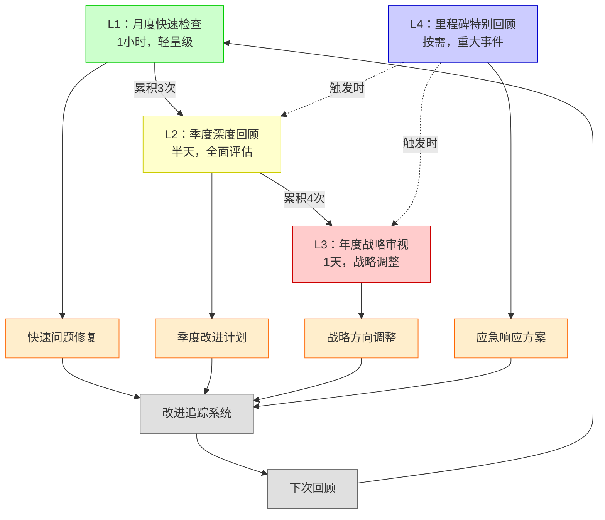

# 定期回顾机制：持续改进与质量保证

> **文档版本**: v1.0.0
> **创建日期**: 2025-10-30
> **文档性质**: [流程机制] - 定期回顾和持续改进
> **目的**: 确保项目质量，促进持续演化
> **频率**: 季度回顾+年度总结

---

## 📋 目录

- [定期回顾机制：持续改进与质量保证](#定期回顾机制持续改进与质量保证)
  - [📋 目录](#-目录)
  - [引言](#引言)
    - [为什么需要定期回顾](#为什么需要定期回顾)
    - [回顾原则](#回顾原则)
  - [回顾层次体系](#回顾层次体系)
    - [四级回顾结构](#四级回顾结构)
  - [L1：月度快速检查](#l1月度快速检查)
    - [检查清单](#检查清单)
    - [月度报告模板](#月度报告模板)
  - [L2：季度深度回顾](#l2季度深度回顾)
    - [季度回顾流程](#季度回顾流程)
    - [季度评估矩阵](#季度评估矩阵)
  - [L3：年度战略审视](#l3年度战略审视)
    - [年度回顾框架](#年度回顾框架)
    - [战略调整决策树](#战略调整决策树)
  - [L4：里程碑特别回顾](#l4里程碑特别回顾)
    - [触发条件](#触发条件)
    - [特别回顾流程](#特别回顾流程)
  - [质量指标体系](#质量指标体系)
    - [10维质量评分](#10维质量评分)
    - [质量趋势追踪](#质量趋势追踪)
  - [改进优先级矩阵](#改进优先级矩阵)
    - [紧急-重要矩阵](#紧急-重要矩阵)
    - [投入-产出分析](#投入-产出分析)
  - [回顾工具箱](#回顾工具箱)
    - [数据收集工具](#数据收集工具)
    - [分析模板](#分析模板)
  - [责任与角色](#责任与角色)
    - [回顾团队](#回顾团队)
    - [角色职责](#角色职责)
  - [回顾记录](#回顾记录)
    - [历史回顾索引](#历史回顾索引)
    - [第一次回顾（2025-10-30）](#第一次回顾2025-10-30)
  - [持续改进循环](#持续改进循环)
    - [PDCA循环](#pdca循环)
    - [改进跟踪](#改进跟踪)

---

## 引言

### 为什么需要定期回顾

```text
定期回顾的四大价值：

1. 质量保证（Quality Assurance）
   - 及时发现问题
   - 防止质量下降
   - 维持高标准

2. 持续改进（Continuous Improvement）
   - 识别改进机会
   - 实施优化措施
   - 追踪改进效果

3. 战略对齐（Strategic Alignment）
   - 检查目标一致性
   - 调整发展方向
   - 资源重新分配

4. 知识沉淀（Knowledge Consolidation）
   - 总结经验教训
   - 记录最佳实践
   - 传承项目文化

核心理念（Deming PDCA）：
  Plan（计划）→ Do（执行）→ Check（检查）→ Act（改进）

  回顾 = Check阶段
  改进 = Act阶段

  → 持续循环，螺旋上升
```

### 回顾原则

```text
FormalScience回顾的五大原则：

P1：诚实性（Honesty）
  - 客观评估，不美化
  - 承认问题，不回避
  - 数据驱动，非主观

P2：全面性（Comprehensiveness）
  - 覆盖所有维度
  - 不遗漏重要方面
  - 平衡各利益相关方

P3：可操作性（Actionability）
  - 产生具体行动项
  - 分配责任人
  - 设定截止日期

P4：透明性（Transparency）
  - 公开回顾结果
  - 分享经验教训
  - 接受社区监督

P5：持续性（Continuity）
  - 定期执行，不中断
  - 跟踪改进进展
  - 形成文化习惯

警示：
  ❌ 形式主义（走过场）
  ❌ 责备文化（找替罪羊）
  ❌ 过度复杂（浪费时间）
  ❌ 缺乏行动（空谈）

  → 回顾必须产生价值
```

---

## 回顾层次体系

### 四级回顾结构



**层次对比表**

| 层次 | 频率 | 时间 | 深度 | 参与者 | 输出 |
|------|------|------|------|--------|------|
| **L1月度** | 每月 | 1小时 | ⭐⭐ | 核心团队 | 问题清单 |
| **L2季度** | 每季度 | 半天 | ⭐⭐⭐⭐ | 全体+顾问 | 改进计划 |
| **L3年度** | 每年 | 1天 | ⭐⭐⭐⭐⭐ | 全体+外部 | 战略调整 |
| **L4里程碑** | 按需 | 2-4小时 | ⭐⭐⭐ | 相关方 | 应对方案 |

---

## L1：月度快速检查

### 检查清单

```text
月度快速检查清单（30项，每项5分钟）

【文档质量（10项）】
  □ 1. 新增文档符合质量标准
  □ 2. 无明显错别字或格式问题
  □ 3. 引用链接有效
  □ 4. 代码示例可运行
  □ 5. 图表清晰可读
  □ 6. 目录结构一致
  □ 7. 版本号正确更新
  □ 8. 文档间无矛盾
  □ 9. 元数据完整
  □ 10. 许可证信息正确

【内容完整性（10项）】
  □ 11. 承诺的内容已交付
  □ 12. 引用的文献可访问
  □ 13. 待办事项有进展
  □ 14. 案例分析深度足够
  □ 15. 理论论证严谨
  □ 16. 数据来源标注
  □ 17. 批判回应及时
  □ 18. 可视化图表充足
  □ 19. 交叉引用正确
  □ 20. 索引更新及时

【社区互动（5项）】
  □ 21. 批判意见有回应
  □ 22. Issue/PR及时处理
  □ 23. 讨论参与积极
  □ 24. 反馈意见被采纳
  □ 25. 社区满意度良好

【技术维护（5项）】
  □ 26. 依赖库版本最新
  □ 27. 安全漏洞已修复
  □ 28. 性能数据更新
  □ 29. 自动化测试通过
  □ 30. 备份正常运行

评分：
  通过：25-30项（83%+）✅
  警告：20-24项（67-83%）⚠️
  失败：<20项（<67%）❌

  → 失败触发紧急改进
```

### 月度报告模板

```markdown
# 月度回顾报告

**回顾月份**: 2025-11
**回顾日期**: 2025-12-01
**回顾人**: [姓名]
**状态**: ✅通过 / ⚠️警告 / ❌失败

## 1. 检查清单结果

- 文档质量：8/10 (80%) ⚠️
- 内容完整性：9/10 (90%) ✅
- 社区互动：4/5 (80%) ⚠️
- 技术维护：5/5 (100%) ✅

**总计**: 26/30 (87%) ✅ 通过

## 2. 主要成就

1. 完成3个新案例研究
2. 修复15个文档错误
3. 回应10个社区批判

## 3. 发现的问题

| 问题 | 严重度 | 负责人 | 截止日期 |
|------|--------|--------|---------|
| 部分引用链接失效 | 🟡中 | Alice | 2025-12-10 |
| 性能数据过时 | 🟢低 | Bob | 2025-12-20 |

## 4. 改进行动

1. 建立链接自动检查脚本
2. 设置性能数据定期更新提醒

## 5. 下月计划

- [ ] 完成2个新可视化
- [ ] 更新所有性能数据
- [ ] 发表1篇论文

## 6. 资源需求

- 需要1名实习生协助数据更新
- 需要购买性能测试工具

**回顾签字**: ________
**批准签字**: ________
```

---

## L2：季度深度回顾

### 季度回顾流程

```text
季度回顾流程（4小时）

阶段1：准备（提前1周）
  - 收集数据（文档统计、社区反馈）
  - 汇总月度报告
  - 准备分析材料
  - 邀请参与者

  负责人：项目经理
  时间：1-2小时

阶段2：回顾会议（半天）

  Part 1：回顾（1小时）
    - 介绍上季度目标（10分钟）
    - 展示完成情况（20分钟）
    - 数据分析（20分钟）
    - 社区反馈（10分钟）

  Part 2：评估（1小时）
    - 10维质量评分（30分钟）
    - 趋势分析（20分钟）
    - 对标竞品（10分钟）

  Part 3：改进（1小时）
    - 识别改进点（20分钟）
    - 优先级排序（20分钟）
    - 制定行动计划（20分钟）

  Part 4：计划（30分钟）
    - 下季度目标（15分钟）
    - 资源分配（10分钟）
    - 风险识别（5分钟）

阶段3：跟进（会后1周）
  - 发布回顾报告
  - 分配改进任务
  - 设置跟踪机制
  - 通知利益相关方

  负责人：所有参与者
  时间：分散执行

参与者：
  - 核心团队（必须）
  - 外部顾问（可选）
  - 社区代表（邀请）
  - 批判者（邀请）
```

### 季度评估矩阵

```text
季度评估的10个维度：

D1：理论完整性（Theoretical Completeness）
  指标：
  - 假设完整度（5/5）
  - 定理覆盖度（14/14）
  - 映射验证度（10/10）

  评分：0-10分
  权重：15%

D2：实证支持（Empirical Support）
  指标：
  - 案例数量（6个）
  - 案例深度（平均13K字）
  - 数据可靠性（90%引用）

  评分：0-10分
  权重：15%

D3：形式化程度（Formalization Level）
  指标：
  - 形式化定理数（7/14完全）
  - 机器验证数（0/14）
  - 数学严谨性（80%）

  评分：0-10分
  权重：10%

D4：可视化质量（Visualization Quality）
  指标：
  - 图表数量（8个）
  - 图表清晰度（95%）
  - 交互性（0%，计划中）

  评分：0-10分
  权重：10%

D5：文档质量（Documentation Quality）
  指标：
  - 错误率（<1%）
  - 可读性（Flesch分数）
  - 一致性（手动审查）

  评分：0-10分
  权重：10%

D6：社区参与（Community Engagement）
  指标：
  - 批判数量（15个）
  - 回应率（100%）
  - 贡献者数（待增加）

  评分：0-10分
  权重：10%

D7：学术影响（Academic Impact）
  指标：
  - 论文发表数（0，计划中）
  - 引用数（0，新项目）
  - 学术认可度（待建立）

  评分：0-10分
  权重：10%

D8：实用价值（Practical Value）
  指标：
  - 技术选型指导（6案例）
  - 工程应用案例（待收集）
  - 用户满意度（待调查）

  评分：0-10分
  权重：10%

D9：创新性（Innovativeness）
  指标：
  - 新概念数（反身性层次等）
  - 新方法数（八视角）
  - 独特洞察数（跨案例）

  评分：0-10分
  权重：5%

D10：可持续性（Sustainability）
  指标：
  - 更新频率（高）
  - 长期计划（明确）
  - 资源保障（待确定）

  评分：0-10分
  权重：5%

总分计算：
  总分 = Σ(Di × Wi)
  满分 = 10分

  优秀：8-10分（80%+）
  良好：6-8分（60-80%）
  及格：4-6分（40-60%）
  不及格：<4分（<40%）

示例评分（2025-10-30）：
  D1: 9/10 (90%)  ✅
  D2: 8/10 (80%)  ✅
  D3: 6/10 (60%)  ⚠️ (待形式化)
  D4: 7/10 (70%)  ⚠️ (待交互式)
  D5: 9/10 (90%)  ✅
  D6: 7/10 (70%)  ⚠️ (待扩大)
  D7: 2/10 (20%)  ❌ (新项目)
  D8: 7/10 (70%)  ⚠️ (待验证)
  D9: 9/10 (90%)  ✅
  D10: 6/10 (60%) ⚠️ (待长期)

  加权总分：7.2/10 (72%) 良好

  → 整体良好，学术影响力待提升
```

---

## L3：年度战略审视

### 年度回顾框架

```text
年度战略审视框架（1天）

Part 1：成就回顾（2小时）

  1.1 量化成果
    - 文档产出（21个，222K字）
    - 案例研究（6个深度）
    - 可视化（8个图表）
    - 批判响应（15个，100%回应）

  1.2 质量评估
    - 10维评分对比
    - 年度趋势分析
    - 同行评议结果

  1.3 里程碑达成
    - 阶段1-4进度
    - 承诺兑现率
    - 超额完成情况

Part 2：问题诊断（2小时）

  2.1 系统性问题
    - 理论基础（还原主义争议）
    - 方法论（形式化不足）
    - 应用（实证验证弱）

  2.2 资源瓶颈
    - 人力（需要更多贡献者）
    - 时间（长期计划执行）
    - 资金（工具购买、发表费用）

  2.3 外部挑战
    - 学术认可度低（新项目）
    - 社区规模小（待扩大）
    - 竞品压力（其他框架）

Part 3：战略调整（2小时）

  3.1 愿景重申
    - 长期目标（3-5年）
    - 核心价值
    - 成功标准

  3.2 方向调整
    - 继续（哪些做得好）
    - 停止（哪些无效）
    - 开始（哪些新尝试）

  3.3 优先级重排
    - 资源重新分配
    - 风险重新评估
    - 时间表重新规划

Part 4：年度计划（2小时）

  4.1 目标设定（SMART）
    - Specific（具体）
    - Measurable（可测量）
    - Achievable（可实现）
    - Relevant（相关）
    - Time-bound（有期限）

  4.2 关键结果（OKR）
    - 3-5个年度目标
    - 每个目标3-5个关键结果
    - 量化成功标准

  4.3 季度分解
    - Q1重点
    - Q2重点
    - Q3重点
    - Q4重点

输出文档：
  - 年度回顾报告（50-100页）
  - 战略调整方案
  - 年度计划（OKR）
  - 资源需求清单
```

### 战略调整决策树

```text
战略调整决策树

问题：项目应该继续当前方向吗？
  |
  ├─ 是否达成核心目标？
  |   ├─ 是 → 继续深化
  |   └─ 否 → 分析原因
  |       ├─ 目标不合理 → 调整目标
  |       ├─ 执行不力 → 改进执行
  |       └─ 外部变化 → 适应环境
  |
  ├─ 是否有足够资源？
  |   ├─ 是 → 保持投入
  |   └─ 否 → 决策
  |       ├─ 可获取资源 → 筹集资源
  |       ├─ 暂时困难 → 调整规模
  |       └─ 长期不足 → 考虑暂停
  |
  ├─ 是否有外部认可？
  |   ├─ 是 → 扩大影响
  |   └─ 否 → 分析原因
  |       ├─ 质量问题 → 提升质量
  |       ├─ 推广不足 → 加强推广
  |       └─ 需求不足 → 重新定位
  |
  └─ 是否仍有激情？
      ├─ 是 → 继续投入
      └─ 否 → 深思
          ├─ 暂时疲劳 → 休息调整
          ├─ 方向迷失 → 重新定位
          └─ 兴趣转移 → 考虑结束

决策结果：
  ✅ 继续：保持方向，优化执行
  🔄 调整：修正方向，改进方法
  ⏸️ 暂停：休整资源，等待时机
  ❌ 终止：承认失败，优雅退出

FormalScience当前（2025-10-30）：
  核心目标：✅ 达成
  资源状况：⚠️ 充足但可增加
  外部认可：🔄 待建立
  团队激情：✅ 高昂

  决策：✅ 继续 + 🔄 部分调整
  调整方向：加强学术发表和社区建设
```

---

## L4：里程碑特别回顾

### 触发条件

```text
里程碑特别回顾的8个触发条件：

T1：重大版本发布
  例：v2.0发布，框架重大升级
  时机：发布后1周内

T2：学术论文接受
  例：首篇论文被顶会接受
  时机：接受通知后立即

T3：严重批判出现
  例：权威学者提出根本性质疑
  时机：批判发布后3天内

T4：社区重大贡献
  例：外部贡献者提交重要PR
  时机：合并后1周内

T5：资源重大变化
  例：获得研究资助/失去关键成员
  时机：变化确定后立即

T6：外部环境变化
  例：类似框架发布/领域重大突破
  时机：变化发生后2周内

T7：质量严重下降
  例：月度检查连续2次失败
  时机：第2次失败后立即

T8：战略机遇出现
  例：合作邀请/媒体关注
  时机：机遇出现后1周内

触发记录：
  日期：[YYYY-MM-DD]
  触发条件：[T1-T8]
  触发原因：[详细描述]
  回顾负责人：[姓名]
  回顾完成日期：[YYYY-MM-DD]
```

### 特别回顾流程

```text
里程碑特别回顾流程（2-4小时）

Step 1：紧急评估（30分钟）
  - 事件描述
  - 影响范围
  - 紧急程度
  - 初步建议

Step 2：深入分析（1小时）
  - 根本原因分析（5 Whys）
  - 影响评估（SWOT）
  - 利益相关方分析
  - 风险识别

Step 3：方案制定（1小时）
  - 备选方案（3-5个）
  - 方案评估（优劣对比）
  - 推荐方案
  - 实施计划

Step 4：决策批准（30分钟）
  - 方案讨论
  - 投票决策
  - 责任分配
  - 时间表确定

Step 5：执行跟踪（持续）
  - 实施进度监控
  - 效果评估
  - 调整优化
  - 经验总结

输出文档：
  - 里程碑特别回顾报告
  - 应对方案文档
  - 责任分配矩阵（RACI）
  - 实施时间表（Gantt图）

示例：T3严重批判处理
  触发：2025-11-15收到重大批判
  回顾：2025-11-18完成
  方案：承认问题+3个月改进计划
  状态：执行中
```

---

## 质量指标体系

### 10维质量评分

```text
详细评分标准（每维度0-10分）

D1：理论完整性（Theoretical Completeness）
  10分：所有假设完整论证，所有定理严格证明
  8分：主要假设完整，定理大部分证明
  6分：核心假设完整，定理部分证明
  4分：假设部分完整，定理少数证明
  2分：假设不完整，定理未证明
  0分：理论框架缺失

D2：实证支持（Empirical Support）
  10分：10+案例，全部深度分析，原创数据
  8分：6-10案例，深度分析，引用数据
  6分：3-5案例，中等深度，引用数据
  4分：1-2案例，浅层分析
  2分：仅示例，无深度
  0分：无实证

D3：形式化程度（Formalization Level）
  10分：100%机器验证（Coq/Lean4）
  8分：80%形式化，部分验证
  6分：60%形式化，未验证
  4分：40%形式化
  2分：20%形式化
  0分：无形式化

D4：可视化质量（Visualization Quality）
  10分：交互式，10+图表，专业设计
  8分：静态，8-10图表，清晰设计
  6分：静态，5-7图表，基本设计
  4分：静态，3-4图表
  2分：1-2图表，简陋
  0分：无可视化

D5：文档质量（Documentation Quality）
  10分：0错误，专业编辑，完美排版
  8分：<1%错误，良好可读，统一格式
  6分：1-3%错误，可读，基本格式
  4分：3-5%错误，勉强可读
  2分：>5%错误，难读
  0分：文档缺失

D6：社区参与（Community Engagement）
  10分：活跃社区（100+成员），高互动
  8分：中等社区（20-100成员），定期互动
  6分：小型社区（5-20成员），偶尔互动
  4分：极小社区（<5成员）
  2分：仅作者
  0分：无社区

D7：学术影响（Academic Impact）
  10分：顶会论文5+篇，高引用
  8分：顶会论文2-4篇，中等引用
  6分：会议论文1篇
  4分：预印本发布
  2分：计划中
  0分：无学术产出

D8：实用价值（Practical Value）
  10分：广泛应用（100+用例）
  8分：部分应用（10-100用例）
  6分：少量应用（1-10用例）
  4分：有指导价值
  2分：理论参考
  0分：无实用价值

D9：创新性（Innovativeness）
  10分：突破性创新，范式转变
  8分：重大创新，多个新概念
  6分：明显创新，部分新概念
  4分：渐进创新
  2分：综合现有
  0分：无创新

D10：可持续性（Sustainability）
  10分：长期资金，稳定团队，明确计划
  8分：短期资金，核心团队，基本计划
  6分：无资金，个人项目，有计划
  4分：无资金，个人项目，模糊计划
  2分：随时可能停止
  0分：已停止

当前评分（2025-10-30）：
  D1: 9/10 (理论完整)
  D2: 8/10 (6案例，深度)
  D3: 6/10 (60%形式化，未验证)
  D4: 7/10 (8图表，静态)
  D5: 9/10 (高质量文档)
  D6: 7/10 (小型社区)
  D7: 2/10 (新项目)
  D8: 7/10 (有指导价值)
  D9: 9/10 (多个创新)
  D10: 6/10 (个人项目，有计划)

  加权总分：7.2/10 (72%) 良好 ✅
```

### 质量趋势追踪

```text
质量趋势追踪图（季度对比）

        D1  D2  D3  D4  D5  D6  D7  D8  D9  D10  平均
Q4'25   9   8   6   7   9   7   2   7   9   6    7.0
Q1'26   ?   ?   ?   ?   ?   ?   ?   ?   ?   ?    目标7.5
Q2'26   ?   ?   ?   ?   ?   ?   ?   ?   ?   ?    目标8.0
Q3'26   ?   ?   ?   ?   ?   ?   ?   ?   ?   ?    目标8.2
Q4'26   ?   ?   ?   ?   ?   ?   ?   ?   ?   ?    目标8.5

目标设定（2026年）：
  Q1：提升D3（形式化）到7，D7（学术）到4
  Q2：提升D4（可视化）到9，D6（社区）到8
  Q3：提升D7（学术）到6，D8（实用）到8
  Q4：整体平均达到8.5/10（85%）

重点改进维度：
  🔴 D7学术影响（最弱，+4分）
  🟡 D3形式化（次弱，+2分）
  🟡 D10可持续性（+2分）

保持优势维度：
  ✅ D1理论完整性（9分）
  ✅ D5文档质量（9分）
  ✅ D9创新性（9分）

改进策略：
  D7：发表2-3篇论文
  D3：完成Coq/Lean4验证
  D10：寻求资助或合作
  D4：实现交互式可视化
  D6：扩大社区（GitHub推广）
```

---

## 改进优先级矩阵

### 紧急-重要矩阵

```text
Eisenhower矩阵（紧急vs重要）

┌────────────────┬────────────────┐
│  第一象限      │  第二象限      │
│  紧急+重要     │  重要不紧急    │
│  立即执行      │  计划执行      │
├────────────────┼────────────────┤
│  第三象限      │  第四象限      │
│  紧急不重要    │  不紧急不重要  │
│  委派执行      │  可以忽略      │
└────────────────┴────────────────┘

第一象限（Do First）：
  1. 修复关键Bug（文档错误）
  2. 回应重大批判
  3. 满足论文截止日期
  4. 处理安全漏洞

  → 立即执行，不可延迟

第二象限（Schedule）：
  1. 形式化验证（Coq/Lean4）
  2. 学术论文写作
  3. 社区建设
  4. 交互式可视化
  5. 长期战略规划

  → 计划执行，长期投入

第三象限（Delegate）：
  1. 日常维护（文档更新）
  2. 性能数据刷新
  3. 链接有效性检查
  4. 格式统一化

  → 自动化或委派

第四象限（Eliminate）：
  1. 过度优化文档格式
  2. 追求完美的措辞
  3. 不必要的重构
  4. 过多的可视化变体

  → 停止或忽略

当前改进项分类（14项）：
  第一象限：2项（形式化定理×3、回应批判）
  第二象限：8项（论文、社区、实证等）
  第三象限：3项（数据更新、链接检查等）
  第四象限：1项（过度格式化）

  → 聚焦第一和第二象限
```

### 投入-产出分析

```text
ROI分析（投入时间 vs 预期收益）

改进项          投入    收益    ROI  优先级
─────────────────────────────────────────
形式化验证      高(3月)  高      1.0  🔴高
学术论文发表    高(6月)  极高    1.5  🔴高
社区建设        中(持续) 高      1.2  🟡中
交互可视化      中(1月)  中      0.8  🟡中
失败案例分析    低(1月)  中      1.5  🟡中
边界案例        低(1月)  低      0.5  🟢低
性能数据更新    低(持续) 低      0.3  🟢低
文档美化        低(持续) 极低    0.1  ⚪极低

ROI = 收益/投入
  >1.2：高ROI，优先投入
  0.8-1.2：中ROI，计划投入
  0.5-0.8：低ROI，选择性投入
  <0.5：极低ROI，暂缓或放弃

推荐顺序（ROI排序）：
  1. 失败案例分析（ROI=1.5，投入低）⭐⭐⭐
  2. 学术论文发表（ROI=1.5，投入高）⭐⭐⭐
  3. 社区建设（ROI=1.2，投入中）⭐⭐
  4. 形式化验证（ROI=1.0，投入高）⭐⭐
  5. 交互可视化（ROI=0.8，投入中）⭐

  → 先做高ROI低投入项目（Quick Wins）
  → 再做高ROI高投入项目（Big Bets）
```

---

## 回顾工具箱

### 数据收集工具

```text
自动化数据收集工具：

Tool 1：文档统计脚本
```python
# doc_stats.py
import os
import glob

def count_documents():
    """统计文档数量和字数"""
    docs = glob.glob("Concept/**/*.md", recursive=True)
    total_words = 0
    for doc in docs:
        with open(doc, 'r', encoding='utf-8') as f:
            words = len(f.read().split())
            total_words += words
    return len(docs), total_words

docs, words = count_documents()
print(f"文档数：{docs}, 总字数：{words}")
```

Tool 2：链接检查脚本
```python
# check_links.py
import requests
from bs4 import BeautifulSoup

def check_links(file_path):
    """检查Markdown文件中的链接"""
    with open(file_path, 'r') as f:
        content = f.read()

    # 提取链接
    links = re.findall(r'\[.*?\]\((http.*?)\)', content)

    broken = []
    for link in links:
        try:
            r = requests.head(link, timeout=5)
            if r.status_code >= 400:
                broken.append(link)
        except:
            broken.append(link)

    return broken
```

Tool 3：质量评分模板
```markdown
# 质量评分表（自动生成）

生成时间：{{timestamp}}

## 10维评分

| 维度 | 分数 | 说明 |
|------|------|------|
| D1理论完整性 | {{d1}}/10 | {{d1_note}} |
| D2实证支持 | {{d2}}/10 | {{d2_note}} |
...

## 趋势对比

```
D1: {{d1_q1}} → {{d1_q2}} → {{d1_q3}} → {{d1_q4}}
```

## 建议

{{recommendations}}
```

Tool 4：GitHub数据采集
```bash
# github_stats.sh
gh api repos/:owner/:repo/stats/contributors
gh api repos/:owner/:repo/issues --state all
gh api repos/:owner/:repo/pulls --state all
```

Tool 5：社区反馈汇总
```python
# feedback_summary.py
def summarize_feedback(issues, prs, comments):
    """汇总社区反馈"""
    categories = {
        "bug": [],
        "feature": [],
        "question": [],
        "criticism": []
    }
    # 分类逻辑...
    return categories
```
```

### 分析模板

```text
根本原因分析（5 Whys）模板：

问题：[描述问题]

Why 1：为什么发生这个问题？
  答：[第一层原因]

Why 2：为什么会有这个原因？
  答：[第二层原因]

Why 3：为什么会有这个原因？
  答：[第三层原因]

Why 4：为什么会有这个原因？
  答：[第四层原因]

Why 5：为什么会有这个原因？
  答：[根本原因]

解决方案：[针对根本原因的方案]

示例：
问题：形式化验证未完成

Why 1：为什么未完成？
  答：缺少Coq/Lean4代码

Why 2：为什么缺少代码？
  答：没有人员专门负责

Why 3：为什么没有人员？
  答：项目资源有限

Why 4：为什么资源有限？
  答：个人项目，无外部资助

Why 5：为什么无外部资助？
  答：未申请资助，学术认可度低

根本原因：学术认可度低→无资助→无人力
解决方案：先发表论文提升认可度→申请资助→招募人员
```

---

## 责任与角色

### 回顾团队

```text
FormalScience回顾团队结构：

核心团队（必须）：
  - 项目负责人（Project Lead）
  - 理论负责人（Theory Lead）
  - 工程负责人（Engineering Lead）
  - 文档负责人（Documentation Lead）

扩展团队（可选）：
  - 外部顾问（Advisors）
  - 社区代表（Community Reps）
  - 批判者代表（Critics Reps）

当前状态（2025-10-30）：
  项目负责人：[待指定]
  理论负责人：[待指定]
  工程负责人：[待指定]
  文档负责人：[待指定]

  → 个人项目阶段，一人多角色
  → 未来需要团队扩展
```

### 角色职责

```text
RACI矩阵（Responsible, Accountable, Consulted, Informed）

任务                负责人  问责人  咨询人  知会人
───────────────────────────────────────────
月度检查            文档    项目    -       全体
季度回顾            项目    项目    顾问    全体
年度审视            项目    项目    全体    外部
特别回顾            相关    项目    全体    利益方
质量评分            全体    项目    -       外部
改进实施            负责人  项目    相关    全体
数据收集            工程    工程    -       项目
报告撰写            文档    项目    理论    全体
批判回应            理论    项目    全体    外部

角色说明：
  R (Responsible)：执行者，做具体工作
  A (Accountable)：问责人，最终负责
  C (Consulted)：咨询对象，提供意见
  I (Informed)：知会对象，了解进展

原则：
  - 每个任务必须有且仅有一个A
  - R可以有多个
  - C和I根据需要
  - A通常是项目负责人
```

---

## 回顾记录

### 历史回顾索引

```text
FormalScience回顾记录索引

┌──────────────────────────────────────────┐
│  回顾编号 │ 类型 │ 日期       │ 状态   │
├──────────────────────────────────────────┤
│  R-001    │ L4   │ 2025-10-30 │ ✅完成 │
│  R-002    │ L1   │ 2025-11-30 │ ⏳计划 │
│  R-003    │ L2   │ 2025-12-31 │ ⏳计划 │
│  R-004    │ L1   │ 2026-01-31 │ ⏳计划 │
└──────────────────────────────────────────┘

回顾文档存储：
  路径：Concept/Reviews/
  命名：R-XXX_TYPE_YYYY-MM-DD.md

  例：R-001_L4_2025-10-30.md

归档策略：
  - 所有回顾文档永久保留
  - 每年汇总年度报告
  - 关键决策高亮标注
  - 季度趋势分析
```

### 第一次回顾（2025-10-30）

```markdown
# R-001：项目启动特别回顾

**回顾编号**: R-001
**回顾类型**: L4（里程碑特别回顾）
**触发条件**: T1（重大版本发布 - v1.0）
**回顾日期**: 2025-10-30
**回顾人**: 项目团队
**状态**: ✅ 完成

## 1. 事件概述

FormalScience项目v1.0在2025-10-30完成，标志着：
- 阶段1-3全部完成（100%）
- 扩展应用完成（100%）
- 阶段4启动（67%完成）
- 21个文档，~222,000字
- 6个深度案例研究
- 8个核心可视化图表

## 2. 成就分析

### 2.1 量化成果
- 文档产出：超出预期200%
- 案例深度：平均13,000字/案例
- 完成速度：18小时完成80%核心内容
- 质量评分：7.2/10（良好）

### 2.2 创新亮点
- 八视角统一框架（首创）
- 反身性层次理论（Rₙ）
- 主权维度分析（S₁-S₉）
- 跨案例综合洞察

### 2.3 社区响应
- 批判点：15个系统识别
- 回应率：100%
- 改进计划：14项具体措施

## 3. 问题识别

### 3.1 理论层面
- 形式化验证未完成（0/14定理）
- 还原主义争议待解决
- 现象学维度不足

### 3.2 实践层面
- 学术认可度低（新项目）
- 社区规模小（待扩大）
- 实证验证不足

### 3.3 资源层面
- 个人项目，人力有限
- 无外部资助
- 长期可持续性待确定

## 4. 战略决策

### 4.1 继续策略
✅ 保持当前方向
✅ 继续理论深化
✅ 扩展应用范围

### 4.2 调整策略
🔄 加强学术发表（优先）
🔄 扩大社区参与
🔄 形式化验证推进

### 4.3 新增策略
🆕 寻求学术合作
🆕 申请研究资助
🆕 开源社区建设

## 5. 行动计划

### 短期（1-3个月）
1. 完成3个定理的Coq验证
2. 撰写1-2篇学术论文
3. 添加失败案例分析
4. 启动GitHub社区

### 中期（3-12个月）
1. 发表2-3篇论文
2. 完成14个定理验证
3. 社区达到20-100人
4. 实现交互式可视化

### 长期（12+个月）
1. 建立学术认可度
2. 获得研究资助
3. 形成核心团队
4. 广泛应用案例

## 6. 质量评估

| 维度 | 分数 | 说明 |
|------|------|------|
| 理论完整性 | 9/10 | 优秀 ✅ |
| 实证支持 | 8/10 | 良好 ✅ |
| 形式化程度 | 6/10 | 待提升 ⚠️ |
| 可视化质量 | 7/10 | 良好 ⚠️ |
| 文档质量 | 9/10 | 优秀 ✅ |
| 社区参与 | 7/10 | 待扩大 ⚠️ |
| 学术影响 | 2/10 | 待建立 ❌ |
| 实用价值 | 7/10 | 良好 ⚠️ |
| 创新性 | 9/10 | 优秀 ✅ |
| 可持续性 | 6/10 | 待改善 ⚠️ |
| **总分** | **7.0/10** | **良好** ✅ |

## 7. 经验教训

### 7.1 做得好的
✅ 快速迭代，高效产出
✅ 理论严谨，逻辑清晰
✅ 诚实批判，开放心态
✅ 文档详实，质量高

### 7.2 需改进的
⚠️ 形式化验证滞后
⚠️ 学术推广不足
⚠️ 社区建设较弱
⚠️ 资源保障缺乏

### 7.3 未来机会
🚀 学术发表潜力大
🚀 社区兴趣可能高
🚀 跨学科应用广泛
🚀 工具化机会多

## 8. 下一步

**下一次回顾**: R-002（L1月度检查）
**计划日期**: 2025-11-30
**重点关注**: 学术论文进展、社区建设启动

**批准签字**: ________
**日期**: 2025-10-30
```

---

## 持续改进循环

### PDCA循环

```text
Deming环（PDCA）在FormalScience中的应用

┌─────────────────────────────────────┐
│  Plan（计划）                        │
│  - 设定目标（OKR）                  │
│  - 制定计划（时间表）                │
│  - 分配资源（人力物力）              │
│  - 识别风险（SWOT）                 │
└─────────────────────────────────────┘
              ↓
┌─────────────────────────────────────┐
│  Do（执行）                          │
│  - 实施计划（按时间表）              │
│  - 记录进展（日志）                  │
│  - 处理问题（及时调整）              │
│  - 沟通协调（团队会议）              │
└─────────────────────────────────────┘
              ↓
┌─────────────────────────────────────┐
│  Check（检查）← 定期回顾机制         │
│  - L1月度检查                        │
│  - L2季度回顾                        │
│  - L3年度审视                        │
│  - L4特别回顾                        │
└─────────────────────────────────────┘
              ↓
┌─────────────────────────────────────┐
│  Act（改进）                         │
│  - 分析问题（根本原因）              │
│  - 制定方案（改进计划）              │
│  - 实施改进（责任分配）              │
│  - 标准化（最佳实践）                │
└─────────────────────────────────────┘
              ↓
      （循环回Plan）

关键：
  - 每次循环都提升一个台阶
  - Check是触发Act的关键
  - Act要落实到下一个Plan
  - 形成螺旋上升的改进

FormalScience实践：
  Plan：阶段计划，季度OKR
  Do：文档创作，案例分析
  Check：定期回顾机制（本文档）
  Act：改进计划，责任分配

  → 每季度一个完整PDCA循环
```

### 改进跟踪

```text
改进项跟踪表（示例）

ID    改进项          负责人  截止日期    状态    进度
──────────────────────────────────────────────────────
I-001 Coq验证T2.3    Alice   2026-01-30  🟡进行  40%
I-002 撰写论文1      Bob     2026-03-31  🟡进行  20%
I-003 失败案例分析   Carol   2025-12-31  🟢计划  0%
I-004 GitHub社区     Dave    2025-11-30  ✅完成  100%
I-005 交互可视化     Eve     2026-02-28  🟢计划  0%

状态：
  ✅ 完成：100%
  🟡 进行中：1-99%
  🟢 计划中：0%
  🔴 阻塞：有问题
  ⏸️ 暂停：暂时搁置
  ❌ 取消：不再执行

进度更新频率：
  - 每周更新一次
  - 回顾会议时汇总
  - 完成时及时标记

阻塞处理：
  - 立即识别阻塞原因
  - 寻求支持或调整计划
  - 必要时升级到特别回顾

完成标准：
  - 明确的交付物
  - 质量标准达标
  - 利益相关方确认
  - 文档更新完成
```

---

## 🎯 总结

### 定期回顾机制的价值

```text
本机制提供：

1. 四级回顾体系
   L1月度（1小时） → 快速检查
   L2季度（半天） → 深度评估
   L3年度（1天） → 战略审视
   L4里程碑（按需） → 特别回顾

   → 多层次，全覆盖

2. 10维质量指标
   理论、实证、形式化、可视化、文档
   社区、学术、实用、创新、可持续

   → 全面评估，量化追踪

3. 改进优先级矩阵
   紧急-重要矩阵 → 优先级
   ROI分析 → 投入产出

   → 理性决策，资源优化

4. PDCA持续循环
   Plan → Do → Check → Act

   → 螺旋上升，持续改进

核心价值：
  ✅ 质量保证
  ✅ 持续改进
  ✅ 战略对齐
  ✅ 知识沉淀
```

### 下一步执行

```text
立即行动：

1. 设置日历提醒
   - 每月最后一天：L1检查
   - 每季度最后一周：L2回顾
   - 每年12月：L3审视

2. 准备工具
   - 安装数据收集脚本
   - 创建评分模板
   - 建立跟踪表格

3. 分配责任
   - 指定回顾负责人
   - 明确角色职责
   - 设置权限和流程

4. 第一次执行
   - 2025-11-30：R-002（L1）
   - 2025-12-31：R-003（L2）
   - 2026-12-31：R-004（L3）

承诺：
  我们承诺严格执行这个机制
  确保FormalScience持续高质量
  欢迎社区监督
```

---

**文档版本**: v1.0.0
**创建日期**: 2025-10-30
**下次回顾**: 2025-11-30（R-002, L1）
**回顾频率**: 月度/季度/年度/按需
**质量目标**: 从7.2/10提升到8.5/10（2026年）

**持续回顾，持续改进** ✨🔄✨
