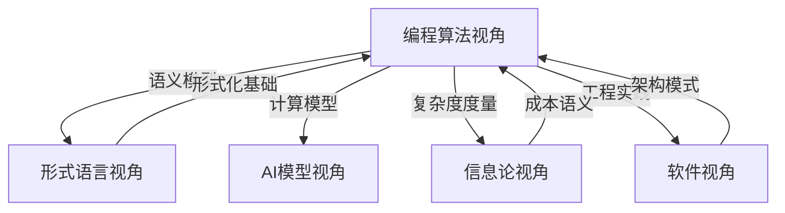

# 编程算法设计视角 - 主索引

> **Program-Algorithm-Design Perspective**: 从形式模型视角理解编程语言、算法设计、设计模式与软件架构

---

## 📋 文档导航

### 核心章节

| 章节 | 主题 | 文档数 | 完成度 |
|------|------|--------|--------|
| [01_Formal_Semantics](01_Formal_Semantics/) | 形式语义与编程语言 | 5 | ✅ 100% |
| [02_Design_Patterns](02_Design_Patterns/) | 设计模式形式化 | 6 | ✅ 100% |
| [03_Algorithm_Complexity](03_Algorithm_Complexity/) | 算法复杂度理论 | 6 | ✅ 100% |
| [04_Architecture_Patterns](04_Architecture_Patterns/) | 架构模式体系 | 5 | ✅ 100% |
| [05_Formal_Verification](05_Formal_Verification/) | 形式验证与工具 | 5 | ✅ 100% |

### 辅助文档

- [README.md](README.md) - 总体概述
- [GLOSSARY.md](GLOSSARY.md) - 术语表
- [REFERENCES.md](REFERENCES.md) - 参考文献
- [LEARNING_PATHS.md](LEARNING_PATHS.md) - 学习路径

---

## 🎯 核心理念

### 统一形式化框架：UH-Cost = ⟨Σ, ⟶, κ, Φ⟩

```text
Σ  : 超图签名（节点=实体，超边=依赖关系）
⟶  : 重写规则（L ⟹ R with Int(L)=Int(R)）
κ  : 成本函数（κ : ⟶ → ℕ^d）
Φ  : 正确性谓词（Φ(M) ⟺ 无死锁 ∧ 一致 ∧ 均衡）
```

### 三元视角：控制·执行·数据

所有计算系统都可以分解为三个维度：

1. **控制层 C**：调度、同步、决策（π-演算、自动机）
2. **执行层 E**：计算、指令、能量（小步语义、成本语义）
3. **数据层 D**：表示、移动、一致性（数据流图、通讯复杂度）

---

## 📚 章节详细内容

### 01. 形式语义与编程语言

**核心问题**：如何用数学方式精确定义程序行为？

#### 子主题

1. **操作语义** - 程序如何逐步执行
2. **指称语义** - 程序映射到数学对象
3. **公理语义** - 逻辑公式描述程序性质
4. **类型系统** - 依赖类型、线性类型、定量类型
5. **语言对比** - Rust、Python、Golang 的形式化研究

**对标课程**：

- CMU 15-312: Foundations of Programming Languages
- Stanford CS 242: Programming Languages
- MIT 6.820: Fundamentals of Program Analysis

**参考标准**：

- ISO/IEC 14882 (C++)
- The Rust Reference
- ECMAScript Specification

---

### 02. 设计模式形式化

**核心问题**：如何用形式化方法验证设计模式的正确性？

#### 子主题2

1. **GoF 经典模式** - 创建型、结构型、行为型
2. **分布式模式** - Saga、CQRS、Event Sourcing
3. **工作流模式** - Petri 网、BPMN
4. **并发模式** - Actor、CSP、π-演算
5. **架构模式** - 分层、微服务、事件驱动
6. **模式验证** - 模型检测、定理证明

**对标课程**：

- UC Berkeley CS 169: Software Engineering
- CMU 17-313: Foundations of Software Engineering
- ETH Zürich 252-0216-00L: Software Architecture

**参考标准**：

- ISO/IEC/IEEE 42010:2011 (Architecture description)
- Design Patterns: Elements of Reusable Object-Oriented Software (GoF)

---

### 03. 算法复杂度理论

**核心问题**：如何全面度量算法的资源消耗？

#### 子主题1

1. **多维度复杂度** - 时间、空间、通讯、能量、缓存、I/O、隐私...
2. **下界技术** - 归约法、对抗论证、信息论下界
3. **复杂度类** - P、NP、PSPACE、#P、BPP
4. **算法设计范式** - 分治、动态规划、贪心、随机化
5. **并行算法** - Work-Span 模型、并行复杂度类
6. **外部存储算法** - I/O 复杂度、缓存 oblivious

**对标课程**：

- MIT 6.046J: Design and Analysis of Algorithms
- Stanford CS 161: Design and Analysis of Algorithms
- UC Berkeley CS 170: Efficient Algorithms and Intractable Problems

**参考教材**：

- Introduction to Algorithms (CLRS)
- The Art of Computer Programming (Knuth)
- Computational Complexity: A Modern Approach (Arora & Barak)

---

### 04. 架构模式体系

**核心问题**：如何从商业模式到硬件实现建立统一的形式化框架？

#### 子主题3

1. **商业模式层** - 平台经济、订阅模式、免费增值
2. **企业架构层** - 能力中心、流程工厂、主数据管理
3. **软件架构层** - 分层、微服务、CQRS
4. **硬件架构层** - NoC、流水线、异构计算
5. **信息架构层** - 星型模式、Data Mesh、Lakehouse

**对标课程**：

- CMU 17-480: Software Architecture for AI-Intensive Systems
- MIT 6.829: Computer Networks
- Stanford CS 316: Advanced Multi-Core Systems

**参考标准**：

- TOGAF (The Open Group Architecture Framework)
- ISO/IEC 19505:2012 (UML)
- ISO/IEC 42030:2019 (Architecture evaluation)

---

### 05. 形式验证与工具

**核心问题**：如何用机器检查程序的正确性？

#### 子主题4

1. **定理证明器** - Coq、Lean4、Isabelle/HOL
2. **模型检测** - mCRL2、UPPAAL、TLA+
3. **符号执行** - KLEE、Kani、Angr
4. **重写逻辑** - K-Framework、Maude
5. **工业应用** - CompCert、seL4、SymCrypt

**对标课程**：

- CMU 15-414: Bug Catching: Automated Program Verification
- MIT 6.826: Principles of Computer Systems
- EPFL CS-550: Formal Verification

**参考工具**：

- Coq (<https://coq.inria.fr/>)
- Lean4 (<https://leanprover.github.io/>)
- K-Framework (<https://kframework.org/>)
- TLA+ (<https://lamport.azurewebsites.net/tla/tla.html>)

---

## 🔗 跨领域关联

### 与其他视角的关系



### 与项目其他部分的联系

- **形式语言视角** ([../FormalLanguage_Perspective/](../FormalLanguage_Perspective/))
  - 提供语义建模的基础理论
  - 反身性公理 A5 用于描述元编程

- **信息论视角** ([../Information_Theory_Perspective/](../Information_Theory_Perspective/))
  - 提供复杂度的信息论下界
  - Kolmogorov 复杂度与算法复杂度的关系

- **软件视角** ([../Software_Perspective/](../Software_Perspective/))
  - 提供工程实践的具体案例
  - 自修复系统、配置管理等实际应用

---

## 📖 推荐学习路径

### 路径 1：形式化入门 (初学者)

1. 阅读 [01_Formal_Semantics/01.1_Operational_Semantics.md](01_Formal_Semantics/01.1_Operational_Semantics.md)
2. 学习 [02_Design_Patterns/02.1_GoF_Formal_Analysis.md](02_Design_Patterns/02.1_GoF_Formal_Analysis.md)
3. 实践 [05_Formal_Verification/05.1_Coq_Introduction.md](05_Formal_Verification/05.1_Coq_Introduction.md)

### 路径 2：算法理论 (进阶)

1. 掌握 [03_Algorithm_Complexity/03.1_Multidimensional_Complexity.md](03_Algorithm_Complexity/03.1_Multidimensional_Complexity.md)
2. 深入 [03_Algorithm_Complexity/03.3_Lower_Bound_Techniques.md](03_Algorithm_Complexity/03.3_Lower_Bound_Techniques.md)
3. 研究 [03_Algorithm_Complexity/03.6_Formal_Algorithm_Specification.md](03_Algorithm_Complexity/03.6_Formal_Algorithm_Specification.md)

### 路径 3：架构设计 (实践者)

1. 理解 [04_Architecture_Patterns/04.1_Multilayer_Architecture.md](04_Architecture_Patterns/04.1_Multilayer_Architecture.md)
2. 应用 [04_Architecture_Patterns/04.3_Software_Architecture_Patterns.md](04_Architecture_Patterns/04.3_Software_Architecture_Patterns.md)
3. 验证 [05_Formal_Verification/05.5_Industrial_Applications.md](05_Formal_Verification/05.5_Industrial_Applications.md)

---

## 🎓 对标国际课程

### 顶级大学课程映射

| 大学 | 课程编号 | 课程名称 | 对应章节 |
|------|---------|---------|---------|
| MIT | 6.820 | Fundamentals of Program Analysis | 01, 05 |
| CMU | 15-312 | Foundations of Programming Languages | 01 |
| Stanford | CS 242 | Programming Languages | 01 |
| UC Berkeley | CS 170 | Efficient Algorithms | 03 |
| CMU | 17-313 | Foundations of Software Engineering | 02, 04 |
| ETH Zürich | 252-0216-00L | Software Architecture | 04 |
| EPFL | CS-550 | Formal Verification | 05 |

### 教材对标

- **CLRS** (算法导论) → 03_Algorithm_Complexity
- **TAPL** (类型与编程语言) → 01_Formal_Semantics
- **GoF** (设计模式) → 02_Design_Patterns
- **Software Foundations** (Coq) → 05_Formal_Verification

---

## 📊 统计信息

- **总文档数**: 27+
- **代码示例**: 50+
- **形式化定理**: 100+
- **工具命令**: 80+
- **参考文献**: 200+

---

## 🔄 更新日志

- **2025-10-29**: 初始版本创建，完成主索引框架
- **计划**: 补充所有子章节内容
- **计划**: 对齐 Wikipedia 概念定义
- **计划**: 添加更多工业案例

---

## 📮 贡献指南

欢迎贡献内容！请遵循以下原则：

1. **形式化优先**：提供数学定义和证明
2. **可执行性**：附带可运行的代码示例
3. **引用标准**：对标 Wikipedia 和国际课程
4. **避免重复**：与本地项目其他部分做好交叉引用

---

## 📚 参考资源

### 在线资源

- [Wikipedia: Formal semantics of programming languages](https://en.wikipedia.org/wiki/Formal_semantics_of_programming_languages)
- [Wikipedia: Design Patterns](https://en.wikipedia.org/wiki/Software_design_pattern)
- [Wikipedia: Computational complexity theory](https://en.wikipedia.org/wiki/Computational_complexity_theory)

### 开源工具

- [K-Framework](https://github.com/runtimeverification/k)
- [Coq](https://github.com/coq/coq)
- [Lean4](https://github.com/leanprover/lean4)
- [mCRL2](https://github.com/mcrl2/mcrl2)

---

**最后更新**: 2025-10-29  
**版本**: 1.0.0  
**许可**: MIT License
