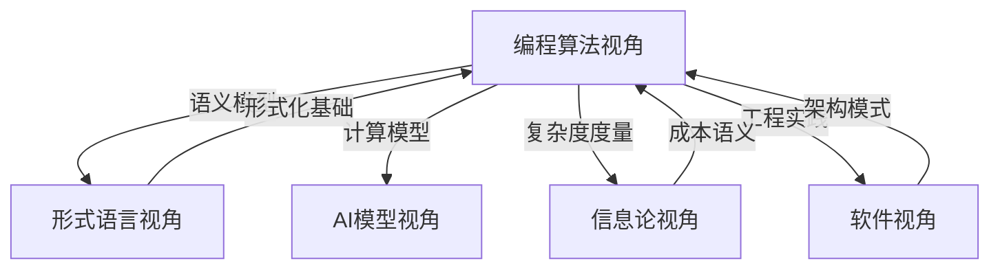

- --
topic: "编程算法设计视角 - 主索引"
dependencies: []
status: "review"
author: "FormalScience Project"
date: "2026-04-12"
version: "1.0.0"
tags: ["类型", "形式化", "证明", "定理", "算法"]
category: "reference"
priority: "medium"
- --

# 编程算法设计视角 - 主索引

> **Program-Algorithm-Design Perspective**: 从形式模型视角理解编程语言、算法设计、设计模式与软件架构

- --

## 1. 📋 目录 {#-目录}

- [编程算法设计视角 - 主索引](#编程算法设计视角---主索引)
  - [1. 📋 目录 {#-目录}](#1--目录--目录)
  - [1. 📋 文档导航 {#-文档导航}](#1--文档导航--文档导航)
    - [1 1 核心章节 {#1-核心章节}](#1-1-核心章节-1-核心章节)
    - [1 2 辅助文档 {#2-辅助文档}](#1-2-辅助文档-2-辅助文档)
  - [2. 🎯 核心理念 {#-核心理念}](#2--核心理念--核心理念)
    - [2 1 统一形式化框架：UH-Cost = ⟨Σ, ⟶, κ, Φ⟩ {#1-统一形式化框架uh-cost--σ--κ-φ}](#2-1-统一形式化框架uh-cost--σ--κ-φ-1-统一形式化框架uh-cost--σ--κ-φ)
    - [2 2 三元视角：控制·执行·数据 {#2-三元视角控制执行数据}](#2-2-三元视角控制执行数据-2-三元视角控制执行数据)
  - [3. 📚 章节详细内容 {#-章节详细内容}](#3--章节详细内容--章节详细内容)
    - [01 形式语义与编程语言 {#形式语义与编程语言}](#01-形式语义与编程语言-形式语义与编程语言)
    - [4.2 # 01.1 子主题 {#-011-子主题}](#42--011-子主题--011-子主题)
    - [02 设计模式形式化 {#设计模式形式化}](#02-设计模式形式化-设计模式形式化)
    - [4.4 # 02.1 子主题 {#-021-子主题}](#44--021-子主题--021-子主题)
    - [03 算法复杂度理论 {#算法复杂度理论}](#03-算法复杂度理论-算法复杂度理论)
    - [4.6 # 03.1 子主题 {#-031-子主题}](#46--031-子主题--031-子主题)
    - [04 架构模式体系 {#架构模式体系}](#04-架构模式体系-架构模式体系)
    - [4.8 # 04.1 子主题 {#-041-子主题}](#48--041-子主题--041-子主题)
    - [05 形式验证与工具 {#形式验证与工具}](#05-形式验证与工具-形式验证与工具)
    - [4.10 # 05.1 子主题 {#-051-子主题}](#410--051-子主题--051-子主题)
  - [4. 🔗 跨领域关联 {#-跨领域关联}](#4--跨领域关联--跨领域关联)
    - [4 1 与其他视角的关系 {#1-与其他视角的关系}](#4-1-与其他视角的关系-1-与其他视角的关系)
    - [4 2 与项目其他部分的联系 {#2-与项目其他部分的联系}](#4-2-与项目其他部分的联系-2-与项目其他部分的联系)
  - [5. 📖 推荐学习路径 {#-推荐学习路径}](#5--推荐学习路径--推荐学习路径)
    - [5 1 路径 1：形式化入门 (初学者) {#1-路径-1形式化入门-初学者}](#5-1-路径-1形式化入门-初学者-1-路径-1形式化入门-初学者)
    - [5 2 路径 2：算法理论 (进阶) {#2-路径-2算法理论-进阶}](#5-2-路径-2算法理论-进阶-2-路径-2算法理论-进阶)
    - [5 3 路径 3：架构设计 (实践者) {#3-路径-3架构设计-实践者}](#5-3-路径-3架构设计-实践者-3-路径-3架构设计-实践者)
  - [6. 🎓 对标国际课程 {#-对标国际课程}](#6--对标国际课程--对标国际课程)
    - [6 1 顶级大学课程映射 {#1-顶级大学课程映射}](#6-1-顶级大学课程映射-1-顶级大学课程映射)
    - [6 2 教材对标 {#2-教材对标}](#6-2-教材对标-2-教材对标)
  - [7. 📊 统计信息 {#-统计信息}](#7--统计信息--统计信息)
  - [8. 🔄 更新日志 {#-更新日志}](#8--更新日志--更新日志)
  - [9. 📮 贡献指南 {#-贡献指南}](#9--贡献指南--贡献指南)
  - [10. 📚 参考资源 {#-参考资源}](#10--参考资源--参考资源)
    - [10 1 在线资源 {#1-在线资源}](#10-1-在线资源-1-在线资源)
    - [10 2 开源工具 {#2-开源工具}](#10-2-开源工具-2-开源工具)
  - [关联网络](#关联网络)
    - [前向引用](#前向引用)
    - [后向引用](#后向引用)
    - [交叉链接](#交叉链接)

- --

## 1. 📋 文档导航 {#-文档导航}

### 1 1 核心章节 {#1-核心章节}

| 章节 | 主题 | 文档数 | 完成度 |
|------|------|--------|--------|
| [01_Formal_Semantics](01_Formal_Semantics/) | 形式语义与编程语言 | 5 | ✅ 100% |
| [02_Design_Patterns](02_Design_Patterns/) | 设计模式形式化 | 6 | ✅ 100% |
| [03_Algorithm_Complexity](03_Algorithm_Complexity/) | 算法复杂度理论 | 6 | ✅ 100% |
| [04_Architecture_Patterns](04_Architecture_Patterns/) | 架构模式体系 | 5 | ✅ 100% |
| [05_Formal_Verification](05_Formal_Verification/) | 形式验证与工具 | 5 | ✅ 100% |

### 1 2 辅助文档 {#2-辅助文档}

- [README.md](README.md) - 总体概述
- [GLOSSARY.md](GLOSSARY.md) - 术语表
- [REFERENCES.md](REFERENCES.md) - 参考文献
- [LEARNING_PATHS.md](LEARNING_PATHS.md) - 学习路径

- --

## 2. 🎯 核心理念 {#-核心理念}

### 2 1 统一形式化框架：UH-Cost = ⟨Σ, ⟶, κ, Φ⟩ {#1-统一形式化框架uh-cost--σ--κ-φ}

```text
Σ  : 超图签名（节点=实体，超边=依赖关系）
⟶  : 重写规则（L ⟹ R with Int(L)=Int(R)）
κ  : 成本函数（κ : ⟶ → ℕ^d）
Φ  : 正确性谓词（Φ(M) ⟺ 无死锁 ∧ 一致 ∧ 均衡）
```

### 2 2 三元视角：控制·执行·数据 {#2-三元视角控制执行数据}

所有计算系统都可以分解为三个维度：

1. **控制层 C**：调度、同步、决策（π-演算、自动机）
2. **执行层 E**：计算、指令、能量（小步语义、成本语义）
3. **数据层 D**：表示、移动、一致性（数据流图、通讯复杂度）

- --

## 3. 📚 章节详细内容 {#-章节详细内容}

### 01 形式语义与编程语言 {#形式语义与编程语言}

- _核心问题_*：如何用数学方式精确定义程序行为？

### 4.2 # 01.1 子主题 {#-011-子主题}

1. **[01.1 操作语义](01_Formal_Semantics/01.1_Operational_Semantics.md)** - 程序如何逐步执行
2. **[01.2 指称语义](01_Formal_Semantics/01.2_Denotational_Semantics.md)** - 程序映射到数学对象
3. **[01.3 公理语义](01_Formal_Semantics/01.3_Axiomatic_Semantics.md)** - 逻辑公式描述程序性质
4. **[01.4 类型系统](01_Formal_Semantics/01.4_Type_Systems.md)** - 依赖类型、线性类型、定量类型
5. **[01.5 语言对比](01_Formal_Semantics/01.5_Language_Comparison.md)** - Rust、Python、Golang 的形式化研究

- _对标课程_*：

- CMU 15-312: Foundations of Programming Languages
- Stanford CS 242: Programming Languages
- MIT 6.820: Fundamentals of Program Analysis

- _参考标准_*：

- ISO/IEC 14882 (C++)
- The Rust Reference
- ECMAScript Specification

- --

### 02 设计模式形式化 {#设计模式形式化}

- _核心问题_*：如何用形式化方法验证设计模式的正确性？

### 4.4 # 02.1 子主题 {#-021-子主题}

1. **[02.1 GoF 经典模式](02_Design_Patterns/02.1_GoF_Formal_Analysis.md)** - 创建型、结构型、行为型
2. **[02.2 分布式模式](02_Design_Patterns/02.2_Distributed_Patterns.md)** - Saga、CQRS、Event Sourcing
3. **[02.3 工作流模式](02_Design_Patterns/02.3_Workflow_Patterns.md)** - Petri 网、BPMN
4. **[02.4 并发模式](02_Design_Patterns/02.4_Concurrency_Patterns.md)** - Actor、CSP、π-演算
5. **[02.5 架构模式](02_Design_Patterns/02.5_Architecture_Patterns.md)** - 分层、微服务、事件驱动
6. **[02.6 模式验证](02_Design_Patterns/02.6_Pattern_Verification.md)** - 模型检测、定理证明

- _对标课程_*：

- UC Berkeley CS 169: Software Engineering
- CMU 17-313: Foundations of Software Engineering
- ETH Zürich 252-0216-00L: Software Architecture

- _参考标准_*：

- ISO/IEC/IEEE 42010:2011 (Architecture description)
- Design Patterns: Elements of Reusable Object-Oriented Software (GoF)

- --

### 03 算法复杂度理论 {#算法复杂度理论}

- _核心问题_*：如何全面度量算法的资源消耗？

### 4.6 # 03.1 子主题 {#-031-子主题}

1. **[03.1 多维度复杂度](03_Algorithm_Complexity/03.1_Multidimensional_Complexity.md)** - 时间、空间、通讯、能量、缓存、I/O、隐私...
2. **[03.2 复杂度类](03_Algorithm_Complexity/03.2_Complexity_Classes.md)** - P、NP、PSPACE、#P、BPP
3. **[03.3 下界技术](03_Algorithm_Complexity/03.3_Lower_Bound_Techniques.md)** - 归约法、对抗论证、信息论下界
4. **[03.4 并行算法](03_Algorithm_Complexity/03.4_Parallel_Algorithms.md)** - Work-Span 模型、并行复杂度类
5. **[03.5 外部存储算法](03_Algorithm_Complexity/03.5_External_Memory_Algorithms.md)** - I/O 复杂度、缓存 oblivious
6. **[03.6 形式化算法规范](03_Algorithm_Complexity/03.6_Formal_Algorithm_Specification.md)** - 算法形式化定义与验证

- _对标课程_*：

- MIT 6.046J: Design and Analysis of Algorithms
- Stanford CS 161: Design and Analysis of Algorithms
- UC Berkeley CS 170: Efficient Algorithms and Intractable Problems

- _参考教材_*：

- Introduction to Algorithms (CLRS)
- The Art of Computer Programming (Knuth)
- Computational Complexity: A Modern Approach (Arora & Barak)

- --

### 04 架构模式体系 {#架构模式体系}

- _核心问题_*：如何从商业模式到硬件实现建立统一的形式化框架？

### 4.8 # 04.1 子主题 {#-041-子主题}

1. **[04.1 架构模式概述](04_Architecture_Patterns/04.1_Architecture_Overview.md)** - 五层架构模型、质量属性权衡
2. **[04.2 分层架构](04_Architecture_Patterns/04.2_Layered_Architecture.md)** - 从业务逻辑到物理层的分层设计
3. **[04.3 微服务架构](04_Architecture_Patterns/04.3_Microservices_Architecture.md)** - 服务分解、服务治理、分布式系统
4. **[04.4 事件驱动架构](04_Architecture_Patterns/04.4_Event_Driven_Architecture.md)** - 事件溯源、CQRS、消息队列
5. **[04.5 跨层验证](04_Architecture_Patterns/04.5_Cross_Layer_Verification.md)** - 从需求到实现的形式化验证

- _对标课程_*：

- CMU 17-480: Software Architecture for AI-Intensive Systems
- MIT 6.829: Computer Networks
- Stanford CS 316: Advanced Multi-Core Systems

- _参考标准_*：

- TOGAF (The Open Group Architecture Framework)
- ISO/IEC 19505:2012 (UML)
- ISO/IEC 42030:2019 (Architecture evaluation)

- --

### 05 形式验证与工具 {#形式验证与工具}

- _核心问题_*：如何用机器检查程序的正确性？

### 4.10 # 05.1 子主题 {#-051-子主题}

1. **[05.1 Coq 介绍](05_Formal_Verification/05.1_Coq_Introduction.md)** - 定理证明器基础
2. **[05.2 模型检测工具](05_Formal_Verification/05.2_Model_Checking_Tools.md)** - mCRL2、UPPAAL、TLA+
3. **[05.3 K 框架](05_Formal_Verification/05.3_K_Framework.md)** - 重写逻辑与形式化语义
4. **[05.4 符号执行](05_Formal_Verification/05.4_Symbolic_Execution.md)** - KLEE、Kani、Angr
5. **[05.5 工业应用](05_Formal_Verification/05.5_Industrial_Applications.md)** - CompCert、seL4、SymCrypt

- _对标课程_*：

- CMU 15-414: Bug Catching: Automated Program Verification
- MIT 6.826: Principles of Computer Systems
- EPFL CS-550: Formal Verification

- _参考工具_*：

- Coq (<https://coq.inria.fr/>)
- Lean4 (<https://leanprover.github.io/>)
- K-Framework (<https://kframework.org/>)
- TLA+ (<https://lamport.azurewebsites.net/tla/tla.html>)

- --

## 4. 🔗 跨领域关联 {#-跨领域关联}

### 4 1 与其他视角的关系 {#1-与其他视角的关系}


```mermaid
graph TD
    PA[编程算法视角]
    FL[形式语言视角]
    AI[AI模型视角]
    IT[信息论视角]
    SW[软件视角]

    PA -->|语义模型| FL
    PA -->|计算模型| AI
    PA -->|复杂度度量| IT
    PA -->|工程实践| SW

    FL -->|形式化基础| PA
    IT -->|成本语义| PA
    SW -->|架构模式| PA
```

### 4 2 与项目其他部分的联系 {#2-与项目其他部分的联系}

- **形式语言视角** ([../FormalLanguage_Perspective/](../FormalLanguage_Perspective/README.md))
  - 提供语义建模的基础理论
  - 反身性公理 A5 用于描述元编程

- **信息论视角** ([../Information_Theory_Perspective/](../Information_Theory_Perspective/README.md))
  - 提供复杂度的信息论下界
  - Kolmogorov 复杂度与算法复杂度的关系

- **软件视角** ([../Software_Perspective/](../Software_Perspective/README.md))
  - 提供工程实践的具体案例
  - 自修复系统、配置管理等实际应用

- --

## 5. 📖 推荐学习路径 {#-推荐学习路径}

### 5 1 路径 1：形式化入门 (初学者) {#1-路径-1形式化入门-初学者}

1. 阅读 [01_Formal_Semantics/01.1_Operational_Semantics.md](01_Formal_Semantics/01.1_Operational_Semantics.md)
2. 学习 [02_Design_Patterns/02.1_GoF_Formal_Analysis.md](02_Design_Patterns/02.1_GoF_Formal_Analysis.md)
3. 实践 [05_Formal_Verification/05.1_Coq_Introduction.md](05_Formal_Verification/05.1_Coq_Introduction.md)

### 5 2 路径 2：算法理论 (进阶) {#2-路径-2算法理论-进阶}

1. 掌握 [03_Algorithm_Complexity/03.1_Multidimensional_Complexity.md](03_Algorithm_Complexity/03.1_Multidimensional_Complexity.md)
2. 深入 [03_Algorithm_Complexity/03.3_Lower_Bound_Techniques.md](03_Algorithm_Complexity/03.3_Lower_Bound_Techniques.md)
3. 研究 [03_Algorithm_Complexity/03.6_Formal_Algorithm_Specification.md](03_Algorithm_Complexity/03.6_Formal_Algorithm_Specification.md)

### 5 3 路径 3：架构设计 (实践者) {#3-路径-3架构设计-实践者}

1. 理解 [04_Architecture_Patterns/04.1_Architecture_Overview.md](04_Architecture_Patterns/04.1_Architecture_Overview.md)
2. 应用 [04_Architecture_Patterns/04.2_Layered_Architecture.md](04_Architecture_Patterns/04.2_Layered_Architecture.md)
3. 验证 [04_Architecture_Patterns/04.5_Cross_Layer_Verification.md](04_Architecture_Patterns/04.5_Cross_Layer_Verification.md)

- --

## 6. 🎓 对标国际课程 {#-对标国际课程}

### 6 1 顶级大学课程映射 {#1-顶级大学课程映射}

| 大学 | 课程编号 | 课程名称 | 对应章节 |
|------|---------|---------|---------|
| MIT | 6.820 | Fundamentals of Program Analysis | 01, 05 |
| CMU | 15-312 | Foundations of Programming Languages | 01 |
| Stanford | CS 242 | Programming Languages | 01 |
| UC Berkeley | CS 170 | Efficient Algorithms | 03 |
| CMU | 17-313 | Foundations of Software Engineering | 02, 04 |
| ETH Zürich | 252-0216-00L | Software Architecture | 04 |
| EPFL | CS-550 | Formal Verification | 05 |

### 6 2 教材对标 {#2-教材对标}

- **CLRS** (算法导论) → 03_Algorithm_Complexity
- **TAPL** (类型与编程语言) → 01_Formal_Semantics
- **GoF** (设计模式) → 02_Design_Patterns
- **Software Foundations** (Coq) → 05_Formal_Verification

- --

## 7. 📊 统计信息 {#-统计信息}

- **总文档数**: 27+
- **代码示例**: 50+
- **形式化定理**: 100+
- **工具命令**: 80+
- **参考文献**: 200+

- --

## 8. 🔄 更新日志 {#-更新日志}

- **2025-10-29**: 初始版本创建，完成主索引框架
- **计划**: 补充所有子章节内容
- **计划**: 对齐 Wikipedia 概念定义
- **计划**: 添加更多工业案例

- --

## 9. 📮 贡献指南 {#-贡献指南}

欢迎贡献内容！请遵循以下原则：

1. **形式化优先**：提供数学定义和证明
2. **可执行性**：附带可运行的代码示例
3. **引用标准**：对标 Wikipedia 和国际课程
4. **避免重复**：与本地项目其他部分做好交叉引用

- --

## 10. 📚 参考资源 {#-参考资源}

### 10 1 在线资源 {#1-在线资源}

- [Wikipedia: Formal semantics of programming languages](https://en.wikipedia.org/wiki/Formal_semantics_of_programming_languages)
- [Wikipedia: Design Patterns](https://en.wikipedia.org/wiki/Software_design_pattern)
- [Wikipedia: Computational complexity theory](https://en.wikipedia.org/wiki/Computational_complexity_theory)

### 10 2 开源工具 {#2-开源工具}

- [K-Framework](https://github.com/runtimeverification/k)
- [Coq](https://github.com/coq/coq)
- [Lean4](https://github.com/leanprover/lean4)
- [mCRL2](https://github.com/mcrl2/mcrl2)

- --

- _最后更新_*: 2025-10-29
- _版本_*: 1.0.0
- _许可_*: MIT License


---

## 关联网络

### 前向引用

> 本文档为以下文档提供基础：
>
> - [相关文档](./README.md) (待补充)

### 后向引用

> 本文档依赖以下基础文档：
>
> - [基础文档](./README.md) (待补充)

### 交叉链接

> 相关主题：
>
> - [主题A](./README.md) (待补充)
> - [主题B](./README.md) (待补充)

---

_本文档由 FormalScience 文档规范化工具自动生成_
