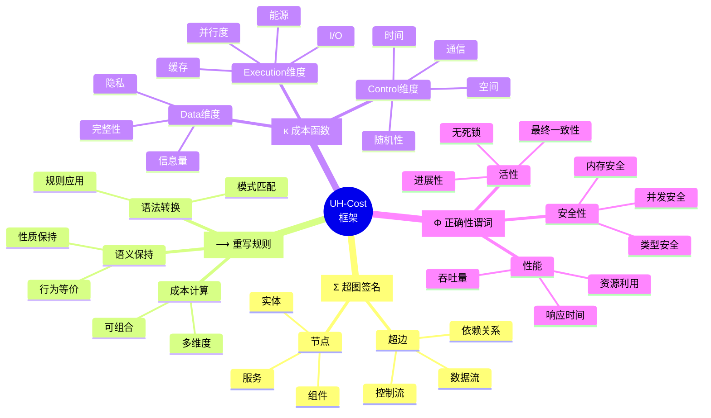

# Program-Algorithm-Design Perspective - 思维导图

> 本文档提供整个知识体系的可视化思维导图，帮助理解各概念之间的关系。

---

## 📋 目录

- [Program-Algorithm-Design Perspective - 思维导图](#program-algorithm-design-perspective---思维导图)
  - [📋 目录](#-目录)
  - [1 📊 整体知识体系思维导图](#1--整体知识体系思维导图)
  - [2 🔄 UH-Cost 框架思维导图](#2--uh-cost-框架思维导图)
  - [3 🌲 形式语义知识树](#3--形式语义知识树)
  - [4 🔀 设计模式分类思维导图](#4--设计模式分类思维导图)
  - [5 🧩 复杂度维度思维导图](#5--复杂度维度思维导图)
  - [6 🏗️ 架构模式层次思维导图](#6-️-架构模式层次思维导图)
  - [7 🛠️ 形式验证工具生态思维导图](#7-️-形式验证工具生态思维导图)
  - [8 🔗 跨项目集成思维导图](#8--跨项目集成思维导图)
  - [9 📚 学习路径思维导图](#9--学习路径思维导图)
  - [10 🎯 核心定理关系图](#10--核心定理关系图)
  - [11 📖 文档导航思维导图](#11--文档导航思维导图)
  - [12 🔄 概念演化时间线](#12--概念演化时间线)
  - [13 使用说明](#13-使用说明)
    - [13.1 如何阅读思维导图](#131-如何阅读思维导图)
    - [13.2 思维导图的价值](#132-思维导图的价值)

---

## 1 📊 整体知识体系思维导图

---

## 2 🔄 UH-Cost 框架思维导图

---

## 3 🌲 形式语义知识树

---

## 4 🔀 设计模式分类思维导图

---

## 5 🧩 复杂度维度思维导图

---

## 6 🏗️ 架构模式层次思维导图

---

## 7 🛠️ 形式验证工具生态思维导图

---

## 8 🔗 跨项目集成思维导图

---

## 9 📚 学习路径思维导图

---

## 10 🎯 核心定理关系图

---

## 11 📖 文档导航思维导图

---

## 12 🔄 概念演化时间线

---

## 13 使用说明

### 13.1 如何阅读思维导图

1. **整体到局部**：先看整体知识体系图，理解五大章节关系
2. **按需深入**：根据学习目标选择具体章节的详细图
3. **关注连接**：注意图中的箭头和虚线，表示概念间的依赖关系
4. **跨图参照**：同一概念可能出现在多个图中，建立多角度理解

### 13.2 思维导图的价值

- **快速定位**：迅速找到感兴趣的主题
- **理解结构**：把握知识的层次和组织
- **发现关联**：看到不同概念之间的联系
- **指导学习**：规划自己的学习路径

---

**版本**: v1.0
**创建日期**: 2025-10-29
**维护者**: Program-Algorithm-Design Perspective Team
