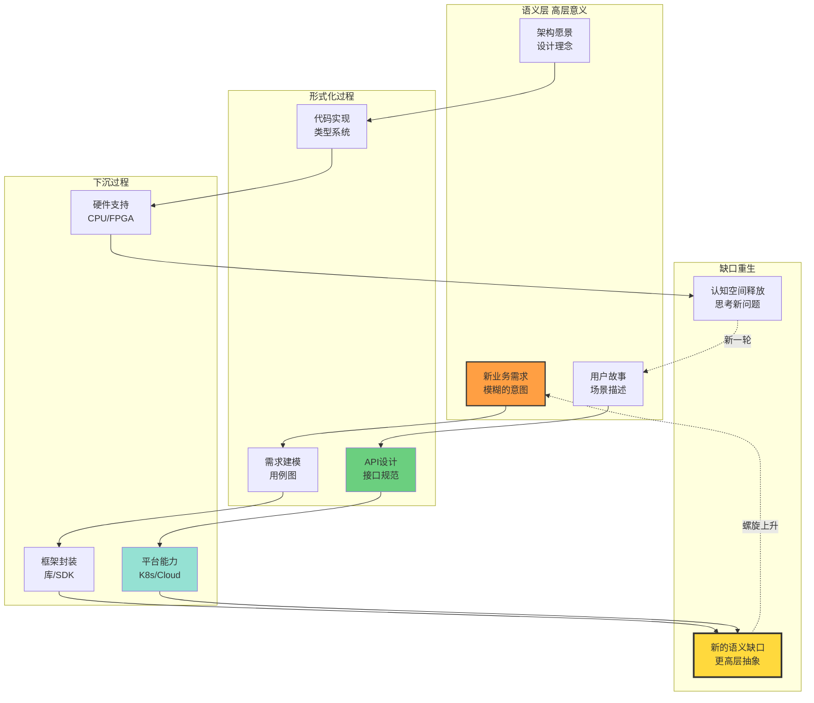
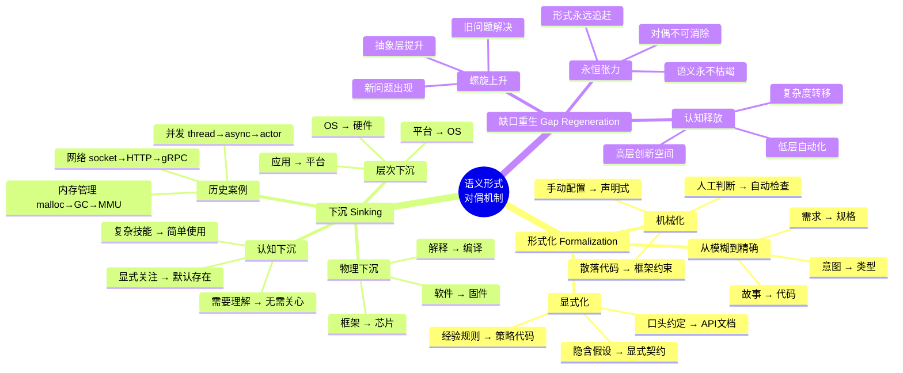
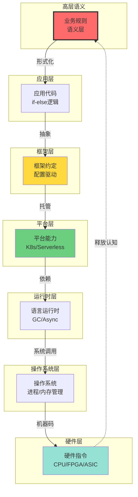
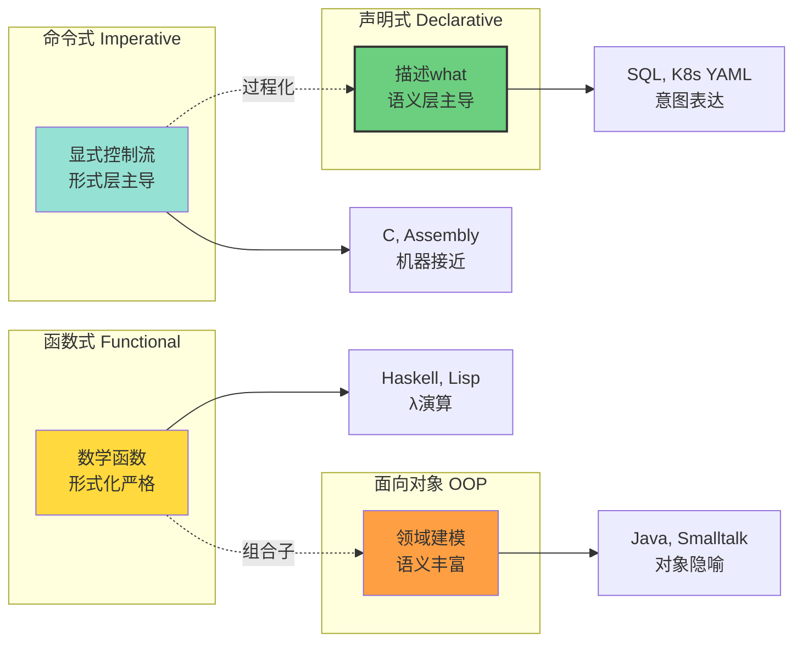

# 1.1 语义层与形式层对偶

> **文档版本**: v1.0.0  
> **最后更新**: 2025-10-27  
> **文档规模**: 332行 | 软件工程的哲学基础  
> **阅读建议**: 本文是Software Perspective的核心概念，阐述意义与规则的对偶关系，建议优先阅读

---

## 目录 | Table of Contents

- [1.1 语义层与形式层对偶](#11-语义层与形式层对偶)
  - [目录 | Table of Contents](#目录--table-of-contents)
  - [概念定义](#概念定义)
  - [📊 核心概念深度分析](#-核心概念深度分析)
    - [1️⃣ 语义-形式对偶概念定义卡](#1️⃣-语义-形式对偶概念定义卡)
    - [2️⃣ 语义-形式螺旋运动全景图](#2️⃣-语义-形式螺旋运动全景图)
    - [3️⃣ 形式化阶梯对比矩阵](#3️⃣-形式化阶梯对比矩阵)
    - [4️⃣ 对偶机制思维导图](#4️⃣-对偶机制思维导图)
    - [5️⃣ 软件栈下沉路径图](#5️⃣-软件栈下沉路径图)
    - [6️⃣ 典型场景的对偶分析](#6️⃣-典型场景的对偶分析)
    - [7️⃣ 对偶关系在编程范式中的体现](#7️⃣-对偶关系在编程范式中的体现)
    - [8️⃣ 对偶视角下的软件危机](#8️⃣-对偶视角下的软件危机)
    - [9️⃣ 对偶哲学的深层启示](#9️⃣-对偶哲学的深层启示)
  - [核心主张](#核心主张)
  - [两层对比](#两层对比)
  - [对偶机制](#对偶机制)
    - [1. 形式化（Formalization）](#1-形式化formalization)
    - [2. 下沉（Sinking）](#2-下沉sinking)
    - [3. 缺口重生（Gap Regeneration）](#3-缺口重生gap-regeneration)
  - [对偶的不对称性](#对偶的不对称性)
    - [语义优先性](#语义优先性)
    - [形式层的完备性追求](#形式层的完备性追求)
  - [实践意义](#实践意义)
    - [1. 架构决策](#1-架构决策)
    - [2. 开发者技能](#2-开发者技能)
    - [3. 平台设计](#3-平台设计)
  - [哲学基础](#哲学基础)
    - [语言游戏（维特根斯坦）](#语言游戏维特根斯坦)
    - [能指与所指（索绪尔）](#能指与所指索绪尔)
    - [形式与质料（亚里士多德）](#形式与质料亚里士多德)
  - [数学类比](#数学类比)
    - [范畴论视角](#范畴论视角)
    - [拓扑学类比](#拓扑学类比)
  - [实践模式](#实践模式)
    - [Pattern 1: 渐进形式化](#pattern-1-渐进形式化)
    - [Pattern 2: 语义保护层](#pattern-2-语义保护层)
    - [Pattern 3: 双向追溯](#pattern-3-双向追溯)
  - [反模式](#反模式)
    - [Anti-Pattern 1: 语义真空](#anti-pattern-1-语义真空)
    - [Anti-Pattern 2: 形式僵化](#anti-pattern-2-形式僵化)
    - [Anti-Pattern 3: 映射断裂](#anti-pattern-3-映射断裂)
  - [评估标准](#评估标准)
    - [好的语义-形式映射](#好的语义-形式映射)
  - [未来趋势](#未来趋势)
    - [1. AI 辅助形式化](#1-ai-辅助形式化)
    - [2. 动态语义层](#2-动态语义层)
    - [3. 形式层硬件化](#3-形式层硬件化)
  - [关键洞察](#关键洞察)
    - [洞察 1：对偶是动态平衡](#洞察-1对偶是动态平衡)
    - [洞察 2：人类价值在语义端](#洞察-2人类价值在语义端)
    - [洞察 3：对偶螺旋永不停止](#洞察-3对偶螺旋永不停止)
  - [延伸阅读](#延伸阅读)
  - [权威参考与标准 | Authoritative References](#权威参考与标准--authoritative-references)
  - [相关主题](#相关主题)

---

## 概念定义

**语义-形式对偶**（Semantic-Formal Duality）是软件工程的哲学基础，描述了人类自创的"意义世界"与可计算的"规则世界"之间的永恒张力与相互转化。

---

## 📊 核心概念深度分析

### 1️⃣ 语义-形式对偶概念定义卡

**概念名称**: 语义-形式对偶（Semantic-Formal Duality）

**内涵（本质属性）**:

- **永恒张力**: 意义世界与规则世界的持续对话
- **螺旋运动**: 形式化→下沉→缺口重生的循环
- **认知解放**: 将旧问题下沉，释放空间思考新问题
- **不可消除性**: 软件复杂度守恒，只能转移不能消灭

**外延（范围边界）**:

- ✅ **语义层**: 商业价值、用户故事、领域概念、设计意图
- ✅ **形式层**: 代码、类型系统、协议、硬件指令
- ✅ **对偶机制**: 形式化、下沉、缺口重生
- ❌ **非对偶**: 纯技术问题（无语义）、纯哲学（无形式化）

**属性维度表**:

| 维度 | 语义层 | 形式层 | 对偶关系 |
|------|--------|--------|---------|
| **本质** | 意义赋予 | 规则执行 | 相互定义 |
| **可解释性** | 高（人类理解） | 低（机器执行） | 互补 |
| **可自动化** | 低（需判断） | 高（机械化） | 转化目标 |
| **稳定性** | 不稳定（持续演化） | 相对稳定（已固化） | 动态平衡 |
| **复杂度** | 不断涌现 | 不断下沉 | 守恒定律 |
| **载体** | 文档、会议、意图 | 代码、配置、硬件 | 映射关系 |
| **验证** | 争论、解释 | 测试、证明 | 双重验证 |

### 2️⃣ 语义-形式螺旋运动全景图



### 3️⃣ 形式化阶梯对比矩阵

| 抽象层次 | 语义表达 | 形式化手段 | 自动化程度 | 典型工具 | 示例 |
|---------|---------|-----------|-----------|---------|------|
| **商业语义** | 商业价值、战略 | 业务建模 | ❌ 低 | 白板、文档 | "提升用户留存率" |
| **需求语义** | 用户故事 | 用例图、BDD | ⚠️ 部分 | JIRA, Cucumber | "用户可以登录" |
| **架构语义** | 架构模式 | ADR, C4图 | ⚠️ 部分 | PlantUML, Mermaid | "微服务架构" |
| **代码语义** | 逻辑意图 | 类型系统、注释 | ✅ 高 | IDE, 编译器 | `class User {}` |
| **配置语义** | 部署意图 | YAML/IaC | ✅ 高 | Terraform, K8s | `replicas: 3` |
| **协议语义** | 通信约定 | 接口规范 | ✅ 高 | OpenAPI, gRPC | REST API |
| **硬件语义** | 物理实现 | Verilog/VHDL | ✅ 全自动 | FPGA, ASIC | 逻辑门 |

### 4️⃣ 对偶机制思维导图



### 5️⃣ 软件栈下沉路径图



### 6️⃣ 典型场景的对偶分析

| 场景 | 语义表达 | 形式化方案 | 下沉路径 | 新缺口 |
|------|---------|-----------|---------|--------|
| **登录认证** | "用户要安全登录" | JWT规范+RBAC | OAuth2→Auth0→指纹识别 | "无感知登录" |
| **高可用** | "系统不能宕机" | 多副本+健康检查 | 应用HA→K8s→云厂商SLA | "全球多活" |
| **数据一致性** | "数据要准确" | ACID事务 | 应用事务→数据库→分布式共识 | "最终一致性" |
| **性能优化** | "要快" | 缓存+异步 | 应用缓存→Redis→CDN→边缘计算 | "实时性" |
| **可观测性** | "知道系统状态" | 日志+监控 | 打log→APM→eBPF内核追踪 | "智能诊断" |

### 7️⃣ 对偶关系在编程范式中的体现



### 8️⃣ 对偶视角下的软件危机

| 危机类型 | 本质原因 | 对偶失衡表现 | 解决方向 |
|---------|---------|------------|---------|
| **需求变更** | 语义层不稳定 | 形式化过早固化 | 敏捷、迭代式开发 |
| **技术债** | 形式化不彻底 | 语义混入实现 | 重构、架构清理 |
| **过度工程** | 过度形式化 | 忽视实际语义需求 | YAGNI原则 |
| **文档陈旧** | 语义-形式不同步 | 代码变了文档未变 | Doc as Code |
| **平台锁定** | 下沉过深 | 语义被特定形式绑定 | 抽象层解耦 |
| **复杂度爆炸** | 未及时下沉 | 所有复杂度在应用层 | 平台化、框架化 |

### 9️⃣ 对偶哲学的深层启示

| 哲学维度 | 对偶启示 | 软件工程实践 | 更广泛意义 |
|---------|---------|------------|-----------|
| **认识论** | 语义无法完全形式化 | 需求永远有歧义 | 人类理解的局限性 |
| **本体论** | 意义是人类建构的 | 软件是社会人工物 | 实在论vs建构论 |
| **方法论** | 螺旋迭代是必然 | 敏捷优于瀑布 | 辩证法的运动观 |
| **价值论** | 语义层是目的 | 技术服务业务 | 工具理性vs价值理性 |
| **复杂度守恒** | 复杂度不可消灭 | 只能转移或隐藏 | 熵增定律的类比 |

---

## 核心主张

软件开发的本质不是"写代码"，而是**持续地在语义层（不可精确量化的意义）与形式层（可机械执行的规则）之间建立映射、破坏映射、重建映射**的螺旋过程。

## 两层对比

| 维度 | 语义层（意义世界） | 形式层（规则世界） |
|------|-------------------|-------------------|
| **本质** | 人类自创的意义赋予 | 可计算的符号操作 |
| **表现** | 商业价值、用户故事、领域概念 | 代码、类型系统、逻辑门、协议 |
| **特征** | 可被解释、争论、再叙事 | 可被判定、合成、物理固化 |
| **动态** | 不断生成新问题 | 不断下沉旧答案 |
| **载体** | 诗歌、法律、货币、公司章程 | 图灵机、汇编、Verilog、RTL |
| **核心问题** | "为什么"（目的） | "怎么必然发生"（机制） |
| **可自动化** | 低（需人类判断） | 高（可机械执行） |

## 对偶机制

### 1. 形式化（Formalization）

**定义**：将语义层的模糊概念转化为精确的形式系统。

**示例**：

- "用户应该能登录" → `POST /api/login` + JWT 规范
- "系统要高可用" → `replicas: 3` + `livenessProbe`
- "不允许未授权访问" → OPA Rego 策略

**关键特征**：

- 从模糊到精确
- 从隐式到显式
- 从人类语言到机器语言

### 2. 下沉（Sinking）

**定义**：将形式化的规则进一步物理化、平台化，成为默认存在。

**示例路径**：

```
业务规则 → 应用代码 → 框架约定 → 运行时保证 → 硬件指令
```

**具体案例**：

- 内存管理：手动 malloc → GC → 语言运行时 → CPU MMU
- 网络可靠性：应用重试 → TCP 协议 → 网卡硬件校验

### 3. 缺口重生（Gap Regeneration）

**定义**：当旧的语义缺口被形式化并下沉后，新的语义缺口在更高层出现。

**循环模式**：

```
语义缺口 A
  ↓ 形式化
形式系统 A'
  ↓ 下沉
平台能力 A''
  ↓ 释放认知空间
语义缺口 B（更高阶的问题）
```

**历史案例**：

1. 机器码难写 → 汇编语言 → 新问题：汇编难维护
2. 汇编难维护 → 高级语言 → 新问题：如何组织大型程序
3. 过程耦合 → 面向对象 → 新问题：分布式系统如何协同
4. 手动运维 → K8s 自动化 → 新问题：谁来维护 K8s

## 对偶的不对称性

### 语义优先性

**语义层无法被完全形式化**，总存在"可解释但不可算法化"的部分：

- 艺术审美
- 伦理判断
- 商业直觉
- 创新洞察

### 形式层的完备性追求

形式层永远试图**完备化**（捕获所有语义），但根据哥德尔不完备定理，任何足够强大的形式系统都存在：

1. 不可判定的命题
2. 不可证明但为真的陈述

**软件工程映射**：

- 不存在"完美捕获所有需求"的类型系统
- 不存在"自动验证所有正确性"的测试框架

## 实践意义

### 1. 架构决策

**好的架构**：在正确的层级做形式化

| 决策 | 语义层保留 | 形式层固化 |
|-----|-----------|-----------|
| 微服务边界 | 业务领域划分（语义） | gRPC 接口契约（形式） |
| 数据模型 | 实体关系语义 | SQL Schema / JSON Schema |
| 策略治理 | 安全策略意图 | OPA Rego 规则 |

### 2. 开发者技能

**未来核心能力**：

- **语义建模**：准确捕获业务意图
- **形式翻译**：将意图转化为可执行系统
- **缺口识别**：发现旧形式系统无法覆盖的新语义

### 3. 平台设计

**平台的本质**：把"已稳定的语义-形式映射"固化为可复用能力

**示例**：

- K8s：将"服务存活"这一语义固化为 Deployment/Pod 机制
- GitOps：将"配置版本化"这一语义固化为 Git + Sync 机制

## 哲学基础

### 语言游戏（维特根斯坦）

意义不是固定的，而是在**使用**中生成：

- 代码注释（语义）vs 代码逻辑（形式）
- API 文档（语义）vs API 实现（形式）

**矛盾案例**：

- 注释说"线程安全"，但实现不加锁 → 语义-形式失配

### 能指与所指（索绪尔）

- **能指**（Signifier）：代码符号本身（如 `user.login()`）
- **所指**（Signified）：符号指向的意义（"用户登录行为"）

**软件中的滑动**：

- 重构：改变能指（代码结构），保持所指（业务逻辑）
- 需求变更：改变所指（意义），必须更新能指（代码）

### 形式与质料（亚里士多德）

- **形式**（Form）：系统的结构、架构、模式
- **质料**（Matter）：具体的代码、数据、硬件

**软件映射**：

- 架构模式（MVC、微服务）= 形式
- 具体代码实现 = 质料

## 数学类比

### 范畴论视角

语义-形式对偶可建模为两个范畴之间的伴随函子：

```
Semantic Category ⇄ Formal Category
     (意义)    ⊣    (规则)
```

- **左伴随**（Formalization）：F: Semantic → Formal
- **右伴随**（Interpretation）：G: Formal → Semantic

**性质**：

- F(G(code)) ⊇ code（形式化后再解释会损失精度）
- G(F(意图)) ⊆ 意图（解释形式系统无法完全恢复原始意图）

### 拓扑学类比

- **语义空间**：连续的、模糊的拓扑空间
- **形式空间**：离散的、精确的度量空间
- **映射**：从连续到离散的量化过程（类似采样）

## 实践模式

### Pattern 1: 渐进形式化

**原则**：不要一次性形式化所有语义，而是根据成熟度逐步固化。

**阶段**：

1. **探索期**：自然语言文档（纯语义）
2. **固化期**：类型系统 + 测试（部分形式）
3. **平台期**：框架 + 规范（强制形式）

**案例**：

- 初创公司：单体应用 + 自然语言文档
- 成长期：微服务 + OpenAPI 规范
- 成熟期：Service Mesh + Policy-as-Code

### Pattern 2: 语义保护层

**问题**：过早形式化会扼杀创新。

**解决方案**：在确定性要求不高的地方，保留语义层的灵活性。

**示例**：

```yaml
# 形式层（强约束）
apiVersion: v1
kind: Service
spec:
  type: LoadBalancer

# 语义层（保留自由度）
metadata:
  annotations:
    description: "暂时用 LB，后续可能改 Ingress"
```

### Pattern 3: 双向追溯

**目标**：确保形式系统可追溯到语义来源。

**实现**：

- 代码注释链接到需求文档
- Git commit 关联 issue tracker
- OPA 策略注释解释业务原因

## 反模式

### Anti-Pattern 1: 语义真空

**问题**：纯粹技术实现，没有语义上下文。

**表现**：

- "这个类叫 Manager，管什么？"
- "为什么要这样设计？""不知道，历史遗留的"

**危害**：无法演进，成为技术债。

### Anti-Pattern 2: 形式僵化

**问题**：过度形式化，限制业务灵活性。

**表现**：

- 修改一个字段要改 10 个地方
- 新需求总是"系统不支持"

**危害**：业务无法创新。

### Anti-Pattern 3: 映射断裂

**问题**：形式系统与语义意图长期不一致。

**表现**：

- 代码写着 A，注释说 B，实际做 C
- 文档过期，与代码完全不符

**危害**：认知负载爆炸。

## 评估标准

### 好的语义-形式映射

| 标准 | 说明 | 检验方法 |
|-----|------|---------|
| **可追溯性** | 形式可追溯到语义来源 | Git blame → issue → 需求文档 |
| **一致性** | 语义与形式不矛盾 | 代码审查、类型检查 |
| **适度性** | 形式化程度匹配成熟度 | 避免过早优化 |
| **可演进性** | 支持语义变化 | 修改影响范围可控 |

## 未来趋势

### 1. AI 辅助形式化

- **语义 → 形式**：自然语言 → 代码（Copilot）
- **形式 → 语义**：代码 → 文档（自动生成）

**挑战**：AI 生成的形式是否保持语义一致性？

### 2. 动态语义层

**新兴需求**：系统需要在运行时理解和适应新语义。

**技术方向**：

- 语义搜索（向量数据库）
- 动态策略（实时 OPA 规则更新）
- 自适应架构（根据业务模式调整）

### 3. 形式层硬件化

**趋势**：策略直接固化到硅片。

**示例**：

- Armv9 CCA：可信计算架构
- RISC-V 扩展：自定义安全指令

## 关键洞察

### 洞察 1：对偶是动态平衡

不存在"一次性正确的形式化"，只有"当前阶段最合适的形式化"。

### 洞察 2：人类价值在语义端

当形式层被 AI 和平台接管，人类的核心价值在于：

1. 提出有意义的问题（语义生成）
2. 判断形式系统是否符合意图（语义验证）

### 洞察 3：对偶螺旋永不停止

每一次"语义→形式→下沉"都会催生新的语义缺口，这是人类认知永恒扩展的机制。

## 延伸阅读

### 哲学

- 维特根斯坦《哲学研究》 - 语言游戏
- 海德格尔《存在与时间》 - 在世存在
- 德里达《论文字学》 - 延异

### 计算机科学

- "Out of the Tar Pit" - Moseley & Marks
- "The Next 700 Programming Languages" - Landin
- "No Silver Bullet" - Brooks

### 软件工程

- 《领域驱动设计》 - Eric Evans
- 《架构整洁之道》 - Robert Martin
- 《人月神话》 - Frederick Brooks

---

## 权威参考与标准 | Authoritative References

### 哲学与认知科学基础

1. **Searle, J. R. (1980)**. "Minds, Brains, and Programs". *Behavioral and Brain Sciences*.
   - 📄 **DOI**: [10.1017/S0140525X00005756](https://doi.org/10.1017/S0140525X00005756)
   - 🏆 **引用**: 10,000+
   - ⭐ **地位**: 中文屋论证，语法vs语义经典论文
   - 💡 **内容**: 形式操作不等于意义理解

2. **Wittgenstein, L. (1953)**. *Philosophical Investigations*. Blackwell.
   - 📖 **经典**: 语言游戏理论
   - ⭐ **地位**: 20世纪最重要哲学著作之一
   - 💡 **内容**: 意义即使用（Meaning as Use）

3. **Lakoff, G., & Johnson, M. (1980)**. *Metaphors We Live By*. University of Chicago Press.
   - 📖 **ISBN**: 978-0226468013
   - 🏆 **引用**: 50,000+
   - 💡 **内容**: 概念隐喻理论，意义的具身性

### 编程语言理论

4. **Pierce, B. C. (2002)**. *Types and Programming Languages*. MIT Press.
   - 📖 **ISBN**: 978-0262162098
   - ⭐ **地位**: 类型论标准教材
   - 💡 **章节**: 语法与语义的形式化对应

5. **Scott, D. S., & Strachey, C. (1971)**. "Toward a Mathematical Semantics for Computer Languages". *Technical Monograph PRG-6*.
   - 📄 **经典**: 指称语义学奠基
   - ⭐ **地位**: 编程语言语义学开创
   - 💡 **内容**: 语法树到数学对象的映射

6. **Plotkin, G. D. (1981)**. "A Structural Approach to Operational Semantics". *DAIMI Report FN-19*.
   - 📄 **经典**: 结构化操作语义（SOS）
   - 🏆 **引用**: 5,000+
   - 💡 **内容**: 程序执行的形式化语义

### 软件工程经典

7. **Brooks, F. P. (1975)**. *The Mythical Man-Month*. Addison-Wesley.
   - 📖 **ISBN**: 978-0201835953
   - 🏆 **图灵奖**: 1999年
   - ⭐ **地位**: 软件工程经典著作
   - 💡 **观点**: "没有银弹"—复杂度本质 vs 偶然

8. **Dijkstra, E. W. (1968)**. "Go To Statement Considered Harmful". *Communications of the ACM*.
   - 📄 **DOI**: [10.1145/362929.362947](https://doi.org/10.1145/362929.362947)
   - 🏆 **图灵奖**: 1972年
   - ⭐ **影响**: 结构化编程运动
   - 💡 **本质**: 语法结构与语义清晰度的对应

9. **Hoare, C. A. R. (1969)**. "An Axiomatic Basis for Computer Programming". *Communications of the ACM*.
   - 📄 **DOI**: [10.1145/363235.363259](https://doi.org/10.1145/363235.363259)
   - 🏆 **图灵奖**: 1980年
   - ⭐ **地位**: Hoare逻辑，程序验证基础
   - 💡 **内容**: 形式规约（语义）与程序（语法）的对应

### 领域驱动设计

10. **Evans, E. (2003)**. *Domain-Driven Design: Tackling Complexity in the Heart of Software*. Addison-Wesley.
    - 📖 **ISBN**: 978-0321125217
    - 🏆 **引用**: 10,000+
    - ⭐ **地位**: DDD经典著作
    - 💡 **核心**: Ubiquitous Language—领域语义与代码语法的统一

11. **Vernon, V. (2013)**. *Implementing Domain-Driven Design*. Addison-Wesley.
    - 📖 **ISBN**: 978-0321834577
    - 💡 **实践**: DDD实施指南

### 架构理论

12. **Martin, R. C. (2017)**. *Clean Architecture*. Prentice Hall.
    - 📖 **ISBN**: 978-0134494166
    - ⭐ **作者**: Uncle Bob
    - 💡 **原则**: 依赖倒置、抽象层次分离

13. **Fowler, M. (2002)**. *Patterns of Enterprise Application Architecture*. Addison-Wesley.
    - 📖 **ISBN**: 978-0321127426
    - ⭐ **地位**: 企业架构模式权威
    - 💡 **模式**: Domain Model, Service Layer等

### 认知语言学

14. **Pinker, S. (1994)**. *The Language Instinct*. William Morrow.
    - 📖 **ISBN**: 978-0060958336
    - 💡 **内容**: 语言的认知基础

15. **Chomsky, N. (1957)**. *Syntactic Structures*. Mouton.
    - 📖 **经典**: 生成语法理论
    - ⭐ **地位**: 现代语言学奠基
    - 💡 **观点**: 语法的形式化与意义生成

### 符号学

16. **Peirce, C. S. (1931-1958)**. *Collected Papers*. Harvard University Press.
    - 📖 **经典**: 符号三元论（Symbol-Object-Interpretant）
    - 💡 **相关**: 符号（语法）-对象（所指）-解释（语义）

17. **Saussure, F. de (1916)**. *Course in General Linguistics*. Open Court.
    - 📖 **经典**: 能指（Signifier）与所指（Signified）
    - ⭐ **地位**: 结构主义语言学奠基
    - 💡 **对应**: 形式层（能指） vs 语义层（所指）

### 在线资源

18. **Stanford Encyclopedia of Philosophy - Meaning and Communication**
    - 🔗 [plato.stanford.edu/entries/meaning/](https://plato.stanford.edu/entries/meaning/)
    - ✅ **验证**: 2025-10-27
    - 💡 **内容**: 语义理论哲学分析

19. **Wikipedia - Syntax-Semantics Interface**
    - 🔗 [en.wikipedia.org/wiki/Syntax-semantics_interface](https://en.wikipedia.org/wiki/Syntax-semantics_interface)
    - ✅ **验证**: 2025-10-27

### 验证与引用统计（截至2025-10-27）

| 作者/著作 | 年份 | 引用数 | 贡献 |
|----------|------|--------|------|
| Searle (中文屋) | 1980 | 10,000+ | 语法vs语义 |
| Lakoff & Johnson | 1980 | 50,000+ | 概念隐喻 |
| Evans (DDD) | 2003 | 10,000+ | Ubiquitous Language |
| Brooks | 1975 | 30,000+ | 本质vs偶然复杂度（图灵奖） |
| Hoare | 1969 | 8,000+ | 形式规约（图灵奖） |

**数据来源**: Google Scholar, ACM Digital Library (2025-10-27)

---

## 相关主题

- [1.2 计算抽象的层次](./01.2_Computational_Abstraction_Layers.md)
- [3.1 六段螺旋映射框架](../03_Semantic_Formal_Duality/03.1_Six_Spiral_Framework.md)
- [3.4 软件作为即时编译器](../03_Semantic_Formal_Duality/03.4_Software_as_JIT_Compiler.md)

---
