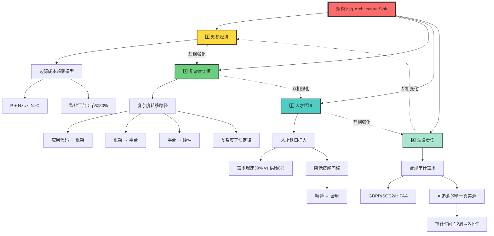
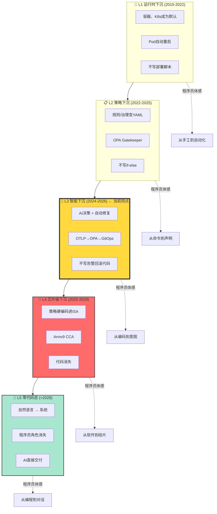
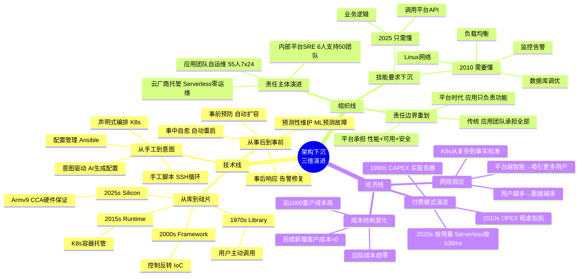
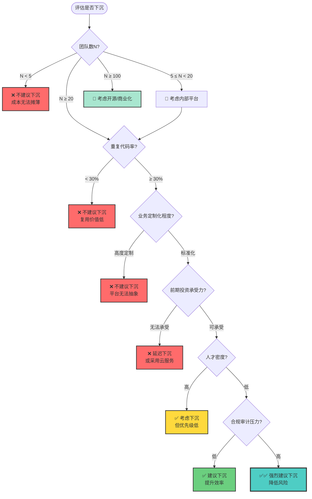
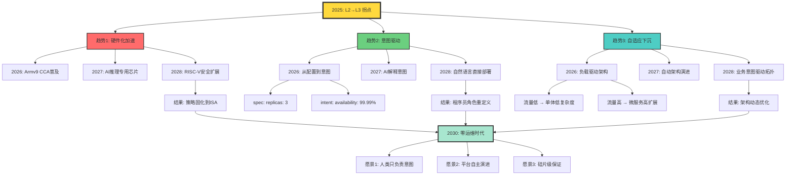

# 2.1 架构下沉原理与动因

> **文档版本**: v1.0.0  
> **最后更新**: 2025-10-27  
> **文档规模**: 472行 | 架构下沉的四大动因分析  
> **阅读建议**: 本文阐述架构下沉的经济学和技术原理，是理解Software Perspective核心观点的关键

---

## 目录 | Table of Contents

- [2.1 架构下沉的原理与驱动力](#21-架构下沉的原理与驱动力)
  - [目录 | Table of Contents](#目录--table-of-contents)
  - [核心概念深度分析](#核心概念深度分析)
  - [核心定义](#核心定义)
  - [核心公式](#核心公式)
  - [四大动因](#四大动因)
    - [1. 规模经济](#1-规模经济)
    - [2. 复杂度守恒](#2-复杂度守恒)
    - [3. 人才稀缺](#3-人才稀缺)
    - [4. 法律责任](#4-法律责任)
  - [下沉的三条技术线](#下沉的三条技术线)
  - [下沉的三条组织线](#下沉的三条组织线)
  - [下沉的三条经济线](#下沉的三条经济线)
  - [关键洞察](#关键洞察)
  - [相关主题](#相关主题)

---

## 核心概念深度分析

<details>
<summary><b>📊 点击展开：架构下沉多维分析框架</b></summary>

本节提供架构下沉理论的全景式深度分析，包括概念定义、四大动因关系、演进路径、多维对比、阻力分析和未来趋势。

### 1️⃣ 架构下沉概念定义卡

**概念名称**: 架构下沉（Architecture Sink）

**内涵（本质属性）**:

**🔹 核心思想**:
- **复杂度转移**: 将应用层重复出现的复杂性转移到平台层、运行时层、硬件层
- **一次构建，N次复用**: 平台承担复杂度，应用获得简化
- **不可逆演进**: 下沉是软件工程的单向箭头，不会倒退

**🔹 数学模型**:
$$
\text{Sink}(t) = f(\text{经济} \times \text{技术} \times \text{组织})
$$

$$
\text{ROI}_{\text{下沉}} = \frac{N \times (C_{\text{应用}} - c_{\text{平台}}) - P_{\text{平台}}}{P_{\text{平台}}}
$$

其中：
- $N$: 受益团队数量
- $C_{\text{应用}}$: 应用侧原始成本
- $c_{\text{平台}}$: 平台化后边际成本
- $P_{\text{平台}}$: 平台构建成本

**🔹 四大动因**:
1. **规模经济**: 边际成本趋零
2. **复杂度守恒**: 总复杂度转移，不会消失
3. **人才稀缺**: 降低技能门槛
4. **法律责任**: 合规审计可追溯

**外延（范围边界）**:

| 维度 | 包含 ✅ | 不包含 ❌ |
|------|---------|----------|
| **下沉对象** | 监控、CI/CD、安全、网络、存储 | 业务逻辑、领域知识 |
| **下沉层级** | 库→框架→运行时→芯片 | 应用代码、UI交互 |
| **下沉范式** | 命令式→声明式→意图驱动 | 纯手工操作、一次性脚本 |
| **组织模式** | 应用团队→平台团队→云厂商 | 个人开发、零协作 |

**属性维度表**:

| 维度 | 值/描述 | 说明 |
|------|---------|------|
| **理论基础** | 规模经济、复杂度守恒 | 经济学+软件工程 |
| **历史跨度** | 1970s（库）→2025s（芯片） | 55年持续演进 |
| **当前阶段** | L2→L3（策略→智能） | 2025年拐点 |
| **典型平台** | K8s、Serverless、Armv9 CCA | 从软件到硅片 |
| **ROI阈值** | N ≥ 20个团队 | 经验阈值 |
| **加速因素** | 开源、云计算、AI | 网络效应 |
| **不可逆性** | 100% | 从未见倒退 |

---

### 2️⃣ 四大动因关系全景图



---

### 3️⃣ 下沉五层级演进全景图



---

### 4️⃣ 四大动因多维对比矩阵

| 对比维度 | 规模经济 | 复杂度守恒 | 人才稀缺 | 法律责任 |
|---------|---------|-----------|---------|---------|
| **核心逻辑** | 边际成本趋零 | 总复杂度不变，只是转移 | 供需缺口扩大 | 合规审计强制要求 |
| **数学模型** | $P + N \times c < N \times C$ | $\sum C_i = \text{constant}$ | $\frac{\Delta \text{Demand}}{\Delta \text{Supply}} = \frac{30\%}{8\%} = 3.75$ | $\text{Cost}_{\text{audit}} \propto \frac{1}{\text{Traceability}}$ |
| **驱动力类型** | 经济激励 | 技术规律 | 社会现实 | 法律强制 |
| **表现形式** | 成本降低 | 复杂度转移 | 技能门槛降低 | 审计时间缩短 |
| **典型案例** | 监控平台节省80% | 内存管理：应用→GC→编译器 | 高可用：精通→会用K8s | GitOps：2周→2小时 |
| **临界点** | N ≥ 20团队 | 复杂度足够高 | 人才缺口>50% | 合规罚款风险>平台成本 |
| **失效场景** | 团队数<5 | 高度定制化业务 | 人才充足领域 | 无监管行业 |
| **未来趋势** | 边际成本→0 | 持续下沉至硅片 | AI替代初级工程师 | 自动化合规证明 |
| **反作用力** | 前期投资高 | 抽象泄漏 | 学习曲线 | 审计工具复杂 |
| **强化因子** | 网络效应 | 硬件加速 | 低代码/无代码 | 监管趋严 |

---

### 5️⃣ 三维演进思维导图：技术线×组织线×经济线



---

### 6️⃣ 下沉临界点判断决策树



---

### 7️⃣ 下沉成熟度模型五级对比

| 级别 | 技术特征 | 组织特征 | 经济特征 | 程序员体验 | 典型指标 | 过渡壁垒 |
|------|---------|---------|---------|-----------|---------|---------|
| **L0 手工** | SSH+脚本 | 应用团队全自运维 | 高CAPEX | "天天被叫醒" | 部署1次/周<br/>MTTR 2h | 无自动化工具 |
| **L1 自动化** | CI/CD流水线 | 有DevOps角色 | CAPEX+少量OPEX | "不用半夜部署了" | 部署1次/天<br/>MTTR 30min | 需要改造部署流程 |
| **L2 平台化** | K8s+GitOps | 独立平台团队 | OPEX为主 | "不写部署脚本了" | 部署10次/天<br/>MTTR 10min | 学习曲线陡峭 |
| **L3 智能化** | AI决策+自愈 | 平台智能化运营 | 按用量付费 | "不写告警回滚了" | 部署100次/天<br/>MTTR 2min | AI模型训练成本 |
| **L4 自治** | 完全无人值守 | 云厂商全托管 | 纯OPEX | "不需要Oncall了" | 持续部署<br/>MTTR < 1min | 信任边界转移 |

**成熟度跃迁规律**:
- L0→L1: 工具投资（3-6个月）
- L1→L2: 组织重构（6-12个月）
- L2→L3: AI集成（12-24个月）
- L3→L4: 云原生化（24-36个月）

---

### 8️⃣ 下沉阻力三维分析矩阵

| 阻力类型 | 具体表现 | 影响程度 | 典型案例 | 应对策略 | 克服成本 | 失败后果 |
|---------|---------|---------|---------|---------|---------|---------|
| **技术阻力** | | | | | | |
| 学习曲线 | K8s概念复杂 | ⭐⭐⭐⭐ | 运维团队6个月才熟悉 | 培训+文档+黄金路径 | 中 | 推广缓慢 |
| 抽象泄漏 | 平台出问题难调试 | ⭐⭐⭐⭐⭐ | Pod卡住无法定位 | 可观测性工具 | 高 | 信任崩塌 |
| 性能损失 | 抽象层引入开销 | ⭐⭐⭐ | Service Mesh延迟+5ms | 优化热路径+逃生舱口 | 中 | 业务SLA违约 |
| **组织阻力** | | | | | | |
| NIH综合症 | "我们的场景特殊" | ⭐⭐⭐⭐⭐ | 20%团队拒绝接入 | 量化收益+自上而下 | 低 | 平台价值打折 |
| 技能焦虑 | "平台接管后我还有价值吗" | ⭐⭐⭐⭐ | 高级运维抵制 | 培训新技能+转型 | 中 | 人才流失 |
| 团队割裂 | 应用vs平台对立 | ⭐⭐⭐⭐ | 互相甩锅推责 | 共同OKR+促进协作 | 中 | 效率降低 |
| **经济阻力** | | | | | | |
| 前期投入高 | 平台开发需6-12月 | ⭐⭐⭐⭐⭐ | 百万级预算 | 分阶段交付+快速证明价值 | 高 | 项目下马 |
| ROI不明确 | 无法量化收益 | ⭐⭐⭐⭐ | 管理层质疑 | 建立度量体系(DORA) | 低 | 持续投资困难 |
| 维护成本 | 平台也需运维 | ⭐⭐⭐ | 平台团队6人 | 自动化+监控 | 中 | 成本失控 |

**阻力强度评级**: ⭐(低) ~ ⭐⭐⭐⭐⭐(极高)

---

### 9️⃣ 未来趋势预测全景图



---

### 🔟 核心洞察与设计原则

**三大不可逆规律**:

1. **下沉不可逆定律**
   $$
   \text{Sink}(t) > \text{Sink}(t-1) \quad \forall t
   $$
   - 历史证据: 从未见过从K8s退回手工部署
   - 根本原因: 网络效应+沉没成本

2. **下沉加速定律**
   $$
   \frac{d^2(\text{Sink})}{dt^2} > 0
   $$
   - TCP/IP: 20年 → HTTP: 10年 → K8s: 5年 → LLM: 2年
   - 驱动力: 开源+云厂商+网络效应

3. **人类价值上移定律**
   $$
   \text{HumanValue}(t) = \text{L7}_{\text{意图层}}(t) - \sum_{i=0}^{3} \text{L}_i(t)
   $$
   - L0-L3被平台接管 → 人类价值集中在意图层
   - 未来: 提出问题 > 编写代码

**设计原则**:

```yaml
原则1_用户优先:
  描述: 平台为应用团队服务，不是炫技
  度量: 用户满意度 > 80%

原则2_黄金路径:
  描述: 80%场景一键解决
  度量: 默认配置覆盖率 > 80%

原则3_逃生舱口:
  描述: 20%特殊场景可深入定制
  度量: 高级API可用性 = 100%

原则4_渐进下沉:
  描述: 分阶段交付，快速证明价值
  度量: 每3个月交付新能力

原则5_可观测性:
  描述: 平台问题必须可调试
  度量: MTTR < 10min
```

</details>

---

## 核心定义

**架构下沉**（Architecture Sink）：软件系统中重复出现的复杂性，从应用层逐步转移到平台层、运行时层、最终固化到硬件层的持续过程。

## 核心公式

```
架构下沉 = f(规模经济 + 复杂度守恒 + 人才稀缺 + 法律责任)
```

## 四大动因

### 1. 规模经济（Economies of Scale）

**原理**：重复代码每多一次，边际成本 > 0；平台复用边际成本 → 0

**数学模型**：
```
无平台成本 = N × C（N 个团队，每个成本 C）
有平台成本 = P + N × c（平台成本 P，边际成本 c）

当 P + N × c < N × C 时，平台有价值
即：P < N × (C - c)
```

**实例**：

| 场景 | 无平台 | 有平台 | 节省 |
|-----|--------|--------|------|
| **监控** | 100 团队 × 10 人天 = 1000 人天 | 平台 100 人天 + 100 团队 × 1 人天 = 200 人天 | 80% |
| **CI/CD** | 50 团队 × 20 人天 = 1000 人天 | 平台 150 人天 + 50 团队 × 2 人天 = 250 人天 | 75% |
| **安全扫描** | 每次发布人工审查 30 分钟 | 自动化门禁 1 秒 | 99.9% |

**结论**：只要团队数量 N 足够大，平台投资必然有回报。

### 2. 复杂度守恒（Complexity Conservation）

**原理**：总复杂度不变，只是转移

**转移路径**：
```
应用代码复杂度
  ↓ 抽象
框架复杂度
  ↓ 平台化
平台复杂度
  ↓ 固化
硬件复杂度
```

**实例**：内存管理演进

| 年代 | 复杂度承担者 | 具体表现 |
|-----|-------------|---------|
| 1970s C | 应用开发者 | 手动 malloc/free，易泄漏 |
| 1990s Java | 语言运行时 | GC 自动回收，有暂停 |
| 2020s Rust | 编译器 | 所有权检查，零运行时成本 |
| 未来 | 硬件 | MMU + 专用 GC 加速器 |

**关键洞察**：复杂度没有消失，只是转移到"一次投入、N 次复用"的地方。

### 3. 人才稀缺（Talent Scarcity）

**原理**：软件需求指数增长，合格工程师线性增长

**数据**（2025 软件行业）：
```
全球软件项目数：年增 30%
新增合格工程师：年增 8%
缺口：每年扩大 22%
```

**后果**：
- 不可能每个团队都配齐"全能工程师"
- 必须通过平台降低对个人能力的要求

**实例**：

| 能力 | 2015 要求 | 2025 要求（有平台） | 降低 |
|-----|----------|-------------------|------|
| 高可用设计 | 精通 | 会用 K8s HPA | 90% |
| 安全防护 | 精通 | 会配 OPA 策略 | 85% |
| 监控告警 | 精通 | 会接 OTLP | 80% |

**平台的价值**：把"精通"变成"会用"。

### 4. 法律责任（Legal Accountability）

**原理**：合规/审计需要"可回溯的单一真实源"

**驱动力**：
- GDPR（数据隐私）
- SOC2（安全合规）
- SOX（财务审计）
- HIPAA（医疗数据）

**问题**：
```
传统运维：
- SSH 登录服务器手动改配置
- 谁改的？什么时候改的？为什么改？ → 无法回溯
```

**解决**：
```
GitOps：
- 所有变更都是 Git commit
- 自动生成审计日志
- 可追溯到具体人、时间、原因
```

**实例**：某金融公司

| 指标 | 手动运维 | GitOps | 改善 |
|-----|---------|--------|------|
| 审计准备时间 | 2 周 | 2 小时 | 99% |
| 配置漂移率 | 15% | 0% | 100% |
| 合规罚款风险 | 高 | 极低 | - |

## 下沉的三条技术线

### 技术线 1：从"库"到"运行时"到"芯片"

```
1970s: Library
    用户调用 malloc()

2000s: Framework
    Spring IoC 容器托管对象生命周期

2015s: Runtime
    K8s 托管容器生命周期

2025s: Silicon
    Armv9 CCA 把策略放进 ISA
```

**关键转折点**：
- **库**：用户主动调用
- **框架**：反转控制，框架调用用户
- **运行时**：持续托管，自动响应
- **硅片**：硬件级保证，不可绕过

### 技术线 2：从"手工"到"声明"到"意图"

```
2000s: 手工脚本
    for server in servers; do ssh $server "..."; done

2010s: 配置管理
    Ansible: 声明期望状态

2020s: 声明式编排
    K8s: 声明 Deployment，控制器调和

2025s: 意图驱动
    "我要高可用" → AI 生成配置
```

### 技术线 3：从"事后"到"事中"到"事前"

```
2000s: 事后响应
    故障 → 告警 → 人工修复

2010s: 事中自愈
    故障 → 自动重启/回滚

2020s: 事前预防
    异常趋势 → 自动扩容/限流

2025s: 预测性维护
    ML 预测故障 → 提前迁移流量
```

## 下沉的三条组织线

### 组织线 1：从"应用团队"到"平台 SRE"到"云厂商"

```
阶段 1: 应用团队自己运维
    55 人团队，7×24 值班

阶段 2: 内部平台团队
    6 人 SRE 团队支持 50 个应用团队

阶段 3: 云厂商托管
    应用团队零运维，Serverless
```

**成本对比**：

| 阶段 | 运维成本 | 开发效率 |
|-----|---------|---------|
| 自己运维 | 100% | 基线 |
| 内部平台 | 20% | +50% |
| 云托管 | 5% | +100% |

### 组织线 2：技能要求下沉

```
2010: 应用开发者需要懂
    - Linux 网络
    - 数据库调优
    - 负载均衡
    - 监控告警

2025: 应用开发者只需懂
    - 业务逻辑
    - 调用平台 API
```

### 组织线 3：责任边界下沉

```
传统：应用团队承担
    - 功能正确性
    - 性能优化
    - 高可用保证
    - 安全防护

平台时代：应用团队只承担
    - 功能正确性
    - 业务策略

平台承担：
    - 性能（自动扩缩）
    - 高可用（副本+自愈）
    - 安全（自动合规）
```

## 下沉的三条经济线

### 经济线 1：从 CAPEX 到 OPEX 到"按用量"

```
1990s: 买服务器（资本支出）
    - 前期投入大
    - 利用率低（平均 15%）

2010s: 租虚拟机（运营支出）
    - 按月付费
    - 利用率提升（50%）

2020s: Serverless（按请求）
    - 按 100ms 计费
    - 利用率极高（90%+）
```

### 经济线 2：边际成本趋零

```
传统软件：
    每增加一个客户 → 需要增加服务器/人力

平台软件：
    前 1000 个客户成本高
    后续每增加客户 → 边际成本接近 0
```

### 经济线 3：网络效应

```
用户越多 → 数据越多 → 平台越智能 → 吸引更多用户

示例：K8s
    - 早期：配置复杂，生态不足
    - 现在：事实标准，海量工具
```

## 下沉的五个层级（L1-L5）

| 层级 | 时间 | 特征 | 程序员体感 | 例证 |
|-----|------|------|-----------|------|
| **L1 运行时下沉** | 2015-2022 | 容器、K8s 成为默认 | "不用写部署脚本了" | Pod 自动重启 |
| **L2 策略下沉** | 2022-2025 | 规则/治理变 YAML | "不写 if-else 了" | OPA Gatekeeper |
| **L3 智能下沉** | 2024-2026 | AI 决策 + 自动修复 | "不写告警回滚了" | OTLP→OPA→GitOps |
| **L4 芯片级下沉** | 2025-2028 | 策略硬编码进 ISA | "代码消失" | Armv9 CCA |
| **L5 零代码态** | >2028 | 自然语言→系统 | "程序员角色消失" | AI 直接交付 |

**当前位置**（2025 冬）：**L2→L3 拐点**

## 下沉的临界点判断

### 何时该下沉？

**判断标准**：
```
下沉收益 > 下沉成本

收益 = N × (应用侧成本 - 平台侧边际成本)
成本 = 平台开发成本 + 维护成本

当 N（团队数）足够大时，下沉必然有利
```

**经验阈值**：
- N < 5：不值得下沉
- 5 ≤ N < 20：考虑内部平台
- N ≥ 20：强烈建议下沉
- N ≥ 100：可考虑开源/商业化

### 不该下沉的情况

❌ **反模式**：

1. **过早下沉**
   - 问题：还未验证需求，就构建平台
   - 后果：平台无人用，资源浪费

2. **强行下沉**
   - 问题：业务逻辑高度定制，无法抽象
   - 后果：平台复杂度爆炸

3. **盲目下沉**
   - 问题：模仿大厂，不考虑自身规模
   - 后果：5 人团队维护 K8s 集群

## 下沉的阻力

### 技术阻力

| 阻力 | 表现 | 应对 |
|-----|------|------|
| **学习曲线** | K8s 概念复杂 | 提供培训、文档、黄金路径 |
| **抽象泄漏** | 平台出问题难调试 | 提供可观测性工具 |
| **性能损失** | 抽象层引入开销 | 优化热路径、提供逃生舱口 |

### 组织阻力

| 阻力 | 表现 | 应对 |
|-----|------|------|
| **NIH 综合症** | "我们的场景特殊" | 量化平台收益，自上而下推动 |
| **技能焦虑** | "平台接管后我还有价值吗" | 培训新技能，转型业务专家 |
| **团队割裂** | 应用 vs 平台对立 | 建立共同 OKR，促进协作 |

### 经济阻力

| 阻力 | 表现 | 应对 |
|-----|------|------|
| **前期投入高** | 平台开发需 6-12 个月 | 分阶段交付，快速证明价值 |
| **ROI 不明确** | 无法量化收益 | 建立度量体系（MTTR、部署频率） |

## 下沉的测量

### 关键指标

| 指标 | 定义 | 目标 |
|-----|------|------|
| **代码下沉率** | 平台承担的代码 / 总代码 | > 70% |
| **认知负载** | 开发者需掌握的概念数 | < 20 个 |
| **部署频率** | 每天部署次数 | > 10 次/天 |
| **MTTR** | 平均修复时间 | < 5 min |
| **平台复用率** | 使用平台的团队数 / 总团队数 | > 90% |

### 成熟度模型

| 级别 | 特征 | 典型指标 |
|-----|------|---------|
| **L0 手工** | SSH + 脚本 | 部署 1 次/周，MTTR 2h |
| **L1 自动化** | CI/CD 流水线 | 部署 1 次/天，MTTR 30min |
| **L2 平台化** | K8s + GitOps | 部署 10 次/天，MTTR 10min |
| **L3 智能化** | AI 决策 + 自愈 | 部署 100 次/天，MTTR 2min |
| **L4 自治** | 完全无人值守 | 持续部署，MTTR < 1min |

## 未来趋势

### 趋势 1：硬件化加速

**现象**：2025+ 平台能力直接固化到芯片

**示例**：
- Armv9 CCA：可信计算架构
- Google TPU：AI 推理专用
- RISC-V 扩展：自定义安全指令

### 趋势 2：意图驱动

**现象**：从声明"配置"到声明"意图"

**示例**：
```yaml
# 当前
spec:
  replicas: 3
  resources: ...

# 未来
intent:
  availability: 99.99%
  cost: minimize
```

### 趋势 3：自适应下沉

**现象**：平台根据负载动态调整下沉层级

**示例**：
- 流量低时：单体（低复杂度）
- 流量高时：微服务（高扩展性）
- 自动在两者间切换

## 关键洞察

### 洞察 1：下沉不可逆

**历史规律**：复杂度一旦下沉，就不会再上浮

**示例**：
- 没人会从 K8s 退回到手工部署
- 没人会从 GC 退回到手动 malloc

### 洞察 2：下沉速度加快

**观察**：
```
TCP/IP 标准化：20 年
HTTP 标准化：10 年
K8s 统一容器编排：5 年
LLM 统一 AI 接口：2 年
```

**原因**：
- 开源加速共识
- 云厂商推动标准
- 网络效应增强

### 洞察 3：人类价值上移

**必然结果**：
```
L0-L3 被平台接管
    ↓
人类价值集中在 L7（意图层）
    - 提出问题
    - 判断结果
    - 承担责任
```

## 实践建议

### 对于企业

1. **评估规模**：团队数 < 10 不建议自建平台
2. **渐进下沉**：先 CI/CD，再 K8s，最后自愈
3. **测量收益**：建立 DORA 指标体系

### 对于平台团队

1. **用户优先**：平台为应用团队服务
2. **黄金路径**：80% 场景一键解决
3. **逃生舱口**：20% 特殊场景可深入

### 对于开发者

1. **拥抱下沉**：不要抗拒，学习平台思维
2. **转型上移**：从编码到商业洞察
3. **保持好奇**：理解平台底层原理

## 相关主题

- [1.3 软件复杂度守恒定律](../01_Foundational_Theory/01.3_Software_Complexity_Conservation.md)
- [2.5 下沉阶段模型](./02.5_Sink_Stage_Model.md)
- [8.1 平台工程定义与价值](../08_Platform_Engineering/08.1_Platform_Engineering_Definition.md)

---


