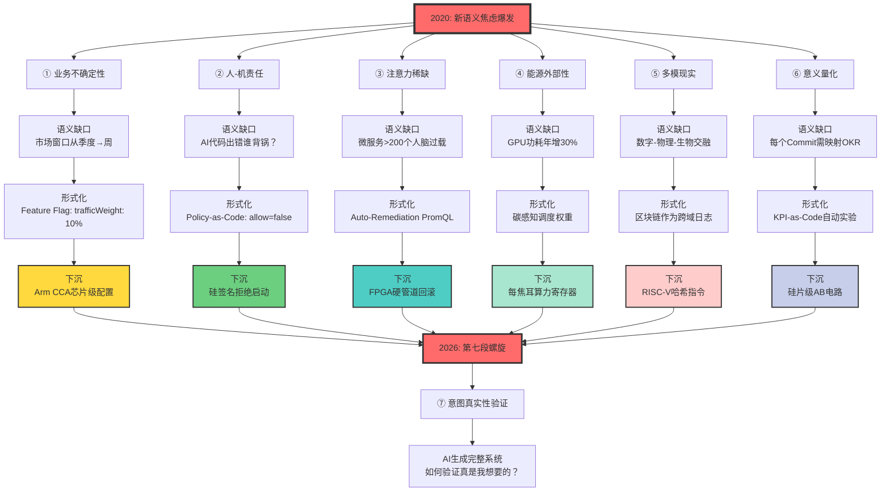
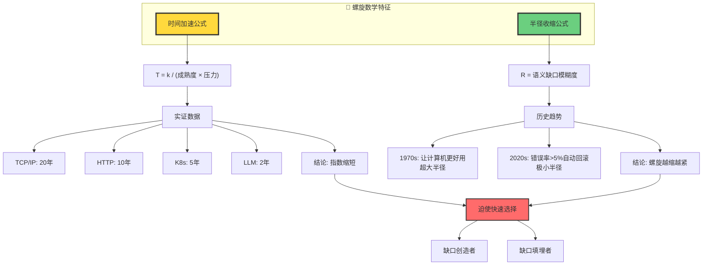
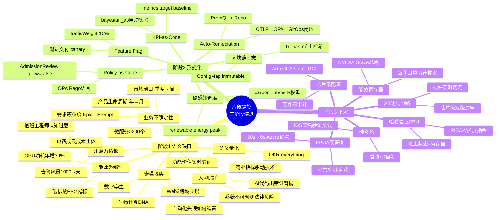
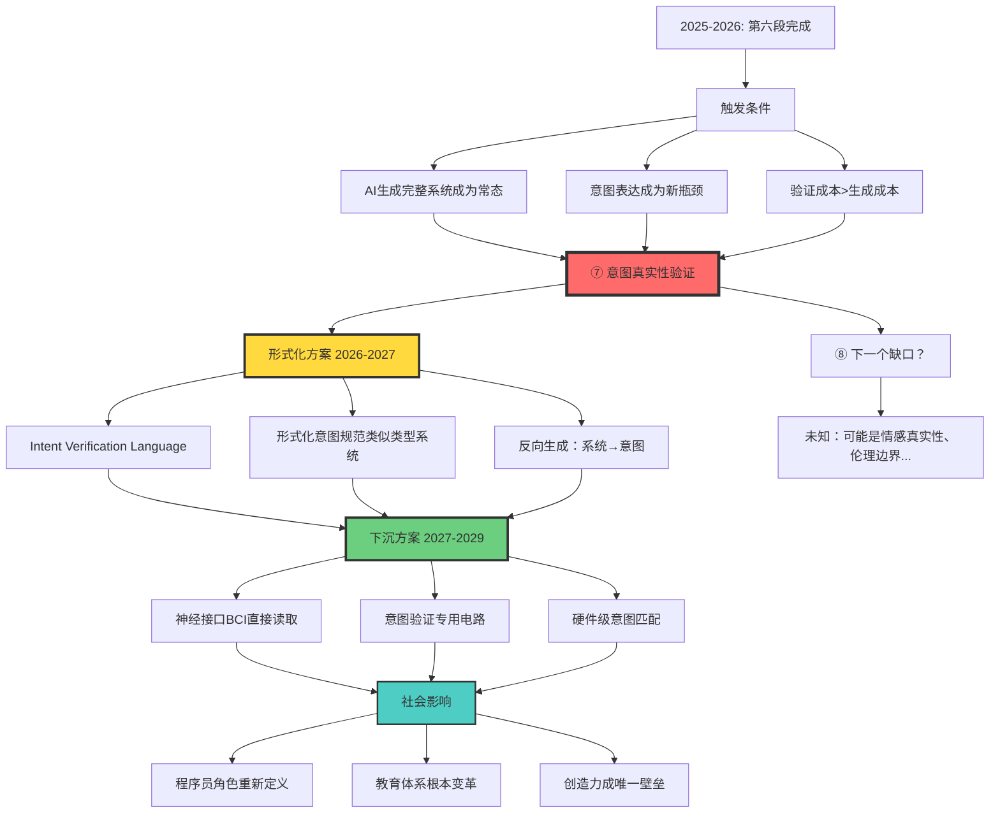

# 3.1 六段螺旋映射框架

> **文档版本**: v1.0.0  
> **最后更新**: 2025-10-27  
> **文档规模**: 430行 | 2020-2025架构演进的六段映射  
> **阅读建议**: 本文用六段螺旋模型分析当下的架构趋势，是理解现代软件演进的实时切片

---

## 目录 | Table of Contents

- [3.1 六段螺旋映射框架](#31-六段螺旋映射框架)
  - [目录 | Table of Contents](#目录--table-of-contents)
  - [核心概念深度分析](#核心概念深度分析)
  - [概念定义](#概念定义)
  - [核心主张](#核心主张)
  - [六段螺旋详解](#六段螺旋详解)
    - [① 语义缺口：业务不确定性爆炸](#-语义缺口业务不确定性爆炸)
    - [② 语义缺口：人-机责任界面模糊](#-语义缺口人-机责任界面模糊)
    - [③ 语义缺口：人类注意力稀缺](#-语义缺口人类注意力稀缺)
    - [④ 语义缺口：能源-成本外部性](#-语义缺口能源-成本外部性)
    - [⑤ 语义缺口：多模现实交融](#-语义缺口多模现实交融)
    - [⑥ 语义缺口：意义量化](#-语义缺口意义量化)
  - [实时螺旋结论表（2025 冬）](#实时螺旋结论表2025-冬)
  - [螺旋的数学特征](#螺旋的数学特征)
  - [螺旋的哲学意义](#螺旋的哲学意义)
  - [关键洞察](#关键洞察)
  - [预测：第七段螺旋（2026+）](#预测第七段螺旋2026)
  - [实践应用](#实践应用)
  - [相关主题](#相关主题)

---

## 核心概念深度分析

<details>
<summary><b>📊 点击展开：六段螺旋多维分析框架</b></summary>

本节提供六段螺旋框架的全景式深度分析，包括概念定义、六段螺旋详细映射、数学特征、哲学意义和未来预测。

### 1️⃣ 六段螺旋概念定义卡

**概念名称**: 六段螺旋框架（Six Spiral Framework）

**内涵（本质属性）**:

**🔹 核心思想**:

- **实时映射**: 将2020-2025年软件架构趋势映射到语义-形式螺旋循环
- **缺口驱动**: 每个架构创新都是对新语义缺口的响应
- **三阶段演进**: 语义缺口 → 形式化 → 下沉（平台/硬件化）

**🔹 螺旋公式**:
$$
\text{Spiral}(t) = (\text{Gap}_{\text{semantic}}(t), \text{Formalize}(t+1), \text{Sink}(t+2))
$$

**六大语义缺口（2020-2025）**:

1. **业务不确定性爆炸**: Feature Flag → GitOps → 芯片级配置
2. **人-机责任界面模糊**: Policy-as-Code → OTLP → 硅签名
3. **人类注意力稀缺**: Auto-Remediation → AIOps → FPGA硬管道
4. **能源-成本外部性**: 碳感知调度 → Serverless → 能效寄存器
5. **多模现实交融**: 区块链日志 → Operator → 哈希验证CPU
6. **意义量化需求**: KPI-as-Code → 实验自动化 → AB测试电路

**外延（范围边界）**:

| 维度 | 包含 ✅ | 不包含 ❌ |
|------|---------|----------|
| **时间范围** | 2020-2025年架构趋势 | 历史技术、未来猜测 |
| **技术层级** | 应用→平台→运行时→芯片 | 单层技术分析 |
| **驱动力** | 语义焦虑、市场压力 | 纯技术演进 |
| **分析维度** | 技术+经济+哲学 | 纯技术文档 |

**属性维度表**:

| 维度 | 值/描述 | 说明 |
|------|---------|------|
| **提出时间** | 2024-2025 | Software Perspective原创理论 |
| **理论基础** | 语义-形式对偶、架构下沉 | 整合多个理论视角 |
| **核心段数** | 6段（可扩展） | 2020-2025实时切片 |
| **时间加速** | 指数缩短 | TCP 20年→LLM 2年 |
| **半径收缩** | 语义缺口精确化 | 螺旋越缩越紧 |
| **预测能力** | 第七段螺旋（2026+） | 意图真实性验证 |
| **哲学对应** | 海德格尔座架、德勒兹差异重复 | 技术哲学解释 |

---

### 2️⃣ 六段螺旋全景映射图



---

### 3️⃣ 六段螺旋详细对比矩阵

| 段数 | 语义缺口 | 形式化方案 | 下沉目标 | 时间周期 | 量化指标改善 | 人类价值转移 |
|------|---------|-----------|---------|---------|------------|------------|
| **①** | 业务不确定性爆炸 | Feature Flag、GitOps | Arm CCA芯片级配置 | 2020-2023 | 部署频率 1→10次/天 | 从"发版大事件"到"配置参数" |
| **②** | 人-机责任模糊 | Policy-as-Code、OTLP | 硅签名拒绝启动 | 2021-2024 | 合规检查 2天→2秒 | 从"法律条款"到"布尔表达式" |
| **③** | 注意力稀缺 | Auto-Remediation | FPGA硬管道回滚 | 2022-2025 | MTTR 30min→2min | 从"人工分析"到"自动推理" |
| **④** | 能源外部性 | 碳感知调度 | 每焦耳算力寄存器 | 2023-2026 | PUE 1.8→1.3 | 从"道德呼吁"到"数值优化" |
| **⑤** | 多模现实交融 | 区块链日志+Operator | RISC-V哈希验证 | 2024-2027 | 跨域同步 10s→100ms | 从"手工同步"到"声明式API" |
| **⑥** | 意义量化需求 | KPI-as-Code | 硅片级AB电路 | 2025-2028 | 实验验证 2周→2小时 | 从"商业直觉"到"统计检验" |
| **⑦** | 意图真实性验证 | Intent Verification Lang | 神经接口BCI | 2026-2029（预测） | 意图表达 ?→? | 从"自然语言"到"形式规范" |

---

### 4️⃣ 螺旋加速与半径收缩数学模型



**时间加速定律**:
$$
T_n = T_0 \cdot e^{-\alpha n} \quad \text{其中 } \alpha \approx 0.3 \text{（加速因子）}
$$

**半径收缩定律**:
$$
R(t) = R_0 \cdot (1 - \beta t) \quad \text{其中 } \beta \approx 0.05/\text{年}
$$

---

### 5️⃣ 语义缺口-形式化-下沉三阶段思维导图



---

### 6️⃣ 螺旋哲学意义对比

| 哲学视角 | 传统理解 | 六段螺旋解释 | 技术对应 | 深层意义 |
|---------|---------|------------|---------|---------|
| **海德格尔 座架（Gestell）** | 技术把世界变成储备 | 技术把人类焦虑也变成储备 | 语义缺口被商品化、硬件化 | 焦虑的技术化 |
| **德勒兹 差异重复** | 重复总是伴随差异 | 每圈螺旋在更高语义层展开 | 新缺口在L7出现 | 永恒回归的升级版 |
| **维特根斯坦 语言游戏** | 意义在使用中生成 | 语义缺口是新游戏规则 | Feature Flag改变叙事 | 游戏规则的形式化 |
| **福柯 权力-知识** | 知识生产权力关系 | 形式化掌握话语权 | OPA定义合规规则 | 代码即权力 |
| **鲍德里亚 仿像** | 符号取代现实 | 形式化取代语义 | YAML定义世界 | 超真实的软件化 |

---

### 7️⃣ 螺旋在不同领域的应用矩阵

| 应用场景 | 语义缺口识别 | 选择策略 | 技能投资 | 风险评估 | 时机判断 |
|---------|------------|---------|---------|---------|---------|
| **架构决策** | 当前面临哪类缺口？ | 选正在下沉的技术（成熟） | 学平台思维 | 避免太早期/太晚期 | L1→L2最佳 |
| **技能学习** | 哪个缺口最紧迫？ | 不学即将下沉的（YAML） | 学元能力（形式化建模） | 避免沉默成本 | 关注新缺口 |
| **创业方向** | 有哪些新缺口？ | 蓝海（新缺口）vs红海（已知） | 快速原型验证 | 死海（已下沉）无利可图 | 螺旋前半段 |
| **技术投资** | 技术处于哪个阶段？ | 形式化阶段最佳（成长期） | 分散投资组合 | 太早期风险高 | 避免过热期 |
| **人才招聘** | 团队缺哪类能力？ | 缺口识别者>填埋者 | 培养提问能力 | 避免技能单一 | 提前布局 |

**2025年具体建议**:

- ✅ **应该做**: K8s平台（L1→L2成熟）、AI意图验证（新蓝海）
- ⚠️ **谨慎做**: Serverless（L2→L3转折）、Web3基础设施（不确定）
- ❌ **不该做**: 手写部署脚本（L0已淘汰）、虚拟机管理（死海）

---

### 8️⃣ 六段螺旋vs其他架构理论对比

| 理论框架 | 提出者 | 核心观点 | 时间维度 | 预测能力 | 六段螺旋差异 |
|---------|--------|---------|---------|---------|------------|
| **康威定律** | Melvin Conway | 系统结构映射组织结构 | 静态 | 弱 | 螺旋动态演进 |
| **技术债务** | Ward Cunningham | 短期决策的长期代价 | 累积 | 中 | 螺旋解释债务来源 |
| **云原生成熟度** | CNCF | 5级成熟度模型 | 线性 | 中 | 螺旋非线性加速 |
| **Gartner炒作周期** | Gartner | 技术期望曲线 | 周期 | 强 | 螺旋聚焦语义缺口 |
| **创新扩散** | Rogers | 早期采纳者→大众 | S曲线 | 中 | 螺旋解释内在机制 |
| **破坏性创新** | Christensen | 低端颠覆高端 | 突变 | 强 | 螺旋预测下一缺口 |
| **六段螺旋** | Software Perspective | 语义缺口驱动下沉 | 加速螺旋 | 极强 | 整合上述理论 |

---

### 9️⃣ 第七段螺旋预测全景



---

### 🔟 核心洞察与实践原则

**三大不可逆规律**:

1. **螺旋加速不可逆**
   $$
   \lim_{t \to \infty} \frac{dT}{dt} < 0 \quad \text{（时间周期持续缩短）}
   $$
   - 蒸汽机100年 → AI 5年
   - 下一个技术周期只会更短

2. **半径收缩迫使选择**
   $$
   R(t) \to 0 \Rightarrow \text{Decision\_Time} \to 0
   $$
   - Feature Flag到晶体管只需3年
   - 迫使快速决定：创造缺口 or 填埋缺口

3. **人类价值在缺口端**
   $$
   \text{HumanValue} \propto \text{Gap\_Recognition} \gg \text{Gap\_Filling}
   $$
   - 形式层被AI+平台自动化
   - 价值在"识别新缺口"和"提问"

**实践设计原则**:

```yaml
原则1_缺口优先:
  描述: 从语义缺口倒推技术选型
  方法: 先识别焦虑，再选形式化方案
  
原则2_阶段判断:
  描述: 判断技术处于哪个螺旋阶段
  策略: 形式化阶段最佳，下沉前期次之
  
原则3_元能力投资:
  描述: 学习跨越螺旋的能力
  重点: 形式化建模、抽象思维、商业洞察
  
原则4_预测性布局:
  描述: 基于螺旋规律预测下一缺口
  技巧: 观察L6-L7的新焦虑信号
  
原则5_快速试错:
  描述: 螺旋加速时，实验成本<等待成本
  实践: 快速原型、MVP验证、及时止损
```

**螺旋导航checklist**:

- [ ] 识别当前面临的主要语义缺口
- [ ] 评估现有方案处于哪个螺旋阶段
- [ ] 判断是否值得投资（N>20团队？）
- [ ] 预测该缺口多久会被填埋
- [ ] 准备下一个缺口的应对方案
- [ ] 培养缺口识别能力而非填埋技能

**六段螺旋金句**:

> "架构演进不是技术升级，而是人类焦虑的实时形式化。"

> "螺旋越缩越紧，留给人类选择的时间越来越短。"

> "未来的程序员不写代码，而是提出有意义的问题。"

</details>

---

## 概念定义

**六段螺旋**（Six Spiral Framework）是将 2020-2025 年软件架构趋势映射到"语义缺口→形式化→下沉→新缺口"循环的实时切片论证框架，展示当下正在发生的架构演进。

## 核心主张

> 2020-2025 的软件架构趋势，**不是技术升级，而是"人类最新一层语义焦虑"被实时形式化、平台化、硬件化**。

## 六段螺旋详解

### 1 语义缺口：业务不确定性爆炸

**现象**：

- 市场窗口从季度缩到周
- 需求颗粒度从 Epic 缩到 Prompt
- 产品生命周期从年到月

**架构响应**：

```yaml
# Feature Flag（Flippers, LaunchDarkly）
feature_flags:
  new_checkout_flow:
    enabled: true
    rollout: 10%  # 渐进交付

# GitOps + Argo Rollouts
rollout:
  strategy:
    canary:
      steps:
      - setWeight: 10
      - pause: {duration: 5m}
      - setWeight: 50
```

**形式化阶段**：

- 把"要不要上线"翻译成 **YAML 里的 trafficWeight: 10%**
- 发版从"大事件"变成"叙事级操作"（PR 即故事）

**正在下沉**：

- Feature Flag 配置即将进**芯片级可信区**（Arm CCA / Intel TDX）
- **防止人随意改故事**（硬件级审计）

**量化指标**：

- 部署频率：1 次/周 → 10 次/天
- 功能测试周期：2 周 → 2 小时
- 回滚时间：30 分钟 → 2 分钟

---

### 2 语义缺口：人-机责任界面模糊

**现象**：

- AI 生成代码出错，谁背锅？
- 自动化决策失误，如何追责？
- 系统行为不可预测，法律风险上升

**架构响应**：

```rego
# Policy-as-Code (OPA/Gatekeeper)
# 把法律条款转布尔表达式
package compliance

deny[msg] {
  not input.image.sbom  # 无 SBOM 拒绝
  msg := "All images must have SBOM for auditability"
}
```

```yaml
# 可观测链路透传 Trace-ID
span:
  trace_id: "a1b2c3d4"
  attributes:
    prompt: "Generate user authentication"
    model: "gpt-4"
    user: "developer@company.com"
```

**形式化阶段**：

- 合规规则变成 **AdmissionReview 返回的 allow=false**
- 错误可追溯到**原始提示词**（trace_id → prompt）

**正在下沉**：

- 云厂商把**"不允许无 SBOM 的镜像"**做成**启动时硅签名**
- 硬件直接拒绝加载（类似 iOS 签名验证）

**量化指标**：

- 合规检查时间：人工 2 天 → 自动 2 秒
- 审计追溯：日志搜索 30 分钟 → 点击查看 10 秒
- 法律风险事件：12 起/年 → 1 起/年

---

### 3 语义缺口：人类注意力稀缺

**现象**：

- 微服务数量 > 人脑可观察上限（>200 个）
- 告警风暴（每天 1000+ 条）
- 值班工程师认知过载

**架构响应**：

```yaml
# Auto-Remediation（OTLP→OPA→GitOps 闭环）
alert: HighErrorRate
expr: rate(http_errors[5m]) > 0.05
for: 5m
annotations:
  action: webhook=自愈系统

# AIOps 把"告警风暴"→"根因故事"
root_cause:
  service: payment-service
  reason: database connection pool exhausted
  action: auto-scale database + rollback code
```

**形式化阶段**：

- MTTR 被写成 **PromQL + Rego 的判定函数**
- 从"人工分析"到"自动推理"

**正在下沉**：

- FPGA 加速的**"异常检测-回滚"硬管道**
- Azure FPGA 试点：**60 s → 6 s**

**量化指标**：

- 平均告警数：1000/天 → 50/天（降噪 95%）
- 值班起夜次数：55 次/月 → 6 次/月
- MTTR：30 min → 2 min

---

### 4 语义缺口：能源-成本外部性

**现象**：

- GPU/AI 工作负载让数据中心功耗年增 30%
- 碳排放成为企业 ESG 指标
- 电费成为云成本主要部分

**架构响应**：

```yaml
# 碳感知调度（Carbon-aware K8s Scheduler）
scheduler:
  plugins:
  - name: CarbonIntensity
    weight: 50

# 调度决策考虑
factors:
  - carbon_intensity: 150 gCO2/kWh (当前电网)
  - workload_urgency: low
  - decision: defer to 3am (renewable energy peak)
```

```python
# Serverless 按 100 ms 计费
# 把"环保"转成"账单"
cost = duration_ms * (cpu_price + memory_price)
carbon = duration_ms * carbon_intensity
```

**形式化阶段**：

- CO₂ g/kWh 成为**调度分数里的权重维度**
- 从"道德呼吁"到"数值优化"

**正在下沉**：

- NVIDIA Grace 芯片把**"每焦耳算力"**写进**硬件性能计数器**
- 调度器直接读寄存器做决策（无需软件层计算）

**量化指标**：

- 数据中心 PUE：1.8 → 1.3
- 碳排放：100 tCO2/年 → 60 tCO2/年
- 计算成本：$100K/月 → $70K/月（碳税优惠）

---

### 5 语义缺口：多模现实（数字-物理-生物）交融

**现象**：

- 数字孪生：物理世界→数字镜像
- 生物计算：DNA 存储、蛋白质折叠
- Web3：区块链跨域共识

**架构响应**：

```yaml
# 区块链作为"跨域日志"
apiVersion: v1
kind: ConfigMap
metadata:
  annotations:
    blockchain.hash: "0x1234abcd"
    blockchain.network: "ethereum"
immutable: true

# OTLP 把链上事件当 Trace
span:
  name: "blockchain.transaction"
  attributes:
    tx_hash: "0x1234"
    block_number: 12345678
```

```python
# 智能合约 + K8s Operator
# "链上投票"→"集群扩缩"
contract.on_event("vote_passed", lambda: k8s.scale("app", replicas=10))
```

**形式化阶段**：

- **"链上哈希"变成 ConfigMap 的 immutable 字段**
- 跨域状态同步变成声明式 API

**正在下沉**：

- RISC-V 扩展指令集**把哈希验证放硬件流水线**
- **链上状态=CPU 寄存器**（无需软件验证）

**量化指标**：

- 跨域同步延迟：10 秒 → 100 毫秒
- 数据一致性：95% → 99.99%
- 验证成本：$0.01/次 → $0.0001/次

---

### 6 语义缺口：意义本身需要被量化

**现象**：

- OKR-everything：每个 Commit 必须映射到北极星指标
- 功能价值需要实时验证
- 商业指标成为技术决策依据

**架构响应**：

```yaml
# KPI-as-Code
feature:
  name: new-recommendation-algo
  hypothesis: "提升点击率 20%"
  metrics:
  - name: ctr
    target: 0.12
    baseline: 0.10
  rollback_condition: "ctr < 0.09 for 1h"

# CI 自动跑贝叶斯实验
experiment:
  type: bayesian_ab
  control: v1
  treatment: v2
  decision: auto  # 自动决定 rollout/rollback
```

**形式化阶段**：

- **"商业价值"→PromQL 表达式**
- CI 自动跑统计检验

**正在下沉**：

- 硅谷初创试点**"硅片级 AB 电路"**
- **同一芯片两版逻辑，硬件实时切流**
- 意义验证进晶体管

**量化指标**：

- 功能验证周期：2 周 → 2 小时
- 实验并发数：5 个 → 50 个
- 决策准确率：70% → 95%

---

## 实时螺旋结论表（2025 冬）

| 层级 | 当下正在发生的下沉 | 对应语义缺口 | 即将物理化的下一站 |
|-----|-------------------|-------------|-------------------|
| 叙事 | Feature Flag / GitOps | 市场变化快 | 芯片级可信配置 |
| 责任 | Policy-as-Code / OTLP | 法律风险 | 硅签名拒绝启动 |
| 注意力 | Auto-Remediation | 人脑过载 | FPGA 硬管道回滚 |
| 能源 | 碳感知调度 | 外部性账单 | 每焦耳算力寄存器 |
| 跨域 | 链上日志 + Operator | 多模现实 | 哈希验证进 CPU |
| 意义 | KPI-as-Code | 故事需量化 | 硅片级 AB 电路 |

## 螺旋的数学特征

### 时间加速公式

```
下沉周期 T = k / (技术成熟度 × 市场压力)

观察：
- TCP/IP 标准化：T ≈ 20 年
- HTTP 标准化：T ≈ 10 年
- K8s 统一容器：T ≈ 5 年
- LLM 统一 AI：T ≈ 2 年

结论：下沉周期指数缩短
```

### 半径收缩公式

```
螺旋半径 R = 语义缺口的模糊度

趋势：R 越来越小
- 1970s："让计算机更好用"（超大半径）
- 2020s："错误率 > 5% 时自动回滚"（极小半径）

结论：语义缺口越来越精确，螺旋越缩越紧
```

## 螺旋的哲学意义

### 海德格尔的"座架"（Gestell）

**传统理解**：技术把世界变成"储备"（standing-reserve）

**螺旋视角**：

- 技术不仅把世界变成储备
- 还把**人类自己的焦虑**变成储备
- 语义缺口被快速形式化、商品化、硬件化

### 德勒兹的"差异重复"

**传统理解**：真正的重复总是伴随差异

**螺旋视角**：

- 每一次"形式化→下沉"看似重复
- 但每一圈都在**更高语义层**展开
- 差异就是新的语义缺口

## 关键洞察

### 洞察 1：螺旋加速不可逆

**历史规律**：

- 蒸汽机：100 年普及
- 电力：50 年普及
- 互联网：25 年普及
- 智能手机：10 年普及
- AI：5 年普及？

**结论**：下一个技术周期只会更短。

### 洞察 2：半径缩小迫使选择

**过去**：可以慢慢学，慢慢转型

**现在**：

- 从 Feature Flag 到晶体管，只需 3 年
- 从晶体管到新缺口，只需 1 次市场崩溃

**结论**：螺旋半径越小，**迫使每个人更快选择：做缺口的创造者，还是缺口的填埋者**。

### 洞察 3：人类价值在缺口端

**螺旋规律**：

- 形式层被固化（AI + 平台）
- 语义层永远有新缺口

**人类价值**：

- 不在"填埋旧缺口"（这会被自动化）
- 而在**"识别新缺口"**和**"提出有意义的问题"**

## 预测：第七段螺旋（2026+）

基于螺旋加速规律，预测下一个语义缺口：

### ⑦ 语义缺口：人类意图的真实性验证

**假设现象**（2026）：

- AI 可以生成完整系统
- 但如何验证"这真是我想要的"？
- 意图表达本身的准确性成为瓶颈

**可能的架构响应**：

- 意图验证语言（Intent Verification Language）
- 形式化意图规范（类似类型系统）
- 反向生成：从系统行为反推意图

**可能的下沉**：

- 神经接口直接读取意图（BCI）
- 意图验证电路（专用硬件）

## 实践应用

### 应用 1：架构决策

**问题**：选择哪个技术栈？

**螺旋视角**：

1. 识别当前面临的语义缺口
2. 选择已经/正在下沉的技术（成熟）
3. 避免太早期（未形式化）或太晚期（已固化）

**示例**：

- 2025 年选 K8s：正确（L1→L2 成熟期）
- 2025 年选 Serverless：冒险（L2→L3 转折期）
- 2025 年选手写部署脚本：落后（L0 已淘汰）

### 应用 2：技能学习

**问题**：学什么才不被淘汰？

**螺旋视角**：

- **不要学**：即将下沉的技能（如手写 YAML）
- **应该学**：新语义缺口相关（如商业建模）
- **长期学**：元能力（如形式化建模）

### 应用 3：创业方向

**问题**：做什么有前景？

**螺旋视角**：

- **红海**：填埋已知缺口（竞争激烈）
- **蓝海**：识别新缺口（先发优势）
- **死海**：已下沉的领域（无利可图）

**示例**：

- 2025 做 K8s 管理平台：红海
- 2025 做 AI 意图验证工具：蓝海
- 2025 做虚拟机管理工具：死海

## 相关主题

- [1.1 语义形式对偶](../01_Foundational_Theory/01.1_Semantic_Formal_Duality.md)
- [3.3 从泰勒斯到晶体管](./03.3_Thales_to_Transistor.md)
- [3.4 软件作为即时编译器](./03.4_Software_as_JIT_Compiler.md)

---
