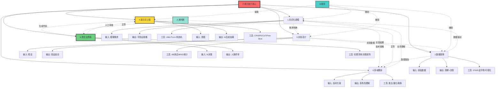
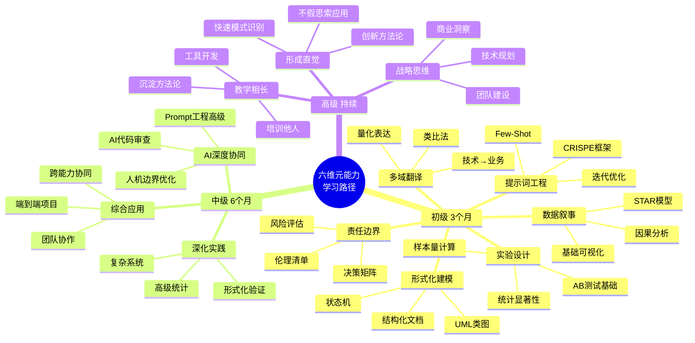
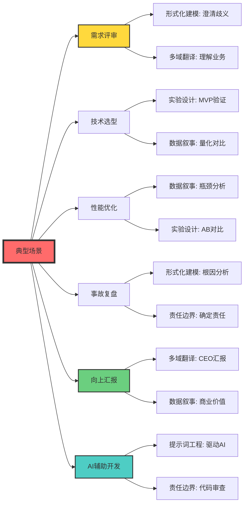
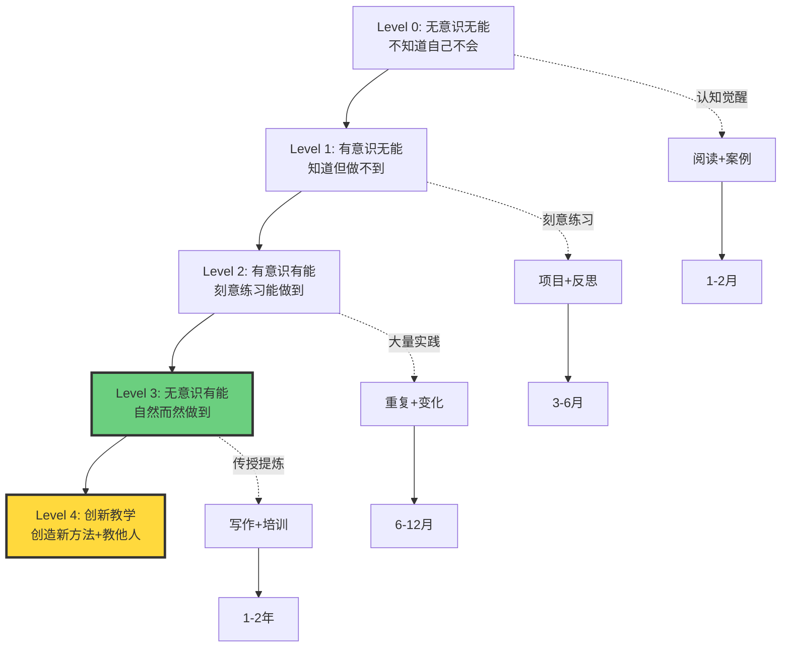

# 7.3 Six Meta Capabilities

> **子主题编号**: 07.3
> **主题**: 软件视角

---

## 📋 目录

- [7.3 六维元能力框架](#73-六维元能力框架)
  - [📋 目录](#-目录)
  - [1 核心概念深度分析](#1-核心概念深度分析)
    - [1. 元能力概念定义卡](#1-元能力概念定义卡)
    - [2. 六维元能力关系全景图](#2-六维元能力关系全景图)
    - [3. 元能力 vs 传统技能多维对比矩阵](#3-元能力-vs-传统技能多维对比矩阵)
    - [4. 六维元能力详细能力矩阵](#4-六维元能力详细能力矩阵)
    - [5. 元能力学习路径思维导图](#5-元能力学习路径思维导图)
    - [6. 元能力应用场景全景图](#6-元能力应用场景全景图)
    - [7. AI时代能力演进对比](#7-ai时代能力演进对比)
    - [8. 元能力互补关系矩阵](#8-元能力互补关系矩阵)
    - [9. 元能力评估与发展模型](#9-元能力评估与发展模型)
    - [1.10 🔟 核心洞察与实践原则](#110--核心洞察与实践原则)
  - [5 核心定义](#5-核心定义)
  - [6 为什么需要元能力？](#6-为什么需要元能力)
    - [1 技能半衰期缩短](#1-技能半衰期缩短)
    - [6.2 AI 冲击下的能力重构](#62-ai-冲击下的能力重构)
  - [7 元能力 1：形式化建模](#7-元能力-1形式化建模)
    - [1 定义](#1-定义)
    - [7.2 核心技巧](#72-核心技巧)
      - [1 . 识别歧义](#1--识别歧义)
      - [2 . 量化指标](#2--量化指标)
      - [3 . 形式化表达](#3--形式化表达)
    - [7.3 实践工具](#73-实践工具)
    - [7.4 练习题](#74-练习题)
  - [8 元能力 2：数据叙事](#8-元能力-2数据叙事)
    - [1 定义](#1-定义-1)
    - [8.2 核心框架](#82-核心框架)
      - [1 金字塔结构](#1-金字塔结构)
      - [2 STAR 模型](#2-star-模型)
    - [8.3 实践案例](#83-实践案例)
      - [1 案例 1：性能优化报告](#1-案例-1性能优化报告)
      - [1 案例 2：AB 测试报告](#1-案例-2ab-测试报告)
    - [1 可视化技巧](#1-可视化技巧)
      - [1 选择正确的图表](#1-选择正确的图表)
      - [2 数据可视化原则](#2-数据可视化原则)
  - [20 元能力 3：实验设计](#20-元能力-3实验设计)
    - [1 定义](#1-定义-2)
    - [20.2 科学方法论](#202-科学方法论)
    - [20.3 AB 测试设计](#203-ab-测试设计)
      - [1 关键要素](#1-关键要素)
      - [2 样本量计算](#2-样本量计算)
      - [3 常见陷阱](#3-常见陷阱)
    - [20.4 最小可行实验（MVE）](#204-最小可行实验mve)
      - [1 原则](#1-原则)
      - [2 示例](#2-示例)
  - [21 元能力 4：提示词工程](#21-元能力-4提示词工程)
    - [1 定义](#1-定义-3)
    - [21.2 正向驱动：提示词模式](#212-正向驱动提示词模式)
      - [1 CRISPE 框架](#1-crispe-框架)
      - [2 示例对比](#2-示例对比)
    - [21.3 反向调试：提示词 Diff](#213-反向调试提示词-diff)
      - [1 问题模式识别](#1-问题模式识别)
      - [2 迭代优化](#2-迭代优化)
    - [21.4 高级技巧](#214-高级技巧)
      - [1 思维链（Chain of Thought）](#1-思维链chain-of-thought)
      - [2 Few-Shot Learning](#2-few-shot-learning)
  - [22 元能力 5：责任边界感](#22-元能力-5责任边界感)
    - [1 定义](#1-定义-4)
    - [22.2 决策矩阵](#222-决策矩阵)
    - [22.3 边界场景分析](#223-边界场景分析)
      - [1 场景 1：AI 推荐拒绝贷款](#1-场景-1ai-推荐拒绝贷款)
      - [2 场景 2：自动化部署失败](#2-场景-2自动化部署失败)
    - [22.4 伦理检查清单](#224-伦理检查清单)
  - [28 元能力 6：多域语言切换](#28-元能力-6多域语言切换)
    - [1 定义](#1-定义-5)
    - [28.2 翻译案例](#282-翻译案例)
      - [1 案例 1：数据库分库分表](#1-案例-1数据库分库分表)
      - [2 案例 2：微服务架构](#2-案例-2微服务架构)
    - [28.3 翻译技巧](#283-翻译技巧)
      - [1 . 类比法](#1--类比法)
      - [2 . 量化法](#2--量化法)
      - [3 . 故事法](#3--故事法)
    - [28.4 多域对话模板](#284-多域对话模板)
  - [30 六维元能力综合应用](#30-六维元能力综合应用)
    - [1 场景：设计并实施一个新功能](#1-场景设计并实施一个新功能)
  - [31 学习路径](#31-学习路径)
    - [1 初级（3 个月）](#1-初级3-个月)
    - [31.2 中级（6 个月）](#312-中级6-个月)
    - [31.3 高级（持续）](#313-高级持续)
  - [32 评估标准](#32-评估标准)
    - [1 自测清单](#1-自测清单)
  - [39 关键洞察](#39-关键洞察)
    - [1 洞察 1：元能力 \> 具体技能](#1-洞察-1元能力--具体技能)
    - [39.2 洞察 2：60% 时间学元能力](#392-洞察-260-时间学元能力)
    - [39.3 洞察 3：元能力是迁移能力](#393-洞察-3元能力是迁移能力)
  - [40 相关主题](#40-相关主题)
    - [40.1 跨视角链接](#401-跨视角链接)

---

## 1 核心概念深度分析

<details>
<summary><b>🧠 点击展开：六维元能力全景分析框架</b></summary>

本节提供AI时代开发者元能力的系统化深度分析，包括概念定义、能力关系网络、演进路径、应用场景和评估体系。

### 1. 元能力概念定义卡

**概念名称**: 元能力（Meta-Capability）

**内涵（本质属性）**:

**🔹 核心思想**:

- **超越具体技术**: 不依赖特定编程语言、框架或工具
- **可迁移性**: 跨领域、跨时代的底层能力
- **AI协同放大**: 与AI结合产生指数级效能提升
- **永久价值**: 技能半衰期→∞

**🔹 六维构成**:

1. **形式化建模**: 模糊→精确（把需求变成可验证命题）
2. **数据叙事**: 数据→决策（用数据讲清楚故事）
3. **实验设计**: 假设→验证（科学方法快速试错）
4. **提示词工程**: 意图→结果（精准驱动AI生成）
5. **责任边界感**: 自动→人控（知道什么可交给AI）
6. **多域翻译**: 专业→通用（跨技术/业务/财务语言）

**🔹 本质区别**:
$$
\text{传统技能} = \text{特定工具使用} \quad \text{（半衰期2-5年）}
$$
$$
\text{元能力} = \text{思维模式 + 方法论} \quad \text{（半衰期∞）}
$$

**外延（范围边界）**:

| 维度 | 包含 ✅ | 不包含 ❌ |
|------|---------|----------|
| **技能类型** | 思维方式、方法论、判断力 | 具体语法、框架API |
| **适用范围** | 任何编程范式、任何行业 | 特定技术栈 |
| **学习方式** | 刻意练习、项目实践 | 死记硬背 |
| **与AI关系** | 协同放大（AI as 工具） | 被AI替代 |

**属性维度表**:

| 维度 | 值/描述 | 说明 |
|------|---------|------|
| **提出背景** | AI冲击下的能力重构（2023-2025） | GPT-4时代分水岭 |
| **理论基础** | 认知科学、系统思维、科学方法论 | 跨学科融合 |
| **技能半衰期** | ∞ （永不过时） | vs 具体工具2-3年 |
| **学习曲线** | 初期陡峭，长期复利 | 需要3-6月建立直觉 |
| **可迁移性** | 100%（跨语言/领域） | 一次学习，终身受益 |
| **AI协同系数** | 5-10x（指数放大） | 元能力+AI=超级个体 |
| **市场溢价** | 2-3x（相对初级工程师） | 高级/架构师必备 |
| **评估难度** | 高（需项目验证） | 无法笔试，需实践 |

---

### 2. 六维元能力关系全景图



---

### 3. 元能力 vs 传统技能多维对比矩阵

| 对比维度 | 传统具体技能 | 六维元能力 | 差异倍数 |
|---------|------------|-----------|---------|
| **学习时长** | 1-3月速成 | 3-6月建立直觉 | 2x |
| **技能半衰期** | 2-5年 | ∞永不过时 | ∞ |
| **可迁移性** | 特定技术栈 | 任何领域 | 100% |
| **市场需求稳定性** | 随技术潮流波动 | 持续增长 | 稳定 |
| **薪资溢价** | 初级$70K | 高级$120-150K | 2x |
| **AI协同效应** | 被替代（-50%价值） | 指数放大（+5-10x） | -/+ |
| **评估方式** | 笔试/算法题 | 项目/案例分析 | 质性 |
| **学习曲线** | 线性增长 | S曲线（初慢后快） | 复利 |
| **职业天花板** | 高级工程师 | 架构师/CTO | 2-3级 |
| **知识密度** | 低（文档可查） | 高（需内化理解） | 10x |

**关键洞察**:
$$
\text{职业价值} = \text{元能力}^{1.5} \times \text{AI协同能力} + \text{具体技能} \times 0.3
$$

传统具体技能的权重正在快速下降（从1.0→0.3），元能力+AI协同成为核心竞争力。

---

### 4. 六维元能力详细能力矩阵

| 元能力 | 核心问题 | 输入 | 输出 | 关键工具 | 学习难度 | AI辅助度 | 商业价值 |
|-------|---------|------|------|---------|---------|---------|---------|
| **形式化建模** | 需求如何变精确？ | 模糊需求 | 可验证规格 | UML/TLA+/状态机 | ⭐⭐⭐⭐ | 🤖🤖 | 💰💰💰💰 |
| **数据叙事** | 数据如何驱动决策？ | 原始数据 | 洞察+建议 | STAR/可视化 | ⭐⭐⭐ | 🤖🤖🤖 | 💰💰💰💰💰 |
| **实验设计** | 假设如何快速验证？ | 假设 | 验证结论 | AB测试/MVE | ⭐⭐⭐⭐⭐ | 🤖🤖 | 💰💰💰💰💰 |
| **提示词工程** | 如何驾驭AI？ | 意图 | AI结果 | CRISPE/CoT | ⭐⭐ | 🤖🤖🤖🤖🤖 | 💰💰💰 |
| **责任边界感** | 什么该AI决定？ | AI输出 | 人类终审 | 伦理清单 | ⭐⭐⭐⭐⭐ | 🤖 | 💰💰💰💰💰 |
| **多域翻译** | 如何跨角色沟通？ | 技术方案 | 各方理解 | 类比/量化 | ⭐⭐⭐⭐ | 🤖🤖 | 💰💰💰💰💰 |

**符号说明**: ⭐=难度等级, 🤖=AI可辅助程度, 💰=商业价值

---

### 5. 元能力学习路径思维导图



---

### 6. 元能力应用场景全景图



---

### 7. AI时代能力演进对比

| 时代 | 核心能力 | 学习方式 | 职业角色 | 淘汰周期 | 代表人物 |
|------|---------|---------|---------|---------|---------|
| **1990s** | 编程语法 | 书本+实践 | 程序员 | 10年 | 熟练C/C++ |
| **2000s** | 框架使用 | 文档+Google | 工程师 | 5年 | 熟练J2EE/Spring |
| **2010s** | 系统设计 | GitHub+博客 | 架构师 | 3年 | 微服务专家 |
| **2020-2023** | 算法+数据结构 | LeetCode | 高级工程师 | 2年 | 刷题高手 |
| **2023+（AI时代）** | **六维元能力** | AI协同+项目 | **系统守门人** | ∞ | 人机协同专家 |

**趋势总结**:

- 具体技能价值↓（被AI取代）
- 元能力价值↑↑（AI无法替代的判断力）
- 学习周期↓（AI加速）但深度↑（需内化理解）

---

### 8. 元能力互补关系矩阵

**问**: 哪些元能力经常一起使用？

| 主能力 | 最常协同 | 协同场景 | 协同效果 |
|-------|---------|---------|---------|
| **形式化建模** | 实验设计 | 定义实验变量和成功标准 | 1+1=3 |
| **形式化建模** | 多域翻译 | 技术规格→业务需求 | 1+1=2.5 |
| **数据叙事** | 实验设计 | AB测试结果分析报告 | 1+1=4 |
| **数据叙事** | 多域翻译 | 向CEO汇报数据洞察 | 1+1=3 |
| **实验设计** | 形式化建模 | 设计严谨的实验协议 | 1+1=3 |
| **提示词工程** | 责任边界感 | AI生成→人工审查闭环 | 1+1=5 |
| **责任边界感** | 多域翻译 | 向法务解释AI风险 | 1+1=2.5 |

**核心组合**:

- **黄金三角**: 形式化建模 + 实验设计 + 数据叙事（科学决策闭环）
- **AI协同对**: 提示词工程 + 责任边界感（人机协同）
- **沟通桥梁**: 多域翻译（连接所有能力到业务）

---

### 9. 元能力评估与发展模型



**每个元能力的评估指标**:

| 元能力 | 入门标志 | 熟练标志 | 精通标志 |
|-------|---------|---------|---------|
| **形式化建模** | 能写结构化文档 | 能画UML/状态机 | 能用TLA+验证 |
| **数据叙事** | 能做基础可视化 | 能写STAR报告 | 能从数据洞察战略 |
| **实验设计** | 能设计简单AB测试 | 能计算样本量+统计检验 | 能设计复杂多变量实验 |
| **提示词工程** | 能用CRISPE框架 | 能迭代优化提示词 | 能开发Prompt模式库 |
| **责任边界感** | 知道AI局限 | 能审查AI输出 | 能设计人机协同流程 |
| **多域翻译** | 能用类比解释 | 能量化技术价值 | 能构建跨域共识 |

---

### 1.10 🔟 核心洞察与实践原则

**四大基本定律**:

1. **元能力复利定律**
   $$
   \text{5年后价值} = \text{初始投入} \times (1 + r)^5 \quad \text{其中 } r_{\text{元能力}} \gg r_{\text{具体技能}}
   $$
   - 元能力：复利增长（$r \approx 30\%$）
   - 具体技能：线性衰减（$r \approx -20\%$）

2. **AI协同放大定律**
   $$
   \text{产出} = \text{元能力} \times (1 + k \cdot \text{AI能力}) \quad \text{其中 } k = 5\sim10
   $$
   - 无元能力：被AI替代（$k<0$）
   - 有元能力：指数放大（$k=5\sim10$）

3. **60/40时间分配定律**
   $$
   \text{最优投入} = 60\% \text{ 元能力} + 40\% \text{ 具体技能}
   $$
   - 传统分配：10% 元能力 + 90% 具体技能（已过时）
   - AI时代：60% 元能力 + 40% 具体技能（面向未来）

4. **组合效应定律**
   $$
   \text{价值} = \sum_{i=1}^{6} \text{能力}_i + \sum_{i \neq j} \text{协同}_{ij}
   $$
   - 单一能力：线性增长
   - 能力组合：指数增长（如形式化+实验+数据=科学决策）

**实践设计原则**:

```yaml
原则1_项目中学习:
  描述: 元能力无法通过书本学习，必须在真实项目中练习
  方法: 每个项目刻意使用至少3种元能力

原则2_反思日志:
  描述: 每天记录"今天用了哪些元能力？哪里可以改进？"
  工具: Notion/Obsidian元能力日志模板

原则3_教学相长:
  描述: 把学到的元能力教给他人，加深理解
  实践: 写博客、做分享、指导新人

原则4_AI协同迭代:
  描述: 用AI辅助元能力练习，但人类保持主导
  示例: 用AI生成初稿→人类形式化建模→AI优化→人类终审

原则5_跨域实践:
  描述: 同一元能力在不同领域练习（技术/产品/管理）
  效果: 加速内化，形成直觉

原则6_量化追踪:
  描述: 定期自评六维能力（1-5分），可视化成长
  工具: 雷达图追踪进展
```

**元能力开发Checklist**:

```markdown
## 2 每周自检（用过哪些元能力？）
- [ ] 形式化建模: 把需求澄清了吗？
- [ ] 数据叙事: 用数据支撑决策了吗？
- [ ] 实验设计: 设计实验验证假设了吗？
- [ ] 提示词工程: 高效驱动AI了吗？
- [ ] 责任边界: 审查AI输出了吗？
- [ ] 多域翻译: 向非技术人员解释清楚了吗？

## 3 每月复盘（哪里可以改进？）
- [ ] 找到一个失败案例，分析哪个元能力缺失
- [ ] 选择一个元能力重点提升
- [ ] 寻找一个导师/同伴互相反馈

## 4 每季度评估（自评1-5分）
| 元能力 | Q1 | Q2 | Q3 | Q4 | 目标 |
|-------|----|----|----|----|------|
| 形式化建模 | 2 | 3 | 3 | 4 | 4 |
| 数据叙事 | 1 | 2 | 3 | 3 | 4 |
| 实验设计 | 1 | 1 | 2 | 3 | 3 |
| 提示词工程 | 3 | 4 | 4 | 5 | 5 |
| 责任边界 | 2 | 2 | 3 | 3 | 4 |
| 多域翻译 | 1 | 2 | 2 | 3 | 4 |
```

**六维能力雷达图**:

```
        形式化建模
            5
            |
多域翻译 ---+--- 数据叙事
            |
        责任边界
            |
提示词工程 -+- 实验设计
```

**职业发展路径**:

| 职级 | 元能力要求 | 典型角色 | 年薪范围 |
|------|-----------|---------|---------|
| **初级** | 1-2个能力 Level 2 | 工程师 | $60-80K |
| **中级** | 3-4个能力 Level 2 | 高级工程师 | $90-120K |
| **高级** | 5-6个能力 Level 3 | 资深/架构师 | $130-180K |
| **专家** | 全部Level 3+教学 | Tech Lead/主管 | $180-250K |
| **战略** | 全部Level 4 | 技术总监/CTO | $250K+ |

**AI时代生存法则**:

> "在AI可以写代码、做设计、优化算法的时代，工程师的价值在于：**判断什么该做、如何验证、是否可靠、能否解释**——这正是六维元能力的核心。"

**终极目标**: 成为**系统守门人**（System Gatekeeper）

- 不是写最多代码的人
- 而是确保系统正确、可靠、有价值的**最后一道防线**

</details>

---

## 5 核心定义

**元能力**（Meta-Capability）：超越具体技术栈、可迁移到任何编程范式、任何时代都有价值的底层能力。

## 6 为什么需要元能力？

### 1 技能半衰期缩短

| 技能类型 | 半衰期 | 示例 |
|---------|--------|------|
| **具体工具** | 2-3 年 | jQuery → React → Next.js |
| **编程语言** | 5-7 年 | Java 8 → Java 17 → Go → Rust |
| **框架范式** | 7-10 年 | MVC → 微服务 → Serverless |
| **元能力** | **永久** | 形式化建模、数据洞察、实验设计 |

### 6.2 AI 冲击下的能力重构

```
传统技能 + AI = ？

语法熟练 + AI = 没用（AI 更熟练）
算法实现 + AI = 没用（AI 更快）
框架使用 + AI = 没用（AI 自动选择）

元能力 + AI = 指数级放大
```

---

## 7 元能力 1：形式化建模

### 1 定义

**把模糊需求变成可验证的形式化命题**

### 7.2 核心技巧

#### 1 . 识别歧义

**示例**：

```
模糊需求："用户体验要好"

识别歧义：
- "好"指什么？
  - 页面加载快？
  - 界面美观？
  - 功能易用？
  - 无 bug？
```

#### 2 . 量化指标

**从定性到定量**：

```
模糊：用户体验要好
    ↓
量化：
- P95 页面加载时间 < 2 秒
- 用户满意度 > 8/10
- 关键流程转化率 > 60%
- 严重 bug 数量 = 0
```

#### 3 . 形式化表达

**自然语言 → 形式语言**：

**级别 1：结构化文档**

```yaml
requirement:
  name: "用户登录功能"
  success_criteria:
    - 输入合法账号密码 → 返回 token
    - 输入错误密码 → 返回 401
    - 3 次错误 → 锁定账号 15 分钟
  performance:
    - P95 响应时间 < 200ms
  security:
    - 密码必须加密存储
    - Token 有效期 24 小时
```

**级别 2：伪代码**

```python
def login(username, password):
    user = database.find_user(username)
    if not user:
        return Error("用户不存在")

    if not verify_password(password, user.hashed_password):
        increment_failed_attempts(user)
        if user.failed_attempts >= 3:
            lock_account(user, duration=15_minutes)
        return Error("密码错误")

    reset_failed_attempts(user)
    token = generate_jwt(user, expiry=24_hours)
    return Success(token)
```

**级别 3：形式化规范**

```
∀ username, password:
  user = find_user(username)

  user = null → Error("用户不存在")

  verify(password, user.hash) = false →
    user.attempts < 3 → Error("密码错误")
    user.attempts ≥ 3 → lock(user, 15min) ∧ Error("账号已锁定")

  verify(password, user.hash) = true →
    token = jwt(user, 24h) ∧
    Success(token)
```

### 7.3 实践工具

| 工具 | 用途 | 示例 |
|-----|------|------|
| **UML** | 类图、序列图 | 系统设计 |
| **ERD** | 数据库建模 | 表关系 |
| **状态机** | 业务流程 | 订单状态转换 |
| **TLA+** | 分布式系统验证 | Raft 算法 |
| **Alloy** | 轻量级形式化 | API 设计验证 |

### 7.4 练习题

**题目**："实现一个购物车"

**差的回答**：

```python
class Cart:
    items = []

    def add(item):
        items.append(item)
```

**好的回答**（形式化建模）：

```
实体建模：
- Cart: {user_id, items[], total_price}
- Item: {product_id, quantity, price}

不变式（Invariant）：
- total_price = sum(item.quantity * item.price)
- quantity > 0
- 同一商品不重复（合并数量）

操作：
- add(item) →
  if exists(item.product_id):
    update quantity
  else:
    insert item
  recalculate total_price

- remove(item) →
  delete item
  recalculate total_price

边界条件：
- 空购物车：items = []
- 单个商品：items.length = 1
- 超大数量：quantity > 999 → error
```

---

## 8 元能力 2：数据叙事

### 1 定义

**用数据讲清楚"发生了什么 → 为什么 → 下一步"的故事**

### 8.2 核心框架

#### 1 金字塔结构

```
        结论（What）
           ↓
      为什么（Why）
     ↙       ↘
  证据 1   证据 2
  ↓  ↓     ↓  ↓
数据 A B  数据 C D
```

#### 2 STAR 模型

| 要素 | 说明 | 示例 |
|-----|------|------|
| **S**ituation | 背景 | "电商网站转化率一直在 2%"  |
| **T**ask | 目标 | "希望提升到 3%" |
| **A**ction | 行动 | "优化了结账流程" |
| **R**esult | 结果 | "转化率提升到 2.8%，相对提升 40%" |

### 8.3 实践案例

#### 1 案例 1：性能优化报告

**差的报告**：

```
我们优化了系统性能。
响应时间从 500ms 降到 200ms。
```

**好的报告**（数据叙事）：

```markdown
# 性能优化总结

## 9 问题（Situation）
- P95 响应时间：500ms（用户投诉多）
- 行业标准：< 200ms
- 差距：2.5 倍

## 10 根因分析（Why）
1. 数据库查询慢（占 70% 时间）
   - 缺少索引
   - N+1 查询问题

2. 外部 API 调用慢（占 20%）
   - 无缓存
   - 串行调用

[图表：性能瓶颈分布]

## 11 优化方案（Action）
1. 数据库优化
   - 添加复合索引（user_id, created_at）
   - 使用 JOIN 替代 N+1 查询

2. API 优化
   - Redis 缓存（TTL 5 分钟）
   - 并行调用

## 12 效果（Result）
| 指标 | 优化前 | 优化后 | 提升 |
|-----|--------|--------|------|
| P95 延迟 | 500ms | 200ms | ↓ 60% |
| QPS | 100 | 300 | ↑ 200% |
| CPU 使用率 | 80% | 40% | ↓ 50% |

[图表：优化前后对比]

## 13 商业影响
- 用户投诉：20 次/周 → 2 次/周（↓ 90%）
- 页面跳出率：35% → 22%（↓ 13pp）
- 预计收入提升：$50K/月
```

#### 1 案例 2：AB 测试报告

**差的报告**：

```
新算法转化率 2.5%，旧算法 2.0%，应该上线。
```

**好的报告**（数据叙事）：

```markdown
# 推荐算法 AB 测试报告

## 14 假设
新算法（基于协同过滤）比旧算法（基于热度）转化率更高

## 15 实验设计
- 对照组（A）：旧算法，50% 流量
- 实验组（B）：新算法，50% 流量
- 样本量：各 10,000 用户
- 实验周期：7 天

## 16 结果
| 指标 | A（旧） | B（新） | 提升 | p-value |
|-----|---------|---------|------|---------|
| 转化率 | 2.0% | 2.5% | +25% | < 0.001 ✅ |
| 点击率 | 15% | 18% | +20% | < 0.01 ✅ |
| 平均停留时间 | 3.2min | 3.8min | +19% | < 0.05 ✅ |

[图表：转化漏斗对比]

## 17 分用户群分析
| 用户类型 | A | B | 提升 |
|---------|---|---|------|
| 新用户 | 1.5% | 2.2% | +47% ⭐ |
| 老用户 | 2.5% | 2.8% | +12% |

**洞察**：新算法对新用户效果特别好

## 18 风险评估
- 计算成本：+30%（可接受）
- 冷启动问题：新用户前 3 次推荐质量低（需解决）

## 19 建议
1. ✅ 立即全量上线新算法
2. ⚠️ 针对新用户前 3 次，混合热度算法
3. 📊 持续监控 7 天，关注长期指标
```

### 1 可视化技巧

#### 1 选择正确的图表

| 数据类型 | 推荐图表 | 用途 |
|---------|---------|------|
| 趋势 | 折线图 | 展示变化 |
| 对比 | 柱状图 | A vs B |
| 占比 | 饼图 | 部分与整体 |
| 分布 | 直方图 | 数据分布 |
| 相关性 | 散点图 | 两变量关系 |

#### 2 数据可视化原则

```
✅ Good:
- 轴从 0 开始（避免误导）
- 颜色有意义（红=坏，绿=好）
- 标题说明结论（不只是描述）

❌ Bad:
- 3D 饼图（难以比较）
- 过多颜色（视觉混乱）
- 无标注（看不懂）
```

---

## 20 元能力 3：实验设计

### 1 定义

**快速验证假设的科学方法：假设 → 实验 → 数据 → 决策**

### 20.2 科学方法论

```
1. 观察现象
   ↓
2. 提出假设
   ↓
3. 设计实验
   ↓
4. 收集数据
   ↓
5. 分析结果
   ↓
6. 得出结论
   ↓
7. 决策：Pivot / Persevere
```

### 20.3 AB 测试设计

#### 1 关键要素

| 要素 | 说明 | 示例 |
|-----|------|------|
| **假设** | 明确预期 | "新按钮颜色会提升点击率" |
| **变量** | 只改变一个 | 颜色（蓝 vs 红） |
| **样本量** | 足够检验 | 各 5000 用户 |
| **显著性** | p < 0.05 | 95% 置信度 |
| **时长** | 覆盖周期 | 至少 7 天（包含周末） |

#### 2 样本量计算

```python
from scipy import stats

def calculate_sample_size(
    baseline_rate=0.02,   # 当前转化率 2%
    min_detectable_effect=0.005,  # 最小可检测提升 0.5%
    alpha=0.05,           # 显著性水平
    power=0.8             # 统计功效
):
    # 使用功效分析计算
    effect_size = min_detectable_effect / baseline_rate
    n = stats.tt_solve_power(
        effect_size=effect_size,
        alpha=alpha,
        power=power
    )
    return int(n * 1.1)  # 加 10% 余量

# 结果：每组需要 ~5000 用户
```

#### 3 常见陷阱

| 陷阱 | 说明 | 避免方法 |
|-----|------|---------|
| **过早停止** | 看到显著就停 | 坚持预定时长 |
| **多重比较** | 同时测多个指标 | Bonferroni 校正 |
| **样本污染** | 用户同时在 A 和 B | Cookie/用户 ID 锁定 |
| **新奇效应** | 新功能短期虚高 | 至少跑 2 周 |

### 20.4 最小可行实验（MVE）

#### 1 原则

```
实验成本 vs 信息价值

最小化：
- 开发成本
- 时间成本
- 风险

最大化：
- 学到的信息
- 决策价值
```

#### 2 示例

**场景**：验证"用户愿意付费订阅"

**Level 1：问卷**（1 天）

```
成本：$0
方法：发问卷"您愿意付费吗？"
问题：意愿 ≠ 行动
```

**Level 2：假登陆页**（3 天）

```
成本：$500
方法：做一个付费页面，统计点击"购买"的人数
优点：真实行为
缺点：无法收费
```

**Level 3：MVP**（2 周）

```
成本：$5K
方法：真实可购买，手动交付服务
优点：验证支付意愿
缺点：无法规模化
```

**Level 4：完整产品**（3 月）

```
成本：$50K
方法：自动化交付
优点：可规模化
缺点：投入大
```

**策略**：从 Level 1 开始，逐步升级

---

## 21 元能力 4：提示词工程

### 1 定义

**精准驱动 AI 生成所需结果 + 从结果反推提示词缺陷的能力**

### 21.2 正向驱动：提示词模式

#### 1 CRISPE 框架

| 要素 | 说明 | 示例 |
|-----|------|------|
| **C**apacity | 角色 | "你是一个资深后端架构师" |
| **R**esponsibility | 任务 | "设计一个高可用的 API" |
| **I**nput | 输入 | "需求：处理 1000 QPS" |
| **S**teps | 步骤 | "1. 分析瓶颈 2. 提出方案 3. 给出代码" |
| **P**erformance | 标准 | "代码需要包含错误处理和日志" |
| **E**xample | 示例 | "参考 Netflix 的设计" |

#### 2 示例对比

**差的提示词**：

```
写一个登录功能
```

**好的提示词**：

```markdown
你是一个资深全栈工程师。

任务：实现一个安全的用户登录功能

需求：
1. 支持邮箱/手机号登录
2. 密码需加密存储（bcrypt）
3. 登录失败 3 次锁定 15 分钟
4. 返回 JWT token（有效期 24 小时）
5. 需要完整的错误处理

技术栈：
- 后端：Node.js + Express
- 数据库：PostgreSQL
- 缓存：Redis（存储失败次数）

输出格式：
1. 数据库 Schema
2. 完整的 API 实现代码
3. 单元测试

参考：遵循 OWASP 安全最佳实践
```

### 21.3 反向调试：提示词 Diff

#### 1 问题模式识别

| 问题 | 原因 | 修复 |
|-----|------|------|
| 代码不完整 | 提示词太简略 | 明确要求"包含所有代码" |
| 代码有 bug | 缺少边界条件 | 补充"考虑边界情况" |
| 不符合规范 | 缺少代码风格要求 | 指定"遵循 PEP 8" |
| 性能差 | 缺少性能要求 | 补充"时间复杂度 O(n)" |

#### 2 迭代优化

```
第 1 次提示词：
"写一个排序算法"

AI 输出：冒泡排序（O(n²)）

分析：未指定性能要求
    ↓
第 2 次提示词：
"写一个高效的排序算法，时间复杂度 O(n log n)"

AI 输出：快速排序

分析：未考虑最坏情况
    ↓
第 3 次提示词：
"写一个稳定的排序算法，平均和最坏情况都是 O(n log n)"

AI 输出：归并排序 ✅
```

### 21.4 高级技巧

#### 1 思维链（Chain of Thought）

```
提示词：
"一步步思考：如何设计一个秒杀系统？

1. 先分析核心挑战
2. 再提出架构方案
3. 最后给出关键代码"

AI 会：
- 先分析：高并发、库存一致性、防刷
- 再设计：Redis + MQ + 限流
- 最后：给出代码实现
```

#### 2 Few-Shot Learning

```
提示词：
"根据以下示例，生成相似的代码：

示例 1：
输入：User entity
输出：
@Entity
class User {
  @Id
  Long id;
  String name;
}

示例 2：
输入：Product entity
输出：？"

AI 会模仿示例风格
```

---

## 22 元能力 5：责任边界感

### 1 定义

**知道 AI/自动化系统能决定什么、不能决定什么，并敢于承担最终责任**

### 22.2 决策矩阵

| 决策类型 | AI 可以 | 人类必须 | 示例 |
|---------|--------|---------|------|
| **重复性操作** | ✅ 完全自动 | 监督 | 代码格式化 |
| **数据驱动决策** | ✅ 推荐 | 批准 | 推荐算法优化 |
| **涉及伦理** | ❌ 不可 | ✅ 决定 | 用户数据使用 |
| **法律责任** | ❌ 不可 | ✅ 签字 | 隐私政策变更 |
| **创新方向** | 🟡 辅助 | ✅ 主导 | 产品战略 |

### 22.3 边界场景分析

#### 1 场景 1：AI 推荐拒绝贷款

```
AI 输出：
- 用户信用分：650
- 推荐：拒绝贷款
- 置信度：85%

系统守门人职责：
1. 审查 AI 推理过程
   - 使用了哪些特征？
   - 是否有歧视性特征（种族、性别）？

2. 检查边界情况
   - 650 分是否接近阈值？
   - 是否有其他补偿因素？

3. 最终决策
   - 如果认同：批准 AI 决策
   - 如果质疑：人工复审
   - 承担法律责任
```

#### 2 场景 2：自动化部署失败

```
自动化系统：
- CI 通过
- 部署到生产
- 错误率飙升到 10%
- 自动回滚

系统守门人职责：
1. 理解为什么失败
   - CI 测试不充分？
   - 生产环境差异？

2. 决定下一步
   - 修复 bug 后重新部署？
   - 暂停功能开发排查？

3. 向团队/用户解释
   - 承认失误
   - 说明补救措施
```

### 22.4 伦理检查清单

**部署 AI 系统前必答的问题**：

```markdown
## 23 透明性
- [ ] 能解释 AI 的决策过程吗？
- [ ] 用户知道在和 AI 交互吗？

## 24 公平性
- [ ] 训练数据是否有偏见？
- [ ] 是否对某些群体不利？

## 25 可控性
- [ ] 人类可以干预 AI 决策吗？
- [ ] 有紧急停止按钮吗？

## 26 问责性
- [ ] 出错时谁负责？
- [ ] 有赔偿机制吗？

## 27 隐私
- [ ] 数据使用合规吗？
- [ ] 用户可以删除数据吗？
```

---

## 28 元能力 6：多域语言切换

### 1 定义

**在技术、业务、财务、法律等不同领域间实时翻译概念，成为"边界对象"**

### 28.2 翻译案例

#### 1 案例 1：数据库分库分表

**技术语言**：

```
数据库分库分表（Sharding）
- 水平拆分用户表
- 按 user_id hash 分 16 个库
- 每个库 256 个表
```

**业务语言**：

```
为了支持业务快速增长
系统升级可以：
- 支持用户数从 100 万扩展到 1 亿
- 保持查询速度不变
```

**财务语言**：

```
基础设施升级投入：
- 一次性开发成本：$50K
- 新增服务器成本：$3K/月

支持业务增长：
- 可承载 100 倍用户增长
- 避免系统瓶颈导致的收入损失
ROI：预计 6 个月回本
```

**法律语言**：

```
数据分片存储方案：
- 符合数据本地化要求（GDPR）
- 用户数据按地域存储
- 便于执行"被遗忘权"（删除单个用户数据）
```

#### 2 案例 2：微服务架构

**技术 → 业务**：

```
技术：采用微服务架构，拆分单体应用

业务：
1. 新功能上线更快（从 2 周 → 2 天）
2. 团队可以并行开发（不互相阻塞）
3. 出问题影响范围小（不会全站宕机）
```

**技术 → 财务**：

```
技术：微服务架构

财务：
- 短期成本增加：+30%（基础设施）
- 长期收益：
  - 开发效率 +50%（节省人力成本）
  - 停机时间 -80%（减少收入损失）
  - 3 年 TCO 降低 20%
```

**技术 → 管理层**：

```
技术：微服务

管理层：
- 类比：从大工厂 → 小作坊联盟
- 好处 1：小团队自主决策，快速响应市场
- 好处 2：局部故障不影响整体
- 挑战：需要更强的协调机制
```

### 28.3 翻译技巧

#### 1 . 类比法

**陌生概念 → 熟悉概念**

```
技术概念：负载均衡
    ↓
类比：银行多个窗口
- 客户（请求）来了，自动分配到空闲窗口（服务器）
- 如果某个窗口坏了，客户自动去其他窗口
```

#### 2 . 量化法

**抽象概念 → 具体数字**

```
技术："系统性能优化"
    ↓
量化：
- 页面加载时间：2s → 0.8s
- 支持并发用户：1K → 10K
- 服务器成本：-30%
```

#### 3 . 故事法

**技术方案 → 用户故事**

```
技术："实现了 CDN 加速"
    ↓
故事：
"以前，美国用户访问我们的网站（服务器在中国），
就像从纽约打电话到北京，延迟很高。
现在，我们在美国也放了一台服务器（CDN），
美国用户就像打本地电话，快多了。"
```

### 28.4 多域对话模板

```markdown
## 29 向 CEO 汇报技术决策

### 1 决策
[用业务语言描述]

### 29.2 为什么
[用商业逻辑解释]

### 29.3 投资回报
[用财务语言量化]

### 29.4 风险
[用管理语言说明]

### 29.5 时间线
[用里程碑说明进度]
```

---

## 30 六维元能力综合应用

### 1 场景：设计并实施一个新功能

```
Step 1: 形式化建模
- 需求："增加推荐功能"
- 形式化：
  - 输入：用户历史行为
  - 输出：Top 10 推荐商品
  - 约束：P95 延迟 < 200ms
  - 成功标准：点击率 > 5%

Step 2: 实验设计
- 假设：协同过滤比热度推荐效果好
- AB 测试：各 5000 用户，7 天
- 指标：点击率、转化率

Step 3: 提示词工程
- 驱动 AI 生成推荐算法代码
- 迭代优化提示词直到满足要求

Step 4: 数据叙事
- 分析 AB 测试结果
- 用数据讲清楚"为什么上线"

Step 5: 责任边界
- 审查 AI 生成的代码
- 确保无偏见（不歧视某些用户群）
- 签字确认上线

Step 6: 多域翻译
- 向 CEO：转化率提升 20%，预计增收 $50K/月
- 向财务：开发成本 $10K，4 个月回本
- 向法务：推荐算法符合 GDPR，用户可关闭
```

---

## 31 学习路径

### 1 初级（3 个月）

**目标**：理解并能应用基础技巧

| 周 | 元能力 | 练习 |
|----|--------|------|
| 1-2 | 形式化建模 | 把 10 个模糊需求转成结构化文档 |
| 3-4 | 数据叙事 | 用数据写 3 篇分析报告 |
| 5-6 | 实验设计 | 设计 2 个 AB 测试 |
| 7-8 | 提示词工程 | 用 AI 完成 10 个编程任务 |
| 9-10 | 责任边界 | 审查 AI 代码，找出 5 个问题 |
| 11-12 | 多域翻译 | 把一个技术方案翻译成 4 种语言 |

### 31.2 中级（6 个月）

**目标**：熟练并能组合应用

**项目练习**：

1. 端到端实现一个功能（使用所有 6 种元能力）
2. 领导一个小团队完成项目
3. 向非技术人员汇报

### 31.3 高级（持续）

**目标**：形成直觉，自然应用

**标志**：

- 不经思考就能形式化需求
- 数据分析成为日常习惯
- 能快速设计实验验证想法
- AI 成为高效协作伙伴
- 对 AI 输出有敏锐判断力
- 在任何场合都能清晰表达

---

## 32 评估标准

### 1 自测清单

```markdown
## 33 形式化建模
- [ ] 能把模糊需求转成可验证的规格
- [ ] 能画 UML/ERD 图
- [ ] 能发现需求中的歧义和漏洞

## 34 数据叙事
- [ ] 能用数据讲清楚完整故事
- [ ] 能选择合适的可视化方式
- [ ] 能从数据中提炼洞察

## 35 实验设计
- [ ] 能设计严谨的 AB 测试
- [ ] 能计算所需样本量
- [ ] 能识别常见统计陷阱

## 36 提示词工程
- [ ] 能精准驱动 AI 生成所需结果
- [ ] 能识别 AI 输出的问题
- [ ] 能迭代优化提示词

## 37 责任边界感
- [ ] 能判断 AI 是否可决策
- [ ] 敢于承担最终责任
- [ ] 能发现 AI 的偏见和风险

## 38 多域翻译
- [ ] 能向非技术人员解释技术
- [ ] 能量化技术的商业价值
- [ ] 能识别不同角色的关注点
```

---

## 39 关键洞察

### 1 洞察 1：元能力 > 具体技能

**原因**：

- 具体技能会过时
- 元能力永不过时
- 元能力 + AI = 指数级放大

### 39.2 洞察 2：60% 时间学元能力

**时间分配建议**：

```
40% 时间：具体技术（框架、工具）
60% 时间：元能力（思维方式）
```

### 39.3 洞察 3：元能力是迁移能力

**可迁移到**：

- 任何编程语言
- 任何技术栈
- 任何行业
- 任何时代

---

## 40 相关主题

- [7.1 开发者角色可塑性](./07.1_Developer_Role_Malleability.md)
- [7.4 系统守门人角色](./07.4_System_Gatekeeper_Role.md)

### 40.1 跨视角链接

- [AI_model_Perspective](../../AI_model_Perspective/README.md)
- [Information_Theory_Perspective](../../Information_Theory_Perspective/README.md)
- [概念交叉索引（七视角版）](../../CONCEPT_CROSS_INDEX.md) - 查看相关概念的七视角分析：
  - [DIKWP模型](../../CONCEPT_CROSS_INDEX.md#61-dikwp模型-七视角) - 元能力框架的认知层次基础
  - [反身性](../../CONCEPT_CROSS_INDEX.md#31-反身性-reflexivity-七视角) - 元能力在元层级操作自身的能力
  - [熵](../../CONCEPT_CROSS_INDEX.md#71-熵-entropy-七视角) - 数据叙事中的信息不确定性度量

---
