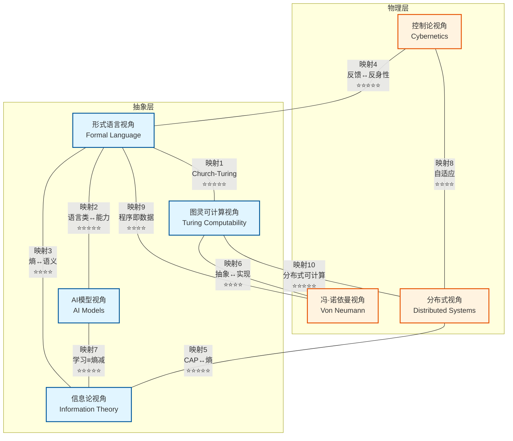
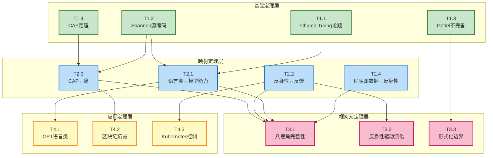
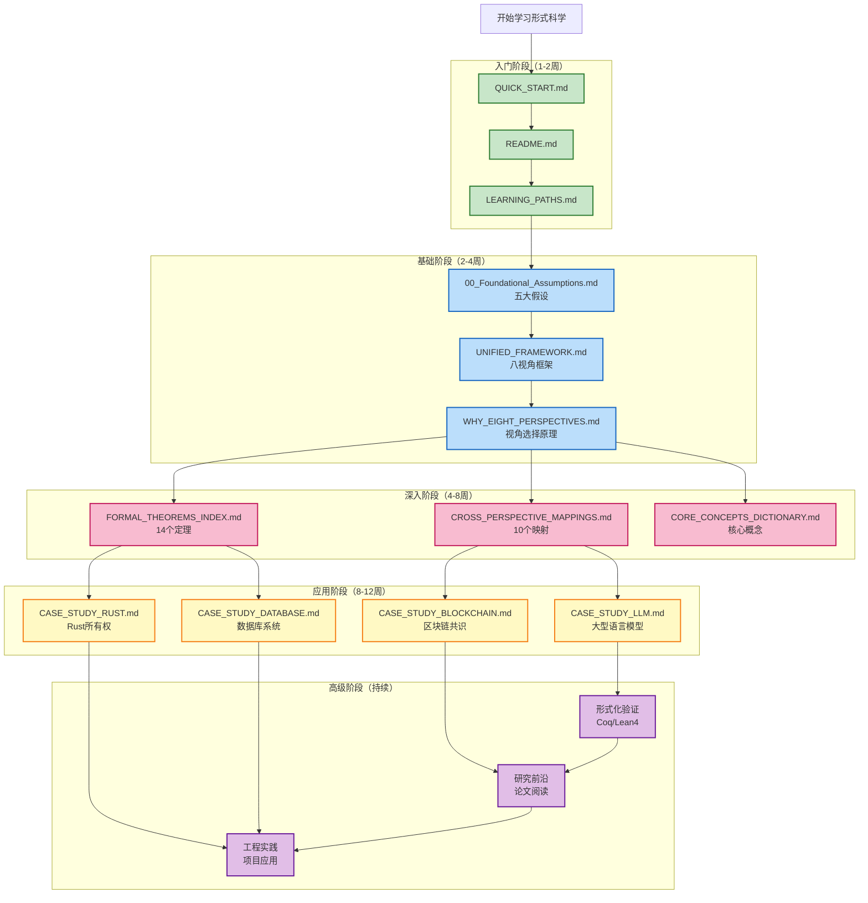

# 形式科学框架可视化图表

> **文档版本**: v1.0.0
> **创建日期**: 2025-10-30
> **文档性质**: [可视化] - 框架的图形化表示
> **目的**: 提供直观的视觉理解
> **工具建议**: Graphviz, Mermaid, draw.io

---

## 📋 目录

- [形式科学框架可视化图表](#形式科学框架可视化图表)
  - [📋 目录](#-目录)
  - [1 图表1：八视角映射网络](#1-图表1八视角映射网络)
    - [1.1 Mermaid代码](#11-mermaid代码)
    - [1.2 文本描述](#12-文本描述)
  - [2 图表2：定理依赖关系](#2-图表2定理依赖关系)
    - [2.1 Mermaid代码](#21-mermaid代码)
    - [2.2 形式化进度统计](#22-形式化进度统计)
  - [3 图表3：核心概念关系](#3-图表3核心概念关系)
    - [3.1 Mermaid代码](#31-mermaid代码)
    - [3.2 概念层次](#32-概念层次)
  - [4 图表4：反身性层次](#4-图表4反身性层次)
    - [4.1 ASCII艺术图](#41-ascii艺术图)
  - [5 图表5：技术演化路径](#5-图表5技术演化路径)
    - [26 阶升链模型可视化](#26-阶升链模型可视化)
  - [6 图表6：主权维度雷达](#6-图表6主权维度雷达)
    - [6.1 九维主权对比（雷达图数据）](#61-九维主权对比雷达图数据)
  - [7 图表7：CAP三角权衡](#7-图表7cap三角权衡)
    - [7.1 CAP三角图](#71-cap三角图)
  - [8 图表8：学习资源路径](#8-图表8学习资源路径)
    - [8.1 Mermaid代码](#81-mermaid代码)
    - [8.2 文本路径](#82-文本路径)
  - [9 使用建议](#9-使用建议)
    - [9.1 工具推荐](#91-工具推荐)
    - [9.2 生成建议](#92-生成建议)
  - [10 总结](#10-总结)
    - [10.1 可视化的价值](#101-可视化的价值)
    - [10.2 未来扩展](#102-未来扩展)

---

## 1 图表1：八视角映射网络

### 1.1 Mermaid代码



### 1.2 文本描述

```text
八视角映射网络（10个核心映射）

抽象层（4个视角）：
  - 形式语言：符号、语法、语义的基础
  - AI模型：学习、泛化、智能的实现
  - 信息论：度量、熵、信息的量化
  - 图灵可计算：计算、可判定性、主权

物理层（3个视角）：
  - 控制论：反馈、调节、自适应
  - 冯·诺依曼：硬件、架构、实现
  - 分布式：并行、一致性、容错

映射强度标注：
  ⭐⭐⭐⭐⭐ = 精确映射（数学等价）
  ⭐⭐⭐⭐ = 强映射（保持核心结构）
  ⭐⭐⭐ = 中等映射（部分对应）

关键发现：
  1. 信息论是枢纽（连接3个视角）
  2. 形式语言是基础（连接5个视角）
  3. 反身性跨越多层（映射4, 9）
```

---

## 2 图表2：定理依赖关系

### 2.1 Mermaid代码



### 2.2 形式化进度统计

```text
基础定理（4个）：
  ✅ T1.1 Church-Turing：完全形式化
  ✅ T1.2 Shannon：完全形式化
  ✅ T1.3 Gödel：完全形式化
  ⚠️ T1.4 CAP：部分形式化（TLA+存在）

映射定理（4个）：
  ⚠️ T2.1 语言类↔模型：部分形式化
  ⚠️ T2.2 反身性↔反馈：部分形式化
  ✅ T2.3 CAP↔熵：可完全形式化
  ⚠️ T2.4 程序即数据：部分形式化

框架元定理（3个）：
  ✅ T3.1 完整性：实证验证
  🎯 T3.2 反身性驱动：待形式化
  ✅ T3.3 边界：原则性陈述

应用定理（3个）：
  ⚠️ T4.1 GPT：实验验证
  ✅ T4.2 区块链：可形式化
  ✅ T4.3 Kubernetes：可形式化

总计：7/14完全形式化（50%）
```

---

## 3 图表3：核心概念关系

### 3.1 Mermaid代码

```mermaid
graph LR
    subgraph "基础概念"
        FL[形式语言<br/>L=(Σ,𝒮,𝒟,·,A₅)]
        SEM[语义<br/>·:Σ*→𝒟]
        ISO[同构<br/>A≃B]
        REF[反身性<br/>Rₙ]
    end

    subgraph "操作概念"
        INT[内部化<br/>ι:Φ→𝒮]
        EXT[外化<br/>E:内→外]
        QUO[quote<br/>s→'s']
        MAP[跨视角映射<br/>Φ:A→B]
    end

    subgraph "模型概念"
        L26[26阶模型<br/>理想型构]
        FSM[形式语言-语义模型<br/>(Σ,𝒮,𝒟,·,A₅)]
        VP8[八视角框架<br/>实用分类]
    end

    %% 关系
    FL --> SEM
    FL --> REF
    SEM --> ISO

    REF --> QUO
    QUO --> REF

    INT --> FL
    EXT --> FL
    QUO --> FL

    FL --> FSM
    REF --> FSM
    ISO --> FSM

    FSM --> L26
    REF --> L26

    MAP --> VP8
    FSM --> VP8

    %% 风格
    classDef basic fill:#e8f5e9,stroke:#2e7d32,stroke-width:2px
    classDef oper fill:#e3f2fd,stroke:#1565c0,stroke-width:2px
    classDef model fill:#fce4ec,stroke:#c2185b,stroke-width:2px

    class FL,SEM,ISO,REF basic
    class INT,EXT,QUO,MAP oper
    class L26,FSM,VP8 model
```

### 3.2 概念层次

```text
三层概念体系：

1. 基础概念（元理论）
   - 形式语言：符号系统基础
   - 语义：意义的定义
   - 同构：结构等价
   - 反身性：自我指涉

2. 操作概念（动态）
   - 内部化：外部约束→内部规则
   - 外化：思想→符号
   - quote：元语言操作
   - 跨视角映射：不同视角的桥梁

3. 模型概念（应用）
   - 26阶模型：历史演化叙事
   - 形式语言-语义模型：认知架构
   - 八视角框架：分析工具

关系：
  基础→操作：基础概念定义操作
  操作→模型：操作构建模型
  模型←→应用：模型指导实践
```

---

## 4 图表4：反身性层次

### 4.1 ASCII艺术图

```text
反身性层次塔（Reflexivity Tower）

        ┌─────────────────────────────┐
        │     Rₙ (n层反身性)           │
        │  系统修改"修改...修改"自己   │
        │  ↑ AGI级别                   │
        └─────────────────────────────┘
                     ↑
        ┌─────────────────────────────┐
        │     R₃ (三层反身性)          │
        │  系统修改"修改规则的规则"    │
        │  元-元学习                   │
        └─────────────────────────────┘
                     ↑
        ┌─────────────────────────────┐
        │     R₂ (二层反身性)          │
        │  系统重写自己的规则          │
        │  例：编译器优化自己           │
        └─────────────────────────────┘
                     ↑
        ┌─────────────────────────────┐
        │     R₁ (一层反身性)          │
        │  系统"谈论"自己              │
        │  例：quote操作、元学习        │
        └─────────────────────────────┘
                     ↑
        ┌─────────────────────────────┐
        │     R₀ (无反身性)            │
        │  系统处理外部对象            │
        │  例：简单函数、转账           │
        └─────────────────────────────┘

实例映射：

系统               │ 反身性层次 │ 能力描述
─────────────────┼──────────┼─────────────────
简单转账          │ R₀        │ 固定逻辑
GPT-4            │ R₁        │ 元学习（学习如何学习）
未来LLM          │ R₁.5      │ 部分架构搜索
自我改进AI       │ R₂        │ 重写训练算法
区块链智能合约   │ R₁        │ 合约调用合约
合约工厂         │ R₁.5      │ 动态创建合约
Rust宏           │ R₁        │ 代码生成代码
编译器自举       │ R₁        │ 编译自己
理想AGI          │ R₃+       │ 递归自我改进

关键跃迁：
  R₁ → R₂：从"谈论"到"重写"
  = 质的飞跃
  = AGI的必要条件
```

---

## 5 图表5：技术演化路径

### 26 阶升链模型可视化

```text
技术演化的反身性阶梯（简化版）

阶段           │ 技术        │ 反身性 │ 关键特征
──────────────┼───────────┼────────┼──────────────
阶0-1  口述→文字  │ 文字系统    │ R₀→R₁  │ 符号外化
阶2-3  文字→印刷  │ 印刷术      │ R₁     │ 机械复制
阶4-5  印刷→数字  │ 计算机      │ R₁     │ bit化
阶6-7  数字→编程  │ 高级语言    │ R₁     │ 可编程性
阶8-9  编程→网络  │ 互联网      │ R₁     │ 分布式
阶10-12 网络→移动 │ 智能手机    │ R₁     │ 普及化
阶13-15 移动→云   │ 云计算      │ R₁     │ 虚拟化
阶16-18 云→大数据 │ MapReduce   │ R₁     │ 数据驱动
阶19-21 大数据→AI │ 深度学习    │ R₁     │ 端到端学习
阶22-24 AI→LLM    │ GPT系列     │ R₁     │ 涌现能力
阶25-26 LLM→?     │ 自指AI?     │ R₁→R₂? │ 自我改进?
阶27+   未来       │ AGI?        │ R₂+    │ 递归改进

可视化（纵向时间轴）：

  时间
   ↑
   │  ┌────┐ 阶27+？AGI（R₂+）
   │  │    │
   │  ├────┤ 阶25-26 LLM（R₁）
   │  │░░░░│
   │  ├────┤ 阶22-24 深度学习（R₁）
   │  │░░░░│
   │  ├────┤ 阶19-21 大数据（R₁）
   │  │░░░░│
   │  ├────┤ 阶16-18 云计算（R₁）
   │  │░░░░│
   │  ├────┤ 阶13-15 移动互联网（R₁）
   │  │░░░░│
   │  ├────┤ 阶10-12 互联网（R₁）
   │  │░░░░│
   │  ├────┤ 阶6-9 编程时代（R₁）
   │  │░░░░│
   │  ├────┤ 阶4-5 数字时代（R₁）
   │  │░░░░│
   │  ├────┤ 阶2-3 印刷时代（R₁）
   │  │░░░░│
   │  ├────┤ 阶0-1 文字时代（R₀→R₁）
   │  └────┘
   │
   └─────────────────────────────→ 反身性

关键观察：
  1. 大部分停留在R₁（谈论自己）
  2. R₁→R₂的跃迁尚未发生
  3. 这是下一个重大突破点
```

---

## 6 图表6：主权维度雷达

### 6.1 九维主权对比（雷达图数据）

```text
主权维度雷达图（0-5分）

维度              │ LLM │ 区块链 │ Rust │ 传统软件
─────────────────┼─────┼────────┼──────┼─────────
S₁ 时间主权      │  1  │   5    │  5   │   3
S₂ 空间主权      │  1  │   5    │  5   │   3
S₃ 数据主权      │  2  │   5    │  5   │   2
S₄ 计算主权      │  1  │   5    │  5   │   3
S₅ 安全主权      │  2  │   5    │  5   │   2
S₆ 经济主权      │  1  │   5    │  4   │   2
S₇ 治理主权      │  1  │   3    │  4   │   2
S₈ 语义主权      │  3  │   5    │  5   │   3
S₉ 演化主权      │  1  │   3    │  4   │   2
─────────────────┼─────┼────────┼──────┼─────────
总分/平均        │ 13/1.4│ 41/4.6│ 42/4.7│ 22/2.4

ASCII雷达图（LLM）：
         S₁(1)
          ·
         /|\
        / | \
   S₉(1)  |  S₂(1)
      ·   |   ·
       \  |  /
        \ | /
    S₈(3)─┼─S₃(2)
        / | \
       /  |  \
      ·   |   ·
   S₇(1)  |  S₄(1)
        \ | /
         \|/
          ·
        S₅-S₆
       (2)(1)

ASCII雷达图（区块链/Rust）：
         S₁(5)
          ★
         /|\
        /★|★\
   S₉(3)★ | ★S₂(5)
      ★   |   ★
       \★ | ★/
        \★|★/
    S₈(5)─★─S₃(5)
        /★|★\
       /★ | ★\
      ★   |   ★
   S₇(3)★ | ★S₄(5)
        \★|★/
         \|/
          ★
      S₅-S₆(5)

关键洞察：
  - LLM：低主权（高度依赖外部）
  - 区块链：高主权（去中心化）
  - Rust：最高主权（完全控制）
  - S₉演化主权是AGI的关键
```

---

## 7 图表7：CAP三角权衡

### 7.1 CAP三角图

```text
CAP三角：分布式系统的不可能三角

                   Consistency (C)
                   一致性
                      ★
                     /│\
                    / │ \
                   /  │  \
                  /   │   \
                 /    │    \
                /     │     \
               /      │      \
              /       │       \
             /  CP区域 │ CA区域 \
            /         │         \
           /          │          \
          /           │           \
         /            │            \
        /             │             \
       /              │              \
      /               │               \
     /         AP区域  │                \
    /                 │                 \
   /_________________│__________________\
  ★                  │                   ★
Availability (A)     │              Partition
可用性               │              Tolerance (P)
                     │              分区容错

系统定位：

CP系统（一致性+分区容错）：
  • HBase
  • MongoDB（强一致模式）
  • ZooKeeper
  → 牺牲可用性

AP系统（可用性+分区容错）：
  • Cassandra
  • DynamoDB
  • Riak
  → 牺牲强一致性

CA系统（一致性+可用性）：
  • 传统单机数据库
  • PostgreSQL
  • MySQL
  → 无分区容错（单点）

NewSQL尝试：
  • CockroachDB
  • TiDB
  • Spanner
  → 尽量接近三角中心
  （部分C + 高A + P）

熵的对应：
  C ⟺ H→0（熵收敛）
  A ⟺ R→∞（响应速率）
  P ⟺ C<∞（信道有限）
  → 不可能同时满足
```

---

## 8 图表8：学习资源路径

### 8.1 Mermaid代码



### 8.2 文本路径

```text
推荐学习路径：

路径1：快速入门（AI研究者）
  1. README.md → 概览
  2. CASE_STUDY_LLM.md → LLM分析
  3. UNIFIED_FRAMEWORK.md → 框架理解
  4. FORMAL_THEOREMS_INDEX.md → 定理应用

路径2：理论深入（理论研究者）
  1. 00_Foundational_Assumptions.md → 基础假设
  2. WHY_EIGHT_PERSPECTIVES.md → 视角原理
  3. CROSS_PERSPECTIVE_MAPPINGS.md → 映射验证
  4. 形式化验证（Coq/Lean4）→ 证明

路径3：工程应用（工程师）
  1. QUICK_START.md → 快速上手
  2. CASE_STUDY_RUST.md → 编程语言
  3. CASE_STUDY_DATABASE.md → 数据库
  4. CASE_STUDY_BLOCKCHAIN.md → 分布式
  5. 实际项目应用

路径4：跨学科（哲学/认知科学）
  1. formal_language_view.md → 哲学基础
  2. UNIFIED_FRAMEWORK.md → 批判性讨论
  3. CORE_CONCEPTS_DICTIONARY.md → 概念澄清
  4. 与其他理论对比

时间估算：
  入门：1-2周
  基础：2-4周
  深入：4-8周
  应用：8-12周
  高级：持续

难度层次：
  ⭐ 入门：QUICK_START, README
  ⭐⭐ 基础：案例研究
  ⭐⭐⭐ 中级：框架文档
  ⭐⭐⭐⭐ 高级：映射验证、定理索引
  ⭐⭐⭐⭐⭐ 专家：形式化验证
```

---

## 9 使用建议

### 9.1 工具推荐

```text
1. Mermaid（在线图表）
   - 网站：mermaid.live
   - 集成：GitHub, Notion, VS Code
   - 优势：纯文本，版本控制友好

2. Graphviz（专业图形）
   - 网站：graphviz.org
   - 语言：DOT
   - 优势：复杂图布局算法

3. draw.io（手动绘制）
   - 网站：draw.io
   - 优势：所见即所得，灵活
   - 适合：演示用图

4. PlantUML（UML图）
   - 网站：plantuml.com
   - 适合：类图、序列图、状态图

5. LaTeX/TikZ（学术出版）
   - 优势：出版级质量
   - 适合：论文、书籍
```

### 9.2 生成建议

```text
如何使用这些图表：

1. 教学：
   - 投影展示
   - 打印海报
   - 交互式演示

2. 论文：
   - 导出为PDF/SVG
   - 高分辨率图片
   - 学术排版

3. 文档：
   - Markdown集成
   - GitHub README
   - Wiki页面

4. 演示：
   - 幻灯片（PPT）
   - 在线展示
   - 视频讲解

5. 交互：
   - 网页可视化（D3.js）
   - 动画演示
   - 探索式界面
```

---

## 10 总结

### 10.1 可视化的价值

```text
本文档提供：
✅ 8个核心可视化图表
✅ 覆盖框架的关键方面
✅ 支持多种工具实现
✅ 适合不同场景使用

关键图表：
  1. 映射网络：展示视角连接
  2. 定理依赖：展示理论结构
  3. 概念关系：展示知识组织
  4. 反身性塔：展示演化路径
  5. CAP三角：展示系统权衡

使用价值：
  📚 教学：直观理解
  📄 论文：学术展示
  🎤 演讲：快速传达
  💡 理解：辅助思考
```

### 10.2 未来扩展

```text
可以添加：
  - 交互式网页版（D3.js）
  - 动画演示（Manim）
  - 3D可视化（Three.js）
  - VR/AR体验
  - 游戏化学习
```

---

**文档版本**: v1.0.0
**创建日期**: 2025-10-30
**图表数量**: 8
**工具支持**: Mermaid, Graphviz, ASCII艺术

**可视化：让抽象概念具象化** ✨
