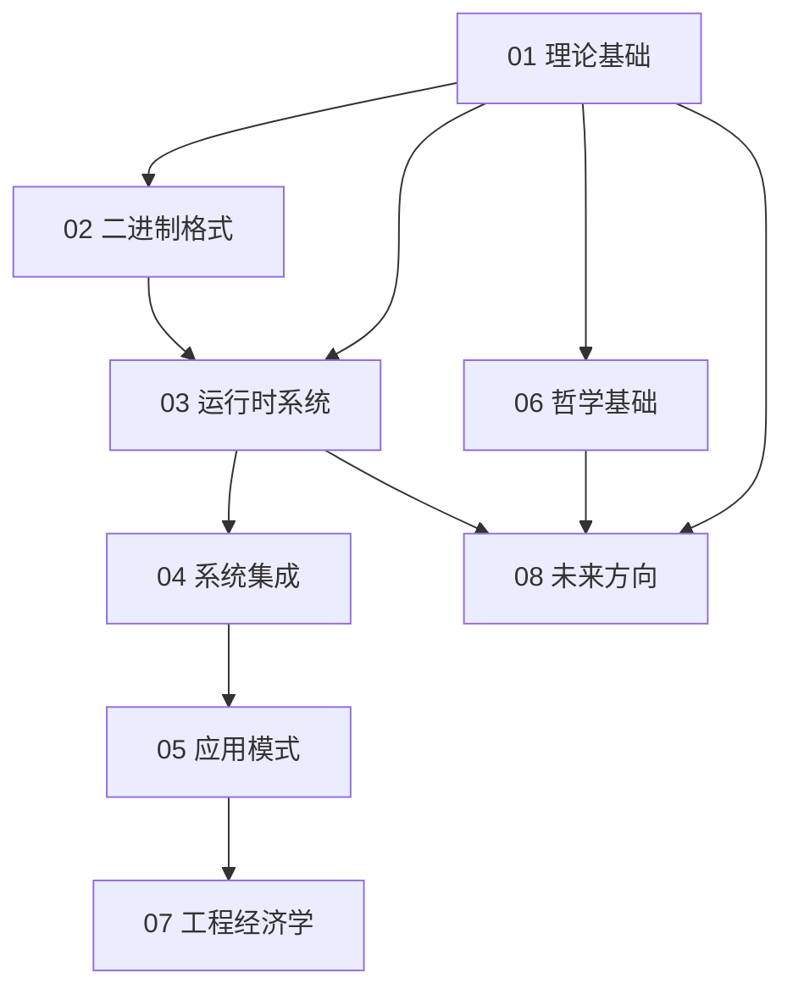

# WebAssembly 知识体系架构概览

## 整体架构图

```
┌─────────────────────────────────────────────────────────────────────┐
│                    WebAssembly 知识体系                              │
│                  (45 文档 × 8 模块 + 7 辅助文档)                      │
└─────────────────────────────────────────────────────────────────────┘
                              │
                              │
              ┌───────────────┼───────────────┐
              ├───────────────┼───────────────┤
              ↓               ↓               ↓
      ┌───────────┐   ┌───────────┐   ┌───────────┐
      │  理论层   │   │  技术层   │   │  哲学层   │
      │ (Formal)  │   │(Technical)│   │(Critical) │
      └───────────┘   └───────────┘   └───────────┘
          │               │               │
          │               │               │
    ┌─────┴─────┐   ┌─────┴─────┐   ┌─────┴─────┐
    ↓           ↓   ↓           ↓   ↓           ↓
┌───────┐  ┌───────┐ ┌───────┐ ┌───────┐ ┌───────┐
│ 01    │  │ 02    │ │ 03    │ │ 04    │ │ 05    │
│理论基础│  │二进制  │ │运行时  │ │系统集成│ │应用模式│
└───────┘  └───────┘ └───────┘ └───────┘ └───────┘
                          ↓
                    ┌─────┴─────┐
                    ↓           ↓
                ┌───────┐  ┌───────┐  ┌───────┐
                │ 06    │  │ 07    │  │ 08    │
                │哲学基础│  │工程经济│  │未来方向│
                └───────┘  └───────┘  └───────┘
```

---

## 三维知识空间

### 维度 1: 抽象层次（垂直）

```
抽象层次
  ↑
  │  哲学本体论          [06 哲学基础]
  │  ────────────────────────────────────
  │  工程经济学          [07 工程经济学]
  │  ────────────────────────────────────
  │  应用模式            [05 应用模式]
  │  ────────────────────────────────────
  │  系统集成            [04 系统集成]
  │  ────────────────────────────────────
  │  运行时系统          [03 运行时系统]
  │  ────────────────────────────────────
  │  二进制格式          [02 二进制格式]
  │  ────────────────────────────────────
  │  形式化语义          [01 理论基础]
  │  ────────────────────────────────────
  ↓  硬件抽象
```

### 维度 2: 关注焦点（水平）

```
理论 ←────────────────────────→ 实践
  │                              │
  │  形式化        权衡         工程   │
  │  验证          分析         实施   │
  │    ↓            ↓            ↓     │
  │  [01]     [03][04][07]     [05]   │
  │  [02]                       [08]   │
  │  [06]                              │
```

### 维度 3: 批判性深度（第三维）

```
批判深度（每个模块内部）
  ↑
  │  哲学反思
  │  ──────────────
  │  权衡分析
  │  ──────────────
  │  反例/边界条件
  │  ──────────────
  │  正面描述
  ↓
```

---

## 模块间依赖关系

### 强依赖（理解前置）



### 弱依赖（交叉引用）

```
01 ←→ 06  (理论 ↔ 哲学)
03 ←→ 07  (性能 ↔ 成本)
05 ←→ 07  (应用 ↔ ROI)
02 ←→ 08  (现状 ↔ 演化)
```

---

## 概念地图

### 核心概念集群

```
┌─────────────────────────────────────────┐
│          类型安全 (Type Safety)          │
│  ┌────────────────────────────────────┐ │
│  │ Progress Theorem  [01.2]           │ │
│  │ Preservation Theorem [01.2]        │ │
│  │ Type Stack Validation [02.4]       │ │
│  │ Control Flow Integrity [02.4]      │ │
│  └────────────────────────────────────┘ │
└─────────────────────────────────────────┘

┌─────────────────────────────────────────┐
│        确定性 (Determinism)              │
│  ┌────────────────────────────────────┐ │
│  │ Semantic Determinism [01.4]        │ │
│  │ IEEE-754 Guarantees [06.3]         │ │
│  │ Memory Model [04.4]                │ │
│  │ Concurrency Limitations [04.4]     │ │
│  └────────────────────────────────────┘ │
└─────────────────────────────────────────┘

┌─────────────────────────────────────────┐
│         安全性 (Security)                │
│  ┌────────────────────────────────────┐ │
│  │ Capability Security [04.1]         │ │
│  │ Sandbox Isolation [03.3]           │ │
│  │ Memory Isolation [01.5]            │ │
│  │ Trust Boundaries [06.2]            │ │
│  └────────────────────────────────────┘ │
└─────────────────────────────────────────┘

┌─────────────────────────────────────────┐
│         性能 (Performance)               │
│  ┌────────────────────────────────────┐ │
│  │ Compilation Strategies [03.1]      │ │
│  │ Streaming Compilation [02.5]       │ │
│  │ Performance Ceiling [08.3]         │ │
│  │ Cost-Performance Curves [07.1]     │ │
│  └────────────────────────────────────┘ │
└─────────────────────────────────────────┘

┌─────────────────────────────────────────┐
│      可移植性 (Portability)              │
│  ┌────────────────────────────────────┐ │
│  │ Abstract Machine [01.4]            │ │
│  │ Binary Format [02.1]               │ │
│  │ WASI Interface [04.1]              │ │
│  │ Portability Theory [06.1]          │ │
│  └────────────────────────────────────┘ │
└─────────────────────────────────────────┘
```

---

## 知识流动路径

### Path 1: 理论到实践

```
形式化语义 [01.1]
    ↓
类型系统 [01.2]
    ↓
验证模型 [01.3]
    ↓
验证规则 [02.4]
    ↓
编译策略 [03.1]
    ↓
应用部署 [05.*]
```

### Path 2: 二进制到执行

```
二进制编码 [02.1]
    ↓
模块结构 [02.3]
    ↓
验证规则 [02.4]
    ↓
流式编译 [02.5]
    ↓
运行时架构 [03.2]
    ↓
性能分析 [03.5]
```

### Path 3: 接口到集成

```
WASI 接口 [04.1]
    ↓
宿主函数 [04.2]
    ↓
内存共享 [04.3]
    ↓
线程模型 [04.4]
    ↓
互操作性 [04.5]
    ↓
系统集成实践 [05.*]
```

### Path 4: 哲学到批判

```
本体论 [06.5]
    ↓
认识论 [06.3]
    ↓
方法论 [06.4]
    ↓
价值论 [06.2]
    ↓
批判性综合 [08.*]
```

---

## 文档类型分类

### 按形式化程度

**高度形式化** (★★★★★)：

- 01.1 形式化语义
- 01.2 类型系统
- 01.3 验证模型
- 02.4 验证规则
- 06.1 可移植性理论

**中度形式化** (★★★☆☆)：

- 01.4 执行模型
- 02.1 二进制编码
- 02.3 模块结构
- 04.1 WASI 接口
- 07.1 性能经济学

**实践导向** (★★☆☆☆)：

- 03.2 WasmEdge 架构
- 05.* 应用模式系列
- 07.2 部署策略
- 07.5 迁移路径

### 按批判性深度

**哲学批判** (Philosophy)：

- 06.* 哲学基础系列
- 08.3 理论极限
- 08.5 工业趋势

**工程权衡** (Trade-offs)：

- 03.1 编译策略
- 04.3 内存共享
- 07.* 工程经济学系列

**技术描述** (Descriptive)：

- 02.1 二进制编码
- 02.2 文本格式
- 04.2 宿主函数

---

## 定理与证明网络

### 核心定理链

```
类型安全定理 [01.2]
    ├─ Progress: ∀ well-typed term, either value or can step
    └─ Preservation: Type preserved across reduction

            ↓ (implies)

验证完备性定理 [02.4]
    └─ Valid(M) ⟹ ∀ Execution(M): ¬ UndefinedBehavior

            ↓ (enables)

沙箱安全定理 [01.5]
    └─ LinearMemory_wasm ∩ HostMemory = ∅

            ↓ (grounds)

确定性定理 [01.4]
    ├─ Semantic: (S, I) →* V₁ ∧ (S, I) →* V₂ ⟹ V₁ = V₂
    └─ Physical: Abstract ≠> Physical (counterexamples exist)
```

### 性能定理链

```
验证复杂度下界 [01.3]
    └─ T_validate = Ω(n)

            ↓

流式编译内存界限 [02.5]
    └─ Memory_stream = O(max_function_size)

            ↓

性能上界 [08.3]
    └─ Perf_wasm ≤ 0.95 × Perf_native (empirical)

            ↓

成本优化模型 [07.1]
    └─ Cost_wasm ≈ 0.1 - 0.3 × Cost_traditional
```

---

## 批判性分析框架

### 三层批判结构

```
┌───────────────────────────────────────┐
│  层次 3: 哲学本体论批判                │
│  ─────────────────────────────────    │
│  • 可移植性的本体论承诺能否兑现？      │
│  • 抽象的代价是否值得？               │
│  • 通用计算的哲学基础                 │
│  [06.*, 08.*]                         │
└───────────────────────────────────────┘
              ↓
┌───────────────────────────────────────┐
│  层次 2: 工程权衡分析                  │
│  ─────────────────────────────────    │
│  • 启动延迟 vs 峰值性能               │
│  • 安全性 vs 功能性                   │
│  • 标准化 vs 创新                     │
│  [03.*, 04.*, 07.*]                   │
└───────────────────────────────────────┘
              ↓
┌───────────────────────────────────────┐
│  层次 1: 技术边界条件                  │
│  ─────────────────────────────────    │
│  • 反例与失效模式                     │
│  • 性能瓶颈与限制                     │
│  • 实现的不一致性                     │
│  [01.*, 02.*, 05.*]                   │
└───────────────────────────────────────┘
```

### 批判性问题矩阵

| 模块 | 技术批判 | 哲学批判 | 经济批判 |
|------|---------|---------|---------|
| 01 理论基础 | 验证的哥德尔限制 | 形式化的价值 | 验证成本 |
| 02 二进制格式 | 调试困难 | 可读性 vs 紧凑性 | 工具链投资 |
| 03 运行时系统 | 抽象税 | 性能乐观主义 | 运行时成本 |
| 04 系统集成 | 沙箱漏洞 | 安全 vs 功能 | 集成复杂度 |
| 05 应用模式 | 适用性边界 | 技术决定论 | ROI 盈亏点 |
| 06 哲学基础 | 概念混淆 | 本体论承诺 | 抽象成本 |
| 07 工程经济学 | 数据局限性 | 量化的局限 | 迁移风险 |
| 08 未来方向 | 复杂性爆炸 | 技术乐观主义 | 标准化政治 |

---

## 跨学科视角

### 计算机科学视角

```
[理论计算机科学]
  ├─ 类型论 → [01.2]
  ├─ 自动机理论 → [01.4]
  ├─ 复杂性理论 → [01.3]
  └─ 形式化方法 → [01.1]

[软件工程]
  ├─ 架构模式 → [05.*]
  ├─ 性能工程 → [03.5]
  ├─ DevOps → [07.2]
  └─ 技术债务 → [07.5]

[系统编程]
  ├─ 编译器设计 → [03.1]
  ├─ 运行时系统 → [03.*]
  ├─ 内存管理 → [04.3]
  └─ 并发编程 → [04.4]
```

### 哲学视角

```
[本体论]
  └─ 计算本质 → [06.5]

[认识论]
  ├─ 确定性知识 → [06.3]
  └─ 验证可靠性 → [01.3]

[伦理学]
  └─ 安全责任 → [06.2]

[美学]
  └─ 抽象美学 → [06.4]
```

### 经济学视角

```
[微观经济学]
  ├─ 成本-收益 → [07.3]
  ├─ 边际效用 → [07.1]
  └─ 资源定价 → [07.1]

[产业组织]
  ├─ 网络效应 → [08.2]
  ├─ 标准化博弈 → [08.2]
  └─ 厂商锁定 → [08.5]

[发展经济学]
  └─ 技术采用曲线 → [08.5]
```

---

## 使用场景映射

### 场景 1: 学术研究

**目标**：形式化验证、理论创新

**路径**：

```
README → 01 理论基础 (全部) → 06 哲学基础 → 08.4 研究前沿
```

**关键文档**：

- 01.1, 01.2, 01.3 (形式化基础)
- 06.* (哲学深度)
- 08.4 (开放问题)

### 场景 2: 架构决策

**目标**：技术选型、架构设计

**路径**：

```
00 主索引 → 03 运行时系统 → 04 系统集成 → 05 应用模式 → 07 工程经济学
```

**关键文档**：

- 03.1 (编译策略权衡)
- 05.* (模式选择)
- 07.3 (成本分析)

### 场景 3: 性能优化

**目标**：性能调优、瓶颈分析

**路径**：

```
QUICK_REFERENCE → 03.5 性能分析 → 02.5 流式编译 → 03.1 编译策略 → 08.3 理论极限
```

**关键文档**：

- 03.5 (基准测试)
- 02.5 (流式优化)
- 08.3 (性能上界)

### 场景 4: 安全审计

**目标**：安全评估、漏洞分析

**路径**：

```
01.5 安全模型 → 03.3 浏览器集成 → 04.1 WASI 接口 → 06.2 安全哲学
```

**关键文档**：

- 01.5 (形式化安全模型)
- 03.3 (沙箱机制)
- 06.2 (信任边界)

---

## 工具与资源映射

### 理论验证工具

| 工具 | 相关文档 | 用途 |
|------|---------|-----|
| Isabelle/HOL | 01.1, 01.2 | 类型安全证明 |
| Coq | 01.3 | 验证算法机械化 |
| K Framework | 01.4 | 执行语义形式化 |

### 实现与运行时

| 工具 | 相关文档 | 用途 |
|------|---------|-----|
| WasmEdge | 03.2, 05.* | 边缘计算运行时 |
| Wasmtime | 03.4 | 独立运行时 |
| V8 | 03.3 | 浏览器集成 |

### 开发工具

| 工具 | 相关文档 | 用途 |
|------|---------|-----|
| WABT | 02.2 | WAT ↔ 二进制转换 |
| Emscripten | 05.* | C/C++ 编译器 |
| wasm-bindgen | 04.5 | Rust 绑定生成 |

---

## 阅读难度评估

| 模块 | 数学基础 | 编程经验 | 系统知识 | 哲学素养 | 综合难度 |
|------|---------|---------|---------|---------|---------|
| 01 | ★★★★★ | ★★★☆☆ | ★★★☆☆ | ★★☆☆☆ | ★★★★☆ |
| 02 | ★★★☆☆ | ★★★★☆ | ★★★★☆ | ★☆☆☆☆ | ★★★☆☆ |
| 03 | ★★☆☆☆ | ★★★★☆ | ★★★★★ | ★★☆☆☆ | ★★★★☆ |
| 04 | ★★☆☆☆ | ★★★★☆ | ★★★★★ | ★★☆☆☆ | ★★★★☆ |
| 05 | ★☆☆☆☆ | ★★★★☆ | ★★★☆☆ | ★★☆☆☆ | ★★★☆☆ |
| 06 | ★★★★☆ | ★★☆☆☆ | ★★☆☆☆ | ★★★★★ | ★★★★☆ |
| 07 | ★★★☆☆ | ★★★☆☆ | ★★★☆☆ | ★★★☆☆ | ★★★☆☆ |
| 08 | ★★★☆☆ | ★★★☆☆ | ★★★☆☆ | ★★★★☆ | ★★★☆☆ |

**建议前置知识**：

- **数学**：离散数学、抽象代数、逻辑学
- **编程**：系统编程（C/Rust）、编译原理
- **系统**：操作系统、计算机体系结构
- **哲学**：科学哲学、技术哲学基础

---

## 知识获取策略

### 自顶向下（演绎）

适合：有理论基础的研究者

```
哲学本体 [06.5] → 形式化 [01.*] → 实现 [02-05] → 应用 [05.*]
```

### 自底向上（归纳）

适合：有实践经验的工程师

```
应用场景 [05.*] → 实现机制 [03-04] → 格式规范 [02.*] → 理论基础 [01.*]
```

### 问题驱动（辩证）

适合：架构师与决策者

```
FAQ → 相关批判分析 → 权衡模型 [07.*] → 深入理论/实践
```

---

## 核心张力与平衡

本知识体系围绕以下核心张力展开：

```
┌─────────────────────────────────────────┐
│                                         │
│    抽象          vs        具体          │
│  (理论优雅)              (工程实用)      │
│     │                       │           │
│     └───────────┬───────────┘           │
│                 │                       │
│            动态平衡点                    │
│                                         │
│    安全          vs        功能          │
│  (沙箱隔离)              (系统访问)      │
│     │                       │           │
│     └───────────┬───────────┘           │
│                 │                       │
│            WASI 设计                     │
│                                         │
│    标准化        vs        创新          │
│  (互操作性)              (竞争优势)      │
│     │                       │           │
│     └───────────┬───────────┘           │
│                 │                       │
│            提案流程                      │
│                                         │
└─────────────────────────────────────────┘
```

---

## 文档元结构

每个核心文档（01-08 模块）遵循统一结构：

```
1. 核心命题 (3-5 个形式化定理)
2. 技术详解 (5-10 个子主题)
3. 示例与实证 (代码 + 数据)
4. 性能/安全/成本分析
5. 批判性分析 (优势 + 局限 + 反思)
6. 参考文献 (学术 + 规范 + 实践)
7. 相关文档链接 (内部交叉引用)
```

---

## 总结：知识体系的哲学

> **本知识体系不是技术手册，而是批判性的技术哲学探索。**

我们试图回答：

1. **是什么**（What）：WebAssembly 的本质是什么？
2. **为什么**（Why）：为什么这样设计？背后的权衡是什么？
3. **怎么做**（How）：如何实现、如何应用、如何评估？
4. **该不该**（Should）：在何种场景下应该采用？边界在哪里？

通过形式化、实证和批判的三角验证，我们力求超越技术描述，揭示 WebAssembly 作为计算抽象的深层结构与限制。

---

_"地图不是疆域，但好的地图能帮助我们理解疆域。" —— Alfred Korzybski_

_本架构概览是知识地图，真正的理解需要深入每个文档的细节。_
