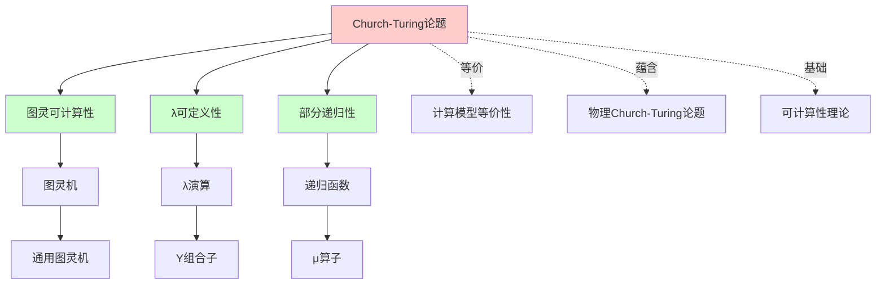
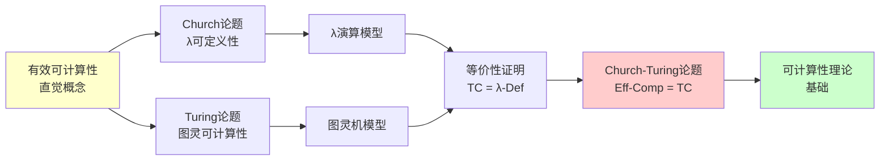
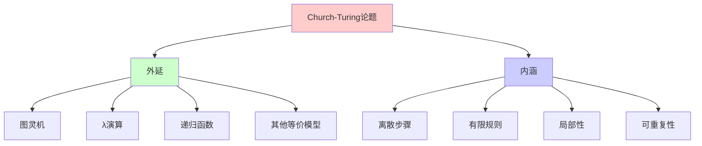

# Church-Turing论题与计算等价性

> **主题**: 计算的本质与形式化模型的等价性
> **创建日期**: 2025-12-02
> **难度**: ⭐⭐⭐
> **前置知识**: 基本数理逻辑、集合论

---

## 📋 目录

- [Church-Turing论题与计算等价性](#church-turing论题与计算等价性)
  - [📋 目录](#-目录)
  - [1. 历史背景与动机](#1-历史背景与动机)
    - [1.1 希尔伯特判定问题 (Entscheidungsproblem)](#11-希尔伯特判定问题-entscheidungsproblem)
    - [1.2 三位先驱的独立工作 (1936)](#12-三位先驱的独立工作-1936)
    - [1.3 Gödel的催化作用](#13-gödel的催化作用)
  - [2. Church-Turing论题的形式化表述](#2-church-turing论题的形式化表述)
    - [2.1 原始表述 (Church, 1936)](#21-原始表述-church-1936)
    - [2.2 Turing的表述 (1936)](#22-turing的表述-1936)
    - [2.3 现代统一表述](#23-现代统一表述)
    - [2.4 数学形式化](#24-数学形式化)
    - [2.5 为什么这是"论题"而非"定理"？](#25-为什么这是论题而非定理)
    - [2.6 概念分析：Church-Turing论题](#26-概念分析church-turing论题)
      - [2.6.1 定义矩阵](#261-定义矩阵)
      - [2.6.2 属性分析](#262-属性分析)
      - [2.6.3 外延分析](#263-外延分析)
      - [2.6.4 内涵分析](#264-内涵分析)
      - [2.6.5 关系网络](#265-关系网络)
    - [2.7 思维表征：Church-Turing论题](#27-思维表征church-turing论题)
      - [2.7.1 概念关系网络图](#271-概念关系网络图)
      - [2.7.2 论证逻辑路径图](#272-论证逻辑路径图)
      - [2.7.3 概念属性矩阵](#273-概念属性矩阵)
      - [2.7.4 外延内涵分析图](#274-外延内涵分析图)
  - [3. 计算等价性三角](#3-计算等价性三角)
    - [3.1 核心三角关系](#31-核心三角关系)
    - [3.2 扩展计算模型](#32-扩展计算模型)
  - [4. 等价性证明概览](#4-等价性证明概览)
    - [4.1 图灵机 ⟷ λ演算](#41-图灵机--λ演算)
      - [方向1: TM → λ](#方向1-tm--λ)
      - [方向2: λ → TM](#方向2-λ--tm)
    - [4.2 递归函数 ⟷ 图灵机](#42-递归函数--图灵机)
    - [4.3 Petri网 ⟷ 图灵机](#43-petri网--图灵机)
  - [5. 论题的哲学含义](#5-论题的哲学含义)
    - [5.1 计算的物理基础](#51-计算的物理基础)
    - [5.2 Deutsch的量子版本](#52-deutsch的量子版本)
    - [5.3 心智与可计算性](#53-心智与可计算性)
  - [6. 现代视角与批判](#6-现代视角与批判)
    - [6.1 Copeland的批判](#61-copeland的批判)
    - [6.2 Wegner的交互计算](#62-wegner的交互计算)
    - [6.3 可计算性的上界与下界](#63-可计算性的上界与下界)
  - [7. 2024-2025最新研究](#7-2024-2025最新研究)
    - [7.1 计算宇宙学](#71-计算宇宙学)
    - [7.2 超递归计算 (Hypercomputation)](#72-超递归计算-hypercomputation)
    - [7.3 AI与AGI的可计算性](#73-ai与agi的可计算性)
  - [8. 关键定理总结](#8-关键定理总结)
    - [定理8.1 (Church-Turing等价性)](#定理81-church-turing等价性)
    - [定理8.2 (Turing完备性的充要条件)](#定理82-turing完备性的充要条件)
    - [定理8.3 (不可判定性的不变性)](#定理83-不可判定性的不变性)
  - [9. 实践应用](#9-实践应用)
    - [9.1 编程语言设计](#91-编程语言设计)
    - [9.2 智能合约的诅咒](#92-智能合约的诅咒)
    - [9.3 AI安全与停机问题](#93-ai安全与停机问题)
  - [10. 习题与思考](#10-习题与思考)
    - [习题1 (容易)](#习题1-容易)
    - [习题2 (中等)](#习题2-中等)
    - [习题3 (困难)](#习题3-困难)
    - [思考题1](#思考题1)
    - [思考题2](#思考题2)
  - [11. 参考资源](#11-参考资源)
    - [11.1 经典论文](#111-经典论文)
    - [11.2 现代教材](#112-现代教材)
    - [11.3 在线资源](#113-在线资源)
    - [11.4 量子与物理扩展](#114-量子与物理扩展)
    - [11.5 哲学与认知](#115-哲学与认知)
  - [12. 下一步学习](#12-下一步学习)


---

## 1. 历史背景与动机

### 1.1 希尔伯特判定问题 (Entscheidungsproblem)

**历史时刻**: 1928年，希尔伯特提出：

> _"是否存在一个通用算法，可以判定任意一阶逻辑命题的真假？"_

这个问题推动了可计算性理论的诞生。

### 1.2 三位先驱的独立工作 (1936)

| 研究者 | 模型 | 发表时间 |
|--------|------|----------|
| **Alonzo Church** | λ演算 | 1936年4月 |
| **Alan Turing** | 图灵机 | 1936年5月 |
| **Emil Post** | Post系统 | 1936年10月 |

**惊人的巧合**: 三人独立地提出了三种看似完全不同的计算模型，却发现它们**等价**！

### 1.3 Gödel的催化作用

Kurt Gödel在1934年提出**一般递归函数**（基于Herbrand-Gödel的工作），但他对自己的定义不够满意，认为缺乏"直观上的显然性"。

直到看到Turing的论文后，Gödel才确信图灵机捕捉到了"有效可计算"的本质。

---

## 2. Church-Turing论题的形式化表述

### 2.1 原始表述 (Church, 1936)

> **Church论题**:
>
> _"一个函数是有效可计算的，当且仅当它是λ可定义的。"_

**历史背景**: Church在1936年4月发表论文《An Unsolvable Problem of Elementary Number Theory》，首次提出这一论题。

**形式化表述**:

设 $f: \mathbb{N}^k \to \mathbb{N}$ 是一个函数，则：

$$f \text{ 是有效可计算的 } \iff \exists \lambda\text{-项 } M: \forall n_1, \ldots, n_k, M(\overline{n_1}, \ldots, \overline{n_k}) =_\beta \overline{f(n_1, \ldots, n_k)}$$

其中 $\overline{n}$ 表示自然数 $n$ 的Church编码。

### 2.2 Turing的表述 (1936)

> **Turing论题**:
>
> _"一个函数是有效可计算的，当且仅当存在图灵机可以计算它。"_

**历史背景**: Turing在1936年5月发表论文《On Computable Numbers, with an Application to the Entscheidungsproblem》，独立提出这一论题。

**形式化表述**:

设 $f: \mathbb{N}^k \to \mathbb{N}$ 是一个函数，则：

$$f \text{ 是有效可计算的 } \iff \exists \text{ 图灵机 } M: \forall n_1, \ldots, n_k, M(\#(n_1, \ldots, n_k)) \downarrow \text{ 且输出 } \#(f(n_1, \ldots, n_k))$$

其中 $\#(n_1, \ldots, n_k)$ 表示输入的自然数编码。

### 2.3 现代统一表述

> **Church-Turing论题 (CTT)**:
>
> _"所有直觉上'有效可计算'的函数都图灵可计算，反之亦然。"_

**等价表述**:

1. **计算模型等价性**: 所有"合理"的计算模型都定义相同的可计算函数类
2. **物理可实现性**: 任何物理上可实现的计算机都不能计算图灵机无法计算的函数
3. **算法等价性**: 任何算法可计算的函数都是图灵可计算的

### 2.4 数学形式化

**符号定义**:

- **TC** = 图灵可计算函数类 = $\{f: \mathbb{N}^k \to \mathbb{N} \mid \exists \text{TM } M: M \text{ 计算 } f\}$
- **λ-Def** = λ可定义函数类 = $\{f: \mathbb{N}^k \to \mathbb{N} \mid \exists \lambda\text{-项 } M: M \text{ 定义 } f\}$
- **Part-Rec** = 部分递归函数类 = $\{f: \mathbb{N}^k \to \mathbb{N} \mid f \text{ 是部分递归函数}\}$
- **Eff-Comp** = "有效可计算"函数类（非形式化概念）

**CTT断言**:

$$\text{Eff-Comp} = \text{TC} = \lambda\text{-Def} = \text{Part-Rec}$$

**可证明的部分**:

$$\text{TC} = \lambda\text{-Def} = \text{Part-Rec}$$

这是**可证明的数学定理**（通过构造性证明）。

**不可证明的部分**:

$$\text{Eff-Comp} = \text{TC}$$

这是**论题**，因为"有效可计算"是非形式化概念。

### 2.5 为什么这是"论题"而非"定理"？

**关键问题**: "有效可计算"（Effectively Computable）是一个**非形式化**的直觉概念，无法在数学上严格定义。

**形式化困难**:

1. **"有效"的含义**: 什么是"有效"？需要多少步骤？需要多少资源？
2. **"算法"的定义**: 算法本身需要形式化定义，但形式化定义又需要算法概念
3. **循环依赖**: 定义"可计算"需要"算法"，定义"算法"需要"可计算"

**因此CTT是**:

- ✅ **可信的哲学原则** - 基于大量经验证据
  - 所有已知计算模型都等价
  - 80+年未发现反例
  - 物理世界支持这一论题
- ✅ **可验证的等价性** - TC = λ-Def = Part-Rec（这是定理）
  - 这是可严格证明的
  - 通过构造性证明建立等价性
- ❌ **不可证明的数学定理** - 因为涉及非形式化概念
  - 无法在形式系统中证明
  - 依赖于直觉和哲学论证

### 2.6 概念分析：Church-Turing论题

#### 2.6.1 定义矩阵

| 维度 | 内容 |
|------|------|
| **形式化定义** | Eff-Comp = TC = λ-Def = Part-Rec |
| **直观理解** | 所有"能算"的函数都能用图灵机算 |
| **等价定义** | 1. 计算模型等价性<br>2. 物理可实现性<br>3. 算法等价性 |
| **历史定义** | Church (1936): λ可定义性<br>Turing (1936): 图灵可计算性 |

#### 2.6.2 属性分析

**必要属性** (Necessary Properties):

1. **等价性**: TC = λ-Def = Part-Rec
2. **封闭性**: 可计算函数类在复合、递归下封闭
3. **通用性**: 存在通用图灵机

**充分属性** (Sufficient Properties):

1. **图灵完备性**: 能模拟图灵机的计算模型
2. **递归能力**: 支持递归定义
3. **无限存储**: 理论上无限存储空间

**本质属性** (Essential Properties):

1. **离散性**: 计算是离散步骤的序列
2. **确定性**: 每一步都是确定的（或概率确定的）
3. **有限性**: 每一步只涉及有限信息

**偶然属性** (Accidental Properties):

1. **具体实现**: 物理实现方式
2. **效率**: 计算效率（属于复杂度理论）
3. **并行性**: 是否支持并行计算

#### 2.6.3 外延分析

**包含的实例**:

1. **经典计算模型**:
   - 图灵机
   - λ演算
   - 部分递归函数
   - Post系统
   - Markov算法

2. **现代计算模型**:
   - 随机存取机 (RAM)
   - While程序
   - 带抑止弧的Petri网
   - 无限寄存器机

3. **编程语言**:
   - 图灵完备的编程语言（大多数现代语言）
   - 函数式语言（Haskell, Lisp）
   - 命令式语言（C, Python）

**包含的子类**:

1. **可判定函数** ⊂ 可计算函数
2. **原始递归函数** ⊂ 部分递归函数
3. **多项式时间可计算** ⊂ 可计算函数

**边界情况**:

1. **超计算模型** (Hypercomputation):
   - 不在CTT范围内
   - 如: 无限时间图灵机、Oracle机器

2. **量子计算**:
   - 在CTT范围内（可被经典图灵机模拟）
   - 但可能有复杂度优势

#### 2.6.4 内涵分析

**核心特征**:

1. **离散步骤**: 计算由离散步骤组成
2. **有限规则**: 每一步遵循有限规则
3. **局部性**: 每一步只处理局部信息
4. **可重复性**: 相同输入产生相同输出

**本质属性**:

1. **算法性**: 存在算法描述
2. **机械性**: 可由机械过程执行
3. **有限性**: 每一步都是有限的

**与其他概念的区别**:

| 概念 | 区别 |
|------|------|
| **可判定性** | CTT关于可计算性，可判定性更强（要求停机） |
| **复杂度** | CTT不考虑效率，复杂度考虑时间/空间 |
| **物理可实现性** | CTT是数学概念，物理可实现性是物理概念 |

#### 2.6.5 关系网络

**上位概念**:

- 可计算性理论
- 计算理论
- 算法理论

**下位概念**:

- 图灵可计算性
- λ可定义性
- 递归可枚举性

**相关概念**:

- 停机问题
- Rice定理
- 不可判定性
- 复杂度类

**等价概念**:

- Church论题
- Turing论题
- 计算等价性原理

### 2.7 思维表征：Church-Turing论题

#### 2.7.1 概念关系网络图



#### 2.7.2 论证逻辑路径图



#### 2.7.3 概念属性矩阵

| 属性 | Church-Turing论题 | 图灵可计算性 | λ可定义性 | 部分递归性 |
|------|------------------|-------------|----------|-----------|
| **离散性** | ✓ | ✓ | ✓ | ✓ |
| **确定性** | ✓ | ✓ | ✓ | ✓ |
| **有限性** | ✓ | ✓ | ✓ | ✓ |
| **递归能力** | ✓ | ✓ | ✓ | ✓ |
| **通用性** | ✓ | ✓ | ✓ | ✓ |
| **等价性** | ✓ | ✓ | ✓ | ✓ |
| **可证明性** | ✗ | ✓ | ✓ | ✓ |
| **物理可实现** | ? | ✓ | ? | ? |

#### 2.7.4 外延内涵分析图



---

## 3. 计算等价性三角

### 3.1 核心三角关系

```text
           图灵机 (TM)
            /   \
           /     \
          /       \
    λ演算         递归函数
    (λ-Calc)     (Part-Rec)
         \       /
          \     /
           \   /
        递归可枚举语言 (RE)
```

**定理3.1 (计算模型等价性)**:
以下计算模型定义的可计算函数类完全等价：

1. **图灵机**
2. **λ演算**（无类型）
3. **部分递归函数**
4. **Post-Turing机器**
5. **Markov算法**
6. **无限寄存器机**
7. **While程序**
8. **带抑止弧的Petri网**

### 3.2 扩展计算模型

```text
原始递归函数 ⊂ 部分递归函数 = 图灵可计算
         ↑                    ↑
      可终止                 可能不终止
```

**定理3.2**: 原始递归函数严格包含于部分递归函数

**证明**: Ackermann函数是部分递归但非原始递归的。

---

## 4. 等价性证明概览

### 4.1 图灵机 ⟷ λ演算

#### 方向1: TM → λ

**编码思路**:

```text
磁带 = List(Symbol)  -- Church编码的列表
状态 = Church数字
转移函数 = λ表达式的条件分支
```

**关键构造**: Y组合子提供循环：

```text
Y = λf.(λx.f(x x))(λx.f(x x))
```

**定理4.1**: 对任意图灵机M，存在λ项Λ_M使得：

```text
M(input) = n  ⟺  Λ_M input =β Church(n)
```

#### 方向2: λ → TM

**编码思路**:

```text
λ项 = 树结构 → 编码为字符串
β规约 = 字符串重写 → 图灵机模拟
```

**定理4.2**: 对任意λ项M，存在图灵机T_M使得：

```text
M =β N  ⟺  T_M模拟β归约得到N
```

### 4.2 递归函数 ⟷ 图灵机

**Kleene (1936)** 证明：

**定理4.3**:

- 每个图灵可计算函数都是部分递归的
- 每个部分递归函数都是图灵可计算的

**证明技巧**:

1. 用递归函数编码图灵机配置
2. 用μ算子（最小化算子）搜索停机配置
3. 用图灵机模拟原始递归的归纳定义

### 4.3 Petri网 ⟷ 图灵机

**定理4.4**: 带**抑止弧**的Petri网与图灵机等价

**关键洞察**:

- **库所** = 计数器（存储非负整数）
- **抑止弧** = 零测试能力
- **2计数器 + 零测试** = 图灵完备（Minsky机）

**无抑止弧的Petri网**:

- = 向量加法系统（VASS）
- **不是**图灵完备的
- 可达性可判定（Mayr 1984, Kosaraju 1982）

---

## 5. 论题的哲学含义

### 5.1 计算的物理基础

**物理Church-Turing论题 (Physical CTT)**:

> _"物理可实现的计算 = 图灵可计算"_

**争议点**:

- ✅ **支持**: 至今未发现任何物理过程能超越图灵机
- ❌ **反对**: 量子计算、模拟计算、超级任务（Supertasks）

### 5.2 Deutsch的量子版本

**David Deutsch (1985)**:

> _"任何物理可实现的计算设备都可以被通用量子图灵机模拟"_

**关键**: 量子计算机**不超越**图灵可计算性（仍然只能计算递归函数），但可以在**多项式时间**内解决某些经典图灵机需要指数时间的问题。

### 5.3 心智与可计算性

**认知科学问题**: 人类心智的计算能力是否受限于Church-Turing论题？

**立场**:

1. **强AI** (Turing, Minsky): 心智=算法，受限于CTT
2. **Penrose立场**: 心智利用量子引力，可能超越CTT
3. **Searle立场**: 语法≠语义，心智不可归约为计算

---

## 6. 现代视角与批判

### 6.1 Copeland的批判

**Jack Copeland (2002)** 指出CTT的三个误解：

1. **误解1**: CTT是可证明的定理
   - **实际**: 它是连接形式与非形式概念的桥梁

2. **误解2**: 所有算法都可以用图灵机描述
   - **实际**: 交互式算法、并发算法的语义更复杂

3. **误解3**: 物理宇宙遵循CTT
   - **实际**: 这是独立的物理假设

### 6.2 Wegner的交互计算

**Peter Wegner (1997)** 提出：

**交互图灵机 (Interaction Machines)** 在表达力上超越标准图灵机：

- 可以建模**无限交互**
- 但仍然**不超越递归可枚举性**

**结论**: CTT关于"可计算函数"是正确的，但"计算"不限于函数计算。

### 6.3 可计算性的上界与下界

```text
原始递归 ⊂ 图灵可计算 ⊂ 算术谱系 ⊂ 算术真理
    ↑            ↑             ↑           ↑
 总是终止    可能发散      超限归纳     不可枚举
```

**关键洞察**: CTT划定了"机械程序"的上界，但不是"数学真理"的上界。

---

## 7. 2024-2025最新研究

### 7.1 计算宇宙学

**Seth Lloyd (MIT, 2024)**: 宇宙作为量子计算机

- 物理定律 = 量子算法
- 宇宙演化 = 计算过程
- **结论**: 物理CTT在量子框架下成立

### 7.2 超递归计算 (Hypercomputation)

**研究方向**:

1. **无限时间图灵机** (ITTM, Hamkins & Lewis)
   - 可以计算某些Δ₂算术集
   - 但在物理上不可实现

2. **模拟计算** (Analog Computation)
   - 理论上可能超越数字计算
   - 但受测量精度限制

**主流共识 (2025)**: 没有物理可实现的反例推翻CTT

### 7.3 AI与AGI的可计算性

**最新争论 (2024)**:

**问题**: GPT-4、Claude等大语言模型是否"理解"？

**可计算性视角**:

- ✅ LLM的输出是递归可枚举的（有限参数→有限精度计算）
- ❌ 但"理解"可能涉及非可计算的语义接地（Grounding）

**Chalmers (2024)**: _"AGI可能图灵可计算，但意识不是"_

---

## 8. 关键定理总结

### 定理8.1 (Church-Turing等价性)

以下函数类相等：

1. 图灵可计算函数
2. λ可定义函数
3. 部分递归函数
4. While可计算函数

**证明**: 见§4及`02_等价性证明/`模块

### 定理8.2 (Turing完备性的充要条件)

一个计算系统图灵完备，当且仅当它可以模拟：

1. 无限存储
2. 条件分支
3. 循环/递归

**推论**: 任何图灵完备系统都可以模拟任何其他图灵完备系统

### 定理8.3 (不可判定性的不变性)

停机问题在**任何**图灵完备系统中都不可判定。

**证明**: 通过对角化论证（Cantor-Russell风格）

---

## 9. 实践应用

### 9.1 编程语言设计

**图灵完备语言**:

- C, Java, Python, Haskell, ...
- 都可以模拟图灵机 → 等价表达力

**非图灵完备语言**:

- SQL (核心部分)
- 正则表达式
- Datalog
- **优势**: 保证终止性，可判定性

### 9.2 智能合约的诅咒

**Solidity (以太坊)**:

- 图灵完备 → 无法静态判定gas消耗
- → 导致拒绝服务攻击（DoS）

**解决方案**:

- Gas限制（运行时约束）
- 形式化验证（证明特定性质）

### 9.3 AI安全与停机问题

**AI对齐问题**:
> "如何判定AGI是否会永远执行有益目标？"

**可计算性答案**: 这是停机问题的变体，**不可判定**！

**实践含义**:

- 无法完全自动验证AI安全性
- 必须结合形式化验证+人工监督

---

## 10. 习题与思考

### 习题1 (容易)

证明：如果语言L和L̄都是递归可枚举的，则L是递归的。

### 习题2 (中等)

构造一个具体的λ项，使其行为等价于一个简单的图灵机（如识别{aⁿbⁿ}）。

### 习题3 (困难)

证明：带抑止弧的Petri网可以模拟2计数器机，从而证明其图灵完备性。

### 思考题1

如果有一天发现人脑可以解决停机问题，对Church-Turing论题有何影响？

### 思考题2

量子计算机能在多项式时间内分解大整数（Shor算法），这是否违反了CTT？

---

## 11. 参考资源

### 11.1 经典论文

[1] **Turing, A. M.** (1936). "On Computable Numbers, with an Application to the Entscheidungsproblem"
    _Proceedings of the London Mathematical Society_ 42(1): 230-265.
    [原文链接](https://www.cs.virginia.edu/~robins/Turing_Paper_1936.pdf)
    **可计算性理论奠基** ⭐⭐⭐⭐⭐

[2] **Church, A.** (1936). "An Unsolvable Problem of Elementary Number Theory"
    _American Journal of Mathematics_ 58(2): 345-363.
    **λ演算与Church论题**

[3] **Kleene, S. C.** (1936). "General Recursive Functions of Natural Numbers"
    _Mathematische Annalen_ 112(1): 727-742.
    **递归函数论**

[4] **Gödel, K.** (1931). "Über formal unentscheidbare Sätze der Principia Mathematica und verwandter Systeme I"
    _Monatshefte für Mathematik und Physik_ 38: 173-198.
    **不完备性定理**

### 11.2 现代教材

[5] **Sipser, M.** (2012). _Introduction to the Theory of Computation_ (3rd ed.)
    Cengage Learning. ISBN 978-1133187790.
    MIT 6.045J 课程教材 ⭐⭐⭐

[6] **Hopcroft, J. E., Motwani, R., & Ullman, J. D.** (2006). _Introduction to Automata Theory, Languages, and Computation_ (3rd ed.)
    Pearson. ISBN 978-0321455369.

[7] **Rogers, H.** (1987). _Theory of Recursive Functions and Effective Computability_
    MIT Press. ISBN 978-0262680523.

[8] **Davis, M.** (2004). _The Undecidable: Basic Papers on Undecidable Propositions, Unsolvable Problems and Computable Functions_
    Dover. ISBN 978-0486432281.
    **经典论文合集**

[9] **Cooper, S. B.** (2004). _Computability Theory_
    Chapman & Hall/CRC. ISBN 978-1584882374.

### 11.3 在线资源

[10] **Stanford Encyclopedia of Philosophy**: "The Church-Turing Thesis"
     Oppy, G. & Dowe, D. URL: https://plato.stanford.edu/entries/church-turing/
     **权威哲学分析** ⭐⭐⭐

[11] **MIT OpenCourseWare**: 6.045J Automata, Computability, and Complexity
     URL: https://ocw.mit.edu/courses/6-045j-spring-2011/

[12] **Stanford CS154**: Introduction to the Theory of Computation
     URL: https://cs154.stanford.edu/

[13] **Complexity Zoo**: 可计算性类
     URL: https://complexityzoo.net/

### 11.4 量子与物理扩展

[14] **Deutsch, D.** (1985). "Quantum Theory, the Church-Turing Principle and the Universal Quantum Computer"
     _Proceedings of the Royal Society A_ 400(1818): 97-117.
     **量子Church-Turing论题**

[15] **Nielsen, M. A. & Chuang, I. L.** (2010). _Quantum Computation and Quantum Information_ (10th Anniversary ed.)
     Cambridge University Press. ISBN 978-1107002173.
     **量子计算标准教材** ⭐⭐⭐

[16] **Aaronson, S.** (2013). _Quantum Computing since Democritus_
     Cambridge University Press. ISBN 978-0521199568.

### 11.5 哲学与认知

[17] **Penrose, R.** (1989). _The Emperor's New Mind_
     Oxford University Press. ISBN 978-0192861986.
     **心智可计算性批判**

[18] **Hofstadter, D. R.** (1979). _Gödel, Escher, Bach: An Eternal Golden Braid_
     Basic Books. ISBN 978-0465026562.
     **递归与意识** ⭐⭐⭐

[19] **Copeland, B. J.** (1997). "The Church-Turing Thesis"
     In E. N. Zalta (ed.), _Stanford Encyclopedia of Philosophy_.

---

## 12. 下一步学习

- **深入**: → `00.2_Curry-Howard-Lambek对应.md` (逻辑与类型的统一)
- **应用**: → `01_形式系统详解/01.1_图灵机.md` (具体模型)
- **证明**: → `02_等价性证明/02.2_图灵机到Lambda演算.md` (构造性证明)
- **前沿**: → `05_现代理论发展/05.5_量子计算与RE.md` (量子扩展)

---

**最后更新**: 2025-12-02
**作者**: FormalScience Project Team
**审校**: 待完成
**状态**: 初稿完成，待添加更多可视化图表
