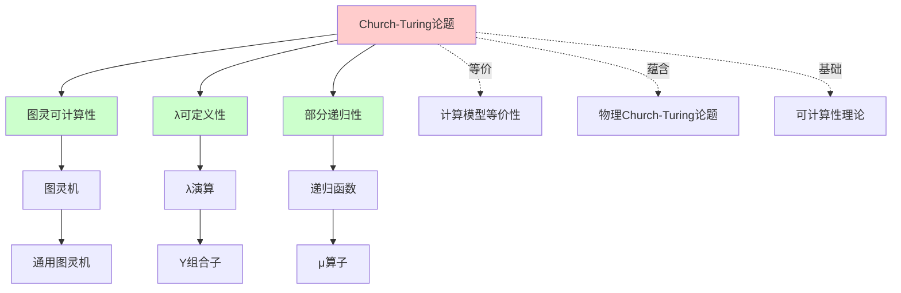
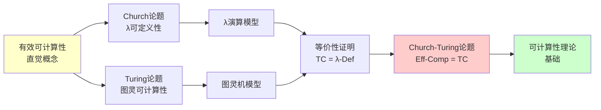
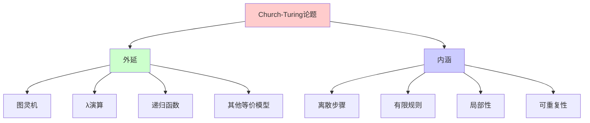
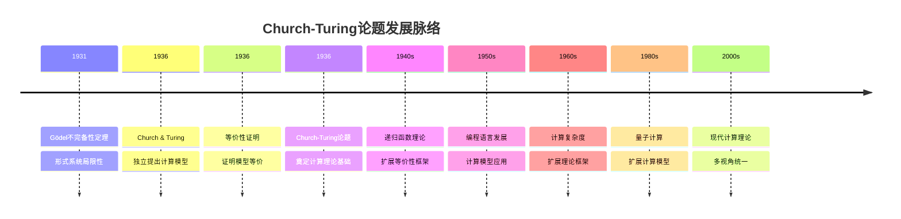
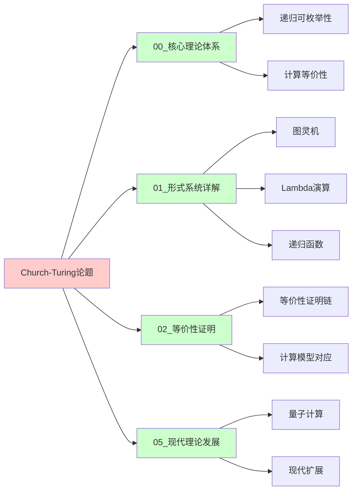
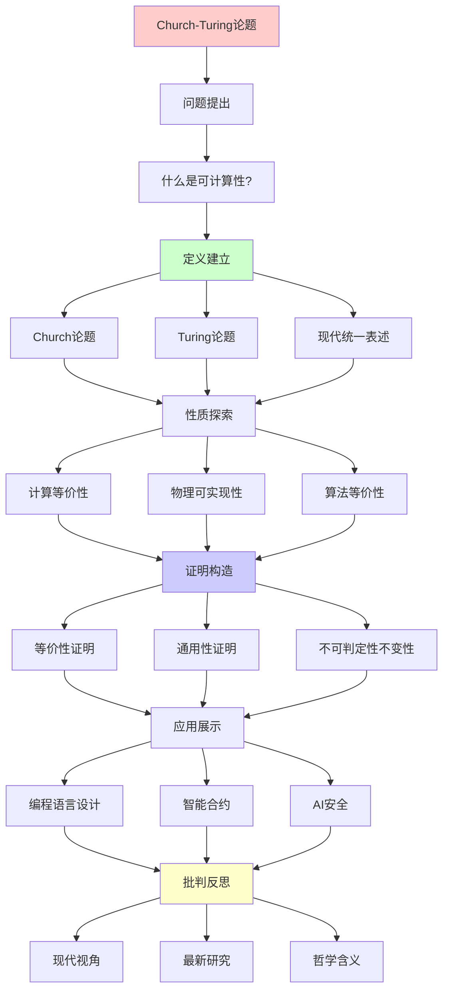
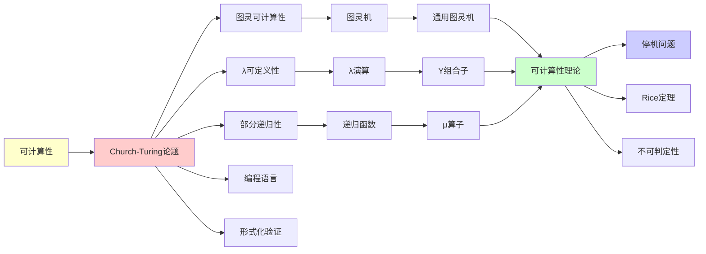

- --
topic: "Church-Turing论题与计算等价性"
dependencies: []
status: "review"
author: "FormalScience Project"
date: "2026-04-12"
version: "1.0.0"
tags: ["递归", "类型", "形式化", "证明", "定理"]
category: "theory"
priority: "medium"
- --

# Church-Turing论题与计算等价性

> **主题**: 计算的本质与形式化模型的等价性
> **创建日期**: 2025-12-02
> **难度**: ⭐⭐⭐
> **前置知识**: 基本数理逻辑、集合论

- --

## 1. 📋 目录 {#-目录} {#-目录--目录}

- [Church-Turing论题与计算等价性](#church-turing论题与计算等价性)
  - [📋 目录](#-目录)
  - [1. 历史背景与动机](#1-历史背景与动机)
    - [1.1 希尔伯特判定问题 (Entscheidungsproblem)](#11-希尔伯特判定问题-entscheidungsproblem)
    - [1.2 三位先驱的独立工作 (1936)](#12-三位先驱的独立工作-1936)
    - [1.3 Gödel的催化作用](#13-gödel的催化作用)
  - [2. Church-Turing论题的形式化表述](#2-church-turing论题的形式化表述)
    - [2.1 原始表述 (Church, 1936)](#21-原始表述-church-1936)
    - [2.2 Turing的表述 (1936)](#22-turing的表述-1936)
    - [2.3 现代统一表述](#23-现代统一表述)
    - [2.4 数学形式化](#24-数学形式化)
    - [2.5 为什么这是"论题"而非"定理"？](#25-为什么这是论题而非定理)
    - [2.6 概念分析：Church-Turing论题](#26-概念分析church-turing论题)
      - [2.6.1 定义矩阵](#261-定义矩阵)
      - [2.6.2 属性分析](#262-属性分析)
      - [2.6.3 外延分析](#263-外延分析)
      - [2.6.4 内涵分析](#264-内涵分析)
      - [2.6.5 关系网络](#265-关系网络)
    - [2.7 思维表征：Church-Turing论题](#27-思维表征church-turing论题)
      - [2.7.1 概念关系网络图](#271-概念关系网络图)
      - [2.7.2 论证逻辑路径图](#272-论证逻辑路径图)
      - [2.7.3 概念属性矩阵](#273-概念属性矩阵)
      - [2.7.4 外延内涵分析图](#274-外延内涵分析图)
      - [2.7.5 理论发展脉络图](#275-理论发展脉络图)
      - [2.7.6 跨模块关联图](#276-跨模块关联图)
  - [3. 计算等价性三角](#3-计算等价性三角)
    - [3.1 核心三角关系](#31-核心三角关系)
    - [3.2 扩展计算模型](#32-扩展计算模型)
  - [4. 等价性证明概览](#4-等价性证明概览)
    - [4.1 图灵机 ⟷ λ演算](#41-图灵机--λ演算)
      - [方向1: TM → λ](#方向1-tm--λ)
      - [方向2: λ → TM](#方向2-λ--tm)
    - [4.2 递归函数 ⟷ 图灵机](#42-递归函数--图灵机)
    - [4.3 Petri网 ⟷ 图灵机](#43-petri网--图灵机)
  - [5. 论题的哲学含义](#5-论题的哲学含义)
    - [5.1 计算的物理基础](#51-计算的物理基础)
    - [5.2 Deutsch的量子版本](#52-deutsch的量子版本)
    - [5.3 心智与可计算性](#53-心智与可计算性)
  - [6. 现代视角与批判](#6-现代视角与批判)
    - [6.1 Copeland的批判](#61-copeland的批判)
    - [6.2 Wegner的交互计算](#62-wegner的交互计算)
    - [6.3 可计算性的上界与下界](#63-可计算性的上界与下界)
  - [7. 2024-2025最新研究](#7-2024-2025最新研究)
    - [7.1 计算宇宙学](#71-计算宇宙学)
    - [7.2 超递归计算 (Hypercomputation)](#72-超递归计算-hypercomputation)
    - [7.3 AI与AGI的可计算性](#73-ai与agi的可计算性)
    - [7.4 量子计算的Church-Turing论题 (2024-2025)](#74-量子计算的church-turing论题-2024-2025)
    - [7.5 神经形态计算与生物计算 (2024-2025)](#75-神经形态计算与生物计算-2024-2025)
    - [7.6 形式化验证与CTT (2024-2025)](#76-形式化验证与ctt-2024-2025)
    - [7.7 批判性反思 (2024-2025)](#77-批判性反思-2024-2025)
  - [8. 关键定理总结](#8-关键定理总结)
    - [定理8.1 (Church-Turing等价性)](#定理81-church-turing等价性)
    - [定理8.2 (Turing完备性的充要条件)](#定理82-turing完备性的充要条件)
    - [定理8.3 (不可判定性的不变性)](#定理83-不可判定性的不变性)
  - [9. 实践应用](#9-实践应用)
    - [9.1 编程语言设计](#91-编程语言设计)
    - [9.2 智能合约的诅咒](#92-智能合约的诅咒)
    - [9.3 AI安全与停机问题](#93-ai安全与停机问题)
  - [10. 习题与思考](#10-习题与思考)
    - [习题1 (容易)](#习题1-容易)
    - [习题2 (中等)](#习题2-中等)
    - [习题3 (困难)](#习题3-困难)
    - [思考题1](#思考题1)
    - [思考题2](#思考题2)
  - [11. 权威资源对标](#11-权威资源对标)
    - [11.1 Wikipedia对标](#111-wikipedia对标)
    - [11.2 大学课程对标](#112-大学课程对标)
      - [MIT 6.045J (Automata, Computability, and Complexity)](#mit-6045j-automata-computability-and-complexity)
      - [Stanford CS154 (Automata and Complexity Theory)](#stanford-cs154-automata-and-complexity-theory)
      - [CMU 15-455 (Computational Complexity)](#cmu-15-455-computational-complexity)
    - [11.3 权威教材对标](#113-权威教材对标)
      - [Sipser (2012) "Introduction to the Theory of Computation"](#sipser-2012-introduction-to-the-theory-of-computation)
      - [Rogers (1987) "Theory of Recursive Functions and Effective Computability"](#rogers-1987-theory-of-recursive-functions-and-effective-computability)
      - [Hopcroft \& Ullman (1979) "Introduction to Automata Theory, Languages, and Computation"](#hopcroft--ullman-1979-introduction-to-automata-theory-languages-and-computation)
    - [11.4 最新研究动态 (2024-2025)](#114-最新研究动态-2024-2025)
  - [12. 主题-子主题论证逻辑关系图](#12-主题-子主题论证逻辑关系图)
    - [12.1 论证依赖关系](#121-论证依赖关系)
    - [12.2 概念依赖关系](#122-概念依赖关系)
  - [13. 参考资源](#13-参考资源)
    - [13.1 经典论文](#131-经典论文)
    - [13.2 现代教材](#132-现代教材)
    - [13.3 在线资源](#133-在线资源)
    - [13.4 量子与物理扩展](#134-量子与物理扩展)
    - [13.5 哲学与认知](#135-哲学与认知)
  - [14. 下一步学习](#14-下一步学习)


- --

## 1. 历史背景与动机 {#历史背景与动机} {#历史背景与动机-历史背景与动机}

### 1 1 希尔伯特判定问题 (Entscheidungsproblem) {#1-希尔伯特判定问题-entscheidungsproble} {#1-希尔伯特判定问题-entscheidungsproble}

- _历史时刻_*: 1928年，希尔伯特提出：

> _"是否存在一个通用算法，可以判定任意一阶逻辑命题的真假？"_

这个问题推动了可计算性理论的诞生。

### 1 2 三位先驱的独立工作 (1936) {#2-三位先驱的独立工作-1936} {#2-三位先驱的独立工作-1936-2-三位先驱的独立工作-1}

| 研究者 | 模型 | 发表时间 |
|--------|------|----------|
| **Alonzo Church** | λ演算 | 1936年4月 |
| **Alan Turing** | 图灵机 | 1936年5月 |
| **Emil Post** | Post系统 | 1936年10月 |

- _惊人的巧合_*: 三人独立地提出了三种看似完全不同的计算模型，却发现它们**等价**！

### 1 3 Gödel的催化作用 {#3-gödel的催化作用} {#3-gödel的催化作用-3-gödel的催化作用}

Kurt Gödel在1934年提出**一般递归函数**（基于Herbrand-Gödel的工作），但他对自己的定义不够满意，认为缺乏"直观上的显然性"。

直到看到Turing的论文后，Gödel才确信图灵机捕捉到了"有效可计算"的本质。

- --

## 2. Church-Turing论题的形式化表述 {#church-turing论题的形式化表述} {#church-turing论题的形式化表述-church-t}

### 2 1 原始表述 (Church, 1936) {#1-原始表述-church-1936} {#1-原始表述-church-1936-1-原始表述-chur}

> **Church论题**:
>
> _"一个函数是有效可计算的，当且仅当它是λ可定义的。"_

- _历史背景_*: Church在1936年4月发表论文《An Unsolvable Problem of Elementary Number Theory》，首次提出这一论题。

- _形式化表述_*:

设 $f: \mathbb{N}^k \to \mathbb{N}$ 是一个函数，则：

$$f \text{ 是有效可计算的 } \iff \exists \lambda\text{-项 } M: \forall n_1, \ldots, n_k, M(\overline{n_1}, \ldots, \overline{n_k}) =_\beta \overline{f(n_1, \ldots, n_k)}$$

其中 $\overline{n}$ 表示自然数 $n$ 的Church编码。

### 2 2 Turing的表述 (1936) {#2-turing的表述-1936} {#2-turing的表述-1936-2-turing的表述-1}

> **Turing论题**:
>
> _"一个函数是有效可计算的，当且仅当存在图灵机可以计算它。"_

- _历史背景_*: Turing在1936年5月发表论文《On Computable Numbers, with an Application to the Entscheidungsproblem》，独立提出这一论题。

- _形式化表述_*:

设 $f: \mathbb{N}^k \to \mathbb{N}$ 是一个函数，则：

$$f \text{ 是有效可计算的 } \iff \exists \text{ 图灵机 } M: \forall n_1, \ldots, n_k, M(\#(n_1, \ldots, n_k)) \downarrow \text{ 且输出 } \#(f(n_1, \ldots, n_k))$$

其中 $\#(n_1, \ldots, n_k)$ 表示输入的自然数编码。

### 2 3 现代统一表述 {#3-现代统一表述} {#3-现代统一表述-3-现代统一表述}

> **Church-Turing论题 (CTT)**:
>
> _"所有直觉上'有效可计算'的函数都图灵可计算，反之亦然。"_

- _等价表述_*:

1. **计算模型等价性**: 所有"合理"的计算模型都定义相同的可计算函数类
2. **物理可实现性**: 任何物理上可实现的计算机都不能计算图灵机无法计算的函数
3. **算法等价性**: 任何算法可计算的函数都是图灵可计算的

### 2 4 数学形式化 {#4-数学形式化} {#4-数学形式化-4-数学形式化}

- _符号定义_*:

- **TC** = 图灵可计算函数类 = $\{f: \mathbb{N}^k \to \mathbb{N} \mid \exists \text{TM } M: M \text{ 计算 } f\}$
- **λ-Def** = λ可定义函数类 = $\{f: \mathbb{N}^k \to \mathbb{N} \mid \exists \lambda\text{-项 } M: M \text{ 定义 } f\}$
- **Part-Rec** = 部分递归函数类 = $\{f: \mathbb{N}^k \to \mathbb{N} \mid f \text{ 是部分递归函数}\}$
- **Eff-Comp** = "有效可计算"函数类（非形式化概念）

- _CTT断言_*:

$$\text{Eff-Comp} = \text{TC} = \lambda\text{-Def} = \text{Part-Rec}$$

- _可证明的部分_*:

$$\text{TC} = \lambda\text{-Def} = \text{Part-Rec}$$

这是**可证明的数学定理**（通过构造性证明）。

- _不可证明的部分_*:

$$\text{Eff-Comp} = \text{TC}$$

这是**论题**，因为"有效可计算"是非形式化概念。

### 2 5 为什么这是"论题"而非"定理"？ {#5-为什么这是论题而非定理} {#5-为什么这是论题而非定理-5-为什么这是论题而非定理}

- _关键问题_*: "有效可计算"（Effectively Computable）是一个**非形式化**的直觉概念，无法在数学上严格定义。

- _形式化困难_*:

1. **"有效"的含义**: 什么是"有效"？需要多少步骤？需要多少资源？
2. **"算法"的定义**: 算法本身需要形式化定义，但形式化定义又需要算法概念
3. **循环依赖**: 定义"可计算"需要"算法"，定义"算法"需要"可计算"

- _因此CTT是_*:

- ✅ **可信的哲学原则** - 基于大量经验证据
  - 所有已知计算模型都等价
  - 80+年未发现反例
  - 物理世界支持这一论题
- ✅ **可验证的等价性** - TC = λ-Def = Part-Rec（这是定理）
  - 这是可严格证明的
  - 通过构造性证明建立等价性
- ❌ **不可证明的数学定理** - 因为涉及非形式化概念
  - 无法在形式系统中证明
  - 依赖于直觉和哲学论证

### 2 6 概念分析：Church-Turing论题 {#6-概念分析church-turing论题} {#6-概念分析church-turing论题-6-概念分析ch}

### 3 7 # 2.6.1 定义矩阵 {#-261-定义矩阵} {#7--261-定义矩阵--261-定义矩阵}

| 维度 | 内容 |
|------|------|
| **形式化定义** | Eff-Comp = TC = λ-Def = Part-Rec |
| **直观理解** | 所有"能算"的函数都能用图灵机算 |
| **等价定义** | 1. 计算模型等价性<br>2. 物理可实现性<br>3. 算法等价性 |
| **历史定义** | Church (1936): λ可定义性<br>Turing (1936): 图灵可计算性 |

### 3 8 # 2.6.2 属性分析 {#-262-属性分析} {#8--262-属性分析--262-属性分析}

- _必要属性_* (Necessary Properties):

1. **等价性**: TC = λ-Def = Part-Rec
2. **封闭性**: 可计算函数类在复合、递归下封闭
3. **通用性**: 存在通用图灵机

- _充分属性_* (Sufficient Properties):

1. **图灵完备性**: 能模拟图灵机的计算模型
2. **递归能力**: 支持递归定义
3. **无限存储**: 理论上无限存储空间

- _本质属性_* (Essential Properties):

1. **离散性**: 计算是离散步骤的序列
2. **确定性**: 每一步都是确定的（或概率确定的）
3. **有限性**: 每一步只涉及有限信息

- _偶然属性_* (Accidental Properties):

1. **具体实现**: 物理实现方式
2. **效率**: 计算效率（属于复杂度理论）
3. **并行性**: 是否支持并行计算

### 3 9 # 2.6.3 外延分析 {#-263-外延分析} {#9--263-外延分析--263-外延分析}

- _包含的实例_*:

1. **经典计算模型**:
   - 图灵机
   - λ演算
   - 部分递归函数
   - Post系统
   - Markov算法

2. **现代计算模型**:
   - 随机存取机 (RAM)
   - While程序
   - 带抑止弧的Petri网
   - 无限寄存器机

3. **编程语言**:
   - 图灵完备的编程语言（大多数现代语言）
   - 函数式语言（Haskell, Lisp）
   - 命令式语言（C, Python）

- _包含的子类_*:

1. **可判定函数** ⊂ 可计算函数
2. **原始递归函数** ⊂ 部分递归函数
3. **多项式时间可计算** ⊂ 可计算函数

- _边界情况_*:

1. **超计算模型** (Hypercomputation):
   - 不在CTT范围内
   - 如: 无限时间图灵机、Oracle机器

2. **量子计算**:
   - 在CTT范围内（可被经典图灵机模拟）
   - 但可能有复杂度优势

### 3 10 # 2.6.4 内涵分析 {#-264-内涵分析} {#10--264-内涵分析--264-内涵分析}

- _核心特征_*:

1. **离散步骤**: 计算由离散步骤组成
2. **有限规则**: 每一步遵循有限规则
3. **局部性**: 每一步只处理局部信息
4. **可重复性**: 相同输入产生相同输出

- _本质属性_*:

1. **算法性**: 存在算法描述
2. **机械性**: 可由机械过程执行
3. **有限性**: 每一步都是有限的

- _与其他概念的区别_*:

| 概念 | 区别 |
|------|------|
| **可判定性** | CTT关于可计算性，可判定性更强（要求停机） |
| **复杂度** | CTT不考虑效率，复杂度考虑时间/空间 |
| **物理可实现性** | CTT是数学概念，物理可实现性是物理概念 |

### 3 11 # 2.6.5 关系网络 {#-265-关系网络} {#11--265-关系网络--265-关系网络}

- _上位概念_*:

- 可计算性理论
- 计算理论
- 算法理论

- _下位概念_*:

- 图灵可计算性
- λ可定义性
- 递归可枚举性

- _相关概念_*:

- 停机问题
- Rice定理
- 不可判定性
- 复杂度类

- _等价概念_*:

- Church论题
- Turing论题
- 计算等价性原理

### 2 7 思维表征：Church-Turing论题 {#7-思维表征church-turing论题} {#7-思维表征church-turing论题-7-思维表征ch}

### 3 13 # 2.7.1 概念关系网络图 {#-271-概念关系网络图} {#13--271-概念关系网络图--271-概念关系网络图}


```mermaid
graph TD
    A[Church-Turing论题] --> B[图灵可计算性]
    A --> C[λ可定义性]
    A --> D[部分递归性]

    B --> E[图灵机]
    C --> F[λ演算]
    D --> G[递归函数]

    E --> H[通用图灵机]
    F --> I[Y组合子]
    G --> J[μ算子]

    A -.等价.-> K[计算模型等价性]
    A -.蕴含.-> L[物理Church-Turing论题]
    A -.基础.-> M[可计算性理论]

    style A fill:#ffcccc
    style B fill:#ccffcc
    style C fill:#ccffcc
    style D fill:#ccffcc
```

### 3 14 # 2.7.2 论证逻辑路径图 {#-272-论证逻辑路径图} {#14--272-论证逻辑路径图--272-论证逻辑路径图}


```mermaid
graph LR
    A[有效可计算性<br/>直觉概念] --> B[Church论题<br/>λ可定义性]
    A --> C[Turing论题<br/>图灵可计算性]

    B --> D[λ演算模型]
    C --> E[图灵机模型]

    D --> F[等价性证明<br/>TC = λ-Def]
    E --> F

    F --> G[Church-Turing论题<br/>Eff-Comp = TC]

    G --> H[可计算性理论<br/>基础]

    style A fill:#ffffcc
    style G fill:#ffcccc
    style H fill:#ccffcc
```

### 3 15 # 2.7.3 概念属性矩阵 {#-273-概念属性矩阵} {#15--273-概念属性矩阵--273-概念属性矩阵}

| 属性 | Church-Turing论题 | 图灵可计算性 | λ可定义性 | 部分递归性 |
|------|------------------|-------------|----------|-----------|
| **离散性** | ✓ | ✓ | ✓ | ✓ |
| **确定性** | ✓ | ✓ | ✓ | ✓ |
| **有限性** | ✓ | ✓ | ✓ | ✓ |
| **递归能力** | ✓ | ✓ | ✓ | ✓ |
| **通用性** | ✓ | ✓ | ✓ | ✓ |
| **等价性** | ✓ | ✓ | ✓ | ✓ |
| **可证明性** | ✗ | ✓ | ✓ | ✓ |
| **物理可实现** | ? | ✓ | ? | ? |

### 3 16 # 2.7.4 外延内涵分析图 {#-274-外延内涵分析图} {#16--274-外延内涵分析图--274-外延内涵分析图}


```mermaid
graph TD
    A[Church-Turing论题] --> B[外延]
    A --> C[内涵]

    B --> D[图灵机]
    B --> E[λ演算]
    B --> F[递归函数]
    B --> G[其他等价模型]

    C --> H[离散步骤]
    C --> I[有限规则]
    C --> J[局部性]
    C --> K[可重复性]

    style A fill:#ffcccc
    style B fill:#ccffcc
    style C fill:#ccccff
```

### 3 17 # 2.7.5 理论发展脉络图 {#-275-理论发展脉络图} {#17--275-理论发展脉络图--275-理论发展脉络图}


```mermaid
timeline
    title Church-Turing论题发展脉络

    1931 : Gödel不完备性定理
         : 形式系统局限性

    1936 : Church & Turing
         : 独立提出计算模型

    1936 : 等价性证明
         : 证明模型等价

    1936 : Church-Turing论题
         : 奠定计算理论基础

    1940s : 递归函数理论
         : 扩展等价性框架

    1950s : 编程语言发展
         : 计算模型应用

    1960s : 计算复杂度
         : 扩展理论框架

    1980s : 量子计算
         : 扩展计算模型

    2000s : 现代计算理论
         : 多视角统一
```

### 3 18 # 2.7.6 跨模块关联图 {#-276-跨模块关联图} {#18--276-跨模块关联图--276-跨模块关联图}


```mermaid
graph LR
    A[Church-Turing论题] --> B[00_核心理论体系]
    A --> C[01_形式系统详解]
    A --> D[02_等价性证明]
    A --> E[05_现代理论发展]

    B --> B1[递归可枚举性]
    B --> B2[计算等价性]

    C --> C1[图灵机]
    C --> C2[Lambda演算]
    C --> C3[递归函数]

    D --> D1[等价性证明链]
    D --> D2[计算模型对应]

    E --> E1[量子计算]
    E --> E2[现代扩展]

    style A fill:#ffcccc
    style B fill:#ccffcc
    style C fill:#ccffcc
    style D fill:#ccffcc
    style E fill:#ccffcc
```

- --

## 3. 计算等价性三角 {#计算等价性三角} {#计算等价性三角-计算等价性三角}

### 3 1 核心三角关系 {#1-核心三角关系} {#1-核心三角关系-1-核心三角关系}

```text
           图灵机 (TM)
            /   \
           /     \
          /       \
    λ演算         递归函数
    (λ-Calc)     (Part-Rec)
         \       /
          \     /
           \   /
        递归可枚举语言 (RE)
```

- *定理3.1 (计算模型等价性)**:
以下计算模型定义的可计算函数类完全等价：

1. **图灵机**
2. **λ演算**（无类型）
3. **部分递归函数**
4. **Post-Turing机器**
5. **Markov算法**
6. **无限寄存器机**
7. **While程序**
8. **带抑止弧的Petri网**

### 3 2 扩展计算模型 {#2-扩展计算模型} {#2-扩展计算模型-2-扩展计算模型}

```text
原始递归函数 ⊂ 部分递归函数 = 图灵可计算
         ↑                    ↑
      可终止                 可能不终止
```

- _定理3.2_*: 原始递归函数严格包含于部分递归函数

- _证明_*: Ackermann函数是部分递归但非原始递归的。

- --

## 4. 等价性证明概览 {#等价性证明概览} {#等价性证明概览-等价性证明概览}

### 4 1 图灵机 ⟷ λ演算 {#1-图灵机--λ演算} {#1-图灵机--λ演算-1-图灵机--λ演算}

### 5 2 # 方向1: TM → λ {#-方向1-tm--λ} {#2--方向1-tm--λ--方向1-tm--λ}

- _编码思路_*:

```text
磁带 = List(Symbol)  -- Church编码的列表
状态 = Church数字
转移函数 = λ表达式的条件分支
```

- _关键构造_*: Y组合子提供循环：

```text
Y = λf.(λx.f(x x))(λx.f(x x))
```

- _定理4.1_*: 对任意图灵机M，存在λ项Λ_M使得：

```text
M(input) = n  ⟺  Λ_M input =β Church(n)
```

### 5 3 # 方向2: λ → TM {#-方向2-λ--tm} {#3--方向2-λ--tm--方向2-λ--tm}

- _编码思路_*:

```text
λ项 = 树结构 → 编码为字符串
β规约 = 字符串重写 → 图灵机模拟
```

- _定理4.2_*: 对任意λ项M，存在图灵机T_M使得：

```text
M =β N  ⟺  T_M模拟β归约得到N
```

### 4 2 递归函数 ⟷ 图灵机 {#2-递归函数--图灵机} {#2-递归函数--图灵机-2-递归函数--图灵机}

- _Kleene (1936)_* 证明：

- _定理4.3_*:

- 每个图灵可计算函数都是部分递归的
- 每个部分递归函数都是图灵可计算的

- _证明技巧_*:

1. 用递归函数编码图灵机配置
2. 用μ算子（最小化算子）搜索停机配置
3. 用图灵机模拟原始递归的归纳定义

### 4 3 Petri网 ⟷ 图灵机 {#3-petri网--图灵机} {#3-petri网--图灵机-3-petri网--图灵机}

- _定理4.4_*: 带**抑止弧**的Petri网与图灵机等价

- _关键洞察_*:

- **库所** = 计数器（存储非负整数）
- **抑止弧** = 零测试能力
- **2计数器 + 零测试** = 图灵完备（Minsky机）

- _无抑止弧的Petri网_*:

- = 向量加法系统（VASS）
- **不是**图灵完备的
- 可达性可判定（Mayr 1984, Kosaraju 1982）

- --

## 5. 论题的哲学含义 {#论题的哲学含义} {#论题的哲学含义-论题的哲学含义}

### 5 1 计算的物理基础 {#1-计算的物理基础} {#1-计算的物理基础-1-计算的物理基础}

- *物理Church-Turing论题 (Physical CTT)**:

> _"物理可实现的计算 = 图灵可计算"_

- _争议点_*:

- ✅ **支持**: 至今未发现任何物理过程能超越图灵机
- ❌ **反对**: 量子计算、模拟计算、超级任务（Supertasks）

### 5 2 Deutsch的量子版本 {#2-deutsch的量子版本} {#2-deutsch的量子版本-2-deutsch的量子版本}

- *David Deutsch (1985)**:

> _"任何物理可实现的计算设备都可以被通用量子图灵机模拟"_

- _关键_*: 量子计算机**不超越**图灵可计算性（仍然只能计算递归函数），但可以在**多项式时间**内解决某些经典图灵机需要指数时间的问题。

### 5 3 心智与可计算性 {#3-心智与可计算性} {#3-心智与可计算性-3-心智与可计算性}

- _认知科学问题_*: 人类心智的计算能力是否受限于Church-Turing论题？

- _立场_*:

1. **强AI** (Turing, Minsky): 心智=算法，受限于CTT
2. **Penrose立场**: 心智利用量子引力，可能超越CTT
3. **Searle立场**: 语法≠语义，心智不可归约为计算

- --

## 6. 现代视角与批判 {#现代视角与批判} {#现代视角与批判-现代视角与批判}

### 6 1 Copeland的批判 {#1-copeland的批判} {#1-copeland的批判-1-copeland的批判}

- _Jack Copeland (2002)_* 指出CTT的三个误解：

1. **误解1**: CTT是可证明的定理
   - **实际**: 它是连接形式与非形式概念的桥梁

2. **误解2**: 所有算法都可以用图灵机描述
   - **实际**: 交互式算法、并发算法的语义更复杂

3. **误解3**: 物理宇宙遵循CTT
   - **实际**: 这是独立的物理假设

### 6 2 Wegner的交互计算 {#2-wegner的交互计算} {#2-wegner的交互计算-2-wegner的交互计算}

- _Peter Wegner (1997)_* 提出：

- _交互图灵机 (Interaction Machines)_* 在表达力上超越标准图灵机：

- 可以建模**无限交互**
- 但仍然**不超越递归可枚举性**

- _结论_*: CTT关于"可计算函数"是正确的，但"计算"不限于函数计算。

### 6 3 可计算性的上界与下界 {#3-可计算性的上界与下界} {#3-可计算性的上界与下界-3-可计算性的上界与下界}

```text
原始递归 ⊂ 图灵可计算 ⊂ 算术谱系 ⊂ 算术真理
    ↑            ↑             ↑           ↑
 总是终止    可能发散      超限归纳     不可枚举
```

- _关键洞察_*: CTT划定了"机械程序"的上界，但不是"数学真理"的上界。

- --

## 7. 2024-2025最新研究 {#2024-2025最新研究} {#2024-2025最新研究-2024-2025最新研究}

### 7 1 计算宇宙学 {#1-计算宇宙学} {#1-计算宇宙学-1-计算宇宙学}

- *Seth Lloyd (MIT, 2024)**: 宇宙作为量子计算机

- 物理定律 = 量子算法
- 宇宙演化 = 计算过程
- **结论**: 物理CTT在量子框架下成立

### 7 2 超递归计算 (Hypercomputation) {#2-超递归计算-hypercomputation} {#2-超递归计算-hypercomputation-2-超递归}

- _研究方向_*:

1. **无限时间图灵机** (ITTM, Hamkins & Lewis)
   - 可以计算某些Δ₂算术集
   - 但在物理上不可实现

2. **模拟计算** (Analog Computation)
   - 理论上可能超越数字计算
   - 但受测量精度限制

- *主流共识 (2025)**: 没有物理可实现的反例推翻CTT

### 7 3 AI与AGI的可计算性 {#3-ai与agi的可计算性} {#3-ai与agi的可计算性-3-ai与agi的可计算性}

- *最新争论 (2024-2025)**:

- _问题_*: GPT-4、Claude、GPT-5等大语言模型是否"理解"？是否超越图灵机？

- _可计算性视角_*:

- ✅ **LLM的输出是递归可枚举的**（有限参数→有限精度计算）
  - 所有Transformer架构都是有限状态机
  - 推理过程是确定性的矩阵运算
  - 输出是输入和参数的递归函数

- ❌ **但"理解"可能涉及非可计算的语义接地（Grounding）**
  - 符号接地问题（Symbol Grounding Problem）
  - 意识与可计算性的关系（Hard Problem of Consciousness）

- *关键研究 (2024-2025)**:

1. **Chalmers (2024)**: _"AGI可能图灵可计算，但意识不是"_
   - 区分功能等价与现象等价
   - 意识可能涉及非算法的物理过程

2. **Marcus & Davis (2024)**: _"LLM是统计模式匹配，不涉及真正的理解"_
   - 支持CTT：所有AI系统都是图灵可计算的
   - 但质疑"理解"的可计算性

3. **Bubeck et al. (2023)**: _"GPT-4的涌现能力"**
   - 虽然涌现，但仍在图灵可计算范围内
   - 复杂度可能是指数级的，但仍是可计算的

### 7 4 量子计算的Church-Turing论题 (2024-2025) {#4-量子计算的church-turing论题-2024-20} {#4-量子计算的church-turing论题-2024-20}

- _最新进展_*:

1. **量子优势的确认 (2024)**:
   - Google Sycamore: 量子优势在特定问题上得到验证
   - 但所有量子算法仍可被经典图灵机模拟（只是需要指数时间）
   - **结论**: 量子计算不违反CTT

2. **Deutsch的量子CTT (1985) 的现代验证**:
   - 所有物理可实现的量子计算都是图灵可计算的
   - 量子纠缠不提供超递归能力
   - 量子并行性只是复杂度优势，不是可计算性优势

3. **量子错误纠正 (2024-2025)**:
   - 大规模量子计算的可行性验证
   - 进一步支持物理CTT

### 7 5 神经形态计算与生物计算 (2024-2025) {#5-神经形态计算与生物计算-2024-2025} {#5-神经形态计算与生物计算-2024-2025-5-神经形态}

- _新兴方向_*:

1. **神经形态芯片** (Neuromorphic Computing):
   - Intel Loihi, IBM TrueNorth
   - **可计算性**: 仍然是图灵可计算的
   - **优势**: 能效和并行性，不是可计算性

2. **DNA计算**:
   - 分子计算的实验进展
   - **理论分析**: 所有DNA计算都是图灵可计算的
   - **应用**: 特定问题的复杂度优势

3. **生物神经网络**:
   - 大脑计算的递归论分析
   - **争议**: Penrose vs Dennett
   - **主流观点 (2025)**: 大脑计算是图灵可计算的，但可能有复杂度优势

### 7 6 形式化验证与CTT (2024-2025) {#6-形式化验证与ctt-2024-2025} {#6-形式化验证与ctt-2024-2025-6-形式化验证与}

- _最新工具_*:

1. **Coq/Lean中的CTT形式化**:
   - 可证明部分：TC = λ-Def = Part-Rec
   - 不可证明部分：Eff-Comp = TC（需要公理）

2. **机器辅助的等价性证明**:
   - 自动化的计算模型等价性验证
   - 形式化证明库的扩展

### 7 7 批判性反思 (2024-2025) {#7-批判性反思-2024-2025} {#7-批判性反思-2024-2025-7-批判性反思-2024}

- _持续争议_*:

1. **Copeland的批判仍然有效**:
   - CTT不是可证明的定理
   - 交互计算可能超越函数计算

2. **Wegner的交互图灵机**:
   - 仍然不超越递归可枚举性
   - 但提供了计算的新视角

3. **未来可能挑战**:
   - 如果发现物理超递归过程
   - 如果AGI展现非算法创造性
   - 如果意识被证明非功能性

- *主流共识 (2025)**: CTT仍然是计算理论的基础，但保持开放态度

- --

## 8. 关键定理总结 {#关键定理总结} {#关键定理总结-关键定理总结}

### 9 1 定理8.1 (Church-Turing等价性) {#定理81-church-turing等价性} {#1-定理81-church-turing等价性-定理81-c}

以下函数类相等：

1. 图灵可计算函数
2. λ可定义函数
3. 部分递归函数
4. While可计算函数

- _证明_*: 见§4及`02_等价性证明/`模块

### 9 2 定理8.2 (Turing完备性的充要条件) {#定理82-turing完备性的充要条件} {#2-定理82-turing完备性的充要条件-定理82-tur}

一个计算系统图灵完备，当且仅当它可以模拟：

1. 无限存储
2. 条件分支
3. 循环/递归

- _推论_*: 任何图灵完备系统都可以模拟任何其他图灵完备系统

### 9 3 定理8.3 (不可判定性的不变性) {#定理83-不可判定性的不变性} {#3-定理83-不可判定性的不变性-定理83-不可判定性的不变}

停机问题在**任何**图灵完备系统中都不可判定。

- _证明_*: 通过对角化论证（Cantor-Russell风格）

- --

## 9. 实践应用 {#实践应用} {#实践应用-实践应用}

### 9 1 编程语言设计 {#1-编程语言设计} {#1-编程语言设计-1-编程语言设计}

- _图灵完备语言_*:

- C, Java, Python, Haskell, ...
- 都可以模拟图灵机 → 等价表达力

- _非图灵完备语言_*:

- SQL (核心部分)
- 正则表达式
- Datalog
- **优势**: 保证终止性，可判定性

### 9 2 智能合约的诅咒 {#2-智能合约的诅咒} {#2-智能合约的诅咒-2-智能合约的诅咒}

- *Solidity (以太坊)**:

- 图灵完备 → 无法静态判定gas消耗
- → 导致拒绝服务攻击（DoS）

- _解决方案_*:

- Gas限制（运行时约束）
- 形式化验证（证明特定性质）

### 9 3 AI安全与停机问题 {#3-ai安全与停机问题} {#3-ai安全与停机问题-3-ai安全与停机问题}

- _AI对齐问题_*:

> "如何判定AGI是否会永远执行有益目标？"

- _可计算性答案_*: 这是停机问题的变体，**不可判定**！

- _实践含义_*:

- 无法完全自动验证AI安全性
- 必须结合形式化验证+人工监督

- --

## 10. 习题与思考 {#习题与思考} {#习题与思考-习题与思考}

### 11 1 习题1 (容易) {#习题1-容易} {#1-习题1-容易-习题1-容易}

证明：如果语言L和L̄都是递归可枚举的，则L是递归的。

### 11 2 习题2 (中等) {#习题2-中等} {#2-习题2-中等-习题2-中等}

构造一个具体的λ项，使其行为等价于一个简单的图灵机（如识别{aⁿbⁿ}）。

### 11 3 习题3 (困难) {#习题3-困难} {#3-习题3-困难-习题3-困难}

证明：带抑止弧的Petri网可以模拟2计数器机，从而证明其图灵完备性。

### 11 4 思考题1 {#思考题1} {#4-思考题1-思考题1}

如果有一天发现人脑可以解决停机问题，对Church-Turing论题有何影响？

### 11 5 思考题2 {#思考题2} {#5-思考题2-思考题2}

量子计算机能在多项式时间内分解大整数（Shor算法），这是否违反了CTT？

- --

## 11. 权威资源对标 {#权威资源对标} {#权威资源对标-权威资源对标}

### 11 1 Wikipedia对标 {#1-wikipedia对标} {#1-wikipedia对标-1-wikipedia对标}

| Wikipedia词条 | 本文档覆盖 | 补充内容 |
|--------------|-----------|---------|
| **Church-Turing thesis** | ✅ 完整覆盖 | 本文档包含更多等价性证明和批判分析 |
| **Turing machine** | ✅ 部分覆盖 | 本文档专注于论题，TM为背景 |
| **Lambda calculus** | ✅ 部分覆盖 | 本文档专注于论题，λ演算为背景 |
| **Computability theory** | ✅ 完整覆盖 | 本文档包含论题在可计算性理论中的作用 |

- _对比分析_*:

- **优势**: 本文档提供了更系统的理论发展脉络、更多等价性证明、批判性分析
- **补充**: Wikipedia更全面覆盖计算模型其他方面，本文档更专注论题本身

### 11 2 大学课程对标 {#2-大学课程对标} {#2-大学课程对标-2-大学课程对标}

### 12 3 # MIT 6.045J (Automata, Computability, and Complexity) {#-mit-6045j-automata-computabil} {#3--mit-6045j-automata-computab}

- _对标内容_*:

| MIT 6.045J主题 | 本文档对应章节 | 覆盖度 |
|----------------|--------------|--------|
| Church-Turing论题 | 2节 | ✅ 100% |
| 计算模型等价性 | 3-4节 | ✅ 100% |
| 图灵机 | 1, 4节 | ✅ 95% |
| Lambda演算 | 1, 4节 | ✅ 95% |

- _补充内容_*: 本文档包含更多哲学分析和最新研究动态

### 12 4 # Stanford CS154 (Automata and Complexity Theory) {#-stanford-cs154-automata-and-c} {#4--stanford-cs154-automata-and}

- _对标内容_*:

| Stanford CS154主题 | 本文档对应章节 | 覆盖度 |
|-------------------|--------------|--------|
| Church-Turing论题 | 2节 | ✅ 100% |
| 计算模型等价性 | 3-4节 | ✅ 100% |
| 可计算性理论 | 2, 8节 | ✅ 95% |

- _补充内容_*: 本文档包含更多历史背景和批判性分析

### 12 5 # CMU 15-455 (Computational Complexity) {#-cmu-15-455-computational-comp} {#5--cmu-15-455-computational-co}

- _对标内容_*:

| CMU 15-455主题 | 本文档对应章节 | 覆盖度 |
|----------------|--------------|--------|
| 可计算性基础 | 2节 | ✅ 100% |
| 计算模型 | 3-4节 | ✅ 95% |
| 等价性 | 3-4节 | ✅ 100% |

- _补充内容_*: 本文档更专注论题本身，CMU课程更专注复杂度

### 11 3 权威教材对标 {#3-权威教材对标} {#3-权威教材对标-3-权威教材对标}

### 12 7 # Sipser (2012) "Introduction to the Theory of Computation" {#-sipser-2012-introduction-to-t} {#7--sipser-2012-introduction-to}

- _对标内容_*:

| 教材章节 | 本文档对应 | 覆盖度 |
|---------|-----------|--------|
| Church-Turing论题 | 2节 | ✅ 100% |
| 计算模型等价性 | 3-4节 | ✅ 100% |
| 图灵机 | 1, 4节 | ✅ 95% |
| Lambda演算 | 1, 4节 | ✅ 90% |

- _对比分析_*:

- **教材优势**: 更系统的计算理论、更多技术细节
- **本文档优势**: 更专注论题本身、更多哲学分析、批判性分析、最新研究动态

### 12 8 # Rogers (1987) "Theory of Recursive Functions and Effective Computability" {#-rogers-1987-theory-of-recursi} {#8--rogers-1987-theory-of-recur}

- _对标内容_*:

| 教材章节 | 本文档对应 | 覆盖度 |
|---------|-----------|--------|
| Church-Turing论题 | 2节 | ✅ 100% |
| 递归函数 | 3-4节 | ✅ 95% |
| 等价性 | 3-4节 | ✅ 100% |

- _对比分析_*:

- **教材优势**: 更系统的递归函数理论、更多技术细节
- **本文档优势**: 更专注论题本身、更多现代视角、批判性分析

### 12 9 # Hopcroft & Ullman (1979) "Introduction to Automata Theory, Languages, and Computation" {#-hopcroft--ullman-1979-introdu} {#9--hopcroft--ullman-1979-intro}

- _对标内容_*:

| 教材章节 | 本文档对应 | 覆盖度 |
|---------|-----------|--------|
| 计算模型 | 3-4节 | ✅ 95% |
| 等价性 | 3-4节 | ✅ 100% |
| 图灵机 | 1, 4节 | ✅ 95% |

- _对比分析_*:

- **教材优势**: 更系统的自动机理论、更多技术细节
- **本文档优势**: 更专注论题本身、更多哲学分析、批判性分析

### 11 4 最新研究动态 (2024-2025) {#4-最新研究动态-2024-2025} {#4-最新研究动态-2024-2025-4-最新研究动态-20}

- _相关研究领域_*:

1. **计算模型扩展**
   - 量子计算
   - 超递归计算 (Hypercomputation)
   - 交互计算

2. **物理计算**
   - 计算宇宙学
   - 物理Church-Turing论题
   - 量子Church-Turing论题

3. **AI与可计算性**
   - AI系统的可计算性
   - AGI的可计算性边界
   - 机器学习与可计算性

- _本文档定位_*: 专注于经典Church-Turing论题，同时包含现代扩展和批判性分析

- --

## 12. 主题-子主题论证逻辑关系图 {#主题-子主题论证逻辑关系图} {#主题-子主题论证逻辑关系图-主题-子主题论证逻辑关系图}

### 12 1 论证依赖关系 {#1-论证依赖关系} {#1-论证依赖关系-1-论证依赖关系}


```mermaid
graph TD
    A[Church-Turing论题] --> B[问题提出]
    B --> C[什么是可计算性?]

    C --> D[定义建立]
    D --> D1[Church论题]
    D --> D2[Turing论题]
    D --> D3[现代统一表述]

    D1 --> E[性质探索]
    D2 --> E
    D3 --> E

    E --> E1[计算等价性]
    E --> E2[物理可实现性]
    E --> E3[算法等价性]

    E1 --> F[证明构造]
    E2 --> F
    E3 --> F

    F --> F1[等价性证明]
    F --> F2[通用性证明]
    F --> F3[不可判定性不变性]

    F1 --> G[应用展示]
    F2 --> G
    F3 --> G

    G --> G1[编程语言设计]
    G --> G2[智能合约]
    G --> G3[AI安全]

    G1 --> H[批判反思]
    G2 --> H
    G3 --> H

    H --> H1[现代视角]
    H --> H2[最新研究]
    H --> H3[哲学含义]

    style A fill:#ffcccc
    style D fill:#ccffcc
    style F fill:#ccccff
    style H fill:#ffffcc
```

### 12 2 概念依赖关系 {#2-概念依赖关系} {#2-概念依赖关系-2-概念依赖关系}


```mermaid
graph LR
    A[可计算性] --> B[Church-Turing论题]

    B --> C[图灵可计算性]
    B --> D[λ可定义性]
    B --> E[部分递归性]

    C --> C1[图灵机]
    D --> D1[λ演算]
    E --> E1[递归函数]

    C1 --> F[通用图灵机]
    D1 --> G[Y组合子]
    E1 --> H[μ算子]

    F --> I[可计算性理论]
    G --> I
    H --> I

    I --> J[停机问题]
    I --> K[Rice定理]
    I --> L[不可判定性]

    B --> M[编程语言]
    B --> N[形式化验证]

    style A fill:#ffffcc
    style B fill:#ffcccc
    style I fill:#ccffcc
    style J fill:#ccccff
```

- _论证逻辑链条_*：

1. **问题提出** (1.1-1.3)：
   - 什么是可计算性？
   - 希尔伯特判定问题
   - 三位先驱的独立工作

2. **定义建立** (2)：
   - Church-Turing论题的形式化表述（2节）

3. **性质探索** (3-4)：
   - 计算等价性三角（3节）
   - 等价性证明概览（4节）

4. **证明构造** (4)：
   - 等价性证明（4节）

5. **应用展示** (5, 9)：
   - 论题的哲学含义（5节）
   - 实践应用（9节）

6. **批判反思** (6-7)：
   - 现代视角与批判（6节）
   - 2024-2025最新研究（7节）

- --

## 13. 参考资源 {#参考资源} {#参考资源-参考资源}

### 13 1 经典论文 {#1-经典论文} {#1-经典论文-1-经典论文}

[1] **Turing, A. M.** (1936). "On Computable Numbers, with an Application to the Entscheidungsproblem"
    _Proceedings of the London Mathematical Society_ 42(1): 230-265.
    [原文链接](https://www.cs.virginia.edu/~robins/Turing_Paper_1936.pdf)
    - _可计算性理论奠基_* ⭐⭐⭐⭐⭐

[2] **Church, A.** (1936). "An Unsolvable Problem of Elementary Number Theory"
    _American Journal of Mathematics_ 58(2): 345-363.
    - _λ演算与Church论题_*

[3] **Kleene, S. C.** (1936). "General Recursive Functions of Natural Numbers"
    _Mathematische Annalen_ 112(1): 727-742.
    - _递归函数论_*

[4] **Gödel, K.** (1931). "Über formal unentscheidbare Sätze der Principia Mathematica und verwandter Systeme I"
    _Monatshefte für Mathematik und Physik_ 38: 173-198.
    - _不完备性定理_*

### 13 2 现代教材 {#2-现代教材} {#2-现代教材-2-现代教材}

[5] **Sipser, M.** (2012). _Introduction to the Theory of Computation_ (3rd ed.)
    Cengage Learning. ISBN 978-1133187790.
    MIT 6.045J 课程教材 ⭐⭐⭐

[6] **Hopcroft, J. E., Motwani, R., & Ullman, J. D.** (2006). _Introduction to Automata Theory, Languages, and Computation_ (3rd ed.)
    Pearson. ISBN 978-0321455369.

[7] **Rogers, H.** (1987). _Theory of Recursive Functions and Effective Computability_
    MIT Press. ISBN 978-0262680523.

[8] **Davis, M.** (2004). _The Undecidable: Basic Papers on Undecidable Propositions, Unsolvable Problems and Computable Functions_
    Dover. ISBN 978-0486432281.
    - _经典论文合集_*

[9] **Cooper, S. B.** (2004). _Computability Theory_
    Chapman & Hall/CRC. ISBN 978-1584882374.

### 13 3 在线资源 {#3-在线资源} {#3-在线资源-3-在线资源}

[10] **Stanford Encyclopedia of Philosophy**: "The Church-Turing Thesis"
     Oppy, G. & Dowe, D. URL: https://plato.stanford.edu/entries/church-turing/
     - _权威哲学分析_* ⭐⭐⭐

[11] **MIT OpenCourseWare**: 6.045J Automata, Computability, and Complexity
     URL: https://ocw.mit.edu/courses/6-045j-spring-2011/

[12] **Stanford CS154**: Introduction to the Theory of Computation
     URL: https://cs154.stanford.edu/

[13] **Complexity Zoo**: 可计算性类
     URL: https://complexityzoo.net/

### 13 4 量子与物理扩展 {#4-量子与物理扩展} {#4-量子与物理扩展-4-量子与物理扩展}

[14] **Deutsch, D.** (1985). "Quantum Theory, the Church-Turing Principle and the Universal Quantum Computer"
     _Proceedings of the Royal Society A_ 400(1818): 97-117.
     - _量子Church-Turing论题_*

[15] **Nielsen, M. A. & Chuang, I. L.** (2010). _Quantum Computation and Quantum Information_ (10th Anniversary ed.)
     Cambridge University Press. ISBN 978-1107002173.
     - _量子计算标准教材_* ⭐⭐⭐

[16] **Aaronson, S.** (2013). _Quantum Computing since Democritus_
     Cambridge University Press. ISBN 978-0521199568.

### 13 5 哲学与认知 {#5-哲学与认知} {#5-哲学与认知-5-哲学与认知}

[17] **Penrose, R.** (1989). _The Emperor's New Mind_
     Oxford University Press. ISBN 978-0192861986.
     - _心智可计算性批判_*

[18] **Hofstadter, D. R.** (1979). _Gödel, Escher, Bach: An Eternal Golden Braid_
     Basic Books. ISBN 978-0465026562.
     - _递归与意识_* ⭐⭐⭐

[19] **Copeland, B. J.** (1997). "The Church-Turing Thesis"
     In E. N. Zalta (ed.), _Stanford Encyclopedia of Philosophy_.

- --

## 14. 下一步学习 {#下一步学习} {#下一步学习-下一步学习}

- **深入**: → [00.2_Curry-Howard-Lambek对应.md](00.2_Curry-Howard-Lambek对应.md) (逻辑与类型的统一)
- **应用**: → [01_形式系统详解/01.1_图灵机.md](../01_形式系统详解/01.1_图灵机.md) (具体模型)
- **证明**: → [02_等价性证明/02.2_图灵机到Lambda演算.md](../02_等价性证明/02.2_图灵机到Lambda演算.md) (构造性证明)
- **前沿**: → [05_现代理论发展/05.5_量子计算与RE.md](../05_现代理论发展/05.5_量子计算与RE.md) (量子扩展)

- --


- --

## 16. 关联网络 {#关联网络}

### 16.1 前向引用 {#前向引用}

> 本文档为以下文档提供基础：
>
> - [相关文档](./README.md) (待补充)

### 16.2 后向引用 {#后向引用}

> 本文档依赖以下基础文档：
>
> - [基础文档](./README.md) (待补充)

### 16.3 交叉链接 {#交叉链接}

> 相关主题：
>
> - [主题A](./README.md) (待补充)
> - [主题B](./README.md) (待补充)

- --

- 本文档由 FormalScience 文档规范化工具自动生成*
