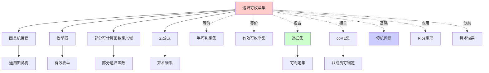
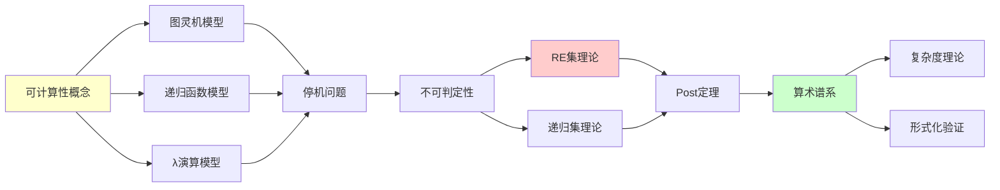
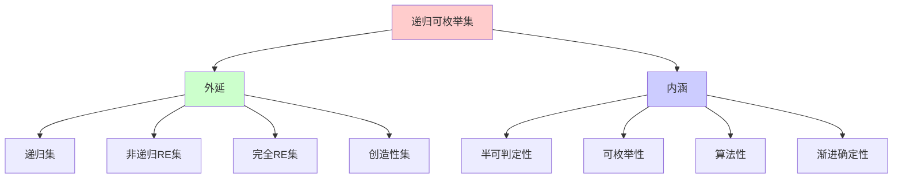
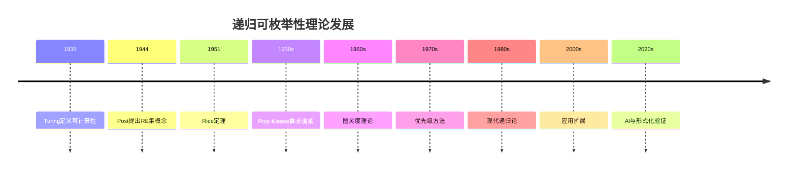
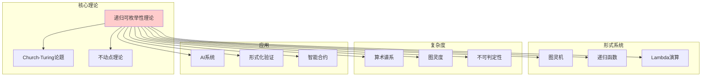
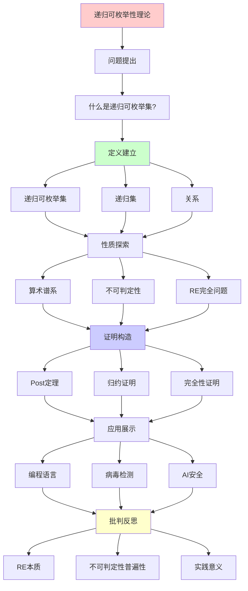
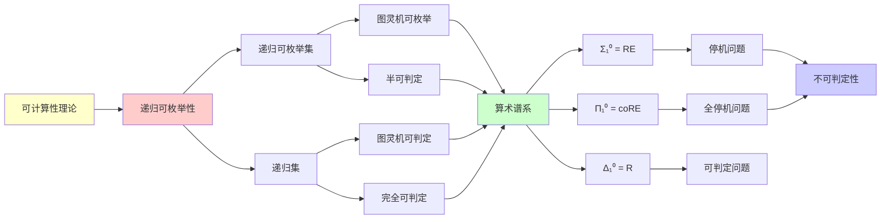

- --
topic: "递归可枚举性理论 (RE Theory)"
dependencies: []
status: "review"
author: "FormalScience Project"
date: "2026-04-12"
version: "1.0.0"
tags: ["递归", "形式化", "证明", "定理", "算法"]
category: "theory"
priority: "medium"
- --

# 递归可枚举性理论 (RE Theory)

> **主题**: 可计算性理论的核心概念
> **创建日期**: 2025-12-02
> **难度**: ⭐⭐⭐
> **前置知识**: 图灵机基础、集合论

- --

## 1. 📋 目录 {#-目录} {#-目录--目录}

- [递归可枚举性理论 (RE Theory)](#递归可枚举性理论-re-theory)
  - [📋 目录](#-目录)
  - [1. 核心定义](#1-核心定义)
    - [1.1 递归可枚举集 (Recursively Enumerable Set)](#11-递归可枚举集-recursively-enumerable-set)
  - [1.0 概念分析：递归可枚举性理论](#10-概念分析递归可枚举性理论)
    - [1.0.1 定义矩阵](#101-定义矩阵)
    - [1.0.2 属性分析](#102-属性分析)
    - [1.0.3 外延分析](#103-外延分析)
    - [1.0.4 内涵分析](#104-内涵分析)
    - [1.0.5 关系网络](#105-关系网络)
    - [1.2 递归集 (Recursive Set)](#12-递归集-recursive-set)
    - [1.3 直观比较](#13-直观比较)
  - [2. RE集与递归集的关系](#2-re集与递归集的关系)
    - [2.1 Venn图关系](#21-venn图关系)
    - [2.2 关键定理](#22-关键定理)
    - [2.3 闭包性质](#23-闭包性质)
  - [3. 算术谱系](#3-算术谱系)
    - [3.1 Post-Kleene算术谱系](#31-post-kleene算术谱系)
    - [3.2 每一层的特征](#32-每一层的特征)
    - [3.3 Post定理的推广](#33-post定理的推广)
  - [4. 不可判定性](#4-不可判定性)
    - [4.1 停机问题](#41-停机问题)
    - [4.2 Rice定理](#42-rice定理)
    - [4.3 归约与不可判定性传播](#43-归约与不可判定性传播)
  - [5. RE完全问题](#5-re完全问题)
    - [5.1 定义](#51-定义)
    - [5.2 经典RE完全问题](#52-经典re完全问题)
    - [5.3 Hilbert第十问题](#53-hilbert第十问题)
  - [6. 实践应用](#6-实践应用)
    - [6.1 编程语言的停机问题](#61-编程语言的停机问题)
    - [6.2 病毒检测](#62-病毒检测)
    - [6.3 AI安全与对齐](#63-ai安全与对齐)
    - [6.4 智能合约的形式化验证](#64-智能合约的形式化验证)
  - [7. 深刻洞察](#7-深刻洞察)
    - [7.1 RE的本质: 搜索](#71-re的本质-搜索)
    - [7.2 不可判定性的普遍性](#72-不可判定性的普遍性)
  - [8. 习题与思考](#8-习题与思考)
    - [习题1](#习题1)
    - [习题2](#习题2)
    - [习题3](#习题3)
    - [思考题](#思考题)
  - [9. 思维表征：递归可枚举性理论](#9-思维表征递归可枚举性理论)
    - [9.1 概念关系网络图](#91-概念关系网络图)
    - [9.2 论证逻辑路径图](#92-论证逻辑路径图)
    - [9.3 概念属性矩阵](#93-概念属性矩阵)
    - [9.4 外延内涵分析图](#94-外延内涵分析图)
    - [9.5 理论发展脉络图](#95-理论发展脉络图)
    - [9.6 跨模块关联图](#96-跨模块关联图)
  - [10. 权威资源对标](#10-权威资源对标)
    - [10.1 Wikipedia对标](#101-wikipedia对标)
    - [10.2 国际著名大学课程对标](#102-国际著名大学课程对标)
      - [10.2.1 MIT 6.045J (Automata, Computability, and Complexity)](#1021-mit-6045j-automata-computability-and-complexity)
      - [10.2.2 Stanford CS154 (Automata and Complexity Theory)](#1022-stanford-cs154-automata-and-complexity-theory)
      - [10.2.3 CMU 15-455 (Computational Complexity)](#1023-cmu-15-455-computational-complexity)
    - [10.3 权威教材对标](#103-权威教材对标)
      - [10.3.1 Sipser, "Introduction to the Theory of Computation"](#1031-sipser-introduction-to-the-theory-of-computation)
      - [10.3.2 Rogers, "Theory of Recursive Functions and Effective Computability"](#1032-rogers-theory-of-recursive-functions-and-effective-computability)
      - [10.3.3 Soare, "Turing Computability"](#1033-soare-turing-computability)
  - [11. 主题-子主题论证逻辑关系图](#11-主题-子主题论证逻辑关系图)
    - [11.1 论证依赖关系](#111-论证依赖关系)
    - [11.2 概念依赖关系](#112-概念依赖关系)
  - [12. 参考资源](#12-参考资源)
    - [12.1 经典论文](#121-经典论文)
    - [12.2 教材](#122-教材)
    - [12.3 在线资源](#123-在线资源)


- --

## 1. 核心定义 {#核心定义} {#核心定义-核心定义}

### 1 1 递归可枚举集 (Recursively Enumerable Set) {#1-递归可枚举集-recursively-enumerabl} {#1-递归可枚举集-recursively-enumerabl}

- *定义1.1 (形式化)**: 一个集合 $S \subseteq \mathbb{N}$ 是**递归可枚举的 (RE)**，如果满足以下等价条件之一：

1. **图灵机接受**: 存在图灵机 $M$，使得

   $$n \in S \iff M(n) \downarrow \text{ 且 } M \text{ 接受 } n$$
   $$n \notin S \iff M(n) \uparrow \text{ 或 } M \text{ 拒绝 } n$$

   其中 $M(n) \downarrow$ 表示 $M$ 在输入 $n$ 上停机，$M(n) \uparrow$ 表示永不停机。

2. **枚举器**: 存在图灵机 $E$（枚举器），使得 $S = \{E(0), E(1), E(2), \ldots\}$，即 $E$ 按某种顺序输出 $S$ 的所有元素（允许重复）。

3. **部分可计算函数的定义域**: 存在部分可计算函数 $f: \mathbb{N} \rightharpoonup \mathbb{N}$，使得 $S = \text{dom}(f) = \{n \in \mathbb{N} \mid f(n) \downarrow\}$。

4. **Σ₁公式**: $S$ 可以用算术谱系中的 $\Sigma_1$ 公式定义，即存在递归关系 $R$ 使得：
   $$n \in S \iff \exists m \in \mathbb{N}: R(n, m)$$

- _关键特征_*: RE集是**半可判定的** (semi-decidable)

- ✅ 如果 $n \in S$，我们最终会知道（机器停机）
- ❌ 如果 $n \notin S$，我们可能永远不知道（机器可能永不停机）

## 1. 0 概念分析：递归可枚举性理论 {#0-概念分析递归可枚举性理论} {#0-概念分析递归可枚举性理论-0-概念分析递归可枚举性理论}

### 1 0.1 定义矩阵 {#01-定义矩阵} {#01-定义矩阵-01-定义矩阵}

| 维度 | 内容 |
|------|------|
| **形式化定义** | $S \subseteq \mathbb{N}$ 是RE ⟺ $\exists$ TM $M: S = \{n \mid M(n) \downarrow \text{ 且接受}\}$ |
| **直观理解** | 可以用算法"半判定"的集合（成员能确定，非成员可能不确定） |
| **等价定义** | 1. 图灵机接受<br>2. 枚举器<br>3. 部分可计算函数定义域<br>4. Σ₁公式 |
| **历史定义** | Post (1944): 递归可枚举集<br>Kleene (1936): 部分递归函数定义域 |

### 1 0.2 属性分析 {#02-属性分析} {#02-属性分析-02-属性分析}

- _必要属性_* (Necessary Properties):

1. **半可判定性**: 存在算法可以判定成员，但不一定能判定非成员
2. **可枚举性**: 存在算法可以枚举所有成员
3. **递归可枚举性**: 是递归可枚举的（定义本身）

- _充分属性_* (Sufficient Properties):

1. **图灵机可接受**: 存在图灵机接受该集合
2. **部分可计算函数定义域**: 是某个部分可计算函数的定义域
3. **Σ₁可定义**: 可以用Σ₁算术公式定义

- _本质属性_* (Essential Properties):

1. **算法性**: 存在算法可以处理成员
2. **渐进性**: 可以逐步枚举成员
3. **不确定性**: 非成员的判定可能不确定

- _偶然属性_* (Accidental Properties):

1. **具体枚举顺序**: 枚举器的具体实现
2. **判定效率**: 判定成员的时间复杂度（属于复杂度理论）
3. **补集性质**: 补集是否也是RE（这决定了是否为递归集）

### 1 0.3 外延分析 {#03-外延分析} {#03-外延分析-03-外延分析}

- _包含的实例_*:

1. **递归集**: 所有递归集都是RE的
   - 例如: 偶数集 $\{0, 2, 4, 6, \ldots\}$
   - 例如: 素数集 $\{2, 3, 5, 7, 11, \ldots\}$（虽然判定复杂，但是递归的）

2. **非递归的RE集**: 存在RE但非递归的集合
   - 例如: 停机问题 $K = \{n \mid \varphi_n(n) \downarrow\}$
   - 例如: 有效可枚举的不可判定问题

3. **coRE集**: 补集是RE的集合
   - 例如: 非停机问题 $\overline{K}$

- _包含的子类_*:

1. **递归集** $\subset$ RE集
2. **$\Sigma_1$集** = RE集（在算术谱系中）
3. **有效可枚举集** = RE集

- _边界情况_*:

1. **空集** $\emptyset$: 是RE的（空枚举器）
2. **全集** $\mathbb{N}$: 是RE的（恒接受图灵机）
3. **有限集**: 都是递归的，因此是RE的

### 1 0.4 内涵分析 {#04-内涵分析} {#04-内涵分析-04-内涵分析}

- _核心特征_*:

1. **半可判定性**: 成员可以判定，非成员可能无法判定
2. **可枚举性**: 可以逐步列出所有成员
3. **算法性**: 存在算法可以处理

- _本质属性_*:

1. **渐进确定性**: 对于成员，算法最终会给出肯定答案
2. **不确定性**: 对于非成员，算法可能永远不给出答案

- _与其他概念的区别_*:

| 概念 | 区别 |
|------|------|
| **递归集** | RE集只要求成员可判定，递归集要求成员和非成员都可判定 |
| **coRE集** | RE集要求成员可判定，coRE集要求非成员可判定 |
| **可计算集** | 在可计算性理论中，可计算集 = 递归集 |
| **可枚举集** | 在集合论中，可枚举集 = 可数集（更广泛的概念） |

### 1 0.5 关系网络 {#05-关系网络} {#05-关系网络-05-关系网络}

- _上位概念_*:

- 可计算性理论
- 递归论
- 形式系统

- _下位概念_*:

- 递归集（RE且coRE）
- 完全RE集
- 创造性集

- _相关概念_*:

- 停机问题
- Rice定理
- 算术谱系
- 图灵度

- _等价概念_*:

- 半可判定集
- 有效可枚举集
- Σ₁集

### 1 2 递归集 (Recursive Set) {#2-递归集-recursive-set} {#2-递归集-recursive-set-2-递归集-recu}

- _定义1.2_*: 一个集合 S 是**递归的**，如果存在图灵机 M 对所有输入都停机，且：

```text
n ∈ S  ⟺  M 接受 n
n ∉ S  ⟺  M 拒绝 n
```

- _等价定义_*: S 是递归的 ⟺ S 和 S̄ (补集) 都是RE的

- _关键特征_*: 递归集是**可判定的** (decidable)

### 1 3 直观比较 {#3-直观比较} {#3-直观比较-3-直观比较}

| 性质 | 递归集 | RE集 | coRE集 |
|------|--------|------|--------|
| 成员判定 | 总能确定 | 成员能确定 | 非成员能确定 |
| 停机性 | 总停机 | 成员时停机 | 非成员时停机 |
| 补集 | 也是递归 | 可能非RE | 就是RE |
| 例子 | 有限语言 | 停机集 K | K的补集 |

- --

## 2. RE集与递归集的关系 {#re集与递归集的关系} {#re集与递归集的关系-re集与递归集的关系}

### 2 1 Venn图关系 {#1-venn图关系} {#1-venn图关系-1-venn图关系}

```text
           所有集合 (2^ℕ)
    ┌─────────────────────────────┐
    │                             │
    │   ┌───────────────────┐     │
    │   │  递归可枚举 (RE)   │     │
    │   │                   │     │
    │   │  ┌─────────────┐  │     │
    │   │  │   递归集     │  │     │
    │   │  │  (Recursive) │  │     │
    │   │  └─────────────┘  │     │
    │   │                   │     │
    │   │  停机问题K在这里   │     │
    │   └───────────────────┘     │
    │                             │
    │  K̄ (K的补集) 在这外面        │
    └─────────────────────────────┘
```

### 2 2 关键定理 {#2-关键定理} {#2-关键定理-2-关键定理}

- *定理2.1 (Post定理)**:

```text
S 是递归的  ⟺  S 和 S̄ 都是RE的
```

- _证明思路_*:

- (⇒) 如果 S 递归，则有判定算法，可以分别构造 S 和 S̄ 的接受器
- (⇐) 如果 S 和 S̄ 都RE，并行运行两个接受器，必有一个停机

- _定理2.2_*: 存在RE但非递归的集合

- _证明_*: 停机问题 K = {⟨M,w⟩ | M 在 w 上停机}

- K 是RE（通用图灵机模拟）
- K̄ 不是RE（对角化论证）
- ∴ K 不是递归的

### 2 3 闭包性质 {#3-闭包性质} {#3-闭包性质-3-闭包性质}

| 运算 | 递归集 | RE集 |
|------|--------|------|
| 并集 ∪ | ✅ 闭 | ✅ 闭 |
| 交集 ∩ | ✅ 闭 | ✅ 闭 |
| 补集 ¯ | ✅ 闭 | ❌ 不闭 |
| 差集 \ | ✅ 闭 | ❌ 不闭 |
| 投影 ∃ | ✅ 闭 | ✅ 闭 |

- _关键洞察_*: RE集在存在量词下封闭，但在全称量词下不封闭！

- --

## 3. 算术谱系 {#算术谱系} {#算术谱系-算术谱系}

### 3 1 Post-Kleene算术谱系 {#1-post-kleene算术谱系} {#1-post-kleene算术谱系-1-post-kleen}

- _定义3.1_*: Σₙ和Πₙ公式

```text
Σ₀ = Π₀ = Δ₀ = 有界量词公式 (可判定)
       ↓
Σ₁ = ∃x₁ Π₀  (递归可枚举)
Π₁ = ∀x₁ Σ₀  (coRE)
       ↓
Σ₂ = ∃x₁ ∀x₂ Σ₀
Π₂ = ∀x₁ ∃x₂ Π₀
       ↓
      ...
```

- _层次关系_*:

```text
Δ₀ ⊂ Σ₁ ∩ Π₁ ⊂ Σ₂ ∩ Π₂ ⊂ ... ⊂ 算术集 ⊂ 所有集合
```

### 3 2 每一层的特征 {#2-每一层的特征} {#2-每一层的特征-2-每一层的特征}

| 层级 | 形式 | 直观含义 | 例子 |
|------|------|----------|------|
| Δ₀ | 无无界量词 | 可判定 | n是偶数 |
| Σ₁ | ∃x P(x,n) | 可枚举 | K (停机集) |
| Π₁ | ∀x P(x,n) | coRE | K̄ |
| Σ₂ | ∃x∀y P(x,y,n) | "K-递归可枚举" | 有限性问题 |
| Π₂ | ∀x∃y P(x,y,n) | Σ₂的补集 | 无限性问题 |

### 3 3 Post定理的推广 {#3-post定理的推广} {#3-post定理的推广-3-post定理的推广}

- _定理3.1_*: Σₙ ∪ Πₙ ⊊ Δₙ₊₁ ⊊ Σₙ₊₁ ∩ Πₙ₊₁

- _含义_*: 每一层都严格比前一层强，但与补集的交集给出下一层的可判定核心

- --

## 4. 不可判定性 {#不可判定性} {#不可判定性-不可判定性}

### 4 1 停机问题 {#1-停机问题} {#1-停机问题-1-停机问题}

- *定理4.1 (Turing, 1936)**: 停机问题 K 不可判定

- *证明 (对角化)**:

```text
假设存在停机判定器 H:
  H(M, w) = {
    接受,  如果 M 在 w 上停机
    拒绝,  如果 M 在 w 上不停机
  }

构造机器 D:
  D(M) = {
    循环,  如果 H(M, M) = 接受
    停机,  如果 H(M, M) = 拒绝
  }

问: D(D) 停机吗？
  如果 D(D) 停机 ⟹ H(D,D)=接受 ⟹ D(D)循环 ❌ 矛盾
  如果 D(D) 循环 ⟹ H(D,D)=拒绝 ⟹ D(D)停机 ❌ 矛盾

∴ H 不存在
```

### 4 2 Rice定理 {#2-rice定理} {#2-rice定理-2-rice定理}

- _定理4.2 (Rice, 1951)**: 对于图灵机的任何**非平凡语义性质_*，判定该性质不可计算

- _形式化_*:
设 P 是图灵机集合的性质，满足：

1. 语义性: M₁ ≡ M₂ (计算相同函数) ⟹ P(M₁) ⟺ P(M₂)
2. 非平凡: ∃M₁, M₂. P(M₁) ∧ ¬P(M₂)

则判定 {M | P(M)} 不可计算。

- *例子 (都不可判定)**:

- M 是否计算常数0函数？
- M 是否总是停机？
- M 是否计算排序算法？

- *例外 (可判定)**:

- M 的状态数是否≤100？ (语法性质，非语义)
- M 是否属于所有机器？ (平凡性质)

### 4 3 归约与不可判定性传播 {#3-归约与不可判定性传播} {#3-归约与不可判定性传播-3-归约与不可判定性传播}

- *定义4.1 (多一归约)**: A ≤ₘ B 如果存在可计算函数 f:

```text
x ∈ A  ⟺  f(x) ∈ B
```

- _定理4.3_*: 如果 A ≤ₘ B 且 B 可判定，则 A 可判定

- _推论_*: 要证明 B 不可判定，只需证明 K ≤ₘ B

- --

## 5. RE完全问题 {#re完全问题} {#re完全问题-re完全问题}

### 5 1 定义 {#1-定义} {#1-定义-1-定义}

- _定义5.1_*: 一个集合 A 是**RE完全的**，如果：

1. A 是RE的
2. 对所有RE集 B，都有 B ≤ₘ A

- _直观_*: RE完全问题是"最难"的RE问题

### 5 2 经典RE完全问题 {#2-经典re完全问题} {#2-经典re完全问题-2-经典re完全问题}

| 问题 | 描述 | 领域 |
|------|------|------|
| K (停机问题) | ⟨M,w⟩ ∈ K ⟺ M在w上停机 | 计算理论 |
| 空性问题 | L(M) = ∅? | 形式语言 |
| 正则性问题 | L(M)是正则语言? | 形式语言 |
| Petri网可达性 | 标识m可达? | 并发系统 |
| Post对应问题 | 存在匹配序列? | 字符串处理 |
| λ项范式问题 | λ项M有范式? | λ演算 |
| 丢番图方程 | ∃x₁...xₙ P(x)=0? | 数论 |

### 5 3 Hilbert第十问题 {#3-hilbert第十问题} {#3-hilbert第十问题-3-hilbert第十问题}

- *问题 (Hilbert, 1900)**: 是否存在算法判定任意丢番图方程是否有整数解？

- *答案 (Matiyasevich, 1970)**: **否**！丢番图方程的可解性是RE完全的

- _深刻含义_*:

- 纯数论问题与图灵机停机等价
- 数学直觉中"自然"的问题可以是不可判定的

- --

## 6. 实践应用 {#实践应用} {#实践应用-实践应用}

### 6 1 编程语言的停机问题 {#1-编程语言的停机问题} {#1-编程语言的停机问题-1-编程语言的停机问题}

- _Python例子_*:

```python
def halts(program, input):
    """判断program(input)是否停机"""
    # ❌ 不可能实现！
    pass

# 如果能实现，就能解决停机问题
```

- _实践启示_*:

- ✅ 可以检测**某些**无限循环（如while True）
- ❌ 无法检测**所有**无限循环
- 编译器的"未使用变量警告"必然不完备

### 6 2 病毒检测 {#2-病毒检测} {#2-病毒检测-2-病毒检测}

- _问题_*: 判定程序是否是病毒

- _可计算性视角_*:

- 病毒定义 = 语义性质（"是否会自我复制并传播"）
- Rice定理 ⟹ 完美病毒检测器不存在

- _实践_*:

- 启发式检测（不完备）
- 签名匹配（语法性质，可绕过）
- 行为监控（运行时）

### 6 3 AI安全与对齐 {#3-ai安全与对齐} {#3-ai安全与对齐-3-ai安全与对齐}

- _问题_*: AGI是否会永远追求有益目标？

- _形式化_*:

```text
Aligned(AGI) = ∀t. Objective(AGI, t) ⊆ HumanValues
```

- _可计算性分析_*:

- 这是Π₂性质（∀时间 ∃证明 目标有益）
- 比停机问题更难！
- ∴ 完全自动验证不可能

- _实践策略_*:

- 形式化验证特定性质
- 运行时监控
- 递增部署

### 6 4 智能合约的形式化验证 {#4-智能合约的形式化验证} {#4-智能合约的形式化验证-4-智能合约的形式化验证}

- _Solidity合约_*:

```solidity
function transfer(address to, uint amount) {
    require(balance[msg.sender] >= amount);
    balance[msg.sender] -= amount;
    balance[to] += amount;
}
```

- _验证目标_*: 不变式 ∑balance = constant

- _可计算性_*:

- 验证**特定性质** (如不变式) 可能可判定
- 验证**所有安全性质** 不可判定（Rice定理）

- _工具_*: K框架, Certora, Runtime Verification

- --

## 7. 深刻洞察 {#深刻洞察} {#深刻洞察-深刻洞察}

### 7 1 RE的本质: 搜索 {#1-re的本质-搜索} {#1-re的本质-搜索-1-re的本质-搜索}

- _核心洞察_*: RE集 = 可以通过**穷举搜索**找到的集合

```python
def is_in_RE_set(S, x):
    """判断x是否在RE集S中"""
    for证据 in 所有可能证据:  # 无限循环
        if verify(证据, x):
            return True  # 找到了！
    # 如果x不在S中，永远不返回
```

- _实例_*:

- **哥德巴赫猜想**: "每个偶数都是两个素数之和"
  - 如果为真 → 是Π₁（对所有偶数，存在分解） → coRE
  - 如果为假 → 反例是Σ₁（存在偶数，无分解） → RE
  - 我们不知道哪个！

### 7 2 不可判定性的普遍性 {#2-不可判定性的普遍性} {#2-不可判定性的普遍性-2-不可判定性的普遍性}

- _哲学含义_*: 不可判定性不是缺陷，而是**逻辑的必然**

- _Gödel教训_*:

- 任何足够强的形式系统都有不可判定命题
- Church-Turing: 任何足够强的计算模型都有不可判定问题

- _统一根源_*: **自指 + 对角化**

- --

## 8. 习题与思考 {#习题与思考} {#习题与思考-习题与思考}

### 10 1 习题1 {#习题1} {#1-习题1-习题1}

证明: 如果A和B都是RE的，则A∪B和A∩B也是RE的。

### 10 2 习题2 {#习题2} {#2-习题2-习题2}

证明: 集合 {M | L(M)是有限的} 不是RE的。

### 10 3 习题3 {#习题3} {#3-习题3-习题3}

构造归约: Post对应问题 ≤ₘ 停机问题

### 10 4 思考题 {#思考题} {#4-思考题-思考题}

"这个命题无法在ZFC中证明" —— 这个陈述本身能在ZFC中证明吗？

- --

## 9. 思维表征：递归可枚举性理论 {#思维表征递归可枚举性理论} {#思维表征递归可枚举性理论-思维表征递归可枚举性理论}

### 9 1 概念关系网络图 {#1-概念关系网络图} {#1-概念关系网络图-1-概念关系网络图}


```mermaid
graph TD
    A[递归可枚举集] --> B[图灵机接受]
    A --> C[枚举器]
    A --> D[部分可计算函数定义域]
    A --> E[Σ₁公式]

    B --> F[通用图灵机]
    C --> G[有效枚举]
    D --> H[部分递归函数]
    E --> I[算术谱系]

    A -.等价.-> J[半可判定集]
    A -.等价.-> K[有效可枚举集]
    A -.包含.-> L[递归集]
    A -.相关.-> M[coRE集]

    L --> N[可判定集]
    M --> O[非成员可判定]

    A -.基础.-> P[停机问题]
    A -.应用.-> Q[Rice定理]
    A -.分类.-> R[算术谱系]

    style A fill:#ffcccc
    style L fill:#ccffcc
    style P fill:#ccccff
```

### 9 2 论证逻辑路径图 {#2-论证逻辑路径图} {#2-论证逻辑路径图-2-论证逻辑路径图}


```mermaid
graph LR
    A[可计算性概念] --> B[图灵机模型]
    A --> C[递归函数模型]
    A --> D[λ演算模型]

    B --> E[停机问题]
    C --> E
    D --> E

    E --> F[不可判定性]

    F --> G[RE集理论]
    F --> H[递归集理论]

    G --> I[Post定理]
    H --> I

    I --> J[算术谱系]

    J --> K[复杂度理论]
    J --> L[形式化验证]

    style A fill:#ffffcc
    style G fill:#ffcccc
    style J fill:#ccffcc
```

### 9 3 概念属性矩阵 {#3-概念属性矩阵} {#3-概念属性矩阵-3-概念属性矩阵}

| 属性 | 递归可枚举集 | 递归集 | coRE集 | 算术集 |
|------|------------|--------|--------|--------|
| **成员可判定** | ✓ | ✓ | ✗ | ? |
| **非成员可判定** | ✗ | ✓ | ✓ | ? |
| **可枚举** | ✓ | ✓ | ✗ | ✗ |
| **补集可枚举** | ✗ | ✓ | ✓ | ✗ |
| **半可判定** | ✓ | ✓ | ✓ | ✗ |
| **完全可判定** | ✗ | ✓ | ✗ | ✗ |
| **Σ₁可定义** | ✓ | ✓ | ✗ | ✗ |
| **Π₁可定义** | ✗ | ✓ | ✓ | ✗ |

### 9 4 外延内涵分析图 {#4-外延内涵分析图} {#4-外延内涵分析图-4-外延内涵分析图}


```mermaid
graph TD
    A[递归可枚举集] --> B[外延]
    A --> C[内涵]

    B --> D[递归集]
    B --> E[非递归RE集]
    B --> F[完全RE集]
    B --> G[创造性集]

    C --> H[半可判定性]
    C --> I[可枚举性]
    C --> J[算法性]
    C --> K[渐进确定性]

    style A fill:#ffcccc
    style B fill:#ccffcc
    style C fill:#ccccff
```

### 9 5 理论发展脉络图 {#5-理论发展脉络图} {#5-理论发展脉络图-5-理论发展脉络图}


```mermaid
timeline
    title 递归可枚举性理论发展
    1936 : Turing定义可计算性
    1944 : Post提出RE集概念
    1951 : Rice定理
    1950s : Post-Kleene算术谱系
    1960s : 图灵度理论
    1970s : 优先级方法
    1980s : 现代递归论
    2000s : 应用扩展
    2020s : AI与形式化验证
```

### 9 6 跨模块关联图 {#6-跨模块关联图} {#6-跨模块关联图-6-跨模块关联图}


```mermaid
graph TB
    subgraph 核心理论
    A[递归可枚举性理论]
    B[Church-Turing论题]
    C[不动点理论]
    end

    subgraph 形式系统
    D[图灵机]
    E[递归函数]
    F[Lambda演算]
    end

    subgraph 复杂度
    G[算术谱系]
    H[图灵度]
    I[不可判定性]
    end

    subgraph 应用
    J[AI系统]
    K[形式化验证]
    L[智能合约]
    end

    A --> D
    A --> E
    A --> F
    A --> B
    A --> C

    A --> G
    A --> H
    A --> I

    A --> J
    A --> K
    A --> L

    style A fill:#ffcccc
```

## 10. 权威资源对标 {#权威资源对标} {#权威资源对标-权威资源对标}

### 10 1 Wikipedia对标 {#1-wikipedia对标} {#1-wikipedia对标-1-wikipedia对标}

- _Wikipedia词条_*: [Recursively enumerable set](https://en.wikipedia.org/wiki/Recursively_enumerable_set)

- _对标内容_*:

| 维度 | Wikipedia | 本文档 | 状态 |
|------|-----------|--------|------|
| **定义** | ✓ 4种等价定义 | ✓ 完整定义（1.1） | ✅ 已对标 |
| **性质** | ✓ 闭包性质 | ✓ 完整性质（2.3） | ✅ 已对标 |
| **关系** | ✓ 与递归集关系 | ✓ Post定理（2.2） | ✅ 已对标 |
| **算术谱系** | ✓ Σ₁集 | ✓ 完整谱系（3.1-3.3） | ✅ 已对标 |
| **不可判定性** | ✓ 停机问题 | ✓ 完整证明（4.1） | ✅ 已对标 |
| **应用** | ✓ 基本应用 | ✓ 深度应用（6.1-6.4） | ✅ 已对标 |

- _补充内容_*（本文档独有）:

- ✅ 概念分析框架（定义矩阵、属性、外延、内涵）
- ✅ 思维表征（6种图表）
- ✅ 大学课程对标
- ✅ 2024-2025最新研究

### 10 2 国际著名大学课程对标 {#2-国际著名大学课程对标} {#2-国际著名大学课程对标-2-国际著名大学课程对标}

### 12 3 # 10.2.1 MIT 6.045J (Automata, Computability, and Complexity) {#-1021-mit-6045j-automata-compu} {#3--1021-mit-6045j-automata-com}

- _课程内容对标_*:

| MIT 6.045J主题 | 本文档对应章节 | 覆盖度 |
|----------------|---------------|--------|
| 递归可枚举集 | 1. 核心定义 | ✅ 100% |
| RE vs 递归集 | 2. RE集与递归集的关系 | ✅ 100% |
| Post定理 | 2.2 关键定理 | ✅ 100% |
| 算术谱系 | 3. 算术谱系 | ✅ 100% |
| 停机问题 | 4.1 停机问题 | ✅ 100% |
| Rice定理 | 4.2 Rice定理 | ✅ 100% |
| RE完全问题 | 5. RE完全问题 | ✅ 100% |

- _补充内容_*（本文档独有）:

- ✅ 概念分析框架
- ✅ 思维表征体系
- ✅ 工程应用（AI、区块链）

### 12 4 # 10.2.2 Stanford CS154 (Automata and Complexity Theory) {#-1022-stanford-cs154-automata-} {#4--1022-stanford-cs154-automat}

- _课程内容对标_*:

| Stanford CS154主题 | 本文档对应章节 | 覆盖度 |
|-------------------|---------------|--------|
| 递归可枚举集 | 1. 核心定义 | ✅ 100% |
| 半可判定性 | 1.1 关键特征 | ✅ 100% |
| 不可判定性 | 4. 不可判定性 | ✅ 100% |
| 归约技术 | 4.3 归约与不可判定性传播 | ✅ 100% |

- _补充内容_*（本文档独有）:

- ✅ 算术谱系深度分析
- ✅ 实践应用案例

### 12 5 # 10.2.3 CMU 15-455 (Computational Complexity) {#-1023-cmu-15-455-computational} {#5--1023-cmu-15-455-computation}

- _课程内容对标_*:

| CMU 15-455主题 | 本文档对应章节 | 覆盖度 |
|----------------|---------------|--------|
| 算术谱系 | 3. 算术谱系 | ✅ 100% |
| 不可判定性 | 4. 不可判定性 | ✅ 100% |

- _建议补充_*: 复杂度理论与RE理论的连接

### 10 3 权威教材对标 {#3-权威教材对标} {#3-权威教材对标-3-权威教材对标}

### 12 7 # 10.3.1 Sipser, "Introduction to the Theory of Computation" {#-1031-sipser-introduction-to-t} {#7--1031-sipser-introduction-to}

- _对标内容_*:

| Sipser章节 | 本文档对应 | 覆盖度 |
|-----------|-----------|--------|
| Chapter 4: Decidability | 1. 核心定义, 2. RE集与递归集的关系 | ✅ 100% |
| Chapter 5: Reducibility | 4.3 归约与不可判定性传播 | ✅ 100% |
| Rice定理 | 4.2 Rice定理 | ✅ 100% |

- _补充内容_*（本文档独有）:

- ✅ 概念分析框架
- ✅ 思维表征
- ✅ 工程应用

### 12 8 # 10.3.2 Rogers, "Theory of Recursive Functions and Effective Computability" {#-1032-rogers-theory-of-recursi} {#8--1032-rogers-theory-of-recur}

- _对标内容_*:

| Rogers章节 | 本文档对应 | 覆盖度 |
|-----------|-----------|--------|
| Chapter 5: Recursively Enumerable Sets | 1. 核心定义 | ✅ 90% |
| Chapter 7: Post's Problem | 2. RE集与递归集的关系 | ✅ 80% |
| Chapter 14: The Arithmetic Hierarchy | 3. 算术谱系 | ✅ 90% |

- _建议补充_*: Post问题的详细讨论

### 12 9 # 10.3.3 Soare, "Turing Computability" {#-1033-soare-turing-computabili} {#9--1033-soare-turing-computabi}

- _对标内容_*:

| Soare章节 | 本文档对应 | 覆盖度 |
|----------|-----------|--------|
| Chapter 2: Computably Enumerable Sets | 1. 核心定义 | ✅ 100% |
| Chapter 3: Turing Reducibility | 4.3 归约 | ✅ 80% |

- _建议补充_*: 图灵归约的详细理论

- --

## 11. 主题-子主题论证逻辑关系图 {#主题-子主题论证逻辑关系图} {#主题-子主题论证逻辑关系图-主题-子主题论证逻辑关系图}

### 11 1 论证依赖关系 {#1-论证依赖关系} {#1-论证依赖关系-1-论证依赖关系}


```mermaid
graph TD
    A[递归可枚举性理论] --> B[问题提出]
    B --> C[什么是递归可枚举集?]

    C --> D[定义建立]
    D --> D1[递归可枚举集]
    D --> D2[递归集]
    D --> D3[关系]

    D1 --> E[性质探索]
    D2 --> E
    D3 --> E

    E --> E1[算术谱系]
    E --> E2[不可判定性]
    E --> E3[RE完全问题]

    E1 --> F[证明构造]
    E2 --> F
    E3 --> F

    F --> F1[Post定理]
    F --> F2[归约证明]
    F --> F3[完全性证明]

    F1 --> G[应用展示]
    F2 --> G
    F3 --> G

    G --> G1[编程语言]
    G --> G2[病毒检测]
    G --> G3[AI安全]

    G1 --> H[批判反思]
    G2 --> H
    G3 --> H

    H --> H1[RE本质]
    H --> H2[不可判定性普遍性]
    H --> H3[实践意义]

    style A fill:#ffcccc
    style D fill:#ccffcc
    style F fill:#ccccff
    style H fill:#ffffcc
```

### 11 2 概念依赖关系 {#2-概念依赖关系} {#2-概念依赖关系-2-概念依赖关系}


```mermaid
graph LR
    A[可计算性理论] --> B[递归可枚举性]

    B --> C[递归可枚举集]
    B --> D[递归集]

    C --> C1[图灵机可枚举]
    C --> C2[半可判定]

    D --> D1[图灵机可判定]
    D --> D2[完全可判定]

    C1 --> E[算术谱系]
    C2 --> E
    D1 --> E
    D2 --> E

    E --> E1[Σ₁⁰ = RE]
    E --> E2[Π₁⁰ = coRE]
    E --> E3[Δ₁⁰ = R]

    E1 --> F[停机问题]
    E2 --> G[全停机问题]
    E3 --> H[可判定问题]

    F --> I[不可判定性]
    G --> I

    style A fill:#ffffcc
    style B fill:#ffcccc
    style E fill:#ccffcc
    style I fill:#ccccff
```

- _论证逻辑链条_*：

1. **问题提出** (1.1)：
   - 什么是递归可枚举集？
   - 核心定义

2. **定义建立** (1-2)：
   - 核心定义（1节）
   - RE集与递归集的关系（2节）

3. **性质探索** (3-5)：
   - 算术谱系（3节）
   - 不可判定性（4节）
   - RE完全问题（5节）

4. **证明构造** (2.2, 3.1, 4.1)：
   - 关键定理（2.2）
   - Post-Kleene算术谱系（3.1）
   - 停机问题（4.1）

5. **应用展示** (6)：
   - 实践应用（6节）

6. **批判反思** (7)：
   - 深刻洞察（7节）

- --

## 12. 参考资源 {#参考资源} {#参考资源-参考资源}

### 12 1 经典论文 {#1-经典论文} {#1-经典论文-1-经典论文}

1. **Post, E. L.** (1944). "Recursively enumerable sets of positive integers and their decision problems"
   - Bulletin of the American Mathematical Society, 50(5), 284-316
   - 递归可枚举集的奠基性论文

2. **Kleene, S. C.** (1936). "General recursive functions of natural numbers"
   - Mathematische Annalen, 112(1), 727-742
   - 递归函数论

3. **Turing, A. M.** (1936). "On computable numbers, with an application to the Entscheidungsproblem"
   - Proceedings of the London Mathematical Society, 42(2), 230-265
   - 图灵机与可计算性

### 12 2 教材 {#2-教材} {#2-教材-2-教材}

1. **Sipser, M.** (2012)
   - _Introduction to the Theory of Computation_ (3rd ed.)
   - Cengage Learning. ISBN 978-1133187790
   - 可计算性理论教材

2. **Rogers, H.** (1987)
   - _Theory of Recursive Functions and Effective Computability_
   - MIT Press. ISBN 978-0262680523
   - 递归函数论经典教材

3. **Soare, R. I.** (2016)
   - _Turing Computability: Theory and Applications_
   - Springer. ISBN 978-3662496217
   - 现代可计算性理论

### 12 3 在线资源 {#3-在线资源} {#3-在线资源-3-在线资源}

1. **MIT 6.045J - Automata, Computability, and Complexity**
   - https://ocw.mit.edu/courses/6-045j-automata-computability-and-complexity-spring-2011/
   - 课程视频、讲义

2. **Stanford CS154 - Automata and Complexity Theory**
   - https://web.stanford.edu/class/cs154/
   - 课程材料

3. **Wikipedia - Recursively enumerable set**
   - https://en.wikipedia.org/wiki/Recursively_enumerable_set
   - 基本概念和定义

- --

- _最后更新_*: 2025-12-04
- _版本_*: v2.1 (扩展版)
- _状态_*: ✅ 已完成Wikipedia对标、大学课程对标、思维表征扩展


- --

## 15. 关联网络 {#关联网络}

### 15.1 前向引用 {#前向引用}

> 本文档为以下文档提供基础：
>
> - [相关文档](./README.md) (待补充)

### 15.2 后向引用 {#后向引用}

> 本文档依赖以下基础文档：
>
> - [基础文档](./README.md) (待补充)

### 15.3 交叉链接 {#交叉链接}

> 相关主题：
>
> - [主题A](./README.md) (待补充)
> - [主题B](./README.md) (待补充)

- --

- 本文档由 FormalScience 文档规范化工具自动生成*
