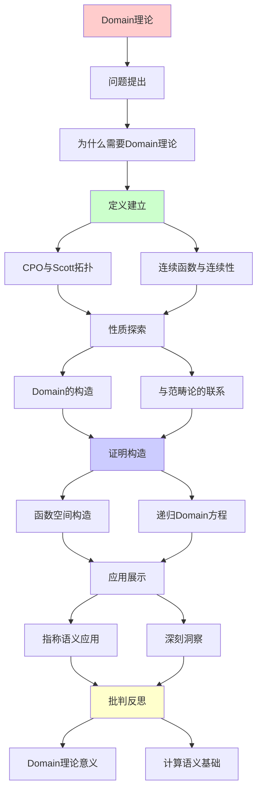
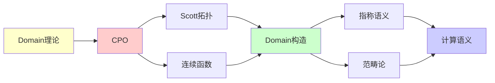

# Domain理论与Scott论域

> **主题**: 指称语义的数学基础
> **创建日期**: 2025-12-02
> **难度**: ⭐⭐⭐⭐⭐
> **前置知识**: 偏序集、拓扑学基础、λ演算

---

## 📋 目录

- [Domain理论与Scott论域](#domain理论与scott论域)
  - [📋 目录](#-目录)
  - [1. 为什么需要Domain理论](#1-为什么需要domain理论)
    - [1.1 计算语义的挑战](#11-计算语义的挑战)
    - [1.2 Scott的解决方案](#12-scott的解决方案)
  - [2. CPO与Scott拓扑](#2-cpo与scott拓扑)
    - [2.1 完备偏序集 (CPO) 回顾](#21-完备偏序集-cpo-回顾)
    - [2.2 Scott拓扑](#22-scott拓扑)
    - [2.3 Scott连续函数 (详细版)](#23-scott连续函数-详细版)
  - [3. 连续函数与连续性](#3-连续函数与连续性)
    - [3.1 为什么单调性不够？](#31-为什么单调性不够)
    - [3.2 有限元与紧元](#32-有限元与紧元)
  - [4. Domain的构造](#4-domain的构造)
    - [4.1 提升 (Lifting)](#41-提升-lifting)
    - [4.2 积 (Product)](#42-积-product)
    - [4.3 和 (Sum / 余积)](#43-和-sum--余积)
    - [4.4 函数空间 (指数)](#44-函数空间-指数)
    - [4.5 递归Domain方程](#45-递归domain方程)
  - [5. 指称语义应用](#5-指称语义应用)
    - [5.1 While语言的指称语义](#51-while语言的指称语义)
    - [5.2 λ演算的指称语义](#52-λ演算的指称语义)
    - [5.3 指称语义 vs 操作语义](#53-指称语义-vs-操作语义)
  - [6. 与范畴论的联系](#6-与范畴论的联系)
    - [6.1 Domain范畴](#61-domain范畴)
    - [6.2 嵌入-投影对](#62-嵌入-投影对)
    - [6.3 信息序与范畴论的联系](#63-信息序与范畴论的联系)
  - [7. 深刻洞察](#7-深刻洞察)
    - [7.1 "部分"的数学化](#71-部分的数学化)
    - [7.2 计算 = 逼近](#72-计算--逼近)
    - [7.3 Scott拓扑的独特性](#73-scott拓扑的独特性)
  - [8. 习题与思考](#8-习题与思考)
    - [习题1](#习题1)
    - [习题2](#习题2)
    - [习题3](#习题3)
    - [思考题](#思考题)
  - [9. 主题-子主题论证逻辑关系图](#9-主题-子主题论证逻辑关系图)
    - [9.1 论证依赖关系](#91-论证依赖关系)
    - [9.2 概念依赖关系](#92-概念依赖关系)
  - [10. 参考资源](#10-参考资源)
    - [10.1 经典论文](#101-经典论文)
    - [10.2 教材](#102-教材)
    - [10.3 在线资源](#103-在线资源)


---

## 1. 为什么需要Domain理论

### 1.1 计算语义的挑战

**问题**: 如何给程序赋予数学含义？

**挑战**:

1. **部分性** (Partiality): 程序可能不终止

   ```python
   def loop(): return loop()  # 永不终止
   ```

2. **递归**: 函数可以自指

   ```python
   def fact(n): return 1 if n==0 else n*fact(n-1)
   ```

3. **高阶**: 函数可以作为参数和返回值

   ```python
   def twice(f): return lambda x: f(f(x))
   ```

**传统集合论的问题**:

- 全函数空间 (ℕ → ℕ) 不包含不终止的情况
- 递归方程 f = F(f) 可能无解或有多个解

### 1.2 Scott的解决方案

**核心思想**: 用**偏序**建模"信息递增"

**"⊥" (bottom) 的含义**:

- ⊥ = "未定义"、"不终止"、"无信息"
- 逐步计算 = 从 ⊥ 出发的递增链

**Domain理论目标**:

1. 为部分函数提供数学模型
2. 保证递归方程有唯一的最小解
3. 使操作语义与指称语义一致

---

## 2. CPO与Scott拓扑

### 2.1 完备偏序集 (CPO) 回顾

**定义2.1**: (D, ⊑) 是CPO，如果：

1. ⊑ 是偏序
2. 存在最小元 ⊥
3. 每个递增链 x₀ ⊑ x₁ ⊑ ... 有最小上界 ⋁ᵢ xᵢ

**例子**:

1. **平坦CPO** (Flat(A)):

   ```text
          a   b   c   ...
           \ | | /
            \|/
             ⊥
   ```

   - 用于建模基本类型（int, bool等）
   - 两个非⊥元素不可比

2. **提升CPO** (A_⊥):

   ```text
   A_⊥ = {⊥} ∪ A
   ```

   - 将任意集合转为CPO

3. **自然数** (ℕ_⊥, ≤):

   ```text
   ⊥ ≤ 0 ≤ 1 ≤ 2 ≤ ...
   ```

### 2.2 Scott拓扑

**定义2.2 (Scott开集)**: D 上的子集 U 是**Scott开集**，如果：

1. **上闭**: x ∈ U ∧ x ⊑ y ⟹ y ∈ U
2. **定向完备**: 对任意定向集 S，⋁S ∈ U ⟹ ∃x ∈ S. x ∈ U

**直觉**:

- "从有限逼近可以观察到"
- 不能用无限过程"突然"进入开集

**例子** (在 ℕ_⊥ 上):

- U = {n | n > 5} ∪ {⊥} **不是**Scott开（⊥ ∈ U但所有逼近都不在）
- U = {n | n > 5} **是**Scott开

### 2.3 Scott连续函数 (详细版)

**定义2.3**: f: D → E 是**Scott连续**的，如果：

```text
∀定向集S ⊆ D. f(⋁S) = ⋁{f(s) | s ∈ S}
```

**等价刻画**:

1. **拓扑连续**: f⁻¹(U) 是Scott开集，对任意Scott开集 U
2. **保持定向上界**: 如上定义
3. **由紧元决定**: f(x) = ⋁{f(k) | k ⊑ x, k紧}

**为什么这是"正确"的连续性**:

- 捕捉了"可计算性"
- 可以从有限逼近计算极限
- 保证不动点存在

---

## 3. 连续函数与连续性

### 3.1 为什么单调性不够？

**反例**: 单调但不连续的函数

```text
D = {⊥, a₀, a₁, a₂, ...} ∪ {⊤}
⊥ ⊑ aᵢ ⊑ ⊤ (但 aᵢ 之间不可比)

f(x) = {
  ⊥    如果 x = ⊥ 或 x = aᵢ
  ⊤    如果 x = ⊤
}
```

**问题**:

- f 单调: x ⊑ y ⟹ f(x) ⊑ f(y)
- 但 f(⋁ aᵢ) = f(⊤) = ⊤ ≠ ⊥ = ⋁ f(aᵢ)
- **不连续**！

**直觉**: f 在 ⊤ 处"跳跃"，无法从有限逼近预测

### 3.2 有限元与紧元

**定义3.1 (紧元 / Finite Element)**: x ∈ D 是**紧的**，如果：

```text
∀定向集S. x ⊑ ⋁S ⟹ ∃s ∈ S. x ⊑ s
```

**直觉**: 紧元 = "有限信息"，可以被定向集中的某个元素"见证"

**例子**:

1. 在 Flat(ℕ) 中: 每个元素都紧
2. 在 ℕ_⊥ 中: 每个自然数紧，⊤ (如果存在) 不紧
3. 在 P(ℕ) 中: 有限集紧，无限集不紧

**定义3.2 (代数CPO)**: D 是代数的，如果：

- 每个 x ∈ D 是其紧逼近的上界: x = ⋁{k | k ⊑ x, k紧}

**Scott定理**: 在代数CPO上，连续函数完全由其在紧元上的行为决定

---

## 4. Domain的构造

### 4.1 提升 (Lifting)

**构造**: A_⊥ = {⊥} ∪ A

**偏序**: ⊥ ⊑ a 对所有 a ∈ A

**应用**: 将离散集合变成CPO（建模基本类型）

### 4.2 积 (Product)

**构造**: D × E = {(d, e) | d ∈ D, e ∈ E}

**偏序**: (d, e) ⊑ (d', e') ⟺ d ⊑ d' ∧ e ⊑ e'

**最小元**: ⊥_{D×E} = (⊥_D, ⊥_E)

**性质**:

- 投影连续: π₁(d, e) = d, π₂(d, e) = e
- 配对连续: ⟨f, g⟩(x) = (f(x), g(x))

### 4.3 和 (Sum / 余积)

**构造**: D + E = {inl(d) | d ∈ D} ∪ {inr(e) | e ∈ E}

**偏序**:

- inl(d) ⊑ inl(d') ⟺ d ⊑ d'
- inr(e) ⊑ inr(e') ⟺ e ⊑ e'
- inl 和 inr 不可比

**最小元**: 需要添加 ⊥ (smash sum) 或分别有⊥ (coalesced sum)

### 4.4 函数空间 (指数)

**构造**: [D → E] = {f: D → E | f Scott连续}

**偏序**: f ⊑ g ⟺ ∀x. f(x) ⊑ g(x) (逐点序)

**最小元**: ⊥(x) = ⊥_E 对所有 x

**关键定理**: 如果 E 是CPO，则 [D → E] 也是CPO

**证明思路**:

```text
设 f₀ ⊑ f₁ ⊑ ... 是递增链
定义 f(x) = ⋁ₙ fₙ(x)

关键: 证明 f 连续
对任意递增链 x₀ ⊑ x₁ ⊑ ...:
  f(⋁ᵢ xᵢ) = ⋁ₙ fₙ(⋁ᵢ xᵢ)        (逐点)
           = ⋁ₙ ⋁ᵢ fₙ(xᵢ)        (fₙ连续)
           = ⋁ᵢ ⋁ₙ fₙ(xᵢ)        (交换⋁)
           = ⋁ᵢ f(xᵢ)  ✓
```

### 4.5 递归Domain方程

**问题**: 解方程 D ≅ [D → D]

**Scott的解法**: 用**逆极限** (Inverse Limit)

**具体步骤**:

1. 构造逼近序列: D₀, D₁, D₂, ...
2. 投影映射: πₙ: Dₙ₊₁ → Dₙ
3. 逆极限: D = lim←{Dₙ, πₙ}

**结果**: 可以构造满足各种递归方程的Domain

**例子**: λ演算的Domain模型

- D ≅ [D → D] 的解给出λ项的指称

---

## 5. 指称语义应用

### 5.1 While语言的指称语义

**语法**:

```text
C ::= skip | x := E | C₁; C₂ | if B then C₁ else C₂ | while B do C
```

**语义域**:

- State = Var → ℕ_⊥ (状态空间)
- C: State → State_⊥ (命令语义)

**语义定义**:

```text
skipσ = σ
x := Eσ = σ[x ↦ Eσ]
C₁; C₂ = C₂ ∘ C₁
if B then C₁ else C₂σ = if Bσ then C₁σ else C₂σ
while B do C = μf. λσ. if Bσ then f(Cσ) else σ
```

**while的不动点解释**:

- F(f) = λσ. if Bσ then f(Cσ) else σ
- while B do C = lfp(F) (最小不动点)
- 通过迭代: F⁰(⊥) ⊑ F¹(⊥) ⊑ F²(⊥) ⊑ ...

### 5.2 λ演算的指称语义

**Domain方程**: D ≅ [D → D]

**语义映射**:

```text
xρ = ρ(x)                      (变量)
λx.Mρ = λd ∈ D. Mρ[x↦d]     (抽象)
M Nρ = (Mρ)(Nρ)            (应用)
```

**Y组合子的语义**:

```text
Y = λf. lfp(f)
```

即 Y 在语义上就是不动点算子！

### 5.3 指称语义 vs 操作语义

**操作语义** (Operational):

- 描述"如何计算"
- 规则驱动: C, σ → C', σ'

**指称语义** (Denotational):

- 描述"计算什么"
- 数学函数: C: State → State

**关键定理** (Adequacy):

```text
C, σ →* σ'  ⟺  Cσ = σ'
```

**Domain理论保证**: 两者一致！

---

## 6. 与范畴论的联系

### 6.1 Domain范畴

**Cpo范畴**:

- 对象: CPO
- 态射: Scott连续函数
- 复合: 函数复合

**性质**:

- **笛卡尔闭**: 有积、终对象、指数对象
- **余笛卡尔**: 有余积、初对象

**这意味着**: Cpo是λ演算的自然范畴论模型！

### 6.2 嵌入-投影对

**定义6.1**: (e: D → E, p: E → D) 是嵌入-投影对，如果：

1. p ∘ e = id_D (投影后嵌入回到自己)
2. e ∘ p ⊑ id_E (嵌入后投影"损失信息")

**应用**: 构造递归Domain

**Domain方程** D ≅ F(D) 的解:

- 通过构造不动点的嵌入-投影序列

### 6.3 信息序与范畴论的联系

**Curry-Howard-Scott对应**:

| 逻辑 | λ演算 | Domain理论 | 范畴论 |
|------|-------|-----------|--------|
| 命题 | 类型 | CPO | 对象 |
| 证明 | 项 | 元素 | 态射 1→D |
| 蕴含 | 函数类型 | [D→E] | 指数对象 |
| 递归 | Y组合子 | 不动点 | 初始代数 |

**深刻洞察**: Domain理论是Curry-Howard对应的**语义基础**

---

## 7. 深刻洞察

### 7.1 "部分"的数学化

**传统**: 部分函数 f: A ⇀ B 是特殊的、问题的

**Domain视角**: 部分性是**基本的**

- ⊥ 是第一等公民
- 全函数 = 特殊情况（⊥ ↦ ⊥）

### 7.2 计算 = 逼近

**核心思想**:

- 计算是渐进的信息获取过程
- ⊥ → k₁ → k₂ → ... → result
- 每一步增加"信息"

**连接到RE**:

- RE集 = 可以从⊥开始逐步枚举的集合
- 递归可枚举 = 定向可达

### 7.3 Scott拓扑的独特性

**为什么不用通常拓扑**:

- 离散拓扑: 太"细"，不连续函数太少
- 平凡拓扑: 太"粗"，所有函数都连续

**Scott拓扑**: "刚刚好"

- 捕捉可计算性
- 保证不动点存在
- 与信息序兼容

---

## 8. 习题与思考

### 习题1

证明: 在CPO D上，恒等函数 id: D → D 是Scott连续的。

### 习题2

给出 Flat(Bool) × Flat(ℕ) 的Hasse图。

### 习题3

证明: 函数空间 [D → E] 在逐点序下是CPO（当E是CPO时）。

### 思考题

为什么Domain理论选择"最小"不动点而非"最大"？这与计算的哪个方面相关？

---

## 9. 主题-子主题论证逻辑关系图

### 9.1 论证依赖关系



### 9.2 概念依赖关系



**论证逻辑链条**：

1. **问题提出** (1节)：
   - 为什么需要Domain理论

2. **定义建立** (2-3节)：
   - CPO与Scott拓扑（2节）
   - 连续函数与连续性（3节）

3. **性质探索** (4-6节)：
   - Domain的构造（4节）
   - 指称语义应用（5节）
   - 与范畴论的联系（6节）

4. **证明构造** (4.4-4.5节)：
   - 函数空间构造和递归Domain方程

5. **应用展示** (5节)：
   - 指称语义应用

6. **批判反思** (7节)：
   - 深刻洞察

---

## 10. 参考资源

### 10.1 经典论文

1. **Scott, D.** (1970). "Outline of a Mathematical Theory of Computation"
   - Technical Report PRG-2, Oxford University
   - Domain理论奠基论文

2. **Scott, D.** (1976). "Data Types as Lattices"
   - _SIAM Journal on Computing_, 5(3), 522-587
   - Domain理论经典论文

3. **Plotkin, G.** (1977). "LCF Considered as a Programming Language"
   - _Theoretical Computer Science_, 5(3), 223-255
   - LCF与Domain理论

### 10.2 教材

1. **Abramsky, S., & Jung, A.** (1994). "Domain Theory"
   - In Abramsky, S., et al. (eds.), _Handbook of Logic in Computer Science, Volume 3_
   - Oxford University Press. ISBN 978-0198537625
   - Domain理论权威教材

2. **Gunter, C. A.** (1992). _Semantics of Programming Languages: Structures and Techniques_
   - MIT Press. ISBN 978-0262071437
   - 编程语言语义教材

3. **Winskel, G.** (1993). _The Formal Semantics of Programming Languages: An Introduction_
   - MIT Press. ISBN 978-0262731034
   - 形式语义教材

### 10.3 在线资源

1. **Domain Theory**
   - https://en.wikipedia.org/wiki/Domain_theory
   - Domain理论基本概念

2. **nLab - Domain Theory**
   - https://ncatlab.org/nlab/show/domain+theory
   - Domain理论范畴论视角

3. **Scott Topology**
   - https://en.wikipedia.org/wiki/Scott_continuity
   - Scott连续性

---

**最后更新**: 2025-12-04
**状态**: ✅ 已添加主题-子主题论证逻辑关系图和参考资源章节
