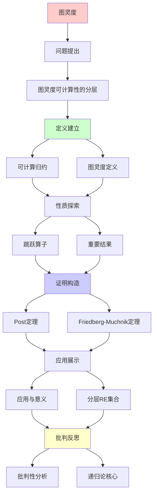
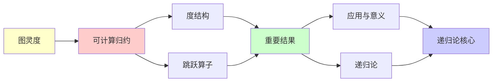

# 图灵度与跳跃算子

> **主题**: 递归论的核心结构理论
> **创建日期**: 2025-12-02
> **难度**: ⭐⭐⭐⭐⭐ (高级)
> **前置**: 00.3 递归可枚举性、04.5 停机问题

---

## 📋 目录

- [图灵度与跳跃算子](#图灵度与跳跃算子)
  - [📋 目录](#-目录)
  - [1. 图灵度：可计算性的分层](#1-图灵度可计算性的分层)
    - [1.1 可计算归约](#11-可计算归约)
    - [1.2 图灵度定义](#12-图灵度定义)
    - [1.3 度结构](#13-度结构)
  - [2. 跳跃算子](#2-跳跃算子)
    - [2.1 定义与动机](#21-定义与动机)
    - [2.2 Post定理](#22-post定理)
    - [2.3 跳跃层级](#23-跳跃层级)
  - [3. 重要结果](#3-重要结果)
    - [3.1 Friedberg-Muchnik定理](#31-friedberg-muchnik定理)
    - [3.2 跳跃反演定理](#32-跳跃反演定理)
  - [4. 应用与意义](#4-应用与意义)
    - [4.1 分层RE集合](#41-分层re集合)
    - [4.2 相对化复杂度](#42-相对化复杂度)
    - [4.3 形式化验证限制](#43-形式化验证限制)
  - [5. 批判性分析](#5-批判性分析)
    - [5.1 理论优美性](#51-理论优美性)
    - [5.2 实践相关性](#52-实践相关性)
    - [5.3 未解决问题](#53-未解决问题)
  - [📚 参考文献](#-参考文献)
    - [经典论文](#经典论文)
    - [标准教材](#标准教材)
    - [在线资源](#在线资源)
  - [🎯 关键要点](#-关键要点)
    - [核心概念](#核心概念)
    - [深刻洞察](#深刻洞察)
    - [实践启示](#实践启示)
  - [💭 学习建议](#-学习建议)

---

## 1. 图灵度：可计算性的分层

### 1.1 可计算归约

**定义** (Turing Reducibility):

集合A **图灵可归约**到B (记作 A ≤_T B):

```text
存在Oracle图灵机 M^B 使得:
  ∀x: x ∈ A ⟺ M^B接受x
```

**直觉**: 如果可以用B作为"子程序"计算A，则A≤_TB

**例子**:

```text
停机问题 K = {e | φₑ(e)↓}

K' = {e | φₑᴷ(e)↓} (K-Oracle停机问题)

定理: K ≤_T K' (显然，用K可以判定K)
       K' ≰_T K (不显然！Post定理)
```

### 1.2 图灵度定义

**等价关系**:

A ≡_T B 当且仅当 A ≤_T B 且 B ≤_T A

**图灵度** (Turing Degree):

```text
deg(A) = {B | B ≡_T A}

所有与A可计算等价的集合构成一个度
```

**重要度**:

1. **0度**: deg(∅) = 递归集 (可判定集合)
2. **0'度**: deg(K) = 停机问题的度
3. **0''度**: deg(K') = K的跳跃
4. **中间度**: 存在度d使得 0 <_T d <_T 0'

**符号约定**:

```text
a, b, c, ... 表示度
a ≤ b 表示存在A∈a, B∈b使得A≤_TB
```

### 1.3 度结构

**定理1.1** (度的上半格结构):

图灵度在≤关系下构成**上半格** (Upper Semi-Lattice):

```text
性质:
1. 自反: a ≤ a
2. 反对称: a≤b 且 b≤a → a=b
3. 传递: a≤b 且 b≤c → a≤c
4. 上界: ∀a,b ∃c. a≤c 且 b≤c (c = a∨b, join存在)

但: 不是格! (不保证meet存在)
```

**可视化**:

```text
        ...
       / | \
      /  |  \
   0''' 0'' ...
     │   │
     │  0'  (停机问题度)
     │ /  \
     │/    \
     0  ─── a (中间度)
   (递归)

性质:
- 0是最小度
- 无最大度
- 稠密: ∀a<b ∃c. a<c<b
- 不可数多个度
```

---

## 2. 跳跃算子

### 2.1 定义与动机

**动机**:

给定集合A，什么是"比A更难"的自然集合？

**跳跃定义**:

对任意集合A，定义其**跳跃** A':

```text
A' = {e | φₑᴬ(e)↓}

即: A-Oracle程序e在输入e上停机
```

**直觉**: A' = "A-相对停机问题"

**关键性质**:

1. A <_T A' (严格更难!)
2. A' 完全 Σ₁⁰^A (A-相对算术谱系)
3. (A')' = A'' (可迭代)

### 2.2 Post定理

**定理2.1** (Post 1948):

```text
A' 是 Σ₁⁰^A-完全的

即:
1. A' ∈ Σ₁⁰^A
2. ∀B∈Σ₁⁰^A: B ≤_m A' (多一归约)
```

**证明思路**:

```text
1. A' ∈ Σ₁⁰^A:
   e ∈ A' ⟺ ∃t φₑᴬ(e)在t步内停机
             ↑
           存在量词 + A-递归谓词

2. Σ₁⁰^A-完全性:
   设B = {x | ∃n R^A(n,x)}
   构造e: φₑᴬ(x) = 搜索n使R^A(n,x)
   则: x∈B ⟺ φₑᴬ(x)↓
```

**深刻性**:

> 跳跃算子 = 相对停机问题
> Post定理 = 跳跃完全Σ₁⁰^A
> → 跳跃是"自然的更难问题"

### 2.3 跳跃层级

**定义迭代跳跃**:

```text
0 = ∅ (或任意递归集)
0' = 停机问题 K
0'' = K'
0''' = (K')'
...
0^(n) = n次跳跃
```

**与算术谱系对应**:

```text
定理2.2 (Post 1948):
  0^(n) 完全 Σₙ⁰

具体:
  0 = 递归 = Δ₁⁰
  0' 完全 Σ₁⁰ (RE)
  0'' 完全 Σ₂⁰
  ...
  0^(n) 完全 Σₙ⁰
```

**可视化**:

```text
复杂度递增:
递归 ⊂ RE ⊂ Σ₂⁰ ⊂ Σ₃⁰ ⊂ ...
 ║     ║      ║      ║
 0  <  0'  <  0'' <  0''' < ...

每次跳跃 = 上升一层算术谱系
```

---

## 3. 重要结果

### 3.1 Friedberg-Muchnik定理

**定理3.1** (Friedberg 1957, Muchnik 1956):

```text
存在RE度 a, b 使得:
  0 < a, b < 0'
  a, b 不可比 (a ≰ b 且 b ≰ a)

即: 存在"中间度"，且不止一个！
```

**历史意义**:

- Post问题 (1944): "是否存在0和0'之间的度？"
- Friedberg-Muchnik: **是！** (用优先级方法)

**证明技术**: **优先级方法** (Priority Method)

```text
构造思路:
1. 同时构造RE集A, B
2. 满足无穷多要求:
   Rₙ: φₙᴬ ≠ A
   Sₙ: φₙᴮ ≠ B
3. 优先级: R₀ > S₀ > R₁ > S₁ > ...
4. 有限伤害: 每个要求只伤害有限多次

结果: A, B 不可归约到彼此
```

**影响**: 现代递归论基础技术

### 3.2 跳跃反演定理

**定理3.2** (Jump Inversion):

```text
∀度 a ≥ 0': ∃度 b. b' = a

即: 除0外，每个度都是某个度的跳跃
```

**意义**: 跳跃算子"几乎"是满射

**限制**: 不能反演到 < 0'

---

## 4. 应用与意义

### 4.1 分层RE集合

**应用1**: 细化RE语言分类

```text
不再只是"RE vs 非RE"
而是:
  递归 (0)
  ↓
  RE低度 (a < 0')
  ↓
  停机问题 (0')
  ↓
  更高度 (> 0')
```

### 4.2 相对化复杂度

**应用2**: 理解Oracle机器

```text
P^A = 用A作Oracle的P
NP^A = 用A作Oracle的NP

定理: ∃A. P^A ≠ NP^A (Oracle分离)
      ∃B. P^B = NP^B (Oracle重合)

→ P vs NP不能用相对化技术解决！
```

### 4.3 形式化验证限制

**应用3**: 理解验证边界

```text
程序性质层次:
- 语法性质 (0): 可判定
- 简单语义 (0'): RE
- 复杂语义 (0''+): 更难

→ Rice定理: 所有语义性质 ≥ 0'
→ 形式化验证: 需要人工或Oracle
```

---

## 5. 批判性分析

### 5.1 理论优美性

**优势**:

- ✅ 精确刻画"可计算难度"
- ✅ 数学结构优雅 (上半格)
- ✅ 与算术谱系完美对应

**局限**:

- ⚠️ 高度抽象（学习曲线陡峭）
- ⚠️ 实践应用有限
- ⚠️ 不解决P vs NP等实际问题

### 5.2 实践相关性

**实际影响**: 有限

```text
工程师需要知道吗？
- 停机问题: 是 ✅
- Rice定理: 是 ✅
- 图灵度: 否 ❌ (除非研究递归论)

适用人群:
✅ 递归论研究者
✅ 数理逻辑学者
⚠️ 一般CS学生 (可选)
❌ 工程师 (无需深入)
```

### 5.3 未解决问题

**Slaman-Woodin猜想** (1986):

```text
问题: 度结构的一阶理论是否可判定？
状态: 未解决
```

**同构问题**:

```text
问题: 所有0'上方的度区间是否同构？
状态: 部分结果，未完全解决
```

---

## 📚 参考文献

### 经典论文

[1] **Post, E. L.** (1948). "Degrees of Recursive Unsolvability"
     _Bulletin of the American Mathematical Society_ 54: 641-642.

[2] **Friedberg, R. M.** (1957). "Two Recursively Enumerable Sets of Incomparable Degrees of Unsolvability"
     _Proceedings of the National Academy of Sciences_ 43(2): 236-238.

[3] **Muchnik, A. A.** (1956). "On the Unsolvability of the Problem of Reducibility in the Theory of Algorithms" (俄文)
     _Dokl. Akad. Nauk SSSR_ 108: 194-197.

### 标准教材

[4] **Soare, R. I.** (1987). _Recursively Enumerable Sets and Degrees_
     Springer-Verlag. ISBN 0-387-15299-7.
     - Chapter 1: 基础
     - Chapter 5: 图灵度
     - Chapter 7: 优先级方法

[5] **Rogers, H.** (1987). _Theory of Recursive Functions and Effective Computability_
     MIT Press. ISBN 0-262-68052-1.
     - Chapter 9: 度理论

[6] **Cooper, S. B.** (2004). _Computability Theory_
     Chapman & Hall/CRC. ISBN 1-58488-237-9.
     - Chapter 3: Turing度
     - Chapter 4: 优先级论证

### 在线资源

[7] **Wikipedia**: Turing Degree
     URL: https://en.wikipedia.org/wiki/Turing_degree
     (访问: 2025-12-02)

[8] **nLab**: Recursion Theory
     URL: https://ncatlab.org/nlab/show/recursion+theory
     (访问: 2025-12-02)

---

## 🎯 关键要点

### 核心概念

1. **图灵归约**: A ≤_T B (用B作Oracle计算A)
2. **图灵度**: 可计算等价类 deg(A)
3. **跳跃**: A' = A-相对停机问题
4. **Post定理**: A' 完全 Σ₁⁰^A

### 深刻洞察

> 图灵度 = RE集合的"计算难度分层"
> 跳跃算子 = 难度递增的自然方式
> 算术谱系 = 跳跃层级的逻辑刻画

### 实践启示

- **理论**: 优美的数学结构
- **实践**: 对工程影响有限
- **适用**: 递归论研究、逻辑学

---

## 💭 学习建议

**前置知识**:

- 停机问题 (04.5)
- 递归可枚举性 (00.3)
- Rice定理 (04.4)

**学习路径**:

1. 理解Oracle机器概念
2. 掌握图灵归约定义
3. 理解跳跃算子
4. 研究Friedberg-Muchnik (高级)

**深入资源**:

- Soare教材 (权威但难)
- Cooper教材 (现代且清晰)

---

## 6. 主题-子主题论证逻辑关系图

### 6.1 论证依赖关系



### 6.2 概念依赖关系



**论证逻辑链条**：

1. **问题提出** (1节)：
   - 图灵度可计算性的分层

2. **定义建立** (1.1-1.3节)：
   - 可计算归约、图灵度定义、度结构

3. **性质探索** (2-3节)：
   - 跳跃算子（2节）
   - 重要结果（3节）

4. **证明构造** (2.1-2.3, 3.1-3.2节)：
   - Post定理和Friedberg-Muchnik定理

5. **应用展示** (4节)：
   - 应用与意义

6. **批判反思** (5节)：
   - 批判性分析

---

## 7. 参考资源

### 7.1 经典论文

1. **Turing, A. M.** (1939). "Systems of Logic Based on Ordinals"
   - _Proceedings of the London Mathematical Society_, 45(2), 161-228
   - 图灵度理论起源

2. **Post, E. L.** (1944). "Recursively Enumerable Sets of Positive Integers and Their Decision Problems"
   - _Bulletin of the American Mathematical Society_, 50(5), 284-316
   - Post问题

3. **Friedberg, R. M.** (1957). "Two Recursively Enumerable Sets of Incomparable Degrees of Unsolvability"
   - _Proceedings of the National Academy of Sciences_, 43(2), 236-238
   - Friedberg-Muchnik定理

### 7.2 教材

1. **Soare, R. I.** (1987)
   - _Recursively Enumerable Sets and Degrees: A Study of Computable Functions and Computably Generated Sets_
   - Springer-Verlag. ISBN 978-0387152996
   - 递归论权威教材

2. **Rogers, H.** (1987)
   - _Theory of Recursive Functions and Effective Computability_
   - MIT Press. ISBN 978-0262680523
   - 递归函数论经典教材

3. **Cooper, S. B.** (2004)
   - _Computability Theory_
   - Chapman & Hall/CRC. ISBN 978-1584882374
   - 现代可计算性理论教材

### 7.3 在线资源

1. **Turing Degree**
   - https://en.wikipedia.org/wiki/Turing_degree
   - 图灵度基本概念

2. **Jump Operator**
   - https://en.wikipedia.org/wiki/Turing_jump
   - 跳跃算子

3. **Recursion Theory**
   - https://ncatlab.org/nlab/show/recursion+theory
   - 递归论nLab条目

---

**最后更新**: 2025-12-04
**难度**: ⭐⭐⭐⭐⭐ (递归论核心)
**推荐**: 研究者必读，工程师可选
**批判性**: 理论优美，实践应用有限
**状态**: ✅ 已添加主题-子主题论证逻辑关系图和参考资源章节

**另见**:

- [00.3 递归可枚举性理论](00.3_递归可枚举性理论.md)
- [04.2 算术谱系](../04_复杂度与表达力/04.2_算术谱系与Sigma层级.md)
- [04.4 Rice定理](../04_复杂度与表达力/04.4_Rice定理.md)
- [04.5 停机问题](../04_复杂度与表达力/04.5_停机问题与不可判定性.md)
