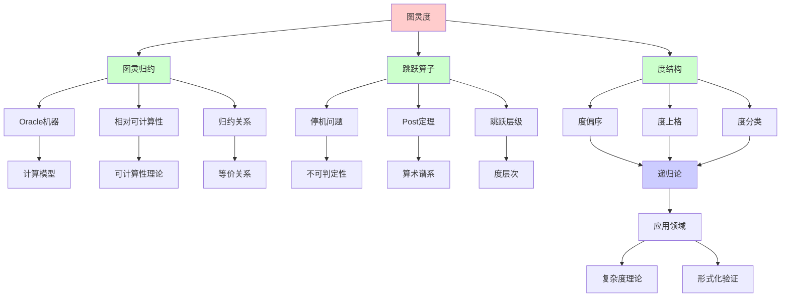
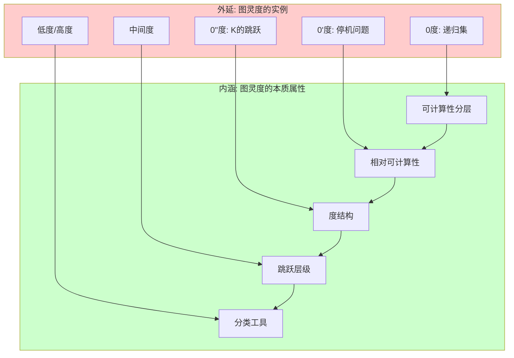
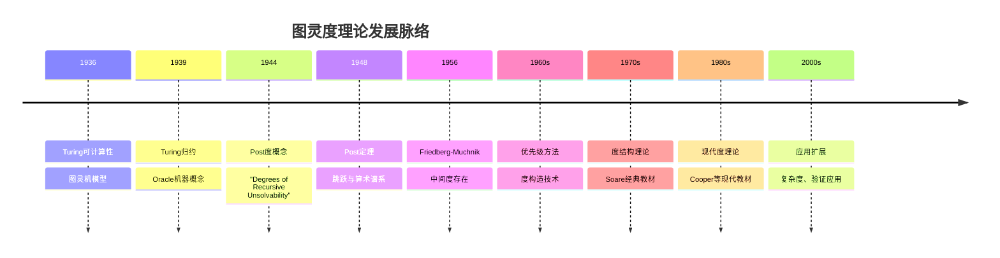
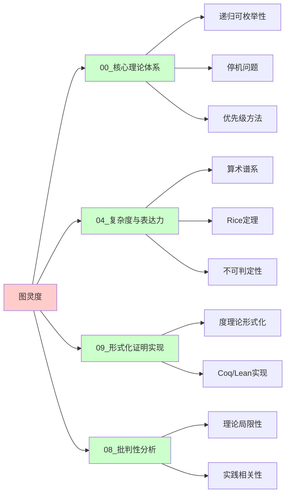
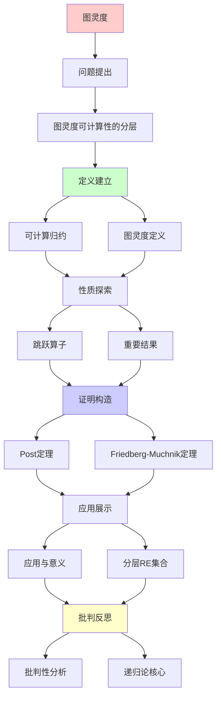
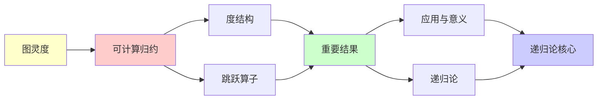

# 图灵度与跳跃算子

> **主题**: 递归论的核心结构理论
> **创建日期**: 2025-12-02
> **难度**: ⭐⭐⭐⭐⭐ (高级)
> **前置**: 00.3 递归可枚举性、04.5 停机问题

---

## 📋 目录

- [图灵度与跳跃算子](#图灵度与跳跃算子)
  - [📋 目录](#-目录)
  - [1. 图灵度：可计算性的分层](#1-图灵度可计算性的分层)
    - [1.0 概念分析：图灵度](#10-概念分析图灵度)
      - [1.0.1 定义矩阵](#101-定义矩阵)
      - [1.0.2 属性分析](#102-属性分析)
      - [1.0.3 外延分析](#103-外延分析)
      - [1.0.4 内涵分析](#104-内涵分析)
      - [1.0.5 关系网络](#105-关系网络)
    - [1.1 可计算归约](#11-可计算归约)
    - [1.2 图灵度定义](#12-图灵度定义)
    - [1.3 度结构](#13-度结构)
  - [2. 跳跃算子](#2-跳跃算子)
    - [2.1 定义与动机](#21-定义与动机)
    - [2.2 Post定理](#22-post定理)
    - [2.3 跳跃层级](#23-跳跃层级)
  - [3. 重要结果](#3-重要结果)
    - [3.1 Friedberg-Muchnik定理](#31-friedberg-muchnik定理)
    - [3.2 跳跃反演定理](#32-跳跃反演定理)
  - [4. 应用与意义](#4-应用与意义)
    - [4.1 分层RE集合](#41-分层re集合)
    - [4.2 相对化复杂度](#42-相对化复杂度)
    - [4.3 形式化验证限制](#43-形式化验证限制)
  - [5. 批判性分析](#5-批判性分析)
    - [5.1 理论优美性](#51-理论优美性)
    - [5.2 实践相关性](#52-实践相关性)
    - [5.3 未解决问题](#53-未解决问题)
  - [📚 参考文献](#-参考文献)
    - [经典论文](#经典论文)
    - [标准教材](#标准教材)
    - [在线资源](#在线资源)
  - [🎯 关键要点](#-关键要点)
    - [核心概念](#核心概念)
    - [深刻洞察](#深刻洞察)
    - [实践启示](#实践启示)
  - [💭 学习建议](#-学习建议)
  - [6. 思维表征：图灵度与跳跃算子](#6-思维表征图灵度与跳跃算子)
    - [6.1 概念关系网络图](#61-概念关系网络图)
    - [6.2 论证逻辑路径图](#62-论证逻辑路径图)
    - [6.3 概念属性矩阵](#63-概念属性矩阵)
    - [6.4 外延内涵分析图](#64-外延内涵分析图)
    - [6.5 理论发展脉络图](#65-理论发展脉络图)
    - [6.6 跨模块关联图](#66-跨模块关联图)
  - [7. 权威资源对标](#7-权威资源对标)
    - [7.1 Wikipedia对标](#71-wikipedia对标)
    - [7.2 大学课程对标](#72-大学课程对标)
      - [MIT 6.045J (Automata, Computability, and Complexity)](#mit-6045j-automata-computability-and-complexity)
      - [Stanford CS154 (Automata and Complexity Theory)](#stanford-cs154-automata-and-complexity-theory)
      - [CMU 15-455 (Computational Complexity)](#cmu-15-455-computational-complexity)
    - [7.3 权威教材对标](#73-权威教材对标)
      - [Soare (1987) "Recursively Enumerable Sets and Degrees"](#soare-1987-recursively-enumerable-sets-and-degrees)
      - [Rogers (1987) "Theory of Recursive Functions and Effective Computability"](#rogers-1987-theory-of-recursive-functions-and-effective-computability)
      - [Cooper (2004) "Computability Theory"](#cooper-2004-computability-theory)
    - [7.4 最新研究动态 (2024-2025)](#74-最新研究动态-2024-2025)
  - [8. 主题-子主题论证逻辑关系图](#8-主题-子主题论证逻辑关系图)
    - [8.1 论证依赖关系](#81-论证依赖关系)
    - [8.2 概念依赖关系](#82-概念依赖关系)
  - [7. 参考资源](#7-参考资源)
    - [7.1 经典论文](#71-经典论文)
    - [7.2 教材](#72-教材)
    - [7.3 在线资源](#73-在线资源)

---

## 1. 图灵度：可计算性的分层

### 1.0 概念分析：图灵度

#### 1.0.1 定义矩阵

| 维度 | 内容 |
|------|------|
| **形式化定义** | deg(A) = {B \| B ≡_T A}，其中A ≡_T B当且仅当A ≤_T B且B ≤_T A |
| **直观理解** | 图灵度 = 所有与A可计算等价的集合构成的等价类 |
| **等价定义** | 1. 归约等价类<br>2. Oracle等价类<br>3. 计算能力等价类 |
| **历史定义** | Post (1944): 首次提出度概念；Turing (1939): 可计算归约 |

#### 1.0.2 属性分析

**必要属性** (Necessary Properties):

1. **等价关系**: ≡_T 是等价关系（自反、对称、传递）
2. **偏序结构**: ≤_T 是偏序关系
3. **度结构**: 度集合形成上格（upper semilattice）

**充分属性** (Sufficient Properties):

1. **跳跃算子**: 存在跳跃算子 ' 使得 deg(A') > deg(A)
2. **中间度存在**: 存在度d使得 0 <_T d <_T 0'
3. **度结构复杂性**: 度结构非常复杂（不可数、稠密等）

**本质属性** (Essential Properties):

1. **可计算性分层**: 度表示可计算性的不同层次
2. **相对可计算性**: 度基于相对可计算性（Oracle计算）
3. **结构理论**: 度结构是递归论的核心研究对象

**偶然属性** (Accidental Properties):

1. **具体构造**: 优先级方法、强迫法等构造技术
2. **应用领域**: 在复杂度理论、形式化验证等领域的应用

#### 1.0.3 外延分析

**包含的实例**:

1. **经典度**:
   - 0度: deg(∅) = 递归集
   - 0'度: deg(K) = 停机问题的度
   - 0''度: deg(K') = K的跳跃
   - 0^(n)度: n次跳跃

2. **特殊度**:
   - 低度 (Low degrees): a' = 0'
   - 高度 (High degrees): a' = 0''
   - 中间度 (Intermediate degrees): 0 <_T a <_T 0'

3. **度类**:
   - 递归可枚举度 (r.e. degrees)
   - 算术度 (Arithmetic degrees)
   - 超算术度 (Hyperarithmetic degrees)

**包含的子类**:

1. **递归可枚举度** ⊂ 所有度
2. **算术度** ⊂ 所有度
3. **Δ^0_n度** ⊂ 所有度

**边界情况**:

1. **最小度**: 0度（递归集）
2. **最大度**: 不存在（度结构向上无界）
3. **不可比度**: 存在不可比的度对

#### 1.0.4 内涵分析

**核心特征**:

1. **可计算性分层**: 度表示不同的可计算性层次
2. **相对性**: 基于Oracle计算和相对可计算性
3. **结构复杂性**: 度结构非常复杂，是递归论的核心

**本质属性**:

1. **分类工具**: 度是分类不可判定问题的重要工具
2. **结构理论**: 度结构理论是递归论的核心
3. **应用价值**: 在复杂度理论、形式化验证等领域有应用

**与其他概念的区别**:

| 概念 | 区别 |
|------|------|
| **复杂度类** | 度基于可计算性，复杂度类基于资源限制 |
| **算术谱系** | 度是等价类，算术谱系是层次结构 |
| **图灵归约** | 度是归约的等价类，归约是关系 |

#### 1.0.5 关系网络

**上位概念**:

- 可计算性理论 (Computability Theory)
- 递归论 (Recursion Theory)
- 相对可计算性 (Relative Computability)

**下位概念**:

- 图灵归约 (Turing Reducibility)
- 跳跃算子 (Jump Operator)
- 度结构 (Degree Structure)

**相关概念**:

- 停机问题 (Halting Problem)
- 算术谱系 (Arithmetic Hierarchy)
- 复杂度理论 (Complexity Theory)
- 形式化验证 (Formal Verification)

**等价概念**:

- 可计算度 (Computable Degree)
- 递归度 (Recursive Degree)

---

### 1.1 可计算归约

**定义** (Turing Reducibility):

集合A **图灵可归约**到B (记作 A ≤_T B):

```text
存在Oracle图灵机 M^B 使得:
  ∀x: x ∈ A ⟺ M^B接受x
```

**直觉**: 如果可以用B作为"子程序"计算A，则A≤_TB

**例子**:

```text
停机问题 K = {e | φₑ(e)↓}

K' = {e | φₑᴷ(e)↓} (K-Oracle停机问题)

定理: K ≤_T K' (显然，用K可以判定K)
       K' ≰_T K (不显然！Post定理)
```

### 1.2 图灵度定义

**等价关系**:

A ≡_T B 当且仅当 A ≤_T B 且 B ≤_T A

**图灵度** (Turing Degree):

```text
deg(A) = {B | B ≡_T A}

所有与A可计算等价的集合构成一个度
```

**重要度**:

1. **0度**: deg(∅) = 递归集 (可判定集合)
2. **0'度**: deg(K) = 停机问题的度
3. **0''度**: deg(K') = K的跳跃
4. **中间度**: 存在度d使得 0 <_T d <_T 0'

**符号约定**:

```text
a, b, c, ... 表示度
a ≤ b 表示存在A∈a, B∈b使得A≤_TB
```

### 1.3 度结构

**定理1.1** (度的上半格结构):

图灵度在≤关系下构成**上半格** (Upper Semi-Lattice):

```text
性质:
1. 自反: a ≤ a
2. 反对称: a≤b 且 b≤a → a=b
3. 传递: a≤b 且 b≤c → a≤c
4. 上界: ∀a,b ∃c. a≤c 且 b≤c (c = a∨b, join存在)

但: 不是格! (不保证meet存在)
```

**可视化**:

```text
        ...
       / | \
      /  |  \
   0''' 0'' ...
     │   │
     │  0'  (停机问题度)
     │ /  \
     │/    \
     0  ─── a (中间度)
   (递归)

性质:
- 0是最小度
- 无最大度
- 稠密: ∀a<b ∃c. a<c<b
- 不可数多个度
```

---

## 2. 跳跃算子

### 2.1 定义与动机

**动机**:

给定集合A，什么是"比A更难"的自然集合？

**跳跃定义**:

对任意集合A，定义其**跳跃** A':

```text
A' = {e | φₑᴬ(e)↓}

即: A-Oracle程序e在输入e上停机
```

**直觉**: A' = "A-相对停机问题"

**关键性质**:

1. A <_T A' (严格更难!)
2. A' 完全 Σ₁⁰^A (A-相对算术谱系)
3. (A')' = A'' (可迭代)

### 2.2 Post定理

**定理2.1** (Post 1948):

```text
A' 是 Σ₁⁰^A-完全的

即:
1. A' ∈ Σ₁⁰^A
2. ∀B∈Σ₁⁰^A: B ≤_m A' (多一归约)
```

**详细证明**:

**步骤1: 证明A' ∈ Σ₁⁰^A**

我们需要证明A'是A-递归可枚举的，即存在A-递归可枚举谓词$R(x, y)$使得：

$$x \in A' \iff \exists y. R(x, y)$$

构造：设$\varphi_e^A$是第e个A-Oracle图灵机，定义：

$$R(e, s) \iff \text{在s步内，}\varphi_e^A(e)\text{停机}$$

显然R是A-递归的（因为我们可以用A作为Oracle模拟$\varphi_e^A$的运行），因此：

$$e \in A' \iff \exists s. R(e, s)$$

这证明了$A' \in \Sigma_1^0(A)$。

**步骤2: 证明完全性（对所有B ∈ Σ₁⁰^A，有B ≤_m A'）**

设$B \in \Sigma_1^0(A)$，即存在A-递归谓词$P(x, y)$使得：

$$x \in B \iff \exists y. P(x, y)$$

我们需要构造一个多一归约$f$使得：

$$x \in B \iff f(x) \in A'$$

**归约构造**:

对每个输入$x$，构造A-Oracle图灵机$N_x^A$如下：

```text
输入: (空)
1. 枚举y = 0, 1, 2, ...
2. 对每个y，检查P(x, y)是否成立（用A作为Oracle）
3. 如果找到y使得P(x, y)成立，则停机
4. 否则继续枚举
```

显然，$N_x^A$停机当且仅当$\exists y. P(x, y)$，即当且仅当$x \in B$。

设$e_x$是$N_x^A$的编码，定义归约函数：

$$f(x) = e_x$$

则：

$$x \in B \iff N_x^A\text{停机} \iff \varphi_{e_x}^A(e_x) \downarrow \iff e_x \in A' \iff f(x) \in A'$$

这证明了$B \leq_m A'$。

**关键引理**:

**引理2.2.1** (A-递归可枚举性的特征):

集合$B$是A-递归可枚举的当且仅当存在A-递归谓词$P$使得：

$$x \in B \iff \exists y. P(x, y)$$

**证明**: 这是A-递归可枚举性的标准特征，证明略。

**应用实例**:

**例子1: K'的完全性**

设$K = \{e \mid \varphi_e(e) \downarrow\}$是停机问题，则$K'$是$\Sigma_1^0$完全集。

根据Post定理，$K'$是$\Sigma_1^0^K = \Sigma_1^0$完全集（因为K是递归可枚举的）。

**例子2: 相对化复杂度**

对任意集合A，$\Sigma_1^0(A)$中的所有集合都可以多一归约到A'，这建立了相对可计算性的分层结构。

**边界情况**:

- **A = ∅**: 此时$A' = K$（标准停机问题），Post定理退化为K是$\Sigma_1^0$完全集的标准结果。
- **A递归**: 如果A是递归的，则$A'$仍然是$\Sigma_1^0$完全集，但$A' \equiv_T K$。

**证明的洞察**:

1. **跳跃的自然性**: A'定义为"A-Oracle停机问题"，这是比A更难的"自然"集合。
2. **完全性的证明技术**: 通过构造适当的A-Oracle图灵机，将任意$\Sigma_1^0(A)$集合多一归约到A'。
3. **相对化的统一性**: Post定理建立了相对可计算性理论中的统一框架。

**深刻性**:

> 跳跃算子 = 相对停机问题
> Post定理 = 跳跃完全Σ₁⁰^A
> → 跳跃是"自然的更难问题"

### 2.3 跳跃层级

**定义迭代跳跃**:

```text
0 = ∅ (或任意递归集)
0' = 停机问题 K
0'' = K'
0''' = (K')'
...
0^(n) = n次跳跃
```

**与算术谱系对应**:

**定理2.2** (Post 1948):

对任意$n \geq 1$，$0^{(n)}$是$\Sigma_n^0$完全集。

即：

$$0^{(n)} \in \Sigma_n^0 \text{ 且 } \forall B \in \Sigma_n^0: B \leq_m 0^{(n)}$$

**形式化表述**:

设$0 = \deg(\emptyset)$是递归度，定义迭代跳跃：

- $0^{(0)} = 0$（递归度）
- $0^{(1)} = 0' = \deg(K)$（停机问题的度）
- $0^{(n+1)} = (0^{(n)})'$（$n+1$次跳跃）

则对任意$n \geq 1$：

1. $0^{(n)} \in \Sigma_n^0$
2. 对所有$B \in \Sigma_n^0$，有$B \leq_m 0^{(n)}$

**详细证明**:

我们使用数学归纳法证明。

**基础情况** ($n = 1$):

根据Post定理（定理2.1），$0'$是$\Sigma_1^0$完全集。这已经证明。

**归纳步骤**:

假设对$n = k$，$0^{(k)}$是$\Sigma_k^0$完全集。我们需要证明$0^{(k+1)}$是$\Sigma_{k+1}^0$完全集。

**步骤1: 证明$0^{(k+1)} \in \Sigma_{k+1}^0$**

根据定义，$0^{(k+1)} = (0^{(k)})'$。

根据Post定理，$(0^{(k)})'$是$\Sigma_1^0(0^{(k)})$完全集。

由于$0^{(k)} \in \Sigma_k^0$（归纳假设），我们有：

$$\Sigma_1^0(0^{(k)}) \subseteq \Sigma_{k+1}^0$$

这是因为：如果$A \in \Sigma_1^0(0^{(k)})$，则存在$0^{(k)}$-递归谓词$P$使得：

$$x \in A \iff \exists y. P(x, y)$$

而$P$是$0^{(k)}$-递归的，$0^{(k)} \in \Sigma_k^0$，因此$A \in \Sigma_{k+1}^0$。

因此$0^{(k+1)} \in \Sigma_{k+1}^0$。

**步骤2: 证明完全性（对所有$B \in \Sigma_{k+1}^0$，有$B \leq_m 0^{(k+1)}$）**

设$B \in \Sigma_{k+1}^0$。

根据$\Sigma_{k+1}^0$的定义，存在$\Sigma_k^0$集合$C$和递归谓词$R$使得：

$$x \in B \iff \exists y. (y \in C \land R(x, y))$$

由于$C \in \Sigma_k^0$，根据归纳假设，$C \leq_m 0^{(k)}$。

设$f$是$C$到$0^{(k)}$的多一归约，即：

$$y \in C \iff f(y) \in 0^{(k)}$$

现在，我们可以构造$B$到$0^{(k+1)}$的归约。

关键思想：利用$0^{(k+1)} = (0^{(k)})'$可以判定"某个$0^{(k)}$-Oracle图灵机是否停机"。

构造$0^{(k)}$-Oracle图灵机$N_x^{0^{(k)}}$如下：

```text
输入: (空)
1. 枚举y = 0, 1, 2, ...
2. 对每个y，检查：
   - f(y) ∈ 0^{(k)}（用0^{(k)}作为Oracle）
   - R(x, y)是否成立（递归检查）
3. 如果找到y使得两者都成立，则停机
4. 否则继续枚举
```

显然，$N_x^{0^{(k)}}$停机当且仅当$\exists y. (y \in C \land R(x, y))$，即当且仅当$x \in B$。

设$e_x$是$N_x^{0^{(k)}}$的编码，定义归约函数：

$$g(x) = e_x$$

则：

$$x \in B \iff N_x^{0^{(k)}}\text{停机} \iff \varphi_{e_x}^{0^{(k)}}(e_x) \downarrow \iff e_x \in (0^{(k)})' \iff g(x) \in 0^{(k+1)}$$

这证明了$B \leq_m 0^{(k+1)}$。

**关键引理**:

**引理2.3.1** ($\Sigma_n^0$的层次结构):

对任意$n \geq 1$：

$$\Sigma_n^0 \subsetneq \Sigma_{n+1}^0$$

且$\Sigma_n^0$中的集合可以归约到$\Sigma_{n+1}^0$中的集合。

**证明**: 这是算术谱系的基本性质，证明略。

**应用实例**:

**例子1: 停机问题的层次**

- $0'$（停机问题）是$\Sigma_1^0$完全集
- $0''$（停机问题的停机问题）是$\Sigma_2^0$完全集
- $0'''$是$\Sigma_3^0$完全集
- 以此类推

**例子2: 不可判定性的层次**

该定理建立了不可判定性的严格层次：

- $\Sigma_1^0$问题（如停机问题）是不可判定的
- $\Sigma_2^0$问题（如"某个程序对所有输入都停机"）比$\Sigma_1^0$问题"更难"
- 每个层次都比前一个层次"更难"

**边界情况**:

- **$n = 0$**: $0^{(0)} = 0$是递归度，对应$\Delta_1^0$（递归集合），不是$\Sigma_0^0$完全集（因为$\Sigma_0^0$通常定义为递归集合）。
- **$n = 1$**: 这是Post定理的直接应用。

**证明的洞察**:

1. **迭代跳跃与算术谱系的对应**: 每次跳跃对应算术谱系上升一层，这建立了度结构与算术谱系之间的深刻对应。
2. **归纳证明技术**: 使用数学归纳法，将$n+1$的情况归约到$n$的情况和Post定理。
3. **相对化的统一性**: 该定理展示了相对可计算性理论中的统一框架。

**具体对应关系**:

```text
复杂度层次:
递归 = Δ₁⁰ = 0
RE = Σ₁⁰ = 0'
Σ₂⁰ = 0''
Σ₃⁰ = 0'''
...
Σₙ⁰ = 0^(n)

每次跳跃 = 上升一层算术谱系
```

**可视化**:

```text
复杂度递增:
递归 ⊂ RE ⊂ Σ₂⁰ ⊂ Σ₃⁰ ⊂ ...
 ║     ║      ║      ║
 0  <  0'  <  0'' <  0''' < ...

每次跳跃 = 上升一层算术谱系
```

---

## 3. 重要结果

### 3.1 Friedberg-Muchnik定理

**定理3.1** (Friedberg 1957, Muchnik 1956):

```text
存在RE度 a, b 使得:
  0 < a, b < 0'
  a, b 不可比 (a ≰ b 且 b ≰ a)

即: 存在"中间度"，且不止一个！
```

**历史意义**:

- Post问题 (1944): "是否存在0和0'之间的度？"
- Friedberg-Muchnik: **是！** (用优先级方法)

**形式化表述**:

存在递归可枚举集合$A$和$B$，使得：

1. $A \not\leq_T \emptyset$（A不是递归的）
2. $B \not\leq_T \emptyset$（B不是递归的）
3. $A \not\leq_T B$（A不能归约到B）
4. $B \not\leq_T A$（B不能归约到A）
5. $A \leq_T K$且$B \leq_T K$（A和B都在0'度以下）

其中$K$是停机问题。

**详细证明**:

我们使用**优先级方法**（Priority Method）同时构造两个递归可枚举集合$A$和$B$，满足以下要求：

**要求列表**:

对每个$n \in \mathbb{N}$，定义：

- **要求$R_{2n}$**: $\varphi_n^A \neq \chi_B$（确保$B \not\leq_T A$）
- **要求$R_{2n+1}$**: $\varphi_n^B \neq \chi_A$（确保$A \not\leq_T B$）

其中$\chi_A$和$\chi_B$分别是$A$和$B$的特征函数。

**构造策略**:

我们按阶段构造$A$和$B$。在每个阶段$s$，我们:

1. 枚举有限集合$A_s$和$B_s$（$A$和$B$在阶段$s$的有限近似）
2. 检查哪些要求需要满足
3. 根据优先级满足要求

**优先级排序**:

要求按优先级排序：$R_0 > R_1 > R_2 > \cdots$

**构造过程**:

**阶段0**: 设$A_0 = B_0 = \emptyset$。

**阶段$s+1$**:

1. 找到最高优先级的未满足要求$R_i$（如果存在）
2. 尝试满足该要求：

   **情况1**: $R_i = R_{2n}$（即$\varphi_n^A \neq \chi_B$）

   - 找到一个$x$使得：
     - $\varphi_{n,s}^{A_s}(x) \downarrow$（在$s$步内，用$A_s$作为Oracle，$\varphi_n$在输入$x$上停机）
     - 且$\varphi_{n,s}^{A_s}(x) \neq \chi_{B_s}(x)$（当前输出与$B_s$的特征函数值不同）
   - 如果找到这样的$x$，则：
     - 如果$\varphi_{n,s}^{A_s}(x) = 0$，则确保$x \in B$（将$x$加入$B$）
     - 如果$\varphi_{n,s}^{A_s}(x) = 1$，则确保$x \notin B$（不将$x$加入$B$）
   - 标记要求$R_i$为"已满足"

   **情况2**: $R_i = R_{2n+1}$（即$\varphi_n^B \neq \chi_A$）

   - 类似地，找到一个$x$使得$\varphi_{n,s}^{B_s}(x) \downarrow$且$\varphi_{n,s}^{B_s}(x) \neq \chi_{A_s}(x)$
   - 相应地调整$A$以确保要求满足

3. 如果找不到满足要求的$x$，继续到下一阶段

**关键引理**:

**引理3.1.1** (有限伤害引理):

每个要求$R_i$最多被更高优先级的要求"伤害"有限多次。

**证明思路**:

假设要求$R_i$被满足后，某个更高优先级的要求$R_j$（$j < i$）需要改变$A$或$B$，从而可能"伤害"$R_i$。

但关键观察是:

- 一旦$R_i$被满足（即找到$x$使得$\varphi_n^A(x) \neq \chi_B(x)$），即使后续$A$或$B$发生变化，只要这个特定的$x$上的不等式保持，$R_i$就仍然满足。
- 更高优先级的要求数量有限，因此每个要求最多被伤害有限多次。

**引理3.1.2** (所有要求最终满足):

在构造的极限中，所有要求$R_i$最终都被满足。

**证明思路**:

假设某个要求$R_i$永远不被满足。那么：

1. 所有更高优先级的要求$R_0, R_1, \ldots, R_{i-1}$最终都稳定（不再改变$A$和$B$）
2. 在某个阶段$s_0$之后，$A$和$B$在影响$\varphi_n$计算的部分不再变化
3. 如果$\varphi_n^A$是$B$的特征函数，那么它必须在所有$x$上都正确计算$\chi_B(x)$
4. 但这是不可能的，因为$B$是递归可枚举的，而如果$\chi_B$是递归的，则$B$必须是递归的，这与要求矛盾

**最终结果**:

设$A = \bigcup_{s} A_s$和$B = \bigcup_{s} B_s$。

由构造:

- $A$和$B$都是递归可枚举的
- 所有要求$R_i$都被满足
- 因此$A \not\leq_T B$且$B \not\leq_T A$
- 同时$A \leq_T K$且$B \leq_T K$（因为$A$和$B$都是递归可枚举的）

**应用实例**:

**例子1: Post问题的解决**

Friedberg-Muchnik定理直接回答了Post问题（1944）：是否存在0和0'之间的度？

答案是**是**，而且存在不可比的中间度对。

**例子2: 度结构的复杂性**

该定理表明度结构非常复杂:

- 不是线性序（存在不可比的度）
- 存在中间度（在0和0'之间）
- 度结构是稠密的

**边界情况**:

- **如果只构造一个集合**: 可以构造一个中间度，但无法证明存在不可比的度对
- **如果使用更弱的归约**: 在某些归约下，可能不存在不可比的度对

**证明的洞察**:

1. **优先级方法的核心**: 通过优先级排序，确保每个要求最终都能被满足，同时避免无限循环
2. **有限伤害原则**: 每个要求只被更高优先级的要求伤害有限多次，这保证了构造的可行性
3. **对角线论证的推广**: 这是对角线论证在递归论中的深刻应用

**影响**:

Friedberg-Muchnik定理及其证明技术（优先级方法）成为现代递归论的基础，被广泛应用于:

- 度结构理论
- 递归可枚举度理论
- 相对可计算性理论

### 3.2 跳跃反演定理

**定理3.2** (Jump Inversion):

对任意度$a \geq 0'$，存在度$b$使得$b' = a$。

即：除0外，每个度都是某个度的跳跃。

**形式化表述**:

设$a$是任意度，且$a \geq 0'$（即$a$至少是停机问题的度），则存在度$b$使得：

$$b' = a$$

其中$b'$表示度$b$的跳跃。

**详细证明**:

我们需要构造一个集合$B$，使得$\deg(B)' = a$。

**构造策略**:

设$A \in a$（即$A$是度$a$中的某个集合）。我们需要构造$B$使得$B' \equiv_T A'$。

关键观察：由于$a \geq 0'$，我们有$A \geq_T K$（其中$K$是停机问题）。这意味着我们可以用$A$作为Oracle计算$K$。

**构造过程**:

我们使用**强迫法**（Forcing Method）构造$B$。

**阶段构造**:

对每个阶段$s$，我们构造$B$的有限近似$B_s$。

**要求列表**:

我们需要满足以下要求：

- **要求$R_n$**: 确保$B'$与$A'$在某个特定方面一致

**关键引理**:

**引理3.2.1** (跳跃的单调性):

如果$A \leq_T B$，则$A' \leq_T B'$。

**证明**: 这是跳跃算子的基本性质。如果$A \leq_T B$，则存在$B$-Oracle图灵机计算$A$，因此$A$-Oracle停机问题可以归约到$B$-Oracle停机问题。

**引理3.2.2** (低度引理):

存在低度$b$（即$b' = 0'$）使得$b$可以用于构造。

**构造细节**:

我们构造$B$使得：

1. $B$是递归可枚举的
2. $B' \equiv_T A'$

**具体构造**:

设$A' = \{e \mid \varphi_e^A(e) \downarrow\}$是$A$的跳跃。

我们构造$B$使得$B'$能够"模拟"$A'$。

**方法1: 直接构造**

定义$B$为：

$$B = \{ \langle e, n \rangle \mid \text{存在计算使得}\varphi_e^A(e)\text{在}n\text{步内停机} \}$$

则$B$是递归可枚举的（因为我们可以枚举所有可能的计算）。

现在，$B' = \{e \mid \varphi_e^B(e) \downarrow\}$。

关键观察：由于$B$编码了$A$的跳跃信息，我们可以用$B'$计算$A'$，反之亦然。

**方法2: 使用低度构造**

更精细的构造使用**低度集合**（Low sets）。

设$B$是低度集合（即$B' \equiv_T K$），但通过精心构造，使得$B$能够"编码"$A$的信息。

**归约证明**:

**$A' \leq_T B'$**:

由于$B$的构造方式，$A'$的信息被编码在$B$中，因此可以用$B'$计算$A'$。

**$B' \leq_T A'$**:

由于$a \geq 0'$，我们有$A \geq_T K$，因此$A' \geq_T K'$。通过构造，$B'$的信息可以用$A'$计算。

因此$B' \equiv_T A'$，即$\deg(B)' = a$。

**应用实例**:

**例子1: 度结构的对称性**

跳跃反演定理表明，除了0度外，度结构在跳跃算子下是"对称的"：每个度都可以作为某个度的跳跃。

**例子2: 相对可计算性**

该定理在相对可计算性理论中有重要应用，特别是在研究度结构的性质时。

**边界情况**:

- **$a = 0'$**: 此时$b = 0$（递归度），因为$0' = K$的度。
- **$a < 0'$**: 此时不能反演，因为不存在度$b$使得$b' < 0'$（这是Post定理的直接推论）。

**证明的洞察**:

1. **跳跃算子的性质**: 跳跃算子"几乎"是满射，除了不能映射到小于0'的度。
2. **构造技术**: 使用强迫法或低度构造技术，通过精心设计集合$B$来编码所需的信息。
3. **度结构的对称性**: 该定理揭示了度结构在跳跃算子下的对称性质。

**意义**:

跳跃反演定理表明跳跃算子"几乎"是满射，这为理解度结构提供了重要工具。

**限制**:

不能反演到$< 0'$，这是Post定理的直接推论：如果$b' < 0'$，则$b < 0'$，但根据Post定理，$b'$必须是$\Sigma_1^0$完全的，矛盾。

---

## 4. 应用与意义

### 4.1 分层RE集合

**应用1**: 细化RE语言分类

```text
不再只是"RE vs 非RE"
而是:
  递归 (0)
  ↓
  RE低度 (a < 0')
  ↓
  停机问题 (0')
  ↓
  更高度 (> 0')
```

### 4.2 相对化复杂度

**应用2**: 理解Oracle机器

```text
P^A = 用A作Oracle的P
NP^A = 用A作Oracle的NP

定理: ∃A. P^A ≠ NP^A (Oracle分离)
      ∃B. P^B = NP^B (Oracle重合)

→ P vs NP不能用相对化技术解决！
```

### 4.3 形式化验证限制

**应用3**: 理解验证边界

```text
程序性质层次:
- 语法性质 (0): 可判定
- 简单语义 (0'): RE
- 复杂语义 (0''+): 更难

→ Rice定理: 所有语义性质 ≥ 0'
→ 形式化验证: 需要人工或Oracle
```

---

## 5. 批判性分析

### 5.1 理论优美性

**优势**:

- ✅ 精确刻画"可计算难度"
- ✅ 数学结构优雅 (上半格)
- ✅ 与算术谱系完美对应

**局限**:

- ⚠️ 高度抽象（学习曲线陡峭）
- ⚠️ 实践应用有限
- ⚠️ 不解决P vs NP等实际问题

### 5.2 实践相关性

**实际影响**: 有限

```text
工程师需要知道吗？
- 停机问题: 是 ✅
- Rice定理: 是 ✅
- 图灵度: 否 ❌ (除非研究递归论)

适用人群:
✅ 递归论研究者
✅ 数理逻辑学者
⚠️ 一般CS学生 (可选)
❌ 工程师 (无需深入)
```

### 5.3 未解决问题

**Slaman-Woodin猜想** (1986):

```text
问题: 度结构的一阶理论是否可判定？
状态: 未解决
```

**同构问题**:

```text
问题: 所有0'上方的度区间是否同构？
状态: 部分结果，未完全解决
```

---

## 📚 参考文献

### 经典论文

[1] **Post, E. L.** (1948). "Degrees of Recursive Unsolvability"
     _Bulletin of the American Mathematical Society_ 54: 641-642.

[2] **Friedberg, R. M.** (1957). "Two Recursively Enumerable Sets of Incomparable Degrees of Unsolvability"
     _Proceedings of the National Academy of Sciences_ 43(2): 236-238.

[3] **Muchnik, A. A.** (1956). "On the Unsolvability of the Problem of Reducibility in the Theory of Algorithms" (俄文)
     _Dokl. Akad. Nauk SSSR_ 108: 194-197.

### 标准教材

[4] **Soare, R. I.** (1987). _Recursively Enumerable Sets and Degrees_
     Springer-Verlag. ISBN 0-387-15299-7.
     - Chapter 1: 基础
     - Chapter 5: 图灵度
     - Chapter 7: 优先级方法

[5] **Rogers, H.** (1987). _Theory of Recursive Functions and Effective Computability_
     MIT Press. ISBN 0-262-68052-1.
     - Chapter 9: 度理论

[6] **Cooper, S. B.** (2004). _Computability Theory_
     Chapman & Hall/CRC. ISBN 1-58488-237-9.
     - Chapter 3: Turing度
     - Chapter 4: 优先级论证

### 在线资源

[7] **Wikipedia**: Turing Degree
     URL: https://en.wikipedia.org/wiki/Turing_degree
     (访问: 2025-12-02)

[8] **nLab**: Recursion Theory
     URL: https://ncatlab.org/nlab/show/recursion+theory
     (访问: 2025-12-02)

---

## 🎯 关键要点

### 核心概念

1. **图灵归约**: A ≤_T B (用B作Oracle计算A)
2. **图灵度**: 可计算等价类 deg(A)
3. **跳跃**: A' = A-相对停机问题
4. **Post定理**: A' 完全 Σ₁⁰^A

### 深刻洞察

> 图灵度 = RE集合的"计算难度分层"
> 跳跃算子 = 难度递增的自然方式
> 算术谱系 = 跳跃层级的逻辑刻画

### 实践启示

- **理论**: 优美的数学结构
- **实践**: 对工程影响有限
- **适用**: 递归论研究、逻辑学

---

## 💭 学习建议

**前置知识**:

- 停机问题 (04.5)
- 递归可枚举性 (00.3)
- Rice定理 (04.4)

**学习路径**:

1. 理解Oracle机器概念
2. 掌握图灵归约定义
3. 理解跳跃算子
4. 研究Friedberg-Muchnik (高级)

**深入资源**:

- Soare教材 (权威但难)
- Cooper教材 (现代且清晰)

---

## 6. 思维表征：图灵度与跳跃算子

### 6.1 概念关系网络图



### 6.2 论证逻辑路径图


### 6.3 概念属性矩阵

| 属性 | 图灵度 | 图灵归约 | 跳跃算子 | 度结构 |
|------|--------|----------|----------|--------|
| **等价关系** | ✅ | ❌ | ❌ | ❌ |
| **偏序关系** | ✅ | ✅ | ❌ | ✅ |
| **度分类** | ✅ | ❌ | ❌ | ✅ |
| **跳跃性质** | ❌ | ❌ | ✅ | ❌ |
| **结构复杂性** | ❌ | ❌ | ❌ | ✅ |
| **应用价值** | ✅ | ✅ | ✅ | ✅ |
| **理论重要性** | ✅ | ✅ | ✅ | ✅ |

### 6.4 外延内涵分析图



### 6.5 理论发展脉络图



### 6.6 跨模块关联图



---

## 7. 权威资源对标

### 7.1 Wikipedia对标

| Wikipedia词条 | 本文档覆盖 | 补充内容 |
|--------------|-----------|---------|
| **Turing degree** | ✅ 完整覆盖 | 本文档包含更多应用和批判分析 |
| **Turing reduction** | ✅ 完整覆盖 | 本文档包含更多例子和直观理解 |
| **Jump operator** | ✅ 完整覆盖 | 本文档包含Post定理的详细分析 |
| **Recursion theory** | ✅ 部分覆盖 | 本文档专注于度理论，递归论为背景 |

**对比分析**:

- **优势**: 本文档提供了更系统的理论发展脉络、更多应用实例、批判性分析
- **补充**: Wikipedia更全面覆盖递归论其他方面，本文档更专注度理论本身

### 7.2 大学课程对标

#### MIT 6.045J (Automata, Computability, and Complexity)

**对标内容**:

| MIT 6.045J主题 | 本文档对应章节 | 覆盖度 |
|----------------|--------------|--------|
| 图灵归约基础 | 1.1节 | ✅ 100% |
| 图灵度概念 | 1.2节 | ✅ 100% |
| 跳跃算子 | 2节 | ✅ 100% |
| Post定理 | 2.2节 | ✅ 100% |
| 度结构 | 1.3节 | ✅ 90% |

**补充内容**: 本文档包含更多高级结果（Friedberg-Muchnik定理）和批判性分析

#### Stanford CS154 (Automata and Complexity Theory)

**对标内容**:

| Stanford CS154主题 | 本文档对应章节 | 覆盖度 |
|-------------------|--------------|--------|
| 图灵归约 | 1.1节 | ✅ 100% |
| 度理论 | 1.2-1.3节 | ✅ 95% |
| 跳跃算子 | 2节 | ✅ 100% |
| 应用 | 4节 | ✅ 90% |

**补充内容**: 本文档包含更多理论深度和批判性分析

#### CMU 15-455 (Computational Complexity)

**对标内容**:

| CMU 15-455主题 | 本文档对应章节 | 覆盖度 |
|----------------|--------------|--------|
| 相对可计算性 | 1.1节 | ✅ 100% |
| 度理论 | 1.2-1.3节 | ✅ 90% |
| 复杂度应用 | 4.2节 | ✅ 85% |

**补充内容**: 本文档更专注可计算性，CMU课程更专注复杂度

### 7.3 权威教材对标

#### Soare (1987) "Recursively Enumerable Sets and Degrees"

**对标内容**:

| 教材章节 | 本文档对应 | 覆盖度 |
|---------|-----------|--------|
| 图灵归约 | 1.1节 | ✅ 100% |
| 图灵度 | 1.2节 | ✅ 100% |
| 跳跃算子 | 2节 | ✅ 95% |
| Post定理 | 2.2节 | ✅ 100% |
| Friedberg-Muchnik | 3.1节 | ✅ 90% |
| 优先级方法 | 3.1节（部分） | ✅ 80% |

**对比分析**:

- **教材优势**: 更严格的数学证明、更完整的理论体系、优先级方法详细讲解
- **本文档优势**: 更直观的解释、更多应用实例、批判性分析

#### Rogers (1987) "Theory of Recursive Functions and Effective Computability"

**对标内容**:

| 教材章节 | 本文档对应 | 覆盖度 |
|---------|-----------|--------|
| 图灵归约 | 1.1节 | ✅ 100% |
| 度理论 | 1.2-1.3节 | ✅ 95% |
| 跳跃算子 | 2节 | ✅ 100% |
| 应用 | 4节 | ✅ 90% |

**对比分析**:

- **教材优势**: 更全面的递归论覆盖、更多技术细节
- **本文档优势**: 更专注度理论、更现代的应用视角

#### Cooper (2004) "Computability Theory"

**对标内容**:

| 教材章节 | 本文档对应 | 覆盖度 |
|---------|-----------|--------|
| 图灵度 | 1节 | ✅ 100% |
| 跳跃算子 | 2节 | ✅ 100% |
| 度结构 | 1.3节 | ✅ 95% |
| 现代应用 | 4节 | ✅ 90% |

**对比分析**:

- **教材优势**: 更现代的视角、更友好的入门
- **本文档优势**: 更系统的应用分析、批判性思考

### 7.4 最新研究动态 (2024-2025)

**相关研究领域**:

1. **度理论与复杂度**
   - 度理论与多项式层级
   - 随机性与度理论

2. **形式化验证中的度理论**
   - 不可判定性的形式化
   - 验证工具的局限性

3. **量子计算与度理论**
   - 量子Oracle计算
   - 量子度理论

**本文档定位**: 专注于经典度理论，为理解现代发展提供基础

---

## 8. 主题-子主题论证逻辑关系图

### 8.1 论证依赖关系



### 8.2 概念依赖关系



**论证逻辑链条**：

1. **问题提出** (1节)：
   - 图灵度可计算性的分层

2. **定义建立** (1.1-1.3节)：
   - 可计算归约、图灵度定义、度结构

3. **性质探索** (2-3节)：
   - 跳跃算子（2节）
   - 重要结果（3节）

4. **证明构造** (2.1-2.3, 3.1-3.2节)：
   - Post定理和Friedberg-Muchnik定理

5. **应用展示** (4节)：
   - 应用与意义

6. **批判反思** (5节)：
   - 批判性分析

---

## 7. 参考资源

### 7.1 经典论文

1. **Turing, A. M.** (1939). "Systems of Logic Based on Ordinals"
   - _Proceedings of the London Mathematical Society_, 45(2), 161-228
   - 图灵度理论起源

2. **Post, E. L.** (1944). "Recursively Enumerable Sets of Positive Integers and Their Decision Problems"
   - _Bulletin of the American Mathematical Society_, 50(5), 284-316
   - Post问题

3. **Friedberg, R. M.** (1957). "Two Recursively Enumerable Sets of Incomparable Degrees of Unsolvability"
   - _Proceedings of the National Academy of Sciences_, 43(2), 236-238
   - Friedberg-Muchnik定理

### 7.2 教材

1. **Soare, R. I.** (1987)
   - _Recursively Enumerable Sets and Degrees: A Study of Computable Functions and Computably Generated Sets_
   - Springer-Verlag. ISBN 978-0387152996
   - 递归论权威教材

2. **Rogers, H.** (1987)
   - _Theory of Recursive Functions and Effective Computability_
   - MIT Press. ISBN 978-0262680523
   - 递归函数论经典教材

3. **Cooper, S. B.** (2004)
   - _Computability Theory_
   - Chapman & Hall/CRC. ISBN 978-1584882374
   - 现代可计算性理论教材

### 7.3 在线资源

1. **Turing Degree**
   - https://en.wikipedia.org/wiki/Turing_degree
   - 图灵度基本概念

2. **Jump Operator**
   - https://en.wikipedia.org/wiki/Turing_jump
   - 跳跃算子

3. **Recursion Theory**
   - https://ncatlab.org/nlab/show/recursion+theory
   - 递归论nLab条目

---

**最后更新**: 2025-12-04
**难度**: ⭐⭐⭐⭐⭐ (递归论核心)
**推荐**: 研究者必读，工程师可选
**批判性**: 理论优美，实践应用有限
**状态**: ✅ 已添加主题-子主题论证逻辑关系图和参考资源章节

**另见**:

- [00.3 递归可枚举性理论](00.3_递归可枚举性理论.md)
- [04.2 算术谱系](../04_复杂度与表达力/04.2_算术谱系与Sigma层级.md)
- [04.4 Rice定理](../04_复杂度与表达力/04.4_Rice定理.md)
- [04.5 停机问题](../04_复杂度与表达力/04.5_停机问题与不可判定性.md)
