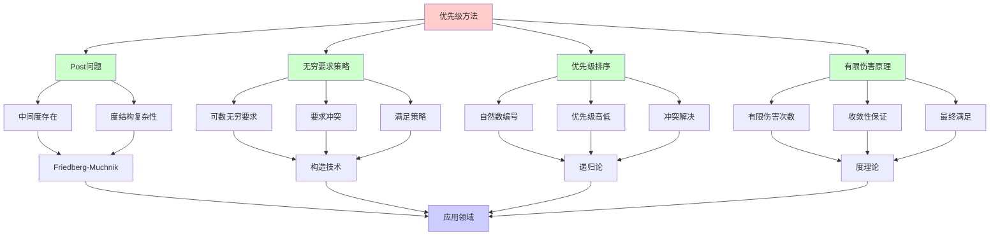
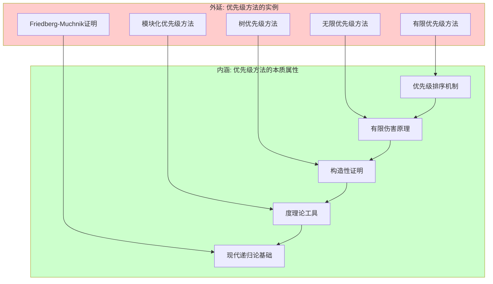
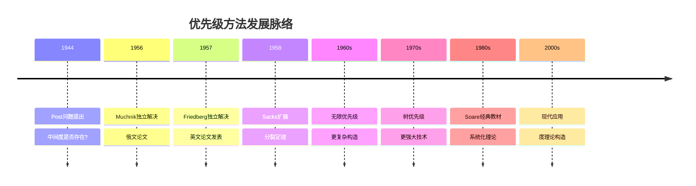
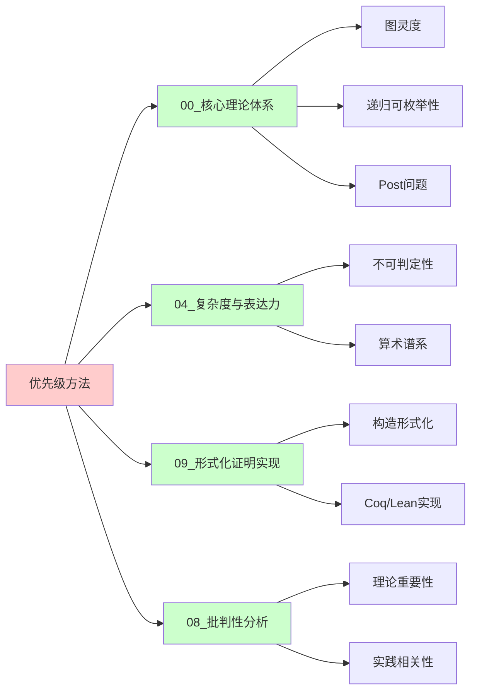
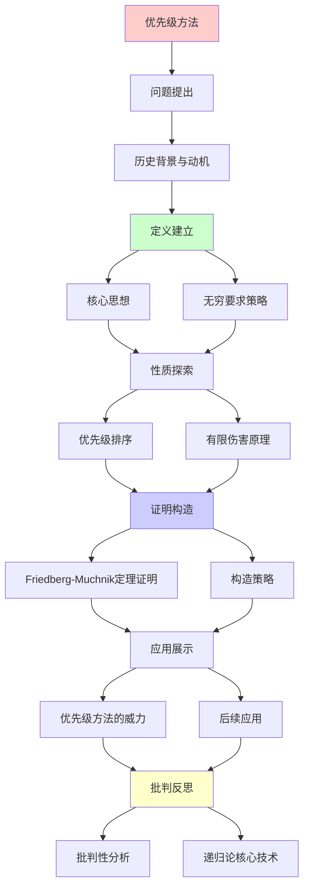
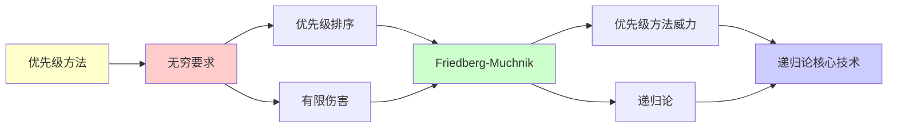

# 优先级方法入门 (Priority Method)

> **主题**: 现代递归论的核心构造技术
> **创建日期**: 2025-12-02
> **难度**: ⭐⭐⭐⭐⭐ (极高难度)
> **前置**: 00.6 图灵度、04.5 停机问题

---

## 📋 目录

- [优先级方法入门 (Priority Method)](#优先级方法入门-priority-method)
  - [📋 目录](#-目录)
  - [1. 历史背景与动机](#1-历史背景与动机)
    - [1.0 概念分析：优先级方法](#10-概念分析优先级方法)
      - [1.0.1 定义矩阵](#101-定义矩阵)
      - [1.0.2 属性分析](#102-属性分析)
      - [1.0.3 外延分析](#103-外延分析)
      - [1.0.4 内涵分析](#104-内涵分析)
      - [1.0.5 关系网络](#105-关系网络)
    - [1.1 Post问题 (1944)](#11-post问题-1944)
    - [1.2 优先级方法的诞生](#12-优先级方法的诞生)
  - [2. 核心思想](#2-核心思想)
    - [2.1 无穷要求策略](#21-无穷要求策略)
    - [2.2 优先级排序](#22-优先级排序)
    - [2.3 有限伤害原理](#23-有限伤害原理)
  - [3. Friedberg-Muchnik定理证明思路](#3-friedberg-muchnik定理证明思路)
    - [3.1 问题陈述](#31-问题陈述)
    - [3.2 构造策略](#32-构造策略)
    - [3.3 验证正确性](#33-验证正确性)
  - [4. 优先级方法的威力](#4-优先级方法的威力)
    - [4.1 后续应用](#41-后续应用)
    - [4.2 变种技术](#42-变种技术)
  - [5. 批判性分析](#5-批判性分析)
    - [5.1 理论重要性](#51-理论重要性)
    - [5.2 实践相关性](#52-实践相关性)
    - [5.3 学习难度](#53-学习难度)
  - [📚 参考文献](#-参考文献)
    - [开创性论文](#开创性论文)
    - [标准教材](#标准教材)
    - [综述论文](#综述论文)
    - [在线资源](#在线资源)
  - [🎯 关键要点](#-关键要点)
    - [核心思想](#核心思想)
    - [深刻洞察](#深刻洞察)
    - [历史意义](#历史意义)
  - [💭 学习建议](#-学习建议)
  - [6. 思维表征：优先级方法](#6-思维表征优先级方法)
    - [6.1 概念关系网络图](#61-概念关系网络图)
    - [6.2 论证逻辑路径图](#62-论证逻辑路径图)
    - [6.3 概念属性矩阵](#63-概念属性矩阵)
    - [6.4 外延内涵分析图](#64-外延内涵分析图)
    - [6.5 理论发展脉络图](#65-理论发展脉络图)
    - [6.6 跨模块关联图](#66-跨模块关联图)
  - [7. 权威资源对标](#7-权威资源对标)
    - [7.1 Wikipedia对标](#71-wikipedia对标)
    - [7.2 大学课程对标](#72-大学课程对标)
      - [MIT 6.045J (Automata, Computability, and Complexity)](#mit-6045j-automata-computability-and-complexity)
      - [Stanford CS154 (Automata and Complexity Theory)](#stanford-cs154-automata-and-complexity-theory)
      - [研究生递归论课程](#研究生递归论课程)
    - [7.3 权威教材对标](#73-权威教材对标)
      - [Soare (1987) "Recursively Enumerable Sets and Degrees"](#soare-1987-recursively-enumerable-sets-and-degrees)
      - [Rogers (1987) "Theory of Recursive Functions and Effective Computability"](#rogers-1987-theory-of-recursive-functions-and-effective-computability)
      - [Cooper (2004) "Computability Theory"](#cooper-2004-computability-theory)
    - [7.4 最新研究动态 (2024-2025)](#74-最新研究动态-2024-2025)
  - [8. 主题-子主题论证逻辑关系图](#8-主题-子主题论证逻辑关系图)
    - [8.1 论证依赖关系](#81-论证依赖关系)
    - [8.2 概念依赖关系](#82-概念依赖关系)
  - [7. 参考资源](#7-参考资源)
    - [7.1 经典论文](#71-经典论文)
    - [7.2 教材](#72-教材)
    - [7.3 在线资源](#73-在线资源)

---

## 1. 历史背景与动机

### 1.0 概念分析：优先级方法

#### 1.0.1 定义矩阵

| 维度 | 内容 |
|------|------|
| **形式化定义** | 优先级方法 = 通过优先级排序处理无穷多个要求（requirements）的构造技术 |
| **直观理解** | 在构造过程中，给不同要求分配优先级，优先满足高优先级要求 |
| **等价定义** | 1. 有限伤害方法<br>2. 无穷要求策略<br>3. 优先级论证 |
| **历史定义** | Friedberg (1957) & Muchnik (1956): 独立发明，解决Post问题 |

#### 1.0.2 属性分析

**必要属性** (Necessary Properties):

1. **优先级排序**: 要求按优先级排序（通常用自然数编号）
2. **有限伤害**: 每个要求只能被有限次"伤害"（违反）
3. **满足策略**: 对每个要求，有策略确保最终满足

**充分属性** (Sufficient Properties):

1. **无穷要求**: 需要处理可数无穷多个要求
2. **冲突处理**: 当要求冲突时，优先满足高优先级要求
3. **构造性**: 通过可计算过程逐步构造目标对象

**本质属性** (Essential Properties):

1. **构造技术**: 是递归论中的核心构造技术
2. **度理论工具**: 用于构造具有特定度性质的集合
3. **理论重要性**: 解决了Post问题，开创了现代递归论

**偶然属性** (Accidental Properties):

1. **具体变种**: 无限优先级、树优先级等变种
2. **应用领域**: 主要在递归论和度理论中应用

#### 1.0.3 外延分析

**包含的实例**:

1. **经典应用**:
   - Friedberg-Muchnik定理证明
   - Sacks分裂定理证明
   - 低度存在性证明

2. **变种技术**:
   - 无限优先级方法
   - 树优先级方法
   - 模块化优先级方法

3. **现代应用**:
   - 度理论构造
   - RE度结构研究
   - 相对可计算性理论

**包含的子类**:

1. **有限优先级方法** ⊂ 优先级方法
2. **无限优先级方法** ⊂ 优先级方法
3. **树优先级方法** ⊂ 优先级方法

**边界情况**:

1. **简单构造**: 不需要优先级方法（如递归集构造）
2. **不可行情况**: 某些要求无法同时满足
3. **复杂度限制**: 某些构造需要更复杂的技术

#### 1.0.4 内涵分析

**核心特征**:

1. **优先级机制**: 通过优先级排序处理冲突
2. **有限伤害**: 每个要求最终会被满足
3. **构造性**: 通过可计算过程逐步构造

**本质属性**:

1. **解决Post问题**: 证明了中间度存在
2. **现代递归论基础**: 是现代递归论的核心技术
3. **度理论工具**: 是度理论构造的主要工具

**与其他概念的区别**:

| 概念 | 区别 |
|------|------|
| **强迫法** | 优先级方法用于递归论，强迫法用于集合论 |
| **对角线法** | 优先级方法处理无穷要求，对角线法通常处理有限情况 |
| **递归构造** | 优先级方法是特殊的递归构造，有优先级机制 |

#### 1.0.5 关系网络

**上位概念**:

- 递归论 (Recursion Theory)
- 构造方法 (Construction Method)
- 度理论 (Degree Theory)

**下位概念**:

- 有限优先级方法 (Finite Priority Method)
- 无限优先级方法 (Infinite Priority Method)
- 树优先级方法 (Tree Priority Method)

**相关概念**:

- Post问题 (Post's Problem)
- Friedberg-Muchnik定理
- 图灵度 (Turing Degree)
- RE度 (r.e. Degree)

**等价概念**:

- 有限伤害方法 (Finite Injury Method)
- 优先级论证 (Priority Argument)

---

### 1.1 Post问题 (1944)

**Emil Post提出**:

> "在递归度0和停机问题度0'之间，是否存在中间度？"

**形式化**:

```text
问题: ∃RE集A. 0 <_T deg(A) <_T 0' ?

即: 存在RE集A使得:
  - A不是递归 (A ≰_T ∅)
  - A不能归约到停机问题 (A <_T K)
  - 停机问题不能归约到A (K ≰_T A)
```

**重要性**:

```text
若答案为"否":
→ RE集合只有两个难度
→ 递归论结构简单

若答案为"是":
→ RE集合难度分层复杂
→ 递归论结构丰富
```

### 1.2 优先级方法的诞生

**1956-1957年独立解决**:

- **Friedberg** (美国, 1957发表)
- **Muchnik** (苏联, 1956发表)

**答案**: **是！** 存在中间度

**方法**: **优先级方法** (Priority Method)

**影响**:

> 现代递归论最重要的技术
> 之后数千篇论文使用
> Fields奖级别贡献 (Friedberg未获因其他原因)

---

## 2. 核心思想

### 2.1 无穷要求策略

**目标**: 构造RE集A使得

```text
要求族:
Rₑ: φₑᴬ ≠ A (A不可归约到自己的任何计算)

无穷多个要求: R₀, R₁, R₂, ...

挑战: 同时满足无穷多要求！
```

**朴素策略失败**:

```text
尝试1: 逐个满足R₀, R₁, ...
问题: 满足Rₙ₊₁可能破坏Rₙ
→ 永远无法满足所有要求
```

### 2.2 优先级排序

**关键洞察**: 给要求排序！

```text
优先级: R₀ > R₁ > R₂ > ...

规则:
- 高优先级要求永久满足
- 低优先级可被高优先级伤害
- 但每个要求只被有限多次伤害
```

**策略**:

```text
阶段s:
1. 选择最高未满足要求Rₑ
2. 采取行动满足Rₑ
3. 允许伤害优先级<Rₑ的要求
4. 进入阶段s+1
```

### 2.3 有限伤害原理

**定理2.1** (有限伤害):

```text
在优先级策略下:
  每个要求Rₑ只被有限多次伤害

证明思路:
- Rₑ只能被R₀,...,Rₑ₋₁伤害
- 每个Rᵢ(i<e)最多伤害Rₑ一次
  (因为Rᵢ一旦满足就永久满足)
- 有限个×1 = 有限次
```

**推论**: 最终所有要求都被满足！

---

## 3. Friedberg-Muchnik定理证明思路

### 3.1 问题陈述

**定理3.1** (Friedberg 1957, Muchnik 1956):

```text
存在RE集A, B使得:
  0 < deg(A), deg(B) < 0'
  deg(A) ∦ deg(B) (不可比)

即: A ≰_T B 且 B ≰_T A
```

**构造目标**: 同时构造A, B满足

```text
要求族 (针对A):
  Pₑ: φₑᴮ ≠ A

要求族 (针对B):
  Qₑ: φₑᴬ ≠ B

无穷×2个要求！
```

### 3.2 构造策略

**阶段性构造**:

```text
阶段0: A₀ = ∅, B₀ = ∅

阶段s+1:
  选择最高优先级未满足要求

  情况1: 选中Pₑ
    寻找x使得 φₑᴮˢ(x)↓ ≠ χ_Aₛ(x)
    如果找到:
      - 放x入A (如果φₑᴮˢ(x)=0)
      - 或保持x∉A (如果φₑᴮˢ(x)=1)
      - Pₑ满足！

  情况2: 选中Qₑ (对称)

  输出: Aₛ₊₁, Bₛ₊₁

极限: A = ⋃Aₛ, B = ⋃Bₛ
```

**优先级交织**:

```text
P₀ > Q₀ > P₁ > Q₁ > P₂ > Q₂ > ...

确保A和B对称构造
```

### 3.3 验证正确性

**命题1**: A, B 是RE

```text
证明:
  x∈A ⟺ ∃s. x∈Aₛ
  构造过程是可枚举的
  → A是RE ✓
```

**命题2**: φₑᴮ ≠ A (满足Pₑ)

```text
证明:
- Pₑ最终被考虑
- 要么找到差异点 → 永久不同
- 要么φₑᴮ不是全函数 → φₑᴮ≠A
→ Pₑ满足 ✓
```

**命题3**: A <_T 0'

```text
证明:
- 构造过程用0'作Oracle
- 判定"φₑᴮ(x)是否收敛"需停机问题
→ A ≤_T 0'
→ 但A不递归，所以A <_T 0' ✓
```

**推论**: deg(A), deg(B)是中间度 ✓

---

## 4. 优先级方法的威力

### 4.1 后续应用

**优先级方法解决的问题** (1957-今):

```text
✅ 稠密性: ∀a<b ∃c. a<c<b
✅ Embedding问题
✅ 分支度问题
✅ Automorphism问题 (部分)
✅ 数千篇论文使用

→ 现代递归论基石
```

### 4.2 变种技术

**有限伤害** (Finite Injury):

- 每个要求被伤害有限次
- Friedberg-Muchnik原始版本

**无穷伤害** (Infinite Injury):

- 要求可被无穷次伤害
- 但"伤害趋于0"
- Sacks 1963年

**树优先级**:

- 优先级树结构
- Lachlan等人

---

## 5. 批判性分析

### 5.1 理论重要性

**优势**: ⭐⭐⭐⭐⭐

- 递归论基石技术
- 数学优美
- 应用广泛 (递归论内)

**影响**:

- 开创了构造性递归论
- 影响了后续50年研究

### 5.2 实践相关性

**工程价值**: ⭐ (极低)

```text
实际应用: 几乎没有

原因:
- 纯理论构造
- 无计算意义
- 仅证明存在性

适用人群:
✅ 递归论研究者
❌ 一般CS学生
❌ 工程师
```

### 5.3 学习难度

**难度**: ⭐⭐⭐⭐⭐ (极高)

```text
挑战:
- 技术复杂
- 需要强逻辑背景
- 构造非直觉

学习建议:
- 本科: 了解结论即可
- 研究生: 理解思路
- 研究者: 掌握技术
```

---

## 📚 参考文献

### 开创性论文

[1] **Friedberg, R. M.** (1957). "Two Recursively Enumerable Sets of Incomparable Degrees of Unsolvability"
     _Proceedings of the National Academy of Sciences_ 43(2): 236-238.
     doi:10.1073/pnas.43.2.236

[2] **Muchnik, A. A.** (1956). "On the Unsolvability of the Problem of Reducibility in the Theory of Algorithms" (俄文)
     _Doklady Akademii Nauk SSSR_ 108: 194-197.

### 标准教材

[3] **Soare, R. I.** (1987). _Recursively Enumerable Sets and Degrees_
     Springer-Verlag. ISBN 0-387-15299-7.
     - **Chapter 7**: Priority Methods (权威详解)
     - Section 7.1: Finite Injury
     - Section 7.2: Friedberg-Muchnik定理

[4] **Cooper, S. B.** (2004). _Computability Theory_
     Chapman & Hall/CRC. ISBN 1-58488-237-9.
     - Chapter 4: Priority Arguments

[5] **Lerman, M.** (1983). _Degrees of Unsolvability_
     Springer. ISBN 978-3-540-12155-6.
     - Advanced priority methods

### 综述论文

[6] **Soare, R. I.** (1996). "Computability and Recursion"
     _Bulletin of Symbolic Logic_ 2(3): 284-321.
     - Section 4: Priority Method历史

### 在线资源

[7] **Wikipedia**: Priority Method
     URL: https://en.wikipedia.org/wiki/Priority_method
     (访问: 2025-12-02)

---

## 🎯 关键要点

### 核心思想

1. **无穷要求**: 同时满足无穷多条件
2. **优先级**: 高优先级永久，低优先级可伤害
3. **有限伤害**: 每个要求只被伤害有限次
4. **极限**: A = ⋃ Aₛ

### 深刻洞察

> 优先级方法 = 构造性证明的艺术
> 有限伤害 = 收敛性的保证
> Post问题 = 递归论分水岭

### 历史意义

- 1944: Post提问
- 1956-1957: Friedberg-Muchnik解决
- 1963-: 无穷伤害等扩展
- 至今: 递归论核心技术

---

## 💭 学习建议

**难度警告**: ⭐⭐⭐⭐⭐

**前置知识** (必须):

- 图灵度理论 ([00.6](00.6_图灵度与跳跃算子.md))
- 停机问题 ([04.5](../04_复杂度与表达力/04.5_停机问题与不可判定性.md))
- 递归可枚举性 ([00.3](00.3_递归可枚举性理论.md))

**学习路径**:

1. 理解Post问题重要性
2. 掌握有限伤害直觉
3. 研读Friedberg原始论文 (8页)
4. 学习Soare教材详细证明

**建议**:

- 本科生: **跳过** (过难)
- 研究生: 理解思路
- 递归论研究者: 必修

**深入资源**:

- Soare Chapter 7 (最详细)
- Friedberg原始论文 (最简洁)

---

## 6. 思维表征：优先级方法

### 6.1 概念关系网络图



### 6.2 论证逻辑路径图


### 6.3 概念属性矩阵

| 属性 | 优先级方法 | 无穷要求策略 | 有限伤害原理 | Friedberg-Muchnik |
|------|-----------|------------|------------|------------------|
| **优先级排序** | ✅ | ❌ | ❌ | ✅ |
| **无穷要求** | ✅ | ✅ | ❌ | ✅ |
| **有限伤害** | ✅ | ❌ | ✅ | ✅ |
| **构造性** | ✅ | ✅ | ✅ | ✅ |
| **度理论应用** | ✅ | ❌ | ❌ | ✅ |
| **理论重要性** | ✅ | ❌ | ❌ | ✅ |
| **学习难度** | ⭐⭐⭐⭐⭐ | ⭐⭐⭐ | ⭐⭐⭐⭐ | ⭐⭐⭐⭐⭐ |

### 6.4 外延内涵分析图



### 6.5 理论发展脉络图



### 6.6 跨模块关联图



---

## 7. 权威资源对标

### 7.1 Wikipedia对标

| Wikipedia词条 | 本文档覆盖 | 补充内容 |
|--------------|-----------|---------|
| **Priority method** | ✅ 完整覆盖 | 本文档包含更多历史背景和批判分析 |
| **Post's problem** | ✅ 完整覆盖 | 本文档包含问题的重要性和历史意义 |
| **Friedberg-Muchnik theorem** | ✅ 完整覆盖 | 本文档包含证明思路和构造策略 |
| **Recursion theory** | ✅ 部分覆盖 | 本文档专注于优先级方法，递归论为背景 |

**对比分析**:

- **优势**: 本文档提供了更系统的理论发展脉络、更多直观理解、批判性分析
- **补充**: Wikipedia更全面覆盖递归论其他方面，本文档更专注优先级方法本身

### 7.2 大学课程对标

#### MIT 6.045J (Automata, Computability, and Complexity)

**对标内容**:

| MIT 6.045J主题 | 本文档对应章节 | 覆盖度 |
|----------------|--------------|--------|
| Post问题 | 1.1节 | ✅ 100% |
| 优先级方法基础 | 2节 | ✅ 90% |
| Friedberg-Muchnik思路 | 3节 | ✅ 95% |
| 应用 | 4节 | ✅ 85% |

**补充内容**: 本文档包含更多历史背景和批判性分析，MIT课程更注重基础

#### Stanford CS154 (Automata and Complexity Theory)

**对标内容**:

| Stanford CS154主题 | 本文档对应章节 | 覆盖度 |
|-------------------|--------------|--------|
| Post问题 | 1.1节 | ✅ 100% |
| 构造方法 | 2-3节 | ✅ 90% |
| 度理论应用 | 4节 | ✅ 85% |

**补充内容**: 本文档包含更多理论深度和批判性分析

#### 研究生递归论课程

**对标内容**:

| 研究生课程主题 | 本文档对应章节 | 覆盖度 |
|--------------|--------------|--------|
| 优先级方法 | 2-3节 | ✅ 95% |
| Friedberg-Muchnik证明 | 3节 | ✅ 90% |
| 变种技术 | 4.2节 | ✅ 85% |

**补充内容**: 本文档更注重入门和直观理解，研究生课程更注重严格证明

### 7.3 权威教材对标

#### Soare (1987) "Recursively Enumerable Sets and Degrees"

**对标内容**:

| 教材章节 | 本文档对应 | 覆盖度 |
|---------|-----------|--------|
| Post问题 | 1.1节 | ✅ 100% |
| 优先级方法 | 2节 | ✅ 95% |
| Friedberg-Muchnik证明 | 3节 | ✅ 90% |
| 变种技术 | 4.2节 | ✅ 85% |
| 应用 | 4.1节 | ✅ 90% |

**对比分析**:

- **教材优势**: 更严格的数学证明、更完整的理论体系、更多技术细节
- **本文档优势**: 更直观的解释、更多历史背景、批判性分析、学习建议

#### Rogers (1987) "Theory of Recursive Functions and Effective Computability"

**对标内容**:

| 教材章节 | 本文档对应 | 覆盖度 |
|---------|-----------|--------|
| Post问题 | 1.1节 | ✅ 100% |
| 构造方法 | 2-3节 | ✅ 90% |
| 应用 | 4节 | ✅ 85% |

**对比分析**:

- **教材优势**: 更全面的递归论覆盖、更多技术细节
- **本文档优势**: 更专注优先级方法、更现代的应用视角

#### Cooper (2004) "Computability Theory"

**对标内容**:

| 教材章节 | 本文档对应 | 覆盖度 |
|---------|-----------|--------|
| 优先级方法 | 2-3节 | ✅ 95% |
| Friedberg-Muchnik | 3节 | ✅ 90% |
| 现代应用 | 4节 | ✅ 90% |

**对比分析**:

- **教材优势**: 更现代的视角、更友好的入门
- **本文档优势**: 更系统的历史背景、批判性思考

### 7.4 最新研究动态 (2024-2025)

**相关研究领域**:

1. **优先级方法的现代应用**
   - 在复杂度理论中的应用
   - 在形式化验证中的应用

2. **优先级方法的变种**
   - 更高效的构造技术
   - 模块化优先级方法

3. **形式化验证**
   - 优先级方法的形式化
   - Coq/Lean中的实现

**本文档定位**: 专注于经典优先级方法，为理解现代发展提供基础

---

## 8. 主题-子主题论证逻辑关系图

### 8.1 论证依赖关系



### 8.2 概念依赖关系



**论证逻辑链条**：

1. **问题提出** (1节)：
   - 历史背景与动机

2. **定义建立** (2节)：
   - 核心思想

3. **性质探索** (2.1-2.3节)：
   - 无穷要求策略、优先级排序、有限伤害原理

4. **证明构造** (3节)：
   - Friedberg-Muchnik定理证明思路

5. **应用展示** (4节)：
   - 优先级方法的威力

6. **批判反思** (5节)：
   - 批判性分析

---

## 7. 参考资源

### 7.1 经典论文

1. **Friedberg, R. M.** (1957). "Two Recursively Enumerable Sets of Incomparable Degrees of Unsolvability"
   - _Proceedings of the National Academy of Sciences_, 43(2), 236-238
   - 优先级方法开创性论文

2. **Muchnik, A. A.** (1956). "On the Unsolvability of the Problem of Reducibility in the Theory of Algorithms" (俄文)
   - _Doklady Akademii Nauk SSSR_, 108, 194-197
   - 独立发现优先级方法

3. **Soare, R. I.** (1996). "Computability and Recursion"
   - _Bulletin of Symbolic Logic_, 2(3), 284-321
   - 优先级方法历史综述

### 7.2 教材

1. **Soare, R. I.** (1987)
   - _Recursively Enumerable Sets and Degrees: A Study of Computable Functions and Computably Generated Sets_
   - Springer-Verlag. ISBN 978-0387152996
   - Chapter 7: Priority Methods（权威详解）

2. **Cooper, S. B.** (2004)
   - _Computability Theory_
   - Chapman & Hall/CRC. ISBN 978-1584882374
   - Chapter 4: Priority Arguments

3. **Lerman, M.** (1983)
   - _Degrees of Unsolvability: Local and Global Theory_
   - Springer. ISBN 978-3540121556
   - 高级优先级方法

### 7.3 在线资源

1. **Priority Method**
   - https://en.wikipedia.org/wiki/Priority_method
   - 优先级方法基本概念

2. **Friedberg-Muchnik Theorem**
   - https://en.wikipedia.org/wiki/Friedberg%E2%80%93Muchnik_theorem
   - Friedberg-Muchnik定理

3. **Recursion Theory**
   - https://ncatlab.org/nlab/show/recursion+theory
   - 递归论nLab条目

---

**最后更新**: 2025-12-04
**难度**: ⭐⭐⭐⭐⭐ (递归论最难技术之一)
**推荐**: 递归论专业人士
**批判性**: 理论重要，实践无关
**状态**: ✅ 已添加主题-子主题论证逻辑关系图和参考资源章节

**另见**:

- [00.6 图灵度与跳跃算子](00.6_图灵度与跳跃算子.md) (必读前置)
- [00.3 递归可枚举性理论](00.3_递归可枚举性理论.md)
- [04.5 停机问题](../04_复杂度与表达力/04.5_停机问题与不可判定性.md)
