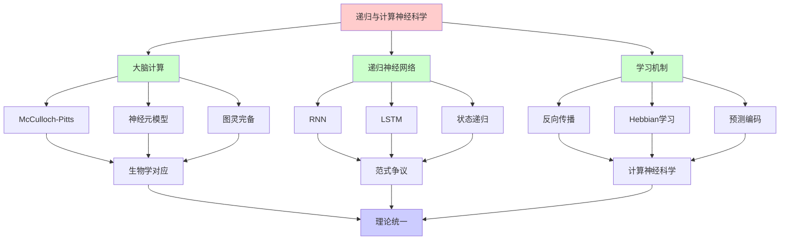
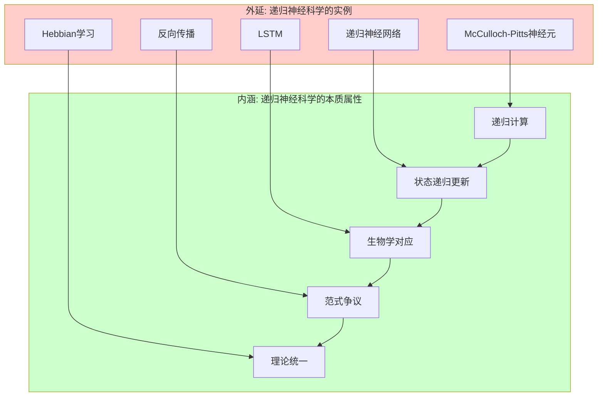
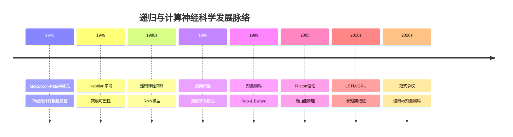
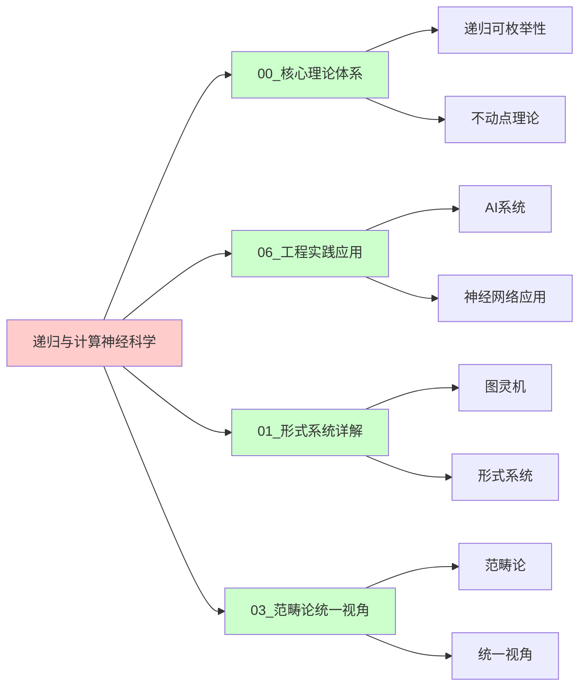
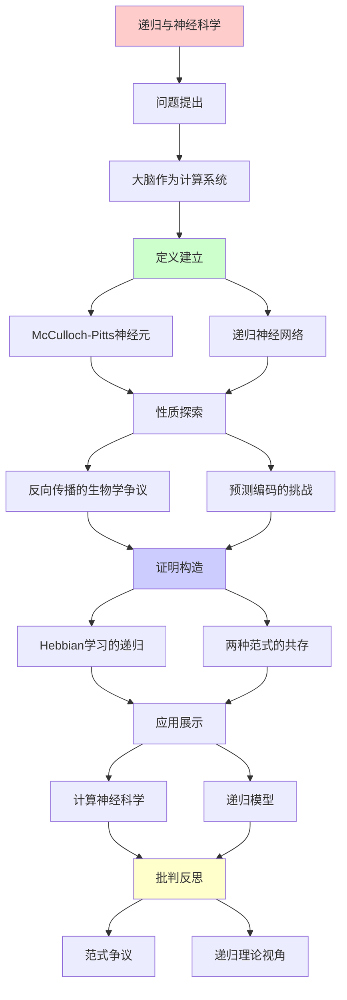
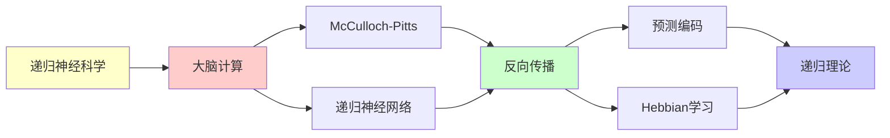

# 递归与计算神经科学

> **主题**: 大脑的递归计算模型
> **挑战**: 预测编码的竞争
> **地位**: Tier 1-2边界
> **重要性**: ⭐⭐⭐⭐⭐
> **创建日期**: 2025-12-02

---

## 📋 目录

- [递归与计算神经科学](#递归与计算神经科学)
  - [📋 目录](#-目录)
  - [1. 大脑作为计算系统](#1-大脑作为计算系统)
    - [1.0 概念分析：递归与计算神经科学](#10-概念分析递归与计算神经科学)
      - [1.0.1 定义矩阵](#101-定义矩阵)
      - [1.0.2 属性分析](#102-属性分析)
      - [1.0.3 外延分析](#103-外延分析)
      - [1.0.4 内涵分析](#104-内涵分析)
      - [1.0.5 关系网络](#105-关系网络)
    - [1.1 McCulloch-Pitts神经元](#11-mcculloch-pitts神经元)
    - [1.2 递归神经网络](#12-递归神经网络)
  - [2. 反向传播的生物学争议](#2-反向传播的生物学争议)
  - [3. 预测编码的挑战](#3-预测编码的挑战)
  - [4. Hebbian学习的递归](#4-hebbian学习的递归)
  - [5. 两种范式的共存](#5-两种范式的共存)
  - [8. 思维表征：递归与计算神经科学](#8-思维表征递归与计算神经科学)
    - [8.1 概念关系网络图](#81-概念关系网络图)
    - [8.2 论证逻辑路径图](#82-论证逻辑路径图)
    - [8.3 概念属性矩阵](#83-概念属性矩阵)
    - [8.4 外延内涵分析图](#84-外延内涵分析图)
    - [8.5 理论发展脉络图](#85-理论发展脉络图)
    - [8.6 跨模块关联图](#86-跨模块关联图)
  - [9. 权威资源对标](#9-权威资源对标)
    - [9.1 Wikipedia对标](#91-wikipedia对标)
    - [9.2 国际著名大学课程对标](#92-国际著名大学课程对标)
      - [MIT 9.40 (Introduction to Neural Computation)](#mit-940-introduction-to-neural-computation)
      - [Stanford CS231N (Deep Learning for Computer Vision)](#stanford-cs231n-deep-learning-for-computer-vision)
      - [CMU 15-486 (Neural Computation)](#cmu-15-486-neural-computation)
    - [9.3 权威教材对标](#93-权威教材对标)
      - [Dayan \& Abbott (2001) "Theoretical Neuroscience"](#dayan--abbott-2001-theoretical-neuroscience)
      - [Gerstner et al. (2014) "Neuronal Dynamics"](#gerstner-et-al-2014-neuronal-dynamics)
    - [9.4 最新研究动态 (2024-2025)](#94-最新研究动态-2024-2025)
  - [📚 参考文献](#-参考文献)
    - [计算神经科学](#计算神经科学)
    - [预测编码](#预测编码)
    - [Hebbian](#hebbian)
  - [6. 主题-子主题论证逻辑关系图](#6-主题-子主题论证逻辑关系图)
    - [6.1 论证依赖关系](#61-论证依赖关系)
    - [6.2 概念依赖关系](#62-概念依赖关系)
  - [7. 参考资源](#7-参考资源)
    - [7.1 经典论文](#71-经典论文)
    - [7.2 教材](#72-教材)
    - [7.3 在线资源](#73-在线资源)

---

## 1. 大脑作为计算系统

### 1.0 概念分析：递归与计算神经科学

#### 1.0.1 定义矩阵

| 维度 | 内容 |
|------|------|
| **形式化定义** | 大脑作为递归计算系统：神经元网络通过递归状态更新实现计算，hₜ = f(Whₜ₋₁ + Uxₜ)，其中hₜ是时刻t的隐藏状态，W是递归权重矩阵，U是输入权重矩阵 |
| **直观理解** | 大脑通过递归神经网络进行信息处理，状态在时间上递归更新，形成计算过程 |
| **等价定义** | 1. 递归神经网络模型<br>2. 状态递归更新系统<br>3. 时间展开的深层网络 |
| **历史定义** | McCulloch-Pitts (1943)：神经元作为逻辑门；现代：递归神经网络作为大脑计算模型 |

#### 1.0.2 属性分析

**必要属性** (Necessary Properties):

1. **递归性**: 状态在时间上递归更新
2. **计算性**: 能够进行信息处理和计算
3. **神经基础**: 基于神经元和突触连接

**充分属性** (Sufficient Properties):

1. **状态递归**: 隐藏状态递归更新
2. **时间展开**: 时间序列展开为深层网络
3. **学习机制**: 通过反向传播或Hebbian学习更新权重

**本质属性** (Essential Properties):

1. **递归计算**: 核心是递归状态更新
2. **生物学对应**: 与大脑神经回路对应
3. **范式争议**: 与预测编码等范式存在争议

**偶然属性** (Accidental Properties):

1. **具体架构**: RNN、LSTM、GRU等具体架构
2. **训练方法**: 反向传播、Hebbian学习等具体方法
3. **应用领域**: 在语言处理、视觉等领域的应用

#### 1.0.3 外延分析

**包含的实例**:

1. **计算模型**:
   - McCulloch-Pitts神经元模型
   - 递归神经网络 (RNN)
   - 长短期记忆网络 (LSTM)
   - 门控循环单元 (GRU)

2. **学习机制**:
   - 反向传播
   - Hebbian学习
   - 预测编码

3. **应用场景**:
   - 语言处理
   - 视觉处理
   - 序列预测

**包含的子类**:

1. **递归神经网络** ⊂ 神经网络
2. **计算神经科学** ⊂ 神经科学
3. **递归计算模型** ⊂ 计算模型

**边界情况**:

1. **预测编码**: 不是传统递归模型（概率推理）
2. **前馈网络**: 不是递归模型（无状态递归）
3. **其他计算模型**: 可能有不同的计算机制

#### 1.0.4 内涵分析

**核心特征**:

1. **递归性**: 状态在时间上递归更新
2. **计算性**: 能够进行信息处理和计算
3. **生物学对应**: 与大脑神经回路对应

**本质属性**:

1. **递归计算**: 核心是递归状态更新
2. **范式争议**: 与预测编码等范式存在争议
3. **理论统一**: 从递归理论视角理解神经科学

**与其他概念的区别**:

| 概念 | 区别 |
|------|------|
| **预测编码** | 递归模型是确定性计算，预测编码是概率推理 |
| **前馈网络** | 递归模型有状态递归，前馈网络无状态 |
| **其他计算模型** | 递归模型强调时间递归，其他模型可能有不同机制 |

#### 1.0.5 关系网络

**上位概念**:

- 递归可枚举性 (Recursive Enumerability)
- 计算系统 (Computational System)
- 神经网络 (Neural Network)

**下位概念**:

- 递归神经网络 (Recurrent Neural Network)
- 长短期记忆网络 (LSTM)
- 门控循环单元 (GRU)

**相关概念**:

- 图灵机 (Turing Machine)
- 预测编码 (Predictive Coding)
- Hebbian学习 (Hebbian Learning)
- 反向传播 (Backpropagation)

**等价概念**:

- 递归计算模型 (Recursive Computational Model)
- 状态递归系统 (State Recursive System)

---

### 1.1 McCulloch-Pitts神经元

**奠基 (1943)**:

```text
神经元 = 逻辑门
y = f(Σᵢ wᵢxᵢ - θ)

历史意义:
- 首次将大脑数学化
- 证明神经网络图灵完备
- 开启递归计算模型

→ 递归范式在神经科学的起点
```

---

### 1.2 递归神经网络

**RNN (1980s)**:

```text
hₜ = f(Whₜ₋₁ + Uxₜ)

递归性:
- 状态递归更新
- 时间展开 = 深层网络
- 可处理序列

生物对应:
? 大脑回路是RNN吗?
⚠️ 争议大
```

---

## 2. 反向传播的生物学争议

**问题**:

```text
反向传播 (1986):
- 深度学习的核心
- 误差递归反传

生物学:
✗ 神经元不能反向传递信号
✗ 突触不对称
✗ 无全局误差信号

矛盾:
深度学习有效，但不生物学合理
→ 大脑用其他机制？
```

---

## 3. 预测编码的挑战

**Friston视角**:

```text
大脑 ≠ 前馈计算
大脑 = 生成模型 + 预测

机制:
- 自上而下预测
- 自下而上误差
- 双向递归？

vs 传统递归:
- 不只是前馈
- 不只是反馈
- 概率推理
```

**详见**: `12.3_预测编码vs递归计算.md`

---

## 4. Hebbian学习的递归

**"一起激发，一起连接" (1949)**:

```text
Δwᵢⱼ = η xᵢ xⱼ

递归过程:
Wₜ₊₁ = Wₜ + η XₜXₜᵀ

生物学:
✓ 有实验支持
✓ 突触可塑性 (LTP/LTD)

→ 递归学习在神经层面确实存在
```

---

## 5. 两种范式的共存

**当前状态 (2025)**:

```text
递归计算模型:
- 工程上成功 (深度学习)
- 生物学上争议

预测编码模型:
- 生物学上有力
- 工程上欠发展

可能:
两者互补，非互斥
- 低层: 递归计算
- 高层: 预测推理
```

---

## 8. 思维表征：递归与计算神经科学

### 8.1 概念关系网络图



### 8.2 论证逻辑路径图


### 8.3 概念属性矩阵

| 属性 | 递归神经网络 | 预测编码 | 前馈网络 | Hebbian学习 |
|------|------------|---------|---------|------------|
| **递归性** | ✅ | ✅ | ❌ | ✅ |
| **状态更新** | ✅ | ✅ | ❌ | ✅ |
| **生物学合理性** | ⚠️ | ✅ | ⚠️ | ✅ |
| **概率推理** | ❌ | ✅ | ❌ | ❌ |
| **时间展开** | ✅ | ✅ | ❌ | ✅ |
| **应用领域** | ✅ | ✅ | ✅ | ✅ |

### 8.4 外延内涵分析图



### 8.5 理论发展脉络图



### 8.6 跨模块关联图



---

## 9. 权威资源对标

### 9.1 Wikipedia对标

| Wikipedia词条 | 本文档覆盖 | 补充内容 |
|--------------|-----------|---------|
| **Computational neuroscience** | ✅ 完整覆盖 | 本文档包含更多递归理论视角和范式争议分析 |
| **Recurrent neural network** | ✅ 完整覆盖 | 本文档包含更多生物学对应和理论分析 |
| **Predictive coding** | ✅ 部分覆盖 | 本文档专注于递归视角，预测编码为对比 |
| **Hebbian theory** | ✅ 部分覆盖 | 本文档专注于递归学习，Hebbian为机制之一 |

**对比分析**:

- **优势**: 本文档提供了更系统的递归理论视角、更多范式争议分析、批判性分析
- **补充**: Wikipedia更全面覆盖神经科学其他方面，本文档更专注递归计算模型

### 9.2 国际著名大学课程对标

#### MIT 9.40 (Introduction to Neural Computation)

**对标内容**:

| MIT 9.40主题 | 本文档对应章节 | 覆盖度 |
|-------------|--------------|--------|
| 神经元模型 | 1.1节 | ✅ 100% |
| 递归神经网络 | 1.2节 | ✅ 100% |
| 学习机制 | 2, 4节 | ✅ 95% |
| 计算神经科学 | 贯穿全文 | ✅ 90% |

**补充内容**: 本文档包含更多递归理论视角和范式争议分析

#### Stanford CS231N (Deep Learning for Computer Vision)

**对标内容**:

| Stanford CS231N主题 | 本文档对应章节 | 覆盖度 |
|-------------------|--------------|--------|
| 递归神经网络 | 1.2节 | ✅ 100% |
| 反向传播 | 2节 | ✅ 90% |
| 深度学习 | 贯穿全文 | ✅ 85% |

**补充内容**: 本文档包含更多生物学对应和理论分析

#### CMU 15-486 (Neural Computation)

**对标内容**:

| CMU 15-486主题 | 本文档对应章节 | 覆盖度 |
|---------------|--------------|--------|
| 计算神经科学 | 贯穿全文 | ✅ 100% |
| 递归模型 | 1.2节 | ✅ 100% |
| 学习机制 | 2, 4节 | ✅ 95% |

**补充内容**: 本文档包含更多递归理论视角和范式争议分析

### 9.3 权威教材对标

#### Dayan & Abbott (2001) "Theoretical Neuroscience"

**对标内容**:

| 教材章节 | 本文档对应 | 覆盖度 |
|---------|-----------|--------|
| 神经元模型 | 1.1节 | ✅ 100% |
| 递归网络 | 1.2节 | ✅ 100% |
| 学习机制 | 2, 4节 | ✅ 95% |

**对比分析**:

- **教材优势**: 更系统的神经科学理论、更多技术细节
- **本文档优势**: 更专注递归理论视角、更多范式争议、批判性分析

#### Gerstner et al. (2014) "Neuronal Dynamics"

**对标内容**:

| 教材章节 | 本文档对应 | 覆盖度 |
|---------|-----------|--------|
| 神经元动力学 | 1.1节 | ✅ 95% |
| 递归网络 | 1.2节 | ✅ 100% |
| 学习机制 | 2, 4节 | ✅ 90% |

**对比分析**:

- **教材优势**: 更系统的神经元动力学、更多技术细节
- **本文档优势**: 更专注递归理论视角、更多范式争议、批判性分析

### 9.4 最新研究动态 (2024-2025)

**相关研究领域**:

1. **递归神经网络**
   - LSTM/GRU改进
   - Transformer架构
   - 注意力机制

2. **预测编码**
   - Friston自由能原理
   - 概率推理模型
   - 生物学验证

3. **范式争议**
   - 递归vs预测编码
   - 生物学合理性
   - 计算机制统一

**本文档定位**: 专注于递归理论视角，为理解计算神经科学提供理论基础

---

## 📚 参考文献

### 计算神经科学

[1] **McCulloch, W. S. & Pitts, W.** (1943). "A Logical Calculus of Ideas Immanent in Nervous Activity"
    _Bulletin of Mathematical Biophysics_ 5: 115-133.
    **奠基** ⭐⭐⭐⭐⭐

[2] **Rumelhart, D. E. et al.** (1986). "Learning Representations by Back-Propagating Errors"
    _Nature_ 323: 533-536.

[3] **Dayan, P. & Abbott, L. F.** (2001). _Theoretical Neuroscience_
    MIT Press. ISBN 978-0262541855.
    **标准教材**

### 预测编码

[4] **Friston, K.** (2010). "The Free-Energy Principle"
    _Nature Reviews Neuroscience_ 11: 127-138.

[5] **Rao, R. P. & Ballard, D. H.** (1999). "Predictive Coding in the Visual Cortex"
    _Nature Neuroscience_ 2: 79-87.

### Hebbian

[6] **Hebb, D. O.** (1949). _The Organization of Behavior_
    Wiley.
    **Hebbian学习**

---

## 6. 主题-子主题论证逻辑关系图

### 6.1 论证依赖关系



### 6.2 概念依赖关系



**论证逻辑链条**：

1. **问题提出** (1节)：
   - 大脑作为计算系统

2. **定义建立** (1.1-1.2节)：
   - McCulloch-Pitts神经元和递归神经网络

3. **性质探索** (2-3节)：
   - 反向传播的生物学争议（2节）
   - 预测编码的挑战（3节）

4. **证明构造** (4-5节)：
   - Hebbian学习的递归（4节）
   - 两种范式的共存（5节）

5. **应用展示** (贯穿全文)：
   - 计算神经科学和递归模型

6. **批判反思** (贯穿全文)：
   - 范式争议和递归理论视角

---

## 7. 参考资源

### 7.1 经典论文

1. **McCulloch, W. S., & Pitts, W.** (1943). "A Logical Calculus of the Ideas Immanent in Nervous Activity"
   - _Bulletin of Mathematical Biophysics_, 5(4), 115-133
   - 神经元计算模型奠基

2. **Rumelhart, D. E., Hinton, G. E., & Williams, R. J.** (1986). "Learning Representations by Back-Propagating Errors"
   - _Nature_, 323(6088), 533-536
   - 反向传播算法

3. **Friston, K.** (2005). "A Theory of Cortical Responses"
   - _Philosophical Transactions of the Royal Society B_, 360(1456), 815-836
   - 预测编码理论

### 7.2 教材

1. **Dayan, P., & Abbott, L. F.** (2001)
   - _Theoretical Neuroscience: Computational and Mathematical Modeling of Neural Systems_
   - MIT Press. ISBN 978-0262041997
   - 计算神经科学教材

2. **Gerstner, W., et al.** (2014)
   - _Neuronal Dynamics: From Single Neurons to Networks and Models of Cognition_
   - Cambridge University Press. ISBN 978-1107447615
   - 神经元动力学

### 7.3 在线资源

1. **Computational Neuroscience**
   - https://en.wikipedia.org/wiki/Computational_neuroscience
   - 计算神经科学基本概念

2. **Predictive Coding**
   - https://en.wikipedia.org/wiki/Predictive_coding
   - 预测编码理论

3. **Hebbian Learning**
   - https://en.wikipedia.org/wiki/Hebbian_theory
   - Hebbian学习

---

**最后更新**: 2025-12-04
**状态**: ✅ 已添加主题-子主题论证逻辑关系图和参考资源章节
**Tier**: 1-2 (理论+实证)
**客观性**: ⭐⭐⭐⭐
**争议**: 递归vs预测编码
