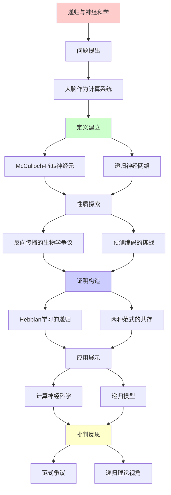
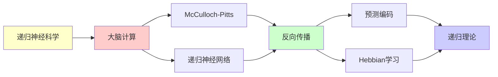

# 递归与计算神经科学

> **主题**: 大脑的递归计算模型
> **挑战**: 预测编码的竞争
> **地位**: Tier 1-2边界
> **重要性**: ⭐⭐⭐⭐⭐
> **创建日期**: 2025-12-02

---

## 📋 目录

- [递归与计算神经科学](#递归与计算神经科学)
  - [📋 目录](#-目录)
  - [1. 大脑作为计算系统](#1-大脑作为计算系统)
    - [1.1 McCulloch-Pitts神经元](#11-mcculloch-pitts神经元)
    - [1.2 递归神经网络](#12-递归神经网络)
  - [2. 反向传播的生物学争议](#2-反向传播的生物学争议)
  - [3. 预测编码的挑战](#3-预测编码的挑战)
  - [4. Hebbian学习的递归](#4-hebbian学习的递归)
  - [5. 两种范式的共存](#5-两种范式的共存)
  - [📚 参考文献](#-参考文献)
    - [计算神经科学](#计算神经科学)
    - [预测编码](#预测编码)
    - [Hebbian](#hebbian)

---

## 1. 大脑作为计算系统

### 1.1 McCulloch-Pitts神经元

**奠基 (1943)**:

```text
神经元 = 逻辑门
y = f(Σᵢ wᵢxᵢ - θ)

历史意义:
- 首次将大脑数学化
- 证明神经网络图灵完备
- 开启递归计算模型

→ 递归范式在神经科学的起点
```

---

### 1.2 递归神经网络

**RNN (1980s)**:

```text
hₜ = f(Whₜ₋₁ + Uxₜ)

递归性:
- 状态递归更新
- 时间展开 = 深层网络
- 可处理序列

生物对应:
? 大脑回路是RNN吗?
⚠️ 争议大
```

---

## 2. 反向传播的生物学争议

**问题**:

```text
反向传播 (1986):
- 深度学习的核心
- 误差递归反传

生物学:
✗ 神经元不能反向传递信号
✗ 突触不对称
✗ 无全局误差信号

矛盾:
深度学习有效，但不生物学合理
→ 大脑用其他机制？
```

---

## 3. 预测编码的挑战

**Friston视角**:

```text
大脑 ≠ 前馈计算
大脑 = 生成模型 + 预测

机制:
- 自上而下预测
- 自下而上误差
- 双向递归？

vs 传统递归:
- 不只是前馈
- 不只是反馈
- 概率推理
```

**详见**: `12.3_预测编码vs递归计算.md`

---

## 4. Hebbian学习的递归

**"一起激发，一起连接" (1949)**:

```text
Δwᵢⱼ = η xᵢ xⱼ

递归过程:
Wₜ₊₁ = Wₜ + η XₜXₜᵀ

生物学:
✓ 有实验支持
✓ 突触可塑性 (LTP/LTD)

→ 递归学习在神经层面确实存在
```

---

## 5. 两种范式的共存

**当前状态 (2025)**:

```text
递归计算模型:
- 工程上成功 (深度学习)
- 生物学上争议

预测编码模型:
- 生物学上有力
- 工程上欠发展

可能:
两者互补，非互斥
- 低层: 递归计算
- 高层: 预测推理
```

---

## 📚 参考文献

### 计算神经科学

[1] **McCulloch, W. S. & Pitts, W.** (1943). "A Logical Calculus of Ideas Immanent in Nervous Activity"
    _Bulletin of Mathematical Biophysics_ 5: 115-133.
    **奠基** ⭐⭐⭐⭐⭐

[2] **Rumelhart, D. E. et al.** (1986). "Learning Representations by Back-Propagating Errors"
    _Nature_ 323: 533-536.

[3] **Dayan, P. & Abbott, L. F.** (2001). _Theoretical Neuroscience_
    MIT Press. ISBN 978-0262541855.
    **标准教材**

### 预测编码

[4] **Friston, K.** (2010). "The Free-Energy Principle"
    _Nature Reviews Neuroscience_ 11: 127-138.

[5] **Rao, R. P. & Ballard, D. H.** (1999). "Predictive Coding in the Visual Cortex"
    _Nature Neuroscience_ 2: 79-87.

### Hebbian

[6] **Hebb, D. O.** (1949). _The Organization of Behavior_
    Wiley.
    **Hebbian学习**

---

## 6. 主题-子主题论证逻辑关系图

### 6.1 论证依赖关系



### 6.2 概念依赖关系



**论证逻辑链条**：

1. **问题提出** (1节)：
   - 大脑作为计算系统

2. **定义建立** (1.1-1.2节)：
   - McCulloch-Pitts神经元和递归神经网络

3. **性质探索** (2-3节)：
   - 反向传播的生物学争议（2节）
   - 预测编码的挑战（3节）

4. **证明构造** (4-5节)：
   - Hebbian学习的递归（4节）
   - 两种范式的共存（5节）

5. **应用展示** (贯穿全文)：
   - 计算神经科学和递归模型

6. **批判反思** (贯穿全文)：
   - 范式争议和递归理论视角

---

## 7. 参考资源

### 7.1 经典论文

1. **McCulloch, W. S., & Pitts, W.** (1943). "A Logical Calculus of the Ideas Immanent in Nervous Activity"
   - _Bulletin of Mathematical Biophysics_, 5(4), 115-133
   - 神经元计算模型奠基

2. **Rumelhart, D. E., Hinton, G. E., & Williams, R. J.** (1986). "Learning Representations by Back-Propagating Errors"
   - _Nature_, 323(6088), 533-536
   - 反向传播算法

3. **Friston, K.** (2005). "A Theory of Cortical Responses"
   - _Philosophical Transactions of the Royal Society B_, 360(1456), 815-836
   - 预测编码理论

### 7.2 教材

1. **Dayan, P., & Abbott, L. F.** (2001)
   - _Theoretical Neuroscience: Computational and Mathematical Modeling of Neural Systems_
   - MIT Press. ISBN 978-0262041997
   - 计算神经科学教材

2. **Gerstner, W., et al.** (2014)
   - _Neuronal Dynamics: From Single Neurons to Networks and Models of Cognition_
   - Cambridge University Press. ISBN 978-1107447615
   - 神经元动力学

### 7.3 在线资源

1. **Computational Neuroscience**
   - https://en.wikipedia.org/wiki/Computational_neuroscience
   - 计算神经科学基本概念

2. **Predictive Coding**
   - https://en.wikipedia.org/wiki/Predictive_coding
   - 预测编码理论

3. **Hebbian Learning**
   - https://en.wikipedia.org/wiki/Hebbian_theory
   - Hebbian学习

---

**最后更新**: 2025-12-04
**状态**: ✅ 已添加主题-子主题论证逻辑关系图和参考资源章节
**Tier**: 1-2 (理论+实证)
**客观性**: ⭐⭐⭐⭐
**争议**: 递归vs预测编码
