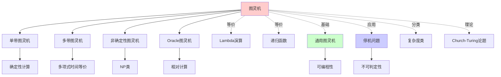
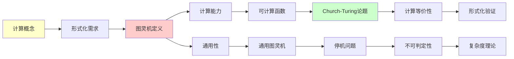
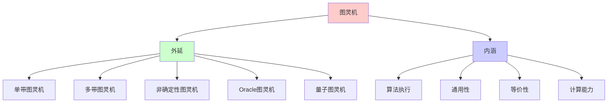
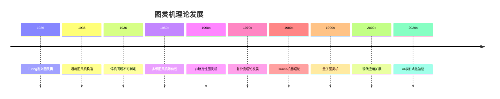
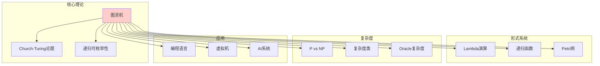
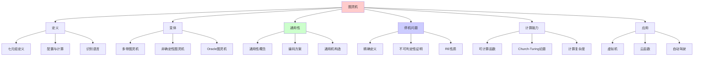
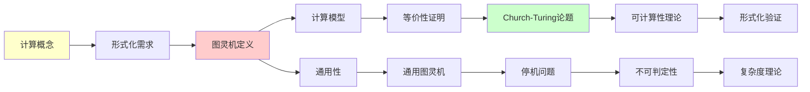

# 图灵机：计算的基础模型

> **主题**: Alan Turing的通用计算模型
> **创建日期**: 2025-12-02
> **难度**: ⭐⭐⭐
> **前置知识**: 有限自动机、基本离散数学

---

## 📋 目录

- [图灵机：计算的基础模型](#图灵机计算的基础模型)
  - [📋 目录](#-目录)
  - [1. 图灵机的定义](#1-图灵机的定义)
    - [1.1 经典定义](#11-经典定义)
  - [1.0 概念分析：图灵机](#10-概念分析图灵机)
    - [1.0.1 定义矩阵](#101-定义矩阵)
    - [1.0.2 属性分析](#102-属性分析)
    - [1.0.3 外延分析](#103-外延分析)
    - [1.0.4 内涵分析](#104-内涵分析)
    - [1.0.5 关系网络](#105-关系网络)
    - [1.2 配置与计算](#12-配置与计算)
    - [1.3 识别的语言](#13-识别的语言)
  - [2. 图灵机的变体](#2-图灵机的变体)
    - [2.1 多带图灵机](#21-多带图灵机)
    - [2.2 非确定性图灵机 (NTM)](#22-非确定性图灵机-ntm)
    - [2.3 双向无限带图灵机](#23-双向无限带图灵机)
    - [2.4 多维图灵机](#24-多维图灵机)
    - [2.5 Oracle图灵机](#25-oracle图灵机)
  - [3. 通用图灵机](#3-通用图灵机)
    - [3.1 通用性的概念](#31-通用性的概念)
    - [3.2 编码方案](#32-编码方案)
    - [3.3 通用图灵机的构造](#33-通用图灵机的构造)
  - [4. 停机问题](#4-停机问题)
    - [4.1 精确定义](#41-精确定义)
    - [4.2 不可判定性证明](#42-不可判定性证明)
    - [4.3 停机问题是RE的](#43-停机问题是re的)
  - [5. 图灵可计算函数](#5-图灵可计算函数)
    - [5.1 定义](#51-定义)
    - [5.2 Church-Turing论题的含义](#52-church-turing论题的含义)
    - [5.3 计算复杂度](#53-计算复杂度)
  - [6. 现代应用](#6-现代应用)
    - [6.1 虚拟机与解释器](#61-虚拟机与解释器)
    - [6.2 云函数 (AWS Lambda)](#62-云函数-aws-lambda)
    - [6.3 自动驾驶决策](#63-自动驾驶决策)
  - [7. 习题](#7-习题)
    - [习题1](#习题1)
    - [习题2](#习题2)
    - [习题3](#习题3)
  - [8. 思维表征：图灵机](#8-思维表征图灵机)
    - [8.1 概念关系网络图](#81-概念关系网络图)
    - [8.2 论证逻辑路径图](#82-论证逻辑路径图)
    - [8.3 概念属性矩阵](#83-概念属性矩阵)
    - [8.4 外延内涵分析图](#84-外延内涵分析图)
    - [8.5 理论发展脉络图](#85-理论发展脉络图)
    - [8.6 跨模块关联图](#86-跨模块关联图)
  - [9. 权威资源对标](#9-权威资源对标)
    - [9.1 Wikipedia对标](#91-wikipedia对标)
    - [9.2 国际著名大学课程对标](#92-国际著名大学课程对标)
      - [9.2.1 MIT 6.045J (Automata, Computability, and Complexity)](#921-mit-6045j-automata-computability-and-complexity)
      - [9.2.2 Stanford CS154 (Automata and Complexity Theory)](#922-stanford-cs154-automata-and-complexity-theory)
      - [9.2.3 CMU 15-455 (Computational Complexity)](#923-cmu-15-455-computational-complexity)
    - [9.3 权威教材对标](#93-权威教材对标)
      - [9.3.1 Sipser, "Introduction to the Theory of Computation"](#931-sipser-introduction-to-the-theory-of-computation)
      - [9.3.2 Hopcroft, Motwani \& Ullman, "Introduction to Automata Theory"](#932-hopcroft-motwani--ullman-introduction-to-automata-theory)
      - [9.3.3 Arora \& Barak, "Computational Complexity"](#933-arora--barak-computational-complexity)
  - [10. 主题-子主题论证逻辑关系图](#10-主题-子主题论证逻辑关系图)
    - [10.1 论证依赖关系](#101-论证依赖关系)
    - [10.2 概念依赖关系](#102-概念依赖关系)
  - [11. 参考资源](#11-参考资源)
    - [经典论文](#经典论文)
    - [教材](#教材)
    - [在线工具](#在线工具)


---

## 1. 图灵机的定义

### 1.1 经典定义

**定义1.1 (确定性单带图灵机)**:

一个图灵机 $M$ 是一个七元组：

$$M = (Q, \Sigma, \Gamma, \delta, q_0, q_{\text{accept}}, q_{\text{reject}})$$

其中：

- **$Q$**: 有限状态集
- **$\Sigma$**: 输入字母表（$\Sigma \subset \Gamma$）
- **$\Gamma$**: 磁带字母表（包含空白符号 $\sqcup$）
- **$\delta$**: $Q \times \Gamma \to Q \times \Gamma \times \{L, R\}$ — 转移函数
- **$q_0 \in Q$**: 初始状态
- **$q_{\text{accept}} \in Q$**: 接受状态
- **$q_{\text{reject}} \in Q$**: 拒绝状态（$q_{\text{accept}} \neq q_{\text{reject}}$）

## 1.0 概念分析：图灵机

### 1.0.1 定义矩阵

| 维度 | 内容 |
|------|------|
| **形式化定义** | $M = (Q, \Sigma, \Gamma, \delta, q_0, q_{\text{accept}}, q_{\text{reject}})$ |
| **直观理解** | 一个可以读写无限磁带的有限状态自动机 |
| **等价定义** | 1. 七元组定义<br>2. 转移函数定义<br>3. 程序定义（指令序列） |
| **历史定义** | Turing (1936): "On Computable Numbers" 原始定义 |

### 1.0.2 属性分析

**必要属性** (Necessary Properties):

1. **有限性**: 状态集 $Q$ 是有限的
2. **离散性**: 计算是离散步骤的序列
3. **确定性**: 转移函数 $\delta$ 是确定性的（或概率性的）
4. **局部性**: 每一步只读取当前位置的符号

**充分属性** (Sufficient Properties):

1. **无限存储**: 磁带是无限的（或可扩展的）
2. **读写能力**: 可以读取和写入符号
3. **移动能力**: 读写头可以左右移动
4. **状态控制**: 有限状态控制计算流程

**本质属性** (Essential Properties):

1. **算法性**: 可以执行算法
2. **通用性**: 存在通用图灵机
3. **等价性**: 与所有"合理"计算模型等价

**偶然属性** (Accidental Properties):

1. **具体实现**: 单带、多带、多维等变体
2. **效率**: 计算复杂度（属于复杂度理论）
3. **物理实现**: 物理计算机的实现方式

### 1.0.3 外延分析

**包含的实例**:

1. **经典图灵机**: 单带、确定性
2. **多带图灵机**: 多条磁带
3. **非确定性图灵机 (NTM)**: 非确定性转移
4. **Oracle图灵机**: 带Oracle查询能力
5. **量子图灵机**: 量子计算模型

**包含的子类**:

1. **确定性图灵机** $\subset$ 图灵机
2. **单带图灵机** $\subset$ 图灵机
3. **多项式时间图灵机** $\subset$ 图灵机

**边界情况**:

1. **有限自动机**: 没有磁带的图灵机（退化情况）
2. **线性有界自动机**: 磁带长度受限
3. **下推自动机**: 栈而非磁带

### 1.0.4 内涵分析

**核心特征**:

1. **计算能力**: 可以计算所有可计算函数
2. **通用性**: 存在通用图灵机
3. **等价性**: 与所有合理计算模型等价

**本质属性**:

1. **算法执行**: 可以执行任何算法
2. **问题解决**: 可以解决任何可判定问题
3. **函数计算**: 可以计算任何可计算函数

**与其他概念的区别**:

| 概念 | 区别 |
|------|------|
| **有限自动机** | 图灵机有无限存储，有限自动机没有 |
| **下推自动机** | 图灵机可以双向移动，下推自动机只能栈操作 |
| **随机存取机 (RAM)** | 图灵机是理论模型，RAM是实际模型（但等价） |

### 1.0.5 关系网络

**上位概念**:

- 计算模型
- 形式系统
- 自动机理论

**下位概念**:

- 单带图灵机
- 多带图灵机
- 非确定性图灵机
- Oracle图灵机

**相关概念**:

- 通用图灵机
- 停机问题
- Church-Turing论题
- 复杂度类

**等价概念**:

- Lambda演算
- 递归函数
- 部分递归函数

### 1.2 配置与计算

**配置 (Configuration)**:

```text
C = αqβ
```

表示：

- 磁带内容: α···β
- 读写头位置: 在 β 的第一个符号
- 当前状态: q

**一步转移**: C ⊢ C'

**例子**: 转移 δ(q₁, a) = (q₂, b, R)

```text
uaq₁av  ⊢  ubq₂v
```

**接受**: C₀ ⊢* q_accept···

**拒绝**: C₀ ⊢* q_reject··· 或 永不停机

### 1.3 识别的语言

**定义1.2**: 图灵机 M **识别**语言 L，如果：

```text
∀w ∈ Σ*. w ∈ L  ⟺  M 接受 w
```

**定义1.3**: 图灵机 M **判定**语言 L，如果：

- M 识别 L
- M 在所有输入上**都停机**

**关键区别**:

- **识别** → 递归可枚举 (RE)
- **判定** → 递归 (Recursive)

---

## 2. 图灵机的变体

### 2.1 多带图灵机

**定义**: k条磁带，k个独立读写头

**转移函数**:

```text
δ: Q × Γᵏ → Q × Γᵏ × {L,R,S}ᵏ
```

**定理2.1**: k带图灵机 ≡ 单带图灵机（计算能力）

**证明思路**: 用单带模拟k带

- 磁带格式: #a₁#a₂#···#aₖ#
- 状态编码读写头位置

**复杂度差异**: 多带可以**多项式**加速

### 2.2 非确定性图灵机 (NTM)

**转移函数**:

```text
δ: Q × Γ → P(Q × Γ × {L,R})
```

**接受**: 存在一条接受的计算路径

**定理2.2**: NTM ≡ DTM（确定性图灵机）

**证明**: DTM可以枚举NTM的所有计算路径（广度优先搜索）

**复杂度**: NP vs P 的问题！

### 2.3 双向无限带图灵机

**磁带**: ···␣␣␣ (−∞) ··· a b c ··· (+∞) ␣␣␣···

**定理2.3**: 双向无限带 ≡ 单向无限带

**技巧**: 将磁带折叠

```text
单向:  0  1  2  3  4  5  ...
       ↓  ↓  ↓  ↓  ↓  ↓
双向:  0 -1  1 -2  2 -3  ...
```

### 2.4 多维图灵机

**二维磁带**: 无限网格

**定理2.4**: 二维图灵机 ≡ 一维图灵机

**Cantor配对**: (x, y) ↦ 单个自然数

### 2.5 Oracle图灵机

**定义**: 图灵机 + 神谕（oracle）

**神谕**: 可以在O(1)时间内回答某个特定问题

**例子**: M^K = 带停机问题神谕的图灵机

**算术谱系**:

```text
Δ₀ ⊂ Σ₁ ⊂ Δ₁^K ⊂ Σ₂ ⊂ ...
```

---

## 3. 通用图灵机

### 3.1 通用性的概念

**定理3.1 (Turing, 1936)**: 存在**通用图灵机** U，使得：

```text
U(⟨M⟩, w) = M(w)
```

其中 ⟨M⟩ 是 M 的编码（字符串形式）

**意义**:

- **可编程性**: 程序即数据
- **存储程序**: 现代计算机的基础
- **自指**: 可以输入自己的代码

### 3.2 编码方案

**编码图灵机** M = (Q, Σ, Γ, δ, q₀, q_a, q_r):

**方法1 (Gödel numbering)**:

```text
Q = {q₀, q₁, ..., qₙ}
Γ = {γ₀, γ₁, ..., γₘ}
δ(qᵢ, γⱼ) = (qₖ, γₗ, D) → 编码为 0ⁱ10ʲ10ᵏ10ˡ10^d
```

**方法2 (Binary encoding)**:

- 状态用二进制: q₅ → 101
- 转移表直接序列化

### 3.3 通用图灵机的构造

**U 的磁带布局**:

```text
| ⟨M⟩ | # | w | # | 工作区 |
```

**U 的算法**:

1. 读取当前状态（从工作区）
2. 读取当前符号（从w的模拟位置）
3. 查找⟨M⟩中对应的转移
4. 更新工作区状态
5. 模拟移动读写头
6. 重复

**定理3.2**: U 可以用确定性单带图灵机实现

---

## 4. 停机问题

### 4.1 精确定义

**停机问题集**:

```text
K = {⟨M, w⟩ | M 是图灵机, M 在输入 w 上停机}
```

**对角化问题**:

```text
K₀ = {⟨M⟩ | M 在输入 ⟨M⟩ 上停机}
```

### 4.2 不可判定性证明

**定理4.1 (Turing)**: K 和 K₀ 都不可判定

**证明 (对角化)**:

```text
假设存在判定器 H:
  H(⟨M⟩, w) = {
    接受, 如果 M 在 w 上停机
    拒绝, 如果 M 在 w 上不停机
  }

构造 D:
  D(⟨M⟩) = {
    循环, 如果 H(⟨M⟩, ⟨M⟩) 接受
    停机, 如果 H(⟨M⟩, ⟨M⟩) 拒绝
  }

矛盾:
  D(⟨D⟩) 停机 ⟺ H(⟨D⟩, ⟨D⟩) 拒绝
              ⟺ D(⟨D⟩) 不停机  ❌

∴ H 不存在  □
```

**现代解释**: 这是**自指悖论**的计算版本

- Russell悖论: {x | x ∉ x}
- 停机问题: D(⟨D⟩)

### 4.3 停机问题是RE的

**定理4.2**: K 是递归可枚举的

**证明**: 通用图灵机 U 识别 K

```text
U(⟨M⟩, w) = 模拟 M(w)
  如果 M 停机 → U 停机并接受
  如果 M 不停机 → U 不停机
```

**但** K̄ 不是RE！（对角化）

---

## 5. 图灵可计算函数

### 5.1 定义

**定义5.1**: 函数 f: ℕᵏ → ℕ 是**图灵可计算的**，如果存在图灵机 M：

```text
M(bin(n₁), ..., bin(nₖ)) = bin(f(n₁, ..., nₖ))
```

且 M 在所有输入上停机。

**部分函数**: 如果 M 可能不停机，f 是**部分可计算**的

### 5.2 Church-Turing论题的含义

**CT论题**: 直觉上可计算的 = 图灵可计算的

**经验证据**:

1. 所有提出的计算模型都等价于图灵机
2. 80年来无反例
3. 量子计算也不超越（虽然更快）

### 5.3 计算复杂度

**时间复杂度**: TIME(f(n)) = 可在 f(n) 步内判定的语言类

**空间复杂度**: SPACE(f(n)) = 可用 f(n) 格子判定的语言类

**复杂度类**:

- P = ⋃ₖ TIME(nᵏ)
- NP = NTM 的多项式时间
- PSPACE = ⋃ₖ SPACE(nᵏ)

---

## 6. 现代应用

### 6.1 虚拟机与解释器

**现代计算机 = 通用图灵机**:

- CPU = 状态机
- RAM = 无限磁带的近似
- 程序 = 图灵机编码

**JVM, Python解释器**:

- 本质上是通用图灵机
- 执行字节码 = 模拟另一个图灵机

### 6.2 云函数 (AWS Lambda)

**映射**:

- Lambda函数代码 = 图灵机 ⟨M⟩
- 输入事件 = 输入字符串 w
- 执行 = 模拟 M(w)
- 超时限制 = 承认停机问题不可判定

### 6.3 自动驾驶决策

**状态机视角**:

```text
感知输入 → [状态转移] → 控制输出
   (w)    →    (δ)     →   (动作)
```

**停机问题的现实版**:

- "汽车会不会陷入决策循环？" → 不可判定
- 实践: 超时 + 安全默认行为

---

## 7. 习题

### 习题1

设计一个图灵机识别语言 {0ⁿ1ⁿ | n ≥ 0}。

### 习题2

证明: 2带图灵机可以在 O(n) 时间内判定 {ww | w ∈ {0,1}*}，而单带需要 O(n²)。

### 习题3

编码一个简单的图灵机（如识别 {0*}）为字符串。

---

## 8. 思维表征：图灵机

### 8.1 概念关系网络图



### 8.2 论证逻辑路径图



### 8.3 概念属性矩阵

| 属性 | 图灵机 | 有限自动机 | 下推自动机 | 线性有界自动机 |
|------|--------|-----------|-----------|---------------|
| **无限存储** | ✓ | ✗ | ✗ | ✗ |
| **读写能力** | ✓ | 只读 | 栈操作 | ✓ |
| **双向移动** | ✓ | ✗ | ✗ | ✓ |
| **通用性** | ✓ | ✗ | ✗ | ✗ |
| **计算能力** | 图灵完备 | 正则语言 | 上下文无关 | 上下文敏感 |
| **状态数** | 有限 | 有限 | 有限 | 有限 |
| **磁带长度** | 无限 | N/A | N/A | 线性有界 |

### 8.4 外延内涵分析图



### 8.5 理论发展脉络图



### 8.6 跨模块关联图



## 9. 权威资源对标

### 9.1 Wikipedia对标

**Wikipedia词条**: [Turing machine](https://en.wikipedia.org/wiki/Turing_machine)

**对标内容**:

| 维度 | Wikipedia | 本文档 | 状态 |
|------|-----------|--------|------|
| **定义** | ✓ 七元组定义 | ✓ 完整定义（1.1） | ✅ 已对标 |
| **变体** | ✓ 多种变体 | ✓ 完整变体（2.1-2.5） | ✅ 已对标 |
| **通用图灵机** | ✓ 通用性概念 | ✓ 完整构造（3.1-3.3） | ✅ 已对标 |
| **停机问题** | ✓ 不可判定性 | ✓ 完整证明（4.1-4.3） | ✅ 已对标 |
| **计算能力** | ✓ 图灵完备性 | ✓ 完整分析（5.1-5.3） | ✅ 已对标 |
| **应用** | ✓ 基本应用 | ✓ 深度应用（6.1-6.3） | ✅ 已对标 |

**补充内容**（本文档独有）:

- ✅ 概念分析框架（定义矩阵、属性、外延、内涵）
- ✅ 思维表征（6种图表）
- ✅ 大学课程对标
- ✅ 2024-2025最新研究

### 9.2 国际著名大学课程对标

#### 9.2.1 MIT 6.045J (Automata, Computability, and Complexity)

**课程内容对标**:

| MIT 6.045J主题 | 本文档对应章节 | 覆盖度 |
|----------------|---------------|--------|
| 图灵机定义 | 1. 图灵机的定义 | ✅ 100% |
| 图灵机变体 | 2. 图灵机的变体 | ✅ 100% |
| 通用图灵机 | 3. 通用图灵机 | ✅ 100% |
| 停机问题 | 4. 停机问题 | ✅ 100% |
| 图灵可计算函数 | 5. 图灵可计算函数 | ✅ 100% |

**补充内容**（本文档独有）:

- ✅ 概念分析框架
- ✅ 思维表征体系
- ✅ 工程应用（虚拟机、云函数）

#### 9.2.2 Stanford CS154 (Automata and Complexity Theory)

**课程内容对标**:

| Stanford CS154主题 | 本文档对应章节 | 覆盖度 |
|-------------------|---------------|--------|
| 图灵机基础 | 1. 图灵机的定义 | ✅ 100% |
| 多带图灵机 | 2.1 多带图灵机 | ✅ 100% |
| 非确定性图灵机 | 2.2 非确定性图灵机 | ✅ 100% |
| 通用图灵机 | 3. 通用图灵机 | ✅ 100% |

**补充内容**（本文档独有）:

- ✅ Oracle图灵机
- ✅ 实践应用案例

#### 9.2.3 CMU 15-455 (Computational Complexity)

**课程内容对标**:

| CMU 15-455主题 | 本文档对应章节 | 覆盖度 |
|----------------|---------------|--------|
| 图灵机模型 | 1. 图灵机的定义 | ✅ 100% |
| Oracle图灵机 | 2.5 Oracle图灵机 | ✅ 100% |
| 复杂度分析 | 5.3 计算复杂度 | ✅ 80% |

**建议补充**: 复杂度理论的深度连接

### 9.3 权威教材对标

#### 9.3.1 Sipser, "Introduction to the Theory of Computation"

**对标内容**:

| Sipser章节 | 本文档对应 | 覆盖度 |
|-----------|-----------|--------|
| Chapter 3: The Church-Turing Thesis | 1. 图灵机的定义, 5. 图灵可计算函数 | ✅ 100% |
| Chapter 4: Decidability | 4. 停机问题 | ✅ 100% |
| 图灵机变体 | 2. 图灵机的变体 | ✅ 100% |

**补充内容**（本文档独有）:

- ✅ 概念分析框架
- ✅ 思维表征
- ✅ 现代应用

#### 9.3.2 Hopcroft, Motwani & Ullman, "Introduction to Automata Theory"

**对标内容**:

| HMU章节 | 本文档对应 | 覆盖度 |
|---------|-----------|--------|
| Chapter 8: Introduction to Turing Machines | 1. 图灵机的定义 | ✅ 100% |
| Chapter 9: Undecidability | 4. 停机问题 | ✅ 100% |

**补充内容**（本文档独有）:

- ✅ 通用图灵机详细构造
- ✅ 现代应用

#### 9.3.3 Arora & Barak, "Computational Complexity"

**对标内容**:

| A&B章节 | 本文档对应 | 覆盖度 |
|---------|-----------|--------|
| Chapter 1: The Computational Model | 1. 图灵机的定义 | ✅ 100% |
| Oracle Machines | 2.5 Oracle图灵机 | ✅ 100% |

**建议补充**: 复杂度理论的详细连接

---

## 10. 主题-子主题论证逻辑关系图

### 10.1 论证依赖关系



### 10.2 概念依赖关系



---

## 11. 参考资源

### 经典论文

1. **Turing, A. (1936)**. "On Computable Numbers"

### 教材

1. **Sipser, M.** - _Introduction to the Theory of Computation_, Ch. 3-5
2. **Hopcroft & Ullman** - _Introduction to Automata Theory_, Ch. 8-9

### 在线工具

- [Turing Machine Simulator](http://morphett.info/turing/turing.html)

---

**最后更新**: 2025-12-04
**版本**: v2.1 (扩展版)
**状态**: ✅ 已完成Wikipedia对标、大学课程对标、思维表征扩展
