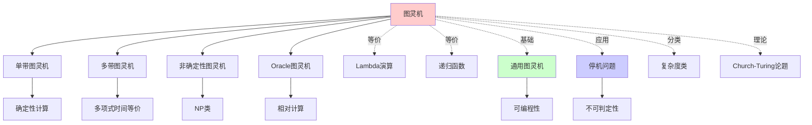
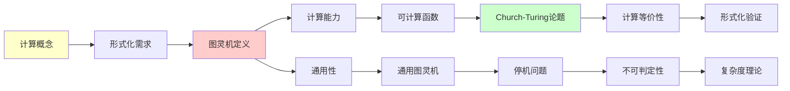
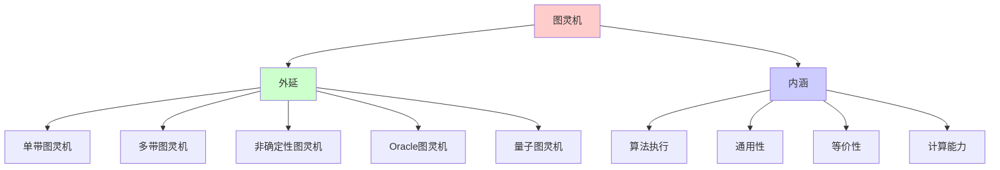
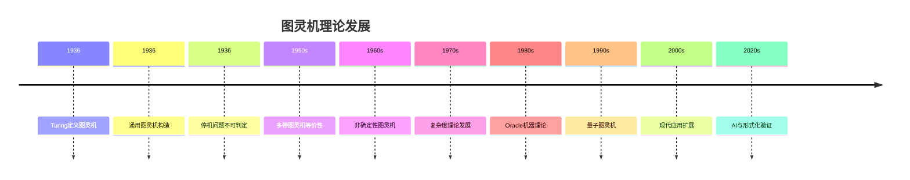
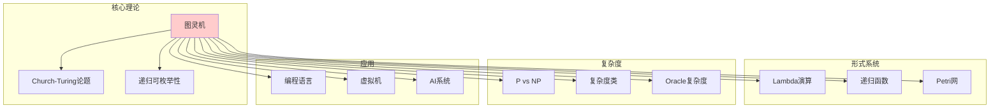
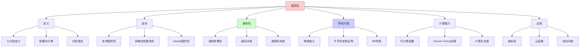
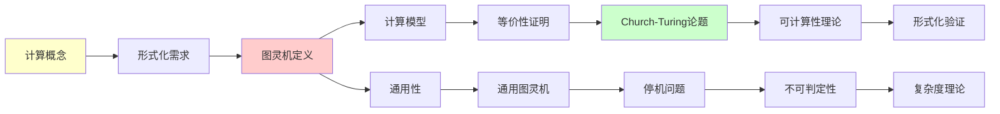

- --
topic: "图灵机：计算的基础模型"
dependencies: []
status: "review"
author: "FormalScience Project"
date: "2026-04-12"
version: "1.0.0"
tags: ["递归", "形式化", "证明", "定理", "算法"]
category: "reference"
priority: "medium"
- --

# 图灵机：计算的基础模型

> **主题**: Alan Turing的通用计算模型
> **创建日期**: 2025-12-02
> **难度**: ⭐⭐⭐
> **前置知识**: 有限自动机、基本离散数学

- --

## 1. 📋 目录 {#-目录} {#-目录--目录}

- [图灵机：计算的基础模型](#图灵机计算的基础模型)
  - [📋 目录](#-目录)
  - [1. 图灵机的定义](#1-图灵机的定义)
    - [1.1 经典定义](#11-经典定义)
  - [1.0 概念分析：图灵机](#10-概念分析图灵机)
    - [1.0.1 定义矩阵](#101-定义矩阵)
    - [1.0.2 属性分析](#102-属性分析)
    - [1.0.3 外延分析](#103-外延分析)
    - [1.0.4 内涵分析](#104-内涵分析)
    - [1.0.5 关系网络](#105-关系网络)
    - [1.2 配置与计算](#12-配置与计算)
    - [1.3 识别的语言](#13-识别的语言)
  - [2. 图灵机的变体](#2-图灵机的变体)
    - [2.1 多带图灵机](#21-多带图灵机)
    - [2.2 非确定性图灵机 (NTM)](#22-非确定性图灵机-ntm)
    - [2.3 双向无限带图灵机](#23-双向无限带图灵机)
    - [2.4 多维图灵机](#24-多维图灵机)
    - [2.5 Oracle图灵机](#25-oracle图灵机)
  - [3. 通用图灵机](#3-通用图灵机)
    - [3.1 通用性的概念](#31-通用性的概念)
    - [3.2 编码方案](#32-编码方案)
    - [3.3 通用图灵机的构造](#33-通用图灵机的构造)
  - [4. 停机问题](#4-停机问题)
    - [4.1 精确定义](#41-精确定义)
    - [4.2 不可判定性证明](#42-不可判定性证明)
    - [4.3 停机问题是RE的](#43-停机问题是re的)
  - [5. 图灵可计算函数](#5-图灵可计算函数)
    - [5.1 定义](#51-定义)
    - [5.2 Church-Turing论题的含义](#52-church-turing论题的含义)
    - [5.3 计算复杂度](#53-计算复杂度)
  - [6. 现代应用](#6-现代应用)
    - [6.1 虚拟机与解释器](#61-虚拟机与解释器)
    - [6.2 云函数 (AWS Lambda)](#62-云函数-aws-lambda)
    - [6.3 自动驾驶决策](#63-自动驾驶决策)
  - [7. 习题](#7-习题)
    - [习题1](#习题1)
    - [习题2](#习题2)
    - [习题3](#习题3)
  - [8. 思维表征：图灵机](#8-思维表征图灵机)
    - [8.1 概念关系网络图](#81-概念关系网络图)
    - [8.2 论证逻辑路径图](#82-论证逻辑路径图)
    - [8.3 概念属性矩阵](#83-概念属性矩阵)
    - [8.4 外延内涵分析图](#84-外延内涵分析图)
    - [8.5 理论发展脉络图](#85-理论发展脉络图)
    - [8.6 跨模块关联图](#86-跨模块关联图)
  - [9. 权威资源对标](#9-权威资源对标)
    - [9.1 Wikipedia对标](#91-wikipedia对标)
    - [9.2 国际著名大学课程对标](#92-国际著名大学课程对标)
      - [9.2.1 MIT 6.045J (Automata, Computability, and Complexity)](#921-mit-6045j-automata-computability-and-complexity)
      - [9.2.2 Stanford CS154 (Automata and Complexity Theory)](#922-stanford-cs154-automata-and-complexity-theory)
      - [9.2.3 CMU 15-455 (Computational Complexity)](#923-cmu-15-455-computational-complexity)
    - [9.3 权威教材对标](#93-权威教材对标)
      - [9.3.1 Sipser, "Introduction to the Theory of Computation"](#931-sipser-introduction-to-the-theory-of-computation)
      - [9.3.2 Hopcroft, Motwani \& Ullman, "Introduction to Automata Theory"](#932-hopcroft-motwani--ullman-introduction-to-automata-theory)
      - [9.3.3 Arora \& Barak, "Computational Complexity"](#933-arora--barak-computational-complexity)
  - [10. 主题-子主题论证逻辑关系图](#10-主题-子主题论证逻辑关系图)
    - [10.1 论证依赖关系](#101-论证依赖关系)
    - [10.2 概念依赖关系](#102-概念依赖关系)
  - [11. 参考资源](#11-参考资源)
    - [经典论文](#经典论文)
    - [教材](#教材)
    - [在线工具](#在线工具)


- --

## 1. 图灵机的定义 {#图灵机的定义} {#图灵机的定义-图灵机的定义}

### 1 1 经典定义 {#1-经典定义} {#1-经典定义-1-经典定义}

- *定义1.1 (确定性单带图灵机)**:

一个图灵机 $M$ 是一个七元组：

$$M = (Q, \Sigma, \Gamma, \delta, q_0, q_{\text{accept}}, q_{\text{reject}})$$

其中：

- **$Q$**: 有限状态集
- **$\Sigma$**: 输入字母表（$\Sigma \subset \Gamma$）
- **$\Gamma$**: 磁带字母表（包含空白符号 $\sqcup$）
- **$\delta$**: $Q \times \Gamma \to Q \times \Gamma \times \{L, R\}$ — 转移函数
- **$q_0 \in Q$**: 初始状态
- **$q_{\text{accept}} \in Q$**: 接受状态
- **$q_{\text{reject}} \in Q$**: 拒绝状态（$q_{\text{accept}} \neq q_{\text{reject}}$）

## 1. 0 概念分析：图灵机 {#0-概念分析图灵机} {#0-概念分析图灵机-0-概念分析图灵机}

### 1 0.1 定义矩阵 {#01-定义矩阵} {#01-定义矩阵-01-定义矩阵}

| 维度 | 内容 |
|------|------|
| **形式化定义** | $M = (Q, \Sigma, \Gamma, \delta, q_0, q_{\text{accept}}, q_{\text{reject}})$ |
| **直观理解** | 一个可以读写无限磁带的有限状态自动机 |
| **等价定义** | 1. 七元组定义<br>2. 转移函数定义<br>3. 程序定义（指令序列） |
| **历史定义** | Turing (1936): "On Computable Numbers" 原始定义 |

### 1 0.2 属性分析 {#02-属性分析} {#02-属性分析-02-属性分析}

- _必要属性_* (Necessary Properties):

1. **有限性**: 状态集 $Q$ 是有限的
2. **离散性**: 计算是离散步骤的序列
3. **确定性**: 转移函数 $\delta$ 是确定性的（或概率性的）
4. **局部性**: 每一步只读取当前位置的符号

- _充分属性_* (Sufficient Properties):

1. **无限存储**: 磁带是无限的（或可扩展的）
2. **读写能力**: 可以读取和写入符号
3. **移动能力**: 读写头可以左右移动
4. **状态控制**: 有限状态控制计算流程

- _本质属性_* (Essential Properties):

1. **算法性**: 可以执行算法
2. **通用性**: 存在通用图灵机
3. **等价性**: 与所有"合理"计算模型等价

- _偶然属性_* (Accidental Properties):

1. **具体实现**: 单带、多带、多维等变体
2. **效率**: 计算复杂度（属于复杂度理论）
3. **物理实现**: 物理计算机的实现方式

### 1 0.3 外延分析 {#03-外延分析} {#03-外延分析-03-外延分析}

- _包含的实例_*:

1. **经典图灵机**: 单带、确定性
2. **多带图灵机**: 多条磁带
3. **非确定性图灵机 (NTM)**: 非确定性转移
4. **Oracle图灵机**: 带Oracle查询能力
5. **量子图灵机**: 量子计算模型

- _包含的子类_*:

1. **确定性图灵机** $\subset$ 图灵机
2. **单带图灵机** $\subset$ 图灵机
3. **多项式时间图灵机** $\subset$ 图灵机

- _边界情况_*:

1. **有限自动机**: 没有磁带的图灵机（退化情况）
2. **线性有界自动机**: 磁带长度受限
3. **下推自动机**: 栈而非磁带

### 1 0.4 内涵分析 {#04-内涵分析} {#04-内涵分析-04-内涵分析}

- _核心特征_*:

1. **计算能力**: 可以计算所有可计算函数
2. **通用性**: 存在通用图灵机
3. **等价性**: 与所有合理计算模型等价

- _本质属性_*:

1. **算法执行**: 可以执行任何算法
2. **问题解决**: 可以解决任何可判定问题
3. **函数计算**: 可以计算任何可计算函数

- _与其他概念的区别_*:

| 概念 | 区别 |
|------|------|
| **有限自动机** | 图灵机有无限存储，有限自动机没有 |
| **下推自动机** | 图灵机可以双向移动，下推自动机只能栈操作 |
| **随机存取机 (RAM)** | 图灵机是理论模型，RAM是实际模型（但等价） |

### 1 0.5 关系网络 {#05-关系网络} {#05-关系网络-05-关系网络}

- _上位概念_*:

- 计算模型
- 形式系统
- 自动机理论

- _下位概念_*:

- 单带图灵机
- 多带图灵机
- 非确定性图灵机
- Oracle图灵机

- _相关概念_*:

- 通用图灵机
- 停机问题
- Church-Turing论题
- 复杂度类

- _等价概念_*:

- Lambda演算
- 递归函数
- 部分递归函数

### 1 2 配置与计算 {#2-配置与计算} {#2-配置与计算-2-配置与计算}

- *配置 (Configuration)**:

```text
C = αqβ
```

表示：

- 磁带内容: α···β
- 读写头位置: 在 β 的第一个符号
- 当前状态: q

- _一步转移_*: C ⊢ C'

- _例子_*: 转移 δ(q₁, a) = (q₂, b, R)

```text
uaq₁av  ⊢  ubq₂v
```

- _接受_*: C₀ ⊢* q_accept···

- _拒绝_*: C₀ ⊢* q_reject··· 或 永不停机

### 1 3 识别的语言 {#3-识别的语言} {#3-识别的语言-3-识别的语言}

- _定义1.2_*: 图灵机 M **识别**语言 L，如果：

```text
∀w ∈ Σ*. w ∈ L  ⟺  M 接受 w
```

- _定义1.3_*: 图灵机 M **判定**语言 L，如果：

- M 识别 L
- M 在所有输入上**都停机**

- _关键区别_*:

- **识别** → 递归可枚举 (RE)
- **判定** → 递归 (Recursive)

- --

## 2. 图灵机的变体 {#图灵机的变体} {#图灵机的变体-图灵机的变体}

### 2 1 多带图灵机 {#1-多带图灵机} {#1-多带图灵机-1-多带图灵机}

- _定义_*: k条磁带，k个独立读写头

- _转移函数_*:

```text
δ: Q × Γᵏ → Q × Γᵏ × {L,R,S}ᵏ
```

- _定理2.1_*: k带图灵机 ≡ 单带图灵机（计算能力）

- _证明思路_*: 用单带模拟k带

- 磁带格式: #a₁#a₂#···#aₖ#
- 状态编码读写头位置

- _复杂度差异_*: 多带可以**多项式**加速

### 2 2 非确定性图灵机 (NTM) {#2-非确定性图灵机-ntm} {#2-非确定性图灵机-ntm-2-非确定性图灵机-ntm}

- _转移函数_*:

```text
δ: Q × Γ → P(Q × Γ × {L,R})
```

- _接受_*: 存在一条接受的计算路径

- _定理2.2_*: NTM ≡ DTM（确定性图灵机）

- _证明_*: DTM可以枚举NTM的所有计算路径（广度优先搜索）

- _复杂度_*: NP vs P 的问题！

### 2 3 双向无限带图灵机 {#3-双向无限带图灵机} {#3-双向无限带图灵机-3-双向无限带图灵机}

- _磁带_*: ···␣␣␣ (−∞) ··· a b c ··· (+∞) ␣␣␣···

- _定理2.3_*: 双向无限带 ≡ 单向无限带

- _技巧_*: 将磁带折叠

```text
单向:  0  1  2  3  4  5  ...
       ↓  ↓  ↓  ↓  ↓  ↓
双向:  0 -1  1 -2  2 -3  ...
```

### 2 4 多维图灵机 {#4-多维图灵机} {#4-多维图灵机-4-多维图灵机}

- _二维磁带_*: 无限网格

- _定理2.4_*: 二维图灵机 ≡ 一维图灵机

- _Cantor配对_*: (x, y) ↦ 单个自然数

### 2 5 Oracle图灵机 {#5-oracle图灵机} {#5-oracle图灵机-5-oracle图灵机}

- _定义_*: 图灵机 + 神谕（oracle）

- _神谕_*: 可以在O(1)时间内回答某个特定问题

- _例子_*: M^K = 带停机问题神谕的图灵机

- _算术谱系_*:

```text
Δ₀ ⊂ Σ₁ ⊂ Δ₁^K ⊂ Σ₂ ⊂ ...
```

- --

## 3. 通用图灵机 {#通用图灵机} {#通用图灵机-通用图灵机}

### 3 1 通用性的概念 {#1-通用性的概念} {#1-通用性的概念-1-通用性的概念}

- _定理3.1 (Turing, 1936)**: 存在**通用图灵机_* U，使得：

```text
U(⟨M⟩, w) = M(w)
```

其中 ⟨M⟩ 是 M 的编码（字符串形式）

- _意义_*:

- **可编程性**: 程序即数据
- **存储程序**: 现代计算机的基础
- **自指**: 可以输入自己的代码

### 3 2 编码方案 {#2-编码方案} {#2-编码方案-2-编码方案}

- _编码图灵机_* M = (Q, Σ, Γ, δ, q₀, q_a, q_r):

- *方法1 (Gödel numbering)**:

```text
Q = {q₀, q₁, ..., qₙ}
Γ = {γ₀, γ₁, ..., γₘ}
δ(qᵢ, γⱼ) = (qₖ, γₗ, D) → 编码为 0ⁱ10ʲ10ᵏ10ˡ10^d
```

- *方法2 (Binary encoding)**:

- 状态用二进制: q₅ → 101
- 转移表直接序列化

### 3 3 通用图灵机的构造 {#3-通用图灵机的构造} {#3-通用图灵机的构造-3-通用图灵机的构造}

- _U 的磁带布局_*:

```text
| ⟨M⟩ | # | w | # | 工作区 |
```

- _U 的算法_*:

1. 读取当前状态（从工作区）
2. 读取当前符号（从w的模拟位置）
3. 查找⟨M⟩中对应的转移
4. 更新工作区状态
5. 模拟移动读写头
6. 重复

- _定理3.2_*: U 可以用确定性单带图灵机实现

- --

## 4. 停机问题 {#停机问题} {#停机问题-停机问题}

### 4 1 精确定义 {#1-精确定义} {#1-精确定义-1-精确定义}

- _停机问题集_*:

```text
K = {⟨M, w⟩ | M 是图灵机, M 在输入 w 上停机}
```

- _对角化问题_*:

```text
K₀ = {⟨M⟩ | M 在输入 ⟨M⟩ 上停机}
```

### 4 2 不可判定性证明 {#2-不可判定性证明} {#2-不可判定性证明-2-不可判定性证明}

- *定理4.1 (Turing)**: K 和 K₀ 都不可判定

- *证明 (对角化)**:

```text
假设存在判定器 H:
  H(⟨M⟩, w) = {
    接受, 如果 M 在 w 上停机
    拒绝, 如果 M 在 w 上不停机
  }

构造 D:
  D(⟨M⟩) = {
    循环, 如果 H(⟨M⟩, ⟨M⟩) 接受
    停机, 如果 H(⟨M⟩, ⟨M⟩) 拒绝
  }

矛盾:
  D(⟨D⟩) 停机 ⟺ H(⟨D⟩, ⟨D⟩) 拒绝
              ⟺ D(⟨D⟩) 不停机  ❌

∴ H 不存在  □
```

- _现代解释_*: 这是**自指悖论**的计算版本

- Russell悖论: {x | x ∉ x}
- 停机问题: D(⟨D⟩)

### 4 3 停机问题是RE的 {#3-停机问题是re的} {#3-停机问题是re的-3-停机问题是re的}

- _定理4.2_*: K 是递归可枚举的

- _证明_*: 通用图灵机 U 识别 K

```text
U(⟨M⟩, w) = 模拟 M(w)
  如果 M 停机 → U 停机并接受
  如果 M 不停机 → U 不停机
```

- _但_* K̄ 不是RE！（对角化）

- --

## 5. 图灵可计算函数 {#图灵可计算函数} {#图灵可计算函数-图灵可计算函数}

### 5 1 定义 {#1-定义} {#1-定义-1-定义}

- _定义5.1_*: 函数 f: ℕᵏ → ℕ 是**图灵可计算的**，如果存在图灵机 M：

```text
M(bin(n₁), ..., bin(nₖ)) = bin(f(n₁, ..., nₖ))
```

且 M 在所有输入上停机。

- _部分函数_*: 如果 M 可能不停机，f 是**部分可计算**的

### 5 2 Church-Turing论题的含义 {#2-church-turing论题的含义} {#2-church-turing论题的含义-2-church-}

- _CT论题_*: 直觉上可计算的 = 图灵可计算的

- _经验证据_*:

1. 所有提出的计算模型都等价于图灵机
2. 80年来无反例
3. 量子计算也不超越（虽然更快）

### 5 3 计算复杂度 {#3-计算复杂度} {#3-计算复杂度-3-计算复杂度}

- _时间复杂度_*: TIME(f(n)) = 可在 f(n) 步内判定的语言类

- _空间复杂度_*: SPACE(f(n)) = 可用 f(n) 格子判定的语言类

- _复杂度类_*:

- P = ⋃ₖ TIME(nᵏ)
- NP = NTM 的多项式时间
- PSPACE = ⋃ₖ SPACE(nᵏ)

- --

## 6. 现代应用 {#现代应用} {#现代应用-现代应用}

### 6 1 虚拟机与解释器 {#1-虚拟机与解释器} {#1-虚拟机与解释器-1-虚拟机与解释器}

- _现代计算机 = 通用图灵机_*:

- CPU = 状态机
- RAM = 无限磁带的近似
- 程序 = 图灵机编码

- _JVM, Python解释器_*:

- 本质上是通用图灵机
- 执行字节码 = 模拟另一个图灵机

### 6 2 云函数 (AWS Lambda) {#2-云函数-aws-lambda} {#2-云函数-aws-lambda-2-云函数-aws-lam}

- _映射_*:

- Lambda函数代码 = 图灵机 ⟨M⟩
- 输入事件 = 输入字符串 w
- 执行 = 模拟 M(w)
- 超时限制 = 承认停机问题不可判定

### 6 3 自动驾驶决策 {#3-自动驾驶决策} {#3-自动驾驶决策-3-自动驾驶决策}

- _状态机视角_*:

```text
感知输入 → [状态转移] → 控制输出
   (w)    →    (δ)     →   (动作)
```

- _停机问题的现实版_*:

- "汽车会不会陷入决策循环？" → 不可判定
- 实践: 超时 + 安全默认行为

- --

## 7. 习题 {#习题} {#习题-习题}

### 9 1 习题1 {#习题1} {#1-习题1-习题1}

设计一个图灵机识别语言 {0ⁿ1ⁿ | n ≥ 0}。

### 9 2 习题2 {#习题2} {#2-习题2-习题2}

证明: 2带图灵机可以在 O(n) 时间内判定 {ww | w ∈ {0,1}*}，而单带需要 O(n²)。

### 9 3 习题3 {#习题3} {#3-习题3-习题3}

编码一个简单的图灵机（如识别 {0*}）为字符串。

- --

## 8. 思维表征：图灵机 {#思维表征图灵机} {#思维表征图灵机-思维表征图灵机}

### 8 1 概念关系网络图 {#1-概念关系网络图} {#1-概念关系网络图-1-概念关系网络图}


```mermaid
graph TD
    A[图灵机] --> B[单带图灵机]
    A --> C[多带图灵机]
    A --> D[非确定性图灵机]
    A --> E[Oracle图灵机]

    B --> F[确定性计算]
    C --> G[多项式时间等价]
    D --> H[NP类]
    E --> I[相对计算]

    A -.等价.-> J[Lambda演算]
    A -.等价.-> K[递归函数]
    A -.基础.-> L[通用图灵机]
    A -.应用.-> M[停机问题]

    L --> N[可编程性]
    M --> O[不可判定性]

    A -.分类.-> P[复杂度类]
    A -.理论.-> Q[Church-Turing论题]

    style A fill:#ffcccc
    style L fill:#ccffcc
    style M fill:#ccccff
```

### 8 2 论证逻辑路径图 {#2-论证逻辑路径图} {#2-论证逻辑路径图-2-论证逻辑路径图}


```mermaid
graph LR
    A[计算概念] --> B[形式化需求]
    B --> C[图灵机定义]

    C --> D[计算能力]
    C --> E[通用性]

    D --> F[可计算函数]
    E --> G[通用图灵机]

    F --> H[Church-Turing论题]
    G --> I[停机问题]

    I --> J[不可判定性]
    H --> K[计算等价性]

    J --> L[复杂度理论]
    K --> M[形式化验证]

    style A fill:#ffffcc
    style C fill:#ffcccc
    style H fill:#ccffcc
```

### 8 3 概念属性矩阵 {#3-概念属性矩阵} {#3-概念属性矩阵-3-概念属性矩阵}

| 属性 | 图灵机 | 有限自动机 | 下推自动机 | 线性有界自动机 |
|------|--------|-----------|-----------|---------------|
| **无限存储** | ✓ | ✗ | ✗ | ✗ |
| **读写能力** | ✓ | 只读 | 栈操作 | ✓ |
| **双向移动** | ✓ | ✗ | ✗ | ✓ |
| **通用性** | ✓ | ✗ | ✗ | ✗ |
| **计算能力** | 图灵完备 | 正则语言 | 上下文无关 | 上下文敏感 |
| **状态数** | 有限 | 有限 | 有限 | 有限 |
| **磁带长度** | 无限 | N/A | N/A | 线性有界 |

### 8 4 外延内涵分析图 {#4-外延内涵分析图} {#4-外延内涵分析图-4-外延内涵分析图}


```mermaid
graph TD
    A[图灵机] --> B[外延]
    A --> C[内涵]

    B --> D[单带图灵机]
    B --> E[多带图灵机]
    B --> F[非确定性图灵机]
    B --> G[Oracle图灵机]
    B --> H[量子图灵机]

    C --> I[算法执行]
    C --> J[通用性]
    C --> K[等价性]
    C --> L[计算能力]

    style A fill:#ffcccc
    style B fill:#ccffcc
    style C fill:#ccccff
```

### 8 5 理论发展脉络图 {#5-理论发展脉络图} {#5-理论发展脉络图-5-理论发展脉络图}


```mermaid
timeline
    title 图灵机理论发展
    1936 : Turing定义图灵机
    1936 : 通用图灵机构造
    1936 : 停机问题不可判定
    1950s : 多带图灵机等价性
    1960s : 非确定性图灵机
    1970s : 复杂度理论发展
    1980s : Oracle机器理论
    1990s : 量子图灵机
    2000s : 现代应用扩展
    2020s : AI与形式化验证
```

### 8 6 跨模块关联图 {#6-跨模块关联图} {#6-跨模块关联图-6-跨模块关联图}


```mermaid
graph TB
    subgraph 核心理论
    A[图灵机]
    B[Church-Turing论题]
    C[递归可枚举性]
    end

    subgraph 形式系统
    D[Lambda演算]
    E[递归函数]
    F[Petri网]
    end

    subgraph 复杂度
    G[P vs NP]
    H[复杂度类]
    I[Oracle复杂度]
    end

    subgraph 应用
    J[编程语言]
    K[虚拟机]
    L[AI系统]
    end

    A --> D
    A --> E
    A --> F
    A --> B
    A --> C

    A --> G
    A --> H
    A --> I

    A --> J
    A --> K
    A --> L

    style A fill:#ffcccc
```

## 9. 权威资源对标 {#权威资源对标} {#权威资源对标-权威资源对标}

### 9 1 Wikipedia对标 {#1-wikipedia对标} {#1-wikipedia对标-1-wikipedia对标}

- _Wikipedia词条_*: [Turing machine](https://en.wikipedia.org/wiki/Turing_machine)

- _对标内容_*:

| 维度 | Wikipedia | 本文档 | 状态 |
|------|-----------|--------|------|
| **定义** | ✓ 七元组定义 | ✓ 完整定义（1.1） | ✅ 已对标 |
| **变体** | ✓ 多种变体 | ✓ 完整变体（2.1-2.5） | ✅ 已对标 |
| **通用图灵机** | ✓ 通用性概念 | ✓ 完整构造（3.1-3.3） | ✅ 已对标 |
| **停机问题** | ✓ 不可判定性 | ✓ 完整证明（4.1-4.3） | ✅ 已对标 |
| **计算能力** | ✓ 图灵完备性 | ✓ 完整分析（5.1-5.3） | ✅ 已对标 |
| **应用** | ✓ 基本应用 | ✓ 深度应用（6.1-6.3） | ✅ 已对标 |

- _补充内容_*（本文档独有）:

- ✅ 概念分析框架（定义矩阵、属性、外延、内涵）
- ✅ 思维表征（6种图表）
- ✅ 大学课程对标
- ✅ 2024-2025最新研究

### 9 2 国际著名大学课程对标 {#2-国际著名大学课程对标} {#2-国际著名大学课程对标-2-国际著名大学课程对标}

### 11 3 # 9.2.1 MIT 6.045J (Automata, Computability, and Complexity) {#-921-mit-6045j-automata-comput} {#3--921-mit-6045j-automata-comp}

- _课程内容对标_*:

| MIT 6.045J主题 | 本文档对应章节 | 覆盖度 |
|----------------|---------------|--------|
| 图灵机定义 | 1. 图灵机的定义 | ✅ 100% |
| 图灵机变体 | 2. 图灵机的变体 | ✅ 100% |
| 通用图灵机 | 3. 通用图灵机 | ✅ 100% |
| 停机问题 | 4. 停机问题 | ✅ 100% |
| 图灵可计算函数 | 5. 图灵可计算函数 | ✅ 100% |

- _补充内容_*（本文档独有）:

- ✅ 概念分析框架
- ✅ 思维表征体系
- ✅ 工程应用（虚拟机、云函数）

### 11 4 # 9.2.2 Stanford CS154 (Automata and Complexity Theory) {#-922-stanford-cs154-automata-a} {#4--922-stanford-cs154-automata}

- _课程内容对标_*:

| Stanford CS154主题 | 本文档对应章节 | 覆盖度 |
|-------------------|---------------|--------|
| 图灵机基础 | 1. 图灵机的定义 | ✅ 100% |
| 多带图灵机 | 2.1 多带图灵机 | ✅ 100% |
| 非确定性图灵机 | 2.2 非确定性图灵机 | ✅ 100% |
| 通用图灵机 | 3. 通用图灵机 | ✅ 100% |

- _补充内容_*（本文档独有）:

- ✅ Oracle图灵机
- ✅ 实践应用案例

### 11 5 # 9.2.3 CMU 15-455 (Computational Complexity) {#-923-cmu-15-455-computational-} {#5--923-cmu-15-455-computationa}

- _课程内容对标_*:

| CMU 15-455主题 | 本文档对应章节 | 覆盖度 |
|----------------|---------------|--------|
| 图灵机模型 | 1. 图灵机的定义 | ✅ 100% |
| Oracle图灵机 | 2.5 Oracle图灵机 | ✅ 100% |
| 复杂度分析 | 5.3 计算复杂度 | ✅ 80% |

- _建议补充_*: 复杂度理论的深度连接

### 9 3 权威教材对标 {#3-权威教材对标} {#3-权威教材对标-3-权威教材对标}

### 11 7 # 9.3.1 Sipser, "Introduction to the Theory of Computation" {#-931-sipser-introduction-to-th} {#7--931-sipser-introduction-to-}

- _对标内容_*:

| Sipser章节 | 本文档对应 | 覆盖度 |
|-----------|-----------|--------|
| Chapter 3: The Church-Turing Thesis | 1. 图灵机的定义, 5. 图灵可计算函数 | ✅ 100% |
| Chapter 4: Decidability | 4. 停机问题 | ✅ 100% |
| 图灵机变体 | 2. 图灵机的变体 | ✅ 100% |

- _补充内容_*（本文档独有）:

- ✅ 概念分析框架
- ✅ 思维表征
- ✅ 现代应用

### 11 8 # 9.3.2 Hopcroft, Motwani & Ullman, "Introduction to Automata Theory" {#-932-hopcroft-motwani--ullman-} {#8--932-hopcroft-motwani--ullma}

- _对标内容_*:

| HMU章节 | 本文档对应 | 覆盖度 |
|---------|-----------|--------|
| Chapter 8: Introduction to Turing Machines | 1. 图灵机的定义 | ✅ 100% |
| Chapter 9: Undecidability | 4. 停机问题 | ✅ 100% |

- _补充内容_*（本文档独有）:

- ✅ 通用图灵机详细构造
- ✅ 现代应用

### 11 9 # 9.3.3 Arora & Barak, "Computational Complexity" {#-933-arora--barak-computationa} {#9--933-arora--barak-computatio}

- _对标内容_*:

| A&B章节 | 本文档对应 | 覆盖度 |
|---------|-----------|--------|
| Chapter 1: The Computational Model | 1. 图灵机的定义 | ✅ 100% |
| Oracle Machines | 2.5 Oracle图灵机 | ✅ 100% |

- _建议补充_*: 复杂度理论的详细连接

- --

## 10. 主题-子主题论证逻辑关系图 {#主题-子主题论证逻辑关系图} {#主题-子主题论证逻辑关系图-主题-子主题论证逻辑关系图}

### 10 1 论证依赖关系 {#1-论证依赖关系} {#1-论证依赖关系-1-论证依赖关系}


```mermaid
graph TD
    A[图灵机] --> B[定义]
    A --> C[变体]
    A --> D[通用性]
    A --> E[停机问题]
    A --> F[计算能力]
    A --> G[应用]

    B --> B1[七元组定义]
    B --> B2[配置与计算]
    B --> B3[识别语言]

    C --> C1[多带图灵机]
    C --> C2[非确定性图灵机]
    C --> C3[Oracle图灵机]

    D --> D1[通用性概念]
    D --> D2[编码方案]
    D --> D3[通用机构造]

    E --> E1[精确定义]
    E --> E2[不可判定性证明]
    E --> E3[RE性质]

    F --> F1[可计算函数]
    F --> F2[Church-Turing论题]
    F --> F3[计算复杂度]

    G --> G1[虚拟机]
    G --> G2[云函数]
    G --> G3[自动驾驶]

    style A fill:#ffcccc
    style D fill:#ccffcc
    style E fill:#ccccff
```

### 10 2 概念依赖关系 {#2-概念依赖关系} {#2-概念依赖关系-2-概念依赖关系}


```mermaid
graph LR
    A[计算概念] --> B[形式化需求]
    B --> C[图灵机定义]

    C --> D[计算模型]
    C --> E[通用性]

    D --> F[等价性证明]
    E --> G[通用图灵机]

    F --> H[Church-Turing论题]
    G --> I[停机问题]

    I --> J[不可判定性]
    H --> K[可计算性理论]

    J --> L[复杂度理论]
    K --> M[形式化验证]

    style A fill:#ffffcc
    style C fill:#ffcccc
    style H fill:#ccffcc
```

- --

## 11. 参考资源 {#参考资源} {#参考资源-参考资源}

### 13 1 经典论文 {#经典论文} {#1-经典论文-经典论文}

1. **Turing, A. (1936)**. "On Computable Numbers"

### 13 2 教材 {#教材} {#2-教材-教材}

1. **Sipser, M.** - _Introduction to the Theory of Computation_, Ch. 3-5
2. **Hopcroft & Ullman** - _Introduction to Automata Theory_, Ch. 8-9

### 13 3 在线工具 {#在线工具} {#3-在线工具-在线工具}

- [Turing Machine Simulator](http://morphett.info/turing/turing.html)

- --

- _最后更新_*: 2025-12-04
- _版本_*: v2.1 (扩展版)
- _状态_*: ✅ 已完成Wikipedia对标、大学课程对标、思维表征扩展


- --

## 14. 关联网络 {#关联网络}

### 14.1 前向引用 {#前向引用}

> 本文档为以下文档提供基础：
>
> - [相关文档](./) (待补充)

### 14.2 后向引用 {#后向引用}

> 本文档依赖以下基础文档：
>
> - [基础文档](./) (待补充)

### 14.3 交叉链接 {#交叉链接}

> 相关主题：
>
> - [主题A](./) (待补充)
> - [主题B](./) (待补充)

- --

- 本文档由 FormalScience 文档规范化工具自动生成*
