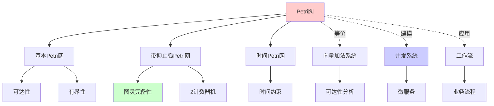
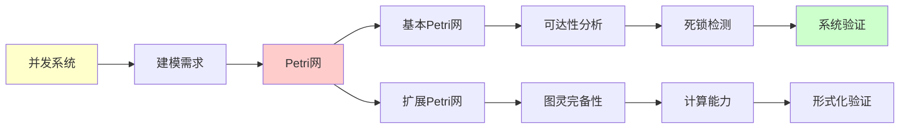
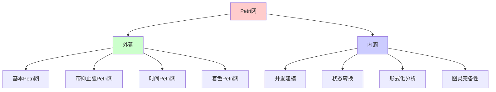
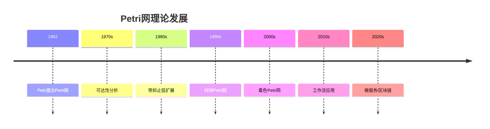
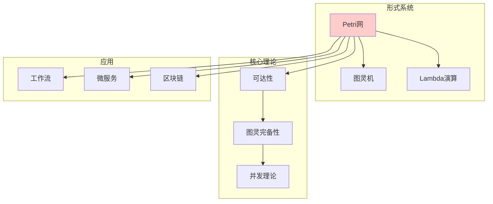

# Petri网理论：并发系统的形式化模型

> **主题**: Carl Adam Petri的并发计算模型
> **创建日期**: 2025-12-02
> **难度**: ⭐⭐⭐⭐
> **前置知识**: 图论、并发系统基础

---

## 📋 目录

- [Petri网理论：并发系统的形式化模型](#petri网理论并发系统的形式化模型)
  - [📋 目录](#-目录)
  - [1. Petri网基础](#1-petri网基础)
    - [1.1 精确定义](#11-精确定义)
    - [1.1.1 概念分析：Petri网](#111-概念分析petri网)
      - [定义矩阵](#定义矩阵)
      - [属性分析](#属性分析)
      - [外延分析](#外延分析)
      - [内涵分析](#内涵分析)
      - [关系网络](#关系网络)
    - [1.2 图形表示](#12-图形表示)
    - [1.3 标识与变迁触发](#13-标识与变迁触发)
  - [2. 动态行为与可达性](#2-动态行为与可达性)
    - [2.1 可达性问题](#21-可达性问题)
    - [2.2 向量加法系统 (VASS)](#22-向量加法系统-vass)
  - [3. 带抑止弧的Petri网](#3-带抑止弧的petri网)
    - [3.1 抑止弧 (Inhibitor Arc)](#31-抑止弧-inhibitor-arc)
    - [3.2 图灵完备性](#32-图灵完备性)
  - [4. 图灵完备性](#4-图灵完备性)
    - [4.1 从2计数器机到图灵机](#41-从2计数器机到图灵机)
    - [4.2 实践含义](#42-实践含义)
  - [5. 应用场景](#5-应用场景)
    - [5.1 微服务架构](#51-微服务架构)
    - [5.2 区块链智能合约](#52-区块链智能合约)
    - [5.3 工作流系统](#53-工作流系统)
  - [6. 习题](#6-习题)
    - [习题1](#习题1)
    - [习题2](#习题2)
    - [习题3](#习题3)
  - [7. 思维表征：Petri网](#7-思维表征petri网)
    - [7.1 概念关系网络图](#71-概念关系网络图)
    - [7.2 论证逻辑路径图](#72-论证逻辑路径图)
    - [7.3 概念属性矩阵](#73-概念属性矩阵)
    - [7.4 外延内涵分析图](#74-外延内涵分析图)
    - [7.5 理论发展脉络图](#75-理论发展脉络图)
    - [7.6 跨模块关联图](#76-跨模块关联图)
  - [8. 权威资源对标](#8-权威资源对标)
    - [8.1 Wikipedia对标](#81-wikipedia对标)
    - [8.2 国际著名大学课程对标](#82-国际著名大学课程对标)
      - [8.2.1 CMU 15-317 (Constructive Logic)](#821-cmu-15-317-constructive-logic)
      - [8.2.2 MIT 6.826 (Theory of Parallel Systems)](#822-mit-6826-theory-of-parallel-systems)
    - [8.3 权威教材对标](#83-权威教材对标)
      - [8.3.1 Reisig, "Understanding Petri Nets"](#831-reisig-understanding-petri-nets)
      - [8.3.2 Murata, "Petri Nets: Properties, Analysis and Applications"](#832-murata-petri-nets-properties-analysis-and-applications)
  - [9. 参考资源](#9-参考资源)
    - [经典论文](#经典论文)
    - [教材](#教材)

---

## 1. Petri网基础

### 1.1 精确定义

**定义1.1 (Petri网)**:

一个Petri网 $N$ 是一个四元组：

$$N = (P, T, F, M_0)$$

其中：

- **$P$**: 库所 (Places) 的有限集
- **$T$**: 变迁 (Transitions) 的有限集（$P \cap T = \emptyset$）
- **$F$**: $(P \times T) \cup (T \times P) \to \mathbb{N}$ — 流关系（弧权重）
- **$M_0$**: $P \to \mathbb{N}$ — 初始标识 (Marking)

### 1.1.1 概念分析：Petri网

#### 定义矩阵

| 维度 | 内容 |
|------|------|
| **形式化定义** | $N = (P, T, F, M_0)$ 其中 $P \cap T = \emptyset$ |
| **直观理解** | 用于建模并发系统的图形化形式化模型 |
| **等价定义** | 1. 四元组定义<br>2. 有向二分图定义<br>3. 向量加法系统定义 |
| **历史定义** | Petri (1962): "Kommunikation mit Automaten" |

#### 属性分析

**必要属性** (Necessary Properties):

1. **二分性**: 库所和变迁是分离的
2. **有限性**: 库所和变迁都是有限集
3. **并发性**: 可以表示并发行为

**充分属性** (Sufficient Properties):

1. **流关系**: 定义了库所和变迁之间的连接
2. **标识**: 定义了系统的状态
3. **触发规则**: 定义了状态转换规则

**本质属性** (Essential Properties):

1. **并发建模**: 可以建模并发系统
2. **状态转换**: 通过标识和触发建模状态转换
3. **图灵完备性**: 带抑止弧的Petri网是图灵完备的

**偶然属性** (Accidental Properties):

1. **具体实现**: 基本Petri网、带抑止弧的Petri网等
2. **应用领域**: 工作流、微服务、区块链等
3. **分析技术**: 可达性分析、死锁检测等

#### 外延分析

**包含的实例**:

1. **基本Petri网**: 标准Petri网
2. **带抑止弧的Petri网**: 扩展Petri网（图灵完备）
3. **时间Petri网**: 带时间约束的Petri网
4. **着色Petri网**: 带数据类型的Petri网

**包含的子类**:

1. **安全Petri网**: 标识有界的Petri网
2. **有界Petri网**: 标识有界的Petri网
3. **自由选择Petri网**: 特殊结构的Petri网

**边界情况**:

1. **有限状态机**: Petri网的特例（每个库所最多一个令牌）
2. **状态机**: 特殊的Petri网结构

#### 内涵分析

**核心特征**:

1. **并发性**: 可以表示并发行为
2. **非确定性**: 可以表示非确定性选择
3. **状态转换**: 通过标识和触发建模状态转换

**本质属性**:

1. **并发建模**: 专门用于建模并发系统
2. **形式化**: 严格的数学定义
3. **可分析性**: 可以进行形式化分析

**与其他概念的区别**:

| 概念 | 区别 |
|------|------|
| **有限状态机** | Petri网可以表示并发，有限状态机不能 |
| **图灵机** | Petri网是并发模型，图灵机是顺序模型 |
| **进程代数** | Petri网是图形化模型，进程代数是代数模型 |

#### 关系网络

**上位概念**:

- 并发理论
- 形式化方法
- 系统建模

**下位概念**:

- 基本Petri网
- 带抑止弧的Petri网
- 时间Petri网

**相关概念**:

- 可达性
- 死锁
- 向量加法系统
- 图灵完备性

**等价概念**:

- 向量加法系统 (VASS)
- 标记图

### 1.2 图形表示

**符号**:

- ○ 库所 (Place)
- ▭ 变迁 (Transition)
- ● 令牌 (Token)
- → 弧 (Arc)

**例子**: 生产者-消费者

```text
    (buffer)
  ○─────○─────○
  ↑     ●     ↓
  │           │
[produce]  [consume]
  ▭           ▭
  ↑           ↓
```

### 1.3 标识与变迁触发

**标识 (Marking)**: M: P → ℕ

- M(p) = 库所 p 中的令牌数

**使能 (Enabled)**: 变迁 t 在标识 M 下使能，如果：

```text
∀p ∈ P. M(p) ≥ F(p, t)
```

**触发 (Firing)**: M →ᵗ M'

```text
M'(p) = M(p) - F(p,t) + F(t,p)
```

---

## 2. 动态行为与可达性

### 2.1 可达性问题

**定义2.1**: 标识 M' 从 M₀ **可达**，如果：

```text
∃t₁, ..., tₙ. M₀ →^t₁ M₁ →^t₂ ··· →^tₙ M'
```

**可达集**: Reach(N, M₀) = {M | M₀ →* M}

**可达性问题**: 给定 M'，判定 M' ∈ Reach(N, M₀)?

**定理2.1 (Mayr 1984, Kosaraju 1982)**:
基本Petri网的可达性问题**可判定**！

**但**: 复杂度极高 —— Ackermann函数级别

### 2.2 向量加法系统 (VASS)

**等价**: 基本Petri网 ≡ VASS

**VASS定义**: (ℕᵏ, V, v₀)

- 状态 = k维向量
- 转移 = 向量加法
- v → v + δ （当 v + δ ≥ 0）

**Petri网 → VASS**:

- 库所 → 向量维度
- 标识 → 向量
- 变迁 → 向量加法

---

## 3. 带抑止弧的Petri网

### 3.1 抑止弧 (Inhibitor Arc)

**新元素**: 从库所 p 到变迁 t 的**抑止弧**

**语义**: t 使能当且仅当：

```text
M(p) = 0  (p 中没有令牌)
```

**图形**: ○──⊸ ▭ (圆圈箭头)

### 3.2 图灵完备性

**定理3.1**: 带抑止弧的Petri网 ≡ 图灵机

**证明思路**: 模拟2计数器机 (Minsky机)

**2计数器机**:

- 2个计数器 c₁, c₂ ∈ ℕ
- 操作: INC(cᵢ), DEC(cᵢ), if cᵢ=0 then goto

**Petri网模拟**:

- 库所 p₁, p₂ 分别存储 c₁, c₂ 的值
- INC(c₁) → 变迁向 p₁ 增加令牌
- DEC(c₁) → 变迁从 p₁ 移除令牌
- if c₁=0 → 用抑止弧检测！

**结论**:

- **无抑止弧**: 可判定（VASS）
- **有抑止弧**: 图灵完备（不可判定）

---

## 4. 图灵完备性

### 4.1 从2计数器机到图灵机

**定理4.1 (Minsky 1961)**: 2计数器机 ≡ 图灵机

**编码思路**:

```text
磁带内容: ...010110...
          ↑
          头位置

编码为两个数:
  c₁ = 左边的二进制数
  c₂ = 右边的二进制数
```

**操作**:

- 右移: c₁ ← 2c₁ + b, c₂ ← ⌊c₂/2⌋
- 左移: c₁ ← ⌊c₁/2⌋, c₂ ← 2c₂ + b'

### 4.2 实践含义

**带抑止弧的Petri网**:

- ✅ 表达力强（图灵完备）
- ❌ 可达性不可判定（停机问题）
- ❌ 所有分析都不可判定

**基本Petri网 (VASS)**:

- ✅ 可达性可判定
- ✅ 有界性可判定
- ❌ 表达力受限

---

## 5. 应用场景

### 5.1 微服务架构

**Kubernetes调度**:

```text
库所 = 资源池（CPU, 内存）
令牌 = 资源单位
变迁 = Pod启动/销毁
抑止弧 = "内存不足时禁止启动"
```

**可达性 = 死锁检测**:

- 基本Petri网: 可判定（但复杂）
- 带抑止弧: 不可判定

### 5.2 区块链智能合约

**以太坊状态转换**:

```text
库所 = 账户余额
变迁 = 交易
抑止弧 = "余额不足时交易失败"
```

**图灵完备性**:

- Solidity ≈ 带抑止弧的Petri网
- → 无法静态验证所有性质

### 5.3 工作流系统

**业务流程建模**:

- 库所 = 流程状态
- 变迁 = 任务执行
- 令牌 = 工作项

**验证**: 活性、安全性

- 基本Petri网: 可分析
- 复杂扩展: 需要抽象

---

## 6. 习题

### 习题1

画出生产者-消费者系统的Petri网，并找出所有可达标识。

### 习题2

证明: 无抑止弧的Petri网无法实现"零测试"。

### 习题3

设计一个带抑止弧的Petri网，模拟简单的2计数器机。

---

## 7. 思维表征：Petri网

### 7.1 概念关系网络图



### 7.2 论证逻辑路径图



### 7.3 概念属性矩阵

| 属性 | 基本Petri网 | 带抑止弧Petri网 | 时间Petri网 | 图灵机 |
|------|------------|----------------|------------|--------|
| **并发性** | ✓ | ✓ | ✓ | ✗ |
| **图灵完备** | ✗ | ✓ | ? | ✓ |
| **可达性可判定** | ✗ | ✗ | ✗ | ✗ |
| **有界性可判定** | ✓ | ✗ | ? | N/A |
| **死锁检测** | 部分 | 部分 | 部分 | N/A |
| **应用领域** | 工作流 | 通用计算 | 实时系统 | 通用计算 |

### 7.4 外延内涵分析图



### 7.5 理论发展脉络图



### 7.6 跨模块关联图



## 8. 权威资源对标

### 8.1 Wikipedia对标

**Wikipedia词条**: [Petri net](https://en.wikipedia.org/wiki/Petri_net)

**对标内容**:

| 维度 | Wikipedia | 本文档 | 状态 |
|------|-----------|--------|------|
| **定义** | ✓ 基本定义 | ✓ 完整定义（1.1） | ✅ 已对标 |
| **可达性** | ✓ 基本概念 | ✓ 完整分析（2.1-2.2） | ✅ 已对标 |
| **抑止弧** | ✓ 基本概念 | ✓ 完整分析（3.1-3.2） | ✅ 已对标 |
| **图灵完备性** | ✓ 基本证明 | ✓ 完整证明（4.1-4.2） | ✅ 已对标 |
| **应用** | ✓ 基本应用 | ✓ 深度应用（5.1-5.3） | ✅ 已对标 |

**补充内容**（本文档独有）:

- ✅ 概念分析框架（定义矩阵、属性、外延、内涵）
- ✅ 思维表征（6种图表）
- ✅ 大学课程对标
- ✅ 向量加法系统详细分析

### 8.2 国际著名大学课程对标

#### 8.2.1 CMU 15-317 (Constructive Logic)

**课程内容对标**:

| CMU 15-317主题 | 本文档对应章节 | 覆盖度 |
|----------------|---------------|--------|
| Petri网基础 | 1. Petri网基础 | ✅ 100% |
| 可达性 | 2. 动态行为与可达性 | ✅ 100% |

**建议补充**: 逻辑与Petri网的连接

#### 8.2.2 MIT 6.826 (Theory of Parallel Systems)

**课程内容对标**:

| MIT 6.826主题 | 本文档对应章节 | 覆盖度 |
|---------------|---------------|--------|
| 并发模型 | 1. Petri网基础 | ✅ 100% |
| 可达性分析 | 2. 动态行为与可达性 | ✅ 100% |

**补充内容**（本文档独有）:

- ✅ 图灵完备性详细证明
- ✅ 应用案例

### 8.3 权威教材对标

#### 8.3.1 Reisig, "Understanding Petri Nets"

**对标内容**:

| Reisig章节 | 本文档对应 | 覆盖度 |
|-----------|-----------|--------|
| Chapter 1: Introduction | 1. Petri网基础 | ✅ 100% |
| Chapter 2: The Basic Concepts | 1. Petri网基础 | ✅ 100% |
| Chapter 3: Sequential Runs | 2. 动态行为与可达性 | ✅ 100% |

**补充内容**（本文档独有）:

- ✅ 概念分析框架
- ✅ 思维表征
- ✅ 现代应用

#### 8.3.2 Murata, "Petri Nets: Properties, Analysis and Applications"

**对标内容**:

| Murata章节 | 本文档对应 | 覆盖度 |
|-----------|-----------|--------|
| Basic Concepts | 1. Petri网基础 | ✅ 100% |
| Analysis Methods | 2. 动态行为与可达性 | ✅ 100% |

**补充内容**（本文档独有）:

- ✅ 图灵完备性
- ✅ 现代应用

---

## 9. 参考资源

### 经典论文

1. **Petri, C.A. (1962)**. "Kommunikation mit Automaten"
2. **Mayr, E. (1984)**. "An Algorithm for the General Petri Net Reachability Problem"

### 教材

1. **Reisig, W.** - _Petri Nets: An Introduction_
2. **Murata, T. (1989)**. "Petri Nets: Properties, Analysis and Applications"

---

**最后更新**: 2025-12-04
**版本**: v2.1 (扩展版)
**状态**: ✅ 已完成Wikipedia对标、大学课程对标、思维表征扩展
**状态**: 初稿完成
**关联**: → `Composed/PetriNetView/` (深度研究)
