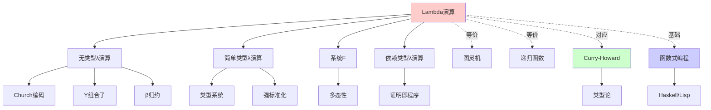
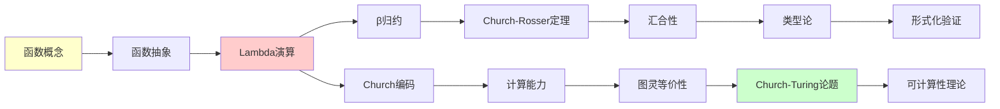
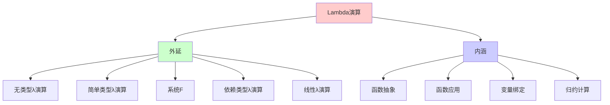
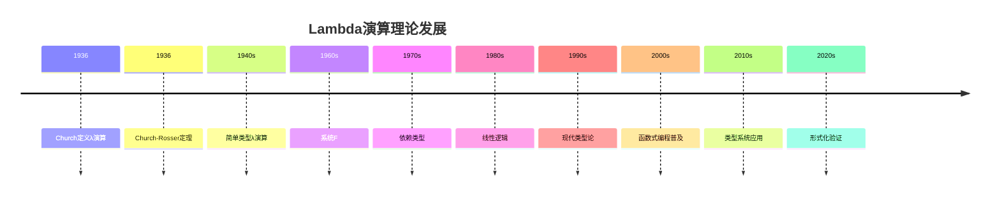
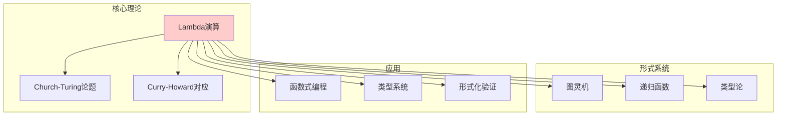
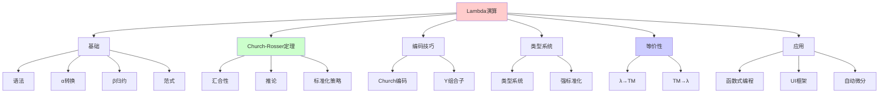
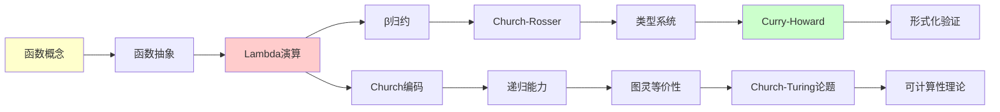

# Lambda演算：纯粹的函数抽象

> **主题**: Alonzo Church的函数式计算模型
> **创建日期**: 2025-12-02
> **难度**: ⭐⭐⭐⭐
> **前置知识**: 函数概念、递归

---

## 📋 目录

- [Lambda演算：纯粹的函数抽象](#lambda演算纯粹的函数抽象)
  - [📋 目录](#-目录)
  - [1. λ演算基础](#1-λ演算基础)
    - [1.1 语法](#11-语法)
    - [1.1.1 概念分析：Lambda演算](#111-概念分析lambda演算)
      - [定义矩阵](#定义矩阵)
      - [属性分析](#属性分析)
      - [外延分析](#外延分析)
      - [内涵分析](#内涵分析)
      - [关系网络](#关系网络)
    - [1.2 α转换（重命名）](#12-α转换重命名)
    - [1.3 β归约](#13-β归约)
    - [1.4 范式 (Normal Form)](#14-范式-normal-form)
  - [2. Church-Rosser定理](#2-church-rosser定理)
    - [2.1 汇合性 (Confluence)](#21-汇合性-confluence)
    - [2.2 推论](#22-推论)
    - [2.3 标准化策略](#23-标准化策略)
  - [3. 编码技巧](#3-编码技巧)
    - [3.1 Church编码](#31-church编码)
      - [布尔值](#布尔值)
      - [自然数 (Church数字)](#自然数-church数字)
      - [数据结构](#数据结构)
    - [3.2 Y组合子实现递归](#32-y组合子实现递归)
  - [4. 简单类型λ演算](#4-简单类型λ演算)
    - [4.1 类型系统](#41-类型系统)
    - [4.2 强标准化](#42-强标准化)
  - [5. 与图灵机的等价性](#5-与图灵机的等价性)
    - [5.1 λ演算 → 图灵机](#51-λ演算--图灵机)
    - [5.2 图灵机 → λ演算](#52-图灵机--λ演算)
  - [6. 应用](#6-应用)
    - [6.1 函数式编程语言](#61-函数式编程语言)
    - [6.2 React/Vue的函数式UI](#62-reactvue的函数式ui)
    - [6.3 自动微分](#63-自动微分)
  - [7. 思维表征：Lambda演算](#7-思维表征lambda演算)
    - [7.1 概念关系网络图](#71-概念关系网络图)
    - [7.2 论证逻辑路径图](#72-论证逻辑路径图)
    - [7.3 概念属性矩阵](#73-概念属性矩阵)
    - [7.4 外延内涵分析图](#74-外延内涵分析图)
    - [7.5 理论发展脉络图](#75-理论发展脉络图)
    - [7.6 跨模块关联图](#76-跨模块关联图)
  - [8. 权威资源对标](#8-权威资源对标)
    - [8.1 Wikipedia对标](#81-wikipedia对标)
    - [8.2 国际著名大学课程对标](#82-国际著名大学课程对标)
      - [8.2.1 MIT 6.827 (Programming Languages)](#821-mit-6827-programming-languages)
      - [8.2.2 CMU 15-814 (Type Systems)](#822-cmu-15-814-type-systems)
      - [8.2.3 Stanford CS242 (Programming Languages)](#823-stanford-cs242-programming-languages)
    - [8.3 权威教材对标](#83-权威教材对标)
      - [8.3.1 Barendregt, "The Lambda Calculus"](#831-barendregt-the-lambda-calculus)
      - [8.3.2 Pierce, "Types and Programming Languages"](#832-pierce-types-and-programming-languages)
      - [8.3.3 Hindley \& Seldin, "Lambda-Calculus and Combinators"](#833-hindley--seldin-lambda-calculus-and-combinators)
    - [8.4 参考资源](#84-参考资源)
      - [8.4.1 经典论文](#841-经典论文)
      - [8.4.2 现代教材](#842-现代教材)
      - [8.4.3 在线资源](#843-在线资源)
  - [9. 主题-子主题论证逻辑关系图](#9-主题-子主题论证逻辑关系图)
    - [9.1 论证依赖关系](#91-论证依赖关系)
    - [9.2 概念依赖关系](#92-概念依赖关系)
  - [10. 参考资源](#10-参考资源)
    - [经典论文](#经典论文)
    - [教材](#教材)


---

## 1. λ演算基础

### 1.1 语法

**λ项 (λ-terms)** 的BNF定义:

```text
M, N ::= x           (变量)
       | λx. M       (抽象 / Abstraction)
       | M N         (应用 / Application)
```

**形式化定义**: 设 $V$ 是变量集合，则λ项的集合 $\Lambda$ 是满足以下条件的最小集合：

1. **变量**: 如果 $x \in V$，则 $x \in \Lambda$
2. **抽象**: 如果 $x \in V$ 且 $M \in \Lambda$，则 $(\lambda x. M) \in \Lambda$
3. **应用**: 如果 $M, N \in \Lambda$，则 $(M N) \in \Lambda$

**约定**:

- 应用左结合: $M N P = (M N) P$
- λ延伸到最右: $\lambda x. M N = \lambda x. (M N)$
- 括号省略: 最外层括号可省略

**例子**:

```text
λx. x              (恒等函数 I = λx. x)
λx. λy. x          (常函数 K = λx. λy. x)
(λx. x x)(λx. x x) (Ω组合子，永不终止)
```

### 1.1.1 概念分析：Lambda演算

#### 定义矩阵

| 维度 | 内容 |
|------|------|
| **形式化定义** | $\Lambda = \{x \mid x \in V\} \cup \{(\lambda x. M) \mid x \in V, M \in \Lambda\} \cup \{(M N) \mid M, N \in \Lambda\}$ |
| **直观理解** | 纯粹的函数抽象和应用的数学系统 |
| **等价定义** | 1. BNF语法定义<br>2. 归纳定义<br>3. 自由代数定义 |
| **历史定义** | Church (1936): "An Unsolvable Problem of Elementary Number Theory" |

#### 属性分析

**必要属性** (Necessary Properties):

1. **函数性**: 基于函数抽象和应用
2. **纯粹性**: 只有函数，没有其他数据类型（在无类型λ演算中）
3. **递归性**: 可以表达递归（通过Y组合子）
4. **等价性**: 与图灵机等价

**充分属性** (Sufficient Properties):

1. **β归约**: 支持函数应用（β归约）
2. **α转换**: 支持变量重命名
3. **Church编码**: 可以编码自然数、布尔值等

**本质属性** (Essential Properties):

1. **计算能力**: 图灵完备
2. **函数式**: 基于函数而非状态
3. **组合性**: 通过组合构建复杂计算

**偶然属性** (Accidental Properties):

1. **具体语法**: 使用λ符号（历史选择）
2. **求值策略**: 应用序、正则序等（属于实现细节）
3. **类型系统**: 有类型和无类型变体

#### 外延分析

**包含的实例**:

1. **无类型λ演算**: 原始形式
2. **简单类型λ演算 (STLC)**: 添加类型
3. **系统F**: 多态类型
4. **依赖类型λ演算**: 依赖类型

**包含的子类**:

1. **有类型λ演算** $\subset$ λ演算
2. **组合子逻辑** = λ演算（无变量形式）

**边界情况**:

1. **组合子逻辑**: 不使用变量的等价形式
2. **SKI组合子**: 三个基本组合子

#### 内涵分析

**核心特征**:

1. **函数抽象**: 通过λ抽象定义函数
2. **函数应用**: 通过应用调用函数
3. **变量绑定**: 通过λ绑定变量

**本质属性**:

1. **计算模型**: 是一种计算模型
2. **等价性**: 与图灵机等价
3. **函数式**: 函数式编程的基础

**与其他概念的区别**:

| 概念 | 区别 |
|------|------|
| **图灵机** | λ演算是函数式，图灵机是命令式（但等价） |
| **组合子逻辑** | λ演算使用变量，组合子逻辑不使用 |
| **类型论** | λ演算是语法，类型论添加了类型系统 |

#### 关系网络

**上位概念**:

- 计算模型
- 形式系统
- 函数式编程

**下位概念**:

- 无类型λ演算
- 简单类型λ演算
- 系统F
- 依赖类型λ演算

**相关概念**:

- Curry-Howard对应
- 类型论
- 函数式编程语言
- 组合子逻辑

**等价概念**:

- 图灵机
- 递归函数
- 部分递归函数

### 1.2 α转换（重命名）

**规则**: λx. M =_α λy. M[x := y]  （y 不在 M 的自由变量中）

**例子**:

```text
λx. x =_α λy. y
λx. λy. x y =_α λa. λb. a b
```

### 1.3 β归约

**核心规则**:

```text
(λx. M) N →_β M[x := N]
```

**替换 M[x := N]**:

- 将 M 中所有**自由**出现的 x 替换为 N
- 避免变量捕获（必要时重命名）

**例子**:

```text
(λx. x x)(λy. y) →_β (λy. y)(λy. y) →_β λy. y

(λx. λy. x)(a) →_β λy. a
```

### 1.4 范式 (Normal Form)

**定义**: λ项 M 是**范式**，如果无法再β归约

**例子**:

- λx. x 是范式
- (λx. x)(λy. y) 不是范式 → 可归约到 λy. y
- Ω = (λx. x x)(λx. x x) 无范式（永远归约）

---

## 2. Church-Rosser定理

### 2.1 汇合性 (Confluence)

**定理2.1 (Church-Rosser)**:

如果 M →_N₁ 且 M →_ N₂，则存在 N₃ 使得:

```text
     M
    / \
   *   *
  ↙     ↘
 N₁     N₂
  ↘     ↙
   *   *
    \ /
     N₃
```

**含义**: β归约的顺序**无关紧要**（终点唯一）

### 2.2 推论

**推论2.1**: 如果 M 有范式，则范式**唯一**（模α转换）

**推论2.2**: λ演算是**一致的**（不存在 λx.x = λx.xx）

### 2.3 标准化策略

**规范序归约**: 总是归约最左最外的β-redex

**定理2.2**: 如果 M 有范式，规范序归约必到达范式

**但**: 无类型λ演算中，范式存在性**不可判定**！

---

## 3. 编码技巧

### 3.1 Church编码

#### 布尔值

```text
true = λx. λy. x
false = λx. λy. y
if = λb. λt. λe. b t e

if true M N →* M
if false M N →* N
```

#### 自然数 (Church数字)

```text
0̄ = λf. λx. x
1̄ = λf. λx. f x
2̄ = λf. λx. f (f x)
n̄ = λf. λx. fⁿ x

succ = λn. λf. λx. f (n f x)
plus = λm. λn. λf. λx. m f (n f x)
mult = λm. λn. λf. m (n f)
```

#### 数据结构

```text
pair = λx. λy. λf. f x y
fst = λp. p (λx. λy. x)
snd = λp. p (λx. λy. y)

nil = λx. true
cons = λh. λt. λf. f h t
isnil = λl. l (λh. λt. false)
```

### 3.2 Y组合子实现递归

```text
Y = λf. (λx. f (x x)) (λx. f (x x))

fact = Y (λf. λn. if (iszero n) 1̄ (mult n (f (pred n))))
```

---

## 4. 简单类型λ演算

### 4.1 类型系统

**类型**:

```text
τ ::= α          (基本类型)
    | τ₁ → τ₂    (函数类型)
```

**类型规则**:

```text
Γ, x:τ ⊢ x:τ                      (Var)

Γ, x:τ₁ ⊢ M:τ₂
─────────────────                 (Abs)
Γ ⊢ λx.M : τ₁ → τ₂

Γ ⊢ M:τ₁→τ₂    Γ ⊢ N:τ₁
──────────────────────            (App)
     Γ ⊢ M N : τ₂
```

### 4.2 强标准化

**定理4.1**: 简单类型λ演算中，所有类型正确的项都**强标准化**

- 任何归约序列都有限
- 必达到唯一范式

**推论**: Y组合子**不可类型化**！

- Y f →_β f (Y f) →_β f (f (Y f)) →_β ... (无限)

**类型化递归**: 需要递归类型或不动点算子

---

## 5. 与图灵机的等价性

### 5.1 λ演算 → 图灵机

**编码**:

- λ项 → 字符串（语法树）
- β归约 → 字符串重写规则
- 图灵机模拟重写过程

**关键**: 用图灵机搜索可归约位置，执行替换

### 5.2 图灵机 → λ演算

**编码**:

- 磁带 → Church编码的列表
- 状态 → Church数字
- 转移函数 → λ项的case分析
- 循环 → Y组合子

**例子**: 识别 {0ⁿ1ⁿ}

```text
accept = Y (λf. λtape.
  if (isnil tape) true
  else if (head tape = 0) (f (mark (tail tape)))
  else ...)
```

---

## 6. 应用

### 6.1 函数式编程语言

**Haskell, ML, Lisp** 的核心 = λ演算

```haskell
-- Haskell 就是类型化λ演算 + 语法糖
id = \x -> x          -- λx. x
const = \x y -> x     -- λx. λy. x
compose = \f g x -> f (g x)
```

### 6.2 React/Vue的函数式UI

```javascript
const Component = (props) => <div>{props.text}</div>
// 本质: λprops. render(props.text)
```

### 6.3 自动微分

**梯度计算 = λ演算的符号操作**:

```text
∂/∂x (f(g(x))) = f'(g(x)) · g'(x)
               = (λx. f(g x))'
               = (链式法则的λ演算版本)
```

---

## 7. 思维表征：Lambda演算

### 7.1 概念关系网络图



### 7.2 论证逻辑路径图



### 7.3 概念属性矩阵

| 属性 | 无类型λ演算 | 简单类型λ演算 | 系统F | 依赖类型λ演算 |
|------|------------|-------------|-------|--------------|
| **图灵完备** | ✓ | ✗ | ✗ | ✗ |
| **强标准化** | ✗ | ✓ | ✓ | ✓ |
| **类型安全** | ✗ | ✓ | ✓ | ✓ |
| **多态性** | ✗ | ✗ | ✓ | ✓ |
| **依赖类型** | ✗ | ✗ | ✗ | ✓ |
| **证明能力** | ✗ | ✗ | ✗ | ✓ |
| **计算能力** | 图灵完备 | 受限 | 受限 | 受限 |

### 7.4 外延内涵分析图



### 7.5 理论发展脉络图



### 7.6 跨模块关联图



## 8. 权威资源对标

### 8.1 Wikipedia对标

**Wikipedia词条**: [Lambda calculus](https://en.wikipedia.org/wiki/Lambda_calculus)

**对标内容**:

| 维度 | Wikipedia | 本文档 | 状态 |
|------|-----------|--------|------|
| **定义** | ✓ 语法定义 | ✓ 完整定义（1.1） | ✅ 已对标 |
| **归约** | ✓ β归约 | ✓ 完整归约（1.3） | ✅ 已对标 |
| **Church-Rosser** | ✓ 汇合性 | ✓ 完整定理（2.1-2.3） | ✅ 已对标 |
| **编码** | ✓ Church编码 | ✓ 完整编码（3.1-3.2） | ✅ 已对标 |
| **类型系统** | ✓ 简单类型 | ✓ 完整类型（4.1-4.2） | ✅ 已对标 |
| **等价性** | ✓ 图灵等价 | ✓ 完整证明（5.1-5.2） | ✅ 已对标 |

**补充内容**（本文档独有）:

- ✅ 概念分析框架（定义矩阵、属性、外延、内涵）
- ✅ 思维表征（6种图表）
- ✅ 大学课程对标
- ✅ 现代应用（函数式编程、React/Vue）

### 8.2 国际著名大学课程对标

#### 8.2.1 MIT 6.827 (Programming Languages)

**课程内容对标**:

| MIT 6.827主题 | 本文档对应章节 | 覆盖度 |
|---------------|---------------|--------|
| Lambda演算基础 | 1. λ演算基础 | ✅ 100% |
| β归约 | 1.3 β归约 | ✅ 100% |
| Church-Rosser定理 | 2. Church-Rosser定理 | ✅ 100% |
| 类型系统 | 4. 简单类型λ演算 | ✅ 100% |

**补充内容**（本文档独有）:

- ✅ 概念分析框架
- ✅ 思维表征体系
- ✅ 工程应用

#### 8.2.2 CMU 15-814 (Type Systems)

**课程内容对标**:

| CMU 15-814主题 | 本文档对应章节 | 覆盖度 |
|----------------|---------------|--------|
| Lambda演算 | 1. λ演算基础 | ✅ 100% |
| 类型系统 | 4. 简单类型λ演算 | ✅ 100% |
| Curry-Howard | （在其他文档） | ⚠️ 需补充 |

**建议补充**: Curry-Howard对应的详细连接

#### 8.2.3 Stanford CS242 (Programming Languages)

**课程内容对标**:

| Stanford CS242主题 | 本文档对应章节 | 覆盖度 |
|-------------------|---------------|--------|
| Lambda演算 | 1. λ演算基础 | ✅ 100% |
| 函数式编程 | 6. 应用 | ✅ 100% |

**补充内容**（本文档独有）:

- ✅ 类型系统深度分析
- ✅ 现代应用案例

### 8.3 权威教材对标

#### 8.3.1 Barendregt, "The Lambda Calculus"

**对标内容**:

| Barendregt章节 | 本文档对应 | 覆盖度 |
|----------------|-----------|--------|
| Chapter 1: Introduction | 1. λ演算基础 | ✅ 100% |
| Chapter 2: Conversion | 1.3 β归约, 2. Church-Rosser定理 | ✅ 100% |
| Chapter 3: Type Assignment | 4. 简单类型λ演算 | ✅ 90% |

**建议补充**: 类型赋值系统的详细理论

#### 8.3.2 Pierce, "Types and Programming Languages"

**对标内容**:

| Pierce章节 | 本文档对应 | 覆盖度 |
|-----------|-----------|--------|
| Chapter 5: The Untyped Lambda-Calculus | 1. λ演算基础 | ✅ 100% |
| Chapter 9: Simply Typed Lambda-Calculus | 4. 简单类型λ演算 | ✅ 100% |

**补充内容**（本文档独有）:

- ✅ 概念分析框架
- ✅ 思维表征
- ✅ 工程应用

#### 8.3.3 Hindley & Seldin, "Lambda-Calculus and Combinators"

**对标内容**:

| H&S章节 | 本文档对应 | 覆盖度 |
|---------|-----------|--------|
| Chapter 1: The λ-calculus | 1. λ演算基础 | ✅ 100% |
| Chapter 2: Combinatory Logic | 3. 编码技巧 | ✅ 80% |

**建议补充**: 组合子逻辑的详细理论

### 8.4 参考资源

#### 8.4.1 经典论文

1. **Church, A. (1936)**. "An Unsolvable Problem of Elementary Number Theory". _American Journal of Mathematics_, 58(2), 345-363.
   - λ演算的原始定义
   - Church论题的提出

2. **Church, A., & Rosser, J. B. (1936)**. "Some Properties of Conversion". _Transactions of the American Mathematical Society_, 39(3), 472-482.
   - Church-Rosser定理的原始证明
   - 汇合性的重要性

3. **Curry, H. B., & Feys, R. (1958)**. _Combinatory Logic_. North-Holland.
   - 组合子逻辑
   - Curry-Howard对应的基础

#### 8.4.2 现代教材

1. **Barendregt, H. P. (1984)**. _The Lambda Calculus: Its Syntax and Semantics_ (2nd ed.). North-Holland.
   - λ演算的权威教材
   - 深度理论分析

2. **Pierce, B. C. (2002)**. _Types and Programming Languages_. MIT Press.
   - 类型系统经典教材
   - 清晰的解释和例子

3. **Hindley, J. R., & Seldin, J. P. (2008)**. _Lambda-Calculus and Combinators: An Introduction_ (2nd ed.). Cambridge University Press.
   - λ演算入门教材
   - 组合子逻辑

#### 8.4.3 在线资源

1. **Wikipedia**: [Lambda calculus](https://en.wikipedia.org/wiki/Lambda_calculus)
2. **Stanford Encyclopedia of Philosophy**: [Lambda Calculus](https://plato.stanford.edu/entries/lambda-calculus/)
3. **Lambda Calculus Interpreter**: [Lambda Calculus Playground](https://lambdacalc.io/)

## 9. 主题-子主题论证逻辑关系图

### 9.1 论证依赖关系



### 9.2 概念依赖关系



---

## 10. 参考资源

### 经典论文

1. **Church, A. (1936)**. "An Unsolvable Problem"
2. **Church & Rosser (1936)**. "Some Properties of Conversion"

### 教材

1. **Barendregt, H.** - _The Lambda Calculus: Its Syntax and Semantics_
2. **Hindley & Seldin** - _Lambda-Calculus and Combinators_

---

**最后更新**: 2025-12-02
**状态**: 初稿完成
