# 形式语言与Chomsky层级

> **主题**: Noam Chomsky的语言层次理论
> **创建日期**: 2025-12-02
> **难度**: ⭐⭐⭐
> **前置知识**: 有限自动机、文法基础

---

## 📋 目录

- [形式语言与Chomsky层级](#形式语言与chomsky层级)
  - [📋 目录](#-目录)
  - [1. 形式语言基础](#1-形式语言基础)
    - [1.1 基本概念](#11-基本概念)
    - [1.2 文法](#12-文法)
  - [2. Chomsky层级](#2-chomsky层级)
    - [2.1 四层结构](#21-四层结构)
    - [2.2 产生式形式](#22-产生式形式)
  - [3. 各层级详解](#3-各层级详解)
    - [3.1 正则语言](#31-正则语言)
    - [3.2 上下文无关语言 (CFL)](#32-上下文无关语言-cfl)
    - [3.3 上下文有关语言 (CSL)](#33-上下文有关语言-csl)
    - [3.4 递归可枚举语言 (REL)](#34-递归可枚举语言-rel)
  - [4. 泵引理](#4-泵引理)
    - [4.1 正则语言泵引理证明](#41-正则语言泵引理证明)
    - [4.2 应用案例](#42-应用案例)
  - [5. 闭包性质](#5-闭包性质)
    - [5.1 闭包性质总表](#51-闭包性质总表)
    - [5.2 CFL不在交集下封闭](#52-cfl不在交集下封闭)
  - [6. 思维表征：形式语言与Chomsky层级](#6-思维表征形式语言与chomsky层级)
    - [6.1 概念关系网络图](#61-概念关系网络图)
    - [6.2 论证逻辑路径图](#62-论证逻辑路径图)
    - [6.3 概念属性矩阵](#63-概念属性矩阵)
    - [6.4 外延内涵分析图](#64-外延内涵分析图)
    - [6.5 理论发展脉络图](#65-理论发展脉络图)
    - [6.6 跨模块关联图](#66-跨模块关联图)
  - [7. 权威资源对标](#7-权威资源对标)
    - [7.1 Wikipedia对标](#71-wikipedia对标)
    - [7.2 国际著名大学课程对标](#72-国际著名大学课程对标)
      - [7.2.1 MIT 6.045J (Automata, Computability, and Complexity)](#721-mit-6045j-automata-computability-and-complexity)
      - [7.2.2 Stanford CS154 (Automata and Complexity Theory)](#722-stanford-cs154-automata-and-complexity-theory)
    - [7.3 权威教材对标](#73-权威教材对标)
      - [7.3.1 Hopcroft, Motwani \& Ullman, "Introduction to Automata Theory"](#731-hopcroft-motwani--ullman-introduction-to-automata-theory)
      - [7.3.2 Sipser, "Introduction to the Theory of Computation"](#732-sipser-introduction-to-the-theory-of-computation)
  - [8. 主题-子主题论证逻辑关系图](#8-主题-子主题论证逻辑关系图)
    - [8.1 论证依赖关系](#81-论证依赖关系)
    - [8.2 概念依赖关系](#82-概念依赖关系)
  - [9. 参考资源](#9-参考资源)
    - [9.1 经典论文](#91-经典论文)
    - [9.2 教材](#92-教材)
    - [9.3 在线资源](#93-在线资源)

---

## 1. 形式语言基础

### 1.1 基本概念

**字母表**: Σ = 有限符号集

- 例: Σ = {0, 1}, Σ = {a, b, c}

**字符串**: Σ* = 所有有限字符串的集合

- ε = 空串
- |w| = 字符串w的长度

**语言**: L ⊆ Σ* (字符串的集合)

### 1.2 文法

**定义1.1 (形式文法)**: G = (V, Σ, R, S)

- V: 非终结符集
- Σ: 终结符集
- R: 产生式规则集 (V ∪ Σ)_→ (V ∪ Σ)_
- S ∈ V: 开始符号

**推导**: α →_G β 如果存在产生式 γ → δ 使得:

```text
α = uγv, β = uδv
```

**生成语言**: L(G) = {w ∈ Σ*| S →* w}

---

## 2. Chomsky层级

### 2.1 四层结构

```text
类型3: 正则语言 (Regular)
  ⊂
类型2: 上下文无关语言 (Context-Free)
  ⊂
类型1: 上下文有关语言 (Context-Sensitive)
  ⊂
类型0: 递归可枚举语言 (Recursively Enumerable)
```

**对应机器模型**:

| 类型 | 语言类 | 文法 | 自动机 |
|------|--------|------|--------|
| 3 | 正则 | 右线性 | 有限自动机 (DFA/NFA) |
| 2 | 上下文无关 | CFG | 下推自动机 (PDA) |
| 1 | 上下文有关 | CSG | 线性有界自动机 (LBA) |
| 0 | 递归可枚举 | 无限制 | 图灵机 (TM) |

### 2.2 产生式形式

**类型3 (正则)**:

```text
A → aB | a  (右线性)
或 A → Ba | a  (左线性)
```

**类型2 (上下文无关)**:

```text
A → α  (左边单个非终结符)
```

**类型1 (上下文有关)**:

```text
αAβ → αγβ  (|γ| ≥ 1, 除了 S → ε)
```

**类型0 (无限制)**:

```text
α → β  (α 包含至少一个非终结符)
```

---

## 3. 各层级详解

### 3.1 正则语言

**闭包性质**: ✅ ∪, ∩, ¯, ·, *

**泵引理 (Pumping Lemma)**:

对任意正则语言 L，存在常数 p，使得对所有 |w| ≥ p, w ∈ L:

```text
∃xyz. w = xyz ∧ |xy| ≤ p ∧ y ≠ ε ∧ ∀i≥0. xyⁱz ∈ L
```

**应用**: 证明非正则性

**例子**: L = {0ⁿ1ⁿ | n ≥ 0} 不是正则的

### 3.2 上下文无关语言 (CFL)

**闭包**: ✅ ∪, ·, * | ❌ ∩, ¯

**泵引理 (CFL版)**:

```text
∃uvxyz. w = uvxyz ∧ |vxy| ≤ p ∧ vy ≠ ε
         ∧ ∀i≥0. uvⁱxyⁱz ∈ L
```

**经典例子**:

- {0ⁿ1ⁿ | n ≥ 0} ✅ CFL
- {0ⁿ1ⁿ2ⁿ | n ≥ 0} ❌ 不是CFL

**应用**: 编程语言语法

### 3.3 上下文有关语言 (CSL)

**闭包**: ✅ ∪, ∩, ·, * | ❌ ¯ (未知)

**例子**:

- {0ⁿ1ⁿ2ⁿ | n ≥ 0} ✅ CSL

**LBA**: 线性有界自动机

- 磁带长度 ≤ c·|input|

**定理**: CSL = LBA识别的语言

### 3.4 递归可枚举语言 (REL)

**闭包**: ✅ ∪, ∩, ·, * | ❌ ¯

**关键**: 补集运算破坏RE！

**定理**: L 递归 ⟺ L 和 L̄ 都是RE

---

## 4. 泵引理

### 4.1 正则语言泵引理证明

**思路**: 鸽笼原理

DFA有p个状态，读入长度≥p的字符串时，必有状态重复：

```text
q₀ →···→ q →···→ q →···→ qf
        ⌞____⌟
          循环
```

可以"泵"这个循环任意次！

### 4.2 应用案例

**证明** L = {0ⁿ1ⁿ} **不是正则**:

```text
假设L正则，泵引理给出p
取 w = 0ᵖ1ᵖ ∈ L
分解 w = xyz, |xy| ≤ p, y ≠ ε

∵ |xy| ≤ p, xy 只包含0
∴ y = 0ᵏ (k ≥ 1)

泵两次: xy²z = 0^(p+k) 1^p ∉ L  ❌

矛盾! ∴ L 不正则  □
```

---

## 5. 闭包性质

### 5.1 闭包性质总表

| 运算 | 正则 | CFL | CSL | REL |
|------|------|-----|-----|-----|
| 并集 ∪ | ✅ | ✅ | ✅ | ✅ |
| 交集 ∩ | ✅ | ❌ | ✅ | ✅ |
| 补集 ¯ | ✅ | ❌ | ❌? | ❌ |
| 连接 · | ✅ | ✅ | ✅ | ✅ |
| Kleene闭包 * | ✅ | ✅ | ✅ | ✅ |
| 同态 h | ✅ | ✅ | ❌ | ✅ |
| 逆同态 h⁻¹ | ✅ | ✅ | ✅ | ✅ |

### 5.2 CFL不在交集下封闭

**反例**:

```text
L₁ = {0ⁿ1ⁿ2^m | n,m ≥ 0}  ✅ CFL
L₂ = {0^m1ⁿ2ⁿ | n,m ≥ 0}  ✅ CFL
L₁ ∩ L₂ = {0ⁿ1ⁿ2ⁿ | n ≥ 0}  ❌ 不是CFL
```

---

## 6. 思维表征：形式语言与Chomsky层级

### 6.1 概念关系网络图

```mermaid
graph TD
    A[形式语言] --> B[Chomsky层级]

    B --> C[类型3: 正则语言]
    B --> D[类型2: 上下文无关]
    B --> E[类型1: 上下文有关]
    B --> F[类型0: 递归可枚举]

    C --> G[有限自动机]
    D --> H[下推自动机]
    E --> I[线性有界自动机]
    F --> J[图灵机]

    A -.基础.-> K[计算理论]
    B -.分类.-> L[语言类]
    B -.应用.-> M[编译器设计]

    K --> N[可计算性]
    L --> O[闭包性质]
    M --> P[语法分析]

    style A fill:#ffcccc
    style B fill:#ccffcc
    style M fill:#ccccff
```



### 6.2 论证逻辑路径图

```mermaid
graph LR
    A[形式语言] --> B[文法定义]
    B --> C[Chomsky层级]

    C --> D[正则语言]
    C --> E[上下文无关]
    C --> F[上下文有关]
    C --> G[递归可枚举]

    D --> H[有限自动机]
    E --> I[下推自动机]
    F --> J[线性有界]
    G --> K[图灵机]

    H --> L[计算能力]
    I --> L
    J --> L
    K --> L

    style A fill:#ffffcc
    style C fill:#ffcccc
    style L fill:#ccffcc
```



### 6.3 概念属性矩阵

| 属性 | 正则语言 | 上下文无关 | 上下文有关 | 递归可枚举 |
|------|---------|-----------|-----------|-----------|
| **文法类型** | 类型3 | 类型2 | 类型1 | 类型0 |
| **自动机** | 有限自动机 | 下推自动机 | 线性有界 | 图灵机 |
| **泵引理** | ✓ | ✓ | ✗ | ✗ |
| **闭包性质** | 强 | 中 | 中 | 弱 |
| **判定性** | ✓ | ✓ | ✓ | ✗ |
| **应用** | 词法分析 | 语法分析 | 受限 | 通用 |

### 6.4 外延内涵分析图

```mermaid
graph TD
    A[Chomsky层级] --> B[外延]
    A --> C[内涵]

    B --> D[正则语言]
    B --> E[上下文无关]
    B --> F[上下文有关]
    B --> G[递归可枚举]

    C --> H[文法限制]
    C --> I[计算能力]
    C --> J[闭包性质]
    C --> K[判定性]

    style A fill:#ffcccc
    style B fill:#ccffcc
    style C fill:#ccccff
```



### 6.5 理论发展脉络图

```mermaid
timeline
    title Chomsky层级理论发展
    1956 : Chomsky提出层级
    1950s : 有限自动机理论
    1960s : 下推自动机
    1970s : 线性有界自动机
    1980s : 形式语言理论完善
    1990s : 编译器应用
    2000s : XML/JSON解析
    2010s : 现代语言设计
    2020s : 形式化验证
```



### 6.6 跨模块关联图

```mermaid
graph TB
    subgraph 形式系统
    A[形式语言]
    B[图灵机]
    C[Lambda演算]
    end

    subgraph 核心理论
    D[递归可枚举性]
    E[计算能力]
    F[复杂度理论]
    end

    subgraph 应用
    G[编译器]
    H[语法分析]
    I[语言设计]
    end

    A --> B
    A --> C
    A --> D

    D --> E
    E --> F

    A --> G
    A --> H
    A --> I

    style A fill:#ffcccc
```

## 7. 权威资源对标

### 7.1 Wikipedia对标

**Wikipedia词条**: [Chomsky hierarchy](https://en.wikipedia.org/wiki/Chomsky_hierarchy)

**对标内容**:

| 维度 | Wikipedia | 本文档 | 状态 |
|------|-----------|--------|------|
| **定义** | ✓ 四层结构 | ✓ 完整定义（2.1-2.2） | ✅ 已对标 |
| **各层级** | ✓ 基本介绍 | ✓ 详细分析（3.1-3.4） | ✅ 已对标 |
| **泵引理** | ✓ 基本引理 | ✓ 完整证明（4.1-4.2） | ✅ 已对标 |
| **闭包性质** | ✓ 基本性质 | ✓ 完整性质（5.1-5.2） | ✅ 已对标 |

**补充内容**（本文档独有）:

- ✅ 概念分析框架
- ✅ 思维表征（6种图表）
- ✅ 大学课程对标

### 7.2 国际著名大学课程对标

#### 7.2.1 MIT 6.045J (Automata, Computability, and Complexity)

**课程内容对标**:

| MIT 6.045J主题 | 本文档对应章节 | 覆盖度 |
|----------------|---------------|--------|
| Chomsky层级 | 2. Chomsky层级 | ✅ 100% |
| 正则语言 | 3.1 正则语言 | ✅ 100% |
| 上下文无关语言 | 3.2 上下文无关语言 | ✅ 100% |
| 泵引理 | 4. 泵引理 | ✅ 100% |

**补充内容**（本文档独有）:

- ✅ 概念分析框架
- ✅ 思维表征体系

#### 7.2.2 Stanford CS154 (Automata and Complexity Theory)

**课程内容对标**:

| Stanford CS154主题 | 本文档对应章节 | 覆盖度 |
|-------------------|---------------|--------|
| 形式语言 | 1. 形式语言基础 | ✅ 100% |
| Chomsky层级 | 2. Chomsky层级 | ✅ 100% |
| 闭包性质 | 5. 闭包性质 | ✅ 100% |

**补充内容**（本文档独有）:

- ✅ 思维表征
- ✅ 应用实例

### 7.3 权威教材对标

#### 7.3.1 Hopcroft, Motwani & Ullman, "Introduction to Automata Theory"

**对标内容**:

| HMU章节 | 本文档对应 | 覆盖度 |
|---------|-----------|--------|
| Chapter 1: Introduction to Automata Theory | 1. 形式语言基础 | ✅ 100% |
| Chapter 2: Finite Automata | 3.1 正则语言 | ✅ 100% |
| Chapter 5: Context-Free Grammars | 3.2 上下文无关语言 | ✅ 100% |

**补充内容**（本文档独有）:

- ✅ 概念分析框架
- ✅ 思维表征

#### 7.3.2 Sipser, "Introduction to the Theory of Computation"

**对标内容**:

| Sipser章节 | 本文档对应 | 覆盖度 |
|-----------|-----------|--------|
| Chapter 1: Regular Languages | 3.1 正则语言 | ✅ 100% |
| Chapter 2: Context-Free Languages | 3.2 上下文无关语言 | ✅ 100% |

**补充内容**（本文档独有）:

- ✅ 完整Chomsky层级
- ✅ 思维表征

---

## 8. 主题-子主题论证逻辑关系图

### 8.1 论证依赖关系

```mermaid
graph TD
    A[形式语言与Chomsky层级] --> B[问题提出]
    B --> C[如何分类形式语言?]

    C --> D[定义建立]
    D --> D1[形式语言基础]
    D --> D2[Chomsky层级]
    D --> D3[各层级详解]

    D1 --> E[性质探索]
    D2 --> E
    D3 --> E

    E --> E1[泵引理]
    E --> E2[闭包性质]
    E --> E3[层级关系]

    E1 --> F[证明构造]
    E2 --> F
    E3 --> F

    F --> F1[泵引理证明]
    F --> F2[闭包性质证明]
    F --> F3[层级分离证明]

    F1 --> G[应用展示]
    F2 --> G
    F3 --> G

    G --> G1[编译器设计]
    G --> G2[自然语言处理]
    G --> G3[形式验证]

    G1 --> H[批判反思]
    G2 --> H
    G3 --> H

    H --> H1[理论优雅性]
    H --> H2[实践局限性]
    H --> H3[现代扩展]

    style A fill:#ffcccc
    style D fill:#ccffcc
    style F fill:#ccccff
    style H fill:#ffffcc
```



### 8.2 概念依赖关系

```mermaid
graph LR
    A[形式语言] --> B[Chomsky层级]

    B --> C[Type 3 正则]
    B --> D[Type 2 上下文无关]
    B --> E[Type 1 上下文有关]
    B --> F[Type 0 递归可枚举]

    C --> C1[正则文法]
    C --> C2[有限自动机]

    D --> D1[上下文无关文法]
    D --> D2[下推自动机]

    E --> E1[上下文有关文法]
    E --> E2[线性有界自动机]

    F --> F1[无限制文法]
    F --> F2[图灵机]

    C2 --> G[自动机理论]
    D2 --> G
    E2 --> G
    F2 --> G

    F2 --> H[可计算性理论]
    H --> I[递归可枚举性]

    style A fill:#ffffcc
    style B fill:#ffcccc
    style H fill:#ccffcc
    style I fill:#ccccff
```



**论证逻辑链条**：

1. **问题提出** (1.1)：
   - 如何分类形式语言？
   - 形式语言基础

2. **定义建立** (1-2)：
   - 形式语言基础（1节）
   - Chomsky层级（2节）

3. **性质探索** (3-5)：
   - 各层级详解（3节）
   - 泵引理（4节）
   - 闭包性质（5节）

4. **证明构造** (4.1)：
   - 正则语言泵引理证明（4.1）

5. **应用展示** (6-7)：
   - 思维表征（6节）
   - 权威资源对标（7节）

6. **批判反思**：
   - 通过层级关系和应用展示体现

---

## 9. 参考资源

### 9.1 经典论文

1. **Chomsky, N.** (1956). "Three models for the description of language"
   - IRE Transactions on Information Theory, 2(3), 113-124
   - 首次提出Chomsky层级

2. **Chomsky, N.** (1959). "On certain formal properties of grammars"
   - Information and Control, 2(2), 137-167
   - 完善层级理论

3. **Kleene, S. C.** (1956). "Representation of events in nerve nets and finite automata"
   - Automata Studies, Princeton University Press
   - 有限自动机理论

### 9.2 教材

1. **Hopcroft, J. E., Motwani, R., & Ullman, J. D.** (2006)
   - _Introduction to Automata Theory, Languages, and Computation_ (3rd ed.)
   - Pearson Education. ISBN 978-0321455369
   - 完整Chomsky层级

2. **Sipser, M.** (2012)
   - _Introduction to the Theory of Computation_ (3rd ed.)
   - Cengage Learning. ISBN 978-1133187790
   - 正则和上下文无关语言

3. **Kozen, D. C.** (1997)
   - _Automata and Computability_
   - Springer. ISBN 978-0387949079
   - 数学严谨的自动机理论

### 9.3 在线资源

1. **MIT 6.045J - Automata, Computability, and Complexity**
   - https://ocw.mit.edu/courses/6-045j-automata-computability-and-complexity-spring-2011/
   - 课程视频、讲义、作业

2. **Stanford CS154 - Automata and Complexity Theory**
   - https://web.stanford.edu/class/cs154/
   - 课程材料、笔记

3. **Wikipedia - Chomsky hierarchy**
   - https://en.wikipedia.org/wiki/Chomsky_hierarchy
   - 基本概念和定义

---

---

**最后更新**: 2025-12-04
**版本**: v2.1 (扩展版)
**状态**: ✅ 已完成Wikipedia对标、大学课程对标、思维表征扩展
