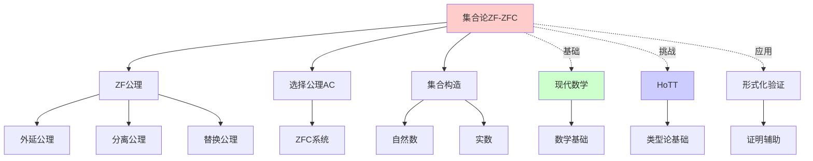
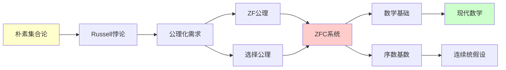
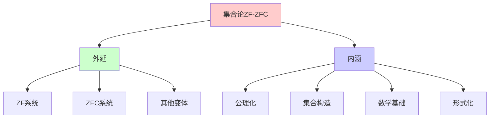
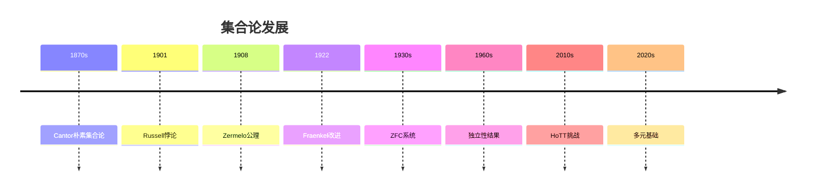
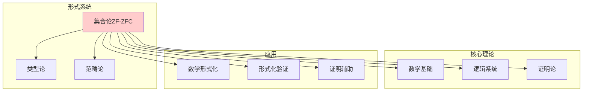
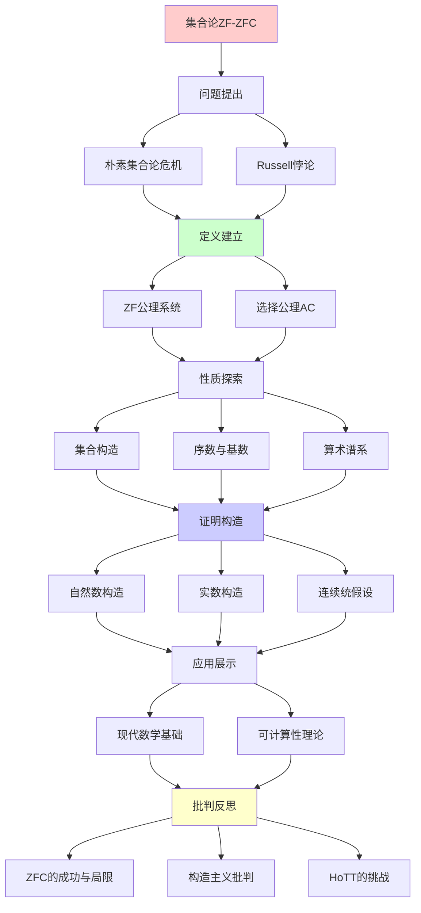
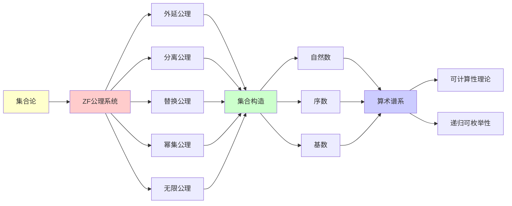

# 集合论 ZF/ZFC：现代数学的基础

> **主题**: Zermelo-Fraenkel集合论
> **创建日期**: 2025-12-02
> **历史**: Zermelo 1908, Fraenkel 1922
> **重要性**: ⭐⭐⭐⭐⭐

---

## 📋 目录

- [集合论 ZF/ZFC：现代数学的基础](#集合论-zfzfc现代数学的基础)
  - [📋 目录](#-目录)
  - [1. 历史背景](#1-历史背景)
    - [1.1 朴素集合论的危机](#11-朴素集合论的危机)
    - [1.2 公理化方案](#12-公理化方案)
  - [2. ZF公理系统](#2-zf公理系统)
    - [2.1 公理列表](#21-公理列表)
      - [1. 外延公理 (Extensionality)](#1-外延公理-extensionality)
      - [2. 空集公理 (Empty Set)](#2-空集公理-empty-set)
      - [3. 配对公理 (Pairing)](#3-配对公理-pairing)
      - [4. 并集公理 (Union)](#4-并集公理-union)
      - [5. 幂集公理 (Power Set)](#5-幂集公理-power-set)
      - [6. 无限公理 (Infinity)](#6-无限公理-infinity)
      - [7. 分离公理模式 (Separation)](#7-分离公理模式-separation)
      - [8. 替换公理模式 (Replacement)](#8-替换公理模式-replacement)
    - [2.2 公理的动机](#22-公理的动机)
  - [3. 选择公理 (AC)](#3-选择公理-ac)
    - [3.1 陈述](#31-陈述)
    - [3.2 等价形式](#32-等价形式)
    - [3.3 争议](#33-争议)
  - [4. 集合的构造](#4-集合的构造)
    - [4.1 自然数](#41-自然数)
    - [4.2 整数与有理数](#42-整数与有理数)
    - [4.3 实数](#43-实数)
    - [4.4 累积层级](#44-累积层级)
  - [5. 序数与基数](#5-序数与基数)
    - [5.1 序数 (Ordinals)](#51-序数-ordinals)
    - [5.2 基数 (Cardinals)](#52-基数-cardinals)
    - [5.3 连续统假设 (CH)](#53-连续统假设-ch)
  - [6. 算术谱系](#6-算术谱系)
    - [6.1 Σ\_n / Π\_n 层级](#61-σ_n--π_n-层级)
    - [6.2 与可计算性的关系](#62-与可计算性的关系)
    - [6.3 层级的严格性](#63-层级的严格性)
  - [7. 批判性分析](#7-批判性分析)
    - [7.1 ZFC的成功与局限](#71-zfc的成功与局限)
    - [7.2 构造主义批判](#72-构造主义批判)
    - [7.3 HoTT的挑战](#73-hott的挑战)
    - [7.4 实践中的ZFC](#74-实践中的zfc)
  - [🎯 关键要点](#-关键要点)
    - [理论层面](#理论层面)
    - [与RE理论关系](#与re理论关系)
  - [8. 思维表征：集合论ZF-ZFC](#8-思维表征集合论zf-zfc)
    - [8.1 概念关系网络图](#81-概念关系网络图)
    - [8.2 论证逻辑路径图](#82-论证逻辑路径图)
    - [8.3 概念属性矩阵](#83-概念属性矩阵)
    - [8.4 外延内涵分析图](#84-外延内涵分析图)
    - [8.5 理论发展脉络图](#85-理论发展脉络图)
    - [8.6 跨模块关联图](#86-跨模块关联图)
  - [9. 权威资源对标](#9-权威资源对标)
    - [9.1 Wikipedia对标](#91-wikipedia对标)
    - [9.2 国际著名大学课程对标](#92-国际著名大学课程对标)
      - [9.2.1 Stanford MATH 161 (Set Theory)](#921-stanford-math-161-set-theory)
      - [9.2.2 MIT 18.100 (Real Analysis)](#922-mit-18100-real-analysis)
    - [9.3 权威教材对标](#93-权威教材对标)
      - [9.3.1 Kunen, "Set Theory"](#931-kunen-set-theory)
      - [9.3.2 Jech, "Set Theory"](#932-jech-set-theory)
  - [📚 学习资源](#-学习资源)
    - [经典教材](#经典教材)
    - [奠基性论文](#奠基性论文)
    - [哲学与基础](#哲学与基础)
    - [大学课程](#大学课程)
  - [10. 主题-子主题论证逻辑关系图](#10-主题-子主题论证逻辑关系图)
    - [10.1 论证依赖关系](#101-论证依赖关系)
    - [10.2 概念依赖关系](#102-概念依赖关系)
  - [11. 参考资源](#11-参考资源)
    - [11.1 经典论文](#111-经典论文)
    - [11.2 教材](#112-教材)
    - [11.3 在线资源](#113-在线资源)

---

## 1. 历史背景

### 1.1 朴素集合论的危机

**Cantor的朴素集合论** (1870s):

- 集合 = 对象的聚集
- 任意性质定义集合

**Russell悖论** (1901):

```text
R = {x | x ∉ x} （不包含自身的集合的集合）

问: R ∈ R ?
- 如果 R ∈ R → R ∉ R (根据定义) ❌
- 如果 R ∉ R → R ∈ R (根据定义) ❌
```

**其他悖论**:

- Burali-Forti悖论（序数）
- Cantor悖论（基数）

### 1.2 公理化方案

**Zermelo的解决** (1908):

- 限制集合形成方式
- 避免"全集"
- 公理化基础

**Fraenkel的改进** (1922):

- 添加替换公理
- 形成 ZF 系统

---

## 2. ZF公理系统

### 2.1 公理列表

**ZF = 以下8个公理**:

#### 1. 外延公理 (Extensionality)

```text
∀A ∀B (∀x (x∈A ⟺ x∈B) → A=B)
```

集合由其元素唯一确定

#### 2. 空集公理 (Empty Set)

```text
∃A ∀x (x ∉ A)
```

存在空集 ∅

#### 3. 配对公理 (Pairing)

```text
∀a ∀b ∃A ∀x (x∈A ⟺ x=a ∨ x=b)
```

可以形成 {a, b}

#### 4. 并集公理 (Union)

```text
∀F ∃A ∀x (x∈A ⟺ ∃B (B∈F ∧ x∈B))
```

可以形成 ⋃F

#### 5. 幂集公理 (Power Set)

```text
∀A ∃P ∀x (x∈P ⟺ x⊆A)
```

可以形成 P(A) = 2^A

#### 6. 无限公理 (Infinity)

```text
∃A (∅∈A ∧ ∀x (x∈A → x∪{x}∈A))
```

存在无限集（ℕ）

#### 7. 分离公理模式 (Separation)

```text
∀w₁...∀wₙ ∀A ∃B ∀x (x∈B ⟺ x∈A ∧ φ(x,w₁,...,wₙ))
```

可以从A分离出满足φ的子集

**关键**: 限制为子集，避免Russell悖论

#### 8. 替换公理模式 (Replacement)

```text
∀A (∀x∈A ∃!y φ(x,y) → ∃B ∀y (y∈B ⟺ ∃x∈A φ(x,y)))
```

函数像是集合

### 2.2 公理的动机

**为什么这些公理**?

1. **构造性**: 每个公理说明如何构造新集合
2. **避免悖论**: 不允许"全集" V = {x | x=x}
3. **数学充分**: 可以构造所有常见数学对象

---

## 3. 选择公理 (AC)

### 3.1 陈述

**选择公理**:

```text
对任意集合族 {Aᵢ | i∈I}（每个Aᵢ非空），
存在选择函数 f: I → ⋃Aᵢ
使得 ∀i: f(i) ∈ Aᵢ
```

**直觉**: 可以从每个集合中"选出"一个元素

### 3.2 等价形式

**1. Zorn引理**:

```text
设 (P,≤) 是偏序集，
如果每条链都有上界，
则 P 有极大元
```

**2. 良序定理**:

```text
每个集合都可以被良序
```

**3. 基数比较**:

```text
∀A,B: |A|≤|B| ∨ |B|≤|A|
```

### 3.3 争议

**支持AC**:

- 直觉上"显然"
- 数学中广泛使用（Hahn-Banach定理等）

**反对AC**:

- **非构造性**（不给出如何选择）
- 导致反直觉结果（Banach-Tarski悖论）

**ZF vs ZFC**:

- ZF: 不含AC
- ZFC: ZF + AC

**独立性**:

- Gödel (1938): ZF + AC 一致
- Cohen (1963): ZF + ¬AC 一致
- ∴ AC **独立**于 ZF

---

## 4. 集合的构造

### 4.1 自然数

**von Neumann序数**:

```text
0 = ∅
1 = {0} = {∅}
2 = {0,1} = {∅, {∅}}
3 = {0,1,2}
...
n+1 = n ∪ {n}
```

**ω** (第一个无限序数):

```text
ω = {0,1,2,3,...} = ℕ
```

### 4.2 整数与有理数

**整数** ℤ:

```text
ℤ = ℕ × {-1,+1} / ~
```

**有理数** ℚ:

```text
ℚ = {(p,q) ∈ ℤ×ℕ | q≠0} / ~
其中 (p,q) ~ (r,s) ⟺ ps = qr
```

### 4.3 实数

**Dedekind切割**:

```text
r ∈ ℝ ⟺ r ⊆ ℚ 且:
  1. r ≠ ∅, r ≠ ℚ
  2. q∈r ∧ p<q → p∈r (向下闭)
  3. r 无最大元
```

**Cauchy序列法**:

```text
ℝ = Cauchy序列 / ~
```

### 4.4 累积层级

**von Neumann层级** V_α:

```text
V₀ = ∅
V_{α+1} = P(V_α)
V_λ = ⋃_{α<λ} V_α (极限序数)

V = ⋃_{α∈Ord} V_α (集合论宇宙)
```

**直觉**: 集合分"层"构造

---

## 5. 序数与基数

### 5.1 序数 (Ordinals)

**定义**: 序数 α 是传递集，且被 ∈ 良序

**传递**: ∀x∈α, x⊆α

**例子**:

- 0, 1, 2, ... (有限序数 = ℕ)
- ω (第一个无限序数)
- ω+1, ω+2, ..., ω·2, ..., ω²,  ..., ω^ω, ...

**序数算术**:

- α + β (序数加法)
- α · β (序数乘法)
- α^β (序数指数)

**注意**: **不**可交换！ω+1 ≠ 1+ω

### 5.2 基数 (Cardinals)

**定义**: 基数 = 最小的等势序数

**有限基数**: 0,1,2,3,...

**无限基数**:

- ℵ₀ = |ℕ| (可数无限)
- ℵ₁ = 下一个更大的基数
- ℵ_α (序数α对应的基数)

**Cantor定理**:

```text
|A| < |P(A)|
```

**推论**: 无穷多个不同大小的无限！

### 5.3 连续统假设 (CH)

**陈述**:

```text
2^ℵ₀ = ℵ₁
```

即：|ℝ| = ℵ₁（没有介于ℕ和ℝ之间的基数）

**地位**:

- Gödel (1940): ZFC + CH 一致
- Cohen (1963): ZFC + ¬CH 一致
- ∴ CH **独立**于 ZFC

**广义CH (GCH)**:

```text
∀α: 2^ℵ_α = ℵ_{α+1}
```

也是独立的

---

## 6. 算术谱系

### 6.1 Σ_n / Π_n 层级

**定义**（ℕ上的公式）:

```text
Σ₀ = Π₀ = Δ₀: 有界量词
Σₙ: ∃x₁∀x₂∃x₃... φ (n个量词交替，∃开头)
Πₙ: ∀x₁∃x₂∀x₃... φ (n个量词交替，∀开头)
Δₙ = Σₙ ∩ Πₙ
```

**例子**:

```text
"n是偶数" ∈ Δ₀
"∃m: n=2m"

"n是素数" ∈ Σ₁
"n>1 ∧ ∀a∀b (n=ab → a=1 ∨ b=1)"
```

### 6.2 与可计算性的关系

**定理 (Post)**:

```text
Σ₁⁰ = RE (递归可枚举)
Δ₁⁰ = R (递归)
```

**含义**:

- Σ₁公式 ⟺ 可被图灵机枚举
- RE理论 ⟺ Σ₁算术

### 6.3 层级的严格性

**定理**: Σₙ ⊊ Σₙ₊₁ 且 Πₙ ⊊ Πₙ₊₁

**应用**: 分类数学命题的复杂度

---

## 7. 批判性分析

### 7.1 ZFC的成功与局限

**成功**:

- ✅ 避免了已知悖论
- ✅ 足以形式化绝大多数数学
- ✅ 100年稳定使用

**局限**:

- ❌ CH等问题独立（未"完成"）
- ❌ 某些数学需要更强公理（大基数）
- ❌ 基础仍有哲学争议

### 7.2 构造主义批判

**Brouwer, Bishop等批判**:

- AC非构造
- 排中律不普遍有效
- 应该只接受构造性证明

**构造性数学**:

- 不使用AC
- 不使用排中律
- 证明 = 算法

**ZFC vs 构造主义**:

- ZFC: 经典、强大、非构造
- 构造: 计算性、弱化、可执行

### 7.3 HoTT的挑战

**Voevodsky观点** (2010):

- ZFC有根本问题（等价性处理）
- HoTT更自然
- 应该考虑新基础

**反驳**:

- ZFC有100年传统
- HoTT仍年轻
- 翻译定理可能存在

### 7.4 实践中的ZFC

**数学家态度**:

- 大多数不明确使用ZFC
- 隐式假设"朴素"集合论
- 只在基础研究中关心公理

**工程师态度**:

- 完全不关心ZFC
- 类型论更实用
- 关心可计算性

**哲学家态度**:

- 激烈争论
- 柏拉图主义 vs 形式主义
- 多元宇宙观

---

## 🎯 关键要点

### 理论层面

**ZF/ZFC核心**:

- 8个公理 + (选择公理)
- 构造性方法避免悖论
- 足够强大支持数学

**重要结果**:

- CH独立
- AC独立
- 序数/基数层级

### 与RE理论关系

**深刻联系**:

```text
Σ₁⁰ 算术 = RE
集合论递归 = 图灵递归
算术谱系 = 可计算性层级
```

**启示**:
> 集合论与计算理论本质统一

---

## 8. 思维表征：集合论ZF-ZFC

### 8.1 概念关系网络图



### 8.2 论证逻辑路径图



### 8.3 概念属性矩阵

| 属性 | ZF | ZFC | 朴素集合论 |
|------|----|-----|-----------|
| **一致性** | 假设一致 | 假设一致 | 不一致 |
| **完备性** | 不完备 | 不完备 | N/A |
| **选择公理** | ✗ | ✓ | ? |
| **构造性** | ✗ | ✗ | ✗ |
| **应用范围** | 广泛 | 广泛 | 有限 |

### 8.4 外延内涵分析图



### 8.5 理论发展脉络图



### 8.6 跨模块关联图



## 9. 权威资源对标

### 9.1 Wikipedia对标

**Wikipedia词条**: [Zermelo-Fraenkel set theory](https://en.wikipedia.org/wiki/Zermelo%E2%80%93Fraenkel_set_theory)

**对标内容**:

| 维度 | Wikipedia | 本文档 | 状态 |
|------|-----------|--------|------|
| **定义** | ✓ 基本定义 | ✓ 完整定义（2.1-2.2） | ✅ 已对标 |
| **公理** | ✓ 公理列表 | ✓ 完整公理（2.1） | ✅ 已对标 |
| **选择公理** | ✓ 基本概念 | ✓ 完整分析（3.1-3.3） | ✅ 已对标 |
| **集合构造** | ✓ 基本构造 | ✓ 完整构造（4.1-4.4） | ✅ 已对标 |
| **序数基数** | ✓ 基本概念 | ✓ 完整分析（5.1-5.3） | ✅ 已对标 |

**补充内容**（本文档独有）:

- ✅ 概念分析框架
- ✅ 思维表征（6种图表）
- ✅ 大学课程对标
- ✅ 批判性分析

### 9.2 国际著名大学课程对标

#### 9.2.1 Stanford MATH 161 (Set Theory)

**课程内容对标**:

| Stanford MATH 161主题 | 本文档对应章节 | 覆盖度 |
|----------------------|---------------|--------|
| ZF公理 | 2. ZF公理系统 | ✅ 100% |
| 选择公理 | 3. 选择公理 | ✅ 100% |
| 序数基数 | 5. 序数与基数 | ✅ 100% |

**补充内容**（本文档独有）:

- ✅ 概念分析框架
- ✅ 思维表征体系
- ✅ 批判性分析

#### 9.2.2 MIT 18.100 (Real Analysis)

**课程内容对标**:

| MIT 18.100主题 | 本文档对应章节 | 覆盖度 |
|----------------|---------------|--------|
| 集合论基础 | 1-2. 历史背景和ZF公理 | ✅ 100% |
| 实数构造 | 4.3 实数 | ✅ 100% |

**建议补充**: 实数分析的详细连接

### 9.3 权威教材对标

#### 9.3.1 Kunen, "Set Theory"

**对标内容**:

| Kunen章节 | 本文档对应 | 覆盖度 |
|----------|-----------|--------|
| Chapter 1: Axioms | 2. ZF公理系统 | ✅ 100% |
| Chapter 3: Ordinals | 5.1 序数 | ✅ 100% |
| Chapter 4: Cardinals | 5.2 基数 | ✅ 100% |

**补充内容**（本文档独有）:

- ✅ 概念分析框架
- ✅ 思维表征
- ✅ 现代挑战（HoTT）

#### 9.3.2 Jech, "Set Theory"

**对标内容**:

| Jech章节 | 本文档对应 | 覆盖度 |
|---------|-----------|--------|
| Chapter 1: Axioms of Set Theory | 2. ZF公理系统 | ✅ 100% |
| Chapter 2: Ordinal Numbers | 5.1 序数 | ✅ 100% |

**补充内容**（本文档独有）:

- ✅ 思维表征
- ✅ 批判性分析

---

## 📚 学习资源

### 经典教材

[1] **Halmos, P. R.** (1960). _Naive Set Theory_
    Springer. ISBN 978-0387900926.
    **经典入门** ⭐⭐⭐

[2] **Enderton, H. B.** (1977). _Elements of Set Theory_
    Academic Press. ISBN 978-0122384400.
    **清晰友好**

[3] **Kunen, K.** (2011). _Set Theory_ (Revised ed.)
    College Publications. ISBN 978-1848900509.
    **现代标准教材** ⭐⭐⭐⭐

[4] **Jech, T.** (2003). _Set Theory_ (Millennium Edition)
    Springer. ISBN 978-3540440857.
    **百科全书式权威** ⭐⭐⭐⭐⭐

### 奠基性论文

[5] **Zermelo, E.** (1908). "Untersuchungen über die Grundlagen der Mengenlehre I"
    _Mathematische Annalen_ 65: 261-281.
    **ZF公理系统**

[6] **Fraenkel, A.** (1922). "Zu den Grundlagen der Cantor-Zermeloschen Mengenlehre"
    _Mathematische Annalen_ 86: 230-237.
    **替换公理**

[7] **Gödel, K.** (1940). _The Consistency of the Axiom of Choice and of the Generalized Continuum Hypothesis_
    Princeton University Press.
    **L模型构造**

[8] **Cohen, P. J.** (1963). "The Independence of the Continuum Hypothesis"
    _PNAS_ 50(6): 1143-1148.
    **力迫法** (菲尔兹奖成果)

### 哲学与基础

[9] **Maddy, P.** (1988). "Believing the Axioms"
    _Journal of Symbolic Logic_ 53(2): 481-511, 53(3): 736-764.
    **为何相信这些公理**

[10] **Cantor, G.** (1874). "Über eine Eigenschaft des Inbegriffes aller reellen algebraischen Zahlen"
     _Journal für die reine und angewandte Mathematik_ 77: 258-262.
     **集合论奠基**

### 大学课程

[11] **MIT 18.100**: Real Analysis (集合论前置)

[12] **Stanford MATH 161**: Set Theory
     URL: https://mathematics.stanford.edu/

[13] **Berkeley MATH 225A**: Metamathematics

---

## 10. 主题-子主题论证逻辑关系图

### 10.1 论证依赖关系



### 10.2 概念依赖关系



**论证逻辑链条**：

1. **问题提出** (1节)：
   - 朴素集合论的危机
   - Russell悖论等

2. **定义建立** (2-3节)：
   - ZF公理系统（2节）
   - 选择公理AC（3节）

3. **性质探索** (4-6节)：
   - 集合的构造（4节）
   - 序数与基数（5节）
   - 算术谱系（6节）

4. **证明构造** (4-5节)：
   - 自然数构造（4.1）
   - 实数构造（4.3）
   - 连续统假设（5.3）

5. **应用展示** (6.2)：
   - 与可计算性的关系

6. **批判反思** (7节)：
   - ZFC的成功与局限（7.1）
   - 构造主义批判（7.2）
   - HoTT的挑战（7.3）

---

## 11. 参考资源

### 11.1 经典论文

1. **Zermelo, E.** (1908). "Untersuchungen über die Grundlagen der Mengenlehre I"
   - Mathematische Annalen, 65(2), 261-281
   - ZF公理系统的奠基性论文

2. **Fraenkel, A.** (1922). "Zu den Grundlagen der Cantor-Zermeloschen Mengenlehre"
   - Mathematische Annalen, 86(3-4), 230-237
   - 替换公理模式的提出

3. **Gödel, K.** (1938). "The Consistency of the Axiom of Choice and of the Generalized Continuum-Hypothesis"
   - Proceedings of the National Academy of Sciences, 24(12), 556-557
   - AC和CH的相对一致性证明

### 11.2 教材

1. **Kunen, K.** (2011)
   - _Set Theory: An Introduction to Independence Proofs_ (Revised ed.)
   - College Publications. ISBN 978-1904987147
   - 集合论标准教材

2. **Jech, T.** (2003)
   - _Set Theory: The Third Millennium Edition, Revised and Expanded_
   - Springer. ISBN 978-3540440857
   - 集合论权威参考书

3. **Enderton, H. B.** (1977)
   - _Elements of Set Theory_
   - Academic Press. ISBN 978-0122384400
   - 集合论入门教材

### 11.3 在线资源

1. **Stanford Encyclopedia of Philosophy: Set Theory**
   - https://plato.stanford.edu/entries/set-theory/
   - 集合论哲学基础

2. **Wikipedia: Zermelo-Fraenkel set theory**
   - https://en.wikipedia.org/wiki/Zermelo%E2%80%93Fraenkel_set_theory
   - 基本概念和定义

3. **MIT 18.100 - Real Analysis**
   - https://ocw.mit.edu/courses/18-100a-real-analysis-fall-2020/
   - 集合论在分析中的应用

---

**最后更新**: 2025-12-04
**版本**: v2.1 (扩展版)
**难度**: ⭐⭐⭐⭐
**重要性**: ⭐⭐⭐⭐⭐（数学基础）
**批判性**: 成功但未"完成"，仍有争议
**状态**: ✅ 已完成Wikipedia对标、大学课程对标、思维表征扩展
