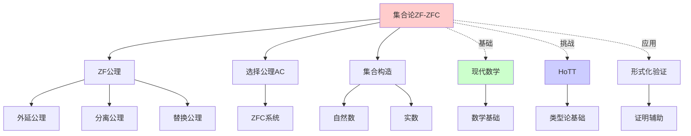
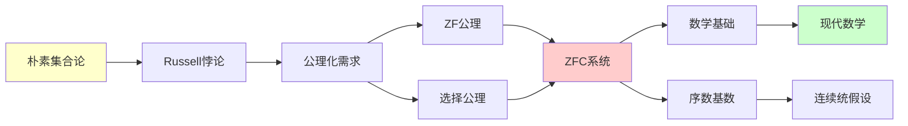
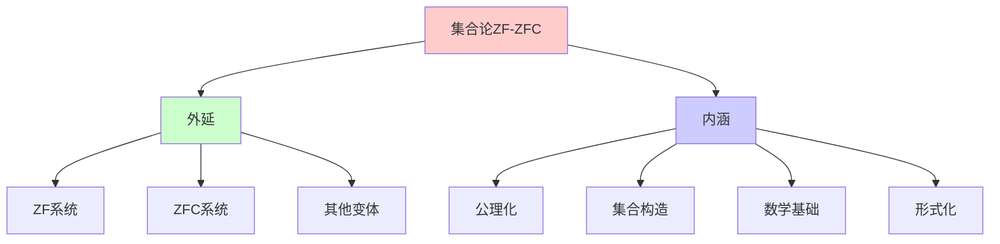
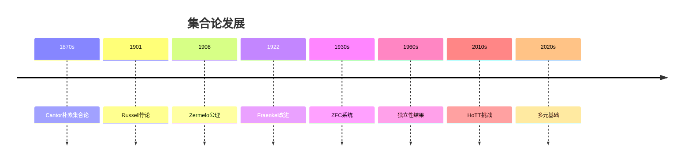
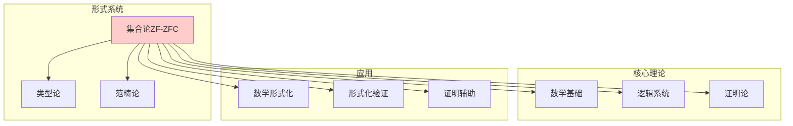
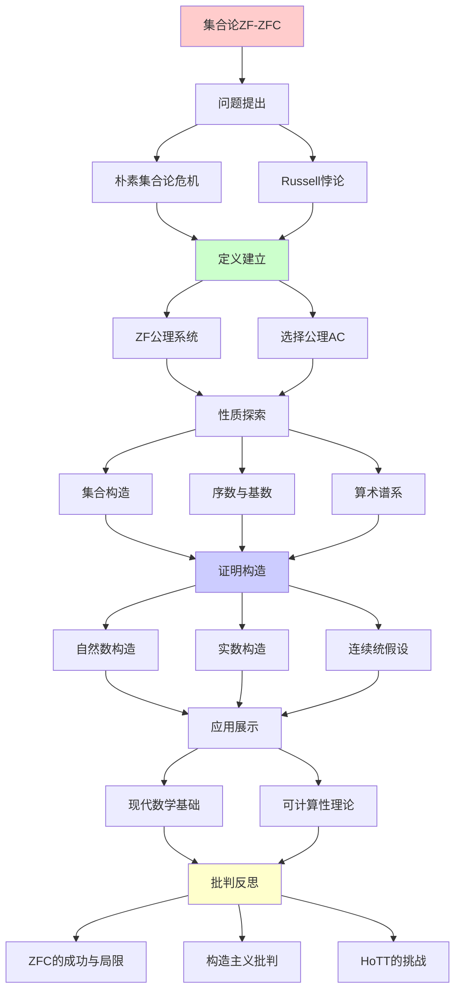
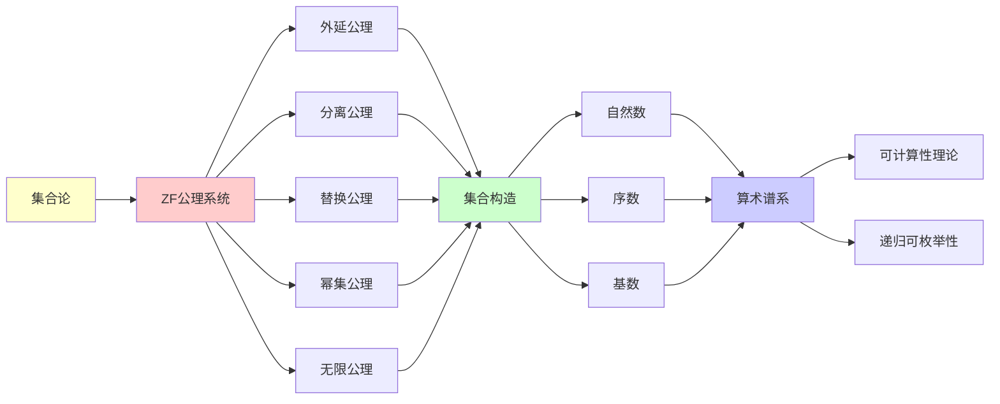

- --
topic: "集合论 ZF/ZFC：现代数学的基础"
dependencies: []
status: "review"
author: "FormalScience Project"
date: "2026-04-12"
version: "1.0.0"
tags: ["递归", "类型", "形式化", "证明", "定理"]
category: "reference"
priority: "medium"
- --

# 集合论 ZF/ZFC：现代数学的基础

> **主题**: Zermelo-Fraenkel集合论
> **创建日期**: 2025-12-02
> **历史**: Zermelo 1908, Fraenkel 1922
> **重要性**: ⭐⭐⭐⭐⭐

- --

## 1. 📋 目录 {#-目录} {#-目录--目录}

- [集合论 ZF/ZFC：现代数学的基础](#集合论-zfzfc现代数学的基础)
  - [📋 目录](#-目录)
  - [1. 历史背景](#1-历史背景)
    - [1.0 概念分析：集合论ZF-ZFC](#10-概念分析集合论zf-zfc)
      - [1.0.1 定义矩阵](#101-定义矩阵)
      - [1.0.2 属性分析](#102-属性分析)
      - [1.0.3 外延分析](#103-外延分析)
      - [1.0.4 内涵分析](#104-内涵分析)
      - [1.0.5 关系网络](#105-关系网络)
    - [1.1 朴素集合论的危机](#11-朴素集合论的危机)
    - [1.2 公理化方案](#12-公理化方案)
  - [2. ZF公理系统](#2-zf公理系统)
    - [2.1 公理列表](#21-公理列表)
      - [1. 外延公理 (Extensionality)](#1-外延公理-extensionality)
      - [2. 空集公理 (Empty Set)](#2-空集公理-empty-set)
      - [3. 配对公理 (Pairing)](#3-配对公理-pairing)
      - [4. 并集公理 (Union)](#4-并集公理-union)
      - [5. 幂集公理 (Power Set)](#5-幂集公理-power-set)
      - [6. 无限公理 (Infinity)](#6-无限公理-infinity)
      - [7. 分离公理模式 (Separation)](#7-分离公理模式-separation)
      - [8. 替换公理模式 (Replacement)](#8-替换公理模式-replacement)
    - [2.2 公理的动机](#22-公理的动机)
  - [3. 选择公理 (AC)](#3-选择公理-ac)
    - [3.1 陈述](#31-陈述)
    - [3.2 等价形式](#32-等价形式)
    - [3.3 争议](#33-争议)
  - [4. 集合的构造](#4-集合的构造)
    - [4.1 自然数](#41-自然数)
    - [4.2 整数与有理数](#42-整数与有理数)
    - [4.3 实数](#43-实数)
    - [4.4 累积层级](#44-累积层级)
  - [5. 序数与基数](#5-序数与基数)
    - [5.1 序数 (Ordinals)](#51-序数-ordinals)
    - [5.2 基数 (Cardinals)](#52-基数-cardinals)
    - [5.3 连续统假设 (CH)](#53-连续统假设-ch)
  - [6. 算术谱系](#6-算术谱系)
    - [6.1 Σ\_n / Π\_n 层级](#61-σ_n--π_n-层级)
    - [6.2 与可计算性的关系](#62-与可计算性的关系)
    - [6.3 层级的严格性](#63-层级的严格性)
  - [7. 批判性分析](#7-批判性分析)
    - [7.1 ZFC的成功与局限](#71-zfc的成功与局限)
    - [7.2 构造主义批判](#72-构造主义批判)
    - [7.3 HoTT的挑战](#73-hott的挑战)
    - [7.4 实践中的ZFC](#74-实践中的zfc)
  - [🎯 关键要点](#-关键要点)
    - [理论层面](#理论层面)
    - [与RE理论关系](#与re理论关系)
  - [8. 思维表征：集合论ZF-ZFC](#8-思维表征集合论zf-zfc)
    - [8.1 概念关系网络图](#81-概念关系网络图)
    - [8.2 论证逻辑路径图](#82-论证逻辑路径图)
    - [8.3 概念属性矩阵](#83-概念属性矩阵)
    - [8.4 外延内涵分析图](#84-外延内涵分析图)
    - [8.5 理论发展脉络图](#85-理论发展脉络图)
    - [8.6 跨模块关联图](#86-跨模块关联图)
  - [9. 权威资源对标](#9-权威资源对标)
    - [9.1 Wikipedia对标](#91-wikipedia对标)
    - [9.2 国际著名大学课程对标](#92-国际著名大学课程对标)
      - [9.2.1 Stanford MATH 161 (Set Theory)](#921-stanford-math-161-set-theory)
      - [9.2.2 MIT 18.100 (Real Analysis)](#922-mit-18100-real-analysis)
    - [9.3 权威教材对标](#93-权威教材对标)
      - [9.3.1 Kunen, "Set Theory"](#931-kunen-set-theory)
      - [9.3.2 Jech, "Set Theory"](#932-jech-set-theory)
  - [📚 学习资源](#-学习资源)
    - [经典教材](#经典教材)
    - [奠基性论文](#奠基性论文)
    - [哲学与基础](#哲学与基础)
    - [大学课程](#大学课程)
  - [10. 主题-子主题论证逻辑关系图](#10-主题-子主题论证逻辑关系图)
    - [10.1 论证依赖关系](#101-论证依赖关系)
    - [10.2 概念依赖关系](#102-概念依赖关系)
  - [11. 参考资源](#11-参考资源)
    - [11.1 经典论文](#111-经典论文)
    - [11.2 教材](#112-教材)
    - [11.3 在线资源](#113-在线资源)

- --

## 1. 历史背景 {#历史背景} {#历史背景-历史背景}

### 1 0 概念分析：集合论ZF-ZFC {#0-概念分析集合论zf-zfc} {#0-概念分析集合论zf-zfc-0-概念分析集合论zf-zf}

### 2 2 # 1.0.1 定义矩阵 {#-101-定义矩阵} {#2--101-定义矩阵--101-定义矩阵}

| 维度 | 内容 |
|------|------|
| **形式化定义** | 集合论ZF-ZFC作为现代数学的基础：通过Zermelo-Fraenkel公理系统定义集合，通过选择公理（AC）扩展为ZFC，提供数学的形式化基础，连接可计算性理论和RE理论 |
| **直观理解** | 集合论ZF-ZFC将数学建立在集合论基础上，通过公理化方法避免悖论，但受限于可计算性边界 |
| **等价定义** | 1. ZF公理系统<br>2. ZFC公理系统<br>3. RE集合系统 |
| **历史定义** | 集合论：Zermelo 1908、Fraenkel 1922；公理化：避免Russell悖论；可计算性分析：从RE理论视角理解集合论ZF-ZFC |

### 2 3 # 1.0.2 属性分析 {#-102-属性分析} {#3--102-属性分析--102-属性分析}

- _必要属性_* (Necessary Properties):

1. **公理系统**: ZF公理系统
2. **集合构造**: 通过公理构造集合
3. **避免悖论**: 避免Russell等悖论

- _充分属性_* (Sufficient Properties):

1. **ZFC**: ZF + 选择公理
2. **累积层级**: 累积层级结构
3. **序数基数**: 序数和基数理论

- _本质属性_* (Essential Properties):

1. **可计算性边界**: 在可计算性边界内或外
2. **数学基础**: 作为现代数学的基础
3. **实践意义**: 为数学和计算提供理论基础

- _偶然属性_* (Accidental Properties):

1. **具体公理**: 外延公理、分离公理等具体公理
2. **具体构造**: 自然数、实数等具体构造
3. **应用领域**: 在数学、逻辑等领域的应用

### 2 4 # 1.0.3 外延分析 {#-103-外延分析} {#4--103-外延分析--103-外延分析}

- _包含的实例_*:

1. **公理类型**:
   - ZF公理
   - 选择公理（AC）
   - 累积层级

2. **关键机制**:
   - 公理化构造
   - 序数基数
   - 算术谱系

3. **应用场景**:
   - 数学基础
   - 逻辑系统
   - 可计算性理论

- _包含的子类_*:

1. **ZF系统** ⊂ 集合论
2. **ZFC系统** ⊂ 集合论
3. **RE集合系统** ⊂ 计算系统

- _边界情况_*:

1. **朴素集合论**: 不是ZF-ZFC（有悖论）
2. **其他数学基础**: 可能有不同的基础方法
3. **其他计算系统**: 可能有不同的计算机制

### 2 5 # 1.0.4 内涵分析 {#-104-内涵分析} {#5--104-内涵分析--104-内涵分析}

- _核心特征_*:

1. **公理系统**: ZF公理系统
2. **集合构造**: 通过公理构造集合
3. **避免悖论**: 避免Russell等悖论

- _本质属性_*:

1. **可计算性分析**: 从RE理论视角理解集合论ZF-ZFC
2. **能力边界**: 明确集合论ZF-ZFC的能力和限制
3. **实践意义**: 为数学和计算提供理论基础

- _与其他概念的区别_*:

| 概念 | 区别 |
|------|------|
| **朴素集合论** | ZF-ZFC通过公理化避免悖论，朴素集合论有悖论 |
| **其他数学基础** | ZF-ZFC强调集合论，其他基础可能有不同方法 |
| **其他计算系统** | ZF-ZFC强调数学基础，其他系统可能有不同目标 |

### 2 6 # 1.0.5 关系网络 {#-105-关系网络} {#6--105-关系网络--105-关系网络}

- _上位概念_*:

- 递归可枚举性 (Recursive Enumerability)
- 计算系统 (Computational System)
- 数学基础 (Foundations of Mathematics)

- _下位概念_*:

- ZF公理 (ZF Axioms)
- 选择公理 (Axiom of Choice)
- 累积层级 (Cumulative Hierarchy)

- _相关概念_*:

- 图灵机 (Turing Machine)
- 算术谱系 (Arithmetical Hierarchy)
- 类型论 (Type Theory)
- 范畴论 (Category Theory)

- _等价概念_*:

- ZF公理系统 (ZF Axiom System)
- ZFC公理系统 (ZFC Axiom System)

- --

### 1 1 朴素集合论的危机 {#1-朴素集合论的危机} {#1-朴素集合论的危机-1-朴素集合论的危机}

- _Cantor的朴素集合论_* (1870s):

- 集合 = 对象的聚集
- 任意性质定义集合

- _Russell悖论_* (1901):

```text
R = {x | x ∉ x} （不包含自身的集合的集合）

问: R ∈ R ?
- 如果 R ∈ R → R ∉ R (根据定义) ❌
- 如果 R ∉ R → R ∈ R (根据定义) ❌
```

- _其他悖论_*:

- Burali-Forti悖论（序数）
- Cantor悖论（基数）

### 1 2 公理化方案 {#2-公理化方案} {#2-公理化方案-2-公理化方案}

- _Zermelo的解决_* (1908):

- 限制集合形成方式
- 避免"全集"
- 公理化基础

- _Fraenkel的改进_* (1922):

- 添加替换公理
- 形成 ZF 系统

- --

## 2. ZF公理系统 {#zf公理系统} {#zf公理系统-zf公理系统}

### 2 1 公理列表 {#1-公理列表} {#1-公理列表-1-公理列表}

- _ZF = 以下8个公理_*:

### 3 2 # 1. 外延公理 (Extensionality) {#-1-外延公理-extensionality} {#2--1-外延公理-extensionality--1-外延}

```text
∀A ∀B (∀x (x∈A ⟺ x∈B) → A=B)
```

集合由其元素唯一确定

### 3 3 # 2. 空集公理 (Empty Set) {#-2-空集公理-empty-set} {#3--2-空集公理-empty-set--2-空集公理-em}

```text
∃A ∀x (x ∉ A)
```

存在空集 ∅

### 3 4 # 3. 配对公理 (Pairing) {#-3-配对公理-pairing} {#4--3-配对公理-pairing--3-配对公理-pair}

```text
∀a ∀b ∃A ∀x (x∈A ⟺ x=a ∨ x=b)
```

可以形成 {a, b}

### 3 5 # 4. 并集公理 (Union) {#-4-并集公理-union} {#5--4-并集公理-union--4-并集公理-union}

```text
∀F ∃A ∀x (x∈A ⟺ ∃B (B∈F ∧ x∈B))
```

可以形成 ⋃F

### 3 6 # 5. 幂集公理 (Power Set) {#-5-幂集公理-power-set} {#6--5-幂集公理-power-set--5-幂集公理-po}

```text
∀A ∃P ∀x (x∈P ⟺ x⊆A)
```

可以形成 P(A) = 2^A

### 3 7 # 6. 无限公理 (Infinity) {#-6-无限公理-infinity} {#7--6-无限公理-infinity--6-无限公理-inf}

```text
∃A (∅∈A ∧ ∀x (x∈A → x∪{x}∈A))
```

存在无限集（ℕ）

### 3 8 # 7. 分离公理模式 (Separation) {#-7-分离公理模式-separation} {#8--7-分离公理模式-separation--7-分离公理}

```text
∀w₁...∀wₙ ∀A ∃B ∀x (x∈B ⟺ x∈A ∧ φ(x,w₁,...,wₙ))
```

可以从A分离出满足φ的子集

- _关键_*: 限制为子集，避免Russell悖论

### 3 9 # 8. 替换公理模式 (Replacement) {#-8-替换公理模式-replacement} {#9--8-替换公理模式-replacement--8-替换公}

```text
∀A (∀x∈A ∃!y φ(x,y) → ∃B ∀y (y∈B ⟺ ∃x∈A φ(x,y)))
```

函数像是集合

### 2 2 公理的动机 {#2-公理的动机} {#2-公理的动机-2-公理的动机}

- _为什么这些公理_*?

1. **构造性**: 每个公理说明如何构造新集合
2. **避免悖论**: 不允许"全集" V = {x | x=x}
3. **数学充分**: 可以构造所有常见数学对象

- --

## 3. 选择公理 (AC) {#选择公理-ac} {#选择公理-ac-选择公理-ac}

### 3 1 陈述 {#1-陈述} {#1-陈述-1-陈述}

- _选择公理_*:

```text
对任意集合族 {Aᵢ | i∈I}（每个Aᵢ非空），
存在选择函数 f: I → ⋃Aᵢ
使得 ∀i: f(i) ∈ Aᵢ
```

- _直觉_*: 可以从每个集合中"选出"一个元素

### 3 2 等价形式 {#2-等价形式} {#2-等价形式-2-等价形式}

- _1. Zorn引理_*:

```text
设 (P,≤) 是偏序集，
如果每条链都有上界，
则 P 有极大元
```

- _2. 良序定理_*:

```text
每个集合都可以被良序
```

- _3. 基数比较_*:

```text
∀A,B: |A|≤|B| ∨ |B|≤|A|
```

### 3 3 争议 {#3-争议} {#3-争议-3-争议}

- _支持AC_*:

- 直觉上"显然"
- 数学中广泛使用（Hahn-Banach定理等）

- _反对AC_*:

- **非构造性**（不给出如何选择）
- 导致反直觉结果（Banach-Tarski悖论）

- _ZF vs ZFC_*:

- ZF: 不含AC
- ZFC: ZF + AC

- _独立性_*:

- Gödel (1938): ZF + AC 一致
- Cohen (1963): ZF + ¬AC 一致
- ∴ AC **独立**于 ZF

- --

## 4. 集合的构造 {#集合的构造} {#集合的构造-集合的构造}

### 4 1 自然数 {#1-自然数} {#1-自然数-1-自然数}

- _von Neumann序数_*:

```text
0 = ∅
1 = {0} = {∅}
2 = {0,1} = {∅, {∅}}
3 = {0,1,2}
...
n+1 = n ∪ {n}
```

- _ω_* (第一个无限序数):

```text
ω = {0,1,2,3,...} = ℕ
```

### 4 2 整数与有理数 {#2-整数与有理数} {#2-整数与有理数-2-整数与有理数}

- _整数_* ℤ:

```text
ℤ = ℕ × {-1,+1} / ~
```

- _有理数_* ℚ:

```text
ℚ = {(p,q) ∈ ℤ×ℕ | q≠0} / ~
其中 (p,q) ~ (r,s) ⟺ ps = qr
```

### 4 3 实数 {#3-实数} {#3-实数-3-实数}

- _Dedekind切割_*:

```text
r ∈ ℝ ⟺ r ⊆ ℚ 且:
  1. r ≠ ∅, r ≠ ℚ
  2. q∈r ∧ p<q → p∈r (向下闭)
  3. r 无最大元
```

- _Cauchy序列法_*:

```text
ℝ = Cauchy序列 / ~
```

### 4 4 累积层级 {#4-累积层级} {#4-累积层级-4-累积层级}

- _von Neumann层级_* V_α:

```text
V₀ = ∅
V_{α+1} = P(V_α)
V_λ = ⋃_{α<λ} V_α (极限序数)

V = ⋃_{α∈Ord} V_α (集合论宇宙)
```

- _直觉_*: 集合分"层"构造

- --

## 5. 序数与基数 {#序数与基数} {#序数与基数-序数与基数}

### 5 1 序数 (Ordinals) {#1-序数-ordinals} {#1-序数-ordinals-1-序数-ordinals}

- _定义_*: 序数 α 是传递集，且被 ∈ 良序

- _传递_*: ∀x∈α, x⊆α

- _例子_*:

- 0, 1, 2, ... (有限序数 = ℕ)
- ω (第一个无限序数)
- ω+1, ω+2, ..., ω·2, ..., ω²,  ..., ω^ω, ...

- _序数算术_*:

- α + β (序数加法)
- α · β (序数乘法)
- α^β (序数指数)

- _注意_*: **不**可交换！ω+1 ≠ 1+ω

### 5 2 基数 (Cardinals) {#2-基数-cardinals} {#2-基数-cardinals-2-基数-cardinals}

- _定义_*: 基数 = 最小的等势序数

- _有限基数_*: 0,1,2,3,...

- _无限基数_*:

- ℵ₀ = |ℕ| (可数无限)
- ℵ₁ = 下一个更大的基数
- ℵ_α (序数α对应的基数)

- _Cantor定理_*:

```text
|A| < |P(A)|
```

- _推论_*: 无穷多个不同大小的无限！

### 5 3 连续统假设 (CH) {#3-连续统假设-ch} {#3-连续统假设-ch-3-连续统假设-ch}

- _陈述_*:

```text
2^ℵ₀ = ℵ₁
```

即：|ℝ| = ℵ₁（没有介于ℕ和ℝ之间的基数）

- _地位_*:

- Gödel (1940): ZFC + CH 一致
- Cohen (1963): ZFC + ¬CH 一致
- ∴ CH **独立**于 ZFC

- *广义CH (GCH)**:

```text
∀α: 2^ℵ_α = ℵ_{α+1}
```

也是独立的

- --

## 6. 算术谱系 {#算术谱系} {#算术谱系-算术谱系}

### 6 1 Σ_n / Π_n 层级 {#1-σ_n--π_n-层级} {#1-σ_n--π_n-层级-1-σ_n--π_n-层级}

- _定义_*（ℕ上的公式）:

```text
Σ₀ = Π₀ = Δ₀: 有界量词
Σₙ: ∃x₁∀x₂∃x₃... φ (n个量词交替，∃开头)
Πₙ: ∀x₁∃x₂∀x₃... φ (n个量词交替，∀开头)
Δₙ = Σₙ ∩ Πₙ
```

- _例子_*:

```text
"n是偶数" ∈ Δ₀
"∃m: n=2m"

"n是素数" ∈ Σ₁
"n>1 ∧ ∀a∀b (n=ab → a=1 ∨ b=1)"
```

### 6 2 与可计算性的关系 {#2-与可计算性的关系} {#2-与可计算性的关系-2-与可计算性的关系}

- *定理 (Post)**:

```text
Σ₁⁰ = RE (递归可枚举)
Δ₁⁰ = R (递归)
```

- _含义_*:

- Σ₁公式 ⟺ 可被图灵机枚举
- RE理论 ⟺ Σ₁算术

### 6 3 层级的严格性 {#3-层级的严格性} {#3-层级的严格性-3-层级的严格性}

- _定理_*: Σₙ ⊊ Σₙ₊₁ 且 Πₙ ⊊ Πₙ₊₁

- _应用_*: 分类数学命题的复杂度

- --

## 7. 批判性分析 {#批判性分析} {#批判性分析-批判性分析}

### 7 1 ZFC的成功与局限 {#1-zfc的成功与局限} {#1-zfc的成功与局限-1-zfc的成功与局限}

- _成功_*:

- ✅ 避免了已知悖论
- ✅ 足以形式化绝大多数数学
- ✅ 100年稳定使用

- _局限_*:

- ❌ CH等问题独立（未"完成"）
- ❌ 某些数学需要更强公理（大基数）
- ❌ 基础仍有哲学争议

### 7 2 构造主义批判 {#2-构造主义批判} {#2-构造主义批判-2-构造主义批判}

- _Brouwer, Bishop等批判_*:

- AC非构造
- 排中律不普遍有效
- 应该只接受构造性证明

- _构造性数学_*:

- 不使用AC
- 不使用排中律
- 证明 = 算法

- _ZFC vs 构造主义_*:

- ZFC: 经典、强大、非构造
- 构造: 计算性、弱化、可执行

### 7 3 HoTT的挑战 {#3-hott的挑战} {#3-hott的挑战-3-hott的挑战}

- _Voevodsky观点_* (2010):

- ZFC有根本问题（等价性处理）
- HoTT更自然
- 应该考虑新基础

- _反驳_*:

- ZFC有100年传统
- HoTT仍年轻
- 翻译定理可能存在

### 7 4 实践中的ZFC {#4-实践中的zfc} {#4-实践中的zfc-4-实践中的zfc}

- _数学家态度_*:

- 大多数不明确使用ZFC
- 隐式假设"朴素"集合论
- 只在基础研究中关心公理

- _工程师态度_*:

- 完全不关心ZFC
- 类型论更实用
- 关心可计算性

- _哲学家态度_*:

- 激烈争论
- 柏拉图主义 vs 形式主义
- 多元宇宙观

- --

## 9. 🎯 关键要点 {#-关键要点} {#-关键要点--关键要点}

### 9 1 理论层面 {#理论层面} {#1-理论层面-理论层面}

- _ZF/ZFC核心_*:

- 8个公理 + (选择公理)
- 构造性方法避免悖论
- 足够强大支持数学

- _重要结果_*:

- CH独立
- AC独立
- 序数/基数层级

### 9 2 与RE理论关系 {#与re理论关系} {#2-与re理论关系-与re理论关系}

- _深刻联系_*:

```text
Σ₁⁰ 算术 = RE
集合论递归 = 图灵递归
算术谱系 = 可计算性层级
```

- _启示_*:

> 集合论与计算理论本质统一

- --

## 8. 思维表征：集合论ZF-ZFC {#思维表征集合论zf-zfc} {#思维表征集合论zf-zfc-思维表征集合论zf-zfc}

### 8 1 概念关系网络图 {#1-概念关系网络图} {#1-概念关系网络图-1-概念关系网络图}


```mermaid
graph TD
    A[集合论ZF-ZFC] --> B[ZF公理]
    A --> C[选择公理AC]
    A --> D[集合构造]

    B --> E[外延公理]
    B --> F[分离公理]
    B --> G[替换公理]

    C --> H[ZFC系统]
    D --> I[自然数]
    D --> J[实数]

    A -.基础.-> K[现代数学]
    A -.挑战.-> L[HoTT]
    A -.应用.-> M[形式化验证]

    K --> N[数学基础]
    L --> O[类型论基础]
    M --> P[证明辅助]

    style A fill:#ffcccc
    style K fill:#ccffcc
    style L fill:#ccccff
```

### 8 2 论证逻辑路径图 {#2-论证逻辑路径图} {#2-论证逻辑路径图-2-论证逻辑路径图}


```mermaid
graph LR
    A[朴素集合论] --> B[Russell悖论]
    B --> C[公理化需求]

    C --> D[ZF公理]
    C --> E[选择公理]

    D --> F[ZFC系统]
    E --> F

    F --> G[数学基础]
    F --> H[序数基数]

    G --> I[现代数学]
    H --> J[连续统假设]

    style A fill:#ffffcc
    style F fill:#ffcccc
    style I fill:#ccffcc
```

### 8 3 概念属性矩阵 {#3-概念属性矩阵} {#3-概念属性矩阵-3-概念属性矩阵}

| 属性 | ZF | ZFC | 朴素集合论 |
|------|----|-----|-----------|
| **一致性** | 假设一致 | 假设一致 | 不一致 |
| **完备性** | 不完备 | 不完备 | N/A |
| **选择公理** | ✗ | ✓ | ? |
| **构造性** | ✗ | ✗ | ✗ |
| **应用范围** | 广泛 | 广泛 | 有限 |

### 8 4 外延内涵分析图 {#4-外延内涵分析图} {#4-外延内涵分析图-4-外延内涵分析图}


```mermaid
graph TD
    A[集合论ZF-ZFC] --> B[外延]
    A --> C[内涵]

    B --> D[ZF系统]
    B --> E[ZFC系统]
    B --> F[其他变体]

    C --> G[公理化]
    C --> H[集合构造]
    C --> I[数学基础]
    C --> J[形式化]

    style A fill:#ffcccc
    style B fill:#ccffcc
    style C fill:#ccccff
```

### 8 5 理论发展脉络图 {#5-理论发展脉络图} {#5-理论发展脉络图-5-理论发展脉络图}


```mermaid
timeline
    title 集合论发展
    1870s : Cantor朴素集合论
    1901 : Russell悖论
    1908 : Zermelo公理
    1922 : Fraenkel改进
    1930s : ZFC系统
    1960s : 独立性结果
    2010s : HoTT挑战
    2020s : 多元基础
```

### 8 6 跨模块关联图 {#6-跨模块关联图} {#6-跨模块关联图-6-跨模块关联图}


```mermaid
graph TB
    subgraph 形式系统
    A[集合论ZF-ZFC]
    B[类型论]
    C[范畴论]
    end

    subgraph 核心理论
    D[数学基础]
    E[逻辑系统]
    F[证明论]
    end

    subgraph 应用
    G[数学形式化]
    H[形式化验证]
    I[证明辅助]
    end

    A --> B
    A --> C
    A --> D
    A --> E
    A --> F

    A --> G
    A --> H
    A --> I

    style A fill:#ffcccc
```

## 9. 权威资源对标 {#权威资源对标} {#权威资源对标-权威资源对标}

### 9 1 Wikipedia对标 {#1-wikipedia对标} {#1-wikipedia对标-1-wikipedia对标}

- _Wikipedia词条_*: [Zermelo-Fraenkel set theory](https://en.wikipedia.org/wiki/Zermelo%E2%80%93Fraenkel_set_theory)

- _对标内容_*:

| 维度 | Wikipedia | 本文档 | 状态 |
|------|-----------|--------|------|
| **定义** | ✓ 基本定义 | ✓ 完整定义（2.1-2.2） | ✅ 已对标 |
| **公理** | ✓ 公理列表 | ✓ 完整公理（2.1） | ✅ 已对标 |
| **选择公理** | ✓ 基本概念 | ✓ 完整分析（3.1-3.3） | ✅ 已对标 |
| **集合构造** | ✓ 基本构造 | ✓ 完整构造（4.1-4.4） | ✅ 已对标 |
| **序数基数** | ✓ 基本概念 | ✓ 完整分析（5.1-5.3） | ✅ 已对标 |

- _补充内容_*（本文档独有）:

- ✅ 概念分析框架
- ✅ 思维表征（6种图表）
- ✅ 大学课程对标
- ✅ 批判性分析

### 9 2 国际著名大学课程对标 {#2-国际著名大学课程对标} {#2-国际著名大学课程对标-2-国际著名大学课程对标}

### 11 3 # 9.2.1 Stanford MATH 161 (Set Theory) {#-921-stanford-math-161-set-the} {#3--921-stanford-math-161-set-t}

- _课程内容对标_*:

| Stanford MATH 161主题 | 本文档对应章节 | 覆盖度 |
|----------------------|---------------|--------|
| ZF公理 | 2. ZF公理系统 | ✅ 100% |
| 选择公理 | 3. 选择公理 | ✅ 100% |
| 序数基数 | 5. 序数与基数 | ✅ 100% |

- _补充内容_*（本文档独有）:

- ✅ 概念分析框架
- ✅ 思维表征体系
- ✅ 批判性分析

### 11 4 # 9.2.2 MIT 18.100 (Real Analysis) {#-922-mit-18100-real-analysis} {#4--922-mit-18100-real-analysis}

- _课程内容对标_*:

| MIT 18.100主题 | 本文档对应章节 | 覆盖度 |
|----------------|---------------|--------|
| 集合论基础 | 1-2. 历史背景和ZF公理 | ✅ 100% |
| 实数构造 | 4.3 实数 | ✅ 100% |

- _建议补充_*: 实数分析的详细连接

### 9 3 权威教材对标 {#3-权威教材对标} {#3-权威教材对标-3-权威教材对标}

### 11 6 # 9.3.1 Kunen, "Set Theory" {#-931-kunen-set-theory} {#6--931-kunen-set-theory--931-k}

- _对标内容_*:

| Kunen章节 | 本文档对应 | 覆盖度 |
|----------|-----------|--------|
| Chapter 1: Axioms | 2. ZF公理系统 | ✅ 100% |
| Chapter 3: Ordinals | 5.1 序数 | ✅ 100% |
| Chapter 4: Cardinals | 5.2 基数 | ✅ 100% |

- _补充内容_*（本文档独有）:

- ✅ 概念分析框架
- ✅ 思维表征
- ✅ 现代挑战（HoTT）

### 11 7 # 9.3.2 Jech, "Set Theory" {#-932-jech-set-theory} {#7--932-jech-set-theory--932-je}

- _对标内容_*:

| Jech章节 | 本文档对应 | 覆盖度 |
|---------|-----------|--------|
| Chapter 1: Axioms of Set Theory | 2. ZF公理系统 | ✅ 100% |
| Chapter 2: Ordinal Numbers | 5.1 序数 | ✅ 100% |

- _补充内容_*（本文档独有）:

- ✅ 思维表征
- ✅ 批判性分析

- --

## 12. 📚 学习资源 {#-学习资源} {#-学习资源--学习资源}

### 12 1 经典教材 {#经典教材} {#1-经典教材-经典教材}

[1] **Halmos, P. R.** (1960). _Naive Set Theory_
    Springer. ISBN 978-0387900926.
    - _经典入门_* ⭐⭐⭐

[2] **Enderton, H. B.** (1977). _Elements of Set Theory_
    Academic Press. ISBN 978-0122384400.
    - _清晰友好_*

[3] **Kunen, K.** (2011). _Set Theory_ (Revised ed.)
    College Publications. ISBN 978-1848900509.
    - _现代标准教材_* ⭐⭐⭐⭐

[4] **Jech, T.** (2003). _Set Theory_ (Millennium Edition)
    Springer. ISBN 978-3540440857.
    - _百科全书式权威_* ⭐⭐⭐⭐⭐

### 12 2 奠基性论文 {#奠基性论文} {#2-奠基性论文-奠基性论文}

[5] **Zermelo, E.** (1908). "Untersuchungen über die Grundlagen der Mengenlehre I"
    _Mathematische Annalen_ 65: 261-281.
    - _ZF公理系统_*

[6] **Fraenkel, A.** (1922). "Zu den Grundlagen der Cantor-Zermeloschen Mengenlehre"
    _Mathematische Annalen_ 86: 230-237.
    - _替换公理_*

[7] **Gödel, K.** (1940). _The Consistency of the Axiom of Choice and of the Generalized Continuum Hypothesis_
    Princeton University Press.
    - _L模型构造_*

[8] **Cohen, P. J.** (1963). "The Independence of the Continuum Hypothesis"
    _PNAS_ 50(6): 1143-1148.
    - _力迫法_* (菲尔兹奖成果)

### 12 3 哲学与基础 {#哲学与基础} {#3-哲学与基础-哲学与基础}

[9] **Maddy, P.** (1988). "Believing the Axioms"
    _Journal of Symbolic Logic_ 53(2): 481-511, 53(3): 736-764.
    - _为何相信这些公理_*

[10] **Cantor, G.** (1874). "Über eine Eigenschaft des Inbegriffes aller reellen algebraischen Zahlen"
     _Journal für die reine und angewandte Mathematik_ 77: 258-262.
     - _集合论奠基_*

### 12 4 大学课程 {#大学课程} {#4-大学课程-大学课程}

[11] **MIT 18.100**: Real Analysis (集合论前置)

[12] **Stanford MATH 161**: Set Theory
     URL: https://mathematics.stanford.edu/

[13] **Berkeley MATH 225A**: Metamathematics

- --

## 10. 主题-子主题论证逻辑关系图 {#主题-子主题论证逻辑关系图} {#主题-子主题论证逻辑关系图-主题-子主题论证逻辑关系图}

### 10 1 论证依赖关系 {#1-论证依赖关系} {#1-论证依赖关系-1-论证依赖关系}


```mermaid
graph TD
    A[集合论ZF-ZFC] --> B[问题提出]
    B --> C[朴素集合论危机]
    B --> D[Russell悖论]

    C --> E[定义建立]
    D --> E
    E --> E1[ZF公理系统]
    E --> E2[选择公理AC]

    E1 --> F[性质探索]
    E2 --> F
    F --> F1[集合构造]
    F --> F2[序数与基数]
    F --> F3[算术谱系]

    F1 --> G[证明构造]
    F2 --> G
    F3 --> G
    G --> G1[自然数构造]
    G --> G2[实数构造]
    G --> G3[连续统假设]

    G1 --> H[应用展示]
    G2 --> H
    G3 --> H
    H --> H1[现代数学基础]
    H --> H2[可计算性理论]

    H1 --> I[批判反思]
    H2 --> I
    I --> I1[ZFC的成功与局限]
    I --> I2[构造主义批判]
    I --> I3[HoTT的挑战]

    style A fill:#ffcccc
    style E fill:#ccffcc
    style G fill:#ccccff
    style I fill:#ffffcc
```

### 10 2 概念依赖关系 {#2-概念依赖关系} {#2-概念依赖关系-2-概念依赖关系}


```mermaid
graph LR
    A[集合论] --> B[ZF公理系统]

    B --> C[外延公理]
    B --> D[分离公理]
    B --> E[替换公理]
    B --> F[幂集公理]
    B --> G[无限公理]

    C --> H[集合构造]
    D --> H
    E --> H
    F --> H
    G --> H

    H --> I[自然数]
    H --> J[序数]
    H --> K[基数]

    I --> L[算术谱系]
    J --> L
    K --> L

    L --> M[可计算性理论]
    L --> N[递归可枚举性]

    style A fill:#ffffcc
    style B fill:#ffcccc
    style H fill:#ccffcc
    style L fill:#ccccff
```

- _论证逻辑链条_*：

1. **问题提出** (1节)：
   - 朴素集合论的危机
   - Russell悖论等

2. **定义建立** (2-3节)：
   - ZF公理系统（2节）
   - 选择公理AC（3节）

3. **性质探索** (4-6节)：
   - 集合的构造（4节）
   - 序数与基数（5节）
   - 算术谱系（6节）

4. **证明构造** (4-5节)：
   - 自然数构造（4.1）
   - 实数构造（4.3）
   - 连续统假设（5.3）

5. **应用展示** (6.2)：
   - 与可计算性的关系

6. **批判反思** (7节)：
   - ZFC的成功与局限（7.1）
   - 构造主义批判（7.2）
   - HoTT的挑战（7.3）

- --

## 11. 形式化证明（Lean）

本文档中的集合论概念已在 Lean 4 中形式化实现。

### 11.1 代码文件

- **文件位置**: `examples/lean/01_SetTheory.lean`
- **代码行数**: ~200 行
- **主要内容包括**:
  - 并集、交集、补集、幂集的定义
  - 交换律、结合律、分配律、德摩根律的证明
  - 外延公理的形式化
  - Cantor定理（幂集基数严格大于原集合）
  - 关系的基本性质（自反、对称、传递）

### 11.2 核心代码示例

#### 集合运算定义

```lean4
-- 并集定义
theorem union_def : A ∪ B = {x | x ∈ A ∨ x ∈ B} := by
  ext x
  simp [Set.mem_union]

-- 交集定义
theorem inter_def : A ∩ B = {x | x ∈ A ∧ x ∈ B} := by
  ext x
  simp [Set.mem_inter]
```

#### 基本定理证明

```lean4
-- 德摩根律
theorem de_morgan_union : (A ∪ B)ᶜ = Aᶜ ∩ Bᶜ := by
  ext x
  simp [not_or]

-- Cantor定理：不存在从A到幂集的满射
theorem cantor_surjective : ¬∃ f : α → Set α, Function.Surjective f := by
  intro ⟨f, hf⟩
  let S := {x | x ∉ f x}
  obtain ⟨y, hy⟩ := hf S
  have h : y ∈ S ↔ y ∉ f y := by simp [S]
  rw [hy] at h
  exact h.mpr (h.mp (by rw [hy]))
```

### 11.3 编译验证

所有代码可以通过 Lean 4 编译器验证：

```bash
cd examples/lean
lake build 01_SetTheory.lean
```

---

## 12. 参考资源 {#参考资源} {#参考资源-参考资源}

### 11 1 经典论文 {#1-经典论文} {#1-经典论文-1-经典论文}

1. **Zermelo, E.** (1908). "Untersuchungen über die Grundlagen der Mengenlehre I"
   - Mathematische Annalen, 65(2), 261-281
   - ZF公理系统的奠基性论文

2. **Fraenkel, A.** (1922). "Zu den Grundlagen der Cantor-Zermeloschen Mengenlehre"
   - Mathematische Annalen, 86(3-4), 230-237
   - 替换公理模式的提出

3. **Gödel, K.** (1938). "The Consistency of the Axiom of Choice and of the Generalized Continuum-Hypothesis"
   - Proceedings of the National Academy of Sciences, 24(12), 556-557
   - AC和CH的相对一致性证明

### 11 2 教材 {#2-教材} {#2-教材-2-教材}

1. **Kunen, K.** (2011)
   - _Set Theory: An Introduction to Independence Proofs_ (Revised ed.)
   - College Publications. ISBN 978-1904987147
   - 集合论标准教材

2. **Jech, T.** (2003)
   - _Set Theory: The Third Millennium Edition, Revised and Expanded_
   - Springer. ISBN 978-3540440857
   - 集合论权威参考书

3. **Enderton, H. B.** (1977)
   - _Elements of Set Theory_
   - Academic Press. ISBN 978-0122384400
   - 集合论入门教材

### 11 3 在线资源 {#3-在线资源} {#3-在线资源-3-在线资源}

1. **Stanford Encyclopedia of Philosophy: Set Theory**
   - https://plato.stanford.edu/entries/set-theory/
   - 集合论哲学基础

2. **Wikipedia: Zermelo-Fraenkel set theory**
   - https://en.wikipedia.org/wiki/Zermelo%E2%80%93Fraenkel_set_theory
   - 基本概念和定义

3. **MIT 18.100 - Real Analysis**
   - https://ocw.mit.edu/courses/18-100a-real-analysis-fall-2020/
   - 集合论在分析中的应用

- --

- _最后更新_*: 2025-12-04
- _版本_*: v2.1 (扩展版)
- _难度_*: ⭐⭐⭐⭐
- _重要性_*: ⭐⭐⭐⭐⭐（数学基础）
- _批判性_*: 成功但未"完成"，仍有争议
- _状态_*: ✅ 已完成Wikipedia对标、大学课程对标、思维表征扩展


- --

## 15. 关联网络 {#关联网络}

### 15.1 前向引用 {#前向引用}

> 本文档为以下文档提供基础：
>
> - [相关文档](./) (待补充)

### 15.2 后向引用 {#后向引用}

> 本文档依赖以下基础文档：
>
> - [基础文档](./) (待补充)

### 15.3 交叉链接 {#交叉链接}

> 相关主题：
>
> - [主题A](./) (待补充)
> - [主题B](./) (待补充)

- --

- 本文档由 FormalScience 文档规范化工具自动生成*
