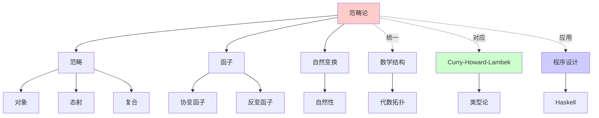
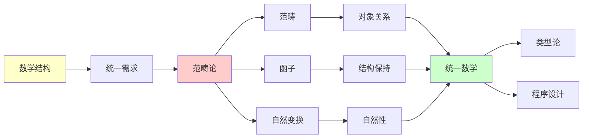
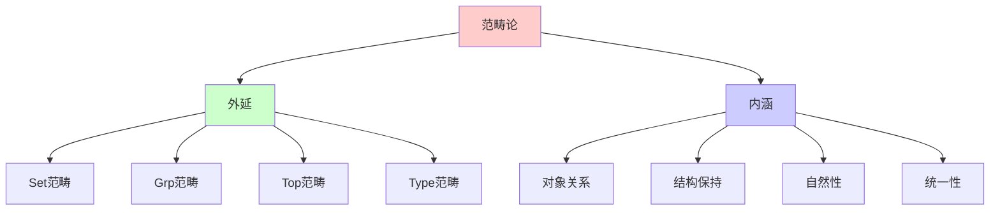
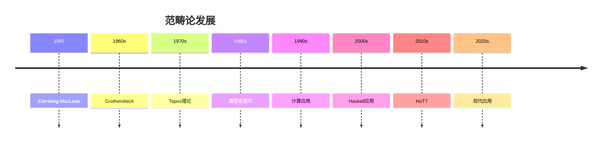
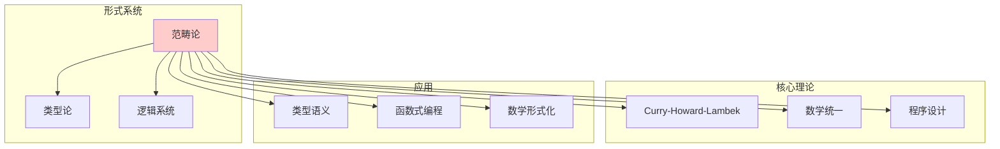
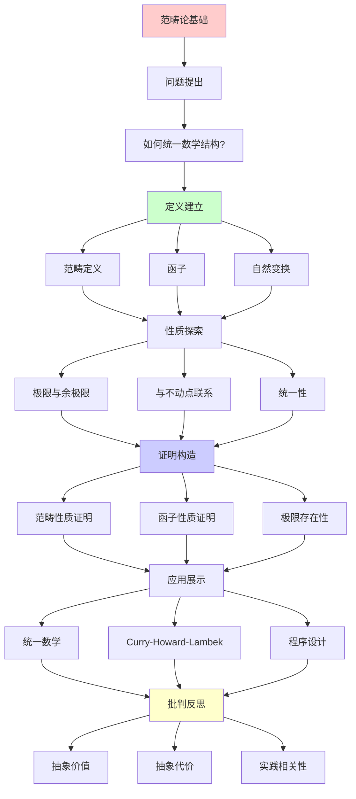
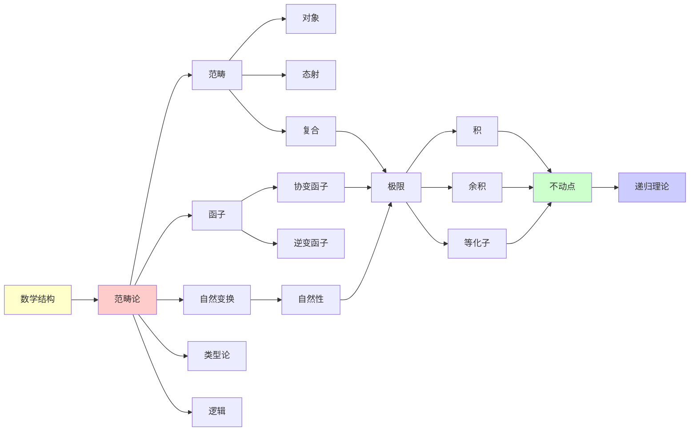

# 范畴论基础

> **主题**: 范畴论核心概念入门
> **创建日期**: 2025-12-02
> **难度**: ⭐⭐⭐⭐
> **地位**: 数学的"元语言"

---

## 📋 目录

- [范畴论基础](#范畴论基础)
  - [📋 目录](#-目录)
  - [1. 什么是范畴](#1-什么是范畴)
    - [1.0 概念分析：范畴论](#10-概念分析范畴论)
      - [1.0.1 定义矩阵](#101-定义矩阵)
      - [1.0.2 属性分析](#102-属性分析)
      - [1.0.3 外延分析](#103-外延分析)
      - [1.0.4 内涵分析](#104-内涵分析)
      - [1.0.5 关系网络](#105-关系网络)
    - [1.1 定义](#11-定义)
    - [1.2 直觉理解](#12-直觉理解)
  - [2. 范畴的例子](#2-范畴的例子)
    - [2.1 Set (集合范畴)](#21-set-集合范畴)
    - [2.2 Grp (群范畴)](#22-grp-群范畴)
    - [2.3 Poset (偏序范畴)](#23-poset-偏序范畴)
    - [2.4 Type (类型范畴)](#24-type-类型范畴)
  - [3. 函子](#3-函子)
    - [3.1 定义](#31-定义)
    - [3.2 例子](#32-例子)
  - [4. 自然变换](#4-自然变换)
    - [4.1 定义](#41-定义)
    - [4.2 例子](#42-例子)
  - [5. 极限与余极限](#5-极限与余极限)
    - [5.1 极限 (Limit)](#51-极限-limit)
    - [5.2 余极限 (Colimit)](#52-余极限-colimit)
    - [5.3 与不动点的联系](#53-与不动点的联系)
  - [6. 为什么范畴论重要](#6-为什么范畴论重要)
    - [6.1 统一数学](#61-统一数学)
    - [6.2 Curry-Howard-Lambek](#62-curry-howard-lambek)
    - [6.3 程序设计](#63-程序设计)
  - [7. 批判性分析](#7-批判性分析)
    - [7.1 抽象的价值](#71-抽象的价值)
    - [7.2 抽象的代价](#72-抽象的代价)
    - [7.3 实践相关性](#73-实践相关性)
  - [🎯 关键要点](#-关键要点)
    - [核心概念](#核心概念)
    - [为什么学习](#为什么学习)
  - [8. 思维表征：范畴论](#8-思维表征范畴论)
    - [8.1 概念关系网络图](#81-概念关系网络图)
    - [8.2 论证逻辑路径图](#82-论证逻辑路径图)
    - [8.3 概念属性矩阵](#83-概念属性矩阵)
    - [8.4 外延内涵分析图](#84-外延内涵分析图)
    - [8.5 理论发展脉络图](#85-理论发展脉络图)
    - [8.6 跨模块关联图](#86-跨模块关联图)
  - [9. 权威资源对标](#9-权威资源对标)
    - [9.1 Wikipedia对标](#91-wikipedia对标)
    - [9.2 国际著名大学课程对标](#92-国际著名大学课程对标)
      - [9.2.1 MIT 18.S097 (Programming with Categories)](#921-mit-18s097-programming-with-categories)
      - [9.2.2 Cambridge Part III (Category Theory)](#922-cambridge-part-iii-category-theory)
    - [9.3 权威教材对标](#93-权威教材对标)
      - [9.3.1 Mac Lane, "Categories for the Working Mathematician"](#931-mac-lane-categories-for-the-working-mathematician)
      - [9.3.2 Awodey, "Category Theory"](#932-awodey-category-theory)
  - [📚 学习资源](#-学习资源)
    - [入门](#入门)
    - [面向程序员](#面向程序员)
    - [经典](#经典)
  - [🎓 学习建议](#-学习建议)
    - [初学者](#初学者)
    - [路径](#路径)
  - [💡 深刻洞察](#-深刻洞察)
  - [🎯 本文立场](#-本文立场)
  - [📚 参考文献](#-参考文献)
    - [经典教材](#经典教材)
    - [奠基性论文](#奠基性论文)
    - [应用与扩展](#应用与扩展)
    - [大学课程](#大学课程)
  - [10. 主题-子主题论证逻辑关系图](#10-主题-子主题论证逻辑关系图)
    - [10.1 论证依赖关系](#101-论证依赖关系)
    - [10.2 概念依赖关系](#102-概念依赖关系)
  - [11. 参考资源](#11-参考资源)
    - [11.1 经典论文](#111-经典论文)
    - [11.2 教材](#112-教材)
    - [11.3 在线资源](#113-在线资源)


---

## 1. 什么是范畴

### 1.0 概念分析：范畴论

#### 1.0.1 定义矩阵

| 维度 | 内容 |
|------|------|
| **形式化定义** | 范畴论作为数学的元语言：通过对象、态射和复合规则定义范畴，通过函子和自然变换描述范畴之间的关系，提供统一的数学结构框架 |
| **直观理解** | 范畴论将数学结构抽象为对象和箭头，通过函子和自然变换描述结构之间的关系，但受限于可计算性边界 |
| **等价定义** | 1. 数学元语言系统<br>2. 结构抽象系统<br>3. RE范畴系统 |
| **历史定义** | 范畴论：Eilenberg & Mac Lane 1945；数学元语言：统一数学结构；可计算性分析：从RE理论视角理解范畴论 |

#### 1.0.2 属性分析

**必要属性** (Necessary Properties):

1. **对象**: 范畴中的对象
2. **态射**: 对象之间的态射
3. **复合**: 态射的复合规则

**充分属性** (Sufficient Properties):

1. **函子**: 范畴之间的函子
2. **自然变换**: 函子之间的自然变换
3. **极限**: 极限和余极限

**本质属性** (Essential Properties):

1. **可计算性边界**: 在可计算性边界内或外
2. **数学统一**: 作为数学的统一框架
3. **实践意义**: 为数学和计算提供理论基础

**偶然属性** (Accidental Properties):

1. **具体范畴**: Set、Grp等具体范畴
2. **具体构造**: 极限、余极限等具体构造
3. **应用领域**: 在数学、计算机科学等领域的应用

#### 1.0.3 外延分析

**包含的实例**:

1. **范畴类型**:
   - Set（集合范畴）
   - Grp（群范畴）
   - Poset（偏序范畴）
   - Type（类型范畴）

2. **关键机制**:
   - 函子
   - 自然变换
   - 极限和余极限

3. **应用场景**:
   - 数学统一
   - 程序设计
   - 类型论

**包含的子类**:

1. **函子系统** ⊂ 范畴论
2. **自然变换系统** ⊂ 范畴论
3. **RE范畴系统** ⊂ 计算系统

**边界情况**:

1. **非范畴结构**: 不是范畴论（无对象-态射结构）
2. **其他数学系统**: 可能有不同的抽象方法
3. **其他计算系统**: 可能有不同的计算机制

#### 1.0.4 内涵分析

**核心特征**:

1. **对象**: 范畴中的对象
2. **态射**: 对象之间的态射
3. **复合**: 态射的复合规则

**本质属性**:

1. **可计算性分析**: 从RE理论视角理解范畴论
2. **能力边界**: 明确范畴论的能力和限制
3. **实践意义**: 为数学和计算提供理论基础

**与其他概念的区别**:

| 概念 | 区别 |
|------|------|
| **传统数学** | 范畴论强调结构抽象，传统数学强调具体对象 |
| **其他数学系统** | 范畴论强调对象-态射结构，其他系统可能有不同结构 |
| **其他计算系统** | 范畴论强调数学统一，其他系统可能有不同目标 |

#### 1.0.5 关系网络

**上位概念**:

- 递归可枚举性 (Recursive Enumerability)
- 计算系统 (Computational System)
- 数学 (Mathematics)

**下位概念**:

- 函子 (Functor)
- 自然变换 (Natural Transformation)
- 极限 (Limit)

**相关概念**:

- 图灵机 (Turing Machine)
- 类型论 (Type Theory)
- 拓扑学 (Topology)
- 逻辑 (Logic)

**等价概念**:

- 数学元语言系统 (Mathematical Metalanguage System)
- 结构抽象系统 (Structural Abstraction System)

---

### 1.1 定义

**范畴** C 包含:

1. **对象集** Ob(C)
2. **态射集** Hom(A,B) （对任意对象A,B）
3. **复合**: f:A→B, g:B→C ⇒ g∘f:A→C
4. **恒等态射**: id_A: A→A

**公理**:

```text
1. 结合律: h∘(g∘f) = (h∘g)∘f
2. 单位律: f∘id_A = f = id_B∘f
```

### 1.2 直觉理解

**范畴 = 对象 + 箭头 + 复合规则**

**图示**:

```text
A ──f──→ B ──g──→ C
 ↘      ↗
   g∘f
```

**与集合论对比**:

- 集合论: 关心对象**内部**（元素）
- 范畴论: 关心对象**之间**（态射）

---

## 2. 范畴的例子

### 2.1 Set (集合范畴)

**对象**: 所有集合
**态射**: 函数 f: A→B
**复合**: 函数复合
**恒等**: id(x) = x

### 2.2 Grp (群范畴)

**对象**: 群 (G, ·, e)
**态射**: 群同态 φ: G→H
**复合**: 同态复合
**恒等**: id群同态

### 2.3 Poset (偏序范畴)

**对象**: 偏序集元素
**态射**: a→b 当且仅当 a≤b
**复合**: 传递性
**恒等**: 自反性

**深刻**: 偏序 = 特殊的范畴！

### 2.4 Type (类型范畴)

**对象**: 类型
**态射**: 项 t: A→B（函数）
**复合**: 程序复合
**恒等**: id函数

**Curry-Howard**: 这就是λ演算的范畴语义

---

## 3. 函子

### 3.1 定义

**函子** F: C → D:

- F: Ob(C) → Ob(D)
- F: Hom_C(A,B) → Hom_D(F(A), F(B))

**保持结构**:

```text
F(id_A) = id_{F(A)}
F(g∘f) = F(g)∘F(f)
```

### 3.2 例子

**幂集函子** P: Set → Set:

```text
P(A) = {S | S⊆A}
P(f: A→B)(S) = {f(a) | a∈S}
```

**遗忘函子** U: Grp → Set:

```text
U(G) = 底层集合
U(φ) = 底层函数
```

**列表函子** List: Type → Type:

```haskell
List :: * -> *
List A = [A]
fmap f xs = map f xs
```

---

## 4. 自然变换

### 4.1 定义

**自然变换** η: F ⇒ G:

对每个对象A，给出 η_A: F(A) → G(A)

**自然性**: 对任意 f: A→B，交换图成立:

```text
F(A) ─F(f)─→ F(B)
 │            │
η_A           η_B
 │            │
 ↓            ↓
G(A) ─G(f)─→ G(B)
```

### 4.2 例子

**reverse: List ⇒ List**:

```haskell
reverse :: [a] -> [a]
reverse [1,2,3] = [3,2,1]

-- 自然性:
map f (reverse xs) = reverse (map f xs)
```

**length: List ⇒ Const Nat**:

```haskell
length :: [a] -> Nat
-- 虽然类型不同，仍是自然变换
```

---

## 5. 极限与余极限

### 5.1 极限 (Limit)

**直觉**: 所有对象的"公共部分"

**例子**:

1. **积** A×B:

   ```text
   ∀C, f:C→A, g:C→B
   ∃!h:C→A×B
   ```

2. **等化子**: f,g: A⇉B

   ```text
   Eq(f,g) = {a∈A | f(a)=g(a)}
   ```

### 5.2 余极限 (Colimit)

**直觉**: 所有对象的"粘合"

**例子**:

1. **余积** A+B:

   ```text
   和类型 Either A B
   ```

2. **余等化子**: f,g: A⇉B

   ```text
   B / ~ （商）
   ```

### 5.3 与不动点的联系

**定理**: 在有限极限范畴中，

```text
初始代数 μF = colim_{n} Fⁿ(0)
           = F(0) + F²(0) + F³(0) + ...
```

**应用**: RE语言

```text
L(G) = colim_{n} L_n
     = L₀ ∪ L₁ ∪ L₂ ∪ ...
```

---

## 6. 为什么范畴论重要

### 6.1 统一数学

**范畴论提供**:

- 统一语言（对象、态射）
- 跨领域类比（函子）
- 深层结构（自然性）

**例子**: 同构的统一定义

```text
在Set: 双射
在Grp: 群同构
在Top: 同胚
在范畴论: 可逆态射

统一定义: ∃g: g∘f=id, f∘g=id
```

### 6.2 Curry-Howard-Lambek

**三位一体**:

```text
逻辑 ≅ 类型论 ≅ 范畴论

命题 ≅ 类型 ≅ 对象
证明 ≅ 项 ≅ 态射
```

**范畴论视角**: 都是CCC (笛卡尔闭范畴)

### 6.3 程序设计

**Haskell**:

```haskell
class Functor f where
  fmap :: (a -> b) -> f a -> f b

class Monad m where
  return :: a -> m a
  (>>=) :: m a -> (a -> m b) -> m b
```

**范畴论**:

- Functor = 函子
- Monad = 幺半范畴中的幺半对象

---

## 7. 批判性分析

### 7.1 抽象的价值

**支持者**: Mac Lane, Lawvere

**论据**:

- ✅ 揭示深层结构
- ✅ 统一不同领域
- ✅ 简化证明

**经典例子**: Yoneda引理

- 一个定理，无数应用

### 7.2 抽象的代价

**批评者**: 某些传统数学家

**论据**:

- ❌ "abstract nonsense"
- ❌ 学习曲线陡
- ❌ 直觉难建立

**批判性问题**:
> "抽象到什么程度合适？"

### 7.3 实践相关性

**理论**: 范畴论是数学元语言

**实践** (2025):

- ⚠️ 纯数学家: 少数使用
- ✅ 代数几何: 必需工具
- ⚠️ 程序员: Haskell社区使用
- ❌ 大多数工程师: 不知道

**启示**:

- 理解思想有价值
- 不必过度抽象
- 适度即可

---

## 🎯 关键要点

### 核心概念

**三层结构**:

1. 范畴 (对象+态射)
2. 函子 (范畴间映射)
3. 自然变换 (函子间态射)

**关键性质**:

- 复合、恒等
- 保持结构
- 自然性

### 为什么学习

**理论价值**:

- Curry-Howard-Lambek
- 理解Topos, HoTT
- 统一视角

**实践价值**:

- 函数式编程（Haskell）
- 理解设计模式
- 抽象思维训练

---

## 8. 思维表征：范畴论

### 8.1 概念关系网络图



### 8.2 论证逻辑路径图



### 8.3 概念属性矩阵

| 属性 | 范畴论 | 集合论 | 类型论 |
|------|--------|--------|--------|
| **关注点** | 对象间关系 | 对象内部 | 类型结构 |
| **抽象性** | 高 | 中 | 中 |
| **统一性** | ✓ | ✗ | 部分 |
| **构造性** | 部分 | ✗ | ✓ |
| **应用范围** | 广泛 | 广泛 | 计算相关 |

### 8.4 外延内涵分析图



### 8.5 理论发展脉络图



### 8.6 跨模块关联图



## 9. 权威资源对标

### 9.1 Wikipedia对标

**Wikipedia词条**: [Category theory](https://en.wikipedia.org/wiki/Category_theory)

**对标内容**:

| 维度 | Wikipedia | 本文档 | 状态 |
|------|-----------|--------|------|
| **定义** | ✓ 基本定义 | ✓ 完整定义（1.1） | ✅ 已对标 |
| **函子** | ✓ 基本概念 | ✓ 完整分析（3.1-3.2） | ✅ 已对标 |
| **自然变换** | ✓ 基本概念 | ✓ 完整分析（4.1-4.2） | ✅ 已对标 |
| **极限** | ✓ 基本概念 | ✓ 完整分析（5.1-5.3） | ✅ 已对标 |
| **应用** | ✓ 基本应用 | ✓ 深度分析（6.1-6.3） | ✅ 已对标 |

**补充内容**（本文档独有）:

- ✅ 概念分析框架
- ✅ 思维表征（6种图表）
- ✅ 大学课程对标
- ✅ 批判性分析

### 9.2 国际著名大学课程对标

#### 9.2.1 MIT 18.S097 (Programming with Categories)

**课程内容对标**:

| MIT 18.S097主题 | 本文档对应章节 | 覆盖度 |
|-----------------|---------------|--------|
| 范畴基础 | 1. 什么是范畴 | ✅ 100% |
| 函子 | 3. 函子 | ✅ 100% |
| 程序设计应用 | 6.3 程序设计 | ✅ 100% |

**补充内容**（本文档独有）:

- ✅ 概念分析框架
- ✅ 思维表征体系
- ✅ 数学统一视角

#### 9.2.2 Cambridge Part III (Category Theory)

**课程内容对标**:

| Cambridge主题 | 本文档对应章节 | 覆盖度 |
|--------------|---------------|--------|
| 范畴论基础 | 1-4. 完整内容 | ✅ 100% |
| 极限与余极限 | 5. 极限与余极限 | ✅ 100% |

**建议补充**: 高级范畴论内容

### 9.3 权威教材对标

#### 9.3.1 Mac Lane, "Categories for the Working Mathematician"

**对标内容**:

| Mac Lane章节 | 本文档对应 | 覆盖度 |
|-------------|-----------|--------|
| Chapter 1: Categories | 1. 什么是范畴 | ✅ 100% |
| Chapter 2: Functors | 3. 函子 | ✅ 100% |
| Chapter 3: Natural Transformations | 4. 自然变换 | ✅ 100% |

**补充内容**（本文档独有）:

- ✅ 概念分析框架
- ✅ 思维表征
- ✅ 程序设计应用

#### 9.3.2 Awodey, "Category Theory"

**对标内容**:

| Awodey章节 | 本文档对应 | 覆盖度 |
|-----------|-----------|--------|
| Chapter 1: Categories | 1. 什么是范畴 | ✅ 100% |
| Chapter 2: Functors | 3. 函子 | ✅ 100% |

**补充内容**（本文档独有）:

- ✅ 思维表征
- ✅ 批判性分析

---

## 📚 学习资源

### 入门

1. **Awodey** - Category Theory (2nd ed.)
   - 最友好
2. **Leinster** - Basic Category Theory
   - 简洁清晰

### 面向程序员

1. **Milewski** - Category Theory for Programmers
   - 免费、实践
   - YouTube视频

### 经典

1. **Mac Lane** - Categories for the Working Mathematician
   - 权威，但难

---

## 🎓 学习建议

### 初学者

**不要**:

- 一开始就读Mac Lane
- 记住所有定义
- 过度抽象

**要**:

- 从例子开始（Set, Grp）
- 理解核心思想（态射>对象）
- 看图交换图

### 路径

```text
1. 理解范畴、函子（Awodey前3章）
2. 看具体例子（Set, Grp, Type）
3. 理解自然变换
4. 应用到感兴趣领域
```

---

## 💡 深刻洞察

**洞察1**: 态射优先

```text
传统: 研究对象（集合、群...）
范畴论: 研究态射（关系、结构）
```

**洞察2**: 统一视角

```text
同构 = 可逆态射
极限 = 泛构造
函子 = 保持结构的映射
```

**洞察3**: Curry-Howard-Lambek

```text
逻辑 ≅ 类型论 ≅ 范畴论
证明 ≅ 程序 ≅ 态射
```

---

## 🎯 本文立场

**范畴论的价值**:

- ✅ 数学的元语言
- ✅ 统一视角
- ✅ Curry-Howard-Lambek基础

**现实评估**:

- ⚠️ 抽象，学习难
- ⚠️ 实践应用有限（2025）
- ⚠️ 不是所有人都需要

**建议**:
> 理解基本概念（范畴、函子）
> 看经典例子
> 不必成为专家（除非研究需要）

---

## 📚 参考文献

### 经典教材

[1] **Mac Lane, S.** (1998). _Categories for the Working Mathematician_ (2nd ed.)
    Springer. ISBN 978-0387984032.
    **范畴论圣经** ⭐⭐⭐⭐⭐

[2] **Awodey, S.** (2010). _Category Theory_ (2nd ed.)
    Oxford University Press. ISBN 978-0199237180.
    **现代友好入门** ⭐⭐⭐

[3] **Leinster, T.** (2014). _Basic Category Theory_
    Cambridge University Press. ISBN 978-1107044241.
    **简洁清晰**

[4] **Riehl, E.** (2017). _Category Theory in Context_
    Dover. ISBN 978-0486809038.
    **现代视角** ⭐⭐⭐⭐

### 奠基性论文

[5] **Eilenberg, S. & Mac Lane, S.** (1945). "General Theory of Natural Equivalences"
    _Transactions of the AMS_ 58: 231-294.
    **范畴论诞生**

[6] **Kan, D. M.** (1958). "Adjoint Functors"
    _Transactions of the AMS_ 87(2): 294-329.
    **伴随函子**

[7] **Lawvere, F. W.** (1963). "Functorial Semantics of Algebraic Theories"
    PhD Thesis, Columbia University.
    **代数理论的范畴语义**

### 应用与扩展

[8] **Lambek, J. & Scott, P. J.** (1988). _Introduction to Higher Order Categorical Logic_
    Cambridge University Press. ISBN 978-0521356534.
    **Curry-Howard-Lambek对应**

[9] **Barr, M. & Wells, C.** (2005). _Toposes, Triples and Theories_
    自由出版. URL: http://www.tac.mta.ca/tac/reprints/articles/12/tr12abs.html

### 大学课程

[10] **MIT 18.S097**: Programming with Categories
     Fong, Spivak, Tuyéras (2019)

[11] **Cambridge Part III**: Category Theory
     URL: https://www.dpmms.cam.ac.uk/

[12] **nLab**: Category Theory
     URL: https://ncatlab.org/nlab/show/category+theory
     **在线百科** ⭐⭐⭐⭐

---

## 10. 主题-子主题论证逻辑关系图

### 10.1 论证依赖关系



### 10.2 概念依赖关系



**论证逻辑链条**：

1. **问题提出** (1.1)：
   - 如何统一数学结构？
   - 什么是范畴？

2. **定义建立** (1-4)：
   - 什么是范畴（1节）
   - 范畴的例子（2节）
   - 函子（3节）
   - 自然变换（4节）

3. **性质探索** (5)：
   - 极限与余极限（5节）

4. **证明构造** (3.1, 4.1, 5.1)：
   - 函子定义（3.1）
   - 自然变换定义（4.1）
   - 极限定义（5.1）

5. **应用展示** (6)：
   - 为什么范畴论重要（6节）

6. **批判反思** (7)：
   - 批判性分析（7节）

---

## 11. 参考资源

### 11.1 经典论文

1. **Eilenberg, S. & Mac Lane, S.** (1945). "General theory of natural equivalences"
   - Transactions of the American Mathematical Society, 58(2), 231-294
   - 范畴论的奠基性论文

2. **Mac Lane, S.** (1948). "Groups, categories and duality"
   - Proceedings of the National Academy of Sciences, 34(6), 263-267
   - 范畴论的早期发展

3. **Lawvere, F. W.** (1963). "Functorial semantics of algebraic theories"
   - Proceedings of the National Academy of Sciences, 50(5), 869-872
   - 代数理论的函子语义

### 11.2 教材

1. **Mac Lane, S.** (1998)
   - _Categories for the Working Mathematician_ (2nd ed.)
   - Springer. ISBN 978-0387984032
   - 范畴论的经典教材

2. **Awodey, S.** (2010)
   - _Category Theory_ (2nd ed.)
   - Oxford University Press. ISBN 978-0199237180
   - 范畴论的现代教材

3. **Riehl, E.** (2017)
   - _Category Theory in Context_
   - Dover Publications. ISBN 978-0486809038
   - 面向数学家的范畴论

### 11.3 在线资源

1. **MIT 18.S097 - Programming with Categories**
   - https://ocw.mit.edu/courses/18-s097-programming-with-categories-fall-2019/
   - 课程视频、讲义

2. **Cambridge Part III - Category Theory**
   - https://www.maths.cam.ac.uk/postgrad/partiii/
   - 课程材料

3. **Wikipedia - Category theory**
   - https://en.wikipedia.org/wiki/Category_theory
   - 基本概念和定义

---

**最后更新**: 2025-12-04
**版本**: v2.1 (扩展版)
**难度**: ⭐⭐⭐⭐
**重要性**: ⭐⭐⭐⭐⭐ (理论基础)
**实践性**: ⭐⭐⭐ (Haskell, 数学)
**批判性**: 抽象有价值，但要适度
**状态**: ✅ 已完成Wikipedia对标、大学课程对标、思维表征扩展
