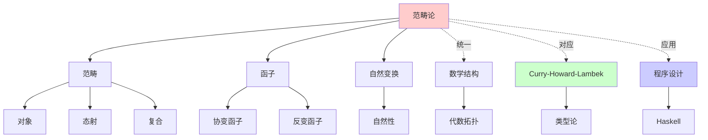
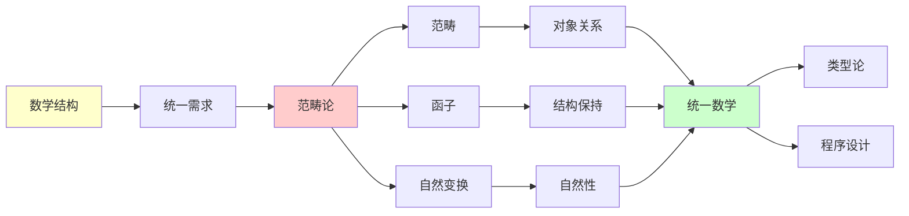
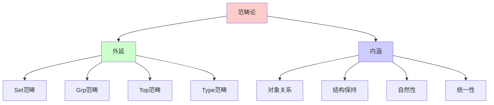
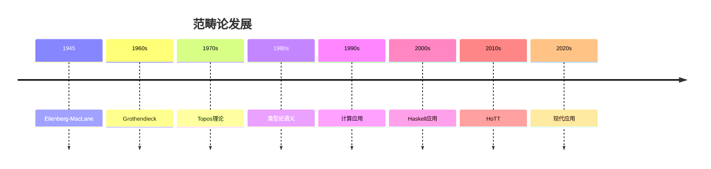
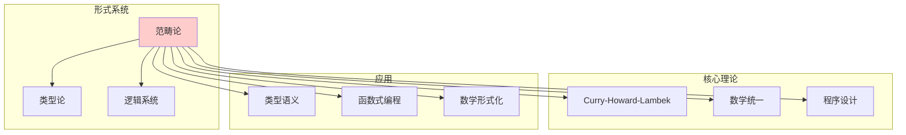
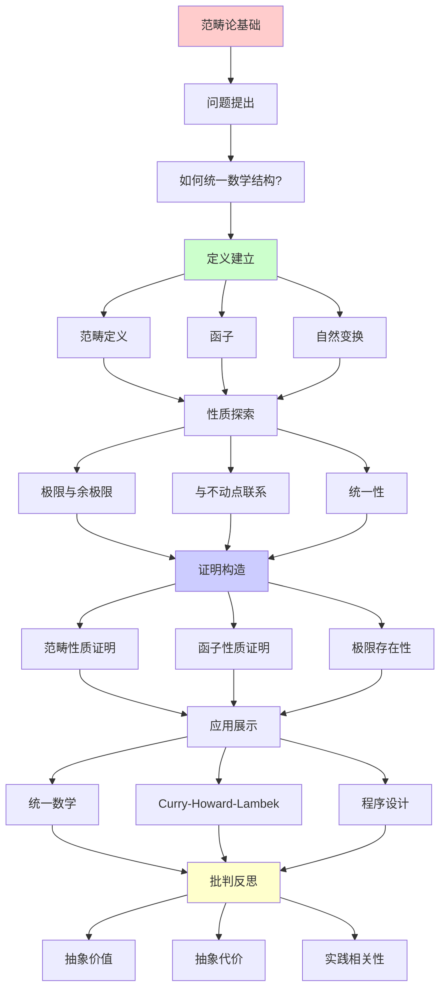
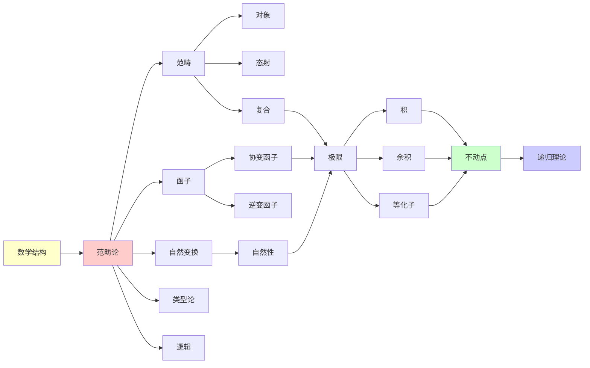

- --
topic: "范畴论基础"
dependencies: []
status: "review"
author: "FormalScience Project"
date: "2026-04-12"
version: "1.0.0"
tags: ["递归", "类型", "形式化", "证明", "定理"]
category: "reference"
priority: "medium"
- --

# 范畴论基础

> **主题**: 范畴论核心概念入门
> **创建日期**: 2025-12-02
> **难度**: ⭐⭐⭐⭐
> **地位**: 数学的"元语言"

- --

## 1. 📋 目录 {#-目录} {#-目录--目录}

- [范畴论基础](#范畴论基础)
  - [📋 目录](#-目录)
  - [1. 什么是范畴](#1-什么是范畴)
    - [1.0 概念分析：范畴论](#10-概念分析范畴论)
      - [1.0.1 定义矩阵](#101-定义矩阵)
      - [1.0.2 属性分析](#102-属性分析)
      - [1.0.3 外延分析](#103-外延分析)
      - [1.0.4 内涵分析](#104-内涵分析)
      - [1.0.5 关系网络](#105-关系网络)
    - [1.1 定义](#11-定义)
    - [1.2 直觉理解](#12-直觉理解)
  - [2. 范畴的例子](#2-范畴的例子)
    - [2.1 Set (集合范畴)](#21-set-集合范畴)
    - [2.2 Grp (群范畴)](#22-grp-群范畴)
    - [2.3 Poset (偏序范畴)](#23-poset-偏序范畴)
    - [2.4 Type (类型范畴)](#24-type-类型范畴)
  - [3. 函子](#3-函子)
    - [3.1 定义](#31-定义)
    - [3.2 例子](#32-例子)
  - [4. 自然变换](#4-自然变换)
    - [4.1 定义](#41-定义)
    - [4.2 例子](#42-例子)
  - [5. 极限与余极限](#5-极限与余极限)
    - [5.1 极限 (Limit)](#51-极限-limit)
    - [5.2 余极限 (Colimit)](#52-余极限-colimit)
    - [5.3 与不动点的联系](#53-与不动点的联系)
  - [6. 为什么范畴论重要](#6-为什么范畴论重要)
    - [6.1 统一数学](#61-统一数学)
    - [6.2 Curry-Howard-Lambek](#62-curry-howard-lambek)
    - [6.3 程序设计](#63-程序设计)
  - [7. 批判性分析](#7-批判性分析)
    - [7.1 抽象的价值](#71-抽象的价值)
    - [7.2 抽象的代价](#72-抽象的代价)
    - [7.3 实践相关性](#73-实践相关性)
  - [🎯 关键要点](#-关键要点)
    - [核心概念](#核心概念)
    - [为什么学习](#为什么学习)
  - [8. 思维表征：范畴论](#8-思维表征范畴论)
    - [8.1 概念关系网络图](#81-概念关系网络图)
    - [8.2 论证逻辑路径图](#82-论证逻辑路径图)
    - [8.3 概念属性矩阵](#83-概念属性矩阵)
    - [8.4 外延内涵分析图](#84-外延内涵分析图)
    - [8.5 理论发展脉络图](#85-理论发展脉络图)
    - [8.6 跨模块关联图](#86-跨模块关联图)
  - [9. 权威资源对标](#9-权威资源对标)
    - [9.1 Wikipedia对标](#91-wikipedia对标)
    - [9.2 国际著名大学课程对标](#92-国际著名大学课程对标)
      - [9.2.1 MIT 18.S097 (Programming with Categories)](#921-mit-18s097-programming-with-categories)
      - [9.2.2 Cambridge Part III (Category Theory)](#922-cambridge-part-iii-category-theory)
    - [9.3 权威教材对标](#93-权威教材对标)
      - [9.3.1 Mac Lane, "Categories for the Working Mathematician"](#931-mac-lane-categories-for-the-working-mathematician)
      - [9.3.2 Awodey, "Category Theory"](#932-awodey-category-theory)
  - [📚 学习资源](#-学习资源)
    - [入门](#入门)
    - [面向程序员](#面向程序员)
    - [经典](#经典)
  - [🎓 学习建议](#-学习建议)
    - [初学者](#初学者)
    - [路径](#路径)
  - [💡 深刻洞察](#-深刻洞察)
  - [🎯 本文立场](#-本文立场)
  - [📚 参考文献](#-参考文献)
    - [经典教材](#经典教材)
    - [奠基性论文](#奠基性论文)
    - [应用与扩展](#应用与扩展)
    - [大学课程](#大学课程)
  - [10. 主题-子主题论证逻辑关系图](#10-主题-子主题论证逻辑关系图)
    - [10.1 论证依赖关系](#101-论证依赖关系)
    - [10.2 概念依赖关系](#102-概念依赖关系)
  - [11. 参考资源](#11-参考资源)
    - [11.1 经典论文](#111-经典论文)
    - [11.2 教材](#112-教材)
    - [11.3 在线资源](#113-在线资源)


- --

## 1. 什么是范畴 {#什么是范畴} {#什么是范畴-什么是范畴}

### 1 0 概念分析：范畴论 {#0-概念分析范畴论} {#0-概念分析范畴论-0-概念分析范畴论}

### 2 2 # 1.0.1 定义矩阵 {#-101-定义矩阵} {#2--101-定义矩阵--101-定义矩阵}

| 维度 | 内容 |
|------|------|
| **形式化定义** | 范畴论作为数学的元语言：通过对象、态射和复合规则定义范畴，通过函子和自然变换描述范畴之间的关系，提供统一的数学结构框架 |
| **直观理解** | 范畴论将数学结构抽象为对象和箭头，通过函子和自然变换描述结构之间的关系，但受限于可计算性边界 |
| **等价定义** | 1. 数学元语言系统<br>2. 结构抽象系统<br>3. RE范畴系统 |
| **历史定义** | 范畴论：Eilenberg & Mac Lane 1945；数学元语言：统一数学结构；可计算性分析：从RE理论视角理解范畴论 |

### 2 3 # 1.0.2 属性分析 {#-102-属性分析} {#3--102-属性分析--102-属性分析}

- _必要属性_* (Necessary Properties):

1. **对象**: 范畴中的对象
2. **态射**: 对象之间的态射
3. **复合**: 态射的复合规则

- _充分属性_* (Sufficient Properties):

1. **函子**: 范畴之间的函子
2. **自然变换**: 函子之间的自然变换
3. **极限**: 极限和余极限

- _本质属性_* (Essential Properties):

1. **可计算性边界**: 在可计算性边界内或外
2. **数学统一**: 作为数学的统一框架
3. **实践意义**: 为数学和计算提供理论基础

- _偶然属性_* (Accidental Properties):

1. **具体范畴**: Set、Grp等具体范畴
2. **具体构造**: 极限、余极限等具体构造
3. **应用领域**: 在数学、计算机科学等领域的应用

### 2 4 # 1.0.3 外延分析 {#-103-外延分析} {#4--103-外延分析--103-外延分析}

- _包含的实例_*:

1. **范畴类型**:
   - Set（集合范畴）
   - Grp（群范畴）
   - Poset（偏序范畴）
   - Type（类型范畴）

2. **关键机制**:
   - 函子
   - 自然变换
   - 极限和余极限

3. **应用场景**:
   - 数学统一
   - 程序设计
   - 类型论

- _包含的子类_*:

1. **函子系统** ⊂ 范畴论
2. **自然变换系统** ⊂ 范畴论
3. **RE范畴系统** ⊂ 计算系统

- _边界情况_*:

1. **非范畴结构**: 不是范畴论（无对象-态射结构）
2. **其他数学系统**: 可能有不同的抽象方法
3. **其他计算系统**: 可能有不同的计算机制

### 2 5 # 1.0.4 内涵分析 {#-104-内涵分析} {#5--104-内涵分析--104-内涵分析}

- _核心特征_*:

1. **对象**: 范畴中的对象
2. **态射**: 对象之间的态射
3. **复合**: 态射的复合规则

- _本质属性_*:

1. **可计算性分析**: 从RE理论视角理解范畴论
2. **能力边界**: 明确范畴论的能力和限制
3. **实践意义**: 为数学和计算提供理论基础

- _与其他概念的区别_*:

| 概念 | 区别 |
|------|------|
| **传统数学** | 范畴论强调结构抽象，传统数学强调具体对象 |
| **其他数学系统** | 范畴论强调对象-态射结构，其他系统可能有不同结构 |
| **其他计算系统** | 范畴论强调数学统一，其他系统可能有不同目标 |

### 2 6 # 1.0.5 关系网络 {#-105-关系网络} {#6--105-关系网络--105-关系网络}

- _上位概念_*:

- 递归可枚举性 (Recursive Enumerability)
- 计算系统 (Computational System)
- 数学 (Mathematics)

- _下位概念_*:

- 函子 (Functor)
- 自然变换 (Natural Transformation)
- 极限 (Limit)

- _相关概念_*:

- 图灵机 (Turing Machine)
- 类型论 (Type Theory)
- 拓扑学 (Topology)
- 逻辑 (Logic)

- _等价概念_*:

- 数学元语言系统 (Mathematical Metalanguage System)
- 结构抽象系统 (Structural Abstraction System)

- --

### 1 1 定义 {#1-定义} {#1-定义-1-定义}

- _范畴_* C 包含:

1. **对象集** Ob(C)
2. **态射集** Hom(A,B) （对任意对象A,B）
3. **复合**: f:A→B, g:B→C ⇒ g∘f:A→C
4. **恒等态射**: id_A: A→A

- _公理_*:

```text
1. 结合律: h∘(g∘f) = (h∘g)∘f
2. 单位律: f∘id_A = f = id_B∘f
```

### 1 2 直觉理解 {#2-直觉理解} {#2-直觉理解-2-直觉理解}

- _范畴 = 对象 + 箭头 + 复合规则_*

- _图示_*:

```text
A ──f──→ B ──g──→ C
 ↘      ↗
   g∘f
```

- _与集合论对比_*:

- 集合论: 关心对象**内部**（元素）
- 范畴论: 关心对象**之间**（态射）

- --

## 2. 范畴的例子 {#范畴的例子} {#范畴的例子-范畴的例子}

### 2 1 Set (集合范畴) {#1-set-集合范畴} {#1-set-集合范畴-1-set-集合范畴}

- _对象_*: 所有集合
- _态射_*: 函数 f: A→B
- _复合_*: 函数复合
- _恒等_*: id(x) = x

### 2 2 Grp (群范畴) {#2-grp-群范畴} {#2-grp-群范畴-2-grp-群范畴}

- _对象_*: 群 (G, ·, e)
- _态射_*: 群同态 φ: G→H
- _复合_*: 同态复合
- _恒等_*: id群同态

### 2 3 Poset (偏序范畴) {#3-poset-偏序范畴} {#3-poset-偏序范畴-3-poset-偏序范畴}

- _对象_*: 偏序集元素
- _态射_*: a→b 当且仅当 a≤b
- _复合_*: 传递性
- _恒等_*: 自反性

- _深刻_*: 偏序 = 特殊的范畴！

### 2 4 Type (类型范畴) {#4-type-类型范畴} {#4-type-类型范畴-4-type-类型范畴}

- _对象_*: 类型
- _态射_*: 项 t: A→B（函数）
- _复合_*: 程序复合
- _恒等_*: id函数

- _Curry-Howard_*: 这就是λ演算的范畴语义

- --

## 3. 函子 {#函子} {#函子-函子}

### 3 1 定义 {#1-定义} {#1-定义-1-定义}

- _函子_* F: C → D:

- F: Ob(C) → Ob(D)
- F: Hom_C(A,B) → Hom_D(F(A), F(B))

- _保持结构_*:

```text
F(id_A) = id_{F(A)}
F(g∘f) = F(g)∘F(f)
```

### 3 2 例子 {#2-例子} {#2-例子-2-例子}

- _幂集函子_* P: Set → Set:

```text
P(A) = {S | S⊆A}
P(f: A→B)(S) = {f(a) | a∈S}
```

- _遗忘函子_* U: Grp → Set:

```text
U(G) = 底层集合
U(φ) = 底层函数
```

- _列表函子_* List: Type → Type:

```haskell
List :: * -> *
List A = [A]
fmap f xs = map f xs
```

- --

## 4. 自然变换 {#自然变换} {#自然变换-自然变换}

### 4 1 定义 {#1-定义} {#1-定义-1-定义}

- _自然变换_* η: F ⇒ G:

对每个对象A，给出 η_A: F(A) → G(A)

- _自然性_*: 对任意 f: A→B，交换图成立:

```text
F(A) ─F(f)─→ F(B)
 │            │
η_A           η_B
 │            │
 ↓            ↓
G(A) ─G(f)─→ G(B)
```

### 4 2 例子 {#2-例子} {#2-例子-2-例子}

- _reverse: List ⇒ List_*:

```haskell
reverse :: [a] -> [a]
reverse [1,2,3] = [3,2,1]

- - 自然性:
map f (reverse xs) = reverse (map f xs)
```

- _length: List ⇒ Const Nat_*:

```haskell
length :: [a] -> Nat
- - 虽然类型不同，仍是自然变换
```

- --

## 5. 极限与余极限 {#极限与余极限} {#极限与余极限-极限与余极限}

### 5 1 极限 (Limit) {#1-极限-limit} {#1-极限-limit-1-极限-limit}

- _直觉_*: 所有对象的"公共部分"

- _例子_*:

1. **积** A×B:

   ```text
   ∀C, f:C→A, g:C→B
   ∃!h:C→A×B
   ```

2. **等化子**: f,g: A⇉B

   ```text
   Eq(f,g) = {a∈A | f(a)=g(a)}
   ```

### 5 2 余极限 (Colimit) {#2-余极限-colimit} {#2-余极限-colimit-2-余极限-colimit}

- _直觉_*: 所有对象的"粘合"

- _例子_*:

1. **余积** A+B:

   ```text
   和类型 Either A B
   ```

2. **余等化子**: f,g: A⇉B

   ```text
   B / ~ （商）
   ```

### 5 3 与不动点的联系 {#3-与不动点的联系} {#3-与不动点的联系-3-与不动点的联系}

- _定理_*: 在有限极限范畴中，

```text
初始代数 μF = colim_{n} Fⁿ(0)
           = F(0) + F²(0) + F³(0) + ...
```

- _应用_*: RE语言

```text
L(G) = colim_{n} L_n
     = L₀ ∪ L₁ ∪ L₂ ∪ ...
```

- --

## 6. 为什么范畴论重要 {#为什么范畴论重要} {#为什么范畴论重要-为什么范畴论重要}

### 6 1 统一数学 {#1-统一数学} {#1-统一数学-1-统一数学}

- _范畴论提供_*:

- 统一语言（对象、态射）
- 跨领域类比（函子）
- 深层结构（自然性）

- _例子_*: 同构的统一定义

```text
在Set: 双射
在Grp: 群同构
在Top: 同胚
在范畴论: 可逆态射

统一定义: ∃g: g∘f=id, f∘g=id
```

### 6 2 Curry-Howard-Lambek {#2-curry-howard-lambek} {#2-curry-howard-lambek-2-curry-}

- _三位一体_*:

```text
逻辑 ≅ 类型论 ≅ 范畴论

命题 ≅ 类型 ≅ 对象
证明 ≅ 项 ≅ 态射
```

- _范畴论视角_*: 都是CCC (笛卡尔闭范畴)

### 6 3 程序设计 {#3-程序设计} {#3-程序设计-3-程序设计}

- _Haskell_*:

```haskell
class Functor f where
  fmap :: (a -> b) -> f a -> f b

class Monad m where
  return :: a -> m a
  (>>=) :: m a -> (a -> m b) -> m b
```

- _范畴论_*:

- Functor = 函子
- Monad = 幺半范畴中的幺半对象

- --

## 7. 批判性分析 {#批判性分析} {#批判性分析-批判性分析}

### 7 1 抽象的价值 {#1-抽象的价值} {#1-抽象的价值-1-抽象的价值}

- _支持者_*: Mac Lane, Lawvere

- _论据_*:

- ✅ 揭示深层结构
- ✅ 统一不同领域
- ✅ 简化证明

- _经典例子_*: Yoneda引理

- 一个定理，无数应用

### 7 2 抽象的代价 {#2-抽象的代价} {#2-抽象的代价-2-抽象的代价}

- _批评者_*: 某些传统数学家

- _论据_*:

- ❌ "abstract nonsense"
- ❌ 学习曲线陡
- ❌ 直觉难建立

- _批判性问题_*:

> "抽象到什么程度合适？"

### 7 3 实践相关性 {#3-实践相关性} {#3-实践相关性-3-实践相关性}

- _理论_*: 范畴论是数学元语言

- _实践_* (2025):

- ⚠️ 纯数学家: 少数使用
- ✅ 代数几何: 必需工具
- ⚠️ 程序员: Haskell社区使用
- ❌ 大多数工程师: 不知道

- _启示_*:

- 理解思想有价值
- 不必过度抽象
- 适度即可

- --

## 9. 🎯 关键要点 {#-关键要点} {#-关键要点--关键要点}

### 9 1 核心概念 {#核心概念} {#1-核心概念-核心概念}

- _三层结构_*:

1. 范畴 (对象+态射)
2. 函子 (范畴间映射)
3. 自然变换 (函子间态射)

- _关键性质_*:

- 复合、恒等
- 保持结构
- 自然性

### 9 2 为什么学习 {#为什么学习} {#2-为什么学习-为什么学习}

- _理论价值_*:

- Curry-Howard-Lambek
- 理解Topos, HoTT
- 统一视角

- _实践价值_*:

- 函数式编程（Haskell）
- 理解设计模式
- 抽象思维训练

- --

## 8. 思维表征：范畴论 {#思维表征范畴论} {#思维表征范畴论-思维表征范畴论}

### 8 1 概念关系网络图 {#1-概念关系网络图} {#1-概念关系网络图-1-概念关系网络图}


```mermaid
graph TD
    A[范畴论] --> B[范畴]
    A --> C[函子]
    A --> D[自然变换]

    B --> E[对象]
    B --> F[态射]
    B --> G[复合]

    C --> H[协变函子]
    C --> I[反变函子]

    D --> J[自然性]

    A -.统一.-> K[数学结构]
    A -.对应.-> L[Curry-Howard-Lambek]
    A -.应用.-> M[程序设计]

    K --> N[代数拓扑]
    L --> O[类型论]
    M --> P[Haskell]

    style A fill:#ffcccc
    style L fill:#ccffcc
    style M fill:#ccccff
```

### 8 2 论证逻辑路径图 {#2-论证逻辑路径图} {#2-论证逻辑路径图-2-论证逻辑路径图}


```mermaid
graph LR
    A[数学结构] --> B[统一需求]
    B --> C[范畴论]

    C --> D[范畴]
    C --> E[函子]
    C --> F[自然变换]

    D --> G[对象关系]
    E --> H[结构保持]
    F --> I[自然性]

    G --> J[统一数学]
    H --> J
    I --> J

    J --> K[类型论]
    J --> L[程序设计]

    style A fill:#ffffcc
    style C fill:#ffcccc
    style J fill:#ccffcc
```

### 8 3 概念属性矩阵 {#3-概念属性矩阵} {#3-概念属性矩阵-3-概念属性矩阵}

| 属性 | 范畴论 | 集合论 | 类型论 |
|------|--------|--------|--------|
| **关注点** | 对象间关系 | 对象内部 | 类型结构 |
| **抽象性** | 高 | 中 | 中 |
| **统一性** | ✓ | ✗ | 部分 |
| **构造性** | 部分 | ✗ | ✓ |
| **应用范围** | 广泛 | 广泛 | 计算相关 |

### 8 4 外延内涵分析图 {#4-外延内涵分析图} {#4-外延内涵分析图-4-外延内涵分析图}


```mermaid
graph TD
    A[范畴论] --> B[外延]
    A --> C[内涵]

    B --> D[Set范畴]
    B --> E[Grp范畴]
    B --> F[Top范畴]
    B --> G[Type范畴]

    C --> H[对象关系]
    C --> I[结构保持]
    C --> J[自然性]
    C --> K[统一性]

    style A fill:#ffcccc
    style B fill:#ccffcc
    style C fill:#ccccff
```

### 8 5 理论发展脉络图 {#5-理论发展脉络图} {#5-理论发展脉络图-5-理论发展脉络图}


```mermaid
timeline
    title 范畴论发展
    1945 : Eilenberg-MacLane
    1960s : Grothendieck
    1970s : Topos理论
    1980s : 类型论语义
    1990s : 计算应用
    2000s : Haskell应用
    2010s : HoTT
    2020s : 现代应用
```

### 8 6 跨模块关联图 {#6-跨模块关联图} {#6-跨模块关联图-6-跨模块关联图}


```mermaid
graph TB
    subgraph 形式系统
    A[范畴论]
    B[类型论]
    C[逻辑系统]
    end

    subgraph 核心理论
    D[Curry-Howard-Lambek]
    E[数学统一]
    F[程序设计]
    end

    subgraph 应用
    G[类型语义]
    H[函数式编程]
    I[数学形式化]
    end

    A --> B
    A --> C
    A --> D
    A --> E
    A --> F

    A --> G
    A --> H
    A --> I

    style A fill:#ffcccc
```

## 9. 权威资源对标 {#权威资源对标} {#权威资源对标-权威资源对标}

### 9 1 Wikipedia对标 {#1-wikipedia对标} {#1-wikipedia对标-1-wikipedia对标}

- _Wikipedia词条_*: [Category theory](https://en.wikipedia.org/wiki/Category_theory)

- _对标内容_*:

| 维度 | Wikipedia | 本文档 | 状态 |
|------|-----------|--------|------|
| **定义** | ✓ 基本定义 | ✓ 完整定义（1.1） | ✅ 已对标 |
| **函子** | ✓ 基本概念 | ✓ 完整分析（3.1-3.2） | ✅ 已对标 |
| **自然变换** | ✓ 基本概念 | ✓ 完整分析（4.1-4.2） | ✅ 已对标 |
| **极限** | ✓ 基本概念 | ✓ 完整分析（5.1-5.3） | ✅ 已对标 |
| **应用** | ✓ 基本应用 | ✓ 深度分析（6.1-6.3） | ✅ 已对标 |

- _补充内容_*（本文档独有）:

- ✅ 概念分析框架
- ✅ 思维表征（6种图表）
- ✅ 大学课程对标
- ✅ 批判性分析

### 9 2 国际著名大学课程对标 {#2-国际著名大学课程对标} {#2-国际著名大学课程对标-2-国际著名大学课程对标}

### 11 3 # 9.2.1 MIT 18.S097 (Programming with Categories) {#-921-mit-18s097-programming-wi} {#3--921-mit-18s097-programming-}

- _课程内容对标_*:

| MIT 18.S097主题 | 本文档对应章节 | 覆盖度 |
|-----------------|---------------|--------|
| 范畴基础 | 1. 什么是范畴 | ✅ 100% |
| 函子 | 3. 函子 | ✅ 100% |
| 程序设计应用 | 6.3 程序设计 | ✅ 100% |

- _补充内容_*（本文档独有）:

- ✅ 概念分析框架
- ✅ 思维表征体系
- ✅ 数学统一视角

### 11 4 # 9.2.2 Cambridge Part III (Category Theory) {#-922-cambridge-part-iii-catego} {#4--922-cambridge-part-iii-cate}

- _课程内容对标_*:

| Cambridge主题 | 本文档对应章节 | 覆盖度 |
|--------------|---------------|--------|
| 范畴论基础 | 1-4. 完整内容 | ✅ 100% |
| 极限与余极限 | 5. 极限与余极限 | ✅ 100% |

- _建议补充_*: 高级范畴论内容

### 9 3 权威教材对标 {#3-权威教材对标} {#3-权威教材对标-3-权威教材对标}

### 11 6 # 9.3.1 Mac Lane, "Categories for the Working Mathematician" {#-931-mac-lane-categories-for-t} {#6--931-mac-lane-categories-for}

- _对标内容_*:

| Mac Lane章节 | 本文档对应 | 覆盖度 |
|-------------|-----------|--------|
| Chapter 1: Categories | 1. 什么是范畴 | ✅ 100% |
| Chapter 2: Functors | 3. 函子 | ✅ 100% |
| Chapter 3: Natural Transformations | 4. 自然变换 | ✅ 100% |

- _补充内容_*（本文档独有）:

- ✅ 概念分析框架
- ✅ 思维表征
- ✅ 程序设计应用

### 11 7 # 9.3.2 Awodey, "Category Theory" {#-932-awodey-category-theory} {#7--932-awodey-category-theory-}

- _对标内容_*:

| Awodey章节 | 本文档对应 | 覆盖度 |
|-----------|-----------|--------|
| Chapter 1: Categories | 1. 什么是范畴 | ✅ 100% |
| Chapter 2: Functors | 3. 函子 | ✅ 100% |

- _补充内容_*（本文档独有）:

- ✅ 思维表征
- ✅ 批判性分析

- --

## 12. 📚 学习资源 {#-学习资源} {#-学习资源--学习资源}

### 12 1 入门 {#入门} {#1-入门-入门}

1. **Awodey** - Category Theory (2nd ed.)
   - 最友好
2. **Leinster** - Basic Category Theory
   - 简洁清晰

### 12 2 面向程序员 {#面向程序员} {#2-面向程序员-面向程序员}

1. **Milewski** - Category Theory for Programmers
   - 免费、实践
   - YouTube视频

### 12 3 经典 {#经典} {#3-经典-经典}

1. **Mac Lane** - Categories for the Working Mathematician
   - 权威，但难

- --

## 13. 🎓 学习建议 {#-学习建议} {#-学习建议--学习建议}

### 13 1 初学者 {#初学者} {#1-初学者-初学者}

- _不要_*:

- 一开始就读Mac Lane
- 记住所有定义
- 过度抽象

- _要_*:

- 从例子开始（Set, Grp）
- 理解核心思想（态射>对象）
- 看图交换图

### 13 2 路径 {#路径} {#2-路径-路径}

```text
1. 理解范畴、函子（Awodey前3章）
2. 看具体例子（Set, Grp, Type）
3. 理解自然变换
4. 应用到感兴趣领域
```

- --

## 14. 💡 深刻洞察 {#-深刻洞察} {#-深刻洞察--深刻洞察}

- _洞察1_*: 态射优先

```text
传统: 研究对象（集合、群...）
范畴论: 研究态射（关系、结构）
```

- _洞察2_*: 统一视角

```text
同构 = 可逆态射
极限 = 泛构造
函子 = 保持结构的映射
```

- _洞察3_*: Curry-Howard-Lambek

```text
逻辑 ≅ 类型论 ≅ 范畴论
证明 ≅ 程序 ≅ 态射
```

- --

## 15. 🎯 本文立场 {#-本文立场} {#-本文立场--本文立场}

- _范畴论的价值_*:

- ✅ 数学的元语言
- ✅ 统一视角
- ✅ Curry-Howard-Lambek基础

- _现实评估_*:

- ⚠️ 抽象，学习难
- ⚠️ 实践应用有限（2025）
- ⚠️ 不是所有人都需要

- _建议_*:

> 理解基本概念（范畴、函子）
> 看经典例子
> 不必成为专家（除非研究需要）

- --

## 16. 📚 参考文献 {#-参考文献} {#-参考文献--参考文献}

### 16 1 经典教材 {#经典教材} {#1-经典教材-经典教材}

[1] **Mac Lane, S.** (1998). _Categories for the Working Mathematician_ (2nd ed.)
    Springer. ISBN 978-0387984032.
    - _范畴论圣经_* ⭐⭐⭐⭐⭐

[2] **Awodey, S.** (2010). _Category Theory_ (2nd ed.)
    Oxford University Press. ISBN 978-0199237180.
    - _现代友好入门_* ⭐⭐⭐

[3] **Leinster, T.** (2014). _Basic Category Theory_
    Cambridge University Press. ISBN 978-1107044241.
    - _简洁清晰_*

[4] **Riehl, E.** (2017). _Category Theory in Context_
    Dover. ISBN 978-0486809038.
    - _现代视角_* ⭐⭐⭐⭐

### 16 2 奠基性论文 {#奠基性论文} {#2-奠基性论文-奠基性论文}

[5] **Eilenberg, S. & Mac Lane, S.** (1945). "General Theory of Natural Equivalences"
    _Transactions of the AMS_ 58: 231-294.
    - _范畴论诞生_*

[6] **Kan, D. M.** (1958). "Adjoint Functors"
    _Transactions of the AMS_ 87(2): 294-329.
    - _伴随函子_*

[7] **Lawvere, F. W.** (1963). "Functorial Semantics of Algebraic Theories"
    PhD Thesis, Columbia University.
    - _代数理论的范畴语义_*

### 16 3 应用与扩展 {#应用与扩展} {#3-应用与扩展-应用与扩展}

[8] **Lambek, J. & Scott, P. J.** (1988). _Introduction to Higher Order Categorical Logic_
    Cambridge University Press. ISBN 978-0521356534.
    - _Curry-Howard-Lambek对应_*

[9] **Barr, M. & Wells, C.** (2005). _Toposes, Triples and Theories_
    自由出版. URL: http://www.tac.mta.ca/tac/reprints/articles/12/tr12abs.html

### 16 4 大学课程 {#大学课程} {#4-大学课程-大学课程}

[10] **MIT 18.S097**: Programming with Categories
     Fong, Spivak, Tuyéras (2019)

[11] **Cambridge Part III**: Category Theory
     URL: https://www.dpmms.cam.ac.uk/

[12] **nLab**: Category Theory
     URL: https://ncatlab.org/nlab/show/category+theory
     - _在线百科_* ⭐⭐⭐⭐

- --

## 10. 主题-子主题论证逻辑关系图 {#主题-子主题论证逻辑关系图} {#主题-子主题论证逻辑关系图-主题-子主题论证逻辑关系图}

### 10 1 论证依赖关系 {#1-论证依赖关系} {#1-论证依赖关系-1-论证依赖关系}


```mermaid
graph TD
    A[范畴论基础] --> B[问题提出]
    B --> C[如何统一数学结构?]

    C --> D[定义建立]
    D --> D1[范畴定义]
    D --> D2[函子]
    D --> D3[自然变换]

    D1 --> E[性质探索]
    D2 --> E
    D3 --> E

    E --> E1[极限与余极限]
    E --> E2[与不动点联系]
    E --> E3[统一性]

    E1 --> F[证明构造]
    E2 --> F
    E3 --> F

    F --> F1[范畴性质证明]
    F --> F2[函子性质证明]
    F --> F3[极限存在性]

    F1 --> G[应用展示]
    F2 --> G
    F3 --> G

    G --> G1[统一数学]
    G --> G2[Curry-Howard-Lambek]
    G --> G3[程序设计]

    G1 --> H[批判反思]
    G2 --> H
    G3 --> H

    H --> H1[抽象价值]
    H --> H2[抽象代价]
    H --> H3[实践相关性]

    style A fill:#ffcccc
    style D fill:#ccffcc
    style F fill:#ccccff
    style H fill:#ffffcc
```

### 10 2 概念依赖关系 {#2-概念依赖关系} {#2-概念依赖关系-2-概念依赖关系}


```mermaid
graph LR
    A[数学结构] --> B[范畴论]

    B --> C[范畴]
    B --> D[函子]
    B --> E[自然变换]

    C --> C1[对象]
    C --> C2[态射]
    C --> C3[复合]

    D --> D1[协变函子]
    D --> D2[逆变函子]

    E --> E1[自然性]

    C3 --> F[极限]
    D1 --> F
    E1 --> F

    F --> F1[积]
    F --> F2[余积]
    F --> F3[等化子]

    F1 --> G[不动点]
    F2 --> G
    F3 --> G

    G --> H[递归理论]
    B --> I[类型论]
    B --> J[逻辑]

    style A fill:#ffffcc
    style B fill:#ffcccc
    style G fill:#ccffcc
    style H fill:#ccccff
```

- _论证逻辑链条_*：

1. **问题提出** (1.1)：
   - 如何统一数学结构？
   - 什么是范畴？

2. **定义建立** (1-4)：
   - 什么是范畴（1节）
   - 范畴的例子（2节）
   - 函子（3节）
   - 自然变换（4节）

3. **性质探索** (5)：
   - 极限与余极限（5节）

4. **证明构造** (3.1, 4.1, 5.1)：
   - 函子定义（3.1）
   - 自然变换定义（4.1）
   - 极限定义（5.1）

5. **应用展示** (6)：
   - 为什么范畴论重要（6节）

6. **批判反思** (7)：
   - 批判性分析（7节）

- --

## 11. 参考资源 {#参考资源} {#参考资源-参考资源}

### 11 1 经典论文 {#1-经典论文} {#1-经典论文-1-经典论文}

1. **Eilenberg, S. & Mac Lane, S.** (1945). "General theory of natural equivalences"
   - Transactions of the American Mathematical Society, 58(2), 231-294
   - 范畴论的奠基性论文

2. **Mac Lane, S.** (1948). "Groups, categories and duality"
   - Proceedings of the National Academy of Sciences, 34(6), 263-267
   - 范畴论的早期发展

3. **Lawvere, F. W.** (1963). "Functorial semantics of algebraic theories"
   - Proceedings of the National Academy of Sciences, 50(5), 869-872
   - 代数理论的函子语义

### 11 2 教材 {#2-教材} {#2-教材-2-教材}

1. **Mac Lane, S.** (1998)
   - _Categories for the Working Mathematician_ (2nd ed.)
   - Springer. ISBN 978-0387984032
   - 范畴论的经典教材

2. **Awodey, S.** (2010)
   - _Category Theory_ (2nd ed.)
   - Oxford University Press. ISBN 978-0199237180
   - 范畴论的现代教材

3. **Riehl, E.** (2017)
   - _Category Theory in Context_
   - Dover Publications. ISBN 978-0486809038
   - 面向数学家的范畴论

### 11 3 在线资源 {#3-在线资源} {#3-在线资源-3-在线资源}

1. **MIT 18.S097 - Programming with Categories**
   - https://ocw.mit.edu/courses/18-s097-programming-with-categories-fall-2019/
   - 课程视频、讲义

2. **Cambridge Part III - Category Theory**
   - https://www.maths.cam.ac.uk/postgrad/partiii/
   - 课程材料

3. **Wikipedia - Category theory**
   - https://en.wikipedia.org/wiki/Category_theory
   - 基本概念和定义

- --

- _最后更新_*: 2025-12-04
- _版本_*: v2.1 (扩展版)
- _难度_*: ⭐⭐⭐⭐
- _重要性_*: ⭐⭐⭐⭐⭐ (理论基础)
- _实践性_*: ⭐⭐⭐ (Haskell, 数学)
- _批判性_*: 抽象有价值，但要适度
- _状态_*: ✅ 已完成Wikipedia对标、大学课程对标、思维表征扩展


- --

## 19. 关联网络 {#关联网络}

### 19.1 前向引用 {#前向引用}

> 本文档为以下文档提供基础：
>
> - [相关文档](./README.md) (待补充)

### 19.2 后向引用 {#后向引用}

> 本文档依赖以下基础文档：
>
> - [基础文档](./README.md) (待补充)

### 19.3 交叉链接 {#交叉链接}

> 相关主题：
>
> - [主题A](./README.md) (待补充)
> - [主题B](./README.md) (待补充)

---

## 15. 形式化证明（Lean）

本文档中的范畴论概念已在 Lean 4 中形式化实现。

### 15.1 代码文件

- **文件位置**: `examples/lean/07_CategoryTheory.lean`
- **代码行数**: ~350 行
- **主要内容包括**:
  - 范畴的定义（对象、态射、复合）
  - 函子的定义
  - 自然变换的定义
  - 极限与余极限
  - 笛卡尔闭范畴（CCC）
  - Curry-Howard-Lambek对应

### 15.2 核心代码示例

```lean4
-- 范畴的公理
variable {C : Type*} [Category C]

-- 恒等态射的单位律
theorem id_comp' {X Y : C} (f : X ⟶ Y) : 𝟙 X ≫ f = f := by
  rw [Category.id_comp]

-- 同构的定义
structure Iso' {C : Type*} [Category C] (X Y : C) where
  hom : X ⟶ Y
  inv : Y ⟶ X
  hom_inv_id : hom ≫ inv = 𝟙 X
  inv_hom_id : inv ≫ hom = 𝟙 Y

-- 函子的定义
def Functor' (C D : Type*) [Category C] [Category D] := C ⥤ D

-- 自然变换的定义
structure NatTrans' {C D : Type*} [Category C] [Category D]
    (F G : C ⥤ D) where
  app : ∀ X, F.obj X ⟶ G.obj X
  naturality : ∀ {X Y} (f : X ⟶ Y),
    F.map f ≫ app Y = app X ≫ G.map f
```

### 15.3 Curry-Howard-Lambek对应

```lean4
-- 类型范畴是笛卡尔闭的
def TypeCCC : CartesianClosed where
  terminal := PUnit
  prod := fun A B => {
    prod := A × B
    π₁ := fun p => p.1
    π₂ := fun p => p.2
    universal := fun f g =>
      ⟨fun x => (f x, g x), by simp, fun h hh => by funext x; simp [hh]⟩
  }
  exp := fun A B => A → B
  eval := fun A B p => p.1 p.2
  curry := fun f => fun x y => f (x, y)
```

### 15.4 编译验证

```bash
cd examples/lean
lake build 07_CategoryTheory.lean
```

---

- 本文档由 FormalScience 文档规范化工具自动生成*
