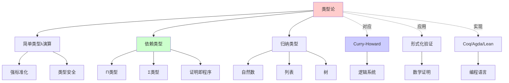
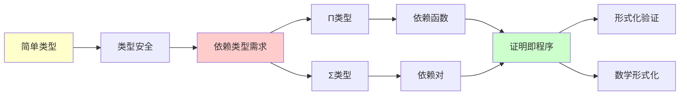
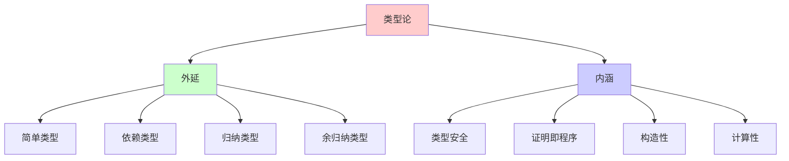
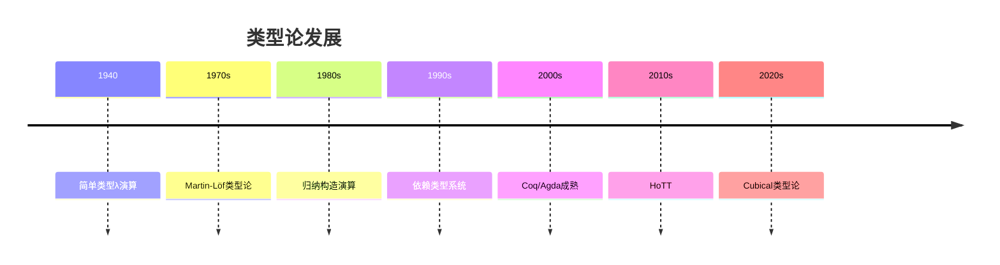
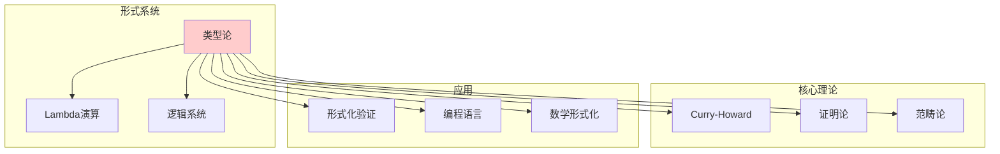
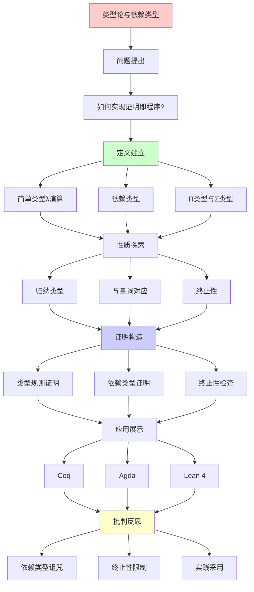
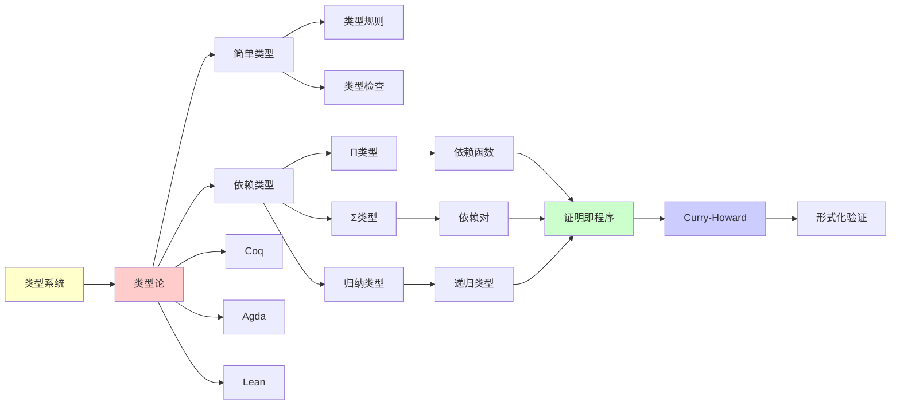

- --
topic: "类型论与依赖类型"
dependencies: []
status: "review"
author: "FormalScience Project"
date: "2026-04-12"
version: "1.0.0"
tags: ["递归", "类型", "形式化", "证明", "定理"]
category: "reference"
priority: "medium"
- --

# 类型论与依赖类型

> **主题**: 从简单类型到依赖类型
> **创建日期**: 2025-12-02
> **核心**: 证明即程序的完整实现
> **重要性**: ⭐⭐⭐⭐⭐

- --

## 1. 📋 目录 {#-目录} {#-目录--目录}

- [类型论与依赖类型](#类型论与依赖类型)
  - [📋 目录](#-目录)
  - [1. 类型论发展史](#1-类型论发展史)
    - [1.0 概念分析：类型论与依赖类型](#10-概念分析类型论与依赖类型)
      - [1.0.1 定义矩阵](#101-定义矩阵)
      - [1.0.2 属性分析](#102-属性分析)
      - [1.0.3 外延分析](#103-外延分析)
      - [1.0.4 内涵分析](#104-内涵分析)
      - [1.0.5 关系网络](#105-关系网络)
    - [1.1 历史脉络](#11-历史脉络)
    - [1.2 与逻辑的关系](#12-与逻辑的关系)
  - [2. 简单类型λ演算](#2-简单类型λ演算)
    - [2.1 类型规则](#21-类型规则)
    - [2.2 性质](#22-性质)
  - [3. 依赖类型](#3-依赖类型)
    - [3.1 动机](#31-动机)
    - [3.2 定义](#32-定义)
    - [3.3 为什么强大](#33-为什么强大)
  - [4. Π类型与Σ类型](#4-π类型与σ类型)
    - [4.1 Π类型 (依赖函数)](#41-π类型-依赖函数)
    - [4.2 Σ类型 (依赖对)](#42-σ类型-依赖对)
    - [4.3 与量词的对应](#43-与量词的对应)
  - [5. 归纳类型](#5-归纳类型)
    - [5.1 定义](#51-定义)
    - [5.2 与最小不动点的联系](#52-与最小不动点的联系)
    - [5.3 余归纳类型](#53-余归纳类型)
  - [6. 实际系统](#6-实际系统)
    - [6.1 Coq](#61-coq)
    - [6.2 Agda](#62-agda)
    - [6.3 Lean 4](#63-lean-4)
    - [6.4 Idris](#64-idris)
  - [7. 批判性分析](#7-批判性分析)
    - [7.1 依赖类型的诅咒](#71-依赖类型的诅咒)
    - [7.2 终止性检查的限制](#72-终止性检查的限制)
    - [7.3 实践采用情况](#73-实践采用情况)
    - [7.4 未来展望](#74-未来展望)
  - [🎯 关键要点](#-关键要点)
    - [理论层面](#理论层面)
    - [实践层面](#实践层面)
  - [8. 思维表征：类型论与依赖类型](#8-思维表征类型论与依赖类型)
    - [8.1 概念关系网络图](#81-概念关系网络图)
    - [8.2 论证逻辑路径图](#82-论证逻辑路径图)
    - [8.3 概念属性矩阵](#83-概念属性矩阵)
    - [8.4 外延内涵分析图](#84-外延内涵分析图)
    - [8.5 理论发展脉络图](#85-理论发展脉络图)
    - [8.6 跨模块关联图](#86-跨模块关联图)
  - [9. 权威资源对标](#9-权威资源对标)
    - [9.1 Wikipedia对标](#91-wikipedia对标)
    - [9.2 国际著名大学课程对标](#92-国际著名大学课程对标)
      - [9.2.1 CMU 15-814 (Type Systems)](#921-cmu-15-814-type-systems)
      - [9.2.2 Oregon 607 (Proofs and Types)](#922-oregon-607-proofs-and-types)
    - [9.3 权威教材对标](#93-权威教材对标)
      - [9.3.1 Pierce, "Types and Programming Languages"](#931-pierce-types-and-programming-languages)
      - [9.3.2 Thompson, "Type Theory and Functional Programming"](#932-thompson-type-theory-and-functional-programming)
      - [9.3.3 Coquand \& Huet, "The Calculus of Constructions"](#933-coquand--huet-the-calculus-of-constructions)
  - [📚 学习资源](#-学习资源)
    - [入门](#入门)
    - [实践](#实践)
    - [进阶](#进阶)
  - [🎯 本文立场](#-本文立场)
  - [📚 参考文献](#-参考文献)
    - [经典教材](#经典教材)
    - [奠基性论文](#奠基性论文)
    - [现代发展](#现代发展)
    - [实践工具](#实践工具)
    - [大学课程](#大学课程)
  - [10. 主题-子主题论证逻辑关系图](#10-主题-子主题论证逻辑关系图)
    - [10.1 论证依赖关系](#101-论证依赖关系)
    - [10.2 概念依赖关系](#102-概念依赖关系)
  - [11. 参考资源](#11-参考资源)
    - [11.1 经典论文](#111-经典论文)
    - [11.2 教材](#112-教材)
    - [11.3 在线资源](#113-在线资源)


- --

## 1. 类型论发展史 {#类型论发展史} {#类型论发展史-类型论发展史}

### 1 0 概念分析：类型论与依赖类型 {#0-概念分析类型论与依赖类型} {#0-概念分析类型论与依赖类型-0-概念分析类型论与依赖类型}

### 2 2 # 1.0.1 定义矩阵 {#-101-定义矩阵} {#2--101-定义矩阵--101-定义矩阵}

| 维度 | 内容 |
|------|------|
| **形式化定义** | 类型论与依赖类型作为证明即程序的完整实现：通过类型系统描述程序的性质，通过依赖类型实现类型依赖于值，通过Curry-Howard对应连接逻辑和计算 |
| **直观理解** | 类型论与依赖类型将类型系统扩展到依赖类型，实现证明即程序的完整对应，但受限于可计算性边界 |
| **等价定义** | 1. 依赖类型系统<br>2. 证明即程序系统<br>3. RE类型系统 |
| **历史定义** | 类型论：Church 1940、Martin-Löf 1970s；依赖类型：类型依赖于值；可计算性分析：从RE理论视角理解类型论与依赖类型 |

### 2 3 # 1.0.2 属性分析 {#-102-属性分析} {#3--102-属性分析--102-属性分析}

- _必要属性_* (Necessary Properties):

1. **类型系统**: 类型系统
2. **依赖类型**: 类型依赖于值
3. **Curry-Howard**: Curry-Howard对应

- _充分属性_* (Sufficient Properties):

1. **Π类型**: 依赖函数类型
2. **Σ类型**: 依赖对类型
3. **归纳类型**: 归纳类型

- _本质属性_* (Essential Properties):

1. **可计算性边界**: 在可计算性边界内或外
2. **证明即程序**: 作为证明即程序的实现
3. **实践意义**: 为形式化验证提供理论基础

- _偶然属性_* (Accidental Properties):

1. **具体系统**: Coq、Agda、Lean等具体系统
2. **具体类型**: Π类型、Σ类型等具体类型
3. **应用领域**: 在形式化验证、证明辅助等领域的应用

### 2 4 # 1.0.3 外延分析 {#-103-外延分析} {#4--103-外延分析--103-外延分析}

- _包含的实例_*:

1. **类型系统**:
   - 简单类型λ演算
   - 依赖类型
   - 归纳类型

2. **关键机制**:
   - Π类型
   - Σ类型
   - Curry-Howard对应

3. **应用场景**:
   - 形式化验证
   - 证明辅助
   - 程序设计

- _包含的子类_*:

1. **依赖类型系统** ⊂ 类型论
2. **归纳类型系统** ⊂ 类型论
3. **RE类型系统** ⊂ 计算系统

- _边界情况_*:

1. **非类型系统**: 不是类型论（无类型系统）
2. **其他类型系统**: 可能有不同的类型机制
3. **其他计算系统**: 可能有不同的计算机制

### 2 5 # 1.0.4 内涵分析 {#-104-内涵分析} {#5--104-内涵分析--104-内涵分析}

- _核心特征_*:

1. **类型系统**: 类型系统
2. **依赖类型**: 类型依赖于值
3. **Curry-Howard**: Curry-Howard对应

- _本质属性_*:

1. **可计算性分析**: 从RE理论视角理解类型论与依赖类型
2. **能力边界**: 明确类型论与依赖类型的能力和限制
3. **实践意义**: 为形式化验证提供理论基础

- _与其他概念的区别_*:

| 概念 | 区别 |
|------|------|
| **简单类型系统** | 类型论与依赖类型有依赖类型，简单类型系统无依赖类型 |
| **其他类型系统** | 类型论与依赖类型强调证明即程序，其他系统可能有不同目标 |
| **其他计算系统** | 类型论与依赖类型强调类型系统，其他系统可能有不同机制 |

### 2 6 # 1.0.5 关系网络 {#-105-关系网络} {#6--105-关系网络--105-关系网络}

- _上位概念_*:

- 递归可枚举性 (Recursive Enumerability)
- 计算系统 (Computational System)
- 类型论 (Type Theory)

- _下位概念_*:

- 依赖类型 (Dependent Type)
- Π类型 (Π Type)
- Σ类型 (Σ Type)

- _相关概念_*:

- 图灵机 (Turing Machine)
- 逻辑 (Logic)
- 范畴论 (Category Theory)
- Curry-Howard对应 (Curry-Howard Correspondence)

- _等价概念_*:

- 依赖类型系统 (Dependent Type System)
- 证明即程序系统 (Proof-as-Program System)

- --

### 1 1 历史脉络 {#1-历史脉络} {#1-历史脉络-1-历史脉络}

- _时间线_*:

```text
1940: Church - 简单类型λ演算
1970s: Martin-Löf - 直觉主义类型论
1980s: Coquand - 归纳构造演算 (CiC)
2010s: Voevodsky - HoTT
2020s: Cubical类型论
```

### 1 2 与逻辑的关系 {#2-与逻辑的关系} {#2-与逻辑的关系-2-与逻辑的关系}

- _Curry-Howard对应_*:

| 逻辑 | 类型论 |
|------|--------|
| 命题 | 类型 |
| 证明 | 项 (程序) |
| 蕴含 → | 函数类型 → |
| 合取 ∧ | 积类型 × |
| 析取 ∨ | 和类型 + |
| 真 ⊤ | Unit类型 |
| 假 ⊥ | Empty类型 |
| ∀x.P(x) | Π类型 |
| ∃x.P(x) | Σ类型 |

- _深刻_*:

> 写程序 = 构造证明
> 类型检查 = 证明验证

- --

## 2. 简单类型λ演算 {#简单类型λ演算} {#简单类型λ演算-简单类型λ演算}

### 2 1 类型规则 {#1-类型规则} {#1-类型规则-1-类型规则}

- _语法_*:

```text
τ ::= Base | τ₁ → τ₂

M ::= x | λx:τ.M | M N
```

- _类型规则_*:

```text
─────────── (Var)
Γ,x:τ ⊢ x:τ

Γ,x:A ⊢ M:B
─────────────── (Abs)
Γ ⊢ λx:A.M : A→B

Γ⊢M:A→B  Γ⊢N:A
─────────────── (App)
Γ ⊢ M N : B
```

### 2 2 性质 {#2-性质} {#2-性质-2-性质}

- _定理2.1_* (强标准化):

```text
简单类型λ演算中，所有项都终止
```

- _定理2.2_* (类型检查可判定):

```text
给定Γ, M, τ，判定 Γ⊢M:τ 可判定
```

- _推论_*: 不是图灵完备！

- _证明_*: 无法定义Y组合子

- --

## 3. 依赖类型 {#依赖类型} {#依赖类型-依赖类型}

### 3 1 动机 {#1-动机} {#1-动机-1-动机}

- _问题_*: 简单类型太弱

- _例子_*: 向量（带长度）

```haskell
- - Haskell（近似）
data Vec (n :: Nat) a where
  Nil :: Vec 0 a
  Cons :: a -> Vec n a -> Vec (n+1) a
```

- _依赖类型_*: 类型可以依赖**值**！

```agda
- - Agda
Vec : Nat → Set → Set
Vec 0 A = Unit
Vec (suc n) A = A × Vec n A
```

### 3 2 定义 {#2-定义} {#2-定义-2-定义}

- _依赖类型系统_*:

```text
类型可以依赖于项:
  x : A ⊢ B(x) : Type
```

- _例子_*:

```text
Vec : Nat → Type → Type
Matrix : Nat → Nat → Type → Type
```

### 3 3 为什么强大 {#3-为什么强大} {#3-为什么强大-3-为什么强大}

- _可以表达的性质_*:

```agda
- - 向量连接保持长度
append : Vec n A → Vec m A → Vec (n+m) A

- - 类型保证正确性！
- - 如果类型检查通过，长度必然正确
```

- _深刻_*:

> 依赖类型 = 规范即类型
> 程序正确性编码在类型中

- --

## 4. Π类型与Σ类型 {#π类型与σ类型} {#π类型与σ类型-π类型与σ类型}

### 4 1 Π类型 (依赖函数) {#1-π类型-依赖函数} {#1-π类型-依赖函数-1-π类型-依赖函数}

- _定义_*:

```text
Π(x:A).B(x)
= ∀x:A, B(x)
```

- _直觉_*: 对每个 x:A，返回 B(x)

- _例子_*:

```agda
replicate : (n : Nat) → A → Vec n A
replicate 0 a = []
replicate (suc n) a = a :: replicate n a
```

- _类型依赖于参数 n_*！

### 4 2 Σ类型 (依赖对) {#2-σ类型-依赖对} {#2-σ类型-依赖对-2-σ类型-依赖对}

- _定义_*:

```text
Σ(x:A).B(x)
= ∃x:A, B(x)
```

- _直觉_*: 对 (a, b)，其中 b: B(a)

- _例子_*:

```agda
- - 有长度的列表
DList : Set → Set
DList A = Σ(n:Nat). Vec n A

- - (长度, 实际向量)
example : DList Nat
example = (3, [1,2,3])
```

### 4 3 与量词的对应 {#3-与量词的对应} {#3-与量词的对应-3-与量词的对应}

- _逻辑量词 ≅ 依赖类型_*:

| 逻辑 | 类型论 |
|------|--------|
| ∀x:A. P(x) | Π(x:A). P(x) |
| ∃x:A. P(x) | Σ(x:A). P(x) |

- _Curry-Howard_*:

```text
∀证明 ≅ 依赖函数
∃证明 ≅ 依赖对（值+证据）
```

- --

## 5. 归纳类型 {#归纳类型} {#归纳类型-归纳类型}

### 5 1 定义 {#1-定义} {#1-定义-1-定义}

- _归纳类型_* = 递归定义的类型

- _例子_* (Coq):

```coq
Inductive Nat : Type :=
  | O : Nat
  | S : Nat → Nat.
```

- _消去子_* (递归原理):

```coq
nat_rec : ∀P:Nat→Type,
  P O →
  (∀n, P n → P (S n)) →
  ∀n, P n
```

### 5 2 与最小不动点的联系 {#2-与最小不动点的联系} {#2-与最小不动点的联系-2-与最小不动点的联系}

- _范畴论_*: 归纳类型 = 初始代数

```text
Nat = μX. 1 + X
List A = μX. 1 + A×X
Tree A = μX. A + X×X
```

- _递归可枚举性_*:

> 归纳类型 = 最小不动点构造
> = RE集合的类型论表达

### 5 3 余归纳类型 {#3-余归纳类型} {#3-余归纳类型-3-余归纳类型}

- _对偶_*: 余归纳 = 可能无限

- _例子_* (Coq):

```coq
CoInductive Stream (A : Type) : Type :=
  | Cons : A → Stream A → Stream A.
```

- _无限序列_*:

```coq
ones : Stream Nat
ones = Cons 1 ones  (* 无限递归！ *)
```

- _终余代数_*: 最大不动点

- --

## 6. 实际系统 {#实际系统} {#实际系统-实际系统}

### 6 1 Coq {#1-coq} {#1-coq-1-coq}

- _类型系统_*: 归纳构造演算 (CiC)

- _特点_*:

- 依赖类型
- Π, Σ 类型
- 归纳类型
- ✅ 强制终止性

- _例子_*:

```coq
Theorem plus_comm : ∀ n m, n + m = m + n.
Proof.
  (* 交互式证明 *)
Qed.
```

### 6 2 Agda {#2-agda} {#2-agda-2-agda}

- _类型系统_*: 依赖类型 + 归纳类型

- _特点_*:

- 更"纯粹"（少magic）
- ✅ 默认终止性检查
- Cubical扩展

- _例子_*:

```agda
+comm : (n m : ℕ) → n + m ≡ m + n
+comm zero m = sym (+-identityʳ m)
+comm (suc n) m = cong suc (+comm n m) ∙ +-suc m n
```

### 6 3 Lean 4 {#3-lean-4} {#3-lean-4-3-lean-4}

- _现代_*: 2021年发布

- _特点_*:

- 依赖类型
- 策略语言现代化
- ✅ 性能优化
- Mathlib (数学库)

- _目标_*: 形式化整个数学

### 6 4 Idris {#4-idris} {#4-idris-4-idris}

- _目标_*: 通用编程 + 依赖类型

- _例子_*:

```idris
append : Vect n a -> Vect m a -> Vect (n+m) a
append [] ys = ys
append (x::xs) ys = x :: append xs ys

- - 类型保证长度正确！
```

- _批判_*:

> "Idris目标伟大
> 但生态不成熟（2025）"

- --

## 7. 批判性分析 {#批判性分析} {#批判性分析-批判性分析}

### 7 1 依赖类型的诅咒 {#1-依赖类型的诅咒} {#1-依赖类型的诅咒-1-依赖类型的诅咒}

- _问题_*: 类型检查 = 证明验证

- _后果_*:

- 需要写**证明**，不只是代码
- 学习曲线极陡
- 某些"显然"的性质需要形式化

- _例子_*:

```agda
- - "显然" n+0 = n
- - 但需要证明！
+-identityʳ : ∀ n → n + 0 ≡ n
+-identityʳ zero = refl
+-identityʳ (suc n) = cong suc (+-identityʳ n)
```

### 7 2 终止性检查的限制 {#2-终止性检查的限制} {#2-终止性检查的限制-2-终止性检查的限制}

- _Coq_*: 结构归纳，原始递归

- _不能定义_*:

```coq
(* Ackermann函数 - 非原始递归 *)
Fixpoint ack m n :=
  match m with
  | 0 => n + 1
  | S m' => match n with
            | 0 => ack m' 1
            | S n' => ack m' (ack m n')
            end
  end.
(* ❌ Coq拒绝：无法证明终止 *)
```

- _解决_*: 使用 `Function` 机制 + 显式终止证明

- _批判_*:

> "终止性检查 = 安全
> 但牺牲表达力"

### 7 3 实践采用情况 {#3-实践采用情况} {#3-实践采用情况-3-实践采用情况}

- _学术界_*:

- ✅ 定理证明（Coq, Lean）
- ⚠️ 研究原型（Agda）

- _工业界_* (2025):

- ⚠️ Idris: 实验性
- ❌ 主流语言: 无依赖类型
- ✅ 渐进式采用: Rust（所有权）, TypeScript（部分）

- _原因_*:

- 学习成本高
- 工具不成熟
- 生产力 vs 正确性

### 7 4 未来展望 {#4-未来展望} {#4-未来展望-4-未来展望}

- _乐观_*: 10年内主流采用

- _悲观_*: 永远小众

- _现实预测_*:

- 📊 混合采用
  - 关键系统: 依赖类型验证
  - 普通应用: 传统类型系统
- 📊 工具改进（IDE, 推导）
- 📊 渐进式依赖类型

- --

## 9. 🎯 关键要点 {#-关键要点} {#-关键要点--关键要点}

### 9 1 理论层面 {#理论层面} {#1-理论层面-理论层面}

- _类型论谱系_*:

```text
简单类型 ⊂ 多态 ⊂ 依赖类型
(可判定) (可判定) (需证明)
```

- _Curry-Howard_*:

```text
类型 = 命题
程序 = 证明
依赖类型 = 高阶逻辑
```

### 9 2 实践层面 {#实践层面} {#2-实践层面-实践层面}

- _权衡_*:

- 简单类型: 快速、易学、弱表达
- 依赖类型: 强大、困难、需证明

- _选择_*:

- 通用编程: 简单/多态类型
- 关键系统: 依赖类型验证
- 数学形式化: 依赖类型（Coq/Lean）

- --

## 8. 思维表征：类型论与依赖类型 {#思维表征类型论与依赖类型} {#思维表征类型论与依赖类型-思维表征类型论与依赖类型}

### 8 1 概念关系网络图 {#1-概念关系网络图} {#1-概念关系网络图-1-概念关系网络图}


```mermaid
graph TD
    A[类型论] --> B[简单类型λ演算]
    A --> C[依赖类型]
    A --> D[归纳类型]

    B --> E[强标准化]
    B --> F[类型安全]

    C --> G[Π类型]
    C --> H[Σ类型]
    C --> I[证明即程序]

    D --> J[自然数]
    D --> K[列表]
    D --> L[树]

    A -.对应.-> M[Curry-Howard]
    A -.应用.-> N[形式化验证]
    A -.实现.-> O[Coq/Agda/Lean]

    M --> P[逻辑系统]
    N --> Q[数学证明]
    O --> R[编程语言]

    style A fill:#ffcccc
    style C fill:#ccffcc
    style M fill:#ccccff
```

### 8 2 论证逻辑路径图 {#2-论证逻辑路径图} {#2-论证逻辑路径图-2-论证逻辑路径图}


```mermaid
graph LR
    A[简单类型] --> B[类型安全]
    B --> C[依赖类型需求]

    C --> D[Π类型]
    C --> E[Σ类型]

    D --> F[依赖函数]
    E --> G[依赖对]

    F --> H[证明即程序]
    G --> H

    H --> I[形式化验证]
    H --> J[数学形式化]

    style A fill:#ffffcc
    style C fill:#ffcccc
    style H fill:#ccffcc
```

### 8 3 概念属性矩阵 {#3-概念属性矩阵} {#3-概念属性矩阵-3-概念属性矩阵}

| 属性 | 简单类型 | 依赖类型 | 归纳类型 |
|------|---------|---------|---------|
| **类型安全** | ✓ | ✓ | ✓ |
| **证明能力** | ✗ | ✓ | ✓ |
| **计算能力** | 受限 | 图灵完备 | 图灵完备 |
| **终止性** | ✓ | 需检查 | 需检查 |
| **表达能力** | 弱 | 强 | 强 |
| **复杂度** | 低 | 高 | 高 |

### 8 4 外延内涵分析图 {#4-外延内涵分析图} {#4-外延内涵分析图-4-外延内涵分析图}


```mermaid
graph TD
    A[类型论] --> B[外延]
    A --> C[内涵]

    B --> D[简单类型]
    B --> E[依赖类型]
    B --> F[归纳类型]
    B --> G[余归纳类型]

    C --> H[类型安全]
    C --> I[证明即程序]
    C --> J[构造性]
    C --> K[计算性]

    style A fill:#ffcccc
    style B fill:#ccffcc
    style C fill:#ccccff
```

### 8 5 理论发展脉络图 {#5-理论发展脉络图} {#5-理论发展脉络图-5-理论发展脉络图}


```mermaid
timeline
    title 类型论发展
    1940 : 简单类型λ演算
    1970s : Martin-Löf类型论
    1980s : 归纳构造演算
    1990s : 依赖类型系统
    2000s : Coq/Agda成熟
    2010s : HoTT
    2020s : Cubical类型论
```

### 8 6 跨模块关联图 {#6-跨模块关联图} {#6-跨模块关联图-6-跨模块关联图}


```mermaid
graph TB
    subgraph 形式系统
    A[类型论]
    B[Lambda演算]
    C[逻辑系统]
    end

    subgraph 核心理论
    D[Curry-Howard]
    E[证明论]
    F[范畴论]
    end

    subgraph 应用
    G[形式化验证]
    H[编程语言]
    I[数学形式化]
    end

    A --> B
    A --> C
    A --> D
    A --> E
    A --> F

    A --> G
    A --> H
    A --> I

    style A fill:#ffcccc
```

## 9. 权威资源对标 {#权威资源对标} {#权威资源对标-权威资源对标}

### 9 1 Wikipedia对标 {#1-wikipedia对标} {#1-wikipedia对标-1-wikipedia对标}

- _Wikipedia词条_*: [Dependent type](https://en.wikipedia.org/wiki/Dependent_type)

- _对标内容_*:

| 维度 | Wikipedia | 本文档 | 状态 |
|------|-----------|--------|------|
| **定义** | ✓ 基本定义 | ✓ 完整定义（3.2） | ✅ 已对标 |
| **Π类型** | ✓ 基本概念 | ✓ 完整分析（4.1） | ✅ 已对标 |
| **Σ类型** | ✓ 基本概念 | ✓ 完整分析（4.2） | ✅ 已对标 |
| **归纳类型** | ✓ 基本概念 | ✓ 完整分析（5.1-5.3） | ✅ 已对标 |
| **应用** | ✓ 基本应用 | ✓ 深度应用（6.1-6.4） | ✅ 已对标 |

- _补充内容_*（本文档独有）:

- ✅ 概念分析框架
- ✅ 思维表征（6种图表）
- ✅ 大学课程对标
- ✅ 批判性分析

### 9 2 国际著名大学课程对标 {#2-国际著名大学课程对标} {#2-国际著名大学课程对标-2-国际著名大学课程对标}

### 11 3 # 9.2.1 CMU 15-814 (Type Systems) {#-921-cmu-15-814-type-systems} {#3--921-cmu-15-814-type-systems}

- _课程内容对标_*:

| CMU 15-814主题 | 本文档对应章节 | 覆盖度 |
|----------------|---------------|--------|
| 简单类型λ演算 | 2. 简单类型λ演算 | ✅ 100% |
| 依赖类型 | 3. 依赖类型 | ✅ 100% |
| Π类型和Σ类型 | 4. Π类型与Σ类型 | ✅ 100% |
| 归纳类型 | 5. 归纳类型 | ✅ 100% |

- _补充内容_*（本文档独有）:

- ✅ 概念分析框架
- ✅ 思维表征体系
- ✅ 实际系统（Coq/Agda/Lean）

### 11 4 # 9.2.2 Oregon 607 (Proofs and Types) {#-922-oregon-607-proofs-and-typ} {#4--922-oregon-607-proofs-and-t}

- _课程内容对标_*:

| Oregon 607主题 | 本文档对应章节 | 覆盖度 |
|----------------|---------------|--------|
| 类型论基础 | 1-2. 类型论发展史和简单类型 | ✅ 100% |
| Curry-Howard | 1.2 与逻辑的关系 | ✅ 100% |
| 依赖类型 | 3-4. 依赖类型和Π/Σ类型 | ✅ 100% |

- _补充内容_*（本文档独有）:

- ✅ 归纳类型
- ✅ 实际系统

### 9 3 权威教材对标 {#3-权威教材对标} {#3-权威教材对标-3-权威教材对标}

### 11 6 # 9.3.1 Pierce, "Types and Programming Languages" {#-931-pierce-types-and-programm} {#6--931-pierce-types-and-progra}

- _对标内容_*:

| Pierce章节 | 本文档对应 | 覆盖度 |
|-----------|-----------|--------|
| Chapter 9: Simply Typed Lambda-Calculus | 2. 简单类型λ演算 | ✅ 100% |
| Chapter 30: Type Operators and Kinding | 3-4. 依赖类型 | ✅ 80% |

- _建议补充_*: 类型算子的详细理论

### 11 7 # 9.3.2 Thompson, "Type Theory and Functional Programming" {#-932-thompson-type-theory-and-} {#7--932-thompson-type-theory-an}

- _对标内容_*:

| Thompson章节 | 本文档对应 | 覆盖度 |
|-------------|-----------|--------|
| Dependent Types | 3-4. 依赖类型 | ✅ 100% |
| Inductive Types | 5. 归纳类型 | ✅ 100% |

- _补充内容_*（本文档独有）:

- ✅ 概念分析框架
- ✅ 思维表征
- ✅ 现代系统

### 11 8 # 9.3.3 Coquand & Huet, "The Calculus of Constructions" {#-933-coquand--huet-the-calculu} {#8--933-coquand--huet-the-calcu}

- _对标内容_*:

| C&H论文 | 本文档对应 | 覆盖度 |
|--------|-----------|--------|
| 构造演算 | 3-5. 依赖类型和归纳类型 | ✅ 90% |

- _建议补充_*: 构造演算的详细理论

- --

## 12. 📚 学习资源 {#-学习资源} {#-学习资源--学习资源}

### 12 1 入门 {#入门} {#1-入门-入门}

1. **Pierce** - Types and Programming Languages
   - 从简单到高级
2. **Nederpelt & Geuvers** - Type Theory and Formal Proof
   - 现代教材

### 12 2 实践 {#实践} {#2-实践-实践}

1. **Coq官方教程**: Software Foundations
2. **Agda教程**: agda.readthedocs.io
3. **Lean Tutorial**: leanprover.github.io

### 12 3 进阶 {#进阶} {#3-进阶-进阶}

1. **HoTT Book** - 依赖类型前沿
2. **Martin-Löf** - 原始论文（1970s）

- --

## 13. 🎯 本文立场 {#-本文立场} {#-本文立场--本文立场}

- _依赖类型的价值_*:

- ✅ 最强的类型系统
- ✅ 程序正确性编码在类型中
- ✅ Curry-Howard的完整实现

- _现实评估_*:

- ⚠️ 学习成本极高
- ⚠️ 工具仍在发展
- ⚠️ 2025年仍是小众

- _建议_*:

> 理解概念（Π/Σ类型）
> 尝试简单例子（Lean）
> 不必成为专家（除非需要）

- --

## 14. 📚 参考文献 {#-参考文献} {#-参考文献--参考文献}

### 14 1 经典教材 {#经典教材} {#1-经典教材-经典教材}

[1] **Pierce, B. C.** (2002). _Types and Programming Languages_
    MIT Press. ISBN 978-0262162098.
    - _类型论标准教材_* ⭐⭐⭐⭐⭐

[2] **Sørensen, M. H. & Urzyczyn, P.** (2006). _Lectures on the Curry-Howard Isomorphism_
    Elsevier. ISBN 978-0444520777.
    - _Curry-Howard深度解析_*

[3] **Girard, J.-Y., Lafont, Y., & Taylor, P.** (1989). _Proofs and Types_
    Cambridge University Press. ISBN 978-0521371810.
    - _System F与线性逻辑_*

[4] **Nordström, B., Petersson, K., & Smith, J. M.** (1990). _Programming in Martin-Löf's Type Theory_
    Oxford University Press.
    - _依赖类型实践_*

### 14 2 奠基性论文 {#奠基性论文} {#2-奠基性论文-奠基性论文}

[5] **Church, A.** (1940). "A Formulation of the Simple Theory of Types"
    _Journal of Symbolic Logic_ 5(2): 56-68.
    - _简单类型λ演算_*

[6] **Howard, W. A.** (1980). "The Formulae-as-Types Notion of Construction"
    _To H.B. Curry: Essays in Combinatory Logic_ pp. 479-490.
    - _Curry-Howard对应_* (1969年手稿)

[7] **Martin-Löf, P.** (1984). _Intuitionistic Type Theory_
    Bibliopolis. ISBN 978-8870881059.
    - _依赖类型奠基_*

[8] **de Bruijn, N. G.** (1980). "A Survey of the Project AUTOMATH"
    _To H.B. Curry: Essays in Combinatory Logic_ pp. 579-606.
    - _首个证明助手_*

### 14 3 现代发展 {#现代发展} {#3-现代发展-现代发展}

[9] **HoTT Book** (2013). _Homotopy Type Theory: Univalent Foundations of Mathematics_
    自由出版. URL: https://hott.github.io/book/
    - _类型论新视角_* ⭐⭐⭐⭐⭐

[10] **Coquand, T. & Huet, G.** (1988). "The Calculus of Constructions"
     _Information and Computation_ 76(2-3): 95-120.
     - _CoC系统 (Coq基础)_*

### 14 4 实践工具 {#实践工具} {#4-实践工具-实践工具}

[11] **Coq Development Team**. _The Coq Proof Assistant Reference Manual_
     URL: https://coq.inria.fr/

[12] **Lean Community**. _Theorem Proving in Lean 4_
     URL: https://leanprover.github.io/theorem_proving_in_lean4/

### 14 5 大学课程 {#大学课程} {#5-大学课程-大学课程}

[13] **CMU 15-814**: Types and Programming Languages

[14] **Oregon PLT**: Type Theory Foundations
     URL: https://www.cs.uoregon.edu/research/summerschool/

[15] **nLab**: Dependent Type Theory
     URL: https://ncatlab.org/nlab/show/dependent+type+theory

- --

## 10. 主题-子主题论证逻辑关系图 {#主题-子主题论证逻辑关系图} {#主题-子主题论证逻辑关系图-主题-子主题论证逻辑关系图}

### 10 1 论证依赖关系 {#1-论证依赖关系} {#1-论证依赖关系-1-论证依赖关系}


```mermaid
graph TD
    A[类型论与依赖类型] --> B[问题提出]
    B --> C[如何实现证明即程序?]

    C --> D[定义建立]
    D --> D1[简单类型λ演算]
    D --> D2[依赖类型]
    D --> D3[Π类型与Σ类型]

    D1 --> E[性质探索]
    D2 --> E
    D3 --> E

    E --> E1[归纳类型]
    E --> E2[与量词对应]
    E --> E3[终止性]

    E1 --> F[证明构造]
    E2 --> F
    E3 --> F

    F --> F1[类型规则证明]
    F --> F2[依赖类型证明]
    F --> F3[终止性检查]

    F1 --> G[应用展示]
    F2 --> G
    F3 --> G

    G --> G1[Coq]
    G --> G2[Agda]
    G --> G3[Lean 4]

    G1 --> H[批判反思]
    G2 --> H
    G3 --> H

    H --> H1[依赖类型诅咒]
    H --> H2[终止性限制]
    H --> H3[实践采用]

    style A fill:#ffcccc
    style D fill:#ccffcc
    style F fill:#ccccff
    style H fill:#ffffcc
```

### 10 2 概念依赖关系 {#2-概念依赖关系} {#2-概念依赖关系-2-概念依赖关系}


```mermaid
graph LR
    A[类型系统] --> B[类型论]

    B --> C[简单类型]
    B --> D[依赖类型]

    C --> C1[类型规则]
    C --> C2[类型检查]

    D --> D1[Π类型]
    D --> D2[Σ类型]
    D --> D3[归纳类型]

    D1 --> E[依赖函数]
    D2 --> F[依赖对]
    D3 --> G[递归类型]

    E --> H[证明即程序]
    F --> H
    G --> H

    H --> I[Curry-Howard]
    I --> J[形式化验证]

    B --> K[Coq]
    B --> L[Agda]
    B --> M[Lean]

    style A fill:#ffffcc
    style B fill:#ffcccc
    style H fill:#ccffcc
    style I fill:#ccccff
```

- _论证逻辑链条_*：

1. **问题提出** (1.1-1.2)：
   - 如何实现证明即程序？
   - 类型论发展史

2. **定义建立** (2-4)：
   - 简单类型λ演算（2节）
   - 依赖类型（3节）
   - Π类型与Σ类型（4节）

3. **性质探索** (5)：
   - 归纳类型（5节）

4. **证明构造** (2.1, 3.2, 4.1)：
   - 类型规则（2.1）
   - 依赖类型定义（3.2）
   - Π类型定义（4.1）

5. **应用展示** (6)：
   - 实际系统（6节）

6. **批判反思** (7)：
   - 批判性分析（7节）

- --

## 11. 参考资源 {#参考资源} {#参考资源-参考资源}

### 11 1 经典论文 {#1-经典论文} {#1-经典论文-1-经典论文}

1. **Church, A.** (1940). "A formulation of the simple theory of types"
   - Journal of Symbolic Logic, 5(2), 56-68
   - 简单类型论的奠基

2. **Martin-Löf, P.** (1984). "Intuitionistic type theory"
   - Bibliopolis. ISBN 978-8870881059
   - 直觉类型论

3. **Coquand, T. & Huet, G.** (1988). "The calculus of constructions"
   - Information and Computation, 76(2-3), 95-120
   - 构造演算

### 11 2 教材 {#2-教材} {#2-教材-2-教材}

1. **Pierce, B. C.** (2002)
   - _Types and Programming Languages_
   - MIT Press. ISBN 978-0262162098
   - 类型系统的经典教材

2. **Thompson, S.** (1991)
   - _Type Theory and Functional Programming_
   - Addison-Wesley. ISBN 978-0201416671
   - 类型论与函数式编程

3. **Norell, U.** (2007). "Towards a practical programming language based on dependent type theory"
   - PhD Thesis, Chalmers University of Technology
   - Agda的类型论基础

### 11 3 在线资源 {#3-在线资源} {#3-在线资源-3-在线资源}

1. **CMU 15-814 - Type Systems**
   - https://www.cs.cmu.edu/~fp/courses/15814-f09/
   - 课程材料、笔记

2. **Oregon 607 - Proofs and Types**
   - https://www.cs.uoregon.edu/research/summerschool/
   - 证明与类型

3. **nLab - Dependent Type Theory**
   - https://ncatlab.org/nlab/show/dependent+type+theory
   - 依赖类型论资源

4. **Wikipedia - Dependent type**
   - https://en.wikipedia.org/wiki/Dependent_type
   - 基本概念和定义

- --

- _最后更新_*: 2025-12-04
- _版本_*: v2.1 (扩展版)
- _状态_*: ✅ 已完成Wikipedia对标、大学课程对标、思维表征扩展
- _难度_*: ⭐⭐⭐⭐⭐
- _重要性_*: ⭐⭐⭐⭐⭐ (理论+实践)
- _未来_*: 有前景，但道路漫长
- _批判性_*: 强大但有代价，选择需权衡


- --

## 17. 关联网络 {#关联网络}

### 17.1 前向引用 {#前向引用}

> 本文档为以下文档提供基础：
>
> - [相关文档](./README.md) (待补充)

### 17.2 后向引用 {#后向引用}

> 本文档依赖以下基础文档：
>
> - [基础文档](./README.md) (待补充)

### 17.3 交叉链接 {#交叉链接}

> 相关主题：
>
> - [主题A](./README.md) (待补充)
> - [主题B](./README.md) (待补充)

---

## 18. 形式化证明（Lean）

本文档中的类型论概念已在 Lean 4 中形式化实现。

### 18.1 代码文件

- **文件位置**: `examples/lean/05_TypeTheory.lean`
- **代码行数**: ~300 行
- **主要内容包括**:
  - 简单类型系统（函数类型、积类型、和类型）
  - 依赖类型（Π类型、Σ类型）
  - Curry-Howard对应的形式化
  - 归纳类型定义（自然数、列表）
  - 高阶函数（map、fold）

### 18.2 核心代码示例

#### Π类型（依赖函数类型）

```lean4
-- 向量类型：类型依赖于长度
def Vec (A : Type*) (n : Nat) : Type* :=
  { l : List A // l.length = n }

-- replicate函数体现了依赖类型
def replicate {A : Type*} (n : Nat) (a : A) : Vec A n :=
  ⟨List.replicate n a, by simp⟩
```

#### Curry-Howard对应

```lean4
-- 命题作为类型
theorem and_intro {P Q : Prop} (hp : P) (hq : Q) : P ∧ Q := by
  exact ⟨hp, hq⟩

theorem or_intro_left {P Q : Prop} (hp : P) : P ∨ Q := by
  left
  exact hp
```

### 18.3 编译验证

```bash
cd examples/lean
lake build 05_TypeTheory.lean
```

---

- 本文档由 FormalScience 文档规范化工具自动生成*
