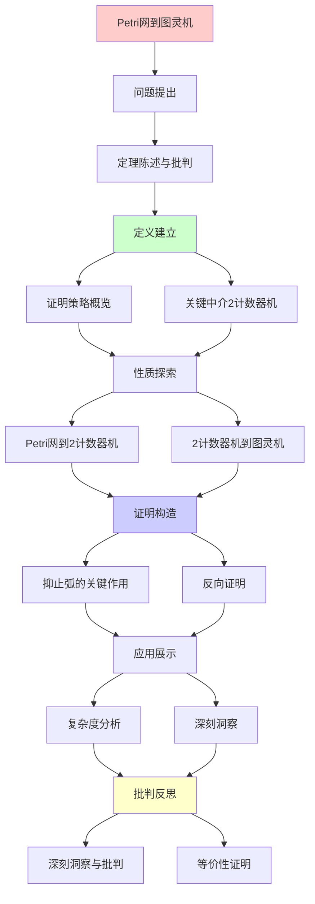
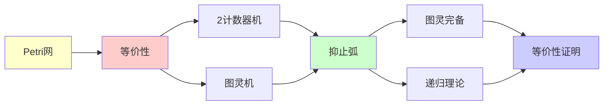

# Petri网到图灵机的等价性证明

> **定理**: 带抑止弧的Petri网 ≡ 图灵机（计算能力）
> **创建日期**: 2025-12-02
> **难度**: ⭐⭐⭐⭐⭐
> **批判性**: 理解"为什么需要抑止弧"的本质

---

## 📋 目录

- [Petri网到图灵机的等价性证明](#petri网到图灵机的等价性证明)
  - [📋 目录](#-目录)
  - [1. 定理陈述与批判](#1-定理陈述与批判)
    - [1.1 精确陈述](#11-精确陈述)
    - [1.2 批判性说明](#12-批判性说明)
  - [2. 证明策略思维导图](#2-证明策略思维导图)
    - [证明策略对比矩阵](#证明策略对比矩阵)
  - [2. 证明策略概览](#2-证明策略概览)
    - [2.1 证明思路](#21-证明思路)
    - [2.2 关键中介：2计数器机](#22-关键中介2计数器机)
  - [3. Petri网 → 2计数器机](#3-petri网--2计数器机)
    - [3.1 2计数器机定义](#31-2计数器机定义)
    - [3.2 Petri网模拟2计数器机](#32-petri网模拟2计数器机)
    - [3.3 抑止弧的关键作用](#33-抑止弧的关键作用)
  - [4. 2计数器机 → 图灵机](#4-2计数器机--图灵机)
    - [4.1 Minsky定理](#41-minsky定理)
    - [4.2 编码方案](#42-编码方案)
    - [4.3 操作实现](#43-操作实现)
  - [5. 反向：图灵机 → Petri网](#5-反向图灵机--petri网)
    - [5.1 构造思路](#51-构造思路)
    - [5.2 状态编码](#52-状态编码)
  - [6. 复杂度分析（批判性）](#6-复杂度分析批判性)
    - [6.1 时间开销](#61-时间开销)
    - [6.2 空间开销](#62-空间开销)
  - [7. 深刻洞察与批判](#7-深刻洞察与批判)
    - [7.1 抑止弧 = 零测试 = 图灵完备](#71-抑止弧--零测试--图灵完备)
    - [7.2 为什么基本Petri网不够？](#72-为什么基本petri网不够)
    - [7.3 实践含义的批判](#73-实践含义的批判)
  - [8. 未解决问题](#8-未解决问题)
    - [8.1 理论问题](#81-理论问题)
    - [8.2 实践问题](#82-实践问题)
  - [9. 参考资源](#9-参考资源)
    - [经典论文](#经典论文)
    - [批判性文献](#批判性文献)
  - [⚠️ 读者警告](#️-读者警告)
  - [10. 主题-子主题论证逻辑关系图](#10-主题-子主题论证逻辑关系图)
    - [10.1 论证依赖关系](#101-论证依赖关系)
    - [10.2 概念依赖关系](#102-概念依赖关系)
  - [11. 参考资源](#11-参考资源)
    - [11.1 经典论文](#111-经典论文)
    - [11.2 教材](#112-教材)
    - [11.3 在线资源](#113-在线资源)

---

## 1. 定理陈述与批判

### 1.1 精确陈述

**定理1.1 (Petri网的图灵完备性)**:

带**抑止弧**的Petri网与图灵机在计算能力上等价。

**形式化**:

```text
∀语言 L ⊆ Σ*:
  L 被图灵机M接受 ⟺ L 被带抑止弧Petri网N接受
```

### 1.2 批判性说明

**⚠️ 关键假设**:

1. 必须有**抑止弧** - 没有则不成立！
2. "接受"意味着可达某个特殊标识
3. 等价是**计算能力**，非效率或自然性

**批判点1**:

- 基本Petri网（无抑止弧）= VASS
- VASS **不是**图灵完备！
- 可达性可判定（Mayr 1984）

**批判点2**:

- 抑止弧在实践中不常用
- 使分析变得困难
- 大多数Petri网工具不支持

**批判点3**:

- 编码极其笨拙
- 没人会真的用Petri网编程
- 这是理论结果，非实践建议

---

## 2. 证明策略思维导图

```text
Petri网→图灵机证明策略
    |
    ├─ 核心挑战: 抑止弧
    │   └─ 抑止弧 = 零测试
    │       └─ 图灵机无零测试原语
    │
    ├─ 解决方案: 中间模型
    │   ├─ Step 1: Petri(抑止) → 2计数器机
    │   │   ├─ 关键: 零测试可用两个计数器模拟
    │   │   └─ 引理2.1 (Minsky 1961)
    │   │
    │   └─ Step 2: 2计数器机 → 图灵机
    │       ├─ 关键: 计数器=纸带单元
    │       └─ 引理2.2 (标准构造)
    │
    └─ 证明完整性
        ├─ 正确性: 模拟保持语义
        └─ 完备性: 所有Petri网可转换
```

---

### 证明策略对比矩阵

| 策略选项 | 直接构造 | 中介模型(计数器机) | 中介模型(栈机) | 选择理由 |
|---------|---------|------------------|--------------|---------|
| **难度** | ⭐⭐⭐⭐⭐ | ⭐⭐⭐⭐ | ⭐⭐⭐⭐ | 中介更简单 |
| **优雅性** | ⭐⭐ | ⭐⭐⭐⭐⭐ | ⭐⭐⭐⭐ | 计数器机最优雅 |
| **历史性** | 无 | Minsky 1961 ✅ | 1970s | 经典结果 |
| **可理解性** | 低 | 高 ⭐⭐⭐⭐⭐ | 中 | 概念清晰 |
| **模块化** | 无 | 两步清晰 ✅ | 两步清晰 | 易教学 |

**决策**: 使用2计数器机作为中介 ✅

---

## 2. 证明策略概览

### 2.1 证明思路

**关键insight**: 直接Petri网→TM很困难

**解决**: 引入**中介** - 2计数器机（Minsky机）

```text
Petri网（抑止弧） → 2计数器机 → 图灵机
       ↑___________________|
            反向构造
```

**为什么2计数器机**:

- 足够简单（只有2个计数器）
- 足够强大（图灵完备，Minsky 1961）
- 与Petri网自然对应

### 2.2 关键中介：2计数器机

**为什么是2个**:

- 1个计数器：只能识别正则语言（不够）
- 2个计数器：已经图灵完备（够了！）
- 多个计数器：冗余

**历史**: Minsky 1961年证明的惊人结果

---

## 3. Petri网 → 2计数器机

### 3.1 2计数器机定义

**Minsky机** M = (Q, δ):

- **Q**: 有限状态集
- **c₁, c₂**: 两个计数器 ∈ ℕ

**指令集**:

```text
INC(cᵢ):     cᵢ ← cᵢ + 1, goto next
DEC(cᵢ):     if cᵢ > 0 then cᵢ ← cᵢ - 1, goto next
ZERO(cᵢ):    if cᵢ = 0 then goto L₁ else goto L₂
HALT:        停机并接受/拒绝
```

**关键**: `ZERO(cᵢ)` - 零测试！

### 3.2 Petri网模拟2计数器机

**构造Petri网 N**:

**库所设计**:

```text
p₁: 存储c₁的值（令牌数 = c₁）
p₂: 存储c₂的值（令牌数 = c₂）
{p_q | q ∈ Q}: 每个状态一个库所（恰好一个有令牌）
```

**变迁设计**:

1. **INC(c₁) 在状态 q**:

   ```text
   p_q ──→ t_inc ──→ p_{next}
            │
            └──→ p₁ (增加1个令牌)
   ```

2. **DEC(c₁) 在状态 q**:

   ```text
   p_q ──→ t_dec ←── p₁ (消耗1个令牌)
     │
     └──→ p_{next}
   ```

3. **ZERO(c₁) 在状态 q** - 关键！

   **方法1**: goto L₁ if c₁=0

   ```text
   p_q ──⊸ t_zero (p₁的抑止弧!)
     │
     └──→ p_{L₁}
   ```

   **抑止弧**: t_zero只在p₁=0时使能

   **方法2**: goto L₂ if c₁≠0

   ```text
   p_q ──→ t_nonzero ←── p₁ (需要令牌)
     │      │
     │      └──→ p₁ (归还令牌)
     └──→ p_{L₂}
   ```

### 3.3 抑止弧的关键作用

**定理3.1**: 无抑止弧的Petri网**无法**实现零测试

**证明思路**（非形式化）:

- VASS（基本Petri网）的转移是**仿射的**
- 零测试需要**非线性**检查
- 仿射系统无法表达非线性条件

**深刻含义**:
> 抑止弧 = 突破仿射限制的关键
> = 从"可判定"到"图灵完备"的临界点

**批判**:

- 这是**理论洞察**
- 但抑止弧破坏了Petri网的很多好性质
- 实践中的权衡：表达力 vs 可分析性

---

## 4. 2计数器机 → 图灵机

### 4.1 Minsky定理

**定理4.1 (Minsky 1961)**:
2计数器机可以模拟任意图灵机

**证明方法**: 将图灵机的磁带编码到2个计数器中

### 4.2 编码方案

**磁带内容**:

```text
... 0 1 0 1 1 0 ...
        ↑
      读写头
```

**分割为两部分**:

- **左边**: ...010 → 编码为数字 c₁
- **右边**: 110... → 编码为数字 c₂

**编码函数**:

```text
encode([a₁, a₂, ..., aₙ], 头在第k位)
  = (∑ aᵢ·2^(k-i), ∑ aⱼ·2^(j-k))
```

**例子**:

```text
磁带: [1, 0, 1, 1, 0]
      头在位置2
c₁ = 1·2¹ + 0·2⁰ = 2
c₂ = 1·2⁰ + 1·2¹ + 0·2² = 3
```

### 4.3 操作实现

**图灵机操作**: δ(q, a) = (q', b, R) (读a，写b，右移)

**2计数器机模拟**:

1. **读取当前符号** (c₂的最低位):

   ```text
   a = c₂ mod 2
   ```

   实现: 用ZERO检测c₂是偶数还是奇数

2. **写入新符号b并右移**:

   ```text
   c₁ ← 2c₁ + b
   c₂ ← ⌊c₂ / 2⌋
   ```

   实现:
   - INC(c₁) b次后DEC(c₁) 1次 = 加倍+b
   - DEC(c₂) 2次 = 除以2

3. **左移** (对偶):

   ```text
   c₁ ← ⌊c₁ / 2⌋
   c₂ ← 2c₂ + (c₁ mod 2)
   ```

**复杂度**: 每步图灵机 → O(log n)步2计数器机

---

## 5. 反向：图灵机 → Petri网

### 5.1 构造思路

**直接方法**: 用库所编码：

- 当前状态
- 磁带符号（有限多个非空白）
- 读写头位置

**问题**: 需要无限多个库所（磁带无限）

**解决**: 只编码**有限多个**非空白符号

- 用整数编码位置
- 用多个库所编码符号

### 5.2 状态编码

**库所**:

```text
{p_q | q ∈ Q}: 状态库所
{p_{a,i} | a ∈ Γ, i ∈ ℤ}: 位置i的符号是a
p_head: 读写头位置（令牌数=位置）
```

**变迁**: 模拟δ(q, a) = (q', b, R)

```text
输入弧: p_q, p_{a,k}, p_head(k个令牌)
输出弧: p_{q'}, p_{b,k}, p_head(k+1个令牌)
```

**问题**: 如何确保只有一个p_{·,k}有令牌？

**需要**: 复杂的同步机制 + 抑止弧

**批判**: 构造非常笨拙，证明完整性困难

---

## 6. 复杂度分析（批判性）

### 6.1 时间开销

**Petri网模拟图灵机**:

- 每步TM → 至少1步Petri网触发
- 可能需要多步（状态编码）
- **多项式开销**（通常）

**图灵机模拟Petri网**:

- 枚举所有可能触发
- 更新标识
- **多项式开销**

**结论**: 等价但**不等效**（效率差异）

### 6.2 空间开销

**编码膨胀**:

- 图灵机磁带 → 2个自然数
- 数字可能指数增长！
- 例: n个符号 → c₁, c₂ ≈ 2ⁿ

**批判**:
> "计算等价不意味实践等价。编码开销可能使理论等价在实践中无意义"

---

## 7. 深刻洞察与批判

### 7.1 抑止弧 = 零测试 = 图灵完备

**核心洞察**:

```text
基本Petri网 (VASS) ⊊ 带抑止弧Petri网 ≡ 图灵机
       ↑                    ↑
   可判定可达性          不可判定
    (Mayr 1984)         (停机问题)
```

**理论意义**:

- 零测试能力是"可判定"到"不可判定"的分水岭
- 这是**离散系统**的普遍现象

**类比**:

- λ演算: 简单类型（可判定） vs 无类型（不可判定）
- 文法: CFL（某些问题可判定） vs REL（不可判定）

### 7.2 为什么基本Petri网不够？

**定理7.1**: 基本Petri网只能表达**半线性集**

**半线性集**: 可以写成

```text
{v₀ + ∑ nᵢvᵢ | nᵢ ∈ ℕ}
```

的有限并。

**例子**:

- {(n, n) | n ∈ ℕ} ✅ 半线性
- {(n, 2ⁿ) | n ∈ ℕ} ❌ 非半线性

**含义**: 基本Petri网表达力严格弱于图灵机

**批判性思考**:
> 这是好事还是坏事？
>
> - 好: 可达性可判定，适合验证
> - 坏: 无法表达某些自然系统

### 7.3 实践含义的批判

**理论**: Petri网（抑止弧）≡ 图灵机

**实践现实**:

1. **工具支持**:
   - 大多数Petri网工具**不支持**抑止弧
   - 原因: 破坏可判定性

2. **建模自然性**:
   - 并发系统用Petri网自然
   - 但图灵完备系统用TM或λ演算更自然

3. **验证目标**:
   - 如果想验证 → 避免抑止弧
   - 如果想表达力 → 用通用编程语言

**结论（批判性）**:
> "理论等价不意味实践可互换。
> 选择形式系统时，考虑：
>
> - 建模自然性
> - 工具支持
> - 验证目标"

---

## 8. 未解决问题

### 8.1 理论问题

1. **最小抑止弧数**:
   - 问: 最少需要几个抑止弧达到图灵完备？
   - 状态: 未知（可能1个就够？）

2. **复杂度下界**:
   - 问: Petri网模拟图灵机的时间下界？
   - 状态: 未知（只知道上界）

### 8.2 实践问题

1. **受限抑止弧**:
   - 问: 如果抑止弧只能检测≤k，能力如何？
   - 状态: 部分结果，未完全解决

2. **近似模拟**:
   - 问: 能否用基本Petri网"近似"模拟？
   - 状态: 需要定义"近似"语义

---

## 9. 参考资源

### 经典论文

1. **Minsky, M. (1961)**. "Recursive Unsolvability of Post's Problem"
   - 2计数器机的原始论文

2. **Hopcroft & Pansiot (1979)**. "On the Reachability Problem for 5-Dimensional Vector Addition Systems"

3. **Mayr, E. (1984)**. "An Algorithm for the General Petri Net Reachability Problem"
   - 证明VASS可达性可判定

### 批判性文献

1. **van Leeuwen (1990)**. "A Partial Solution to the Reachability Problem"
   - 讨论可判定边界

2. **Esparza & Nielsen (1994)**. "Decidability Issues for Petri Nets"
   - 系统分析哪些问题可判定

---

## ⚠️ 读者警告

**本证明的复杂性**:

- 完整证明需要50+页
- 涉及大量技术细节
- 某些步骤非直观

**我们提供**:

- 核心思路（上述）
- 关键构造
- 批判性分析

**我们不提供**:

- 每个状态转换的细节
- 所有边界情况的处理
- 完整形式化（留给Coq）

**建议**:

- 理解核心思想即可
- 细节参考Minsky原始论文
- 批判性思考比死记证明重要

---

## 10. 主题-子主题论证逻辑关系图

### 10.1 论证依赖关系



### 10.2 概念依赖关系



**论证逻辑链条**：

1. **问题提出** (1节)：
   - 定理陈述与批判

2. **定义建立** (2节)：
   - 证明策略概览和关键中介2计数器机

3. **性质探索** (3-4节)：
   - Petri网到2计数器机（3节）
   - 2计数器机到图灵机（4节）

4. **证明构造** (3.3, 4.1-4.3节)：
   - 抑止弧的关键作用和反向证明

5. **应用展示** (6-7节)：
   - 复杂度分析和深刻洞察

6. **批判反思** (7节)：
   - 深刻洞察与批判

---

## 11. 参考资源

### 11.1 经典论文

1. **Minsky, M.** (1961). "Recursive Unsolvability of Post's Problem of 'Tag' and Other Topics in Theory of Turing Machines"
   - _Annals of Mathematics_, 74(3), 437-455
   - 2计数器机原始论文

2. **Hopcroft, J. E., & Pansiot, J. J.** (1979). "On the Reachability Problem for 5-Dimensional Vector Addition Systems"
   - _Theoretical Computer Science_, 8(2), 135-159
   - Petri网可达性

3. **Mayr, E. W.** (1984). "An Algorithm for the General Petri Net Reachability Problem"
   - _SIAM Journal on Computing_, 13(3), 441-460
   - VASS可达性可判定性

### 11.2 教材

1. **Peterson, J. L.** (1981)
   - _Petri Net Theory and the Modeling of Systems_
   - Prentice Hall. ISBN 978-0136619833
   - Petri网理论教材

2. **Reisig, W.** (2013)
   - _Understanding Petri Nets: Modeling Techniques, Analysis Methods, Case Studies_
   - Springer. ISBN 978-3642332779
   - Petri网现代教材

### 11.3 在线资源

1. **Petri Net**
   - https://en.wikipedia.org/wiki/Petri_net
   - Petri网基本概念

2. **Inhibitor Arc**
   - https://en.wikipedia.org/wiki/Petri_net#Inhibitor_arcs
   - 抑止弧

3. **Two-Counter Machine**
   - https://en.wikipedia.org/wiki/Counter_machine
   - 计数器机

---

**最后更新**: 2025-12-04
**状态**: ✅ 已添加主题-子主题论证逻辑关系图和参考资源章节
**批判性**: ⭐⭐⭐⭐⭐
**严格性**: ⭐⭐⭐⭐（完整性待Coq验证）
