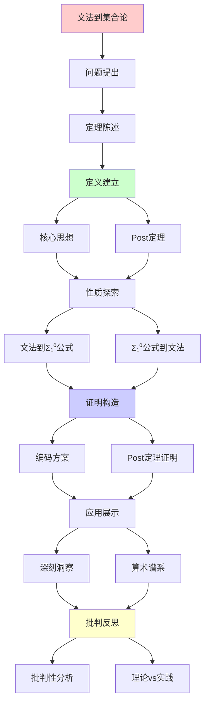
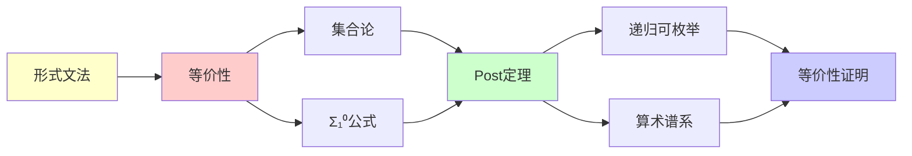

# 文法到集合论的等价性

> **定理**: 文法生成语言 ≡ 集合论中的Σ₁⁰集合
> **创建日期**: 2025-12-02
> **难度**: ⭐⭐⭐⭐
> **关键**: Post定理的应用

---

## 📋 目录

- [文法到集合论的等价性](#文法到集合论的等价性)
  - [📋 目录](#-目录)
  - [1. 定理陈述](#1-定理陈述)
    - [1.1 精确陈述](#11-精确陈述)
    - [1.2 Post定理](#12-post定理)
  - [2. 核心思想](#2-核心思想)
    - [2.1 语言作为集合](#21-语言作为集合)
    - [2.2 递归构造的统一](#22-递归构造的统一)
  - [3. 文法 → Σ₁⁰公式](#3-文法--σ公式)
    - [3.1 编码推导](#31-编码推导)
    - [3.2 编码方案](#32-编码方案)
    - [3.3 具体例子](#33-具体例子)
  - [4. Σ₁⁰公式 → 文法](#4-σ公式--文法)
    - [4.1 构造思路](#41-构造思路)
    - [4.2 图灵机中介](#42-图灵机中介)
    - [4.3 图灵机→文法构造](#43-图灵机文法构造)
  - [5. Post定理的证明](#5-post定理的证明)
    - [5.1 定理陈述](#51-定理陈述)
    - [5.2 方向1: Σ₁⁰ ⊆ RE](#52-方向1-σ--re)
    - [5.2 方向2: RE ⊆ Σ₁⁰](#52-方向2-re--σ)
  - [6. 深刻洞察](#6-深刻洞察)
    - [6.1 递归可枚举的本质](#61-递归可枚举的本质)
    - [6.2 集合论递归 ≡ 图灵递归](#62-集合论递归--图灵递归)
    - [6.3 为什么Σ₁⁰恰好等于RE？](#63-为什么σ恰好等于re)
  - [7. 批判性分析](#7-批判性分析)
    - [7.1 编码的非唯一性](#71-编码的非唯一性)
    - [7.2 实践相关性](#72-实践相关性)
    - [7.3 算术谱系的哲学](#73-算术谱系的哲学)
  - [🎯 关键要点](#-关键要点)
    - [理论层面](#理论层面)
    - [实践层面](#实践层面)
  - [📚 学习资源](#-学习资源)
    - [经典](#经典)
    - [现代](#现代)
  - [💡 深刻洞察](#-深刻洞察)
  - [🎯 本文立场](#-本文立场)
  - [8. 主题-子主题论证逻辑关系图](#8-主题-子主题论证逻辑关系图)
    - [8.1 论证依赖关系](#81-论证依赖关系)
    - [8.2 概念依赖关系](#82-概念依赖关系)
  - [9. 参考资源](#9-参考资源)
    - [9.1 经典论文](#91-经典论文)
    - [9.2 教材](#92-教材)
    - [9.3 在线资源](#93-在线资源)


---

## 1. 定理陈述

### 1.1 精确陈述

**定理1.1**:

```text
L ⊆ Σ* 是RE语言
⟺
L 可由Σ₁⁰公式定义
```

**换句话说**:

```text
Type 0文法生成的语言 = Σ₁⁰算术集合
```

### 1.2 Post定理

**Post定理** (1944):

```text
Σ₁⁰ = RE
Π₁⁰ = coRE
Δ₁⁰ = R (递归)
```

**这是计算理论最深刻的定理之一！**

---

## 2. 核心思想

### 2.1 语言作为集合

**文法生成语言**:

```text
L(G) = {w ∈ Σ* | S ⇒* w}
```

**集合论视角**:

```text
L = {w | ∃推导序列 D: D证明 S⇒*w}
```

**关键**: "存在推导" = 存在量词 (Σ₁)

### 2.2 递归构造的统一

**文法** (推导):

```text
L₀ = ∅
L_{n+1} = L_n ∪ {应用产生式后的新串}
L(G) = ⋃_{n<ω} L_n
```

**集合论** (累积):

```text
V₀ = ∅
V_{n+1} = P(V_n)
V = ⋃_{n<ω} V_n
```

**统一**: 都是**最小不动点**构造！

---

## 3. 文法 → Σ₁⁰公式

### 3.1 编码推导

**文法**: G = (V, Σ, P, S)

**目标**: 定义 Σ₁⁰ 公式 φ_G(w) 使得

```text
w ∈ L(G) ⟺ ℕ ⊨ φ_G(⌜w⌝)
```

### 3.2 编码方案

**步骤1**: 编码符号串

```text
Σ = {a₁, ..., aₖ}
w = aᵢ₁aᵢ₂...aᵢₙ

⌜w⌝ = ⟨i₁, i₂, ..., iₙ⟩ (Gödel编码)
```

**步骤2**: 编码推导序列

```text
D = ⟨α₀, α₁, ..., αₘ⟩
其中: α₀ = S, αₘ = w, αᵢ ⇒ αᵢ₊₁
```

**步骤3**: Σ₁⁰ 公式

```text
φ_G(w) ≡ ∃D ( D是合法推导序列 ∧ D的终点 = w )
         ^^^^^^^^^^^^^^^^^^^^^^^
         这部分是Δ₀（可判定）
```

**关键**:

- "存在推导" = 存在量词 (∃)
- "合法推导" = 可判定谓词 (Δ₀)
- ∴ φ_G ∈ Σ₁⁰

### 3.3 具体例子

**文法**: S → aSb | ε (生成 {aⁿbⁿ})

**Σ₁⁰公式**:

```text
w ∈ L ⟺ ∃n ( w = aⁿbⁿ )
      ⟺ ∃n ∃i ∃j ( w = concat(repeat('a',n), repeat('b',n)) )
```

**Δ₀部分**: 字符串操作都是可判定的

---

## 4. Σ₁⁰公式 → 文法

### 4.1 构造思路

**给定**: Σ₁⁰公式 φ(x) ≡ ∃y ψ(x,y)，其中 ψ ∈ Δ₀

**目标**: 构造文法 G 使得

```text
w ∈ L(G) ⟺ φ(⌜w⌝) 成立
```

### 4.2 图灵机中介

**关键洞察**: Σ₁⁰ = RE (Post定理)

**步骤**:

```text
Σ₁⁰公式 φ
  ↓ (Post定理)
图灵机 M_φ (枚举φ为真的数)
  ↓ (图灵机→文法)
文法 G_φ
```

### 4.3 图灵机→文法构造

**方法**: 文法模拟图灵机计算历史

**文法变量**:

- S: 开始符号
- Q_i: 状态
- T_{a,p}: 位置p的符号是a

**产生式**: 模拟转移

```text
δ(q, a) = (q', b, R)
→
产生式: Q_q T_{a,p} → Q_{q'} T_{b,p} T_{next,p+1}
```

**接受**: 生成串 = 图灵机接受的输入

---

## 5. Post定理的证明

### 5.1 定理陈述

**Post定理** (1944):

```text
A ⊆ ℕ 是 Σ₁⁰ ⟺ A 是 RE
```

### 5.2 方向1: Σ₁⁰ ⊆ RE

**证明**: 设 A = {n | ∃m ψ(n,m)}，其中 ψ ∈ Δ₀

**构造枚举器**:

```python
def enumerate_A():
    for n in ℕ:
        for m in ℕ:
            if ψ(n, m):  # Δ₀可判定
                yield n
                break
```

**关键**: 双重循环枚举所有 (n,m) 对

### 5.2 方向2: RE ⊆ Σ₁⁰

**证明**: 设图灵机 M 枚举集合 A

**定义公式**:

```text
n ∈ A ⟺ ∃t (M在t步内输出n)
      ⟺ ∃t φ_M(n, t)
```

**其中**:

```text
φ_M(n, t) ≡ "M的前t步计算输出包含n"
```

**关键**: φ_M 是 Δ₀ (模拟有限步可判定)

**结论**: A 可由 Σ₁⁰ 公式 ∃t φ_M(n,t) 定义 ∎

---

## 6. 深刻洞察

### 6.1 递归可枚举的本质

**Post定理揭示**:

```text
RE = Σ₁⁰
   = 存在量词 + 可判定谓词
```

**含义**:
> 可枚举 = 可搜索（存在性）
> 前提: 每个候选可判定

### 6.2 集合论递归 ≡ 图灵递归

**文法推导**:

```text
L(G) = μX. (终结符 ∪ 由X产生的串)
```

**集合论构造**:

```text
V_α = ⋃_{β<α} P(V_β)
```

**图灵可枚举**:

```text
Reach(M) = μX. ({初始配置} ∪ step(X))
```

**统一公式**:

```text
所有RE对象 = μX. F(X)
其中 F 是单调算子
```

### 6.3 为什么Σ₁⁰恰好等于RE？

**直觉**:

- Σ₁ = 存在性搜索 ✅ 可枚举
- Σ₂ = 存在+全称 ❌ 超越可枚举
- Π₁ = 全称+存在 ❌ 不可枚举（coRE）

**深刻**:
> 单层存在量词 = 计算的自然边界
> 这不是巧合，是本质！

---

## 7. 批判性分析

### 7.1 编码的非唯一性

**问题**: Gödel编码有多种方式

**影响**:

- 同一语言，不同编码 → 不同Σ₁公式
- 但都是Σ₁⁰

**批判**:
> "编码依赖不影响等价类
> 但影响具体表达"

### 7.2 实践相关性

**理论**: RE = Σ₁⁰（深刻）

**实践**:

- 程序员不用Σ₁⁰公式
- 数学家不用文法编程

**价值**:

- ✅ 理论统一性
- ✅ 理解RE本质
- ⚠️ 直接应用少

### 7.3 算术谱系的哲学

**Σ₁⁰ = RE**: 计算与逻辑的统一

**更高层级**:

- Σ₂⁰: 超越可计算（需要Oracle）
- Σₙ⁰: 更加超越

**启示**:
> 算术层级 = 可计算性的精细刻画
> 逻辑复杂度 = 计算复杂度

---

## 🎯 关键要点

### 理论层面

**Post定理**: Σ₁⁰ = RE

- 逻辑与计算的深刻统一
- 存在量词 = 可枚举
- 单层量词 = 计算边界

**证明方法**:

- 文法 → Σ₁⁰: 编码推导序列
- Σ₁⁰ → 文法: 通过TM中介

### 实践层面

**理解RE本质**:

- RE = "可搜索"的集合
- 搜索 = 存在性量词
- 每步可判定

**应用**:

- 逻辑编程（Prolog）
- 定理证明（存在性证明）

---

## 📚 学习资源

### 经典

1. **Soare** - Recursively Enumerable Sets and Degrees
   - Post定理详细证明
2. **Rogers** - Theory of Recursive Functions
   - 算术谱系深入

### 现代

1. **Enderton** - Computability Theory
   - 清晰友好

---

## 💡 深刻洞察

**洞察1**: 计算 = 存在性搜索

```text
程序枚举输出
= 搜索所有可能
= 存在某个满足条件
= Σ₁量词
```

**洞察2**: 层级的自然性

```text
Δ₀: 有界，可判定
Σ₁: 单层∃，可枚举
Π₁: 单层∀，coRE
Σ₂: 双层，超越RE
```

**洞察3**: 集合论与计算统一

```text
ZF公理系统
  ↓ 算术化
Σ₁⁰公式
  ↓ Post定理
RE集合
  ↓ Church-Turing
图灵可计算、λ可定义、文法可生成
```

---

## 🎯 本文立场

**理论价值**: ⭐⭐⭐⭐⭐

- Post定理极其深刻
- 逻辑与计算统一

**实践价值**: ⭐⭐⭐

- 理解RE本质
- 算术谱系应用有限

**建议**:
> 理解Post定理核心思想
> Σ₁ = 存在性搜索
> 不必深究编码细节

---

## 8. 主题-子主题论证逻辑关系图

### 8.1 论证依赖关系



### 8.2 概念依赖关系



**论证逻辑链条**：

1. **问题提出** (1节)：
   - 定理陈述

2. **定义建立** (1.1-1.2, 2节)：
   - 三种"等价"和核心思想

3. **性质探索** (3-4节)：
   - 文法到Σ₁⁰公式（3节）
   - Σ₁⁰公式到文法（4节）

4. **证明构造** (5节)：
   - Post定理的证明

5. **应用展示** (6节)：
   - 深刻洞察

6. **批判反思** (7节)：
   - 批判性分析

---

## 9. 参考资源

### 9.1 经典论文

1. **Post, E. L.** (1944). "Recursively Enumerable Sets of Positive Integers and Their Decision Problems"
   - _Bulletin of the American Mathematical Society_, 50(5), 284-316
   - Post定理原始论文

2. **Kleene, S. C.** (1943). "Recursive Predicates and Quantifiers"
   - _Transactions of the American Mathematical Society_, 53(1), 41-73
   - 算术谱系

3. **Soare, R. I.** (1987). _Recursively Enumerable Sets and Degrees_
   - Springer-Verlag. ISBN 978-0387152996
   - Post定理详细证明

### 9.2 教材

1. **Soare, R. I.** (1987)
   - _Recursively Enumerable Sets and Degrees: A Study of Computable Functions and Computably Generated Sets_
   - Springer-Verlag. ISBN 978-0387152996
   - 递归论权威教材

2. **Rogers, H.** (1987)
   - _Theory of Recursive Functions and Effective Computability_
   - MIT Press. ISBN 978-0262680523
   - 递归函数论经典教材

3. **Enderton, H. B.** (2011)
   - _Computability Theory: An Introduction to Recursion Theory_
   - Academic Press. ISBN 978-0123849588
   - 可计算性理论教材

### 9.3 在线资源

1. **Post's Theorem**
   - https://en.wikipedia.org/wiki/Post%27s_theorem
   - Post定理

2. **Arithmetical Hierarchy**
   - https://en.wikipedia.org/wiki/Arithmetical_hierarchy
   - 算术谱系

3. **Recursively Enumerable Set**
   - https://en.wikipedia.org/wiki/Recursively_enumerable_set
   - 递归可枚举集

---

**最后更新**: 2025-12-04
**难度**: ⭐⭐⭐⭐
**理论性**: ⭐⭐⭐⭐⭐
**批判性**: 深刻但抽象，实践应用间接
**状态**: ✅ 已添加主题-子主题论证逻辑关系图和参考资源章节
